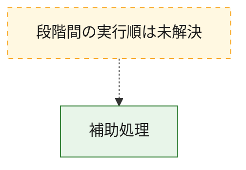
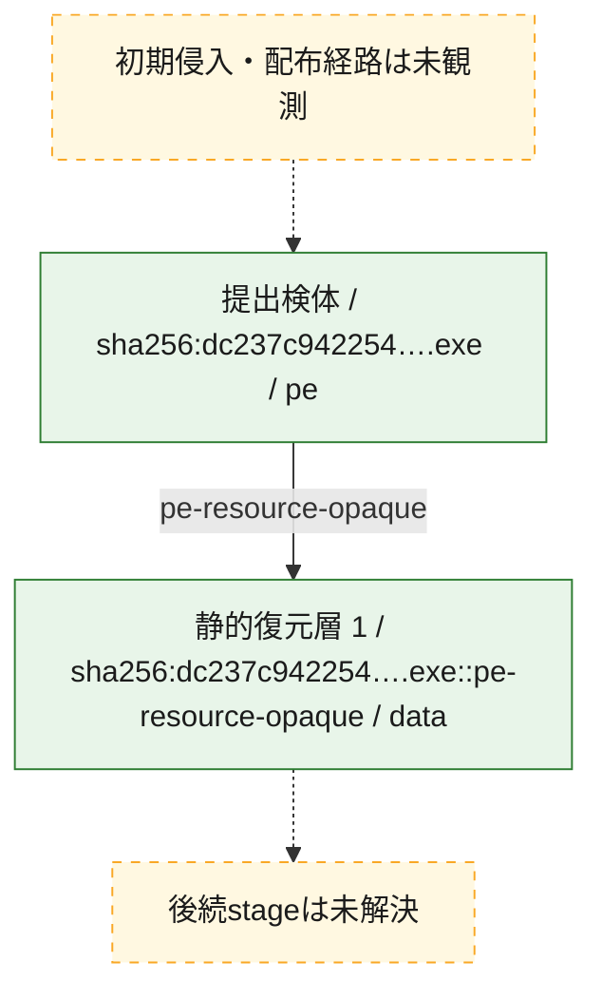
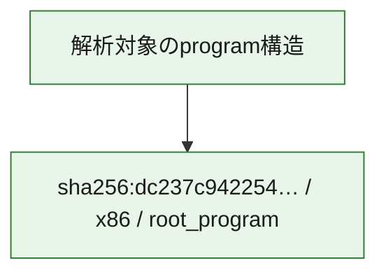

# 全体ロジック：dc237c942254a2e3fd20d89440f2ab33ab77c61ec1bca82c842446dd4b409377

代表関数から主要なmalware処理段階を自動分類できませんでした。

## 読み方

- phaseの掲載順は解析上の整理順です。observed_call_edgesがない段階間の実行順を断定しません。
- 図の実線は静的に観測した関係、点線と黄色のノードは未観測・未解決の関係を示します。
- 図は静的な要約であり、動的実行を再現するものではありません。
- 詳細な関数解説とfingerprintは[STATIC-LOGIC.md](STATIC-LOGIC.md)を参照してください。

## 静的可視化

### 実行フロー

### 感染チェーン

### モジュール関係

## 処理段階

### 1. 補助処理

主要処理を支える一般内部関数またはlibrary処理を確認します。
確度: `confirmed_static_function_evidence`

- `dc237c942254a2e3fd20d89440f2ab33ab77c61ec1bca82c842446dd4b409377:ghidra:0040100b` — 検体内部の一般処理を実装する関数です。 状態: `succeeded`、選定理由: `context_representative`, `small_program_complete_context`
- `dc237c942254a2e3fd20d89440f2ab33ab77c61ec1bca82c842446dd4b409377:ghidra:0040108f` — 検体内部の一般処理を実装する関数です。 状態: `succeeded`、選定理由: `context_representative`, `reviewed_call_centrality:2`, `small_program_complete_context`
- `dc237c942254a2e3fd20d89440f2ab33ab77c61ec1bca82c842446dd4b409377:ghidra:0040160d` — 検体内部の一般処理を実装する関数です。 状態: `succeeded`、選定理由: `context_representative`, `reviewed_call_centrality:4`, `small_program_complete_context`
- `dc237c942254a2e3fd20d89440f2ab33ab77c61ec1bca82c842446dd4b409377:ghidra:00401719` — 検体内部の一般処理を実装する関数です。 状態: `succeeded`、選定理由: `context_representative`, `reviewed_call_centrality:6`, `small_program_complete_context`
- `dc237c942254a2e3fd20d89440f2ab33ab77c61ec1bca82c842446dd4b409377:ghidra:0040181e` — 検体内部の一般処理を実装する関数です。 状態: `succeeded`、選定理由: `context_representative`, `reviewed_call_centrality:1`, `small_program_complete_context`
- `dc237c942254a2e3fd20d89440f2ab33ab77c61ec1bca82c842446dd4b409377:ghidra:0040184b` — 検体内部の一般処理を実装する関数です。 状態: `succeeded`、選定理由: `context_representative`, `reviewed_call_centrality:7`, `small_program_complete_context`
- `dc237c942254a2e3fd20d89440f2ab33ab77c61ec1bca82c842446dd4b409377:ghidra:00401993` — 検体内部の一般処理を実装する関数です。 状態: `succeeded`、選定理由: `context_representative`, `reviewed_call_centrality:4`, `small_program_complete_context`
- `dc237c942254a2e3fd20d89440f2ab33ab77c61ec1bca82c842446dd4b409377:ghidra:00401a52` — 検体内部の一般処理を実装する関数です。 状態: `succeeded`、選定理由: `context_representative`, `reviewed_call_centrality:1`, `small_program_complete_context`

## 観測したcall関係

- `ghidra-function:1f54d99c6d099383ee3bea2a` → `ghidra-external:46bab566116bae738b55a5eb` （`unclassified` → `unclassified`）
- `ghidra-function:1f54d99c6d099383ee3bea2a` → `ghidra-external:4870f694a9fbdcd6d4c553f1` （`unclassified` → `unclassified`）
- `ghidra-function:1f54d99c6d099383ee3bea2a` → `ghidra-external:4e65b4ba1f74aa4ac42080e8` （`unclassified` → `unclassified`）
- `ghidra-function:1f54d99c6d099383ee3bea2a` → `ghidra-external:76a8e0cddc065b85db520a68` （`unclassified` → `unclassified`）
- `ghidra-function:40eca455a98c7cc7e8dcd907` → `ghidra-external:1d6c7cf078cd9776101130b5` （`unclassified` → `unclassified`）
- `ghidra-function:40eca455a98c7cc7e8dcd907` → `ghidra-external:453e56140a3917aa373a11a8` （`unclassified` → `unclassified`）
- `ghidra-function:40eca455a98c7cc7e8dcd907` → `ghidra-external:71359eb1fbe9be392725191d` （`unclassified` → `unclassified`）
- `ghidra-function:40eca455a98c7cc7e8dcd907` → `ghidra-external:771b969d419eb244cba08782` （`unclassified` → `unclassified`）
- `ghidra-function:40eca455a98c7cc7e8dcd907` → `ghidra-external:a6548a3459e577aa16e12114` （`unclassified` → `unclassified`）
- `ghidra-function:40eca455a98c7cc7e8dcd907` → `ghidra-external:e771e909940e695fd1f86f05` （`unclassified` → `unclassified`）
- `ghidra-function:40eca455a98c7cc7e8dcd907` → `ghidra-external:fde61456629a208ba5c144c1` （`unclassified` → `unclassified`）
- `ghidra-function:8c283120f341653d2a09a75f` → `ghidra-external:1d6c7cf078cd9776101130b5` （`unclassified` → `unclassified`）
- `ghidra-function:8c283120f341653d2a09a75f` → `ghidra-external:c57f21e11b40c0c4ab49dfbd` （`unclassified` → `unclassified`）
- `ghidra-function:8ee859b37346ea7addf9d2fe` → `ghidra-external:4522618241ff50ed7c9e8694` （`unclassified` → `unclassified`）
- `ghidra-function:a9b2b117ba8ef4615e6b059f` → `ghidra-external:84a7f5242081ddc8d6fbb3f6` （`unclassified` → `unclassified`）
- `ghidra-function:e17430402402f0196eb0e338` → `ghidra-external:0a2acdb891b03be206bd003c` （`unclassified` → `unclassified`）
- `ghidra-function:e17430402402f0196eb0e338` → `ghidra-external:2641e155c65d6cb78c149051` （`unclassified` → `unclassified`）
- `ghidra-function:e17430402402f0196eb0e338` → `ghidra-external:4edad913035cc231b8c8e33a` （`unclassified` → `unclassified`）
- `ghidra-function:e17430402402f0196eb0e338` → `ghidra-external:974652dd9706c3fa172e47e1` （`unclassified` → `unclassified`）
- `ghidra-function:e17430402402f0196eb0e338` → `ghidra-external:9985bed973f184ff828b5f76` （`unclassified` → `unclassified`）
- `ghidra-function:e17430402402f0196eb0e338` → `ghidra-external:d40f025cbd772b4a332fa84a` （`unclassified` → `unclassified`）
- `ghidra-function:edab83bb140399e9b18fa89e` → `ghidra-external:6994bd5b15e0a1dd3e49b849` （`unclassified` → `unclassified`）
- `ghidra-function:edab83bb140399e9b18fa89e` → `ghidra-external:84a7f5242081ddc8d6fbb3f6` （`unclassified` → `unclassified`）
- `ghidra-function:edab83bb140399e9b18fa89e` → `ghidra-external:b9a368c6a61f3f0a30b6edda` （`unclassified` → `unclassified`）
- `ghidra-function:edab83bb140399e9b18fa89e` → `ghidra-external:d83eb43d1bc307452b82bb4b` （`unclassified` → `unclassified`）

## 解析範囲と制約

- 選定外関数は全体inventoryへ残しますが、関数本体の個別解説対象にはしていません。
- indirect call、難読化、packer、VM、壊れたcontrol flowによりcall関係が欠落する場合があります。
- 文書は静的解析に基づき、検体実行や外部通信による動的確認は行っていません。
