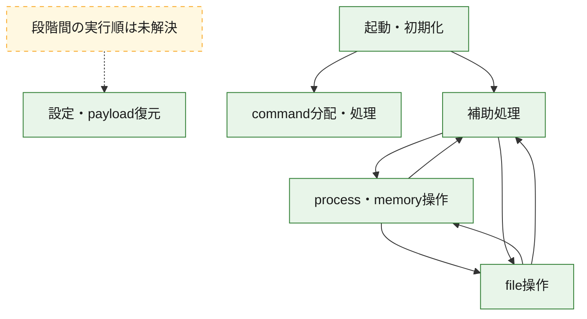
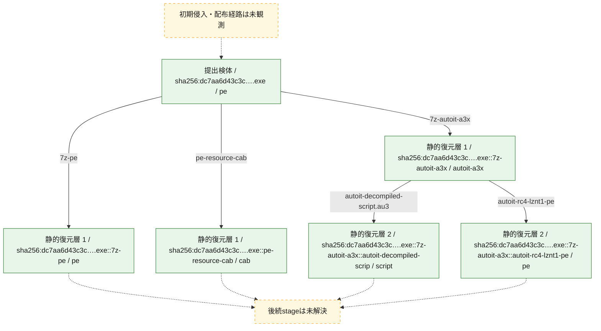
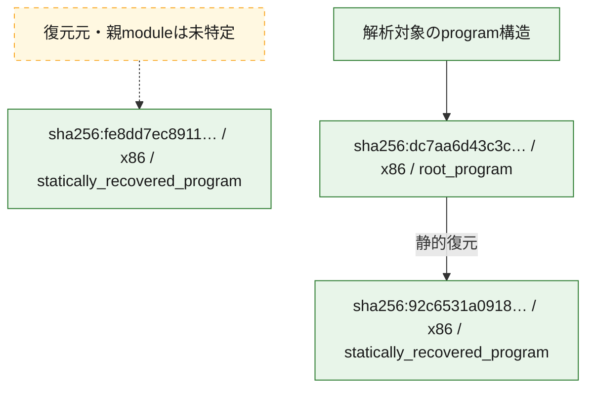

# 全体ロジック：dc7aa6d43c3ce8abb707b40607fda5ff776f9b0c572d98db3c3f88b78c9fc1b2

代表関数の静的証跡から、起動・初期化、設定・payload復元、process・memory操作、command分配・処理、file操作の処理群を確認しました。

## 読み方

- phaseの掲載順は解析上の整理順です。observed_call_edgesがない段階間の実行順を断定しません。
- 図の実線は静的に観測した関係、点線と黄色のノードは未観測・未解決の関係を示します。
- 図は静的な要約であり、動的実行を再現するものではありません。
- 詳細な関数解説とfingerprintは[STATIC-LOGIC.md](STATIC-LOGIC.md)を参照してください。

## 静的可視化

### 実行フロー

### 感染チェーン

### モジュール関係

## 処理段階

### 1. 起動・初期化

entry pointから初期化と後続処理への移行を確認します。
確度: `confirmed_static_function_evidence`

- `fe8dd7ec8911d8fd51a7e542640b64ec0aeab83b08669131316e896f63f89fcc:ghidra:140001030` — 初期化と主要処理への分岐を行う入口関数です。 状態: `succeeded`、選定理由: `call_graph_centrality:in=0,out=2`, `entry_point`, `meaningful_symbol_name`, `reviewed_call_centrality:2`, `role:entrypoint`
- `92c6531a09180fae8b2aae7384b4cea9986762f0c271b35da09b4d0e733f9f45:ghidra:140025aa4` — 初期化と主要処理への分岐を行う入口関数です。 状態: `succeeded`、選定理由: `entry_point`, `meaningful_symbol_name`, `reviewed_call_centrality:22`, `role:entrypoint`
- `dc7aa6d43c3ce8abb707b40607fda5ff776f9b0c572d98db3c3f88b78c9fc1b2:ghidra:1400080c0` — 初期化と主要処理への分岐を行う入口関数です。 状態: `succeeded`、選定理由: `entry_point`, `meaningful_symbol_name`, `reviewed_call_centrality:18`, `role:entrypoint`

### 2. 設定・payload復元

設定、resource、payload、暗号化データの復元・変換を確認します。
確度: `confirmed_static_function_evidence`

- `fe8dd7ec8911d8fd51a7e542640b64ec0aeab83b08669131316e896f63f89fcc:ghidra:1400108e0` — 暗号、hash、encoding、または復号処理に関係する関数です。 状態: `succeeded`、選定理由: `call_graph_centrality:in=1,out=22`, `large_function:instructions=872`, `reviewed_call_centrality:24`, `reviewed_call_centrality:39`, `role:cryptographic_transform`

### 3. process・memory操作

process、thread、module、memory操作と実行移行を確認します。
確度: `confirmed_static_function_evidence`

- `fe8dd7ec8911d8fd51a7e542640b64ec0aeab83b08669131316e896f63f89fcc:ghidra:1400010b0` — process、thread、module、またはmemory操作に関係する関数です。 状態: `succeeded`、選定理由: `call_graph_centrality:in=1,out=8`, `large_function:instructions=102`, `reviewed_call_centrality:16`, `reviewed_call_centrality:9`, `role:process_or_memory_operation`
- `fe8dd7ec8911d8fd51a7e542640b64ec0aeab83b08669131316e896f63f89fcc:ghidra:140005350` — process、thread、module、またはmemory操作に関係する関数です。 状態: `succeeded`、選定理由: `call_graph_centrality:in=1,out=23`, `large_function:instructions=1451`, `reviewed_call_centrality:26`, `reviewed_call_centrality:43`, `role:process_or_memory_operation`
- `fe8dd7ec8911d8fd51a7e542640b64ec0aeab83b08669131316e896f63f89fcc:ghidra:140007500` — process、thread、module、またはmemory操作に関係する関数です。 状態: `succeeded`、選定理由: `call_graph_centrality:in=1,out=2`, `reviewed_call_centrality:3`, `reviewed_call_centrality:5`, `role:process_or_memory_operation`
- `fe8dd7ec8911d8fd51a7e542640b64ec0aeab83b08669131316e896f63f89fcc:ghidra:140009ef0` — process、thread、module、またはmemory操作に関係する関数です。 状態: `succeeded`、選定理由: `call_graph_centrality:in=1,out=46`, `large_function:instructions=1585`, `reviewed_call_centrality:47`, `reviewed_call_centrality:68`, `role:process_or_memory_operation`
- `fe8dd7ec8911d8fd51a7e542640b64ec0aeab83b08669131316e896f63f89fcc:ghidra:14000baf0` — process、thread、module、またはmemory操作に関係する関数です。 状態: `succeeded`、選定理由: `call_graph_centrality:in=1,out=29`, `large_function:instructions=760`, `reviewed_call_centrality:33`, `reviewed_call_centrality:36`, `role:process_or_memory_operation`
- `fe8dd7ec8911d8fd51a7e542640b64ec0aeab83b08669131316e896f63f89fcc:ghidra:14000e070` — process、thread、module、またはmemory操作に関係する関数です。 状態: `succeeded`、選定理由: `call_graph_centrality:in=1,out=23`, `large_function:instructions=782`, `reviewed_call_centrality:24`, `reviewed_call_centrality:38`, `role:process_or_memory_operation`
- `fe8dd7ec8911d8fd51a7e542640b64ec0aeab83b08669131316e896f63f89fcc:ghidra:14000f240` — process、thread、module、またはmemory操作に関係する関数です。 状態: `succeeded`、選定理由: `call_graph_centrality:in=2,out=3`, `large_function:instructions=120`, `reviewed_call_centrality:5`, `reviewed_call_centrality:7`, `role:process_or_memory_operation`
- `fe8dd7ec8911d8fd51a7e542640b64ec0aeab83b08669131316e896f63f89fcc:ghidra:140014c80` — process、thread、module、またはmemory操作に関係する関数です。 状態: `succeeded`、選定理由: `call_graph_centrality:in=1,out=3`, `reviewed_call_centrality:4`, `reviewed_call_centrality:6`, `role:process_or_memory_operation`
- `fe8dd7ec8911d8fd51a7e542640b64ec0aeab83b08669131316e896f63f89fcc:ghidra:14001d050` — process、thread、module、またはmemory操作に関係する関数です。 状態: `succeeded`、選定理由: `call_graph_centrality:in=1,out=3`, `reviewed_call_centrality:4`, `reviewed_call_centrality:6`, `role:process_or_memory_operation`
- `fe8dd7ec8911d8fd51a7e542640b64ec0aeab83b08669131316e896f63f89fcc:ghidra:14001d370` — process、thread、module、またはmemory操作に関係する関数です。 状態: `succeeded`、選定理由: `call_graph_centrality:in=1,out=3`, `large_function:instructions=107`, `reviewed_call_centrality:4`, `reviewed_call_centrality:6`, `role:process_or_memory_operation`
- `dc7aa6d43c3ce8abb707b40607fda5ff776f9b0c572d98db3c3f88b78c9fc1b2:ghidra:14000163c` — process、thread、module、またはmemory操作に関係する関数です。 状態: `succeeded`、選定理由: `context_representative`, `reviewed_call_centrality:13`, `role:process_or_memory_operation`
- `dc7aa6d43c3ce8abb707b40607fda5ff776f9b0c572d98db3c3f88b78c9fc1b2:ghidra:1400020e8` — process、thread、module、またはmemory操作に関係する関数です。 状態: `succeeded`、選定理由: `context_representative`, `reviewed_call_centrality:28`, `role:process_or_memory_operation`
- `dc7aa6d43c3ce8abb707b40607fda5ff776f9b0c572d98db3c3f88b78c9fc1b2:ghidra:1400033a8` — process、thread、module、またはmemory操作に関係する関数です。 状態: `succeeded`、選定理由: `context_representative`, `reviewed_call_centrality:31`, `role:process_or_memory_operation`
- `dc7aa6d43c3ce8abb707b40607fda5ff776f9b0c572d98db3c3f88b78c9fc1b2:ghidra:140003c80` — process、thread、module、またはmemory操作に関係する関数です。 状態: `succeeded`、選定理由: `context_representative`, `reviewed_call_centrality:22`, `role:process_or_memory_operation`

### 4. command分配・処理

受信commandやtaskの解釈、分配、個別handlerへの移行を確認します。
確度: `confirmed_static_function_evidence_with_limits`

- `92c6531a09180fae8b2aae7384b4cea9986762f0c271b35da09b4d0e733f9f45:ghidra:140049950` — commandの解釈、分配、または個別処理を担当する関数です。 状態: `limited_bad_instruction_or_flow`、選定理由: `meaningful_symbol_name`, `reviewed_call_centrality:1`, `role:command_dispatch_or_handler`

### 5. file操作

fileやdirectoryの作成、読書き、削除を確認します。
確度: `confirmed_static_function_evidence_with_limits`

- `fe8dd7ec8911d8fd51a7e542640b64ec0aeab83b08669131316e896f63f89fcc:ghidra:140001de0` — fileまたはdirectoryの読書き・管理に関係する関数です。 状態: `limited_bad_instruction_or_flow`、選定理由: `call_graph_centrality:in=1,out=32`, `large_function:instructions=2565`, `reviewed_call_centrality:35`, `reviewed_call_centrality:51`, `role:file_operation`
- `fe8dd7ec8911d8fd51a7e542640b64ec0aeab83b08669131316e896f63f89fcc:ghidra:1400049e0` — fileまたはdirectoryの読書き・管理に関係する関数です。 状態: `succeeded`、選定理由: `call_graph_centrality:in=2,out=9`, `large_function:instructions=111`, `reviewed_call_centrality:12`, `reviewed_call_centrality:20`, `role:file_operation`
- `fe8dd7ec8911d8fd51a7e542640b64ec0aeab83b08669131316e896f63f89fcc:ghidra:140005070` — fileまたはdirectoryの読書き・管理に関係する関数です。 状態: `succeeded`、選定理由: `call_graph_centrality:in=1,out=10`, `large_function:instructions=88`, `reviewed_call_centrality:12`, `reviewed_call_centrality:19`, `role:file_operation`
- `fe8dd7ec8911d8fd51a7e542640b64ec0aeab83b08669131316e896f63f89fcc:ghidra:14000fa70` — fileまたはdirectoryの読書き・管理に関係する関数です。 状態: `succeeded`、選定理由: `call_graph_centrality:in=1,out=8`, `large_function:instructions=355`, `reviewed_call_centrality:14`, `reviewed_call_centrality:9`, `role:file_operation`
- `fe8dd7ec8911d8fd51a7e542640b64ec0aeab83b08669131316e896f63f89fcc:ghidra:140011f60` — fileまたはdirectoryの読書き・管理に関係する関数です。 状態: `succeeded`、選定理由: `call_graph_centrality:in=2,out=8`, `large_function:instructions=288`, `reviewed_call_centrality:10`, `reviewed_call_centrality:13`, `role:file_operation`
- `fe8dd7ec8911d8fd51a7e542640b64ec0aeab83b08669131316e896f63f89fcc:ghidra:140012420` — fileまたはdirectoryの読書き・管理に関係する関数です。 状態: `succeeded`、選定理由: `call_graph_centrality:in=1,out=18`, `large_function:instructions=585`, `reviewed_call_centrality:19`, `reviewed_call_centrality:27`, `role:file_operation`
- `fe8dd7ec8911d8fd51a7e542640b64ec0aeab83b08669131316e896f63f89fcc:ghidra:140012e10` — fileまたはdirectoryの読書き・管理に関係する関数です。 状態: `succeeded`、選定理由: `call_graph_centrality:in=1,out=18`, `large_function:instructions=329`, `reviewed_call_centrality:19`, `reviewed_call_centrality:24`, `role:file_operation`
- `fe8dd7ec8911d8fd51a7e542640b64ec0aeab83b08669131316e896f63f89fcc:ghidra:1400135f0` — fileまたはdirectoryの読書き・管理に関係する関数です。 状態: `succeeded`、選定理由: `call_graph_centrality:in=1,out=6`, `large_function:instructions=255`, `reviewed_call_centrality:10`, `reviewed_call_centrality:7`, `role:file_operation`
- `fe8dd7ec8911d8fd51a7e542640b64ec0aeab83b08669131316e896f63f89fcc:ghidra:140013a50` — fileまたはdirectoryの読書き・管理に関係する関数です。 状態: `succeeded`、選定理由: `call_graph_centrality:in=1,out=13`, `large_function:instructions=774`, `reviewed_call_centrality:14`, `reviewed_call_centrality:24`, `role:file_operation`
- `fe8dd7ec8911d8fd51a7e542640b64ec0aeab83b08669131316e896f63f89fcc:ghidra:1400146e0` — fileまたはdirectoryの読書き・管理に関係する関数です。 状態: `succeeded`、選定理由: `call_graph_centrality:in=2,out=8`, `large_function:instructions=148`, `reviewed_call_centrality:11`, `reviewed_call_centrality:14`, `role:file_operation`
- `fe8dd7ec8911d8fd51a7e542640b64ec0aeab83b08669131316e896f63f89fcc:ghidra:1400149e0` — fileまたはdirectoryの読書き・管理に関係する関数です。 状態: `succeeded`、選定理由: `call_graph_centrality:in=3,out=8`, `large_function:instructions=119`, `reviewed_call_centrality:11`, `reviewed_call_centrality:14`, `role:file_operation`
- `fe8dd7ec8911d8fd51a7e542640b64ec0aeab83b08669131316e896f63f89fcc:ghidra:140018480` — fileまたはdirectoryの読書き・管理に関係する関数です。 状態: `succeeded`、選定理由: `call_graph_centrality:in=1,out=9`, `large_function:instructions=246`, `reviewed_call_centrality:11`, `reviewed_call_centrality:14`, `role:file_operation`
- `fe8dd7ec8911d8fd51a7e542640b64ec0aeab83b08669131316e896f63f89fcc:ghidra:140018a90` — fileまたはdirectoryの読書き・管理に関係する関数です。 状態: `succeeded`、選定理由: `call_graph_centrality:in=1,out=9`, `large_function:instructions=497`, `reviewed_call_centrality:10`, `reviewed_call_centrality:14`, `role:file_operation`
- `fe8dd7ec8911d8fd51a7e542640b64ec0aeab83b08669131316e896f63f89fcc:ghidra:140019660` — fileまたはdirectoryの読書き・管理に関係する関数です。 状態: `limited_bad_instruction_or_flow`、選定理由: `call_graph_centrality:in=9,out=9`, `large_function:instructions=143`, `reviewed_call_centrality:19`, `reviewed_call_centrality:22`, `role:file_operation`
- `fe8dd7ec8911d8fd51a7e542640b64ec0aeab83b08669131316e896f63f89fcc:ghidra:14001aeb0` — fileまたはdirectoryの読書き・管理に関係する関数です。 状態: `succeeded`、選定理由: `call_graph_centrality:in=1,out=8`, `large_function:instructions=133`, `reviewed_call_centrality:11`, `reviewed_call_centrality:15`, `role:file_operation`
- `fe8dd7ec8911d8fd51a7e542640b64ec0aeab83b08669131316e896f63f89fcc:ghidra:14001c2f0` — fileまたはdirectoryの読書き・管理に関係する関数です。 状態: `succeeded`、選定理由: `call_graph_centrality:in=1,out=7`, `large_function:instructions=97`, `reviewed_call_centrality:11`, `reviewed_call_centrality:8`, `role:file_operation`
- `fe8dd7ec8911d8fd51a7e542640b64ec0aeab83b08669131316e896f63f89fcc:ghidra:14001cc60` — fileまたはdirectoryの読書き・管理に関係する関数です。 状態: `succeeded`、選定理由: `call_graph_centrality:in=2,out=10`, `large_function:instructions=252`, `reviewed_call_centrality:12`, `reviewed_call_centrality:16`, `role:file_operation`
- `fe8dd7ec8911d8fd51a7e542640b64ec0aeab83b08669131316e896f63f89fcc:ghidra:14001db30` — fileまたはdirectoryの読書き・管理に関係する関数です。 状態: `limited_bad_instruction_or_flow`、選定理由: `call_graph_centrality:in=1,out=2`, `large_function:instructions=92`, `reviewed_call_centrality:4`, `role:file_operation`
- `dc7aa6d43c3ce8abb707b40607fda5ff776f9b0c572d98db3c3f88b78c9fc1b2:ghidra:1400023bc` — fileまたはdirectoryの読書き・管理に関係する関数です。 状態: `succeeded`、選定理由: `context_representative`, `reviewed_call_centrality:19`, `role:file_operation`
- `dc7aa6d43c3ce8abb707b40607fda5ff776f9b0c572d98db3c3f88b78c9fc1b2:ghidra:140003644` — fileまたはdirectoryの読書き・管理に関係する関数です。 状態: `succeeded`、選定理由: `context_representative`, `reviewed_call_centrality:18`, `role:file_operation`

### 6. 補助処理

主要処理を支える一般内部関数またはlibrary処理を確認します。
確度: `confirmed_static_function_evidence_with_limits`

- `fe8dd7ec8911d8fd51a7e542640b64ec0aeab83b08669131316e896f63f89fcc:ghidra:1400089c0` — 検体内部の一般処理を実装する関数です。 状態: `succeeded`、選定理由: `call_graph_centrality:in=2,out=21`, `large_function:instructions=1239`, `reviewed_call_centrality:23`, `reviewed_call_centrality:24`
- `fe8dd7ec8911d8fd51a7e542640b64ec0aeab83b08669131316e896f63f89fcc:ghidra:140019d00` — 検体内部の一般処理を実装する関数です。 状態: `succeeded`、選定理由: `call_graph_centrality:in=1,out=6`, `large_function:instructions=1145`, `reviewed_call_centrality:7`
- `92c6531a09180fae8b2aae7384b4cea9986762f0c271b35da09b4d0e733f9f45:ghidra:140001000` — 検体内部の一般処理を実装する関数です。 状態: `succeeded`、選定理由: `context_representative`, `reviewed_call_centrality:2`
- `92c6531a09180fae8b2aae7384b4cea9986762f0c271b35da09b4d0e733f9f45:ghidra:14000102c` — 検体内部の一般処理を実装する関数です。 状態: `succeeded`、選定理由: `context_representative`, `reviewed_call_centrality:2`
- `92c6531a09180fae8b2aae7384b4cea9986762f0c271b35da09b4d0e733f9f45:ghidra:140001048` — 検体内部の一般処理を実装する関数です。 状態: `succeeded`、選定理由: `context_representative`, `reviewed_call_centrality:2`
- `92c6531a09180fae8b2aae7384b4cea9986762f0c271b35da09b4d0e733f9f45:ghidra:140001064` — 検体内部の一般処理を実装する関数です。 状態: `succeeded`、選定理由: `context_representative`, `reviewed_call_centrality:2`
- `92c6531a09180fae8b2aae7384b4cea9986762f0c271b35da09b4d0e733f9f45:ghidra:140001080` — 検体内部の一般処理を実装する関数です。 状態: `succeeded`、選定理由: `context_representative`, `reviewed_call_centrality:2`
- `92c6531a09180fae8b2aae7384b4cea9986762f0c271b35da09b4d0e733f9f45:ghidra:1400010b0` — 検体内部の一般処理を実装する関数です。 状態: `succeeded`、選定理由: `context_representative`, `reviewed_call_centrality:2`
- `92c6531a09180fae8b2aae7384b4cea9986762f0c271b35da09b4d0e733f9f45:ghidra:1400010cc` — 検体内部の一般処理を実装する関数です。 状態: `succeeded`、選定理由: `context_representative`, `reviewed_call_centrality:2`
- `92c6531a09180fae8b2aae7384b4cea9986762f0c271b35da09b4d0e733f9f45:ghidra:1400010e8` — 検体内部の一般処理を実装する関数です。 状態: `succeeded`、選定理由: `context_representative`, `reviewed_call_centrality:2`
- `92c6531a09180fae8b2aae7384b4cea9986762f0c271b35da09b4d0e733f9f45:ghidra:140001104` — 検体内部の一般処理を実装する関数です。 状態: `succeeded`、選定理由: `context_representative`, `reviewed_call_centrality:2`
- `92c6531a09180fae8b2aae7384b4cea9986762f0c271b35da09b4d0e733f9f45:ghidra:140001120` — 検体内部の一般処理を実装する関数です。 状態: `succeeded`、選定理由: `context_representative`, `reviewed_call_centrality:2`
- `92c6531a09180fae8b2aae7384b4cea9986762f0c271b35da09b4d0e733f9f45:ghidra:140001140` — 検体内部の一般処理を実装する関数です。 状態: `succeeded`、選定理由: `context_representative`, `reviewed_call_centrality:6`
- `92c6531a09180fae8b2aae7384b4cea9986762f0c271b35da09b4d0e733f9f45:ghidra:1400012a0` — 検体内部の一般処理を実装する関数です。 状態: `succeeded`、選定理由: `context_representative`, `reviewed_call_centrality:4`
- `92c6531a09180fae8b2aae7384b4cea9986762f0c271b35da09b4d0e733f9f45:ghidra:140001314` — 検体内部の一般処理を実装する関数です。 状態: `succeeded`、選定理由: `context_representative`, `reviewed_call_centrality:2`
- `92c6531a09180fae8b2aae7384b4cea9986762f0c271b35da09b4d0e733f9f45:ghidra:140001470` — 検体内部の一般処理を実装する関数です。 状態: `succeeded`、選定理由: `context_representative`, `reviewed_call_centrality:6`
- `92c6531a09180fae8b2aae7384b4cea9986762f0c271b35da09b4d0e733f9f45:ghidra:140001504` — 検体内部の一般処理を実装する関数です。 状態: `succeeded`、選定理由: `context_representative`, `reviewed_call_centrality:17`
- `92c6531a09180fae8b2aae7384b4cea9986762f0c271b35da09b4d0e733f9f45:ghidra:1400015ec` — 検体内部の一般処理を実装する関数です。 状態: `succeeded`、選定理由: `context_representative`, `reviewed_call_centrality:20`
- `92c6531a09180fae8b2aae7384b4cea9986762f0c271b35da09b4d0e733f9f45:ghidra:1400017fc` — 検体内部の一般処理を実装する関数です。 状態: `succeeded`、選定理由: `context_representative`, `reviewed_call_centrality:2`
- `92c6531a09180fae8b2aae7384b4cea9986762f0c271b35da09b4d0e733f9f45:ghidra:140001834` — 検体内部の一般処理を実装する関数です。 状態: `limited_bad_instruction_or_flow`、選定理由: `context_representative`, `reviewed_call_centrality:3`
- `92c6531a09180fae8b2aae7384b4cea9986762f0c271b35da09b4d0e733f9f45:ghidra:1400018b4` — 検体内部の一般処理を実装する関数です。 状態: `limited_bad_instruction_or_flow`、選定理由: `context_representative`, `reviewed_call_centrality:4`
- `92c6531a09180fae8b2aae7384b4cea9986762f0c271b35da09b4d0e733f9f45:ghidra:14000190c` — 検体内部の一般処理を実装する関数です。 状態: `succeeded`、選定理由: `context_representative`, `reviewed_call_centrality:4`
- `92c6531a09180fae8b2aae7384b4cea9986762f0c271b35da09b4d0e733f9f45:ghidra:140001948` — 検体内部の一般処理を実装する関数です。 状態: `succeeded`、選定理由: `context_representative`, `reviewed_call_centrality:4`
- `92c6531a09180fae8b2aae7384b4cea9986762f0c271b35da09b4d0e733f9f45:ghidra:140001990` — 検体内部の一般処理を実装する関数です。 状態: `succeeded`、選定理由: `context_representative`, `reviewed_call_centrality:10`
- `92c6531a09180fae8b2aae7384b4cea9986762f0c271b35da09b4d0e733f9f45:ghidra:140001aa8` — 検体内部の一般処理を実装する関数です。 状態: `succeeded`、選定理由: `context_representative`, `reviewed_call_centrality:19`
- `92c6531a09180fae8b2aae7384b4cea9986762f0c271b35da09b4d0e733f9f45:ghidra:140001c20` — 検体内部の一般処理を実装する関数です。 状態: `succeeded`、選定理由: `context_representative`, `reviewed_call_centrality:17`
- `92c6531a09180fae8b2aae7384b4cea9986762f0c271b35da09b4d0e733f9f45:ghidra:140001da4` — 検体内部の一般処理を実装する関数です。 状態: `succeeded`、選定理由: `context_representative`, `reviewed_call_centrality:17`
- `92c6531a09180fae8b2aae7384b4cea9986762f0c271b35da09b4d0e733f9f45:ghidra:140001f8c` — 検体内部の一般処理を実装する関数です。 状態: `succeeded`、選定理由: `context_representative`, `reviewed_call_centrality:13`
- `92c6531a09180fae8b2aae7384b4cea9986762f0c271b35da09b4d0e733f9f45:ghidra:140002014` — 検体内部の一般処理を実装する関数です。 状態: `succeeded`、選定理由: `context_representative`, `reviewed_call_centrality:12`
- `92c6531a09180fae8b2aae7384b4cea9986762f0c271b35da09b4d0e733f9f45:ghidra:140002120` — 検体内部の一般処理を実装する関数です。 状態: `succeeded`、選定理由: `context_representative`, `reviewed_call_centrality:6`
- `92c6531a09180fae8b2aae7384b4cea9986762f0c271b35da09b4d0e733f9f45:ghidra:1400021d4` — 検体内部の一般処理を実装する関数です。 状態: `succeeded`、選定理由: `context_representative`, `reviewed_call_centrality:2`
- `92c6531a09180fae8b2aae7384b4cea9986762f0c271b35da09b4d0e733f9f45:ghidra:140024ec8` — 検体内部の一般処理を実装する関数です。 状態: `succeeded`、選定理由: `meaningful_symbol_name`
- `dc7aa6d43c3ce8abb707b40607fda5ff776f9b0c572d98db3c3f88b78c9fc1b2:ghidra:140001508` — 検体内部の一般処理を実装する関数です。 状態: `succeeded`、選定理由: `context_representative`, `reviewed_call_centrality:2`
- `dc7aa6d43c3ce8abb707b40607fda5ff776f9b0c572d98db3c3f88b78c9fc1b2:ghidra:1400015c0` — 検体内部の一般処理を実装する関数です。 状態: `succeeded`、選定理由: `context_representative`, `reviewed_call_centrality:6`
- `dc7aa6d43c3ce8abb707b40607fda5ff776f9b0c572d98db3c3f88b78c9fc1b2:ghidra:14000173c` — 検体内部の一般処理を実装する関数です。 状態: `succeeded`、選定理由: `context_representative`, `reviewed_call_centrality:23`
- `dc7aa6d43c3ce8abb707b40607fda5ff776f9b0c572d98db3c3f88b78c9fc1b2:ghidra:140001910` — 検体内部の一般処理を実装する関数です。 状態: `succeeded`、選定理由: `context_representative`, `reviewed_call_centrality:12`
- `dc7aa6d43c3ce8abb707b40607fda5ff776f9b0c572d98db3c3f88b78c9fc1b2:ghidra:1400019d8` — 検体内部の一般処理を実装する関数です。 状態: `succeeded`、選定理由: `context_representative`, `reviewed_call_centrality:2`
- `dc7aa6d43c3ce8abb707b40607fda5ff776f9b0c572d98db3c3f88b78c9fc1b2:ghidra:140001a74` — 検体内部の一般処理を実装する関数です。 状態: `succeeded`、選定理由: `context_representative`, `reviewed_call_centrality:22`
- `dc7aa6d43c3ce8abb707b40607fda5ff776f9b0c572d98db3c3f88b78c9fc1b2:ghidra:140001ff4` — 検体内部の一般処理を実装する関数です。 状態: `succeeded`、選定理由: `context_representative`, `reviewed_call_centrality:16`
- `dc7aa6d43c3ce8abb707b40607fda5ff776f9b0c572d98db3c3f88b78c9fc1b2:ghidra:140002580` — 検体内部の一般処理を実装する関数です。 状態: `succeeded`、選定理由: `context_representative`, `reviewed_call_centrality:13`
- `dc7aa6d43c3ce8abb707b40607fda5ff776f9b0c572d98db3c3f88b78c9fc1b2:ghidra:140002634` — 検体内部の一般処理を実装する関数です。 状態: `succeeded`、選定理由: `context_representative`, `reviewed_call_centrality:11`
- `dc7aa6d43c3ce8abb707b40607fda5ff776f9b0c572d98db3c3f88b78c9fc1b2:ghidra:140002758` — 検体内部の一般処理を実装する関数です。 状態: `succeeded`、選定理由: `context_representative`, `reviewed_call_centrality:4`
- `dc7aa6d43c3ce8abb707b40607fda5ff776f9b0c572d98db3c3f88b78c9fc1b2:ghidra:1400027e0` — 検体内部の一般処理を実装する関数です。 状態: `succeeded`、選定理由: `context_representative`, `reviewed_call_centrality:3`
- `dc7aa6d43c3ce8abb707b40607fda5ff776f9b0c572d98db3c3f88b78c9fc1b2:ghidra:140002904` — 検体内部の一般処理を実装する関数です。 状態: `succeeded`、選定理由: `context_representative`, `reviewed_call_centrality:19`
- `dc7aa6d43c3ce8abb707b40607fda5ff776f9b0c572d98db3c3f88b78c9fc1b2:ghidra:140002b08` — 検体内部の一般処理を実装する関数です。 状態: `succeeded`、選定理由: `context_representative`, `reviewed_call_centrality:16`
- `dc7aa6d43c3ce8abb707b40607fda5ff776f9b0c572d98db3c3f88b78c9fc1b2:ghidra:140002d10` — 検体内部の一般処理を実装する関数です。 状態: `succeeded`、選定理由: `context_representative`, `reviewed_call_centrality:13`
- `dc7aa6d43c3ce8abb707b40607fda5ff776f9b0c572d98db3c3f88b78c9fc1b2:ghidra:140002f54` — 検体内部の一般処理を実装する関数です。 状態: `succeeded`、選定理由: `context_representative`, `reviewed_call_centrality:18`
- `dc7aa6d43c3ce8abb707b40607fda5ff776f9b0c572d98db3c3f88b78c9fc1b2:ghidra:1400030a4` — 検体内部の一般処理を実装する関数です。 状態: `succeeded`、選定理由: `context_representative`, `reviewed_call_centrality:27`
- `dc7aa6d43c3ce8abb707b40607fda5ff776f9b0c572d98db3c3f88b78c9fc1b2:ghidra:1400037e0` — 検体内部の一般処理を実装する関数です。 状態: `succeeded`、選定理由: `context_representative`, `reviewed_call_centrality:2`
- `dc7aa6d43c3ce8abb707b40607fda5ff776f9b0c572d98db3c3f88b78c9fc1b2:ghidra:140003830` — 検体内部の一般処理を実装する関数です。 状態: `succeeded`、選定理由: `context_representative`, `reviewed_call_centrality:19`
- `dc7aa6d43c3ce8abb707b40607fda5ff776f9b0c572d98db3c3f88b78c9fc1b2:ghidra:140003940` — 検体内部の一般処理を実装する関数です。 状態: `succeeded`、選定理由: `context_representative`, `reviewed_call_centrality:29`
- `dc7aa6d43c3ce8abb707b40607fda5ff776f9b0c572d98db3c3f88b78c9fc1b2:ghidra:140003be0` — 検体内部の一般処理を実装する関数です。 状態: `succeeded`、選定理由: `context_representative`, `reviewed_call_centrality:11`
- `dc7aa6d43c3ce8abb707b40607fda5ff776f9b0c572d98db3c3f88b78c9fc1b2:ghidra:140003e64` — 検体内部の一般処理を実装する関数です。 状態: `succeeded`、選定理由: `context_representative`, `reviewed_call_centrality:7`
- `dc7aa6d43c3ce8abb707b40607fda5ff776f9b0c572d98db3c3f88b78c9fc1b2:ghidra:140003efc` — 検体内部の一般処理を実装する関数です。 状態: `succeeded`、選定理由: `context_representative`, `reviewed_call_centrality:12`
- `dc7aa6d43c3ce8abb707b40607fda5ff776f9b0c572d98db3c3f88b78c9fc1b2:ghidra:140004220` — 検体内部の一般処理を実装する関数です。 状態: `succeeded`、選定理由: `context_representative`, `reviewed_call_centrality:13`
- `dc7aa6d43c3ce8abb707b40607fda5ff776f9b0c572d98db3c3f88b78c9fc1b2:ghidra:140004360` — 検体内部の一般処理を実装する関数です。 状態: `succeeded`、選定理由: `context_representative`, `reviewed_call_centrality:32`
- `dc7aa6d43c3ce8abb707b40607fda5ff776f9b0c572d98db3c3f88b78c9fc1b2:ghidra:140008b40` — 検体内部の一般処理を実装する関数です。 状態: `succeeded`、選定理由: `meaningful_symbol_name`, `reviewed_call_centrality:5`

## 観測したcall関係

- `92c6531a09180fae8b2aae7384b4cea9986762f0c271b35da09b4d0e733f9f45:ghidra:1400012a0` → `92c6531a09180fae8b2aae7384b4cea9986762f0c271b35da09b4d0e733f9f45:ghidra:140001504` （`support` → `support`）
- `92c6531a09180fae8b2aae7384b4cea9986762f0c271b35da09b4d0e733f9f45:ghidra:140001504` → `92c6531a09180fae8b2aae7384b4cea9986762f0c271b35da09b4d0e733f9f45:ghidra:140002120` （`support` → `support`）
- `92c6531a09180fae8b2aae7384b4cea9986762f0c271b35da09b4d0e733f9f45:ghidra:1400015ec` → `92c6531a09180fae8b2aae7384b4cea9986762f0c271b35da09b4d0e733f9f45:ghidra:1400017fc` （`support` → `support`）
- `92c6531a09180fae8b2aae7384b4cea9986762f0c271b35da09b4d0e733f9f45:ghidra:1400018b4` → `92c6531a09180fae8b2aae7384b4cea9986762f0c271b35da09b4d0e733f9f45:ghidra:14000190c` （`support` → `support`）
- `92c6531a09180fae8b2aae7384b4cea9986762f0c271b35da09b4d0e733f9f45:ghidra:140001948` → `92c6531a09180fae8b2aae7384b4cea9986762f0c271b35da09b4d0e733f9f45:ghidra:140001990` （`support` → `support`）
- `92c6531a09180fae8b2aae7384b4cea9986762f0c271b35da09b4d0e733f9f45:ghidra:140001aa8` → `92c6531a09180fae8b2aae7384b4cea9986762f0c271b35da09b4d0e733f9f45:ghidra:140001c20` （`support` → `support`）
- `92c6531a09180fae8b2aae7384b4cea9986762f0c271b35da09b4d0e733f9f45:ghidra:140001aa8` → `92c6531a09180fae8b2aae7384b4cea9986762f0c271b35da09b4d0e733f9f45:ghidra:140001da4` （`support` → `support`）
- `92c6531a09180fae8b2aae7384b4cea9986762f0c271b35da09b4d0e733f9f45:ghidra:140001aa8` → `92c6531a09180fae8b2aae7384b4cea9986762f0c271b35da09b4d0e733f9f45:ghidra:140001f8c` （`support` → `support`）
- `92c6531a09180fae8b2aae7384b4cea9986762f0c271b35da09b4d0e733f9f45:ghidra:140001aa8` → `92c6531a09180fae8b2aae7384b4cea9986762f0c271b35da09b4d0e733f9f45:ghidra:140002014` （`support` → `support`）
- `92c6531a09180fae8b2aae7384b4cea9986762f0c271b35da09b4d0e733f9f45:ghidra:140001c20` → `92c6531a09180fae8b2aae7384b4cea9986762f0c271b35da09b4d0e733f9f45:ghidra:140001f8c` （`support` → `support`）
- `92c6531a09180fae8b2aae7384b4cea9986762f0c271b35da09b4d0e733f9f45:ghidra:140001c20` → `92c6531a09180fae8b2aae7384b4cea9986762f0c271b35da09b4d0e733f9f45:ghidra:140002014` （`support` → `support`）
- `92c6531a09180fae8b2aae7384b4cea9986762f0c271b35da09b4d0e733f9f45:ghidra:140001da4` → `92c6531a09180fae8b2aae7384b4cea9986762f0c271b35da09b4d0e733f9f45:ghidra:140001f8c` （`support` → `support`）
- `92c6531a09180fae8b2aae7384b4cea9986762f0c271b35da09b4d0e733f9f45:ghidra:140001da4` → `92c6531a09180fae8b2aae7384b4cea9986762f0c271b35da09b4d0e733f9f45:ghidra:140002014` （`support` → `support`）
- `92c6531a09180fae8b2aae7384b4cea9986762f0c271b35da09b4d0e733f9f45:ghidra:140002014` → `92c6531a09180fae8b2aae7384b4cea9986762f0c271b35da09b4d0e733f9f45:ghidra:140002120` （`support` → `support`）
- `92c6531a09180fae8b2aae7384b4cea9986762f0c271b35da09b4d0e733f9f45:ghidra:140002120` → `92c6531a09180fae8b2aae7384b4cea9986762f0c271b35da09b4d0e733f9f45:ghidra:1400021d4` （`support` → `support`）
- `92c6531a09180fae8b2aae7384b4cea9986762f0c271b35da09b4d0e733f9f45:ghidra:140025aa4` → `92c6531a09180fae8b2aae7384b4cea9986762f0c271b35da09b4d0e733f9f45:ghidra:140049950` （`startup` → `dispatch`）
- `dc7aa6d43c3ce8abb707b40607fda5ff776f9b0c572d98db3c3f88b78c9fc1b2:ghidra:14000163c` → `dc7aa6d43c3ce8abb707b40607fda5ff776f9b0c572d98db3c3f88b78c9fc1b2:ghidra:140008b40` （`execution` → `support`）
- `dc7aa6d43c3ce8abb707b40607fda5ff776f9b0c572d98db3c3f88b78c9fc1b2:ghidra:14000173c` → `dc7aa6d43c3ce8abb707b40607fda5ff776f9b0c572d98db3c3f88b78c9fc1b2:ghidra:14000163c` （`support` → `execution`）
- `dc7aa6d43c3ce8abb707b40607fda5ff776f9b0c572d98db3c3f88b78c9fc1b2:ghidra:140001a74` → `dc7aa6d43c3ce8abb707b40607fda5ff776f9b0c572d98db3c3f88b78c9fc1b2:ghidra:140001508` （`support` → `support`）
- `dc7aa6d43c3ce8abb707b40607fda5ff776f9b0c572d98db3c3f88b78c9fc1b2:ghidra:140001a74` → `dc7aa6d43c3ce8abb707b40607fda5ff776f9b0c572d98db3c3f88b78c9fc1b2:ghidra:1400015c0` （`support` → `support`）
- `dc7aa6d43c3ce8abb707b40607fda5ff776f9b0c572d98db3c3f88b78c9fc1b2:ghidra:140001a74` → `dc7aa6d43c3ce8abb707b40607fda5ff776f9b0c572d98db3c3f88b78c9fc1b2:ghidra:1400019d8` （`support` → `support`）
- `dc7aa6d43c3ce8abb707b40607fda5ff776f9b0c572d98db3c3f88b78c9fc1b2:ghidra:140001a74` → `dc7aa6d43c3ce8abb707b40607fda5ff776f9b0c572d98db3c3f88b78c9fc1b2:ghidra:140002d10` （`support` → `support`）
- `dc7aa6d43c3ce8abb707b40607fda5ff776f9b0c572d98db3c3f88b78c9fc1b2:ghidra:1400020e8` → `dc7aa6d43c3ce8abb707b40607fda5ff776f9b0c572d98db3c3f88b78c9fc1b2:ghidra:1400015c0` （`execution` → `support`）
- `dc7aa6d43c3ce8abb707b40607fda5ff776f9b0c572d98db3c3f88b78c9fc1b2:ghidra:1400023bc` → `dc7aa6d43c3ce8abb707b40607fda5ff776f9b0c572d98db3c3f88b78c9fc1b2:ghidra:140001508` （`file_activity` → `support`）
- `dc7aa6d43c3ce8abb707b40607fda5ff776f9b0c572d98db3c3f88b78c9fc1b2:ghidra:140002634` → `dc7aa6d43c3ce8abb707b40607fda5ff776f9b0c572d98db3c3f88b78c9fc1b2:ghidra:140002580` （`support` → `support`）
- `dc7aa6d43c3ce8abb707b40607fda5ff776f9b0c572d98db3c3f88b78c9fc1b2:ghidra:1400027e0` → `dc7aa6d43c3ce8abb707b40607fda5ff776f9b0c572d98db3c3f88b78c9fc1b2:ghidra:1400015c0` （`support` → `support`）
- `dc7aa6d43c3ce8abb707b40607fda5ff776f9b0c572d98db3c3f88b78c9fc1b2:ghidra:140002b08` → `dc7aa6d43c3ce8abb707b40607fda5ff776f9b0c572d98db3c3f88b78c9fc1b2:ghidra:140002904` （`support` → `support`）
- `dc7aa6d43c3ce8abb707b40607fda5ff776f9b0c572d98db3c3f88b78c9fc1b2:ghidra:140002f54` → `dc7aa6d43c3ce8abb707b40607fda5ff776f9b0c572d98db3c3f88b78c9fc1b2:ghidra:140001ff4` （`support` → `support`）
- `dc7aa6d43c3ce8abb707b40607fda5ff776f9b0c572d98db3c3f88b78c9fc1b2:ghidra:140002f54` → `dc7aa6d43c3ce8abb707b40607fda5ff776f9b0c572d98db3c3f88b78c9fc1b2:ghidra:140002634` （`support` → `support`）
- `dc7aa6d43c3ce8abb707b40607fda5ff776f9b0c572d98db3c3f88b78c9fc1b2:ghidra:140002f54` → `dc7aa6d43c3ce8abb707b40607fda5ff776f9b0c572d98db3c3f88b78c9fc1b2:ghidra:1400030a4` （`support` → `support`）
- `dc7aa6d43c3ce8abb707b40607fda5ff776f9b0c572d98db3c3f88b78c9fc1b2:ghidra:140002f54` → `dc7aa6d43c3ce8abb707b40607fda5ff776f9b0c572d98db3c3f88b78c9fc1b2:ghidra:1400033a8` （`support` → `execution`）
- `dc7aa6d43c3ce8abb707b40607fda5ff776f9b0c572d98db3c3f88b78c9fc1b2:ghidra:140002f54` → `dc7aa6d43c3ce8abb707b40607fda5ff776f9b0c572d98db3c3f88b78c9fc1b2:ghidra:140003644` （`support` → `file_activity`）
- `dc7aa6d43c3ce8abb707b40607fda5ff776f9b0c572d98db3c3f88b78c9fc1b2:ghidra:140002f54` → `dc7aa6d43c3ce8abb707b40607fda5ff776f9b0c572d98db3c3f88b78c9fc1b2:ghidra:140008b40` （`support` → `support`）
- `dc7aa6d43c3ce8abb707b40607fda5ff776f9b0c572d98db3c3f88b78c9fc1b2:ghidra:1400030a4` → `dc7aa6d43c3ce8abb707b40607fda5ff776f9b0c572d98db3c3f88b78c9fc1b2:ghidra:14000173c` （`support` → `support`）
- `dc7aa6d43c3ce8abb707b40607fda5ff776f9b0c572d98db3c3f88b78c9fc1b2:ghidra:1400030a4` → `dc7aa6d43c3ce8abb707b40607fda5ff776f9b0c572d98db3c3f88b78c9fc1b2:ghidra:1400023bc` （`support` → `file_activity`）
- `dc7aa6d43c3ce8abb707b40607fda5ff776f9b0c572d98db3c3f88b78c9fc1b2:ghidra:1400030a4` → `dc7aa6d43c3ce8abb707b40607fda5ff776f9b0c572d98db3c3f88b78c9fc1b2:ghidra:140003efc` （`support` → `support`）
- `dc7aa6d43c3ce8abb707b40607fda5ff776f9b0c572d98db3c3f88b78c9fc1b2:ghidra:1400033a8` → `dc7aa6d43c3ce8abb707b40607fda5ff776f9b0c572d98db3c3f88b78c9fc1b2:ghidra:140002634` （`execution` → `support`）
- `dc7aa6d43c3ce8abb707b40607fda5ff776f9b0c572d98db3c3f88b78c9fc1b2:ghidra:1400033a8` → `dc7aa6d43c3ce8abb707b40607fda5ff776f9b0c572d98db3c3f88b78c9fc1b2:ghidra:140004220` （`execution` → `support`）
- `dc7aa6d43c3ce8abb707b40607fda5ff776f9b0c572d98db3c3f88b78c9fc1b2:ghidra:1400033a8` → `dc7aa6d43c3ce8abb707b40607fda5ff776f9b0c572d98db3c3f88b78c9fc1b2:ghidra:140004360` （`execution` → `support`）
- `dc7aa6d43c3ce8abb707b40607fda5ff776f9b0c572d98db3c3f88b78c9fc1b2:ghidra:1400033a8` → `dc7aa6d43c3ce8abb707b40607fda5ff776f9b0c572d98db3c3f88b78c9fc1b2:ghidra:140008b40` （`execution` → `support`）
- `dc7aa6d43c3ce8abb707b40607fda5ff776f9b0c572d98db3c3f88b78c9fc1b2:ghidra:140003644` → `dc7aa6d43c3ce8abb707b40607fda5ff776f9b0c572d98db3c3f88b78c9fc1b2:ghidra:1400023bc` （`file_activity` → `file_activity`）
- `dc7aa6d43c3ce8abb707b40607fda5ff776f9b0c572d98db3c3f88b78c9fc1b2:ghidra:140003c80` → `dc7aa6d43c3ce8abb707b40607fda5ff776f9b0c572d98db3c3f88b78c9fc1b2:ghidra:140003e64` （`execution` → `support`）
- `dc7aa6d43c3ce8abb707b40607fda5ff776f9b0c572d98db3c3f88b78c9fc1b2:ghidra:140003efc` → `dc7aa6d43c3ce8abb707b40607fda5ff776f9b0c572d98db3c3f88b78c9fc1b2:ghidra:140002b08` （`support` → `support`）
- `dc7aa6d43c3ce8abb707b40607fda5ff776f9b0c572d98db3c3f88b78c9fc1b2:ghidra:140004360` → `dc7aa6d43c3ce8abb707b40607fda5ff776f9b0c572d98db3c3f88b78c9fc1b2:ghidra:1400015c0` （`support` → `support`）
- `dc7aa6d43c3ce8abb707b40607fda5ff776f9b0c572d98db3c3f88b78c9fc1b2:ghidra:140004360` → `dc7aa6d43c3ce8abb707b40607fda5ff776f9b0c572d98db3c3f88b78c9fc1b2:ghidra:140001a74` （`support` → `support`）
- `dc7aa6d43c3ce8abb707b40607fda5ff776f9b0c572d98db3c3f88b78c9fc1b2:ghidra:140004360` → `dc7aa6d43c3ce8abb707b40607fda5ff776f9b0c572d98db3c3f88b78c9fc1b2:ghidra:140008b40` （`support` → `support`）
- `dc7aa6d43c3ce8abb707b40607fda5ff776f9b0c572d98db3c3f88b78c9fc1b2:ghidra:1400080c0` → `dc7aa6d43c3ce8abb707b40607fda5ff776f9b0c572d98db3c3f88b78c9fc1b2:ghidra:140002f54` （`startup` → `support`）
- `dc7aa6d43c3ce8abb707b40607fda5ff776f9b0c572d98db3c3f88b78c9fc1b2:ghidra:1400080c0` → `dc7aa6d43c3ce8abb707b40607fda5ff776f9b0c572d98db3c3f88b78c9fc1b2:ghidra:140008b40` （`startup` → `support`）
- `fe8dd7ec8911d8fd51a7e542640b64ec0aeab83b08669131316e896f63f89fcc:ghidra:1400010b0` → `fe8dd7ec8911d8fd51a7e542640b64ec0aeab83b08669131316e896f63f89fcc:ghidra:140001de0` （`execution` → `file_activity`）
- `fe8dd7ec8911d8fd51a7e542640b64ec0aeab83b08669131316e896f63f89fcc:ghidra:140001de0` → `fe8dd7ec8911d8fd51a7e542640b64ec0aeab83b08669131316e896f63f89fcc:ghidra:1400049e0` （`file_activity` → `file_activity`）
- `fe8dd7ec8911d8fd51a7e542640b64ec0aeab83b08669131316e896f63f89fcc:ghidra:140001de0` → `fe8dd7ec8911d8fd51a7e542640b64ec0aeab83b08669131316e896f63f89fcc:ghidra:140005070` （`file_activity` → `file_activity`）
- `fe8dd7ec8911d8fd51a7e542640b64ec0aeab83b08669131316e896f63f89fcc:ghidra:140001de0` → `fe8dd7ec8911d8fd51a7e542640b64ec0aeab83b08669131316e896f63f89fcc:ghidra:140005350` （`file_activity` → `execution`）
- `fe8dd7ec8911d8fd51a7e542640b64ec0aeab83b08669131316e896f63f89fcc:ghidra:140005070` → `fe8dd7ec8911d8fd51a7e542640b64ec0aeab83b08669131316e896f63f89fcc:ghidra:1400049e0` （`file_activity` → `file_activity`）
- `fe8dd7ec8911d8fd51a7e542640b64ec0aeab83b08669131316e896f63f89fcc:ghidra:140009ef0` → `fe8dd7ec8911d8fd51a7e542640b64ec0aeab83b08669131316e896f63f89fcc:ghidra:1400089c0` （`execution` → `support`）
- `fe8dd7ec8911d8fd51a7e542640b64ec0aeab83b08669131316e896f63f89fcc:ghidra:140009ef0` → `fe8dd7ec8911d8fd51a7e542640b64ec0aeab83b08669131316e896f63f89fcc:ghidra:140019d00` （`execution` → `support`）
- `fe8dd7ec8911d8fd51a7e542640b64ec0aeab83b08669131316e896f63f89fcc:ghidra:14000baf0` → `fe8dd7ec8911d8fd51a7e542640b64ec0aeab83b08669131316e896f63f89fcc:ghidra:1400089c0` （`execution` → `support`）
- `fe8dd7ec8911d8fd51a7e542640b64ec0aeab83b08669131316e896f63f89fcc:ghidra:14000baf0` → `fe8dd7ec8911d8fd51a7e542640b64ec0aeab83b08669131316e896f63f89fcc:ghidra:14000f240` （`execution` → `execution`）
- `fe8dd7ec8911d8fd51a7e542640b64ec0aeab83b08669131316e896f63f89fcc:ghidra:14000e070` → `fe8dd7ec8911d8fd51a7e542640b64ec0aeab83b08669131316e896f63f89fcc:ghidra:140019660` （`execution` → `file_activity`）
- `fe8dd7ec8911d8fd51a7e542640b64ec0aeab83b08669131316e896f63f89fcc:ghidra:14000fa70` → `fe8dd7ec8911d8fd51a7e542640b64ec0aeab83b08669131316e896f63f89fcc:ghidra:140019660` （`file_activity` → `file_activity`）
- `fe8dd7ec8911d8fd51a7e542640b64ec0aeab83b08669131316e896f63f89fcc:ghidra:140011f60` → `fe8dd7ec8911d8fd51a7e542640b64ec0aeab83b08669131316e896f63f89fcc:ghidra:140019660` （`file_activity` → `file_activity`）
- `fe8dd7ec8911d8fd51a7e542640b64ec0aeab83b08669131316e896f63f89fcc:ghidra:140012420` → `fe8dd7ec8911d8fd51a7e542640b64ec0aeab83b08669131316e896f63f89fcc:ghidra:1400149e0` （`file_activity` → `file_activity`）
- `fe8dd7ec8911d8fd51a7e542640b64ec0aeab83b08669131316e896f63f89fcc:ghidra:140012e10` → `fe8dd7ec8911d8fd51a7e542640b64ec0aeab83b08669131316e896f63f89fcc:ghidra:14001c2f0` （`file_activity` → `file_activity`）
- `fe8dd7ec8911d8fd51a7e542640b64ec0aeab83b08669131316e896f63f89fcc:ghidra:1400135f0` → `fe8dd7ec8911d8fd51a7e542640b64ec0aeab83b08669131316e896f63f89fcc:ghidra:1400146e0` （`file_activity` → `file_activity`）
- `fe8dd7ec8911d8fd51a7e542640b64ec0aeab83b08669131316e896f63f89fcc:ghidra:140013a50` → `fe8dd7ec8911d8fd51a7e542640b64ec0aeab83b08669131316e896f63f89fcc:ghidra:140019660` （`file_activity` → `file_activity`）
- `fe8dd7ec8911d8fd51a7e542640b64ec0aeab83b08669131316e896f63f89fcc:ghidra:1400149e0` → `fe8dd7ec8911d8fd51a7e542640b64ec0aeab83b08669131316e896f63f89fcc:ghidra:140019660` （`file_activity` → `file_activity`）
- `fe8dd7ec8911d8fd51a7e542640b64ec0aeab83b08669131316e896f63f89fcc:ghidra:140018a90` → `fe8dd7ec8911d8fd51a7e542640b64ec0aeab83b08669131316e896f63f89fcc:ghidra:1400135f0` （`file_activity` → `file_activity`）
- `fe8dd7ec8911d8fd51a7e542640b64ec0aeab83b08669131316e896f63f89fcc:ghidra:140018a90` → `fe8dd7ec8911d8fd51a7e542640b64ec0aeab83b08669131316e896f63f89fcc:ghidra:1400146e0` （`file_activity` → `file_activity`）
- `fe8dd7ec8911d8fd51a7e542640b64ec0aeab83b08669131316e896f63f89fcc:ghidra:14001aeb0` → `fe8dd7ec8911d8fd51a7e542640b64ec0aeab83b08669131316e896f63f89fcc:ghidra:140019660` （`file_activity` → `file_activity`）
- `fe8dd7ec8911d8fd51a7e542640b64ec0aeab83b08669131316e896f63f89fcc:ghidra:14001cc60` → `fe8dd7ec8911d8fd51a7e542640b64ec0aeab83b08669131316e896f63f89fcc:ghidra:140019660` （`file_activity` → `file_activity`）
- `ghidra-function:01d561f42493fec57f76ec49` → `ghidra-external:ea3592581e4e7a03fa53fb60` （`unclassified` → `unclassified`）
- `ghidra-function:01d561f42493fec57f76ec49` → `ghidra-function:124914d8930f91f2ec28a8c0` （`unclassified` → `unclassified`）
- `ghidra-function:01d561f42493fec57f76ec49` → `ghidra-function:35d2e8f46eefe3bdac52c051` （`unclassified` → `unclassified`）
- `ghidra-function:01d561f42493fec57f76ec49` → `ghidra-function:c9e4e6ce65d1539e68aeca9a` （`unclassified` → `unclassified`）
- `ghidra-function:01d561f42493fec57f76ec49` → `ghidra-function:d9b80cdb6eaeec82e114c410` （`unclassified` → `unclassified`）
- `ghidra-function:01d561f42493fec57f76ec49` → `ghidra-function:dcb3388f8f52c33473c5cc96` （`unclassified` → `unclassified`）
- `ghidra-function:01d561f42493fec57f76ec49` → `ghidra-function:eb0fa0d89acbd8a2597d9481` （`unclassified` → `unclassified`）
- `ghidra-function:0204b66cd4829346de344ec6` → `ghidra-function:0b4b1fe2ea4e2da8ed648c85` （`unclassified` → `unclassified`）
- `ghidra-function:0204b66cd4829346de344ec6` → `ghidra-function:17057c9f16793a484a006aba` （`unclassified` → `unclassified`）
- `ghidra-function:0204b66cd4829346de344ec6` → `ghidra-function:182a0a48265d8455a52849c8` （`unclassified` → `unclassified`）
- `ghidra-function:0204b66cd4829346de344ec6` → `ghidra-function:1ee9b10562b0ba21f8775a5e` （`unclassified` → `unclassified`）
- `ghidra-function:0204b66cd4829346de344ec6` → `ghidra-function:32e2b4a270d83976d4282c30` （`unclassified` → `unclassified`）
- `ghidra-function:0204b66cd4829346de344ec6` → `ghidra-function:3fb4d7c61db355a465ba9540` （`unclassified` → `unclassified`）
- `ghidra-function:0204b66cd4829346de344ec6` → `ghidra-function:402bfd9330c3d69ebe78776f` （`unclassified` → `unclassified`）
- `ghidra-function:0204b66cd4829346de344ec6` → `ghidra-function:507b0e28a4a64fbe2aa8846e` （`unclassified` → `unclassified`）
- `ghidra-function:0204b66cd4829346de344ec6` → `ghidra-function:524e18c6ae80537119201b47` （`unclassified` → `unclassified`）
- `ghidra-function:0204b66cd4829346de344ec6` → `ghidra-function:53228f8b63965ca069ddddfe` （`unclassified` → `unclassified`）
- `ghidra-function:0204b66cd4829346de344ec6` → `ghidra-function:60ea0fe3946390253b62cea9` （`unclassified` → `unclassified`）
- `ghidra-function:0204b66cd4829346de344ec6` → `ghidra-function:63d2e9388ebeb19fd3c39d3d` （`unclassified` → `unclassified`）
- `ghidra-function:0204b66cd4829346de344ec6` → `ghidra-function:756c7edc8d45c8100269db81` （`unclassified` → `unclassified`）
- `ghidra-function:0204b66cd4829346de344ec6` → `ghidra-function:8e4538e87357f9b5b223b8fc` （`unclassified` → `unclassified`）
- `ghidra-function:0204b66cd4829346de344ec6` → `ghidra-function:aed863506c4b9a61c3167b2e` （`unclassified` → `unclassified`）
- `ghidra-function:0204b66cd4829346de344ec6` → `ghidra-function:af3a1787cc408be0288ed291` （`unclassified` → `unclassified`）
- `ghidra-function:0204b66cd4829346de344ec6` → `ghidra-function:bf7f05a400567b9d8c9b1af0` （`unclassified` → `unclassified`）
- `ghidra-function:0204b66cd4829346de344ec6` → `ghidra-function:cab27579587ab31831d86564` （`unclassified` → `unclassified`）
- `ghidra-function:0204b66cd4829346de344ec6` → `ghidra-function:d159425c1258ab3013b9d2ef` （`unclassified` → `unclassified`）
- `ghidra-function:0204b66cd4829346de344ec6` → `ghidra-function:d3540bb11efafca5f5efcfd6` （`unclassified` → `unclassified`）
- `ghidra-function:0204b66cd4829346de344ec6` → `ghidra-function:d85ad2aa02936e47c20b0be6` （`unclassified` → `unclassified`）
- `ghidra-function:0204b66cd4829346de344ec6` → `ghidra-function:e73f881fb40d3a6db6e283fc` （`unclassified` → `unclassified`）
- `ghidra-function:0204b66cd4829346de344ec6` → `ghidra-function:e79bf40ab8158ff65a72ed68` （`unclassified` → `unclassified`）
- `ghidra-function:0603d3eabbaeea5c0dfe9d71` → `ghidra-function:04d46327f97fc483bb9bebf4` （`unclassified` → `unclassified`）
- `ghidra-function:0603d3eabbaeea5c0dfe9d71` → `ghidra-function:19319ec1d9e4e7373cdf62bd` （`unclassified` → `unclassified`）
- `ghidra-function:0603d3eabbaeea5c0dfe9d71` → `ghidra-function:e32c2c0135b9684867e92588` （`unclassified` → `unclassified`）
- `ghidra-function:09fad4ec97866034e4ce83a2` → `ghidra-function:437f94a7aa40d66eab122b0d` （`unclassified` → `unclassified`）
- `ghidra-function:09fad4ec97866034e4ce83a2` → `ghidra-function:ce69d60213de0cfb09490665` （`unclassified` → `unclassified`）
- `ghidra-function:09fad4ec97866034e4ce83a2` → `ghidra-function:e144c2d371de4706a1dcc83a` （`unclassified` → `unclassified`）
- `ghidra-function:0bdcec153467779453d49245` → `ghidra-function:5436f1b74bd6bca4952ae2a5` （`unclassified` → `unclassified`）
- `ghidra-function:0bdcec153467779453d49245` → `ghidra-function:892d64abec3d5fc494acfa15` （`unclassified` → `unclassified`）
- `ghidra-function:0bdcec153467779453d49245` → `ghidra-function:9010d77ae181d6b72526df17` （`unclassified` → `unclassified`）
- `ghidra-function:0bdcec153467779453d49245` → `ghidra-function:bce5fe079b563d78a40de27d` （`unclassified` → `unclassified`）
- `ghidra-function:0bdcec153467779453d49245` → `ghidra-function:e77834241d15122aa9a4683b` （`unclassified` → `unclassified`）
- `ghidra-function:12eeaaa97064b774abe9c34f` → `ghidra-external:07e8d487036e310484944dac` （`unclassified` → `unclassified`）
- `ghidra-function:12eeaaa97064b774abe9c34f` → `ghidra-external:0dd66558e43e401b4da714fb` （`unclassified` → `unclassified`）
- `ghidra-function:12eeaaa97064b774abe9c34f` → `ghidra-function:0b4b1fe2ea4e2da8ed648c85` （`unclassified` → `unclassified`）
- `ghidra-function:12eeaaa97064b774abe9c34f` → `ghidra-function:0c458d6fd54c07fb8c3c3508` （`unclassified` → `unclassified`）
- `ghidra-function:12eeaaa97064b774abe9c34f` → `ghidra-function:1ee9b10562b0ba21f8775a5e` （`unclassified` → `unclassified`）
- `ghidra-function:12eeaaa97064b774abe9c34f` → `ghidra-function:2bc4f8f5032c996157cbad46` （`unclassified` → `unclassified`）
- `ghidra-function:12eeaaa97064b774abe9c34f` → `ghidra-function:372b6301f6b2b8693ffe6b2d` （`unclassified` → `unclassified`）
- `ghidra-function:12eeaaa97064b774abe9c34f` → `ghidra-function:3c9e519fc5b80bbc724c235f` （`unclassified` → `unclassified`）
- `ghidra-function:12eeaaa97064b774abe9c34f` → `ghidra-function:3e248f5c34509948f18ac78a` （`unclassified` → `unclassified`）
- `ghidra-function:12eeaaa97064b774abe9c34f` → `ghidra-function:4642d8732d26b7f44ec0cda2` （`unclassified` → `unclassified`）
- `ghidra-function:12eeaaa97064b774abe9c34f` → `ghidra-function:614eb620249117c8e67772ad` （`unclassified` → `unclassified`）
- `ghidra-function:12eeaaa97064b774abe9c34f` → `ghidra-function:6cf976df2f21452cd3dce2e8` （`unclassified` → `unclassified`）
- `ghidra-function:12eeaaa97064b774abe9c34f` → `ghidra-function:756c7edc8d45c8100269db81` （`unclassified` → `unclassified`）
- `ghidra-function:12eeaaa97064b774abe9c34f` → `ghidra-function:86f6489267f896f996cd9169` （`unclassified` → `unclassified`）
- `ghidra-function:12eeaaa97064b774abe9c34f` → `ghidra-function:8d7222a3abe0547db96228b1` （`unclassified` → `unclassified`）
- `ghidra-function:12eeaaa97064b774abe9c34f` → `ghidra-function:9a8fc996abe18baeeae3f74a` （`unclassified` → `unclassified`）
- `ghidra-function:12eeaaa97064b774abe9c34f` → `ghidra-function:a83a865952527bfef35c62a9` （`unclassified` → `unclassified`）
- `ghidra-function:12eeaaa97064b774abe9c34f` → `ghidra-function:af3a1787cc408be0288ed291` （`unclassified` → `unclassified`）
- `ghidra-function:12eeaaa97064b774abe9c34f` → `ghidra-function:b329b63723774c4678a4542f` （`unclassified` → `unclassified`）
- `ghidra-function:12eeaaa97064b774abe9c34f` → `ghidra-function:c1537c161963dd3e228680a8` （`unclassified` → `unclassified`）
- `ghidra-function:12eeaaa97064b774abe9c34f` → `ghidra-function:c68492fab765e82b4b1dca68` （`unclassified` → `unclassified`）
- `ghidra-function:12eeaaa97064b774abe9c34f` → `ghidra-function:ee6277f9aa7331f9558bdd3f` （`unclassified` → `unclassified`）
- `ghidra-function:12eeaaa97064b774abe9c34f` → `ghidra-function:f2809a585fdbbcc273fff628` （`unclassified` → `unclassified`）
- `ghidra-function:12eeaaa97064b774abe9c34f` → `ghidra-function:f3362adab0bcb79778f8053c` （`unclassified` → `unclassified`）
- `ghidra-function:12eeaaa97064b774abe9c34f` → `ghidra-function:f5d965dcee90676fea8ad276` （`unclassified` → `unclassified`）
- `ghidra-function:1385d6a72b34d8f814fad11d` → `ghidra-function:b329b63723774c4678a4542f` （`unclassified` → `unclassified`）
- `ghidra-function:13d65d68a713bd308d2aff96` → `ghidra-function:2a81ce91e6afb807b7f2ffc4` （`unclassified` → `unclassified`）
- `ghidra-function:13d65d68a713bd308d2aff96` → `ghidra-function:d20c5222a3b364a2ba17f32a` （`unclassified` → `unclassified`）
- `ghidra-function:158e636414b4ab5ec01a06ce` → `ghidra-function:86f130d6e6ba4fcf894d80b9` （`unclassified` → `unclassified`）
- `ghidra-function:17192c4670d374c86f2b9941` → `ghidra-external:29bfe5c3840ba3e4fbaea2f6` （`unclassified` → `unclassified`）
- `ghidra-function:17192c4670d374c86f2b9941` → `ghidra-function:045132652e4a0cf4e93368dc` （`unclassified` → `unclassified`）
- `ghidra-function:17192c4670d374c86f2b9941` → `ghidra-function:1f229018705e5e48bf397ab6` （`unclassified` → `unclassified`）
- `ghidra-function:17192c4670d374c86f2b9941` → `ghidra-function:293f8b9268f27214dee2f241` （`unclassified` → `unclassified`）
- `ghidra-function:17192c4670d374c86f2b9941` → `ghidra-function:33cb43678a273496cf659cec` （`unclassified` → `unclassified`）
- `ghidra-function:17192c4670d374c86f2b9941` → `ghidra-function:3fb6e323b1c08917dde4cc67` （`unclassified` → `unclassified`）
- `ghidra-function:17192c4670d374c86f2b9941` → `ghidra-function:464e99e910e7caea3bb68d1a` （`unclassified` → `unclassified`）
- `ghidra-function:17192c4670d374c86f2b9941` → `ghidra-function:4745e765d3f227c4014b1b75` （`unclassified` → `unclassified`）
- `ghidra-function:17192c4670d374c86f2b9941` → `ghidra-function:51f737f61257e7d6e8dd22a1` （`unclassified` → `unclassified`）
- `ghidra-function:17192c4670d374c86f2b9941` → `ghidra-function:5727bb090e580ec9896825ae` （`unclassified` → `unclassified`）
- `ghidra-function:17192c4670d374c86f2b9941` → `ghidra-function:5d2f7beaa1ee34f787f87405` （`unclassified` → `unclassified`）
- `ghidra-function:17192c4670d374c86f2b9941` → `ghidra-function:65a5499f9b5481cc86136008` （`unclassified` → `unclassified`）
- `ghidra-function:17192c4670d374c86f2b9941` → `ghidra-function:67f3b019da10c612eebed9ae` （`unclassified` → `unclassified`）
- `ghidra-function:17192c4670d374c86f2b9941` → `ghidra-function:70ed1fb79ceaa2af21765743` （`unclassified` → `unclassified`）
- `ghidra-function:17192c4670d374c86f2b9941` → `ghidra-function:9b60bf06a7233cc69928cfdf` （`unclassified` → `unclassified`）
- `ghidra-function:17192c4670d374c86f2b9941` → `ghidra-function:d2971791b472bcfb7768ed32` （`unclassified` → `unclassified`）
- `ghidra-function:17192c4670d374c86f2b9941` → `ghidra-function:de3369881614a11870170379` （`unclassified` → `unclassified`）
- `ghidra-function:17192c4670d374c86f2b9941` → `ghidra-function:ff48048c3fc413db60d5998c` （`unclassified` → `unclassified`）
- `ghidra-function:18fdef92de03cbed90d145b0` → `ghidra-external:29bfe5c3840ba3e4fbaea2f6` （`unclassified` → `unclassified`）
- `ghidra-function:18fdef92de03cbed90d145b0` → `ghidra-external:ea3592581e4e7a03fa53fb60` （`unclassified` → `unclassified`）
- `ghidra-function:18fdef92de03cbed90d145b0` → `ghidra-function:33cb43678a273496cf659cec` （`unclassified` → `unclassified`）
- `ghidra-function:18fdef92de03cbed90d145b0` → `ghidra-function:3d83915cd2be77d3b28351b0` （`unclassified` → `unclassified`）
- `ghidra-function:18fdef92de03cbed90d145b0` → `ghidra-function:3da663df515e94778ee00d04` （`unclassified` → `unclassified`）
- `ghidra-function:18fdef92de03cbed90d145b0` → `ghidra-function:4f4dce6f52efd1464392e46c` （`unclassified` → `unclassified`）
- `ghidra-function:18fdef92de03cbed90d145b0` → `ghidra-function:63f7fb7c048407853edd52a0` （`unclassified` → `unclassified`）
- `ghidra-function:18fdef92de03cbed90d145b0` → `ghidra-function:cf3cb5aeefefdd9e586ee776` （`unclassified` → `unclassified`）
- `ghidra-function:18fdef92de03cbed90d145b0` → `ghidra-function:fe02a2872bc5073a4d4d694d` （`unclassified` → `unclassified`）
- `ghidra-function:19319ec1d9e4e7373cdf62bd` → `ghidra-function:04d46327f97fc483bb9bebf4` （`unclassified` → `unclassified`）
- `ghidra-function:19319ec1d9e4e7373cdf62bd` → `ghidra-function:093829a673011c6b2ead3ca2` （`unclassified` → `unclassified`）
- `ghidra-function:19319ec1d9e4e7373cdf62bd` → `ghidra-function:756c7edc8d45c8100269db81` （`unclassified` → `unclassified`）
- `ghidra-function:1d38b6d8ec116c33417d4933` → `ghidra-function:046d5cd2965b7398496224bf` （`unclassified` → `unclassified`）
- `ghidra-function:1d38b6d8ec116c33417d4933` → `ghidra-function:0c458d6fd54c07fb8c3c3508` （`unclassified` → `unclassified`）
- `ghidra-function:1d38b6d8ec116c33417d4933` → `ghidra-function:1e6c9f59ad0d3f7e660bf7e5` （`unclassified` → `unclassified`）
- `ghidra-function:1d38b6d8ec116c33417d4933` → `ghidra-function:1ee9b10562b0ba21f8775a5e` （`unclassified` → `unclassified`）
- `ghidra-function:1d38b6d8ec116c33417d4933` → `ghidra-function:222f1521d761865db85c9910` （`unclassified` → `unclassified`）
- `ghidra-function:1d38b6d8ec116c33417d4933` → `ghidra-function:28589405f9d0e8e8d398968c` （`unclassified` → `unclassified`）
- `ghidra-function:1d38b6d8ec116c33417d4933` → `ghidra-function:2ef06aa84b9c3a14b62b5475` （`unclassified` → `unclassified`）
- `ghidra-function:1d38b6d8ec116c33417d4933` → `ghidra-function:32584f5fd5bce17701110de7` （`unclassified` → `unclassified`）
- `ghidra-function:1d38b6d8ec116c33417d4933` → `ghidra-function:3719e053a2c721b8c5b55b5a` （`unclassified` → `unclassified`）
- `ghidra-function:1d38b6d8ec116c33417d4933` → `ghidra-function:3b3c3eb46ea4cf7281ae7d8a` （`unclassified` → `unclassified`）
- `ghidra-function:1d38b6d8ec116c33417d4933` → `ghidra-function:3cb430d8cc273173366215eb` （`unclassified` → `unclassified`）
- `ghidra-function:1d38b6d8ec116c33417d4933` → `ghidra-function:3d566d85e5377aeef0fd5dda` （`unclassified` → `unclassified`）
- `ghidra-function:1d38b6d8ec116c33417d4933` → `ghidra-function:3d6bc3b7031e999c4e44cb2f` （`unclassified` → `unclassified`）
- `ghidra-function:1d38b6d8ec116c33417d4933` → `ghidra-function:402bfd9330c3d69ebe78776f` （`unclassified` → `unclassified`）
- `ghidra-function:1d38b6d8ec116c33417d4933` → `ghidra-function:43622823c0c6a14d18fb5c91` （`unclassified` → `unclassified`）
- `ghidra-function:1d38b6d8ec116c33417d4933` → `ghidra-function:48f0aa416412274d00a083c5` （`unclassified` → `unclassified`）
- `ghidra-function:1d38b6d8ec116c33417d4933` → `ghidra-function:4cbcc6a01579aae9d1371347` （`unclassified` → `unclassified`）
- `ghidra-function:1d38b6d8ec116c33417d4933` → `ghidra-function:512f6a22853f594026e8d13c` （`unclassified` → `unclassified`）
- `ghidra-function:1d38b6d8ec116c33417d4933` → `ghidra-function:515e26a13df63878c200f270` （`unclassified` → `unclassified`）
- `ghidra-function:1d38b6d8ec116c33417d4933` → `ghidra-function:57fa45ab4cf1a85cadc3a175` （`unclassified` → `unclassified`）
- `ghidra-function:1d38b6d8ec116c33417d4933` → `ghidra-function:5c7d189cb61659ced7694635` （`unclassified` → `unclassified`）
- `ghidra-function:1d38b6d8ec116c33417d4933` → `ghidra-function:5feb913b584359f844545f76` （`unclassified` → `unclassified`）
- `ghidra-function:1d38b6d8ec116c33417d4933` → `ghidra-function:63d2e9388ebeb19fd3c39d3d` （`unclassified` → `unclassified`）
- `ghidra-function:1d38b6d8ec116c33417d4933` → `ghidra-function:68267781cf5e3031ee137f50` （`unclassified` → `unclassified`）
- `ghidra-function:1d38b6d8ec116c33417d4933` → `ghidra-function:6bd6b10b8955084e6f25fac0` （`unclassified` → `unclassified`）
- `ghidra-function:1d38b6d8ec116c33417d4933` → `ghidra-function:6d12e65806a01e387446a72c` （`unclassified` → `unclassified`）
- `ghidra-function:1d38b6d8ec116c33417d4933` → `ghidra-function:72fb995d47cee38606366281` （`unclassified` → `unclassified`）
- `ghidra-function:1d38b6d8ec116c33417d4933` → `ghidra-function:74c99c94dca5e40471de4c0b` （`unclassified` → `unclassified`）
- `ghidra-function:1d38b6d8ec116c33417d4933` → `ghidra-function:756c7edc8d45c8100269db81` （`unclassified` → `unclassified`）
- `ghidra-function:1d38b6d8ec116c33417d4933` → `ghidra-function:7c2e29f4f3d33895939b3a1c` （`unclassified` → `unclassified`）
- `ghidra-function:1d38b6d8ec116c33417d4933` → `ghidra-function:8f9e545be849d18a56c2c605` （`unclassified` → `unclassified`）
- 残り993件は`static-logic.json`に記録しています。

## 解析範囲と制約

- 選定外関数は全体inventoryへ残しますが、関数本体の個別解説対象にはしていません。
- indirect call、難読化、packer、VM、壊れたcontrol flowによりcall関係が欠落する場合があります。
- 文書は静的解析に基づき、検体実行や外部通信による動的確認は行っていません。
