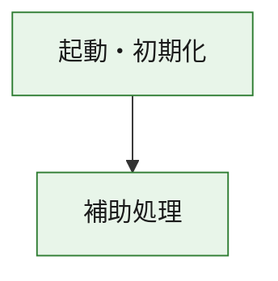
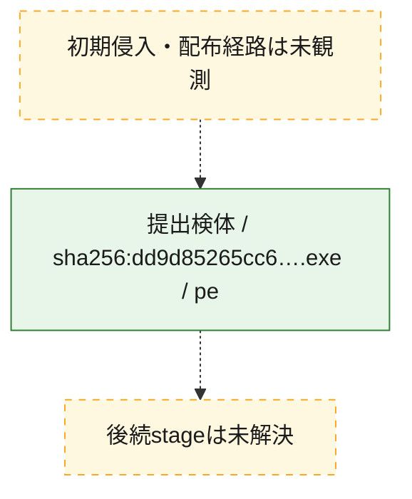
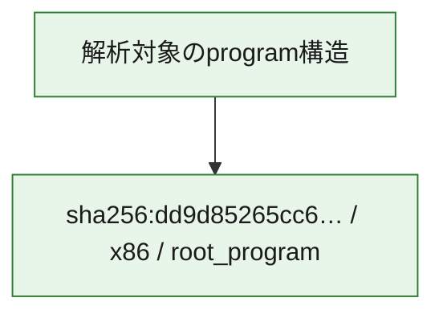

# 全体ロジック：dd9d85265cc6ebcd449731ca971d37bafd6382c41ceeea083bdbb00e693122e4

代表関数の静的証跡から、起動・初期化の処理群を確認しました。

## 読み方

- phaseの掲載順は解析上の整理順です。observed_call_edgesがない段階間の実行順を断定しません。
- 図の実線は静的に観測した関係、点線と黄色のノードは未観測・未解決の関係を示します。
- 図は静的な要約であり、動的実行を再現するものではありません。
- 詳細な関数解説とfingerprintは[STATIC-LOGIC.md](STATIC-LOGIC.md)を参照してください。

## 静的可視化

### 実行フロー

### 感染チェーン

### モジュール関係

## 処理段階

### 1. 起動・初期化

entry pointから初期化と後続処理への移行を確認します。
確度: `confirmed_static_function_evidence`

- `dd9d85265cc6ebcd449731ca971d37bafd6382c41ceeea083bdbb00e693122e4:ghidra:180001010` — 初期化と主要処理への分岐を行う入口関数です。 状態: `succeeded`、選定理由: `entry_point`, `meaningful_symbol_name`, `reviewed_call_centrality:22`, `role:entrypoint`, `small_program_complete_context`

### 2. 補助処理

主要処理を支える一般内部関数またはlibrary処理を確認します。
確度: `confirmed_static_function_evidence`

- `dd9d85265cc6ebcd449731ca971d37bafd6382c41ceeea083bdbb00e693122e4:ghidra:180001240` — 検体内部の一般処理を実装する関数です。 状態: `succeeded`、選定理由: `context_representative`, `reviewed_call_centrality:2`, `small_program_complete_context`
- `dd9d85265cc6ebcd449731ca971d37bafd6382c41ceeea083bdbb00e693122e4:ghidra:180001350` — 検体内部の一般処理を実装する関数です。 状態: `succeeded`、選定理由: `context_representative`, `reviewed_call_centrality:25`, `small_program_complete_context`
- `dd9d85265cc6ebcd449731ca971d37bafd6382c41ceeea083bdbb00e693122e4:ghidra:180003780` — 検体内部の一般処理を実装する関数です。 状態: `succeeded`、選定理由: `context_representative`, `reviewed_call_centrality:2`, `small_program_complete_context`
- `dd9d85265cc6ebcd449731ca971d37bafd6382c41ceeea083bdbb00e693122e4:ghidra:1800038e0` — 検体内部の一般処理を実装する関数です。 状態: `succeeded`、選定理由: `context_representative`, `reviewed_call_centrality:2`, `small_program_complete_context`

## 観測したcall関係

- `dd9d85265cc6ebcd449731ca971d37bafd6382c41ceeea083bdbb00e693122e4:ghidra:180001010` → `dd9d85265cc6ebcd449731ca971d37bafd6382c41ceeea083bdbb00e693122e4:ghidra:180001240` （`startup` → `support`）
- `dd9d85265cc6ebcd449731ca971d37bafd6382c41ceeea083bdbb00e693122e4:ghidra:180001010` → `dd9d85265cc6ebcd449731ca971d37bafd6382c41ceeea083bdbb00e693122e4:ghidra:180001350` （`startup` → `support`）
- `dd9d85265cc6ebcd449731ca971d37bafd6382c41ceeea083bdbb00e693122e4:ghidra:180001350` → `dd9d85265cc6ebcd449731ca971d37bafd6382c41ceeea083bdbb00e693122e4:ghidra:180001240` （`support` → `support`）
- `dd9d85265cc6ebcd449731ca971d37bafd6382c41ceeea083bdbb00e693122e4:ghidra:180001350` → `dd9d85265cc6ebcd449731ca971d37bafd6382c41ceeea083bdbb00e693122e4:ghidra:180003780` （`support` → `support`）
- `dd9d85265cc6ebcd449731ca971d37bafd6382c41ceeea083bdbb00e693122e4:ghidra:180001350` → `dd9d85265cc6ebcd449731ca971d37bafd6382c41ceeea083bdbb00e693122e4:ghidra:1800038e0` （`support` → `support`）
- `dd9d85265cc6ebcd449731ca971d37bafd6382c41ceeea083bdbb00e693122e4:ghidra:180003780` → `dd9d85265cc6ebcd449731ca971d37bafd6382c41ceeea083bdbb00e693122e4:ghidra:1800038e0` （`support` → `support`）
- `ghidra-function:5442da79f1a0845cee21e183` → `ghidra-external:0bd370927b9a060bc3d2adb2` （`unclassified` → `unclassified`）
- `ghidra-function:5442da79f1a0845cee21e183` → `ghidra-external:168a1cf59f8b4d3f181f4c4a` （`unclassified` → `unclassified`）
- `ghidra-function:5442da79f1a0845cee21e183` → `ghidra-external:313d72fa1d54e28157965e97` （`unclassified` → `unclassified`）
- `ghidra-function:5442da79f1a0845cee21e183` → `ghidra-external:3d1e2e3f4b5036c16561e99f` （`unclassified` → `unclassified`）
- `ghidra-function:5442da79f1a0845cee21e183` → `ghidra-external:443042578c09df3cf8475c01` （`unclassified` → `unclassified`）
- `ghidra-function:5442da79f1a0845cee21e183` → `ghidra-external:5d44e9b8fd2f3b93ef824f81` （`unclassified` → `unclassified`）
- `ghidra-function:5442da79f1a0845cee21e183` → `ghidra-external:6231033529a869fd14f6a2af` （`unclassified` → `unclassified`）
- `ghidra-function:5442da79f1a0845cee21e183` → `ghidra-external:67946a3c12c7fa08264544f7` （`unclassified` → `unclassified`）
- `ghidra-function:5442da79f1a0845cee21e183` → `ghidra-external:6c57c03e47c40f1293482664` （`unclassified` → `unclassified`）
- `ghidra-function:5442da79f1a0845cee21e183` → `ghidra-external:8c943b5b2fba4d2d205c69f6` （`unclassified` → `unclassified`）
- `ghidra-function:5442da79f1a0845cee21e183` → `ghidra-external:8d5d923cef77f6c1260552b5` （`unclassified` → `unclassified`）
- `ghidra-function:5442da79f1a0845cee21e183` → `ghidra-external:8da5f8d22d847335d9cd9b2a` （`unclassified` → `unclassified`）
- `ghidra-function:5442da79f1a0845cee21e183` → `ghidra-external:9896878ad0fc7b84e44229cb` （`unclassified` → `unclassified`）
- `ghidra-function:5442da79f1a0845cee21e183` → `ghidra-external:b1a14366498838e39a8a850a` （`unclassified` → `unclassified`）
- `ghidra-function:5442da79f1a0845cee21e183` → `ghidra-external:b25a871cd0ebb393b2d730bf` （`unclassified` → `unclassified`）
- `ghidra-function:5442da79f1a0845cee21e183` → `ghidra-external:b98f3253a64a5163ba40ce3c` （`unclassified` → `unclassified`）
- `ghidra-function:5442da79f1a0845cee21e183` → `ghidra-external:d4df3a88c221fad214393d52` （`unclassified` → `unclassified`）
- `ghidra-function:5442da79f1a0845cee21e183` → `ghidra-external:de2b352d1bcf78dd7a1869b3` （`unclassified` → `unclassified`）
- `ghidra-function:5442da79f1a0845cee21e183` → `ghidra-external:e5b182f3efb781b2b85468d8` （`unclassified` → `unclassified`）
- `ghidra-function:5442da79f1a0845cee21e183` → `ghidra-external:f0d2613e07cfd4def479d122` （`unclassified` → `unclassified`）
- `ghidra-function:5442da79f1a0845cee21e183` → `ghidra-external:f4fb5ef639bc34ab0f850db6` （`unclassified` → `unclassified`）
- `ghidra-function:5442da79f1a0845cee21e183` → `ghidra-function:6a4e42e0ebc9aca5eac19282` （`unclassified` → `unclassified`）
- `ghidra-function:5442da79f1a0845cee21e183` → `ghidra-function:aace324eaf5011da656f95b8` （`unclassified` → `unclassified`）
- `ghidra-function:5442da79f1a0845cee21e183` → `ghidra-function:e9b7da88f0d3a3a07ba318f5` （`unclassified` → `unclassified`）
- `ghidra-function:aace324eaf5011da656f95b8` → `ghidra-function:e9b7da88f0d3a3a07ba318f5` （`unclassified` → `unclassified`）
- `ghidra-function:b61e5c19ed5fdba88e87e095` → `ghidra-function:2c1e2e72a686161478502f62` （`unclassified` → `unclassified`）
- `ghidra-function:b61e5c19ed5fdba88e87e095` → `ghidra-function:31f52561b7eec1585353e578` （`unclassified` → `unclassified`）
- `ghidra-function:b61e5c19ed5fdba88e87e095` → `ghidra-function:5442da79f1a0845cee21e183` （`unclassified` → `unclassified`）
- `ghidra-function:b61e5c19ed5fdba88e87e095` → `ghidra-function:56c818a19d41382cf14f2b82` （`unclassified` → `unclassified`）
- `ghidra-function:b61e5c19ed5fdba88e87e095` → `ghidra-function:6a4e42e0ebc9aca5eac19282` （`unclassified` → `unclassified`）
- `ghidra-function:b61e5c19ed5fdba88e87e095` → `ghidra-function:6c4b892bdb0b1c00e1a0526c` （`unclassified` → `unclassified`）
- `ghidra-function:b61e5c19ed5fdba88e87e095` → `ghidra-function:744f06cb44e60d2e4582ee8a` （`unclassified` → `unclassified`）
- `ghidra-function:b61e5c19ed5fdba88e87e095` → `ghidra-function:a67208deb871cf6f11311957` （`unclassified` → `unclassified`）
- `ghidra-function:b61e5c19ed5fdba88e87e095` → `ghidra-function:bf55d535029659ce9d4ac13d` （`unclassified` → `unclassified`）
- `ghidra-function:b61e5c19ed5fdba88e87e095` → `ghidra-function:cdb0e87b82c3341247e73441` （`unclassified` → `unclassified`）
- `ghidra-function:b61e5c19ed5fdba88e87e095` → `ghidra-function:d4616871b06a7058011d48f2` （`unclassified` → `unclassified`）
- `ghidra-function:b61e5c19ed5fdba88e87e095` → `ghidra-function:f139796be9b0cbe105397108` （`unclassified` → `unclassified`）

## 解析範囲と制約

- 選定外関数は全体inventoryへ残しますが、関数本体の個別解説対象にはしていません。
- indirect call、難読化、packer、VM、壊れたcontrol flowによりcall関係が欠落する場合があります。
- 文書は静的解析に基づき、検体実行や外部通信による動的確認は行っていません。
