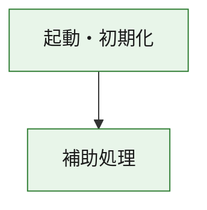
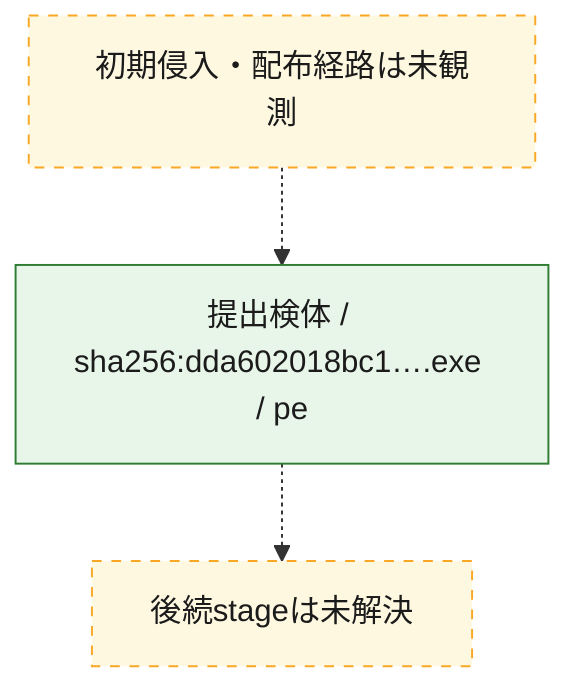
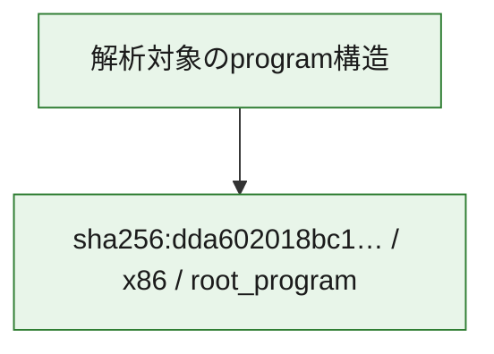

# 全体ロジック：dda602018bc1c1719f8ad002425f54c1e399694241aec4ca99bca399823f76c3

代表関数の静的証跡から、起動・初期化の処理群を確認しました。

## 読み方

- phaseの掲載順は解析上の整理順です。observed_call_edgesがない段階間の実行順を断定しません。
- 図の実線は静的に観測した関係、点線と黄色のノードは未観測・未解決の関係を示します。
- 図は静的な要約であり、動的実行を再現するものではありません。
- 詳細な関数解説とfingerprintは[STATIC-LOGIC.md](STATIC-LOGIC.md)を参照してください。

## 静的可視化

### 実行フロー

### 感染チェーン

### モジュール関係

## 処理段階

### 1. 起動・初期化

entry pointから初期化と後続処理への移行を確認します。
確度: `confirmed_static_function_evidence`

- `dda602018bc1c1719f8ad002425f54c1e399694241aec4ca99bca399823f76c3:ghidra:180001010` — 初期化と主要処理への分岐を行う入口関数です。 状態: `succeeded`、選定理由: `entry_point`, `meaningful_symbol_name`, `reviewed_call_centrality:22`, `role:entrypoint`, `small_program_complete_context`

### 2. 補助処理

主要処理を支える一般内部関数またはlibrary処理を確認します。
確度: `confirmed_static_function_evidence`

- `dda602018bc1c1719f8ad002425f54c1e399694241aec4ca99bca399823f76c3:ghidra:180001240` — 検体内部の一般処理を実装する関数です。 状態: `succeeded`、選定理由: `context_representative`, `reviewed_call_centrality:2`, `small_program_complete_context`
- `dda602018bc1c1719f8ad002425f54c1e399694241aec4ca99bca399823f76c3:ghidra:180001350` — 検体内部の一般処理を実装する関数です。 状態: `succeeded`、選定理由: `context_representative`, `reviewed_call_centrality:25`, `small_program_complete_context`
- `dda602018bc1c1719f8ad002425f54c1e399694241aec4ca99bca399823f76c3:ghidra:180003780` — 検体内部の一般処理を実装する関数です。 状態: `succeeded`、選定理由: `context_representative`, `reviewed_call_centrality:2`, `small_program_complete_context`
- `dda602018bc1c1719f8ad002425f54c1e399694241aec4ca99bca399823f76c3:ghidra:1800038e0` — 検体内部の一般処理を実装する関数です。 状態: `succeeded`、選定理由: `context_representative`, `reviewed_call_centrality:2`, `small_program_complete_context`

## 観測したcall関係

- `dda602018bc1c1719f8ad002425f54c1e399694241aec4ca99bca399823f76c3:ghidra:180001010` → `dda602018bc1c1719f8ad002425f54c1e399694241aec4ca99bca399823f76c3:ghidra:180001240` （`startup` → `support`）
- `dda602018bc1c1719f8ad002425f54c1e399694241aec4ca99bca399823f76c3:ghidra:180001010` → `dda602018bc1c1719f8ad002425f54c1e399694241aec4ca99bca399823f76c3:ghidra:180001350` （`startup` → `support`）
- `dda602018bc1c1719f8ad002425f54c1e399694241aec4ca99bca399823f76c3:ghidra:180001350` → `dda602018bc1c1719f8ad002425f54c1e399694241aec4ca99bca399823f76c3:ghidra:180001240` （`support` → `support`）
- `dda602018bc1c1719f8ad002425f54c1e399694241aec4ca99bca399823f76c3:ghidra:180001350` → `dda602018bc1c1719f8ad002425f54c1e399694241aec4ca99bca399823f76c3:ghidra:180003780` （`support` → `support`）
- `dda602018bc1c1719f8ad002425f54c1e399694241aec4ca99bca399823f76c3:ghidra:180001350` → `dda602018bc1c1719f8ad002425f54c1e399694241aec4ca99bca399823f76c3:ghidra:1800038e0` （`support` → `support`）
- `dda602018bc1c1719f8ad002425f54c1e399694241aec4ca99bca399823f76c3:ghidra:180003780` → `dda602018bc1c1719f8ad002425f54c1e399694241aec4ca99bca399823f76c3:ghidra:1800038e0` （`support` → `support`）
- `ghidra-function:2bfe367366336a8ddd43837a` → `ghidra-external:2fd651c21591ab0a8d86be75` （`unclassified` → `unclassified`）
- `ghidra-function:2bfe367366336a8ddd43837a` → `ghidra-external:32fd9e0afaa964b55a621ef6` （`unclassified` → `unclassified`）
- `ghidra-function:2bfe367366336a8ddd43837a` → `ghidra-external:388740d79478639efb230d2c` （`unclassified` → `unclassified`）
- `ghidra-function:2bfe367366336a8ddd43837a` → `ghidra-external:4aa45917bd5555564cd66986` （`unclassified` → `unclassified`）
- `ghidra-function:2bfe367366336a8ddd43837a` → `ghidra-external:597828782868d60d8520642a` （`unclassified` → `unclassified`）
- `ghidra-function:2bfe367366336a8ddd43837a` → `ghidra-external:692406166a76c6f9ae61a37f` （`unclassified` → `unclassified`）
- `ghidra-function:2bfe367366336a8ddd43837a` → `ghidra-external:78ce01695fda2b62525d7901` （`unclassified` → `unclassified`）
- `ghidra-function:2bfe367366336a8ddd43837a` → `ghidra-external:7cec12de98ec1f02cc5aded4` （`unclassified` → `unclassified`）
- `ghidra-function:2bfe367366336a8ddd43837a` → `ghidra-external:834ad9df694fa505d8f5bb24` （`unclassified` → `unclassified`）
- `ghidra-function:2bfe367366336a8ddd43837a` → `ghidra-external:8de70ec70891f6a056677e00` （`unclassified` → `unclassified`）
- `ghidra-function:2bfe367366336a8ddd43837a` → `ghidra-external:9226a4c7caa3f4c2fa8e23b7` （`unclassified` → `unclassified`）
- `ghidra-function:2bfe367366336a8ddd43837a` → `ghidra-external:92e495ea489328d63fb2021d` （`unclassified` → `unclassified`）
- `ghidra-function:2bfe367366336a8ddd43837a` → `ghidra-external:a2b35d03ee21c2a34571c591` （`unclassified` → `unclassified`）
- `ghidra-function:2bfe367366336a8ddd43837a` → `ghidra-external:a4f68654aadb48045bd565bb` （`unclassified` → `unclassified`）
- `ghidra-function:2bfe367366336a8ddd43837a` → `ghidra-external:a8069cd7b00ff801e5521c06` （`unclassified` → `unclassified`）
- `ghidra-function:2bfe367366336a8ddd43837a` → `ghidra-external:d302eb97f5f06039567ce647` （`unclassified` → `unclassified`）
- `ghidra-function:2bfe367366336a8ddd43837a` → `ghidra-external:d6c701a95bca68ed043b7780` （`unclassified` → `unclassified`）
- `ghidra-function:2bfe367366336a8ddd43837a` → `ghidra-external:d921ffee2c801fa1f55a239c` （`unclassified` → `unclassified`）
- `ghidra-function:2bfe367366336a8ddd43837a` → `ghidra-external:dced9a737f1cf34294a2e887` （`unclassified` → `unclassified`）
- `ghidra-function:2bfe367366336a8ddd43837a` → `ghidra-external:e2af4149ad02c3494f4e581e` （`unclassified` → `unclassified`）
- `ghidra-function:2bfe367366336a8ddd43837a` → `ghidra-external:e43f2dcd891ee833973845f1` （`unclassified` → `unclassified`）
- `ghidra-function:2bfe367366336a8ddd43837a` → `ghidra-function:26e473edd6ae1bd86a164e44` （`unclassified` → `unclassified`）
- `ghidra-function:2bfe367366336a8ddd43837a` → `ghidra-function:9c9df4184f9f908eddaed4fb` （`unclassified` → `unclassified`）
- `ghidra-function:2bfe367366336a8ddd43837a` → `ghidra-function:b19cd5a3de8a087b0d0c032e` （`unclassified` → `unclassified`）
- `ghidra-function:5d6c3df218fab432daab3a55` → `ghidra-function:0888c6c28054280efe8e65c5` （`unclassified` → `unclassified`）
- `ghidra-function:5d6c3df218fab432daab3a55` → `ghidra-function:24766b9c7fcde45fd86619c3` （`unclassified` → `unclassified`）
- `ghidra-function:5d6c3df218fab432daab3a55` → `ghidra-function:26e473edd6ae1bd86a164e44` （`unclassified` → `unclassified`）
- `ghidra-function:5d6c3df218fab432daab3a55` → `ghidra-function:2bfe367366336a8ddd43837a` （`unclassified` → `unclassified`）
- `ghidra-function:5d6c3df218fab432daab3a55` → `ghidra-function:3b571570027efdf5639d3817` （`unclassified` → `unclassified`）
- `ghidra-function:5d6c3df218fab432daab3a55` → `ghidra-function:4c412630d8ce740b67dd5c4a` （`unclassified` → `unclassified`）
- `ghidra-function:5d6c3df218fab432daab3a55` → `ghidra-function:594e86f94edab898c56da85f` （`unclassified` → `unclassified`）
- `ghidra-function:5d6c3df218fab432daab3a55` → `ghidra-function:661ac2d07789793e01bc5ca1` （`unclassified` → `unclassified`）
- `ghidra-function:5d6c3df218fab432daab3a55` → `ghidra-function:67bb5d62fdc9b13bfe91a20c` （`unclassified` → `unclassified`）
- `ghidra-function:5d6c3df218fab432daab3a55` → `ghidra-function:931d0b43bd66d0cf540de6b6` （`unclassified` → `unclassified`）
- `ghidra-function:5d6c3df218fab432daab3a55` → `ghidra-function:c862cb8d7e91528c02818804` （`unclassified` → `unclassified`）
- `ghidra-function:5d6c3df218fab432daab3a55` → `ghidra-function:f88a7112093968a02eb791b9` （`unclassified` → `unclassified`）
- `ghidra-function:9c9df4184f9f908eddaed4fb` → `ghidra-function:b19cd5a3de8a087b0d0c032e` （`unclassified` → `unclassified`）

## 解析範囲と制約

- 選定外関数は全体inventoryへ残しますが、関数本体の個別解説対象にはしていません。
- indirect call、難読化、packer、VM、壊れたcontrol flowによりcall関係が欠落する場合があります。
- 文書は静的解析に基づき、検体実行や外部通信による動的確認は行っていません。
