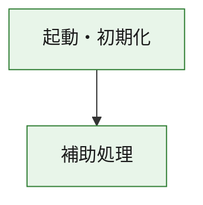
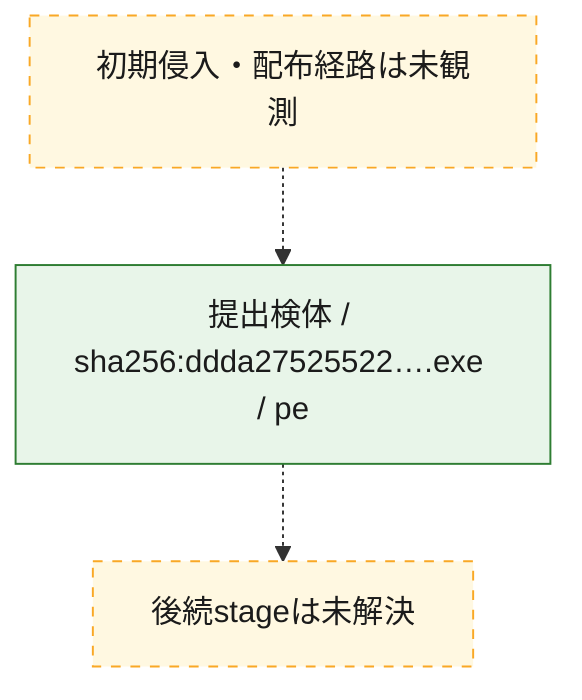
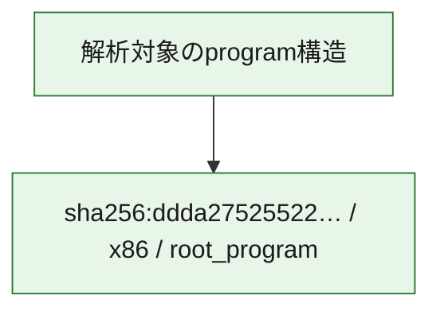

# 全体ロジック：ddda27525522dba74f3b356b6a3d29b8baac2c00ed826c2b505ffa2bc16347be

代表関数の静的証跡から、起動・初期化の処理群を確認しました。

## 読み方

- phaseの掲載順は解析上の整理順です。observed_call_edgesがない段階間の実行順を断定しません。
- 図の実線は静的に観測した関係、点線と黄色のノードは未観測・未解決の関係を示します。
- 図は静的な要約であり、動的実行を再現するものではありません。
- 詳細な関数解説とfingerprintは[STATIC-LOGIC.md](STATIC-LOGIC.md)を参照してください。

## 静的可視化

### 実行フロー

### 感染チェーン

### モジュール関係

## 処理段階

### 1. 起動・初期化

entry pointから初期化と後続処理への移行を確認します。
確度: `confirmed_static_function_evidence`

- `ddda27525522dba74f3b356b6a3d29b8baac2c00ed826c2b505ffa2bc16347be:ghidra:1400014c0` — 初期化と主要処理への分岐を行う入口関数です。 状態: `succeeded`、選定理由: `entry_point`, `meaningful_symbol_name`, `reviewed_call_centrality:1`, `role:entrypoint`

### 2. 補助処理

主要処理を支える一般内部関数またはlibrary処理を確認します。
確度: `confirmed_static_function_evidence_with_limits`

- `ddda27525522dba74f3b356b6a3d29b8baac2c00ed826c2b505ffa2bc16347be:ghidra:140001000` — 検体内部の一般処理を実装する関数です。 状態: `succeeded`、選定理由: `context_representative`
- `ddda27525522dba74f3b356b6a3d29b8baac2c00ed826c2b505ffa2bc16347be:ghidra:140001010` — 検体内部の一般処理を実装する関数です。 状態: `succeeded`、選定理由: `context_representative`, `reviewed_call_centrality:6`
- `ddda27525522dba74f3b356b6a3d29b8baac2c00ed826c2b505ffa2bc16347be:ghidra:140001140` — 検体内部の一般処理を実装する関数です。 状態: `succeeded`、選定理由: `context_representative`, `reviewed_call_centrality:1`
- `ddda27525522dba74f3b356b6a3d29b8baac2c00ed826c2b505ffa2bc16347be:ghidra:140001190` — 検体内部の一般処理を実装する関数です。 状態: `succeeded`、選定理由: `context_representative`, `reviewed_call_centrality:24`
- `ddda27525522dba74f3b356b6a3d29b8baac2c00ed826c2b505ffa2bc16347be:ghidra:1400014e0` — 検体内部の一般処理を実装する関数です。 状態: `succeeded`、選定理由: `context_representative`, `reviewed_call_centrality:1`
- `ddda27525522dba74f3b356b6a3d29b8baac2c00ed826c2b505ffa2bc16347be:ghidra:140001500` — 検体内部の一般処理を実装する関数です。 状態: `succeeded`、選定理由: `context_representative`, `reviewed_call_centrality:1`
- `ddda27525522dba74f3b356b6a3d29b8baac2c00ed826c2b505ffa2bc16347be:ghidra:140001520` — 検体内部の一般処理を実装する関数です。 状態: `succeeded`、選定理由: `context_representative`, `reviewed_call_centrality:1`
- `ddda27525522dba74f3b356b6a3d29b8baac2c00ed826c2b505ffa2bc16347be:ghidra:140001530` — 検体内部の一般処理を実装する関数です。 状態: `succeeded`、選定理由: `context_representative`
- `ddda27525522dba74f3b356b6a3d29b8baac2c00ed826c2b505ffa2bc16347be:ghidra:140001560` — 検体内部の一般処理を実装する関数です。 状態: `succeeded`、選定理由: `context_representative`
- `ddda27525522dba74f3b356b6a3d29b8baac2c00ed826c2b505ffa2bc16347be:ghidra:1400015d0` — 検体内部の一般処理を実装する関数です。 状態: `succeeded`、選定理由: `context_representative`, `reviewed_call_centrality:1`
- `ddda27525522dba74f3b356b6a3d29b8baac2c00ed826c2b505ffa2bc16347be:ghidra:140001620` — 検体内部の一般処理を実装する関数です。 状態: `succeeded`、選定理由: `context_representative`, `reviewed_call_centrality:4`
- `ddda27525522dba74f3b356b6a3d29b8baac2c00ed826c2b505ffa2bc16347be:ghidra:1400016e0` — 検体内部の一般処理を実装する関数です。 状態: `succeeded`、選定理由: `context_representative`, `reviewed_call_centrality:1`
- `ddda27525522dba74f3b356b6a3d29b8baac2c00ed826c2b505ffa2bc16347be:ghidra:140001760` — 検体内部の一般処理を実装する関数です。 状態: `succeeded`、選定理由: `context_representative`
- `ddda27525522dba74f3b356b6a3d29b8baac2c00ed826c2b505ffa2bc16347be:ghidra:1400017c0` — 検体内部の一般処理を実装する関数です。 状態: `succeeded`、選定理由: `context_representative`, `reviewed_call_centrality:1`
- `ddda27525522dba74f3b356b6a3d29b8baac2c00ed826c2b505ffa2bc16347be:ghidra:140001840` — 検体内部の一般処理を実装する関数です。 状態: `succeeded`、選定理由: `context_representative`
- `ddda27525522dba74f3b356b6a3d29b8baac2c00ed826c2b505ffa2bc16347be:ghidra:140001910` — 検体内部の一般処理を実装する関数です。 状態: `succeeded`、選定理由: `context_representative`
- `ddda27525522dba74f3b356b6a3d29b8baac2c00ed826c2b505ffa2bc16347be:ghidra:140001940` — 検体内部の一般処理を実装する関数です。 状態: `succeeded`、選定理由: `context_representative`
- `ddda27525522dba74f3b356b6a3d29b8baac2c00ed826c2b505ffa2bc16347be:ghidra:140001980` — 検体内部の一般処理を実装する関数です。 状態: `succeeded`、選定理由: `context_representative`, `reviewed_call_centrality:3`
- `ddda27525522dba74f3b356b6a3d29b8baac2c00ed826c2b505ffa2bc16347be:ghidra:140001a50` — 検体内部の一般処理を実装する関数です。 状態: `succeeded`、選定理由: `context_representative`, `reviewed_call_centrality:2`
- `ddda27525522dba74f3b356b6a3d29b8baac2c00ed826c2b505ffa2bc16347be:ghidra:140001a80` — 検体内部の一般処理を実装する関数です。 状態: `succeeded`、選定理由: `context_representative`
- `ddda27525522dba74f3b356b6a3d29b8baac2c00ed826c2b505ffa2bc16347be:ghidra:140001ae0` — 検体内部の一般処理を実装する関数です。 状態: `succeeded`、選定理由: `context_representative`
- `ddda27525522dba74f3b356b6a3d29b8baac2c00ed826c2b505ffa2bc16347be:ghidra:140001b50` — 検体内部の一般処理を実装する関数です。 状態: `succeeded`、選定理由: `context_representative`
- `ddda27525522dba74f3b356b6a3d29b8baac2c00ed826c2b505ffa2bc16347be:ghidra:140001bb0` — 検体内部の一般処理を実装する関数です。 状態: `succeeded`、選定理由: `context_representative`, `reviewed_call_centrality:1`
- `ddda27525522dba74f3b356b6a3d29b8baac2c00ed826c2b505ffa2bc16347be:ghidra:140001c50` — 検体内部の一般処理を実装する関数です。 状態: `succeeded`、選定理由: `context_representative`
- `ddda27525522dba74f3b356b6a3d29b8baac2c00ed826c2b505ffa2bc16347be:ghidra:140001d10` — 検体内部の一般処理を実装する関数です。 状態: `succeeded`、選定理由: `context_representative`, `reviewed_call_centrality:1`
- `ddda27525522dba74f3b356b6a3d29b8baac2c00ed826c2b505ffa2bc16347be:ghidra:140001da0` — 検体内部の一般処理を実装する関数です。 状態: `succeeded`、選定理由: `context_representative`, `reviewed_call_centrality:2`
- `ddda27525522dba74f3b356b6a3d29b8baac2c00ed826c2b505ffa2bc16347be:ghidra:140001e50` — 検体内部の一般処理を実装する関数です。 状態: `succeeded`、選定理由: `context_representative`, `reviewed_call_centrality:2`
- `ddda27525522dba74f3b356b6a3d29b8baac2c00ed826c2b505ffa2bc16347be:ghidra:14000ac00` — compiler生成処理または汎用library処理とみられる関数です。 状態: `succeeded`、選定理由: `entry_point`, `meaningful_symbol_name`, `reviewed_call_centrality:1`
- `ddda27525522dba74f3b356b6a3d29b8baac2c00ed826c2b505ffa2bc16347be:ghidra:14000ac30` — compiler生成処理または汎用library処理とみられる関数です。 状態: `succeeded`、選定理由: `entry_point`, `meaningful_symbol_name`, `reviewed_call_centrality:3`
- `ddda27525522dba74f3b356b6a3d29b8baac2c00ed826c2b505ffa2bc16347be:ghidra:14000b770` — compiler生成処理または汎用library処理とみられる関数です。 状態: `limited_bad_instruction_or_flow`、選定理由: `entry_point`, `meaningful_symbol_name`, `reviewed_call_centrality:7`
- `ddda27525522dba74f3b356b6a3d29b8baac2c00ed826c2b505ffa2bc16347be:ghidra:1400113d0` — compiler生成処理または汎用library処理とみられる関数です。 状態: `succeeded`、選定理由: `entry_point`, `meaningful_symbol_name`, `reviewed_call_centrality:28`

## 観測したcall関係

- `ddda27525522dba74f3b356b6a3d29b8baac2c00ed826c2b505ffa2bc16347be:ghidra:140001190` → `ddda27525522dba74f3b356b6a3d29b8baac2c00ed826c2b505ffa2bc16347be:ghidra:14000ac30` （`support` → `support`）
- `ddda27525522dba74f3b356b6a3d29b8baac2c00ed826c2b505ffa2bc16347be:ghidra:1400014c0` → `ddda27525522dba74f3b356b6a3d29b8baac2c00ed826c2b505ffa2bc16347be:ghidra:140001190` （`startup` → `support`）
- `ddda27525522dba74f3b356b6a3d29b8baac2c00ed826c2b505ffa2bc16347be:ghidra:1400014e0` → `ddda27525522dba74f3b356b6a3d29b8baac2c00ed826c2b505ffa2bc16347be:ghidra:140001190` （`support` → `support`）
- `ddda27525522dba74f3b356b6a3d29b8baac2c00ed826c2b505ffa2bc16347be:ghidra:1400016e0` → `ddda27525522dba74f3b356b6a3d29b8baac2c00ed826c2b505ffa2bc16347be:ghidra:140001620` （`support` → `support`）
- `ddda27525522dba74f3b356b6a3d29b8baac2c00ed826c2b505ffa2bc16347be:ghidra:1400017c0` → `ddda27525522dba74f3b356b6a3d29b8baac2c00ed826c2b505ffa2bc16347be:ghidra:140001620` （`support` → `support`）
- `ddda27525522dba74f3b356b6a3d29b8baac2c00ed826c2b505ffa2bc16347be:ghidra:140001d10` → `ddda27525522dba74f3b356b6a3d29b8baac2c00ed826c2b505ffa2bc16347be:ghidra:140001620` （`support` → `support`）
- `ddda27525522dba74f3b356b6a3d29b8baac2c00ed826c2b505ffa2bc16347be:ghidra:140001da0` → `ddda27525522dba74f3b356b6a3d29b8baac2c00ed826c2b505ffa2bc16347be:ghidra:140001a50` （`support` → `support`）
- `ddda27525522dba74f3b356b6a3d29b8baac2c00ed826c2b505ffa2bc16347be:ghidra:140001e50` → `ddda27525522dba74f3b356b6a3d29b8baac2c00ed826c2b505ffa2bc16347be:ghidra:1400015d0` （`support` → `support`）
- `ddda27525522dba74f3b356b6a3d29b8baac2c00ed826c2b505ffa2bc16347be:ghidra:140001e50` → `ddda27525522dba74f3b356b6a3d29b8baac2c00ed826c2b505ffa2bc16347be:ghidra:140001620` （`support` → `support`）
- `ghidra-function:01c771311079357a5351704b` → `ghidra-function:0aa61d83efbe95b51452d7a5` （`unclassified` → `unclassified`）
- `ghidra-function:0894ad5898067372d2b4cfbf` → `ghidra-function:5ad201c439f7f41538baa717` （`unclassified` → `unclassified`）
- `ghidra-function:099304da5f07fa84c2467363` → `ghidra-external:a5fdaab6b6fd7616987a3623` （`unclassified` → `unclassified`）
- `ghidra-function:099304da5f07fa84c2467363` → `ghidra-function:1e628a39832759ff3799b899` （`unclassified` → `unclassified`）
- `ghidra-function:099304da5f07fa84c2467363` → `ghidra-function:264d8816231b2b97073df04e` （`unclassified` → `unclassified`）
- `ghidra-function:099304da5f07fa84c2467363` → `ghidra-function:29c1cef2cfdde38e7613d371` （`unclassified` → `unclassified`）
- `ghidra-function:099304da5f07fa84c2467363` → `ghidra-function:320ae87121b6bd6abb3c46cb` （`unclassified` → `unclassified`）
- `ghidra-function:099304da5f07fa84c2467363` → `ghidra-function:4010ccb0166e6ae8ecf88c34` （`unclassified` → `unclassified`）
- `ghidra-function:099304da5f07fa84c2467363` → `ghidra-function:45331b6a874ccc910381ea65` （`unclassified` → `unclassified`）
- `ghidra-function:099304da5f07fa84c2467363` → `ghidra-function:59823b5167945c7dec023c95` （`unclassified` → `unclassified`）
- `ghidra-function:099304da5f07fa84c2467363` → `ghidra-function:5cf3badf5101dca4a5f2d70c` （`unclassified` → `unclassified`）
- `ghidra-function:099304da5f07fa84c2467363` → `ghidra-function:7bfa3557100fcf581396c092` （`unclassified` → `unclassified`）
- `ghidra-function:099304da5f07fa84c2467363` → `ghidra-function:7e612226cefa51aa1a7bf343` （`unclassified` → `unclassified`）
- `ghidra-function:099304da5f07fa84c2467363` → `ghidra-function:937b58280eef1ab418d39803` （`unclassified` → `unclassified`）
- `ghidra-function:099304da5f07fa84c2467363` → `ghidra-function:9f29d988d7898848303c0a53` （`unclassified` → `unclassified`）
- `ghidra-function:099304da5f07fa84c2467363` → `ghidra-function:a7e3a2efb3db71269e078619` （`unclassified` → `unclassified`）
- `ghidra-function:099304da5f07fa84c2467363` → `ghidra-function:be4059b906ca8f2518d378c6` （`unclassified` → `unclassified`）
- `ghidra-function:099304da5f07fa84c2467363` → `ghidra-function:c49a8b137805783205d6077d` （`unclassified` → `unclassified`）
- `ghidra-function:099304da5f07fa84c2467363` → `ghidra-function:c945fd6bd3fd0c4cadfd7afd` （`unclassified` → `unclassified`）
- `ghidra-function:099304da5f07fa84c2467363` → `ghidra-function:cd0d216e5e1227b5d81134cc` （`unclassified` → `unclassified`）
- `ghidra-function:099304da5f07fa84c2467363` → `ghidra-function:e687710b8c0d97aefaa93a68` （`unclassified` → `unclassified`）
- `ghidra-function:099304da5f07fa84c2467363` → `ghidra-function:eb8baaf8dfa2d54407497f2b` （`unclassified` → `unclassified`）
- `ghidra-function:0a0ffce2444440d856fc069f` → `ghidra-external:86a89b56bba695b06da88f46` （`unclassified` → `unclassified`）
- `ghidra-function:0a0ffce2444440d856fc069f` → `ghidra-function:47a0680b9c67837a63798292` （`unclassified` → `unclassified`）
- `ghidra-function:0a0ffce2444440d856fc069f` → `ghidra-function:543cd2eb797cf79d9bb8b09f` （`unclassified` → `unclassified`）
- `ghidra-function:0a0ffce2444440d856fc069f` → `ghidra-function:cb8448bdff49d5eb39ad0351` （`unclassified` → `unclassified`）
- `ghidra-function:0a0ffce2444440d856fc069f` → `ghidra-function:ed9aad7a6a8fcefbf8ba6a99` （`unclassified` → `unclassified`）
- `ghidra-function:11ec90caf155c965054bdf01` → `ghidra-function:0aa61d83efbe95b51452d7a5` （`unclassified` → `unclassified`）
- `ghidra-function:210ad51763f0388ffdef2c91` → `ghidra-function:bad11c8ab0a576f694483353` （`unclassified` → `unclassified`）
- `ghidra-function:26154b99c40fb471d709e708` → `ghidra-external:c65174bea56b7ee8cfa89862` （`unclassified` → `unclassified`）
- `ghidra-function:4318608adfd893364733a2f7` → `ghidra-function:0f80b1e9004bd047897d9135` （`unclassified` → `unclassified`）
- `ghidra-function:53474c8ae2b3f75744692599` → `ghidra-function:0aa61d83efbe95b51452d7a5` （`unclassified` → `unclassified`）
- `ghidra-function:53474c8ae2b3f75744692599` → `ghidra-function:520ce8380e3cd89e34e54299` （`unclassified` → `unclassified`）
- `ghidra-function:5ad201c439f7f41538baa717` → `ghidra-external:1c72ff1ea751ded1f06496c0` （`unclassified` → `unclassified`）
- `ghidra-function:5ad201c439f7f41538baa717` → `ghidra-external:287d56fd731143be6aaf3017` （`unclassified` → `unclassified`）
- `ghidra-function:5ad201c439f7f41538baa717` → `ghidra-external:54312186a94d746b6dd9528a` （`unclassified` → `unclassified`）
- `ghidra-function:5ad201c439f7f41538baa717` → `ghidra-external:5a49a9e7d440f7f86a4d2444` （`unclassified` → `unclassified`）
- `ghidra-function:5ad201c439f7f41538baa717` → `ghidra-external:ade917aafa4e5bf42b6a9baa` （`unclassified` → `unclassified`）
- `ghidra-function:5ad201c439f7f41538baa717` → `ghidra-external:d2b703f2d09f070edcf28615` （`unclassified` → `unclassified`）
- `ghidra-function:5ad201c439f7f41538baa717` → `ghidra-external:dd611318f613b615f5095763` （`unclassified` → `unclassified`）
- `ghidra-function:5ad201c439f7f41538baa717` → `ghidra-external:eaf102012b223a664b9b3026` （`unclassified` → `unclassified`）
- `ghidra-function:5ad201c439f7f41538baa717` → `ghidra-external:f57b9f88962438686a73aa81` （`unclassified` → `unclassified`）
- `ghidra-function:5ad201c439f7f41538baa717` → `ghidra-function:080b40ef4160426217d3ae62` （`unclassified` → `unclassified`）
- `ghidra-function:5ad201c439f7f41538baa717` → `ghidra-function:29c1cef2cfdde38e7613d371` （`unclassified` → `unclassified`）
- `ghidra-function:5ad201c439f7f41538baa717` → `ghidra-function:3d5d7a2017ca137e4f003779` （`unclassified` → `unclassified`）
- `ghidra-function:5ad201c439f7f41538baa717` → `ghidra-function:65a542f5b30fdf429fb8cda9` （`unclassified` → `unclassified`）
- `ghidra-function:5ad201c439f7f41538baa717` → `ghidra-function:6b6b0e2bcc6b598127209cc2` （`unclassified` → `unclassified`）
- `ghidra-function:5ad201c439f7f41538baa717` → `ghidra-function:7e612226cefa51aa1a7bf343` （`unclassified` → `unclassified`）
- `ghidra-function:5ad201c439f7f41538baa717` → `ghidra-function:9f13a8ecc6fe4dabd32b13e1` （`unclassified` → `unclassified`）
- `ghidra-function:5ad201c439f7f41538baa717` → `ghidra-function:b43320397b774c7ca4d29e44` （`unclassified` → `unclassified`）
- `ghidra-function:5ad201c439f7f41538baa717` → `ghidra-function:d92ea61fcd8d697cce91be93` （`unclassified` → `unclassified`）
- `ghidra-function:5ad201c439f7f41538baa717` → `ghidra-function:ecabd8999ede198e19fc11af` （`unclassified` → `unclassified`）
- `ghidra-function:65a542f5b30fdf429fb8cda9` → `ghidra-external:ff5f42f419db40edd2143dd3` （`unclassified` → `unclassified`）
- `ghidra-function:65a542f5b30fdf429fb8cda9` → `ghidra-function:bad11c8ab0a576f694483353` （`unclassified` → `unclassified`）
- `ghidra-function:6973900743f3e9f40a4a051b` → `ghidra-external:287d56fd731143be6aaf3017` （`unclassified` → `unclassified`）
- `ghidra-function:76f2201a7401f9bd33cfeff9` → `ghidra-function:5ad201c439f7f41538baa717` （`unclassified` → `unclassified`）
- `ghidra-function:a50891c0830a2150f08d0c65` → `ghidra-function:0aa61d83efbe95b51452d7a5` （`unclassified` → `unclassified`）
- `ghidra-function:a8956703a24865ba717857a6` → `ghidra-external:925f1176438c91f9126dad0d` （`unclassified` → `unclassified`）
- `ghidra-function:a8956703a24865ba717857a6` → `ghidra-external:ff5f42f419db40edd2143dd3` （`unclassified` → `unclassified`）
- `ghidra-function:a8956703a24865ba717857a6` → `ghidra-function:1ea335ac4cac758ef7fde00f` （`unclassified` → `unclassified`）
- `ghidra-function:a8956703a24865ba717857a6` → `ghidra-function:2686d208132a00a7d272bf12` （`unclassified` → `unclassified`）
- `ghidra-function:a8956703a24865ba717857a6` → `ghidra-function:79bb9ea39823b430b093c829` （`unclassified` → `unclassified`）
- `ghidra-function:a8956703a24865ba717857a6` → `ghidra-function:f23dd5f3362e34133364e9ba` （`unclassified` → `unclassified`）
- `ghidra-function:d12e1fc88b03444753d2a666` → `ghidra-external:287d56fd731143be6aaf3017` （`unclassified` → `unclassified`）
- `ghidra-function:d12e1fc88b03444753d2a666` → `ghidra-function:4318608adfd893364733a2f7` （`unclassified` → `unclassified`）
- `ghidra-function:dd50033aaba8b405aa27211e` → `ghidra-external:73e516ce24044caa827bead2` （`unclassified` → `unclassified`）
- `ghidra-function:de0c029f0d329059714d949e` → `ghidra-external:86a89b56bba695b06da88f46` （`unclassified` → `unclassified`）
- `ghidra-function:de0c029f0d329059714d949e` → `ghidra-external:dd611318f613b615f5095763` （`unclassified` → `unclassified`）
- `ghidra-function:de0c029f0d329059714d949e` → `ghidra-external:eabc3a608382cab92f1a0dd1` （`unclassified` → `unclassified`）
- `ghidra-function:e522b1a6848384e6106c766c` → `ghidra-external:73e516ce24044caa827bead2` （`unclassified` → `unclassified`）

## 解析範囲と制約

- 選定外関数は全体inventoryへ残しますが、関数本体の個別解説対象にはしていません。
- indirect call、難読化、packer、VM、壊れたcontrol flowによりcall関係が欠落する場合があります。
- 文書は静的解析に基づき、検体実行や外部通信による動的確認は行っていません。
