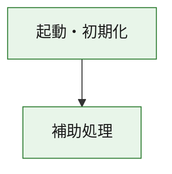
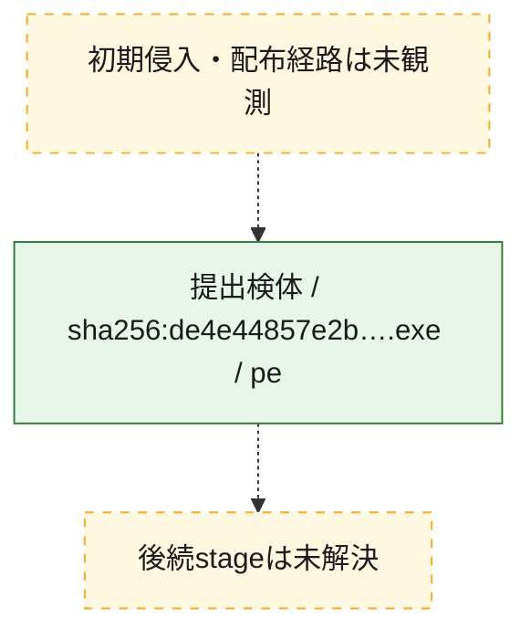
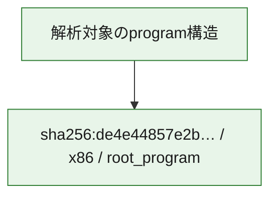

# 全体ロジック：de4e44857e2b542f2add37f08cdf344e388981a6412c656986ab98713ff8c2a0

代表関数の静的証跡から、起動・初期化の処理群を確認しました。

## 読み方

- phaseの掲載順は解析上の整理順です。observed_call_edgesがない段階間の実行順を断定しません。
- 図の実線は静的に観測した関係、点線と黄色のノードは未観測・未解決の関係を示します。
- 図は静的な要約であり、動的実行を再現するものではありません。
- 詳細な関数解説とfingerprintは[STATIC-LOGIC.md](STATIC-LOGIC.md)を参照してください。

## 静的可視化

### 実行フロー

### 感染チェーン

### モジュール関係

## 処理段階

### 1. 起動・初期化

entry pointから初期化と後続処理への移行を確認します。
確度: `confirmed_static_function_evidence`

- `de4e44857e2b542f2add37f08cdf344e388981a6412c656986ab98713ff8c2a0:ghidra:180001010` — 初期化と主要処理への分岐を行う入口関数です。 状態: `succeeded`、選定理由: `entry_point`, `meaningful_symbol_name`, `reviewed_call_centrality:22`, `role:entrypoint`, `small_program_complete_context`

### 2. 補助処理

主要処理を支える一般内部関数またはlibrary処理を確認します。
確度: `confirmed_static_function_evidence`

- `de4e44857e2b542f2add37f08cdf344e388981a6412c656986ab98713ff8c2a0:ghidra:180001240` — 検体内部の一般処理を実装する関数です。 状態: `succeeded`、選定理由: `context_representative`, `reviewed_call_centrality:2`, `small_program_complete_context`
- `de4e44857e2b542f2add37f08cdf344e388981a6412c656986ab98713ff8c2a0:ghidra:180001350` — 検体内部の一般処理を実装する関数です。 状態: `succeeded`、選定理由: `context_representative`, `reviewed_call_centrality:25`, `small_program_complete_context`
- `de4e44857e2b542f2add37f08cdf344e388981a6412c656986ab98713ff8c2a0:ghidra:180003780` — 検体内部の一般処理を実装する関数です。 状態: `succeeded`、選定理由: `context_representative`, `reviewed_call_centrality:2`, `small_program_complete_context`
- `de4e44857e2b542f2add37f08cdf344e388981a6412c656986ab98713ff8c2a0:ghidra:1800038e0` — 検体内部の一般処理を実装する関数です。 状態: `succeeded`、選定理由: `context_representative`, `reviewed_call_centrality:2`, `small_program_complete_context`

## 観測したcall関係

- `de4e44857e2b542f2add37f08cdf344e388981a6412c656986ab98713ff8c2a0:ghidra:180001010` → `de4e44857e2b542f2add37f08cdf344e388981a6412c656986ab98713ff8c2a0:ghidra:180001240` （`startup` → `support`）
- `de4e44857e2b542f2add37f08cdf344e388981a6412c656986ab98713ff8c2a0:ghidra:180001010` → `de4e44857e2b542f2add37f08cdf344e388981a6412c656986ab98713ff8c2a0:ghidra:180001350` （`startup` → `support`）
- `de4e44857e2b542f2add37f08cdf344e388981a6412c656986ab98713ff8c2a0:ghidra:180001350` → `de4e44857e2b542f2add37f08cdf344e388981a6412c656986ab98713ff8c2a0:ghidra:180001240` （`support` → `support`）
- `de4e44857e2b542f2add37f08cdf344e388981a6412c656986ab98713ff8c2a0:ghidra:180001350` → `de4e44857e2b542f2add37f08cdf344e388981a6412c656986ab98713ff8c2a0:ghidra:180003780` （`support` → `support`）
- `de4e44857e2b542f2add37f08cdf344e388981a6412c656986ab98713ff8c2a0:ghidra:180001350` → `de4e44857e2b542f2add37f08cdf344e388981a6412c656986ab98713ff8c2a0:ghidra:1800038e0` （`support` → `support`）
- `de4e44857e2b542f2add37f08cdf344e388981a6412c656986ab98713ff8c2a0:ghidra:180003780` → `de4e44857e2b542f2add37f08cdf344e388981a6412c656986ab98713ff8c2a0:ghidra:1800038e0` （`support` → `support`）
- `ghidra-function:42e88d32a82ce43f968ae0ad` → `ghidra-function:49c3657f0683268c62fe3654` （`unclassified` → `unclassified`）
- `ghidra-function:53d0dff629f3435665c74613` → `ghidra-function:001ab6da8583aa01d51b0716` （`unclassified` → `unclassified`）
- `ghidra-function:53d0dff629f3435665c74613` → `ghidra-function:2c5f056f33ec09da1c50bd6c` （`unclassified` → `unclassified`）
- `ghidra-function:53d0dff629f3435665c74613` → `ghidra-function:2dff826ef8540914c949d171` （`unclassified` → `unclassified`）
- `ghidra-function:53d0dff629f3435665c74613` → `ghidra-function:523e7a12551fabf9e3a15a51` （`unclassified` → `unclassified`）
- `ghidra-function:53d0dff629f3435665c74613` → `ghidra-function:5455157e87355bd0deacc511` （`unclassified` → `unclassified`）
- `ghidra-function:53d0dff629f3435665c74613` → `ghidra-function:8075c61053fc530872520e21` （`unclassified` → `unclassified`）
- `ghidra-function:53d0dff629f3435665c74613` → `ghidra-function:a1a8741164a13edbf68a63ec` （`unclassified` → `unclassified`）
- `ghidra-function:53d0dff629f3435665c74613` → `ghidra-function:a23bd78fe5cf371b9ebf3e6a` （`unclassified` → `unclassified`）
- `ghidra-function:53d0dff629f3435665c74613` → `ghidra-function:a7c5a260b68922b97459facc` （`unclassified` → `unclassified`）
- `ghidra-function:53d0dff629f3435665c74613` → `ghidra-function:e8da10ccad72877521aad08a` （`unclassified` → `unclassified`）
- `ghidra-function:53d0dff629f3435665c74613` → `ghidra-function:ef81fc542d862e541368d3a0` （`unclassified` → `unclassified`）
- `ghidra-function:53d0dff629f3435665c74613` → `ghidra-function:f2e56e753bcde03262429af1` （`unclassified` → `unclassified`）
- `ghidra-function:a1a8741164a13edbf68a63ec` → `ghidra-external:1821b7f4ebe8a170951764fe` （`unclassified` → `unclassified`）
- `ghidra-function:a1a8741164a13edbf68a63ec` → `ghidra-external:1a5d14b7dbbb8dbf67a41c33` （`unclassified` → `unclassified`）
- `ghidra-function:a1a8741164a13edbf68a63ec` → `ghidra-external:1a8e719dfb19fb660d0a84c5` （`unclassified` → `unclassified`）
- `ghidra-function:a1a8741164a13edbf68a63ec` → `ghidra-external:315082fd46dfc4058e925b34` （`unclassified` → `unclassified`）
- `ghidra-function:a1a8741164a13edbf68a63ec` → `ghidra-external:3207316a78a9f38c2db63532` （`unclassified` → `unclassified`）
- `ghidra-function:a1a8741164a13edbf68a63ec` → `ghidra-external:3d1e823a49ed9ecbd1675203` （`unclassified` → `unclassified`）
- `ghidra-function:a1a8741164a13edbf68a63ec` → `ghidra-external:4a705f9bc302cb9038a13ae5` （`unclassified` → `unclassified`）
- `ghidra-function:a1a8741164a13edbf68a63ec` → `ghidra-external:70cdbeb4ec66df55325a30b0` （`unclassified` → `unclassified`）
- `ghidra-function:a1a8741164a13edbf68a63ec` → `ghidra-external:7c8f3f88cd2fcf6d828a0768` （`unclassified` → `unclassified`）
- `ghidra-function:a1a8741164a13edbf68a63ec` → `ghidra-external:801f2fe0f92b6f0a42312db1` （`unclassified` → `unclassified`）
- `ghidra-function:a1a8741164a13edbf68a63ec` → `ghidra-external:a52f4a2148d390cdd3ca9337` （`unclassified` → `unclassified`）
- `ghidra-function:a1a8741164a13edbf68a63ec` → `ghidra-external:a6bcb7c2cf529ddc96d3354b` （`unclassified` → `unclassified`）
- `ghidra-function:a1a8741164a13edbf68a63ec` → `ghidra-external:ac026ad91aeaec15eff0dc1d` （`unclassified` → `unclassified`）
- `ghidra-function:a1a8741164a13edbf68a63ec` → `ghidra-external:b0b9a927818930b0ba8e3e0e` （`unclassified` → `unclassified`）
- `ghidra-function:a1a8741164a13edbf68a63ec` → `ghidra-external:b54ef72bab27e4e03d294ed4` （`unclassified` → `unclassified`）
- `ghidra-function:a1a8741164a13edbf68a63ec` → `ghidra-external:bdcb3eeeecb7b448a724792b` （`unclassified` → `unclassified`）
- `ghidra-function:a1a8741164a13edbf68a63ec` → `ghidra-external:c13948117a1c3af90aabbca9` （`unclassified` → `unclassified`）
- `ghidra-function:a1a8741164a13edbf68a63ec` → `ghidra-external:cc11c7e872cf9a2613eaa730` （`unclassified` → `unclassified`）
- `ghidra-function:a1a8741164a13edbf68a63ec` → `ghidra-external:e0b288442d13d4391ca1ae2b` （`unclassified` → `unclassified`）
- `ghidra-function:a1a8741164a13edbf68a63ec` → `ghidra-external:f26ab72696f38ccf5ebb5ede` （`unclassified` → `unclassified`）
- `ghidra-function:a1a8741164a13edbf68a63ec` → `ghidra-external:fb8b3b4f81e1dfb7da2623c4` （`unclassified` → `unclassified`）
- `ghidra-function:a1a8741164a13edbf68a63ec` → `ghidra-function:42e88d32a82ce43f968ae0ad` （`unclassified` → `unclassified`）
- `ghidra-function:a1a8741164a13edbf68a63ec` → `ghidra-function:49c3657f0683268c62fe3654` （`unclassified` → `unclassified`）
- `ghidra-function:a1a8741164a13edbf68a63ec` → `ghidra-function:e8da10ccad72877521aad08a` （`unclassified` → `unclassified`）

## 解析範囲と制約

- 選定外関数は全体inventoryへ残しますが、関数本体の個別解説対象にはしていません。
- indirect call、難読化、packer、VM、壊れたcontrol flowによりcall関係が欠落する場合があります。
- 文書は静的解析に基づき、検体実行や外部通信による動的確認は行っていません。
