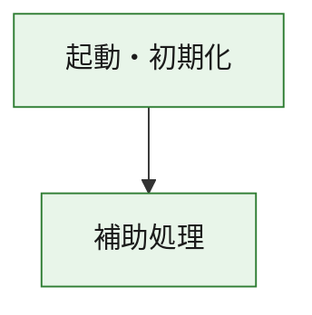
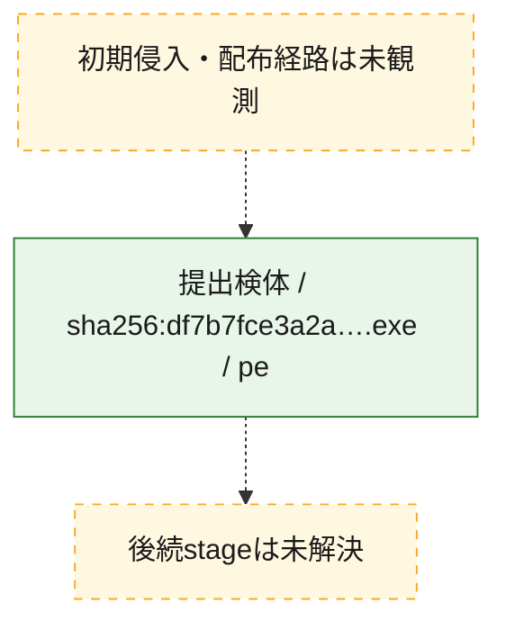
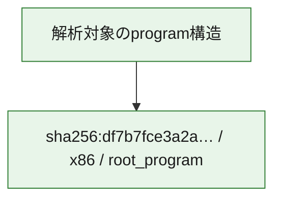

# 全体ロジック：df7b7fce3a2ae36d8bd0d5f25830cfda14b257d5019181837402d164208b8a56

代表関数の静的証跡から、起動・初期化の処理群を確認しました。

## 読み方

- phaseの掲載順は解析上の整理順です。observed_call_edgesがない段階間の実行順を断定しません。
- 図の実線は静的に観測した関係、点線と黄色のノードは未観測・未解決の関係を示します。
- 図は静的な要約であり、動的実行を再現するものではありません。
- 詳細な関数解説とfingerprintは[STATIC-LOGIC.md](STATIC-LOGIC.md)を参照してください。

## 静的可視化

### 実行フロー

### 感染チェーン

### モジュール関係

## 処理段階

### 1. 起動・初期化

entry pointから初期化と後続処理への移行を確認します。
確度: `confirmed_static_function_evidence`

- `df7b7fce3a2ae36d8bd0d5f25830cfda14b257d5019181837402d164208b8a56:ghidra:180001010` — 初期化と主要処理への分岐を行う入口関数です。 状態: `succeeded`、選定理由: `entry_point`, `meaningful_symbol_name`, `reviewed_call_centrality:22`, `role:entrypoint`, `small_program_complete_context`

### 2. 補助処理

主要処理を支える一般内部関数またはlibrary処理を確認します。
確度: `confirmed_static_function_evidence`

- `df7b7fce3a2ae36d8bd0d5f25830cfda14b257d5019181837402d164208b8a56:ghidra:180001240` — 検体内部の一般処理を実装する関数です。 状態: `succeeded`、選定理由: `context_representative`, `reviewed_call_centrality:2`, `small_program_complete_context`
- `df7b7fce3a2ae36d8bd0d5f25830cfda14b257d5019181837402d164208b8a56:ghidra:180001350` — 検体内部の一般処理を実装する関数です。 状態: `succeeded`、選定理由: `context_representative`, `reviewed_call_centrality:25`, `small_program_complete_context`
- `df7b7fce3a2ae36d8bd0d5f25830cfda14b257d5019181837402d164208b8a56:ghidra:180003780` — 検体内部の一般処理を実装する関数です。 状態: `succeeded`、選定理由: `context_representative`, `reviewed_call_centrality:2`, `small_program_complete_context`
- `df7b7fce3a2ae36d8bd0d5f25830cfda14b257d5019181837402d164208b8a56:ghidra:1800038e0` — 検体内部の一般処理を実装する関数です。 状態: `succeeded`、選定理由: `context_representative`, `reviewed_call_centrality:2`, `small_program_complete_context`

## 観測したcall関係

- `df7b7fce3a2ae36d8bd0d5f25830cfda14b257d5019181837402d164208b8a56:ghidra:180001010` → `df7b7fce3a2ae36d8bd0d5f25830cfda14b257d5019181837402d164208b8a56:ghidra:180001240` （`startup` → `support`）
- `df7b7fce3a2ae36d8bd0d5f25830cfda14b257d5019181837402d164208b8a56:ghidra:180001010` → `df7b7fce3a2ae36d8bd0d5f25830cfda14b257d5019181837402d164208b8a56:ghidra:180001350` （`startup` → `support`）
- `df7b7fce3a2ae36d8bd0d5f25830cfda14b257d5019181837402d164208b8a56:ghidra:180001350` → `df7b7fce3a2ae36d8bd0d5f25830cfda14b257d5019181837402d164208b8a56:ghidra:180001240` （`support` → `support`）
- `df7b7fce3a2ae36d8bd0d5f25830cfda14b257d5019181837402d164208b8a56:ghidra:180001350` → `df7b7fce3a2ae36d8bd0d5f25830cfda14b257d5019181837402d164208b8a56:ghidra:180003780` （`support` → `support`）
- `df7b7fce3a2ae36d8bd0d5f25830cfda14b257d5019181837402d164208b8a56:ghidra:180001350` → `df7b7fce3a2ae36d8bd0d5f25830cfda14b257d5019181837402d164208b8a56:ghidra:1800038e0` （`support` → `support`）
- `df7b7fce3a2ae36d8bd0d5f25830cfda14b257d5019181837402d164208b8a56:ghidra:180003780` → `df7b7fce3a2ae36d8bd0d5f25830cfda14b257d5019181837402d164208b8a56:ghidra:1800038e0` （`support` → `support`）
- `ghidra-function:105d509e65bb085b75b2be40` → `ghidra-function:029ff79b419f5bf93e189542` （`unclassified` → `unclassified`）
- `ghidra-function:105d509e65bb085b75b2be40` → `ghidra-function:1bbc4c30545ad79a3e4d6ca9` （`unclassified` → `unclassified`）
- `ghidra-function:105d509e65bb085b75b2be40` → `ghidra-function:1c02bcfd8c207327230bfa44` （`unclassified` → `unclassified`）
- `ghidra-function:105d509e65bb085b75b2be40` → `ghidra-function:42ff06c775e92262111a570e` （`unclassified` → `unclassified`）
- `ghidra-function:105d509e65bb085b75b2be40` → `ghidra-function:7fdb190bd062b129ea19eca3` （`unclassified` → `unclassified`）
- `ghidra-function:105d509e65bb085b75b2be40` → `ghidra-function:80047f1a7a8b333db955ea9f` （`unclassified` → `unclassified`）
- `ghidra-function:105d509e65bb085b75b2be40` → `ghidra-function:80f27d323b7b9b79c5f6be2b` （`unclassified` → `unclassified`）
- `ghidra-function:105d509e65bb085b75b2be40` → `ghidra-function:a7695ce7e1e85136d61a24e6` （`unclassified` → `unclassified`）
- `ghidra-function:105d509e65bb085b75b2be40` → `ghidra-function:c23afe521adad714630712a1` （`unclassified` → `unclassified`）
- `ghidra-function:105d509e65bb085b75b2be40` → `ghidra-function:c990f835a3d10cb9e9e2895b` （`unclassified` → `unclassified`）
- `ghidra-function:105d509e65bb085b75b2be40` → `ghidra-function:d9782676f01677474eabe520` （`unclassified` → `unclassified`）
- `ghidra-function:105d509e65bb085b75b2be40` → `ghidra-function:da3391b11f2bf0fcafd0337d` （`unclassified` → `unclassified`）
- `ghidra-function:1c02bcfd8c207327230bfa44` → `ghidra-external:05f9cfc4688415bd40bfb570` （`unclassified` → `unclassified`）
- `ghidra-function:1c02bcfd8c207327230bfa44` → `ghidra-external:208b9aaa758a6dae473ef5b3` （`unclassified` → `unclassified`）
- `ghidra-function:1c02bcfd8c207327230bfa44` → `ghidra-external:2601ee62bfbba8302ddf30b4` （`unclassified` → `unclassified`）
- `ghidra-function:1c02bcfd8c207327230bfa44` → `ghidra-external:30a154aa76077dca7b3bdcd6` （`unclassified` → `unclassified`）
- `ghidra-function:1c02bcfd8c207327230bfa44` → `ghidra-external:36cf75822cb5b43401fd1698` （`unclassified` → `unclassified`）
- `ghidra-function:1c02bcfd8c207327230bfa44` → `ghidra-external:41136df3bc7daca44e846314` （`unclassified` → `unclassified`）
- `ghidra-function:1c02bcfd8c207327230bfa44` → `ghidra-external:63befe16d4f7bdebd1ef964b` （`unclassified` → `unclassified`）
- `ghidra-function:1c02bcfd8c207327230bfa44` → `ghidra-external:65b47c08bd09b57e82ad8e93` （`unclassified` → `unclassified`）
- `ghidra-function:1c02bcfd8c207327230bfa44` → `ghidra-external:685132ed3cf79615f95ac2a9` （`unclassified` → `unclassified`）
- `ghidra-function:1c02bcfd8c207327230bfa44` → `ghidra-external:6f8fda0f9fb37bfd58ddf637` （`unclassified` → `unclassified`）
- `ghidra-function:1c02bcfd8c207327230bfa44` → `ghidra-external:75236a64c7e896b8d9279e4c` （`unclassified` → `unclassified`）
- `ghidra-function:1c02bcfd8c207327230bfa44` → `ghidra-external:94fe112406a0b4290a6eab57` （`unclassified` → `unclassified`）
- `ghidra-function:1c02bcfd8c207327230bfa44` → `ghidra-external:a79719efbec134e8caa5002c` （`unclassified` → `unclassified`）
- `ghidra-function:1c02bcfd8c207327230bfa44` → `ghidra-external:bcb43c76decce76d46c4e268` （`unclassified` → `unclassified`）
- `ghidra-function:1c02bcfd8c207327230bfa44` → `ghidra-external:d0af33eac3997f2192ef28be` （`unclassified` → `unclassified`）
- `ghidra-function:1c02bcfd8c207327230bfa44` → `ghidra-external:e484b9378287eeba86be6b83` （`unclassified` → `unclassified`）
- `ghidra-function:1c02bcfd8c207327230bfa44` → `ghidra-external:e965492a35da201508761337` （`unclassified` → `unclassified`）
- `ghidra-function:1c02bcfd8c207327230bfa44` → `ghidra-external:ea066753e68ca47a2d8ec21c` （`unclassified` → `unclassified`）
- `ghidra-function:1c02bcfd8c207327230bfa44` → `ghidra-external:ee0cd05e1ff0491f4fd89f32` （`unclassified` → `unclassified`）
- `ghidra-function:1c02bcfd8c207327230bfa44` → `ghidra-external:f1409bdbddc5861e54a49952` （`unclassified` → `unclassified`）
- `ghidra-function:1c02bcfd8c207327230bfa44` → `ghidra-external:f66bd212980b48a894756aa5` （`unclassified` → `unclassified`）
- `ghidra-function:1c02bcfd8c207327230bfa44` → `ghidra-function:42ff06c775e92262111a570e` （`unclassified` → `unclassified`）
- `ghidra-function:1c02bcfd8c207327230bfa44` → `ghidra-function:a1fffa77b0b76645f7cc0c01` （`unclassified` → `unclassified`）
- `ghidra-function:1c02bcfd8c207327230bfa44` → `ghidra-function:d0f9334917b348fefd7fbe2d` （`unclassified` → `unclassified`）
- `ghidra-function:a1fffa77b0b76645f7cc0c01` → `ghidra-function:d0f9334917b348fefd7fbe2d` （`unclassified` → `unclassified`）

## 解析範囲と制約

- 選定外関数は全体inventoryへ残しますが、関数本体の個別解説対象にはしていません。
- indirect call、難読化、packer、VM、壊れたcontrol flowによりcall関係が欠落する場合があります。
- 文書は静的解析に基づき、検体実行や外部通信による動的確認は行っていません。
