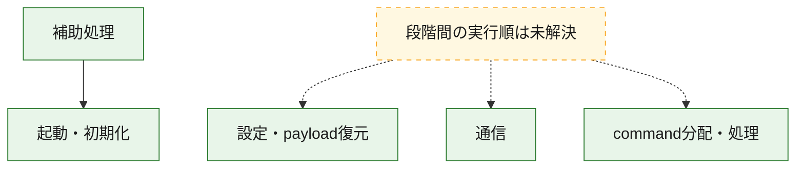
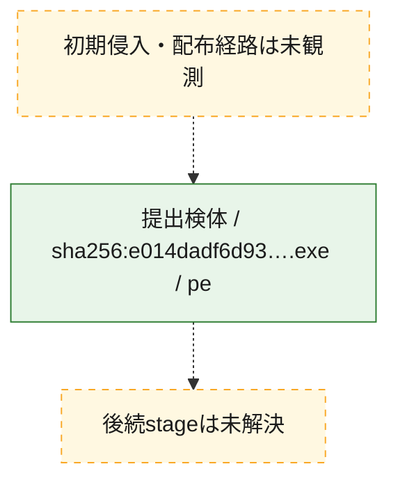
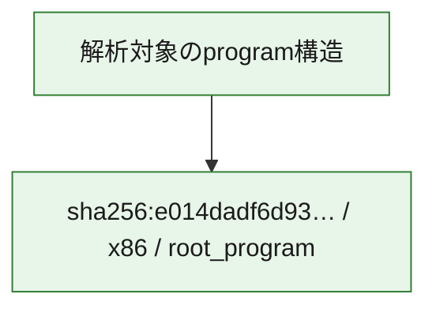

# 全体ロジック：e014dadf6d93b312b93e2fc857791c241692da4015da7a24a4d42a946551add2

代表関数の静的証跡から、起動・初期化、設定・payload復元、通信、command分配・処理の処理群を確認しました。

## 読み方

- phaseの掲載順は解析上の整理順です。observed_call_edgesがない段階間の実行順を断定しません。
- 図の実線は静的に観測した関係、点線と黄色のノードは未観測・未解決の関係を示します。
- 図は静的な要約であり、動的実行を再現するものではありません。
- 詳細な関数解説とfingerprintは[STATIC-LOGIC.md](STATIC-LOGIC.md)を参照してください。

## 静的可視化

### 実行フロー

### 感染チェーン

### モジュール関係

## 処理段階

### 1. 起動・初期化

entry pointから初期化と後続処理への移行を確認します。
確度: `confirmed_static_function_evidence`

- `e014dadf6d93b312b93e2fc857791c241692da4015da7a24a4d42a946551add2:ghidra:1400029f6` — 初期化と主要処理への分岐を行う入口関数です。 状態: `succeeded`、選定理由: `entry_point`, `meaningful_symbol_name`, `probable_go_main_user_code`, `reviewed_call_centrality:28`, `role:entrypoint`
- `e014dadf6d93b312b93e2fc857791c241692da4015da7a24a4d42a946551add2:ghidra:14001ef35` — 初期化と主要処理への分岐を行う入口関数です。 状態: `succeeded`、選定理由: `entry_point`, `meaningful_symbol_name`, `reviewed_call_centrality:2`, `role:entrypoint`

### 2. 設定・payload復元

設定、resource、payload、暗号化データの復元・変換を確認します。
確度: `confirmed_static_function_evidence`

- `e014dadf6d93b312b93e2fc857791c241692da4015da7a24a4d42a946551add2:ghidra:140006384` — 設定、resource、payloadなどの解析・変換を行う関数です。 状態: `succeeded`、選定理由: `meaningful_symbol_name`, `role:config_or_data_transform`
- `e014dadf6d93b312b93e2fc857791c241692da4015da7a24a4d42a946551add2:ghidra:14004ffa0` — 暗号、hash、encoding、または復号処理に関係する関数です。 状態: `succeeded`、選定理由: `meaningful_symbol_name`, `reviewed_call_centrality:1`, `role:cryptographic_transform`

### 3. 通信

通信初期化、endpoint処理、送受信の役割を確認します。
確度: `confirmed_static_function_evidence`

- `e014dadf6d93b312b93e2fc857791c241692da4015da7a24a4d42a946551add2:ghidra:14001f0d4` — 通信初期化、送受信、またはendpoint処理に関係する関数です。 状態: `succeeded`、選定理由: `entry_point`, `meaningful_symbol_name`, `reviewed_call_centrality:1`, `role:network_communication`
- `e014dadf6d93b312b93e2fc857791c241692da4015da7a24a4d42a946551add2:ghidra:14001f122` — 通信初期化、送受信、またはendpoint処理に関係する関数です。 状態: `succeeded`、選定理由: `entry_point`, `meaningful_symbol_name`, `reviewed_call_centrality:1`, `role:network_communication`
- `e014dadf6d93b312b93e2fc857791c241692da4015da7a24a4d42a946551add2:ghidra:14001f83c` — 通信初期化、送受信、またはendpoint処理に関係する関数です。 状態: `succeeded`、選定理由: `entry_point`, `meaningful_symbol_name`, `reviewed_call_centrality:1`, `role:network_communication`
- `e014dadf6d93b312b93e2fc857791c241692da4015da7a24a4d42a946551add2:ghidra:14001f891` — 通信初期化、送受信、またはendpoint処理に関係する関数です。 状態: `succeeded`、選定理由: `entry_point`, `meaningful_symbol_name`, `reviewed_call_centrality:1`, `role:network_communication`
- `e014dadf6d93b312b93e2fc857791c241692da4015da7a24a4d42a946551add2:ghidra:14001f8e6` — 通信初期化、送受信、またはendpoint処理に関係する関数です。 状態: `succeeded`、選定理由: `entry_point`, `meaningful_symbol_name`, `reviewed_call_centrality:1`, `role:network_communication`
- `e014dadf6d93b312b93e2fc857791c241692da4015da7a24a4d42a946551add2:ghidra:1400203fe` — 通信初期化、送受信、またはendpoint処理に関係する関数です。 状態: `succeeded`、選定理由: `entry_point`, `meaningful_symbol_name`, `reviewed_call_centrality:1`, `role:network_communication`
- `e014dadf6d93b312b93e2fc857791c241692da4015da7a24a4d42a946551add2:ghidra:140020449` — 通信初期化、送受信、またはendpoint処理に関係する関数です。 状態: `succeeded`、選定理由: `entry_point`, `meaningful_symbol_name`, `reviewed_call_centrality:1`, `role:network_communication`
- `e014dadf6d93b312b93e2fc857791c241692da4015da7a24a4d42a946551add2:ghidra:140020494` — 通信初期化、送受信、またはendpoint処理に関係する関数です。 状態: `succeeded`、選定理由: `entry_point`, `meaningful_symbol_name`, `reviewed_call_centrality:1`, `role:network_communication`
- `e014dadf6d93b312b93e2fc857791c241692da4015da7a24a4d42a946551add2:ghidra:140020f2d` — 通信初期化、送受信、またはendpoint処理に関係する関数です。 状態: `succeeded`、選定理由: `entry_point`, `meaningful_symbol_name`, `reviewed_call_centrality:1`, `role:network_communication`
- `e014dadf6d93b312b93e2fc857791c241692da4015da7a24a4d42a946551add2:ghidra:140021014` — 通信初期化、送受信、またはendpoint処理に関係する関数です。 状態: `succeeded`、選定理由: `entry_point`, `meaningful_symbol_name`, `reviewed_call_centrality:1`, `role:network_communication`

### 4. command分配・処理

受信commandやtaskの解釈、分配、個別handlerへの移行を確認します。
確度: `confirmed_static_function_evidence`

- `e014dadf6d93b312b93e2fc857791c241692da4015da7a24a4d42a946551add2:ghidra:140005ec2` — commandの解釈、分配、または個別処理を担当する関数です。 状態: `succeeded`、選定理由: `meaningful_symbol_name`, `reviewed_call_centrality:4`, `role:command_dispatch_or_handler`

### 5. 補助処理

主要処理を支える一般内部関数またはlibrary処理を確認します。
確度: `confirmed_static_function_evidence`

- `e014dadf6d93b312b93e2fc857791c241692da4015da7a24a4d42a946551add2:ghidra:140001040` — compiler生成処理または汎用library処理とみられる関数です。 状態: `succeeded`、選定理由: `meaningful_symbol_name`, `reviewed_call_centrality:32`
- `e014dadf6d93b312b93e2fc857791c241692da4015da7a24a4d42a946551add2:ghidra:140001480` — 検体内部の一般処理を実装する関数です。 状態: `succeeded`、選定理由: `entry_point`, `meaningful_symbol_name`, `reviewed_call_centrality:30`
- `e014dadf6d93b312b93e2fc857791c241692da4015da7a24a4d42a946551add2:ghidra:14001ef8e` — 検体内部の一般処理を実装する関数です。 状態: `succeeded`、選定理由: `entry_point`, `meaningful_symbol_name`, `reviewed_call_centrality:3`
- `e014dadf6d93b312b93e2fc857791c241692da4015da7a24a4d42a946551add2:ghidra:14001effd` — 検体内部の一般処理を実装する関数です。 状態: `succeeded`、選定理由: `entry_point`, `meaningful_symbol_name`
- `e014dadf6d93b312b93e2fc857791c241692da4015da7a24a4d42a946551add2:ghidra:14001f042` — 検体内部の一般処理を実装する関数です。 状態: `succeeded`、選定理由: `entry_point`, `meaningful_symbol_name`, `reviewed_call_centrality:1`
- `e014dadf6d93b312b93e2fc857791c241692da4015da7a24a4d42a946551add2:ghidra:14001f099` — 検体内部の一般処理を実装する関数です。 状態: `succeeded`、選定理由: `entry_point`, `meaningful_symbol_name`, `reviewed_call_centrality:1`
- `e014dadf6d93b312b93e2fc857791c241692da4015da7a24a4d42a946551add2:ghidra:14001f14e` — 検体内部の一般処理を実装する関数です。 状態: `succeeded`、選定理由: `entry_point`, `meaningful_symbol_name`, `reviewed_call_centrality:1`
- `e014dadf6d93b312b93e2fc857791c241692da4015da7a24a4d42a946551add2:ghidra:14001f17a` — 検体内部の一般処理を実装する関数です。 状態: `succeeded`、選定理由: `entry_point`, `meaningful_symbol_name`, `reviewed_call_centrality:1`
- `e014dadf6d93b312b93e2fc857791c241692da4015da7a24a4d42a946551add2:ghidra:14001f1b7` — 検体内部の一般処理を実装する関数です。 状態: `succeeded`、選定理由: `entry_point`, `meaningful_symbol_name`, `reviewed_call_centrality:1`
- `e014dadf6d93b312b93e2fc857791c241692da4015da7a24a4d42a946551add2:ghidra:14001f1f4` — 検体内部の一般処理を実装する関数です。 状態: `succeeded`、選定理由: `entry_point`, `meaningful_symbol_name`, `reviewed_call_centrality:1`
- `e014dadf6d93b312b93e2fc857791c241692da4015da7a24a4d42a946551add2:ghidra:14001f233` — 検体内部の一般処理を実装する関数です。 状態: `succeeded`、選定理由: `entry_point`, `meaningful_symbol_name`, `reviewed_call_centrality:1`
- `e014dadf6d93b312b93e2fc857791c241692da4015da7a24a4d42a946551add2:ghidra:14001f296` — 検体内部の一般処理を実装する関数です。 状態: `succeeded`、選定理由: `entry_point`, `meaningful_symbol_name`, `reviewed_call_centrality:1`
- `e014dadf6d93b312b93e2fc857791c241692da4015da7a24a4d42a946551add2:ghidra:14001f2f9` — 検体内部の一般処理を実装する関数です。 状態: `succeeded`、選定理由: `entry_point`, `meaningful_symbol_name`, `reviewed_call_centrality:1`
- `e014dadf6d93b312b93e2fc857791c241692da4015da7a24a4d42a946551add2:ghidra:14001f33a` — 検体内部の一般処理を実装する関数です。 状態: `succeeded`、選定理由: `entry_point`, `meaningful_symbol_name`, `reviewed_call_centrality:1`
- `e014dadf6d93b312b93e2fc857791c241692da4015da7a24a4d42a946551add2:ghidra:14001f37b` — 検体内部の一般処理を実装する関数です。 状態: `succeeded`、選定理由: `entry_point`, `meaningful_symbol_name`, `reviewed_call_centrality:1`
- `e014dadf6d93b312b93e2fc857791c241692da4015da7a24a4d42a946551add2:ghidra:14001f3d0` — 検体内部の一般処理を実装する関数です。 状態: `succeeded`、選定理由: `entry_point`, `meaningful_symbol_name`, `reviewed_call_centrality:1`
- `e014dadf6d93b312b93e2fc857791c241692da4015da7a24a4d42a946551add2:ghidra:14001f425` — 検体内部の一般処理を実装する関数です。 状態: `succeeded`、選定理由: `entry_point`, `meaningful_symbol_name`, `reviewed_call_centrality:1`

## 観測したcall関係

- `e014dadf6d93b312b93e2fc857791c241692da4015da7a24a4d42a946551add2:ghidra:140001040` → `e014dadf6d93b312b93e2fc857791c241692da4015da7a24a4d42a946551add2:ghidra:1400029f6` （`support` → `startup`）
- `e014dadf6d93b312b93e2fc857791c241692da4015da7a24a4d42a946551add2:ghidra:140001480` → `e014dadf6d93b312b93e2fc857791c241692da4015da7a24a4d42a946551add2:ghidra:1400029f6` （`support` → `startup`）
- `ghidra-function:1237daf72959b53b1055980a` → `ghidra-function:a39602c34ac93b63bb40f280` （`unclassified` → `unclassified`）
- `ghidra-function:1525320b2d37663f14bc0c47` → `ghidra-function:c26c21ac22a2f81dbeff7ef7` （`unclassified` → `unclassified`）
- `ghidra-function:249f0cb1661bf6e29b23a186` → `ghidra-external:10f2915e256949df25ae1065` （`unclassified` → `unclassified`）
- `ghidra-function:249f0cb1661bf6e29b23a186` → `ghidra-external:81c07bf3c0e35fbf333bbce3` （`unclassified` → `unclassified`）
- `ghidra-function:249f0cb1661bf6e29b23a186` → `ghidra-external:aeeec0e03d1152ab16ef9793` （`unclassified` → `unclassified`）
- `ghidra-function:249f0cb1661bf6e29b23a186` → `ghidra-external:d2c11b7ad29dd1044b30711b` （`unclassified` → `unclassified`）
- `ghidra-function:249f0cb1661bf6e29b23a186` → `ghidra-external:f743f2c9673487c798158aaa` （`unclassified` → `unclassified`）
- `ghidra-function:249f0cb1661bf6e29b23a186` → `ghidra-external:f81e8d40689b822693522bf0` （`unclassified` → `unclassified`）
- `ghidra-function:249f0cb1661bf6e29b23a186` → `ghidra-function:0962efcf07eae5afa31788ba` （`unclassified` → `unclassified`）
- `ghidra-function:249f0cb1661bf6e29b23a186` → `ghidra-function:1e2bd11b3e64a2dde9f5ef70` （`unclassified` → `unclassified`）
- `ghidra-function:249f0cb1661bf6e29b23a186` → `ghidra-function:1ec66db69377d24000904f41` （`unclassified` → `unclassified`）
- `ghidra-function:249f0cb1661bf6e29b23a186` → `ghidra-function:2021c3095946ead8b8b350f8` （`unclassified` → `unclassified`）
- `ghidra-function:249f0cb1661bf6e29b23a186` → `ghidra-function:429c6740583416de89ba1488` （`unclassified` → `unclassified`）
- `ghidra-function:249f0cb1661bf6e29b23a186` → `ghidra-function:45dd420518031f26068dcb37` （`unclassified` → `unclassified`）
- `ghidra-function:249f0cb1661bf6e29b23a186` → `ghidra-function:491881d6628a38d2eb74d5af` （`unclassified` → `unclassified`）
- `ghidra-function:249f0cb1661bf6e29b23a186` → `ghidra-function:4eafff25b4c8f8a146d3b2f8` （`unclassified` → `unclassified`）
- `ghidra-function:249f0cb1661bf6e29b23a186` → `ghidra-function:60a1742f463b9485d59a5312` （`unclassified` → `unclassified`）
- `ghidra-function:249f0cb1661bf6e29b23a186` → `ghidra-function:640e17c4709469eceffb87fb` （`unclassified` → `unclassified`）
- `ghidra-function:249f0cb1661bf6e29b23a186` → `ghidra-function:74feedbf37bd8e04e8c11c1d` （`unclassified` → `unclassified`）
- `ghidra-function:249f0cb1661bf6e29b23a186` → `ghidra-function:bb182b58518cbe56f7eb6d82` （`unclassified` → `unclassified`）
- `ghidra-function:249f0cb1661bf6e29b23a186` → `ghidra-function:bcb7016fc38dd10dead3227a` （`unclassified` → `unclassified`）
- `ghidra-function:249f0cb1661bf6e29b23a186` → `ghidra-function:bd2473070b702067611b44f7` （`unclassified` → `unclassified`）
- `ghidra-function:249f0cb1661bf6e29b23a186` → `ghidra-function:ec01dce958d6616cdcc367e3` （`unclassified` → `unclassified`）
- `ghidra-function:249f0cb1661bf6e29b23a186` → `ghidra-function:f8ae6fc87e34769f5abb7920` （`unclassified` → `unclassified`）
- `ghidra-function:2e57264b5cb59c4de7d3a5e1` → `ghidra-function:016f8a129dd4301710c57ace` （`unclassified` → `unclassified`）
- `ghidra-function:361240a45683f1e897af92f9` → `ghidra-external:3b96b0e26f625fe88d1c2311` （`unclassified` → `unclassified`）
- `ghidra-function:433086616bb1a45cd81e99e6` → `ghidra-function:d32bead63d59445d2102a80f` （`unclassified` → `unclassified`）
- `ghidra-function:4ea6dd5987f2529da65aa89c` → `ghidra-function:82750ae31d0a32871d290106` （`unclassified` → `unclassified`）
- `ghidra-function:53082f0c9f6baad687f89da0` → `ghidra-function:07ae466deb4c693e9429eab2` （`unclassified` → `unclassified`）
- `ghidra-function:53082f0c9f6baad687f89da0` → `ghidra-function:c9837f89360f0eee674bd488` （`unclassified` → `unclassified`）
- `ghidra-function:6030d5c46f201e9530154214` → `ghidra-function:f8a009ca3ad54f959949056c` （`unclassified` → `unclassified`）
- `ghidra-function:614c5930489f57222bc1417c` → `ghidra-external:92f6ad3389419169d7c18821` （`unclassified` → `unclassified`）
- `ghidra-function:614c5930489f57222bc1417c` → `ghidra-function:2fac500fbaa58c9a91cab0cf` （`unclassified` → `unclassified`）
- `ghidra-function:614c5930489f57222bc1417c` → `ghidra-function:588172c3a2306a14ced5ca8b` （`unclassified` → `unclassified`）
- `ghidra-function:624b1052c768ab5c1cb7bb07` → `ghidra-function:70fa1340eb7051c1747d4c43` （`unclassified` → `unclassified`）
- `ghidra-function:78ca0a142510d3d51e85c293` → `ghidra-external:25252ef777326b33bbba046f` （`unclassified` → `unclassified`）
- `ghidra-function:78ca0a142510d3d51e85c293` → `ghidra-external:3d9cde6e452d73dd94bad56b` （`unclassified` → `unclassified`）
- `ghidra-function:78ca0a142510d3d51e85c293` → `ghidra-external:494861fd0388bafb53786537` （`unclassified` → `unclassified`）
- `ghidra-function:78ca0a142510d3d51e85c293` → `ghidra-external:4bcc69e4ad024d0261e7e250` （`unclassified` → `unclassified`）
- `ghidra-function:78ca0a142510d3d51e85c293` → `ghidra-external:50c34068afdf2435326be2e2` （`unclassified` → `unclassified`）
- `ghidra-function:78ca0a142510d3d51e85c293` → `ghidra-external:6a7cb16d9d69158129f2cabe` （`unclassified` → `unclassified`）
- `ghidra-function:78ca0a142510d3d51e85c293` → `ghidra-external:6d819f670a77c8438b2c837e` （`unclassified` → `unclassified`）
- `ghidra-function:78ca0a142510d3d51e85c293` → `ghidra-external:6de901ef2955a977b40a113a` （`unclassified` → `unclassified`）
- `ghidra-function:78ca0a142510d3d51e85c293` → `ghidra-external:73e164652966de8ae3f818c2` （`unclassified` → `unclassified`）
- `ghidra-function:78ca0a142510d3d51e85c293` → `ghidra-external:751a402d923bb6812d270831` （`unclassified` → `unclassified`）
- `ghidra-function:78ca0a142510d3d51e85c293` → `ghidra-external:80051000fe0c0acdbc20e1ae` （`unclassified` → `unclassified`）
- `ghidra-function:78ca0a142510d3d51e85c293` → `ghidra-external:857566778afa6e5af69f9e7a` （`unclassified` → `unclassified`）
- `ghidra-function:78ca0a142510d3d51e85c293` → `ghidra-external:8ff81e48f08be395e71aef82` （`unclassified` → `unclassified`）
- `ghidra-function:78ca0a142510d3d51e85c293` → `ghidra-external:92f6ad3389419169d7c18821` （`unclassified` → `unclassified`）
- `ghidra-function:78ca0a142510d3d51e85c293` → `ghidra-external:9bfb0c908f160ea1ecfa593f` （`unclassified` → `unclassified`）
- `ghidra-function:78ca0a142510d3d51e85c293` → `ghidra-external:b571a7e28561d7a34108fb6a` （`unclassified` → `unclassified`）
- `ghidra-function:78ca0a142510d3d51e85c293` → `ghidra-external:b78de80b77c075a8b0be0c21` （`unclassified` → `unclassified`）
- `ghidra-function:78ca0a142510d3d51e85c293` → `ghidra-external:c1020caf82ed13142b5478f2` （`unclassified` → `unclassified`）
- `ghidra-function:78ca0a142510d3d51e85c293` → `ghidra-external:f5b5f75f8742f8ef23d83e10` （`unclassified` → `unclassified`）
- `ghidra-function:78ca0a142510d3d51e85c293` → `ghidra-external:f5cf7b0d2f3933329244075b` （`unclassified` → `unclassified`）
- `ghidra-function:78ca0a142510d3d51e85c293` → `ghidra-external:f987f88228e827d78775f8bc` （`unclassified` → `unclassified`）
- `ghidra-function:78ca0a142510d3d51e85c293` → `ghidra-function:0962efcf07eae5afa31788ba` （`unclassified` → `unclassified`）
- `ghidra-function:78ca0a142510d3d51e85c293` → `ghidra-function:249f0cb1661bf6e29b23a186` （`unclassified` → `unclassified`）
- `ghidra-function:78ca0a142510d3d51e85c293` → `ghidra-function:87c630260020865433c20ff0` （`unclassified` → `unclassified`）
- `ghidra-function:78ca0a142510d3d51e85c293` → `ghidra-function:8fa03d4d67f5163afe642294` （`unclassified` → `unclassified`）
- `ghidra-function:78ca0a142510d3d51e85c293` → `ghidra-function:c0fa023941c74a5147aa515c` （`unclassified` → `unclassified`）
- `ghidra-function:78ca0a142510d3d51e85c293` → `ghidra-function:c6a984f4a6c3b7a9e675455a` （`unclassified` → `unclassified`）
- `ghidra-function:78ca0a142510d3d51e85c293` → `ghidra-function:c6c71145a4354d28dd063122` （`unclassified` → `unclassified`）
- `ghidra-function:78ca0a142510d3d51e85c293` → `ghidra-function:d1bc62a29611aaf784027d45` （`unclassified` → `unclassified`）
- `ghidra-function:78ca0a142510d3d51e85c293` → `ghidra-function:ed4f5813edd5fbbff2a965d4` （`unclassified` → `unclassified`）
- `ghidra-function:7f0350b5f6d7b97923c1d5e8` → `ghidra-external:1ff96f190f583a3e726bc7da` （`unclassified` → `unclassified`）
- `ghidra-function:7f0350b5f6d7b97923c1d5e8` → `ghidra-external:43ff29a97ba60cf248971f1a` （`unclassified` → `unclassified`）
- `ghidra-function:7f0350b5f6d7b97923c1d5e8` → `ghidra-function:274c14ba755aef3289687fe8` （`unclassified` → `unclassified`）
- `ghidra-function:7f0350b5f6d7b97923c1d5e8` → `ghidra-function:3ecd20e46a306da8ec6fbf0a` （`unclassified` → `unclassified`）
- `ghidra-function:8676dce90ed8e3f9a98108d4` → `ghidra-external:25252ef777326b33bbba046f` （`unclassified` → `unclassified`）
- `ghidra-function:8676dce90ed8e3f9a98108d4` → `ghidra-external:3d9cde6e452d73dd94bad56b` （`unclassified` → `unclassified`）
- `ghidra-function:8676dce90ed8e3f9a98108d4` → `ghidra-external:494861fd0388bafb53786537` （`unclassified` → `unclassified`）
- `ghidra-function:8676dce90ed8e3f9a98108d4` → `ghidra-external:4bcc69e4ad024d0261e7e250` （`unclassified` → `unclassified`）
- `ghidra-function:8676dce90ed8e3f9a98108d4` → `ghidra-external:6a7cb16d9d69158129f2cabe` （`unclassified` → `unclassified`）
- `ghidra-function:8676dce90ed8e3f9a98108d4` → `ghidra-external:6d819f670a77c8438b2c837e` （`unclassified` → `unclassified`）
- `ghidra-function:8676dce90ed8e3f9a98108d4` → `ghidra-external:6de901ef2955a977b40a113a` （`unclassified` → `unclassified`）
- `ghidra-function:8676dce90ed8e3f9a98108d4` → `ghidra-external:73e164652966de8ae3f818c2` （`unclassified` → `unclassified`）
- `ghidra-function:8676dce90ed8e3f9a98108d4` → `ghidra-external:751a402d923bb6812d270831` （`unclassified` → `unclassified`）
- `ghidra-function:8676dce90ed8e3f9a98108d4` → `ghidra-external:80051000fe0c0acdbc20e1ae` （`unclassified` → `unclassified`）
- `ghidra-function:8676dce90ed8e3f9a98108d4` → `ghidra-external:857566778afa6e5af69f9e7a` （`unclassified` → `unclassified`）
- `ghidra-function:8676dce90ed8e3f9a98108d4` → `ghidra-external:8ff81e48f08be395e71aef82` （`unclassified` → `unclassified`）
- `ghidra-function:8676dce90ed8e3f9a98108d4` → `ghidra-external:92f6ad3389419169d7c18821` （`unclassified` → `unclassified`）
- `ghidra-function:8676dce90ed8e3f9a98108d4` → `ghidra-external:9bfb0c908f160ea1ecfa593f` （`unclassified` → `unclassified`）
- `ghidra-function:8676dce90ed8e3f9a98108d4` → `ghidra-external:b571a7e28561d7a34108fb6a` （`unclassified` → `unclassified`）
- `ghidra-function:8676dce90ed8e3f9a98108d4` → `ghidra-external:c1020caf82ed13142b5478f2` （`unclassified` → `unclassified`）
- `ghidra-function:8676dce90ed8e3f9a98108d4` → `ghidra-external:f5b5f75f8742f8ef23d83e10` （`unclassified` → `unclassified`）
- `ghidra-function:8676dce90ed8e3f9a98108d4` → `ghidra-external:f5cf7b0d2f3933329244075b` （`unclassified` → `unclassified`）
- `ghidra-function:8676dce90ed8e3f9a98108d4` → `ghidra-external:f987f88228e827d78775f8bc` （`unclassified` → `unclassified`）
- `ghidra-function:8676dce90ed8e3f9a98108d4` → `ghidra-function:0962efcf07eae5afa31788ba` （`unclassified` → `unclassified`）
- `ghidra-function:8676dce90ed8e3f9a98108d4` → `ghidra-function:249f0cb1661bf6e29b23a186` （`unclassified` → `unclassified`）
- `ghidra-function:8676dce90ed8e3f9a98108d4` → `ghidra-function:87c630260020865433c20ff0` （`unclassified` → `unclassified`）
- `ghidra-function:8676dce90ed8e3f9a98108d4` → `ghidra-function:8fa03d4d67f5163afe642294` （`unclassified` → `unclassified`）
- `ghidra-function:8676dce90ed8e3f9a98108d4` → `ghidra-function:c0fa023941c74a5147aa515c` （`unclassified` → `unclassified`）
- `ghidra-function:8676dce90ed8e3f9a98108d4` → `ghidra-function:c6a984f4a6c3b7a9e675455a` （`unclassified` → `unclassified`）
- `ghidra-function:8676dce90ed8e3f9a98108d4` → `ghidra-function:c6c71145a4354d28dd063122` （`unclassified` → `unclassified`）
- `ghidra-function:8676dce90ed8e3f9a98108d4` → `ghidra-function:d1bc62a29611aaf784027d45` （`unclassified` → `unclassified`）
- `ghidra-function:8676dce90ed8e3f9a98108d4` → `ghidra-function:ed4f5813edd5fbbff2a965d4` （`unclassified` → `unclassified`）
- `ghidra-function:8972095cb03de23ac0176f83` → `ghidra-function:6fc20f294e4fa8982051ca6f` （`unclassified` → `unclassified`）
- `ghidra-function:8d9d281d2aa9251bb20a599a` → `ghidra-function:f11a40e485493fef3a465946` （`unclassified` → `unclassified`）
- `ghidra-function:8f2a8f750fbfb22711bae574` → `ghidra-function:9b5538a9591ab90b2e5ca31e` （`unclassified` → `unclassified`）
- `ghidra-function:922744928f811a9636da191e` → `ghidra-function:d2bb3e3dddc0b58d3d431f46` （`unclassified` → `unclassified`）
- `ghidra-function:9a052f01f4c42ef367e60be7` → `ghidra-function:f0cc445b63116ce3fd4d8324` （`unclassified` → `unclassified`）
- `ghidra-function:a31374eeee842dfd0bf547a8` → `ghidra-function:e2903291ccc1abd713b16ad7` （`unclassified` → `unclassified`）
- `ghidra-function:a7ffb0ff2f3b5be1f22eb228` → `ghidra-function:c74f72bd68042a765c91d15e` （`unclassified` → `unclassified`）
- `ghidra-function:a9ced5be686a957bb3606845` → `ghidra-function:deefd53ea86c62663e30655b` （`unclassified` → `unclassified`）
- `ghidra-function:ac531892cea0e2b335180de6` → `ghidra-function:eadf8365e7e26e06e983ebaf` （`unclassified` → `unclassified`）
- `ghidra-function:ba6615c4a111873d916967ab` → `ghidra-function:e825892d3c0a807a3bc82e23` （`unclassified` → `unclassified`）
- `ghidra-function:c642709af05ef3983c467792` → `ghidra-function:599b31d8ddbfc3ce9c773661` （`unclassified` → `unclassified`）
- `ghidra-function:d928f8afd44a722b4af0b979` → `ghidra-function:4df3b1c333c1b1918632cf21` （`unclassified` → `unclassified`）
- `ghidra-function:db57a568b2c45eeb59c31b39` → `ghidra-function:6d70fd5df309fdc0dee2f9d3` （`unclassified` → `unclassified`）
- `ghidra-function:ee2de90ecc3c68121bae6c2e` → `ghidra-function:4d12e508498214f2b1c9ab06` （`unclassified` → `unclassified`）
- `ghidra-function:f3aeca22035e55f607eeda3b` → `ghidra-function:c341d9dff6b1db46258f76e7` （`unclassified` → `unclassified`）
- `ghidra-function:f6205c64260324356fc3579a` → `ghidra-function:fb25ce337197a60143c8aa72` （`unclassified` → `unclassified`）

## 解析範囲と制約

- 選定外関数は全体inventoryへ残しますが、関数本体の個別解説対象にはしていません。
- indirect call、難読化、packer、VM、壊れたcontrol flowによりcall関係が欠落する場合があります。
- 文書は静的解析に基づき、検体実行や外部通信による動的確認は行っていません。
