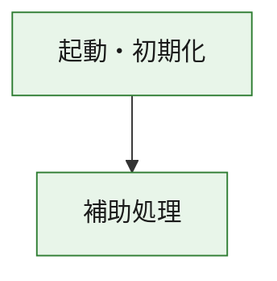
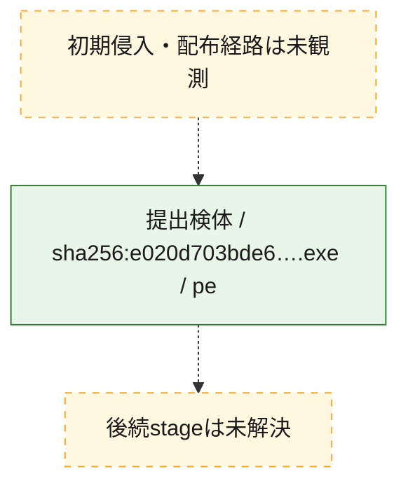
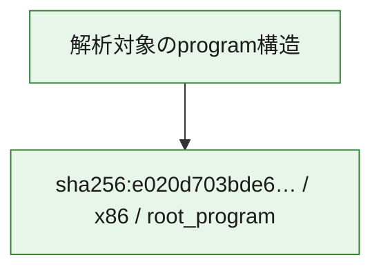

# 全体ロジック：e020d703bde68b8d587bf7a5345f3e306ad06f1b732c0cf4ebd3950c90da53a0

代表関数の静的証跡から、起動・初期化の処理群を確認しました。

## 読み方

- phaseの掲載順は解析上の整理順です。observed_call_edgesがない段階間の実行順を断定しません。
- 図の実線は静的に観測した関係、点線と黄色のノードは未観測・未解決の関係を示します。
- 図は静的な要約であり、動的実行を再現するものではありません。
- 詳細な関数解説とfingerprintは[STATIC-LOGIC.md](STATIC-LOGIC.md)を参照してください。

## 静的可視化

### 実行フロー

### 感染チェーン

### モジュール関係

## 処理段階

### 1. 起動・初期化

entry pointから初期化と後続処理への移行を確認します。
確度: `confirmed_static_function_evidence`

- `e020d703bde68b8d587bf7a5345f3e306ad06f1b732c0cf4ebd3950c90da53a0:ghidra:180001010` — 初期化と主要処理への分岐を行う入口関数です。 状態: `succeeded`、選定理由: `entry_point`, `meaningful_symbol_name`, `reviewed_call_centrality:22`, `role:entrypoint`, `small_program_complete_context`

### 2. 補助処理

主要処理を支える一般内部関数またはlibrary処理を確認します。
確度: `confirmed_static_function_evidence`

- `e020d703bde68b8d587bf7a5345f3e306ad06f1b732c0cf4ebd3950c90da53a0:ghidra:180001240` — 検体内部の一般処理を実装する関数です。 状態: `succeeded`、選定理由: `context_representative`, `reviewed_call_centrality:2`, `small_program_complete_context`
- `e020d703bde68b8d587bf7a5345f3e306ad06f1b732c0cf4ebd3950c90da53a0:ghidra:180001350` — 検体内部の一般処理を実装する関数です。 状態: `succeeded`、選定理由: `context_representative`, `reviewed_call_centrality:25`, `small_program_complete_context`
- `e020d703bde68b8d587bf7a5345f3e306ad06f1b732c0cf4ebd3950c90da53a0:ghidra:180003780` — 検体内部の一般処理を実装する関数です。 状態: `succeeded`、選定理由: `context_representative`, `reviewed_call_centrality:2`, `small_program_complete_context`
- `e020d703bde68b8d587bf7a5345f3e306ad06f1b732c0cf4ebd3950c90da53a0:ghidra:1800038e0` — 検体内部の一般処理を実装する関数です。 状態: `succeeded`、選定理由: `context_representative`, `reviewed_call_centrality:2`, `small_program_complete_context`

## 観測したcall関係

- `e020d703bde68b8d587bf7a5345f3e306ad06f1b732c0cf4ebd3950c90da53a0:ghidra:180001010` → `e020d703bde68b8d587bf7a5345f3e306ad06f1b732c0cf4ebd3950c90da53a0:ghidra:180001240` （`startup` → `support`）
- `e020d703bde68b8d587bf7a5345f3e306ad06f1b732c0cf4ebd3950c90da53a0:ghidra:180001010` → `e020d703bde68b8d587bf7a5345f3e306ad06f1b732c0cf4ebd3950c90da53a0:ghidra:180001350` （`startup` → `support`）
- `e020d703bde68b8d587bf7a5345f3e306ad06f1b732c0cf4ebd3950c90da53a0:ghidra:180001350` → `e020d703bde68b8d587bf7a5345f3e306ad06f1b732c0cf4ebd3950c90da53a0:ghidra:180001240` （`support` → `support`）
- `e020d703bde68b8d587bf7a5345f3e306ad06f1b732c0cf4ebd3950c90da53a0:ghidra:180001350` → `e020d703bde68b8d587bf7a5345f3e306ad06f1b732c0cf4ebd3950c90da53a0:ghidra:180003780` （`support` → `support`）
- `e020d703bde68b8d587bf7a5345f3e306ad06f1b732c0cf4ebd3950c90da53a0:ghidra:180001350` → `e020d703bde68b8d587bf7a5345f3e306ad06f1b732c0cf4ebd3950c90da53a0:ghidra:1800038e0` （`support` → `support`）
- `e020d703bde68b8d587bf7a5345f3e306ad06f1b732c0cf4ebd3950c90da53a0:ghidra:180003780` → `e020d703bde68b8d587bf7a5345f3e306ad06f1b732c0cf4ebd3950c90da53a0:ghidra:1800038e0` （`support` → `support`）
- `ghidra-function:42c11a1ca0d3c3a2d7a7dc0c` → `ghidra-function:698c4f0c68873bfa415640ec` （`unclassified` → `unclassified`）
- `ghidra-function:54386e73121596249b3ac922` → `ghidra-external:14af75491a6095cf272589a4` （`unclassified` → `unclassified`）
- `ghidra-function:54386e73121596249b3ac922` → `ghidra-external:1eb0ba403b51225c7051d1d3` （`unclassified` → `unclassified`）
- `ghidra-function:54386e73121596249b3ac922` → `ghidra-external:2ccbbd2eabda711c2119225f` （`unclassified` → `unclassified`）
- `ghidra-function:54386e73121596249b3ac922` → `ghidra-external:4df306dadcedb7b6e106b02e` （`unclassified` → `unclassified`）
- `ghidra-function:54386e73121596249b3ac922` → `ghidra-external:4e45ec8e2291c0af4203d7b8` （`unclassified` → `unclassified`）
- `ghidra-function:54386e73121596249b3ac922` → `ghidra-external:8111f0a1677dbe35e6c1f7a3` （`unclassified` → `unclassified`）
- `ghidra-function:54386e73121596249b3ac922` → `ghidra-external:8f92d19622898e9bd9a214ff` （`unclassified` → `unclassified`）
- `ghidra-function:54386e73121596249b3ac922` → `ghidra-external:9ba06a1d963ab1229cd36915` （`unclassified` → `unclassified`）
- `ghidra-function:54386e73121596249b3ac922` → `ghidra-external:b23dbbf8b1c92fd42b957dd1` （`unclassified` → `unclassified`）
- `ghidra-function:54386e73121596249b3ac922` → `ghidra-external:b3fb570ecd62f10f6f0f68f7` （`unclassified` → `unclassified`）
- `ghidra-function:54386e73121596249b3ac922` → `ghidra-external:c2fa2bbb64f672496721e46e` （`unclassified` → `unclassified`）
- `ghidra-function:54386e73121596249b3ac922` → `ghidra-external:c7f80f1f826ce6c5e8a83009` （`unclassified` → `unclassified`）
- `ghidra-function:54386e73121596249b3ac922` → `ghidra-external:cf138c9c791c933090a2af48` （`unclassified` → `unclassified`）
- `ghidra-function:54386e73121596249b3ac922` → `ghidra-external:d70a437a9dd7d7f56701c28c` （`unclassified` → `unclassified`）
- `ghidra-function:54386e73121596249b3ac922` → `ghidra-external:da7352db6f71ef443ebfa478` （`unclassified` → `unclassified`）
- `ghidra-function:54386e73121596249b3ac922` → `ghidra-external:de6d410f74c0ad0670405d8a` （`unclassified` → `unclassified`）
- `ghidra-function:54386e73121596249b3ac922` → `ghidra-external:e2803623011dcf93bf06897b` （`unclassified` → `unclassified`）
- `ghidra-function:54386e73121596249b3ac922` → `ghidra-external:ed5890dace30b060e58fb6b8` （`unclassified` → `unclassified`）
- `ghidra-function:54386e73121596249b3ac922` → `ghidra-external:f58ef75c197f5c2a544ee81c` （`unclassified` → `unclassified`）
- `ghidra-function:54386e73121596249b3ac922` → `ghidra-external:f7bb5397962a69b5b24c469e` （`unclassified` → `unclassified`）
- `ghidra-function:54386e73121596249b3ac922` → `ghidra-external:faafbc2bfd422aa31acbf08a` （`unclassified` → `unclassified`）
- `ghidra-function:54386e73121596249b3ac922` → `ghidra-function:42c11a1ca0d3c3a2d7a7dc0c` （`unclassified` → `unclassified`）
- `ghidra-function:54386e73121596249b3ac922` → `ghidra-function:698c4f0c68873bfa415640ec` （`unclassified` → `unclassified`）
- `ghidra-function:54386e73121596249b3ac922` → `ghidra-function:ed6a87bad6f824e028287227` （`unclassified` → `unclassified`）
- `ghidra-function:e1d0624cfe32764da0580fe8` → `ghidra-function:2458f7b9efb2874d29874be4` （`unclassified` → `unclassified`）
- `ghidra-function:e1d0624cfe32764da0580fe8` → `ghidra-function:54386e73121596249b3ac922` （`unclassified` → `unclassified`）
- `ghidra-function:e1d0624cfe32764da0580fe8` → `ghidra-function:56bbb2a78089851a12c24536` （`unclassified` → `unclassified`）
- `ghidra-function:e1d0624cfe32764da0580fe8` → `ghidra-function:6b9ecefc7c4eb5f2a9bbebb7` （`unclassified` → `unclassified`）
- `ghidra-function:e1d0624cfe32764da0580fe8` → `ghidra-function:a7d7b43ecea0739d29c7735d` （`unclassified` → `unclassified`）
- `ghidra-function:e1d0624cfe32764da0580fe8` → `ghidra-function:ac8216338563c7e4333114de` （`unclassified` → `unclassified`）
- `ghidra-function:e1d0624cfe32764da0580fe8` → `ghidra-function:b33d660f03e4ae9949fd1e4f` （`unclassified` → `unclassified`）
- `ghidra-function:e1d0624cfe32764da0580fe8` → `ghidra-function:bfe4a9ebc5156dff8e79b84e` （`unclassified` → `unclassified`）
- `ghidra-function:e1d0624cfe32764da0580fe8` → `ghidra-function:e919b2247c3e953656868c08` （`unclassified` → `unclassified`）
- `ghidra-function:e1d0624cfe32764da0580fe8` → `ghidra-function:ed6a87bad6f824e028287227` （`unclassified` → `unclassified`）
- `ghidra-function:e1d0624cfe32764da0580fe8` → `ghidra-function:f52ef633b1db0d82b0714236` （`unclassified` → `unclassified`）
- `ghidra-function:e1d0624cfe32764da0580fe8` → `ghidra-function:fcbc2555c22fb0992791248a` （`unclassified` → `unclassified`）

## 解析範囲と制約

- 選定外関数は全体inventoryへ残しますが、関数本体の個別解説対象にはしていません。
- indirect call、難読化、packer、VM、壊れたcontrol flowによりcall関係が欠落する場合があります。
- 文書は静的解析に基づき、検体実行や外部通信による動的確認は行っていません。
