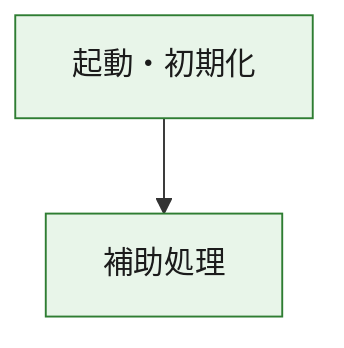
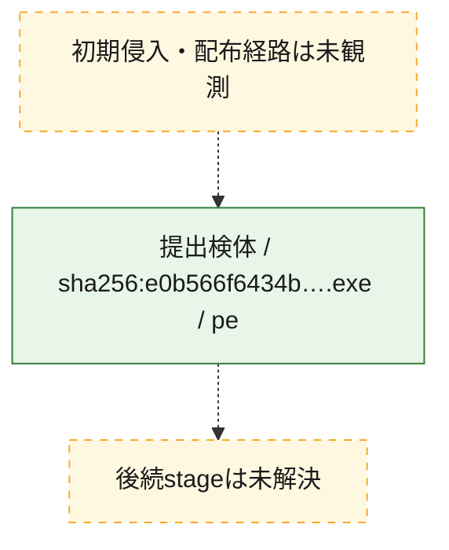
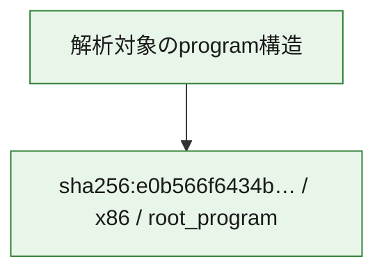

# 全体ロジック：e0b566f6434bc418ab3d8dea59e574338b22a15d66123fe1fb2b4438e27eb18a

代表関数の静的証跡から、起動・初期化の処理群を確認しました。

## 読み方

- phaseの掲載順は解析上の整理順です。observed_call_edgesがない段階間の実行順を断定しません。
- 図の実線は静的に観測した関係、点線と黄色のノードは未観測・未解決の関係を示します。
- 図は静的な要約であり、動的実行を再現するものではありません。
- 詳細な関数解説とfingerprintは[STATIC-LOGIC.md](STATIC-LOGIC.md)を参照してください。

## 静的可視化

### 実行フロー

### 感染チェーン

### モジュール関係

## 処理段階

### 1. 起動・初期化

entry pointから初期化と後続処理への移行を確認します。
確度: `confirmed_static_function_evidence`

- `e0b566f6434bc418ab3d8dea59e574338b22a15d66123fe1fb2b4438e27eb18a:ghidra:180001010` — 初期化と主要処理への分岐を行う入口関数です。 状態: `succeeded`、選定理由: `entry_point`, `meaningful_symbol_name`, `reviewed_call_centrality:22`, `role:entrypoint`, `small_program_complete_context`

### 2. 補助処理

主要処理を支える一般内部関数またはlibrary処理を確認します。
確度: `confirmed_static_function_evidence`

- `e0b566f6434bc418ab3d8dea59e574338b22a15d66123fe1fb2b4438e27eb18a:ghidra:180001240` — 検体内部の一般処理を実装する関数です。 状態: `succeeded`、選定理由: `context_representative`, `reviewed_call_centrality:2`, `small_program_complete_context`
- `e0b566f6434bc418ab3d8dea59e574338b22a15d66123fe1fb2b4438e27eb18a:ghidra:180001350` — 検体内部の一般処理を実装する関数です。 状態: `succeeded`、選定理由: `context_representative`, `reviewed_call_centrality:25`, `small_program_complete_context`
- `e0b566f6434bc418ab3d8dea59e574338b22a15d66123fe1fb2b4438e27eb18a:ghidra:180003780` — 検体内部の一般処理を実装する関数です。 状態: `succeeded`、選定理由: `context_representative`, `reviewed_call_centrality:2`, `small_program_complete_context`
- `e0b566f6434bc418ab3d8dea59e574338b22a15d66123fe1fb2b4438e27eb18a:ghidra:1800038e0` — 検体内部の一般処理を実装する関数です。 状態: `succeeded`、選定理由: `context_representative`, `reviewed_call_centrality:2`, `small_program_complete_context`

## 観測したcall関係

- `e0b566f6434bc418ab3d8dea59e574338b22a15d66123fe1fb2b4438e27eb18a:ghidra:180001010` → `e0b566f6434bc418ab3d8dea59e574338b22a15d66123fe1fb2b4438e27eb18a:ghidra:180001240` （`startup` → `support`）
- `e0b566f6434bc418ab3d8dea59e574338b22a15d66123fe1fb2b4438e27eb18a:ghidra:180001010` → `e0b566f6434bc418ab3d8dea59e574338b22a15d66123fe1fb2b4438e27eb18a:ghidra:180001350` （`startup` → `support`）
- `e0b566f6434bc418ab3d8dea59e574338b22a15d66123fe1fb2b4438e27eb18a:ghidra:180001350` → `e0b566f6434bc418ab3d8dea59e574338b22a15d66123fe1fb2b4438e27eb18a:ghidra:180001240` （`support` → `support`）
- `e0b566f6434bc418ab3d8dea59e574338b22a15d66123fe1fb2b4438e27eb18a:ghidra:180001350` → `e0b566f6434bc418ab3d8dea59e574338b22a15d66123fe1fb2b4438e27eb18a:ghidra:180003780` （`support` → `support`）
- `e0b566f6434bc418ab3d8dea59e574338b22a15d66123fe1fb2b4438e27eb18a:ghidra:180001350` → `e0b566f6434bc418ab3d8dea59e574338b22a15d66123fe1fb2b4438e27eb18a:ghidra:1800038e0` （`support` → `support`）
- `e0b566f6434bc418ab3d8dea59e574338b22a15d66123fe1fb2b4438e27eb18a:ghidra:180003780` → `e0b566f6434bc418ab3d8dea59e574338b22a15d66123fe1fb2b4438e27eb18a:ghidra:1800038e0` （`support` → `support`）
- `ghidra-function:133db2f8e59726a872a0a5c2` → `ghidra-function:0868e4685a92934aa1f41dd5` （`unclassified` → `unclassified`）
- `ghidra-function:133db2f8e59726a872a0a5c2` → `ghidra-function:0872c6a81b6050d169fbba7d` （`unclassified` → `unclassified`）
- `ghidra-function:133db2f8e59726a872a0a5c2` → `ghidra-function:0b99f8be9b730e03163e667f` （`unclassified` → `unclassified`）
- `ghidra-function:133db2f8e59726a872a0a5c2` → `ghidra-function:1dd688017e6f09017678c6ce` （`unclassified` → `unclassified`）
- `ghidra-function:133db2f8e59726a872a0a5c2` → `ghidra-function:364be992b39da7eb280aa796` （`unclassified` → `unclassified`）
- `ghidra-function:133db2f8e59726a872a0a5c2` → `ghidra-function:5507655d4268c83cf6466d02` （`unclassified` → `unclassified`）
- `ghidra-function:133db2f8e59726a872a0a5c2` → `ghidra-function:6231fa75b7a6070a3ce82571` （`unclassified` → `unclassified`）
- `ghidra-function:133db2f8e59726a872a0a5c2` → `ghidra-function:745fa43cd7b5cfbdd3d63b88` （`unclassified` → `unclassified`）
- `ghidra-function:133db2f8e59726a872a0a5c2` → `ghidra-function:7c2fca38e12494787c6c6e97` （`unclassified` → `unclassified`）
- `ghidra-function:133db2f8e59726a872a0a5c2` → `ghidra-function:96a0e00429d47f52bceb8ae2` （`unclassified` → `unclassified`）
- `ghidra-function:133db2f8e59726a872a0a5c2` → `ghidra-function:cf1c8e55580e786e77ef0910` （`unclassified` → `unclassified`）
- `ghidra-function:133db2f8e59726a872a0a5c2` → `ghidra-function:e2e6911754b76574faa69eb4` （`unclassified` → `unclassified`）
- `ghidra-function:1655b071e3b88aab705cb9e5` → `ghidra-function:df2987acfaa65e2c38781b53` （`unclassified` → `unclassified`）
- `ghidra-function:745fa43cd7b5cfbdd3d63b88` → `ghidra-external:15bf3bfa39196688bbae732c` （`unclassified` → `unclassified`）
- `ghidra-function:745fa43cd7b5cfbdd3d63b88` → `ghidra-external:198f40229f25eae7af5ee52e` （`unclassified` → `unclassified`）
- `ghidra-function:745fa43cd7b5cfbdd3d63b88` → `ghidra-external:22f4ed6c5b069ccc2720a552` （`unclassified` → `unclassified`）
- `ghidra-function:745fa43cd7b5cfbdd3d63b88` → `ghidra-external:23406e951ecd26d322fa5ae8` （`unclassified` → `unclassified`）
- `ghidra-function:745fa43cd7b5cfbdd3d63b88` → `ghidra-external:301d0ff3a8ffaf75967a7483` （`unclassified` → `unclassified`）
- `ghidra-function:745fa43cd7b5cfbdd3d63b88` → `ghidra-external:5c0ad07a3a8b621fb57b0645` （`unclassified` → `unclassified`）
- `ghidra-function:745fa43cd7b5cfbdd3d63b88` → `ghidra-external:783b11e4d84e491b1ca2a8f1` （`unclassified` → `unclassified`）
- `ghidra-function:745fa43cd7b5cfbdd3d63b88` → `ghidra-external:7f579a24df4a9e2d4837aa23` （`unclassified` → `unclassified`）
- `ghidra-function:745fa43cd7b5cfbdd3d63b88` → `ghidra-external:831b225ce59d45b8b2f7b278` （`unclassified` → `unclassified`）
- `ghidra-function:745fa43cd7b5cfbdd3d63b88` → `ghidra-external:85e8b23b498f951354e647de` （`unclassified` → `unclassified`）
- `ghidra-function:745fa43cd7b5cfbdd3d63b88` → `ghidra-external:873c30ae07df20c5ba4fd127` （`unclassified` → `unclassified`）
- `ghidra-function:745fa43cd7b5cfbdd3d63b88` → `ghidra-external:a0a3242ba63d444ded4f18b7` （`unclassified` → `unclassified`）
- `ghidra-function:745fa43cd7b5cfbdd3d63b88` → `ghidra-external:ad70e1b425df89060587e32a` （`unclassified` → `unclassified`）
- `ghidra-function:745fa43cd7b5cfbdd3d63b88` → `ghidra-external:b8b2d23bd8242b0eb00cb1f4` （`unclassified` → `unclassified`）
- `ghidra-function:745fa43cd7b5cfbdd3d63b88` → `ghidra-external:c9425d35ae316258acbd9e04` （`unclassified` → `unclassified`）
- `ghidra-function:745fa43cd7b5cfbdd3d63b88` → `ghidra-external:d382ae8ed3e4d90930fbc901` （`unclassified` → `unclassified`）
- `ghidra-function:745fa43cd7b5cfbdd3d63b88` → `ghidra-external:e532f54faa720d9cb067ad93` （`unclassified` → `unclassified`）
- `ghidra-function:745fa43cd7b5cfbdd3d63b88` → `ghidra-external:e7cb520bcafd9508dd5843d8` （`unclassified` → `unclassified`）
- `ghidra-function:745fa43cd7b5cfbdd3d63b88` → `ghidra-external:efec35cb223baaef4c292240` （`unclassified` → `unclassified`）
- `ghidra-function:745fa43cd7b5cfbdd3d63b88` → `ghidra-external:f6d2a7702f15db6d68dde743` （`unclassified` → `unclassified`）
- `ghidra-function:745fa43cd7b5cfbdd3d63b88` → `ghidra-external:fa0165c39e80d48ef8c4dc5d` （`unclassified` → `unclassified`）
- `ghidra-function:745fa43cd7b5cfbdd3d63b88` → `ghidra-function:1655b071e3b88aab705cb9e5` （`unclassified` → `unclassified`）
- `ghidra-function:745fa43cd7b5cfbdd3d63b88` → `ghidra-function:1dd688017e6f09017678c6ce` （`unclassified` → `unclassified`）
- `ghidra-function:745fa43cd7b5cfbdd3d63b88` → `ghidra-function:df2987acfaa65e2c38781b53` （`unclassified` → `unclassified`）

## 解析範囲と制約

- 選定外関数は全体inventoryへ残しますが、関数本体の個別解説対象にはしていません。
- indirect call、難読化、packer、VM、壊れたcontrol flowによりcall関係が欠落する場合があります。
- 文書は静的解析に基づき、検体実行や外部通信による動的確認は行っていません。
