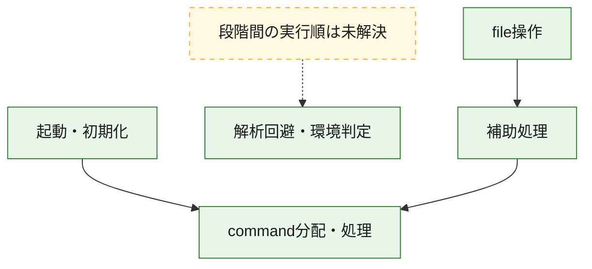
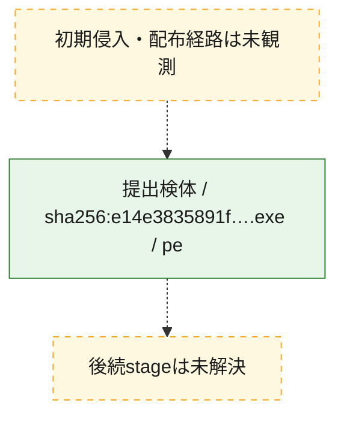
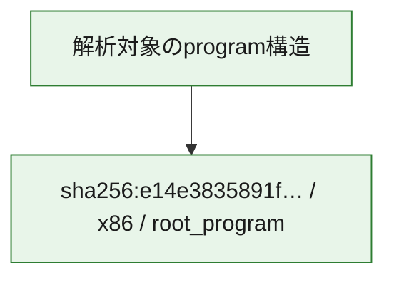

# 全体ロジック：e14e3835891f32a6c67a80ae3d2bd8849c7f3bbce9d353604028365301a8b023

代表関数の静的証跡から、起動・初期化、解析回避・環境判定、command分配・処理、file操作の処理群を確認しました。

## 読み方

- phaseの掲載順は解析上の整理順です。observed_call_edgesがない段階間の実行順を断定しません。
- 図の実線は静的に観測した関係、点線と黄色のノードは未観測・未解決の関係を示します。
- 図は静的な要約であり、動的実行を再現するものではありません。
- 詳細な関数解説とfingerprintは[STATIC-LOGIC.md](STATIC-LOGIC.md)を参照してください。

## 静的可視化

### 実行フロー

### 感染チェーン

### モジュール関係

## 処理段階

### 1. 起動・初期化

entry pointから初期化と後続処理への移行を確認します。
確度: `confirmed_static_function_evidence`

- `e14e3835891f32a6c67a80ae3d2bd8849c7f3bbce9d353604028365301a8b023:ghidra:140095f20` — 初期化と主要処理への分岐を行う入口関数です。 状態: `succeeded`、選定理由: `entry_point`, `meaningful_symbol_name`, `reviewed_call_centrality:21`, `role:entrypoint`

### 2. 解析回避・環境判定

debugger、sandbox、仮想環境、時間差などの判定を確認します。
確度: `confirmed_static_function_evidence_with_limits`

- `e14e3835891f32a6c67a80ae3d2bd8849c7f3bbce9d353604028365301a8b023:ghidra:140001000` — debugger、仮想環境、sandbox、または時間差の確認に関係する関数です。 状態: `limited_bad_instruction_or_flow`、選定理由: `context_representative`, `reviewed_call_centrality:6`, `role:anti_analysis`

### 3. command分配・処理

受信commandやtaskの解釈、分配、個別handlerへの移行を確認します。
確度: `confirmed_static_function_evidence_with_limits`

- `e14e3835891f32a6c67a80ae3d2bd8849c7f3bbce9d353604028365301a8b023:ghidra:1400c2020` — commandの解釈、分配、または個別処理を担当する関数です。 状態: `limited_bad_instruction_or_flow`、選定理由: `meaningful_symbol_name`, `reviewed_call_centrality:4`, `role:command_dispatch_or_handler`

### 4. file操作

fileやdirectoryの作成、読書き、削除を確認します。
確度: `confirmed_static_function_evidence`

- `e14e3835891f32a6c67a80ae3d2bd8849c7f3bbce9d353604028365301a8b023:ghidra:140001e50` — fileまたはdirectoryの読書き・管理に関係する関数です。 状態: `succeeded`、選定理由: `context_representative`, `reviewed_call_centrality:26`, `role:file_operation`

### 5. 補助処理

主要処理を支える一般内部関数またはlibrary処理を確認します。
確度: `confirmed_static_function_evidence_with_limits`

- `e14e3835891f32a6c67a80ae3d2bd8849c7f3bbce9d353604028365301a8b023:ghidra:140001070` — 検体内部の一般処理を実装する関数です。 状態: `succeeded`、選定理由: `context_representative`, `reviewed_call_centrality:2`
- `e14e3835891f32a6c67a80ae3d2bd8849c7f3bbce9d353604028365301a8b023:ghidra:140001080` — 検体内部の一般処理を実装する関数です。 状態: `succeeded`、選定理由: `context_representative`, `reviewed_call_centrality:2`
- `e14e3835891f32a6c67a80ae3d2bd8849c7f3bbce9d353604028365301a8b023:ghidra:140001090` — 検体内部の一般処理を実装する関数です。 状態: `succeeded`、選定理由: `context_representative`, `reviewed_call_centrality:5`
- `e14e3835891f32a6c67a80ae3d2bd8849c7f3bbce9d353604028365301a8b023:ghidra:1400010e0` — 検体内部の一般処理を実装する関数です。 状態: `succeeded`、選定理由: `context_representative`, `reviewed_call_centrality:2`
- `e14e3835891f32a6c67a80ae3d2bd8849c7f3bbce9d353604028365301a8b023:ghidra:1400010f0` — 検体内部の一般処理を実装する関数です。 状態: `succeeded`、選定理由: `context_representative`, `reviewed_call_centrality:2`
- `e14e3835891f32a6c67a80ae3d2bd8849c7f3bbce9d353604028365301a8b023:ghidra:140001100` — 検体内部の一般処理を実装する関数です。 状態: `succeeded`、選定理由: `context_representative`, `reviewed_call_centrality:2`
- `e14e3835891f32a6c67a80ae3d2bd8849c7f3bbce9d353604028365301a8b023:ghidra:140001110` — 検体内部の一般処理を実装する関数です。 状態: `succeeded`、選定理由: `context_representative`, `reviewed_call_centrality:3`
- `e14e3835891f32a6c67a80ae3d2bd8849c7f3bbce9d353604028365301a8b023:ghidra:140001130` — 検体内部の一般処理を実装する関数です。 状態: `succeeded`、選定理由: `context_representative`, `reviewed_call_centrality:1`
- `e14e3835891f32a6c67a80ae3d2bd8849c7f3bbce9d353604028365301a8b023:ghidra:140001170` — 検体内部の一般処理を実装する関数です。 状態: `succeeded`、選定理由: `context_representative`
- `e14e3835891f32a6c67a80ae3d2bd8849c7f3bbce9d353604028365301a8b023:ghidra:140001190` — 検体内部の一般処理を実装する関数です。 状態: `succeeded`、選定理由: `context_representative`, `reviewed_call_centrality:2`
- `e14e3835891f32a6c67a80ae3d2bd8849c7f3bbce9d353604028365301a8b023:ghidra:140001230` — 検体内部の一般処理を実装する関数です。 状態: `succeeded`、選定理由: `context_representative`, `reviewed_call_centrality:6`
- `e14e3835891f32a6c67a80ae3d2bd8849c7f3bbce9d353604028365301a8b023:ghidra:140001250` — 検体内部の一般処理を実装する関数です。 状態: `succeeded`、選定理由: `context_representative`, `reviewed_call_centrality:1`
- `e14e3835891f32a6c67a80ae3d2bd8849c7f3bbce9d353604028365301a8b023:ghidra:140001290` — 検体内部の一般処理を実装する関数です。 状態: `succeeded`、選定理由: `context_representative`, `reviewed_call_centrality:1`
- `e14e3835891f32a6c67a80ae3d2bd8849c7f3bbce9d353604028365301a8b023:ghidra:1400012d0` — 検体内部の一般処理を実装する関数です。 状態: `succeeded`、選定理由: `context_representative`, `reviewed_call_centrality:4`
- `e14e3835891f32a6c67a80ae3d2bd8849c7f3bbce9d353604028365301a8b023:ghidra:1400012f0` — 検体内部の一般処理を実装する関数です。 状態: `failed_empty`、選定理由: `context_representative`, `reviewed_call_centrality:1`
- `e14e3835891f32a6c67a80ae3d2bd8849c7f3bbce9d353604028365301a8b023:ghidra:140001590` — 検体内部の一般処理を実装する関数です。 状態: `succeeded`、選定理由: `context_representative`, `reviewed_call_centrality:12`
- `e14e3835891f32a6c67a80ae3d2bd8849c7f3bbce9d353604028365301a8b023:ghidra:140001b50` — 検体内部の一般処理を実装する関数です。 状態: `succeeded`、選定理由: `context_representative`, `reviewed_call_centrality:20`
- `e14e3835891f32a6c67a80ae3d2bd8849c7f3bbce9d353604028365301a8b023:ghidra:140002810` — 検体内部の一般処理を実装する関数です。 状態: `succeeded`、選定理由: `context_representative`, `reviewed_call_centrality:5`
- `e14e3835891f32a6c67a80ae3d2bd8849c7f3bbce9d353604028365301a8b023:ghidra:140002990` — 検体内部の一般処理を実装する関数です。 状態: `succeeded`、選定理由: `context_representative`, `reviewed_call_centrality:6`
- `e14e3835891f32a6c67a80ae3d2bd8849c7f3bbce9d353604028365301a8b023:ghidra:140002b80` — 検体内部の一般処理を実装する関数です。 状態: `succeeded`、選定理由: `context_representative`, `reviewed_call_centrality:2`
- `e14e3835891f32a6c67a80ae3d2bd8849c7f3bbce9d353604028365301a8b023:ghidra:140002bc0` — 検体内部の一般処理を実装する関数です。 状態: `succeeded`、選定理由: `context_representative`, `reviewed_call_centrality:2`
- `e14e3835891f32a6c67a80ae3d2bd8849c7f3bbce9d353604028365301a8b023:ghidra:140002c40` — 検体内部の一般処理を実装する関数です。 状態: `succeeded`、選定理由: `context_representative`, `reviewed_call_centrality:1`
- `e14e3835891f32a6c67a80ae3d2bd8849c7f3bbce9d353604028365301a8b023:ghidra:140002c70` — 検体内部の一般処理を実装する関数です。 状態: `succeeded`、選定理由: `context_representative`, `reviewed_call_centrality:2`
- `e14e3835891f32a6c67a80ae3d2bd8849c7f3bbce9d353604028365301a8b023:ghidra:140002ce0` — 検体内部の一般処理を実装する関数です。 状態: `succeeded`、選定理由: `context_representative`, `reviewed_call_centrality:3`
- `e14e3835891f32a6c67a80ae3d2bd8849c7f3bbce9d353604028365301a8b023:ghidra:140002d70` — 検体内部の一般処理を実装する関数です。 状態: `succeeded`、選定理由: `context_representative`, `reviewed_call_centrality:3`
- `e14e3835891f32a6c67a80ae3d2bd8849c7f3bbce9d353604028365301a8b023:ghidra:140002da0` — 検体内部の一般処理を実装する関数です。 状態: `succeeded`、選定理由: `context_representative`, `reviewed_call_centrality:2`
- `e14e3835891f32a6c67a80ae3d2bd8849c7f3bbce9d353604028365301a8b023:ghidra:140002db0` — 検体内部の一般処理を実装する関数です。 状態: `succeeded`、選定理由: `context_representative`, `reviewed_call_centrality:2`
- `e14e3835891f32a6c67a80ae3d2bd8849c7f3bbce9d353604028365301a8b023:ghidra:14002a630` — 検体内部の一般処理を実装する関数です。 状態: `succeeded`、選定理由: `meaningful_symbol_name`

## 観測したcall関係

- `e14e3835891f32a6c67a80ae3d2bd8849c7f3bbce9d353604028365301a8b023:ghidra:140001590` → `e14e3835891f32a6c67a80ae3d2bd8849c7f3bbce9d353604028365301a8b023:ghidra:140001230` （`support` → `support`）
- `e14e3835891f32a6c67a80ae3d2bd8849c7f3bbce9d353604028365301a8b023:ghidra:140001590` → `e14e3835891f32a6c67a80ae3d2bd8849c7f3bbce9d353604028365301a8b023:ghidra:1400012d0` （`support` → `support`）
- `e14e3835891f32a6c67a80ae3d2bd8849c7f3bbce9d353604028365301a8b023:ghidra:140001590` → `e14e3835891f32a6c67a80ae3d2bd8849c7f3bbce9d353604028365301a8b023:ghidra:140002bc0` （`support` → `support`）
- `e14e3835891f32a6c67a80ae3d2bd8849c7f3bbce9d353604028365301a8b023:ghidra:140001b50` → `e14e3835891f32a6c67a80ae3d2bd8849c7f3bbce9d353604028365301a8b023:ghidra:140001230` （`support` → `support`）
- `e14e3835891f32a6c67a80ae3d2bd8849c7f3bbce9d353604028365301a8b023:ghidra:140001e50` → `e14e3835891f32a6c67a80ae3d2bd8849c7f3bbce9d353604028365301a8b023:ghidra:140001230` （`file_activity` → `support`）
- `e14e3835891f32a6c67a80ae3d2bd8849c7f3bbce9d353604028365301a8b023:ghidra:140001e50` → `e14e3835891f32a6c67a80ae3d2bd8849c7f3bbce9d353604028365301a8b023:ghidra:1400012d0` （`file_activity` → `support`）
- `e14e3835891f32a6c67a80ae3d2bd8849c7f3bbce9d353604028365301a8b023:ghidra:140001e50` → `e14e3835891f32a6c67a80ae3d2bd8849c7f3bbce9d353604028365301a8b023:ghidra:140001590` （`file_activity` → `support`）
- `e14e3835891f32a6c67a80ae3d2bd8849c7f3bbce9d353604028365301a8b023:ghidra:140002810` → `e14e3835891f32a6c67a80ae3d2bd8849c7f3bbce9d353604028365301a8b023:ghidra:1400c2020` （`support` → `dispatch`）
- `e14e3835891f32a6c67a80ae3d2bd8849c7f3bbce9d353604028365301a8b023:ghidra:140002990` → `e14e3835891f32a6c67a80ae3d2bd8849c7f3bbce9d353604028365301a8b023:ghidra:1400012f0` （`support` → `support`）
- `e14e3835891f32a6c67a80ae3d2bd8849c7f3bbce9d353604028365301a8b023:ghidra:140002990` → `e14e3835891f32a6c67a80ae3d2bd8849c7f3bbce9d353604028365301a8b023:ghidra:140001b50` （`support` → `support`）
- `e14e3835891f32a6c67a80ae3d2bd8849c7f3bbce9d353604028365301a8b023:ghidra:140002b80` → `e14e3835891f32a6c67a80ae3d2bd8849c7f3bbce9d353604028365301a8b023:ghidra:1400c2020` （`support` → `dispatch`）
- `e14e3835891f32a6c67a80ae3d2bd8849c7f3bbce9d353604028365301a8b023:ghidra:140002c40` → `e14e3835891f32a6c67a80ae3d2bd8849c7f3bbce9d353604028365301a8b023:ghidra:1400c2020` （`support` → `dispatch`）
- `e14e3835891f32a6c67a80ae3d2bd8849c7f3bbce9d353604028365301a8b023:ghidra:140095f20` → `e14e3835891f32a6c67a80ae3d2bd8849c7f3bbce9d353604028365301a8b023:ghidra:1400c2020` （`startup` → `dispatch`）
- `ghidra-function:02b0eed1fe03a36521503cca` → `ghidra-external:2dd610736a5f4b1efffac4b8` （`unclassified` → `unclassified`）
- `ghidra-function:02b0eed1fe03a36521503cca` → `ghidra-external:6f771a9184168eb21862e56b` （`unclassified` → `unclassified`）
- `ghidra-function:02b0eed1fe03a36521503cca` → `ghidra-function:10ee21c2b0b348b4b02c5f96` （`unclassified` → `unclassified`）
- `ghidra-function:02b0eed1fe03a36521503cca` → `ghidra-function:2d0c7dc43e6bdee06813f5e2` （`unclassified` → `unclassified`）
- `ghidra-function:02b0eed1fe03a36521503cca` → `ghidra-function:315cb23de02b1a5f247b22db` （`unclassified` → `unclassified`）
- `ghidra-function:02b0eed1fe03a36521503cca` → `ghidra-function:591ff8444f748e83fd019be1` （`unclassified` → `unclassified`）
- `ghidra-function:02b0eed1fe03a36521503cca` → `ghidra-function:7de728736db75f7607fba606` （`unclassified` → `unclassified`）
- `ghidra-function:02b0eed1fe03a36521503cca` → `ghidra-function:d6ff96680a3d1e5a8e60f358` （`unclassified` → `unclassified`）
- `ghidra-function:02b0eed1fe03a36521503cca` → `ghidra-function:dbb59e8ee770ef17f3e97f34` （`unclassified` → `unclassified`）
- `ghidra-function:02b0eed1fe03a36521503cca` → `ghidra-function:f198265714c3bab0e1ce465e` （`unclassified` → `unclassified`）
- `ghidra-function:02b0eed1fe03a36521503cca` → `ghidra-function:f7978c7f18f53f4cd49229f3` （`unclassified` → `unclassified`）
- `ghidra-function:14be532838b00ec4ab1e8c7a` → `ghidra-external:a7f19e7b753355e14475e6b6` （`unclassified` → `unclassified`）
- `ghidra-function:14be532838b00ec4ab1e8c7a` → `ghidra-function:1759b816229c0f5276d53a5f` （`unclassified` → `unclassified`）
- `ghidra-function:14be532838b00ec4ab1e8c7a` → `ghidra-function:38d58851cc69995cc22e9edf` （`unclassified` → `unclassified`）
- `ghidra-function:15eb184d24508b2319fd27dc` → `ghidra-external:1ff7c8a03bb25fd4594f42d0` （`unclassified` → `unclassified`）
- `ghidra-function:15eb184d24508b2319fd27dc` → `ghidra-external:24e21f195c967251d4ae120e` （`unclassified` → `unclassified`）
- `ghidra-function:15eb184d24508b2319fd27dc` → `ghidra-external:64925fce301c348b55d722ea` （`unclassified` → `unclassified`）
- `ghidra-function:15eb184d24508b2319fd27dc` → `ghidra-external:6f771a9184168eb21862e56b` （`unclassified` → `unclassified`）
- `ghidra-function:15eb184d24508b2319fd27dc` → `ghidra-external:eb6d260cb1fcce85623ec467` （`unclassified` → `unclassified`）
- `ghidra-function:15eb184d24508b2319fd27dc` → `ghidra-function:00d29ee205ec1cad5aa2f5e9` （`unclassified` → `unclassified`）
- `ghidra-function:15eb184d24508b2319fd27dc` → `ghidra-function:02b0eed1fe03a36521503cca` （`unclassified` → `unclassified`）
- `ghidra-function:15eb184d24508b2319fd27dc` → `ghidra-function:10ee21c2b0b348b4b02c5f96` （`unclassified` → `unclassified`）
- `ghidra-function:15eb184d24508b2319fd27dc` → `ghidra-function:315cb23de02b1a5f247b22db` （`unclassified` → `unclassified`）
- `ghidra-function:15eb184d24508b2319fd27dc` → `ghidra-function:40f673b9b36d9cd7a7696d4e` （`unclassified` → `unclassified`）
- `ghidra-function:15eb184d24508b2319fd27dc` → `ghidra-function:47734caeb2f432e302bb3e92` （`unclassified` → `unclassified`）
- `ghidra-function:15eb184d24508b2319fd27dc` → `ghidra-function:4ac8542c3a0194bf78cc9dd3` （`unclassified` → `unclassified`）
- `ghidra-function:15eb184d24508b2319fd27dc` → `ghidra-function:7de728736db75f7607fba606` （`unclassified` → `unclassified`）
- `ghidra-function:15eb184d24508b2319fd27dc` → `ghidra-function:85f6a96797ee88160c8c1b19` （`unclassified` → `unclassified`）
- `ghidra-function:15eb184d24508b2319fd27dc` → `ghidra-function:bb31f8e41e05134b31c4fca2` （`unclassified` → `unclassified`）
- `ghidra-function:15eb184d24508b2319fd27dc` → `ghidra-function:bfd686bec778cc0c4900f123` （`unclassified` → `unclassified`）
- `ghidra-function:15eb184d24508b2319fd27dc` → `ghidra-function:c1f37d882b9ccdbab1f2007a` （`unclassified` → `unclassified`）
- `ghidra-function:15eb184d24508b2319fd27dc` → `ghidra-function:e17074396c363fbd99127d1d` （`unclassified` → `unclassified`）
- `ghidra-function:15eb184d24508b2319fd27dc` → `ghidra-function:e47da8c48da4c15176c5c5ca` （`unclassified` → `unclassified`）
- `ghidra-function:15eb184d24508b2319fd27dc` → `ghidra-function:ea5367dc95ec4cb53b5401c4` （`unclassified` → `unclassified`）
- `ghidra-function:15eb184d24508b2319fd27dc` → `ghidra-function:f198265714c3bab0e1ce465e` （`unclassified` → `unclassified`）
- `ghidra-function:1a098f7bf8ab0bd8fa8e61df` → `ghidra-function:26bfb5ed962c8aad6b907a86` （`unclassified` → `unclassified`）
- `ghidra-function:27836fb086e4551a1ed45ec7` → `ghidra-external:1ee3634fbccbcdf6c309b6cf` （`unclassified` → `unclassified`）
- `ghidra-function:27836fb086e4551a1ed45ec7` → `ghidra-external:24e21f195c967251d4ae120e` （`unclassified` → `unclassified`）
- `ghidra-function:27836fb086e4551a1ed45ec7` → `ghidra-external:6f771a9184168eb21862e56b` （`unclassified` → `unclassified`）
- `ghidra-function:27836fb086e4551a1ed45ec7` → `ghidra-function:10ee21c2b0b348b4b02c5f96` （`unclassified` → `unclassified`）
- `ghidra-function:27836fb086e4551a1ed45ec7` → `ghidra-function:315cb23de02b1a5f247b22db` （`unclassified` → `unclassified`）
- `ghidra-function:27836fb086e4551a1ed45ec7` → `ghidra-function:6c4fd55979ce1f5902c3c3d2` （`unclassified` → `unclassified`）
- `ghidra-function:27836fb086e4551a1ed45ec7` → `ghidra-function:6d756770329fdef1e8f57f66` （`unclassified` → `unclassified`）
- `ghidra-function:27836fb086e4551a1ed45ec7` → `ghidra-function:85f6a96797ee88160c8c1b19` （`unclassified` → `unclassified`）
- `ghidra-function:27836fb086e4551a1ed45ec7` → `ghidra-function:875f1c8dd10f7f3c32d1057d` （`unclassified` → `unclassified`）
- `ghidra-function:27836fb086e4551a1ed45ec7` → `ghidra-function:c39e7efd035a80e29aeb7da7` （`unclassified` → `unclassified`）
- `ghidra-function:27836fb086e4551a1ed45ec7` → `ghidra-function:d187528bd45480f11a6be464` （`unclassified` → `unclassified`）
- `ghidra-function:27836fb086e4551a1ed45ec7` → `ghidra-function:dc4a20742a1a495a5d54080c` （`unclassified` → `unclassified`）
- `ghidra-function:27836fb086e4551a1ed45ec7` → `ghidra-function:e17074396c363fbd99127d1d` （`unclassified` → `unclassified`）
- `ghidra-function:27836fb086e4551a1ed45ec7` → `ghidra-function:f198265714c3bab0e1ce465e` （`unclassified` → `unclassified`）
- `ghidra-function:283f1611cb5f376f7b65d23a` → `ghidra-function:26bfb5ed962c8aad6b907a86` （`unclassified` → `unclassified`）
- `ghidra-function:38d2d7da8d62c519a808775d` → `ghidra-external:a7f19e7b753355e14475e6b6` （`unclassified` → `unclassified`）
- `ghidra-function:38d2d7da8d62c519a808775d` → `ghidra-function:1759b816229c0f5276d53a5f` （`unclassified` → `unclassified`）
- `ghidra-function:48005f7b10ba578487d1c43f` → `ghidra-external:24e21f195c967251d4ae120e` （`unclassified` → `unclassified`）
- `ghidra-function:48005f7b10ba578487d1c43f` → `ghidra-external:6f771a9184168eb21862e56b` （`unclassified` → `unclassified`）
- `ghidra-function:4e68f3b61fc7518d48b9e96e` → `ghidra-external:24e21f195c967251d4ae120e` （`unclassified` → `unclassified`）
- `ghidra-function:4e68f3b61fc7518d48b9e96e` → `ghidra-external:6f771a9184168eb21862e56b` （`unclassified` → `unclassified`）
- `ghidra-function:4e68f3b61fc7518d48b9e96e` → `ghidra-function:27836fb086e4551a1ed45ec7` （`unclassified` → `unclassified`）
- `ghidra-function:4e68f3b61fc7518d48b9e96e` → `ghidra-function:6b8a442107d03a50648aacdd` （`unclassified` → `unclassified`）
- `ghidra-function:4e68f3b61fc7518d48b9e96e` → `ghidra-function:d1640ddcf6550d0ae55d7cf1` （`unclassified` → `unclassified`）
- `ghidra-function:4e68f3b61fc7518d48b9e96e` → `ghidra-function:e17074396c363fbd99127d1d` （`unclassified` → `unclassified`）
- `ghidra-function:519891f7f42f9c6d993a8f4c` → `ghidra-function:de9e8d7bcdc202a8094214b1` （`unclassified` → `unclassified`）
- `ghidra-function:522cba345f10cf5093b3000b` → `ghidra-external:2b11438dc4c2a61d38417540` （`unclassified` → `unclassified`）
- `ghidra-function:522cba345f10cf5093b3000b` → `ghidra-external:87a732db2c0a4aca7ef0b364` （`unclassified` → `unclassified`）
- `ghidra-function:522cba345f10cf5093b3000b` → `ghidra-external:a7f19e7b753355e14475e6b6` （`unclassified` → `unclassified`）
- `ghidra-function:522cba345f10cf5093b3000b` → `ghidra-external:fef7005aea3ac4f2752bd802` （`unclassified` → `unclassified`）
- `ghidra-function:522cba345f10cf5093b3000b` → `ghidra-function:1759b816229c0f5276d53a5f` （`unclassified` → `unclassified`）
- `ghidra-function:60132188c3bb223735c70e04` → `ghidra-function:234a11ab37c21d1725329056` （`unclassified` → `unclassified`）
- `ghidra-function:60132188c3bb223735c70e04` → `ghidra-function:315cb23de02b1a5f247b22db` （`unclassified` → `unclassified`）
- `ghidra-function:60132188c3bb223735c70e04` → `ghidra-function:c2aad450fd18ec0c57c54206` （`unclassified` → `unclassified`）
- `ghidra-function:69813916afe5f5c1a2afc84f` → `ghidra-external:24e21f195c967251d4ae120e` （`unclassified` → `unclassified`）
- `ghidra-function:69813916afe5f5c1a2afc84f` → `ghidra-function:604e7deb0d551941f32eb89d` （`unclassified` → `unclassified`）
- `ghidra-function:6c1c99e4bf8a486c98e1dae1` → `ghidra-function:26bfb5ed962c8aad6b907a86` （`unclassified` → `unclassified`）
- `ghidra-function:7de728736db75f7607fba606` → `ghidra-external:6f771a9184168eb21862e56b` （`unclassified` → `unclassified`）
- `ghidra-function:7de728736db75f7607fba606` → `ghidra-function:17606a5dbf4f938955c0cba8` （`unclassified` → `unclassified`）
- `ghidra-function:7dfdd6a0af45dfee472bb5ae` → `ghidra-external:a7f19e7b753355e14475e6b6` （`unclassified` → `unclassified`）
- `ghidra-function:7dfdd6a0af45dfee472bb5ae` → `ghidra-function:1759b816229c0f5276d53a5f` （`unclassified` → `unclassified`）
- `ghidra-function:7f1ffddd1dd7054bfd94b4bb` → `ghidra-external:a7f19e7b753355e14475e6b6` （`unclassified` → `unclassified`）
- `ghidra-function:7f1ffddd1dd7054bfd94b4bb` → `ghidra-function:1759b816229c0f5276d53a5f` （`unclassified` → `unclassified`）
- `ghidra-function:81b6180d71f61a9b4ce2d115` → `ghidra-external:24e21f195c967251d4ae120e` （`unclassified` → `unclassified`）
- `ghidra-function:81b6180d71f61a9b4ce2d115` → `ghidra-external:6f771a9184168eb21862e56b` （`unclassified` → `unclassified`）
- `ghidra-function:81b6180d71f61a9b4ce2d115` → `ghidra-function:9de0a7eea95ce25d294c0942` （`unclassified` → `unclassified`）
- `ghidra-function:8902e8d1f1b70fc23dfbc01f` → `ghidra-external:da2f11702a40de5c1b260e43` （`unclassified` → `unclassified`）
- `ghidra-function:8902e8d1f1b70fc23dfbc01f` → `ghidra-function:de9e8d7bcdc202a8094214b1` （`unclassified` → `unclassified`）
- `ghidra-function:a22a66a49cd4881be6ea8ce4` → `ghidra-external:a7f19e7b753355e14475e6b6` （`unclassified` → `unclassified`）
- `ghidra-function:a22a66a49cd4881be6ea8ce4` → `ghidra-function:1759b816229c0f5276d53a5f` （`unclassified` → `unclassified`）
- `ghidra-function:aae00efe136f08a107e5f3a4` → `ghidra-external:a7f19e7b753355e14475e6b6` （`unclassified` → `unclassified`）
- `ghidra-function:aae00efe136f08a107e5f3a4` → `ghidra-function:1759b816229c0f5276d53a5f` （`unclassified` → `unclassified`）
- `ghidra-function:b6fb6863777c648683bd171c` → `ghidra-external:24e21f195c967251d4ae120e` （`unclassified` → `unclassified`）
- `ghidra-function:b6fb6863777c648683bd171c` → `ghidra-external:6f771a9184168eb21862e56b` （`unclassified` → `unclassified`）
- `ghidra-function:dbb59e8ee770ef17f3e97f34` → `ghidra-external:7d020de465651bea1daa334c` （`unclassified` → `unclassified`）
- `ghidra-function:e9c5fb53ab0e3231e13bdb4d` → `ghidra-function:c2aad450fd18ec0c57c54206` （`unclassified` → `unclassified`）
- `ghidra-function:e9c5fb53ab0e3231e13bdb4d` → `ghidra-function:ea5367dc95ec4cb53b5401c4` （`unclassified` → `unclassified`）
- `ghidra-function:f027c5c074e168e7cb9b93a4` → `ghidra-function:46be6f5e4a5ae8ad43bd7b8d` （`unclassified` → `unclassified`）
- `ghidra-function:f027c5c074e168e7cb9b93a4` → `ghidra-function:c2aad450fd18ec0c57c54206` （`unclassified` → `unclassified`）
- `ghidra-function:f027c5c074e168e7cb9b93a4` → `ghidra-function:de9e8d7bcdc202a8094214b1` （`unclassified` → `unclassified`）
- `ghidra-function:f027c5c074e168e7cb9b93a4` → `ghidra-function:ea5367dc95ec4cb53b5401c4` （`unclassified` → `unclassified`）
- `ghidra-function:f198265714c3bab0e1ce465e` → `ghidra-external:6f771a9184168eb21862e56b` （`unclassified` → `unclassified`）
- `ghidra-function:f198265714c3bab0e1ce465e` → `ghidra-external:8fa966de8587ec9416c1d2d3` （`unclassified` → `unclassified`）
- `ghidra-function:f198265714c3bab0e1ce465e` → `ghidra-function:80481f7c6b94cce3560c4285` （`unclassified` → `unclassified`）
- `ghidra-function:f8f23736248cbc3283638a83` → `ghidra-function:7db5497bf83622850b814bbe` （`unclassified` → `unclassified`）
- `ghidra-function:f8f23736248cbc3283638a83` → `ghidra-function:85163dcfd0642a21acb9eb15` （`unclassified` → `unclassified`）
- `ghidra-function:f8f23736248cbc3283638a83` → `ghidra-function:e17a2c24681a86cf3aa88239` （`unclassified` → `unclassified`）
- `ghidra-function:ff0a364dd49c0e51f5f00fbb` → `ghidra-external:0b811a400068cdb2c1950f81` （`unclassified` → `unclassified`）
- `ghidra-function:ff0a364dd49c0e51f5f00fbb` → `ghidra-external:22320f29f4c9e873eb483447` （`unclassified` → `unclassified`）
- `ghidra-function:ff0a364dd49c0e51f5f00fbb` → `ghidra-external:429eda212b795cafd70a930c` （`unclassified` → `unclassified`）
- `ghidra-function:ff0a364dd49c0e51f5f00fbb` → `ghidra-external:5260837e22438a4cfbbe39f1` （`unclassified` → `unclassified`）
- `ghidra-function:ff0a364dd49c0e51f5f00fbb` → `ghidra-external:5db59cae491d6e8ce17c870b` （`unclassified` → `unclassified`）
- `ghidra-function:ff0a364dd49c0e51f5f00fbb` → `ghidra-external:6f771a9184168eb21862e56b` （`unclassified` → `unclassified`）
- `ghidra-function:ff0a364dd49c0e51f5f00fbb` → `ghidra-external:972da5203e3969ee8048f4c0` （`unclassified` → `unclassified`）
- `ghidra-function:ff0a364dd49c0e51f5f00fbb` → `ghidra-external:cc3b518676f653c2aa6e4160` （`unclassified` → `unclassified`）
- `ghidra-function:ff0a364dd49c0e51f5f00fbb` → `ghidra-function:01823820e74baaead939158b` （`unclassified` → `unclassified`）
- `ghidra-function:ff0a364dd49c0e51f5f00fbb` → `ghidra-function:149a2416e0061f051e215646` （`unclassified` → `unclassified`）
- `ghidra-function:ff0a364dd49c0e51f5f00fbb` → `ghidra-function:30568b9ce205df9425fba469` （`unclassified` → `unclassified`）
- `ghidra-function:ff0a364dd49c0e51f5f00fbb` → `ghidra-function:3a9331d8ba1cee7f315f6e29` （`unclassified` → `unclassified`）
- `ghidra-function:ff0a364dd49c0e51f5f00fbb` → `ghidra-function:43e520e9b99bf57c8fa9e125` （`unclassified` → `unclassified`）
- `ghidra-function:ff0a364dd49c0e51f5f00fbb` → `ghidra-function:44afe2eb6d65ddda6d640978` （`unclassified` → `unclassified`）
- `ghidra-function:ff0a364dd49c0e51f5f00fbb` → `ghidra-function:50a6adf4d237143b9f903662` （`unclassified` → `unclassified`）
- `ghidra-function:ff0a364dd49c0e51f5f00fbb` → `ghidra-function:7dd8de691189201ac4a8b14e` （`unclassified` → `unclassified`）
- `ghidra-function:ff0a364dd49c0e51f5f00fbb` → `ghidra-function:b113885bd0524fecec25eb80` （`unclassified` → `unclassified`）
- `ghidra-function:ff0a364dd49c0e51f5f00fbb` → `ghidra-function:ca531719230e00d4b854f84e` （`unclassified` → `unclassified`）
- `ghidra-function:ff0a364dd49c0e51f5f00fbb` → `ghidra-function:de9e8d7bcdc202a8094214b1` （`unclassified` → `unclassified`）
- `ghidra-function:ff0a364dd49c0e51f5f00fbb` → `ghidra-function:f170424af8b479febbf2ec06` （`unclassified` → `unclassified`）
- `ghidra-function:ff0a364dd49c0e51f5f00fbb` → `ghidra-function:fa752f0c18540819ec694d72` （`unclassified` → `unclassified`）

## 解析範囲と制約

- 選定外関数は全体inventoryへ残しますが、関数本体の個別解説対象にはしていません。
- indirect call、難読化、packer、VM、壊れたcontrol flowによりcall関係が欠落する場合があります。
- 文書は静的解析に基づき、検体実行や外部通信による動的確認は行っていません。
