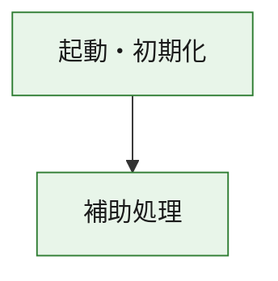
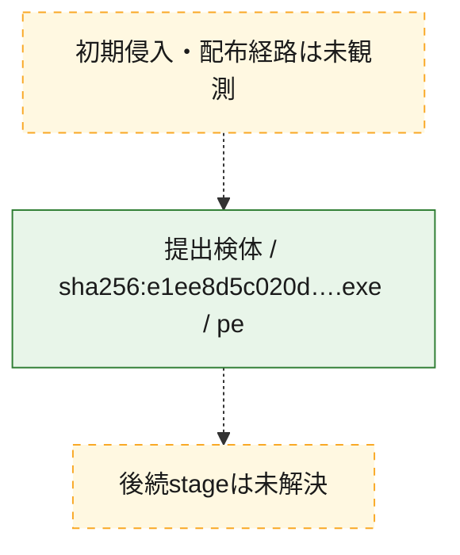
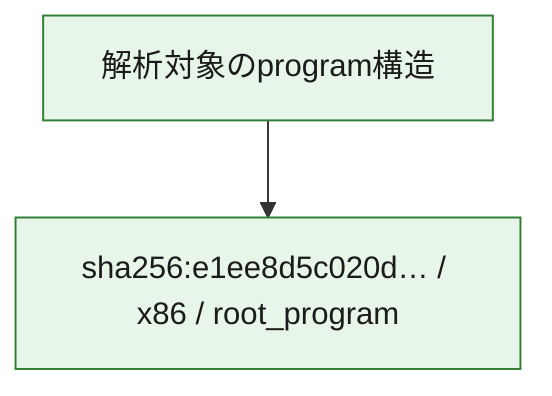

# 全体ロジック：e1ee8d5c020d3b8016b46f68cf7c8f146232500dfff8ac478805d3dbb545ff75

代表関数の静的証跡から、起動・初期化の処理群を確認しました。

## 読み方

- phaseの掲載順は解析上の整理順です。observed_call_edgesがない段階間の実行順を断定しません。
- 図の実線は静的に観測した関係、点線と黄色のノードは未観測・未解決の関係を示します。
- 図は静的な要約であり、動的実行を再現するものではありません。
- 詳細な関数解説とfingerprintは[STATIC-LOGIC.md](STATIC-LOGIC.md)を参照してください。

## 静的可視化

### 実行フロー

### 感染チェーン

### モジュール関係

## 処理段階

### 1. 起動・初期化

entry pointから初期化と後続処理への移行を確認します。
確度: `confirmed_static_function_evidence`

- `e1ee8d5c020d3b8016b46f68cf7c8f146232500dfff8ac478805d3dbb545ff75:ghidra:180001010` — 初期化と主要処理への分岐を行う入口関数です。 状態: `succeeded`、選定理由: `entry_point`, `meaningful_symbol_name`, `reviewed_call_centrality:22`, `role:entrypoint`, `small_program_complete_context`

### 2. 補助処理

主要処理を支える一般内部関数またはlibrary処理を確認します。
確度: `confirmed_static_function_evidence`

- `e1ee8d5c020d3b8016b46f68cf7c8f146232500dfff8ac478805d3dbb545ff75:ghidra:180001240` — 検体内部の一般処理を実装する関数です。 状態: `succeeded`、選定理由: `context_representative`, `reviewed_call_centrality:2`, `small_program_complete_context`
- `e1ee8d5c020d3b8016b46f68cf7c8f146232500dfff8ac478805d3dbb545ff75:ghidra:180001350` — 検体内部の一般処理を実装する関数です。 状態: `succeeded`、選定理由: `context_representative`, `reviewed_call_centrality:25`, `small_program_complete_context`
- `e1ee8d5c020d3b8016b46f68cf7c8f146232500dfff8ac478805d3dbb545ff75:ghidra:180003780` — 検体内部の一般処理を実装する関数です。 状態: `succeeded`、選定理由: `context_representative`, `reviewed_call_centrality:2`, `small_program_complete_context`
- `e1ee8d5c020d3b8016b46f68cf7c8f146232500dfff8ac478805d3dbb545ff75:ghidra:1800038e0` — 検体内部の一般処理を実装する関数です。 状態: `succeeded`、選定理由: `context_representative`, `reviewed_call_centrality:2`, `small_program_complete_context`

## 観測したcall関係

- `e1ee8d5c020d3b8016b46f68cf7c8f146232500dfff8ac478805d3dbb545ff75:ghidra:180001010` → `e1ee8d5c020d3b8016b46f68cf7c8f146232500dfff8ac478805d3dbb545ff75:ghidra:180001240` （`startup` → `support`）
- `e1ee8d5c020d3b8016b46f68cf7c8f146232500dfff8ac478805d3dbb545ff75:ghidra:180001010` → `e1ee8d5c020d3b8016b46f68cf7c8f146232500dfff8ac478805d3dbb545ff75:ghidra:180001350` （`startup` → `support`）
- `e1ee8d5c020d3b8016b46f68cf7c8f146232500dfff8ac478805d3dbb545ff75:ghidra:180001350` → `e1ee8d5c020d3b8016b46f68cf7c8f146232500dfff8ac478805d3dbb545ff75:ghidra:180001240` （`support` → `support`）
- `e1ee8d5c020d3b8016b46f68cf7c8f146232500dfff8ac478805d3dbb545ff75:ghidra:180001350` → `e1ee8d5c020d3b8016b46f68cf7c8f146232500dfff8ac478805d3dbb545ff75:ghidra:180003780` （`support` → `support`）
- `e1ee8d5c020d3b8016b46f68cf7c8f146232500dfff8ac478805d3dbb545ff75:ghidra:180001350` → `e1ee8d5c020d3b8016b46f68cf7c8f146232500dfff8ac478805d3dbb545ff75:ghidra:1800038e0` （`support` → `support`）
- `e1ee8d5c020d3b8016b46f68cf7c8f146232500dfff8ac478805d3dbb545ff75:ghidra:180003780` → `e1ee8d5c020d3b8016b46f68cf7c8f146232500dfff8ac478805d3dbb545ff75:ghidra:1800038e0` （`support` → `support`）
- `ghidra-function:360a40e1716f2f16e1246119` → `ghidra-function:23bdd055cbe92707e8da07ad` （`unclassified` → `unclassified`）
- `ghidra-function:6420ca6e05ac6d05c4f4690d` → `ghidra-external:05335a8505e3226a1a52b74d` （`unclassified` → `unclassified`）
- `ghidra-function:6420ca6e05ac6d05c4f4690d` → `ghidra-external:0977a0c63fa3f65b0b71d3ea` （`unclassified` → `unclassified`）
- `ghidra-function:6420ca6e05ac6d05c4f4690d` → `ghidra-external:0bc9d363b26ffecb3bd6f78f` （`unclassified` → `unclassified`）
- `ghidra-function:6420ca6e05ac6d05c4f4690d` → `ghidra-external:0f0eb15ba9463fc9f747b1d4` （`unclassified` → `unclassified`）
- `ghidra-function:6420ca6e05ac6d05c4f4690d` → `ghidra-external:356c9ff9d33a23405cc6f1b0` （`unclassified` → `unclassified`）
- `ghidra-function:6420ca6e05ac6d05c4f4690d` → `ghidra-external:5a1081578f7fab16fb6d1ead` （`unclassified` → `unclassified`）
- `ghidra-function:6420ca6e05ac6d05c4f4690d` → `ghidra-external:5af22742beab18e1b1139269` （`unclassified` → `unclassified`）
- `ghidra-function:6420ca6e05ac6d05c4f4690d` → `ghidra-external:807b32fe1b65bd6d1bb57e15` （`unclassified` → `unclassified`）
- `ghidra-function:6420ca6e05ac6d05c4f4690d` → `ghidra-external:8b5dd9271c55177c897f412c` （`unclassified` → `unclassified`）
- `ghidra-function:6420ca6e05ac6d05c4f4690d` → `ghidra-external:8fdc32bd1a548c1a7a7b8a27` （`unclassified` → `unclassified`）
- `ghidra-function:6420ca6e05ac6d05c4f4690d` → `ghidra-external:9eb5ac0a8ab9b23f70b5e447` （`unclassified` → `unclassified`）
- `ghidra-function:6420ca6e05ac6d05c4f4690d` → `ghidra-external:9fdd6481d3d6828a65571ab7` （`unclassified` → `unclassified`）
- `ghidra-function:6420ca6e05ac6d05c4f4690d` → `ghidra-external:a3f5797573a6a81753b97728` （`unclassified` → `unclassified`）
- `ghidra-function:6420ca6e05ac6d05c4f4690d` → `ghidra-external:acfbdca96a1db0620d8b2a2e` （`unclassified` → `unclassified`）
- `ghidra-function:6420ca6e05ac6d05c4f4690d` → `ghidra-external:b36d4335bcaf7c43b1bdbc9b` （`unclassified` → `unclassified`）
- `ghidra-function:6420ca6e05ac6d05c4f4690d` → `ghidra-external:c09516203a8d9e2cd6382ce3` （`unclassified` → `unclassified`）
- `ghidra-function:6420ca6e05ac6d05c4f4690d` → `ghidra-external:c0adde803d8949a062e81ea4` （`unclassified` → `unclassified`）
- `ghidra-function:6420ca6e05ac6d05c4f4690d` → `ghidra-external:ca2f5000512a132426601ac7` （`unclassified` → `unclassified`）
- `ghidra-function:6420ca6e05ac6d05c4f4690d` → `ghidra-external:d6e6bdf944f9dc5872befd9d` （`unclassified` → `unclassified`）
- `ghidra-function:6420ca6e05ac6d05c4f4690d` → `ghidra-external:f8ae19428e2b5dd600cf354c` （`unclassified` → `unclassified`）
- `ghidra-function:6420ca6e05ac6d05c4f4690d` → `ghidra-external:fc29bc64928f7f1c890c2fbc` （`unclassified` → `unclassified`）
- `ghidra-function:6420ca6e05ac6d05c4f4690d` → `ghidra-function:23bdd055cbe92707e8da07ad` （`unclassified` → `unclassified`）
- `ghidra-function:6420ca6e05ac6d05c4f4690d` → `ghidra-function:360a40e1716f2f16e1246119` （`unclassified` → `unclassified`）
- `ghidra-function:6420ca6e05ac6d05c4f4690d` → `ghidra-function:3ff6529a3c7e7844cc5adf30` （`unclassified` → `unclassified`）
- `ghidra-function:a068634346129da889e30773` → `ghidra-function:082fd83f7c67c39020c1ab2f` （`unclassified` → `unclassified`）
- `ghidra-function:a068634346129da889e30773` → `ghidra-function:3ff6529a3c7e7844cc5adf30` （`unclassified` → `unclassified`）
- `ghidra-function:a068634346129da889e30773` → `ghidra-function:562a86e3a367e94e3046872c` （`unclassified` → `unclassified`）
- `ghidra-function:a068634346129da889e30773` → `ghidra-function:5a85ec132b30ccaf8c6c3fa0` （`unclassified` → `unclassified`）
- `ghidra-function:a068634346129da889e30773` → `ghidra-function:6257c7926b2dabd1cdc13de5` （`unclassified` → `unclassified`）
- `ghidra-function:a068634346129da889e30773` → `ghidra-function:6420ca6e05ac6d05c4f4690d` （`unclassified` → `unclassified`）
- `ghidra-function:a068634346129da889e30773` → `ghidra-function:83105687e4d02160d0301ec7` （`unclassified` → `unclassified`）
- `ghidra-function:a068634346129da889e30773` → `ghidra-function:840bfd193c69a8d5c956ba66` （`unclassified` → `unclassified`）
- `ghidra-function:a068634346129da889e30773` → `ghidra-function:8ca95f16871c1407012ed5c8` （`unclassified` → `unclassified`）
- `ghidra-function:a068634346129da889e30773` → `ghidra-function:9432407a44ac5f602458808b` （`unclassified` → `unclassified`）
- `ghidra-function:a068634346129da889e30773` → `ghidra-function:9f3d627d0c0f37264ee813b5` （`unclassified` → `unclassified`）
- `ghidra-function:a068634346129da889e30773` → `ghidra-function:b6951786c5e2555acd8a14f5` （`unclassified` → `unclassified`）

## 解析範囲と制約

- 選定外関数は全体inventoryへ残しますが、関数本体の個別解説対象にはしていません。
- indirect call、難読化、packer、VM、壊れたcontrol flowによりcall関係が欠落する場合があります。
- 文書は静的解析に基づき、検体実行や外部通信による動的確認は行っていません。
