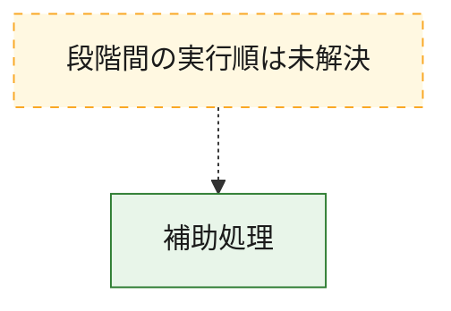
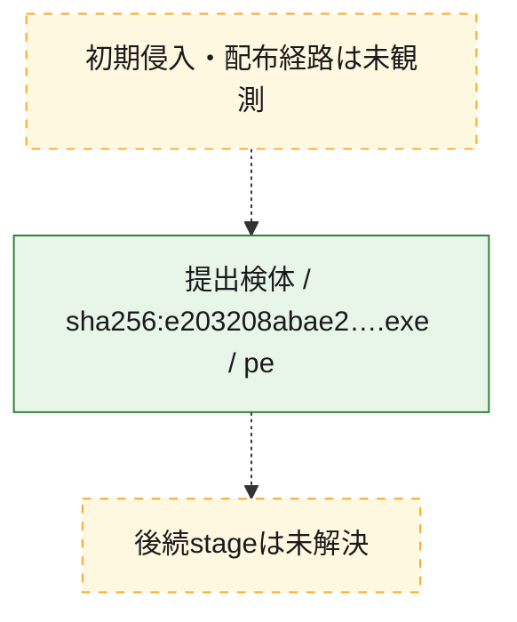
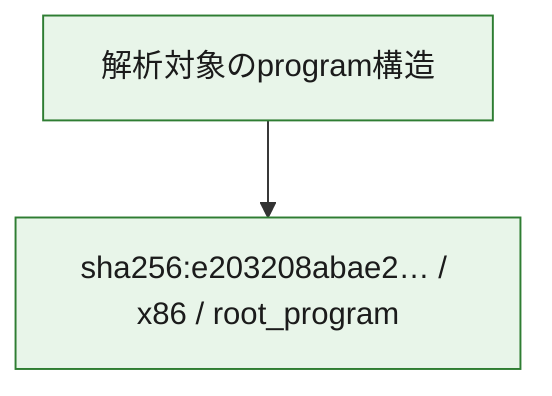

# 全体ロジック：e203208abae204c1168a27fec04c5cf7ead97777855c36be04b8df35e1ad8df9

代表関数から主要なmalware処理段階を自動分類できませんでした。

## 読み方

- phaseの掲載順は解析上の整理順です。observed_call_edgesがない段階間の実行順を断定しません。
- 図の実線は静的に観測した関係、点線と黄色のノードは未観測・未解決の関係を示します。
- 図は静的な要約であり、動的実行を再現するものではありません。
- 詳細な関数解説とfingerprintは[STATIC-LOGIC.md](STATIC-LOGIC.md)を参照してください。

## 静的可視化

### 実行フロー

### 感染チェーン

### モジュール関係

## 処理段階

### 1. 補助処理

主要処理を支える一般内部関数またはlibrary処理を確認します。
確度: `confirmed_static_function_evidence`

- `e203208abae204c1168a27fec04c5cf7ead97777855c36be04b8df35e1ad8df9:ghidra:140001000` — 検体内部の一般処理を実装する関数です。 状態: `succeeded`、選定理由: `context_representative`, `reviewed_call_centrality:8`
- `e203208abae204c1168a27fec04c5cf7ead97777855c36be04b8df35e1ad8df9:ghidra:1400012a0` — 検体内部の一般処理を実装する関数です。 状態: `succeeded`、選定理由: `context_representative`, `reviewed_call_centrality:3`
- `e203208abae204c1168a27fec04c5cf7ead97777855c36be04b8df35e1ad8df9:ghidra:140001320` — 検体内部の一般処理を実装する関数です。 状態: `succeeded`、選定理由: `context_representative`, `reviewed_call_centrality:3`
- `e203208abae204c1168a27fec04c5cf7ead97777855c36be04b8df35e1ad8df9:ghidra:140001380` — 検体内部の一般処理を実装する関数です。 状態: `succeeded`、選定理由: `context_representative`, `reviewed_call_centrality:2`
- `e203208abae204c1168a27fec04c5cf7ead97777855c36be04b8df35e1ad8df9:ghidra:1400013c0` — 検体内部の一般処理を実装する関数です。 状態: `succeeded`、選定理由: `context_representative`, `reviewed_call_centrality:4`
- `e203208abae204c1168a27fec04c5cf7ead97777855c36be04b8df35e1ad8df9:ghidra:140001540` — 検体内部の一般処理を実装する関数です。 状態: `succeeded`、選定理由: `context_representative`, `reviewed_call_centrality:2`
- `e203208abae204c1168a27fec04c5cf7ead97777855c36be04b8df35e1ad8df9:ghidra:140001620` — 検体内部の一般処理を実装する関数です。 状態: `succeeded`、選定理由: `context_representative`, `reviewed_call_centrality:5`
- `e203208abae204c1168a27fec04c5cf7ead97777855c36be04b8df35e1ad8df9:ghidra:1400019e0` — 検体内部の一般処理を実装する関数です。 状態: `succeeded`、選定理由: `context_representative`, `reviewed_call_centrality:2`
- `e203208abae204c1168a27fec04c5cf7ead97777855c36be04b8df35e1ad8df9:ghidra:140001a60` — 検体内部の一般処理を実装する関数です。 状態: `succeeded`、選定理由: `context_representative`, `reviewed_call_centrality:1`
- `e203208abae204c1168a27fec04c5cf7ead97777855c36be04b8df35e1ad8df9:ghidra:140001ae0` — 検体内部の一般処理を実装する関数です。 状態: `succeeded`、選定理由: `context_representative`, `reviewed_call_centrality:2`
- `e203208abae204c1168a27fec04c5cf7ead97777855c36be04b8df35e1ad8df9:ghidra:140001ba0` — 検体内部の一般処理を実装する関数です。 状態: `succeeded`、選定理由: `context_representative`, `reviewed_call_centrality:2`
- `e203208abae204c1168a27fec04c5cf7ead97777855c36be04b8df35e1ad8df9:ghidra:140001d00` — 検体内部の一般処理を実装する関数です。 状態: `succeeded`、選定理由: `context_representative`, `reviewed_call_centrality:2`
- `e203208abae204c1168a27fec04c5cf7ead97777855c36be04b8df35e1ad8df9:ghidra:140001d60` — 検体内部の一般処理を実装する関数です。 状態: `succeeded`、選定理由: `context_representative`, `reviewed_call_centrality:4`
- `e203208abae204c1168a27fec04c5cf7ead97777855c36be04b8df35e1ad8df9:ghidra:140001de0` — 検体内部の一般処理を実装する関数です。 状態: `succeeded`、選定理由: `context_representative`, `reviewed_call_centrality:5`
- `e203208abae204c1168a27fec04c5cf7ead97777855c36be04b8df35e1ad8df9:ghidra:140001e80` — 検体内部の一般処理を実装する関数です。 状態: `succeeded`、選定理由: `context_representative`, `reviewed_call_centrality:5`
- `e203208abae204c1168a27fec04c5cf7ead97777855c36be04b8df35e1ad8df9:ghidra:140001f80` — 検体内部の一般処理を実装する関数です。 状態: `succeeded`、選定理由: `context_representative`, `reviewed_call_centrality:7`
- `e203208abae204c1168a27fec04c5cf7ead97777855c36be04b8df35e1ad8df9:ghidra:1400023e0` — 検体内部の一般処理を実装する関数です。 状態: `succeeded`、選定理由: `context_representative`, `reviewed_call_centrality:3`
- `e203208abae204c1168a27fec04c5cf7ead97777855c36be04b8df35e1ad8df9:ghidra:140002440` — 検体内部の一般処理を実装する関数です。 状態: `succeeded`、選定理由: `context_representative`, `reviewed_call_centrality:2`
- `e203208abae204c1168a27fec04c5cf7ead97777855c36be04b8df35e1ad8df9:ghidra:140002460` — 検体内部の一般処理を実装する関数です。 状態: `succeeded`、選定理由: `context_representative`, `reviewed_call_centrality:2`
- `e203208abae204c1168a27fec04c5cf7ead97777855c36be04b8df35e1ad8df9:ghidra:140002480` — 検体内部の一般処理を実装する関数です。 状態: `succeeded`、選定理由: `context_representative`, `reviewed_call_centrality:2`
- `e203208abae204c1168a27fec04c5cf7ead97777855c36be04b8df35e1ad8df9:ghidra:1400024a0` — 検体内部の一般処理を実装する関数です。 状態: `succeeded`、選定理由: `context_representative`, `reviewed_call_centrality:3`
- `e203208abae204c1168a27fec04c5cf7ead97777855c36be04b8df35e1ad8df9:ghidra:1400024e0` — 検体内部の一般処理を実装する関数です。 状態: `succeeded`、選定理由: `context_representative`, `reviewed_call_centrality:2`
- `e203208abae204c1168a27fec04c5cf7ead97777855c36be04b8df35e1ad8df9:ghidra:140002500` — 検体内部の一般処理を実装する関数です。 状態: `succeeded`、選定理由: `context_representative`, `reviewed_call_centrality:2`
- `e203208abae204c1168a27fec04c5cf7ead97777855c36be04b8df35e1ad8df9:ghidra:140002520` — 検体内部の一般処理を実装する関数です。 状態: `succeeded`、選定理由: `context_representative`, `reviewed_call_centrality:3`
- `e203208abae204c1168a27fec04c5cf7ead97777855c36be04b8df35e1ad8df9:ghidra:140002560` — 検体内部の一般処理を実装する関数です。 状態: `succeeded`、選定理由: `context_representative`, `reviewed_call_centrality:3`
- `e203208abae204c1168a27fec04c5cf7ead97777855c36be04b8df35e1ad8df9:ghidra:1400025e0` — 検体内部の一般処理を実装する関数です。 状態: `succeeded`、選定理由: `context_representative`, `reviewed_call_centrality:3`
- `e203208abae204c1168a27fec04c5cf7ead97777855c36be04b8df35e1ad8df9:ghidra:140002760` — 検体内部の一般処理を実装する関数です。 状態: `succeeded`、選定理由: `context_representative`, `reviewed_call_centrality:5`
- `e203208abae204c1168a27fec04c5cf7ead97777855c36be04b8df35e1ad8df9:ghidra:140002ae0` — 検体内部の一般処理を実装する関数です。 状態: `succeeded`、選定理由: `context_representative`, `reviewed_call_centrality:5`
- `e203208abae204c1168a27fec04c5cf7ead97777855c36be04b8df35e1ad8df9:ghidra:140002e40` — 検体内部の一般処理を実装する関数です。 状態: `succeeded`、選定理由: `context_representative`, `reviewed_call_centrality:5`
- `e203208abae204c1168a27fec04c5cf7ead97777855c36be04b8df35e1ad8df9:ghidra:140003200` — 検体内部の一般処理を実装する関数です。 状態: `succeeded`、選定理由: `context_representative`, `reviewed_call_centrality:5`
- `e203208abae204c1168a27fec04c5cf7ead97777855c36be04b8df35e1ad8df9:ghidra:1400035e0` — 検体内部の一般処理を実装する関数です。 状態: `succeeded`、選定理由: `context_representative`, `reviewed_call_centrality:5`
- `e203208abae204c1168a27fec04c5cf7ead97777855c36be04b8df35e1ad8df9:ghidra:140003940` — 検体内部の一般処理を実装する関数です。 状態: `succeeded`、選定理由: `context_representative`, `reviewed_call_centrality:5`

## 観測したcall関係

- `e203208abae204c1168a27fec04c5cf7ead97777855c36be04b8df35e1ad8df9:ghidra:1400024a0` → `e203208abae204c1168a27fec04c5cf7ead97777855c36be04b8df35e1ad8df9:ghidra:140001d60` （`support` → `support`）
- `e203208abae204c1168a27fec04c5cf7ead97777855c36be04b8df35e1ad8df9:ghidra:140002520` → `e203208abae204c1168a27fec04c5cf7ead97777855c36be04b8df35e1ad8df9:ghidra:140001de0` （`support` → `support`）
- `e203208abae204c1168a27fec04c5cf7ead97777855c36be04b8df35e1ad8df9:ghidra:1400025e0` → `e203208abae204c1168a27fec04c5cf7ead97777855c36be04b8df35e1ad8df9:ghidra:140001e80` （`support` → `support`）
- `ghidra-function:06c7b75d5d1d56db600b323a` → `ghidra-external:2a9235fe8ac248282f405d35` （`unclassified` → `unclassified`）
- `ghidra-function:06c7b75d5d1d56db600b323a` → `ghidra-function:29fa69633098758dde0e1da5` （`unclassified` → `unclassified`）
- `ghidra-function:06c7b75d5d1d56db600b323a` → `ghidra-function:2aa4d655de46cae492ce66ee` （`unclassified` → `unclassified`）
- `ghidra-function:06c7b75d5d1d56db600b323a` → `ghidra-function:405d5ea5d94fff6991f3f64e` （`unclassified` → `unclassified`）
- `ghidra-function:06c7b75d5d1d56db600b323a` → `ghidra-function:e40dd860a5ab2e99e8a58508` （`unclassified` → `unclassified`）
- `ghidra-function:0a5c70d5c0389328c6faccb5` → `ghidra-external:bef4d29e6f812d967a56da70` （`unclassified` → `unclassified`）
- `ghidra-function:0a5c70d5c0389328c6faccb5` → `ghidra-function:2c47dd00bbfa75b78646d967` （`unclassified` → `unclassified`）
- `ghidra-function:0a5c70d5c0389328c6faccb5` → `ghidra-function:d57ff60ffc7dcc9cd996b837` （`unclassified` → `unclassified`）
- `ghidra-function:0d2013aa84ab755b0e61ca00` → `ghidra-function:e40dd860a5ab2e99e8a58508` （`unclassified` → `unclassified`）
- `ghidra-function:0f8de81bd532ed7ea35d2463` → `ghidra-external:2a9235fe8ac248282f405d35` （`unclassified` → `unclassified`）
- `ghidra-function:0f8de81bd532ed7ea35d2463` → `ghidra-function:29fa69633098758dde0e1da5` （`unclassified` → `unclassified`）
- `ghidra-function:0f8de81bd532ed7ea35d2463` → `ghidra-function:2aa4d655de46cae492ce66ee` （`unclassified` → `unclassified`）
- `ghidra-function:0f8de81bd532ed7ea35d2463` → `ghidra-function:405d5ea5d94fff6991f3f64e` （`unclassified` → `unclassified`）
- `ghidra-function:0f8de81bd532ed7ea35d2463` → `ghidra-function:e40dd860a5ab2e99e8a58508` （`unclassified` → `unclassified`）
- `ghidra-function:13d898e3a12a38f2dcf13e7a` → `ghidra-external:2a9235fe8ac248282f405d35` （`unclassified` → `unclassified`）
- `ghidra-function:13d898e3a12a38f2dcf13e7a` → `ghidra-function:29fa69633098758dde0e1da5` （`unclassified` → `unclassified`）
- `ghidra-function:13d898e3a12a38f2dcf13e7a` → `ghidra-function:2aa4d655de46cae492ce66ee` （`unclassified` → `unclassified`）
- `ghidra-function:13d898e3a12a38f2dcf13e7a` → `ghidra-function:405d5ea5d94fff6991f3f64e` （`unclassified` → `unclassified`）
- `ghidra-function:13d898e3a12a38f2dcf13e7a` → `ghidra-function:e40dd860a5ab2e99e8a58508` （`unclassified` → `unclassified`）
- `ghidra-function:37553ffe9e9e7e258dde23f9` → `ghidra-external:2a9235fe8ac248282f405d35` （`unclassified` → `unclassified`）
- `ghidra-function:37553ffe9e9e7e258dde23f9` → `ghidra-function:d13d2963c9b9d79df7ed7846` （`unclassified` → `unclassified`）
- `ghidra-function:37553ffe9e9e7e258dde23f9` → `ghidra-function:d57ff60ffc7dcc9cd996b837` （`unclassified` → `unclassified`）
- `ghidra-function:3d3e97290572f134d137eb42` → `ghidra-external:bef4d29e6f812d967a56da70` （`unclassified` → `unclassified`）
- `ghidra-function:3d3e97290572f134d137eb42` → `ghidra-function:e40dd860a5ab2e99e8a58508` （`unclassified` → `unclassified`）
- `ghidra-function:4168673ed408534335141589` → `ghidra-external:bef4d29e6f812d967a56da70` （`unclassified` → `unclassified`）
- `ghidra-function:4168673ed408534335141589` → `ghidra-function:d57ff60ffc7dcc9cd996b837` （`unclassified` → `unclassified`）
- `ghidra-function:570b5a0b60f3ff361b695d6f` → `ghidra-external:2a9235fe8ac248282f405d35` （`unclassified` → `unclassified`）
- `ghidra-function:570b5a0b60f3ff361b695d6f` → `ghidra-function:29fa69633098758dde0e1da5` （`unclassified` → `unclassified`）
- `ghidra-function:570b5a0b60f3ff361b695d6f` → `ghidra-function:2aa4d655de46cae492ce66ee` （`unclassified` → `unclassified`）
- `ghidra-function:570b5a0b60f3ff361b695d6f` → `ghidra-function:405d5ea5d94fff6991f3f64e` （`unclassified` → `unclassified`）
- `ghidra-function:570b5a0b60f3ff361b695d6f` → `ghidra-function:e40dd860a5ab2e99e8a58508` （`unclassified` → `unclassified`）
- `ghidra-function:576120a9d9b06eae232c392e` → `ghidra-external:bef4d29e6f812d967a56da70` （`unclassified` → `unclassified`）
- `ghidra-function:576120a9d9b06eae232c392e` → `ghidra-function:d57ff60ffc7dcc9cd996b837` （`unclassified` → `unclassified`）
- `ghidra-function:6931b70d994398ff6f2a153e` → `ghidra-external:26dd48ce2d8cd06958aa90d9` （`unclassified` → `unclassified`）
- `ghidra-function:6931b70d994398ff6f2a153e` → `ghidra-external:2a9235fe8ac248282f405d35` （`unclassified` → `unclassified`）
- `ghidra-function:6931b70d994398ff6f2a153e` → `ghidra-function:29a62c6721394fa71382c53a` （`unclassified` → `unclassified`）
- `ghidra-function:6931b70d994398ff6f2a153e` → `ghidra-function:405d5ea5d94fff6991f3f64e` （`unclassified` → `unclassified`）
- `ghidra-function:6931b70d994398ff6f2a153e` → `ghidra-function:614baf405c7acb8d71056ed2` （`unclassified` → `unclassified`）
- `ghidra-function:6931b70d994398ff6f2a153e` → `ghidra-function:e40dd860a5ab2e99e8a58508` （`unclassified` → `unclassified`）
- `ghidra-function:6931b70d994398ff6f2a153e` → `ghidra-function:fc47d2cfe33bf588c94caee9` （`unclassified` → `unclassified`）
- `ghidra-function:74baec6ec3ce9efbdee57231` → `ghidra-external:bef4d29e6f812d967a56da70` （`unclassified` → `unclassified`）
- `ghidra-function:74baec6ec3ce9efbdee57231` → `ghidra-function:e40dd860a5ab2e99e8a58508` （`unclassified` → `unclassified`）
- `ghidra-function:7ac2e891c5e927083274aeeb` → `ghidra-external:bef4d29e6f812d967a56da70` （`unclassified` → `unclassified`）
- `ghidra-function:7ac2e891c5e927083274aeeb` → `ghidra-function:d57ff60ffc7dcc9cd996b837` （`unclassified` → `unclassified`）
- `ghidra-function:7ac2e891c5e927083274aeeb` → `ghidra-function:e40dd860a5ab2e99e8a58508` （`unclassified` → `unclassified`）
- `ghidra-function:816111b9c38139da269b7911` → `ghidra-external:2a9235fe8ac248282f405d35` （`unclassified` → `unclassified`）
- `ghidra-function:816111b9c38139da269b7911` → `ghidra-function:29fa69633098758dde0e1da5` （`unclassified` → `unclassified`）
- `ghidra-function:816111b9c38139da269b7911` → `ghidra-function:2aa4d655de46cae492ce66ee` （`unclassified` → `unclassified`）
- `ghidra-function:816111b9c38139da269b7911` → `ghidra-function:405d5ea5d94fff6991f3f64e` （`unclassified` → `unclassified`）
- `ghidra-function:816111b9c38139da269b7911` → `ghidra-function:e40dd860a5ab2e99e8a58508` （`unclassified` → `unclassified`）
- `ghidra-function:85183d66066b9482c12bc408` → `ghidra-external:66d00805ff2b4947d16af6ca` （`unclassified` → `unclassified`）
- `ghidra-function:85183d66066b9482c12bc408` → `ghidra-external:bef4d29e6f812d967a56da70` （`unclassified` → `unclassified`）
- `ghidra-function:85183d66066b9482c12bc408` → `ghidra-function:2c47dd00bbfa75b78646d967` （`unclassified` → `unclassified`）
- `ghidra-function:8e7aa85320f9e7aec72a5dfc` → `ghidra-external:2a9235fe8ac248282f405d35` （`unclassified` → `unclassified`）
- `ghidra-function:8e7aa85320f9e7aec72a5dfc` → `ghidra-function:29fa69633098758dde0e1da5` （`unclassified` → `unclassified`）
- `ghidra-function:8e7aa85320f9e7aec72a5dfc` → `ghidra-function:2aa4d655de46cae492ce66ee` （`unclassified` → `unclassified`）
- `ghidra-function:8e7aa85320f9e7aec72a5dfc` → `ghidra-function:405d5ea5d94fff6991f3f64e` （`unclassified` → `unclassified`）
- `ghidra-function:8e7aa85320f9e7aec72a5dfc` → `ghidra-function:e40dd860a5ab2e99e8a58508` （`unclassified` → `unclassified`）
- `ghidra-function:9199196e65b81cde832e7c71` → `ghidra-external:2a9235fe8ac248282f405d35` （`unclassified` → `unclassified`）
- `ghidra-function:9199196e65b81cde832e7c71` → `ghidra-external:c49861ead4755c70dc959d40` （`unclassified` → `unclassified`）
- `ghidra-function:9199196e65b81cde832e7c71` → `ghidra-function:2c47dd00bbfa75b78646d967` （`unclassified` → `unclassified`）
- `ghidra-function:9199196e65b81cde832e7c71` → `ghidra-function:7e8e10fc85c61967f891ff2a` （`unclassified` → `unclassified`）
- `ghidra-function:b0f38368c891d35eb0f93fa1` → `ghidra-external:2a9235fe8ac248282f405d35` （`unclassified` → `unclassified`）
- `ghidra-function:b0f38368c891d35eb0f93fa1` → `ghidra-function:05444f09c175f89b8e0e1404` （`unclassified` → `unclassified`）
- `ghidra-function:b0f38368c891d35eb0f93fa1` → `ghidra-function:055a667f6a7ceb7daf158341` （`unclassified` → `unclassified`）
- `ghidra-function:b0f38368c891d35eb0f93fa1` → `ghidra-function:0c5b790490bdd715c90437af` （`unclassified` → `unclassified`）
- `ghidra-function:b0f38368c891d35eb0f93fa1` → `ghidra-function:36ae5de8f574fcda806c04c9` （`unclassified` → `unclassified`）
- `ghidra-function:b0f38368c891d35eb0f93fa1` → `ghidra-function:4dc538944be9fab1aa793443` （`unclassified` → `unclassified`）
- `ghidra-function:b0f38368c891d35eb0f93fa1` → `ghidra-function:97b3a23d8043fe77413becd0` （`unclassified` → `unclassified`）
- `ghidra-function:b0f38368c891d35eb0f93fa1` → `ghidra-function:f26583d2aeba509e1fb775eb` （`unclassified` → `unclassified`）
- `ghidra-function:b5c4b97314aa91ce64a76015` → `ghidra-external:bef4d29e6f812d967a56da70` （`unclassified` → `unclassified`）
- `ghidra-function:b5c4b97314aa91ce64a76015` → `ghidra-function:2c47dd00bbfa75b78646d967` （`unclassified` → `unclassified`）
- `ghidra-function:ba5fa07be822e8602ce5c59d` → `ghidra-external:2a9235fe8ac248282f405d35` （`unclassified` → `unclassified`）
- `ghidra-function:ba5fa07be822e8602ce5c59d` → `ghidra-external:db1c008526489084079a8afe` （`unclassified` → `unclassified`）
- `ghidra-function:c98c9164a9b12658825e667d` → `ghidra-external:bef4d29e6f812d967a56da70` （`unclassified` → `unclassified`）
- `ghidra-function:c98c9164a9b12658825e667d` → `ghidra-function:d57ff60ffc7dcc9cd996b837` （`unclassified` → `unclassified`）
- `ghidra-function:ce77693cc226e904afd77403` → `ghidra-external:2a9235fe8ac248282f405d35` （`unclassified` → `unclassified`）
- `ghidra-function:ce77693cc226e904afd77403` → `ghidra-function:9199196e65b81cde832e7c71` （`unclassified` → `unclassified`）
- `ghidra-function:ce77693cc226e904afd77403` → `ghidra-function:d57ff60ffc7dcc9cd996b837` （`unclassified` → `unclassified`）
- `ghidra-function:d13d2963c9b9d79df7ed7846` → `ghidra-external:2a9235fe8ac248282f405d35` （`unclassified` → `unclassified`）
- `ghidra-function:d13d2963c9b9d79df7ed7846` → `ghidra-external:c49861ead4755c70dc959d40` （`unclassified` → `unclassified`）
- `ghidra-function:d13d2963c9b9d79df7ed7846` → `ghidra-function:2c47dd00bbfa75b78646d967` （`unclassified` → `unclassified`）
- `ghidra-function:d13d2963c9b9d79df7ed7846` → `ghidra-function:7e8e10fc85c61967f891ff2a` （`unclassified` → `unclassified`）
- `ghidra-function:d25012663609650b54fec60d` → `ghidra-external:2a9235fe8ac248282f405d35` （`unclassified` → `unclassified`）
- `ghidra-function:d25012663609650b54fec60d` → `ghidra-external:6d47b40b032a9004ef4df695` （`unclassified` → `unclassified`）
- `ghidra-function:d25012663609650b54fec60d` → `ghidra-external:7e46db31d3241e176f1731fe` （`unclassified` → `unclassified`）
- `ghidra-function:d25012663609650b54fec60d` → `ghidra-function:405d5ea5d94fff6991f3f64e` （`unclassified` → `unclassified`）
- `ghidra-function:e0d951e3e8c3a1edbbe1528a` → `ghidra-external:2a9235fe8ac248282f405d35` （`unclassified` → `unclassified`）
- `ghidra-function:e0d951e3e8c3a1edbbe1528a` → `ghidra-function:29fa69633098758dde0e1da5` （`unclassified` → `unclassified`）
- `ghidra-function:e0d951e3e8c3a1edbbe1528a` → `ghidra-function:2aa4d655de46cae492ce66ee` （`unclassified` → `unclassified`）
- `ghidra-function:e0d951e3e8c3a1edbbe1528a` → `ghidra-function:405d5ea5d94fff6991f3f64e` （`unclassified` → `unclassified`）
- `ghidra-function:e0d951e3e8c3a1edbbe1528a` → `ghidra-function:e40dd860a5ab2e99e8a58508` （`unclassified` → `unclassified`）
- `ghidra-function:e3f406cdb36f8fd6401f5c46` → `ghidra-external:2a9235fe8ac248282f405d35` （`unclassified` → `unclassified`）
- `ghidra-function:e3f406cdb36f8fd6401f5c46` → `ghidra-function:85183d66066b9482c12bc408` （`unclassified` → `unclassified`）
- `ghidra-function:e3f406cdb36f8fd6401f5c46` → `ghidra-function:d57ff60ffc7dcc9cd996b837` （`unclassified` → `unclassified`）
- `ghidra-function:e697ebbb165b6a91145e7be0` → `ghidra-external:bef4d29e6f812d967a56da70` （`unclassified` → `unclassified`）
- `ghidra-function:e697ebbb165b6a91145e7be0` → `ghidra-function:d57ff60ffc7dcc9cd996b837` （`unclassified` → `unclassified`）
- `ghidra-function:e73b4a3aee9b54ff53db89df` → `ghidra-external:bef4d29e6f812d967a56da70` （`unclassified` → `unclassified`）
- `ghidra-function:e73b4a3aee9b54ff53db89df` → `ghidra-function:e40dd860a5ab2e99e8a58508` （`unclassified` → `unclassified`）
- `ghidra-function:e7fd64157a00ad1c0d51c68c` → `ghidra-external:bef4d29e6f812d967a56da70` （`unclassified` → `unclassified`）
- `ghidra-function:e7fd64157a00ad1c0d51c68c` → `ghidra-function:2c47dd00bbfa75b78646d967` （`unclassified` → `unclassified`）
- `ghidra-function:ee4e9b460d5bed433479743c` → `ghidra-external:2a9235fe8ac248282f405d35` （`unclassified` → `unclassified`）
- `ghidra-function:ee4e9b460d5bed433479743c` → `ghidra-function:405d5ea5d94fff6991f3f64e` （`unclassified` → `unclassified`）
- `ghidra-function:ee4e9b460d5bed433479743c` → `ghidra-function:e40dd860a5ab2e99e8a58508` （`unclassified` → `unclassified`）
- `ghidra-function:f325416ede64f9e18bfc8a1f` → `ghidra-external:bef4d29e6f812d967a56da70` （`unclassified` → `unclassified`）
- `ghidra-function:f325416ede64f9e18bfc8a1f` → `ghidra-function:d57ff60ffc7dcc9cd996b837` （`unclassified` → `unclassified`）
- `ghidra-function:ffcf65e059e37c0c89887c0c` → `ghidra-external:bef4d29e6f812d967a56da70` （`unclassified` → `unclassified`）
- `ghidra-function:ffcf65e059e37c0c89887c0c` → `ghidra-function:2c47dd00bbfa75b78646d967` （`unclassified` → `unclassified`）
- `ghidra-function:ffcf65e059e37c0c89887c0c` → `ghidra-function:e40dd860a5ab2e99e8a58508` （`unclassified` → `unclassified`）

## 解析範囲と制約

- 選定外関数は全体inventoryへ残しますが、関数本体の個別解説対象にはしていません。
- indirect call、難読化、packer、VM、壊れたcontrol flowによりcall関係が欠落する場合があります。
- 文書は静的解析に基づき、検体実行や外部通信による動的確認は行っていません。
