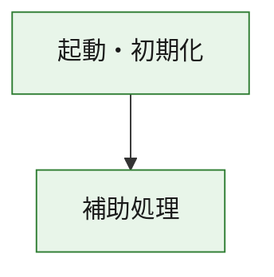
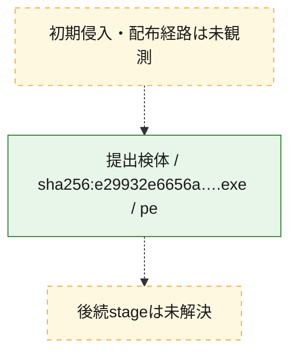
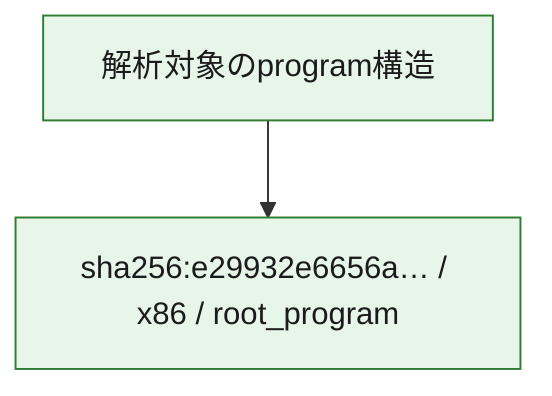

# 全体ロジック：e29932e6656a0a80456a84fe90b3622cf9d66e66fca86cfe8c06dccd830ad2b2

代表関数の静的証跡から、起動・初期化の処理群を確認しました。

## 読み方

- phaseの掲載順は解析上の整理順です。observed_call_edgesがない段階間の実行順を断定しません。
- 図の実線は静的に観測した関係、点線と黄色のノードは未観測・未解決の関係を示します。
- 図は静的な要約であり、動的実行を再現するものではありません。
- 詳細な関数解説とfingerprintは[STATIC-LOGIC.md](STATIC-LOGIC.md)を参照してください。

## 静的可視化

### 実行フロー

### 感染チェーン

### モジュール関係

## 処理段階

### 1. 起動・初期化

entry pointから初期化と後続処理への移行を確認します。
確度: `confirmed_static_function_evidence`

- `e29932e6656a0a80456a84fe90b3622cf9d66e66fca86cfe8c06dccd830ad2b2:ghidra:180001010` — 初期化と主要処理への分岐を行う入口関数です。 状態: `succeeded`、選定理由: `entry_point`, `meaningful_symbol_name`, `reviewed_call_centrality:22`, `role:entrypoint`, `small_program_complete_context`

### 2. 補助処理

主要処理を支える一般内部関数またはlibrary処理を確認します。
確度: `confirmed_static_function_evidence`

- `e29932e6656a0a80456a84fe90b3622cf9d66e66fca86cfe8c06dccd830ad2b2:ghidra:180001240` — 検体内部の一般処理を実装する関数です。 状態: `succeeded`、選定理由: `context_representative`, `reviewed_call_centrality:2`, `small_program_complete_context`
- `e29932e6656a0a80456a84fe90b3622cf9d66e66fca86cfe8c06dccd830ad2b2:ghidra:180001350` — 検体内部の一般処理を実装する関数です。 状態: `succeeded`、選定理由: `context_representative`, `reviewed_call_centrality:25`, `small_program_complete_context`
- `e29932e6656a0a80456a84fe90b3622cf9d66e66fca86cfe8c06dccd830ad2b2:ghidra:180003780` — 検体内部の一般処理を実装する関数です。 状態: `succeeded`、選定理由: `context_representative`, `reviewed_call_centrality:2`, `small_program_complete_context`
- `e29932e6656a0a80456a84fe90b3622cf9d66e66fca86cfe8c06dccd830ad2b2:ghidra:1800038e0` — 検体内部の一般処理を実装する関数です。 状態: `succeeded`、選定理由: `context_representative`, `reviewed_call_centrality:2`, `small_program_complete_context`

## 観測したcall関係

- `e29932e6656a0a80456a84fe90b3622cf9d66e66fca86cfe8c06dccd830ad2b2:ghidra:180001010` → `e29932e6656a0a80456a84fe90b3622cf9d66e66fca86cfe8c06dccd830ad2b2:ghidra:180001240` （`startup` → `support`）
- `e29932e6656a0a80456a84fe90b3622cf9d66e66fca86cfe8c06dccd830ad2b2:ghidra:180001010` → `e29932e6656a0a80456a84fe90b3622cf9d66e66fca86cfe8c06dccd830ad2b2:ghidra:180001350` （`startup` → `support`）
- `e29932e6656a0a80456a84fe90b3622cf9d66e66fca86cfe8c06dccd830ad2b2:ghidra:180001350` → `e29932e6656a0a80456a84fe90b3622cf9d66e66fca86cfe8c06dccd830ad2b2:ghidra:180001240` （`support` → `support`）
- `e29932e6656a0a80456a84fe90b3622cf9d66e66fca86cfe8c06dccd830ad2b2:ghidra:180001350` → `e29932e6656a0a80456a84fe90b3622cf9d66e66fca86cfe8c06dccd830ad2b2:ghidra:180003780` （`support` → `support`）
- `e29932e6656a0a80456a84fe90b3622cf9d66e66fca86cfe8c06dccd830ad2b2:ghidra:180001350` → `e29932e6656a0a80456a84fe90b3622cf9d66e66fca86cfe8c06dccd830ad2b2:ghidra:1800038e0` （`support` → `support`）
- `e29932e6656a0a80456a84fe90b3622cf9d66e66fca86cfe8c06dccd830ad2b2:ghidra:180003780` → `e29932e6656a0a80456a84fe90b3622cf9d66e66fca86cfe8c06dccd830ad2b2:ghidra:1800038e0` （`support` → `support`）
- `ghidra-function:17d9246618b1565505f85568` → `ghidra-external:0a09c30c6bf42d6e17d42761` （`unclassified` → `unclassified`）
- `ghidra-function:17d9246618b1565505f85568` → `ghidra-external:156b6355998096be28c72bc1` （`unclassified` → `unclassified`）
- `ghidra-function:17d9246618b1565505f85568` → `ghidra-external:1e1b3ccb563e67fb89a97205` （`unclassified` → `unclassified`）
- `ghidra-function:17d9246618b1565505f85568` → `ghidra-external:365161e1d38ec488c4c6fa5c` （`unclassified` → `unclassified`）
- `ghidra-function:17d9246618b1565505f85568` → `ghidra-external:51c5b8d356d06e2b4f00a448` （`unclassified` → `unclassified`）
- `ghidra-function:17d9246618b1565505f85568` → `ghidra-external:649ffb41b6ffdb1debe9a46c` （`unclassified` → `unclassified`）
- `ghidra-function:17d9246618b1565505f85568` → `ghidra-external:705beb9ef05d91464bd41513` （`unclassified` → `unclassified`）
- `ghidra-function:17d9246618b1565505f85568` → `ghidra-external:79d4593f67be1bebaf94b035` （`unclassified` → `unclassified`）
- `ghidra-function:17d9246618b1565505f85568` → `ghidra-external:9aef87296202313dddf76833` （`unclassified` → `unclassified`）
- `ghidra-function:17d9246618b1565505f85568` → `ghidra-external:9d28d9181baff0aa747f0909` （`unclassified` → `unclassified`）
- `ghidra-function:17d9246618b1565505f85568` → `ghidra-external:a67585f3d3031f2e9ddcf92d` （`unclassified` → `unclassified`）
- `ghidra-function:17d9246618b1565505f85568` → `ghidra-external:a78e9c333e288b89c6016534` （`unclassified` → `unclassified`）
- `ghidra-function:17d9246618b1565505f85568` → `ghidra-external:a7f394deaf2d53161c2236ae` （`unclassified` → `unclassified`）
- `ghidra-function:17d9246618b1565505f85568` → `ghidra-external:c1ad5637115a5f56e0b69167` （`unclassified` → `unclassified`）
- `ghidra-function:17d9246618b1565505f85568` → `ghidra-external:d00f2b90020e1de7aec8b94f` （`unclassified` → `unclassified`）
- `ghidra-function:17d9246618b1565505f85568` → `ghidra-external:d98649ceda481566e160618d` （`unclassified` → `unclassified`）
- `ghidra-function:17d9246618b1565505f85568` → `ghidra-external:da6ed1e2e5f3b0fc64965250` （`unclassified` → `unclassified`）
- `ghidra-function:17d9246618b1565505f85568` → `ghidra-external:ddbe105543a3b615d8a42954` （`unclassified` → `unclassified`）
- `ghidra-function:17d9246618b1565505f85568` → `ghidra-external:e2eb12478b953d09261b8ed0` （`unclassified` → `unclassified`）
- `ghidra-function:17d9246618b1565505f85568` → `ghidra-external:f6f4c8534c31106cc632196b` （`unclassified` → `unclassified`）
- `ghidra-function:17d9246618b1565505f85568` → `ghidra-external:fbbe4451c58d471aab8c13c4` （`unclassified` → `unclassified`）
- `ghidra-function:17d9246618b1565505f85568` → `ghidra-function:383d17bbef8feed7e1918aab` （`unclassified` → `unclassified`）
- `ghidra-function:17d9246618b1565505f85568` → `ghidra-function:501cbbe8d68f48e765eb7218` （`unclassified` → `unclassified`）
- `ghidra-function:17d9246618b1565505f85568` → `ghidra-function:b692fc4723fbf17c9bc15fbc` （`unclassified` → `unclassified`）
- `ghidra-function:501cbbe8d68f48e765eb7218` → `ghidra-function:383d17bbef8feed7e1918aab` （`unclassified` → `unclassified`）
- `ghidra-function:aa91bb123d6548ec57e0de2a` → `ghidra-function:17d9246618b1565505f85568` （`unclassified` → `unclassified`）
- `ghidra-function:aa91bb123d6548ec57e0de2a` → `ghidra-function:27b20d10c3228a7753e06ee4` （`unclassified` → `unclassified`）
- `ghidra-function:aa91bb123d6548ec57e0de2a` → `ghidra-function:50c793f0f4e9f1029949bae5` （`unclassified` → `unclassified`）
- `ghidra-function:aa91bb123d6548ec57e0de2a` → `ghidra-function:664413cd0ca4ce1c1e1de373` （`unclassified` → `unclassified`）
- `ghidra-function:aa91bb123d6548ec57e0de2a` → `ghidra-function:6bb88463e9f82cc7f21d3d6d` （`unclassified` → `unclassified`）
- `ghidra-function:aa91bb123d6548ec57e0de2a` → `ghidra-function:7cffc2f79d63357e91a88f5c` （`unclassified` → `unclassified`）
- `ghidra-function:aa91bb123d6548ec57e0de2a` → `ghidra-function:93d7294984f7e87bb0ed6d00` （`unclassified` → `unclassified`）
- `ghidra-function:aa91bb123d6548ec57e0de2a` → `ghidra-function:944f105ce3d7494ff41bf88d` （`unclassified` → `unclassified`）
- `ghidra-function:aa91bb123d6548ec57e0de2a` → `ghidra-function:9ecede9b2f1dd220d4b77a95` （`unclassified` → `unclassified`）
- `ghidra-function:aa91bb123d6548ec57e0de2a` → `ghidra-function:b692fc4723fbf17c9bc15fbc` （`unclassified` → `unclassified`）
- `ghidra-function:aa91bb123d6548ec57e0de2a` → `ghidra-function:bb2bb1970f79415567180f9d` （`unclassified` → `unclassified`）
- `ghidra-function:aa91bb123d6548ec57e0de2a` → `ghidra-function:c62abf5423e21e5f4841f7e0` （`unclassified` → `unclassified`）

## 解析範囲と制約

- 選定外関数は全体inventoryへ残しますが、関数本体の個別解説対象にはしていません。
- indirect call、難読化、packer、VM、壊れたcontrol flowによりcall関係が欠落する場合があります。
- 文書は静的解析に基づき、検体実行や外部通信による動的確認は行っていません。
