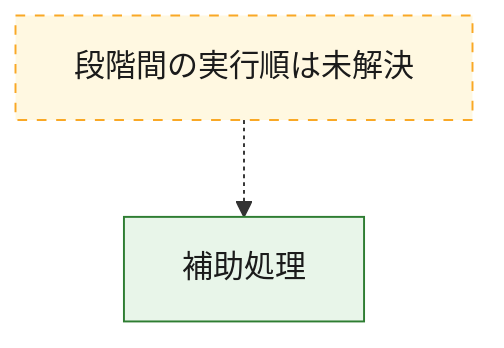
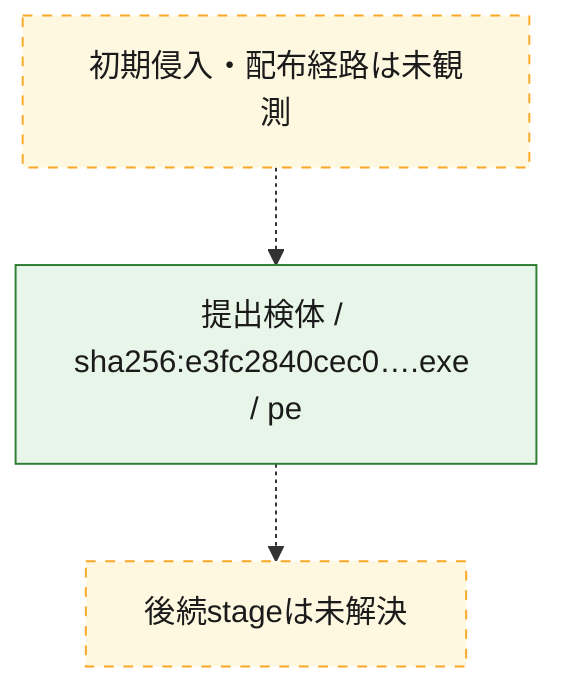
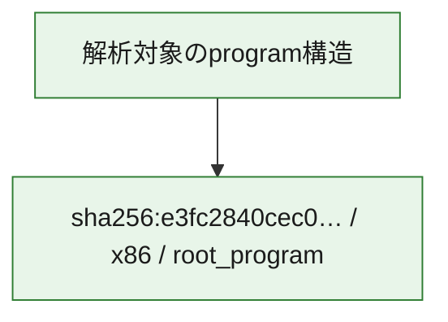

# 全体ロジック：e3fc2840cec07dff9c35f528bbe7b3efbe1d60d9a8de9d1467a47cfa7016c278

代表関数から主要なmalware処理段階を自動分類できませんでした。

## 読み方

- phaseの掲載順は解析上の整理順です。observed_call_edgesがない段階間の実行順を断定しません。
- 図の実線は静的に観測した関係、点線と黄色のノードは未観測・未解決の関係を示します。
- 図は静的な要約であり、動的実行を再現するものではありません。
- 詳細な関数解説とfingerprintは[STATIC-LOGIC.md](STATIC-LOGIC.md)を参照してください。

## 静的可視化

### 実行フロー

### 感染チェーン

### モジュール関係

## 処理段階

### 1. 補助処理

主要処理を支える一般内部関数またはlibrary処理を確認します。
確度: `confirmed_static_function_evidence_with_limits`

- `e3fc2840cec07dff9c35f528bbe7b3efbe1d60d9a8de9d1467a47cfa7016c278:ghidra:1400013c8` — 検体内部の一般処理を実装する関数です。 状態: `limited_bad_instruction_or_flow`、選定理由: `context_representative`, `reviewed_call_centrality:1`
- `e3fc2840cec07dff9c35f528bbe7b3efbe1d60d9a8de9d1467a47cfa7016c278:ghidra:140001578` — 検体内部の一般処理を実装する関数です。 状態: `limited_bad_instruction_or_flow`、選定理由: `context_representative`, `reviewed_call_centrality:1`
- `e3fc2840cec07dff9c35f528bbe7b3efbe1d60d9a8de9d1467a47cfa7016c278:ghidra:140001664` — 検体内部の一般処理を実装する関数です。 状態: `limited_bad_instruction_or_flow`、選定理由: `context_representative`, `reviewed_call_centrality:1`
- `e3fc2840cec07dff9c35f528bbe7b3efbe1d60d9a8de9d1467a47cfa7016c278:ghidra:1400018a8` — 検体内部の一般処理を実装する関数です。 状態: `limited_bad_instruction_or_flow`、選定理由: `context_representative`, `reviewed_call_centrality:1`
- `e3fc2840cec07dff9c35f528bbe7b3efbe1d60d9a8de9d1467a47cfa7016c278:ghidra:140001a8c` — 検体内部の一般処理を実装する関数です。 状態: `limited_bad_instruction_or_flow`、選定理由: `context_representative`, `reviewed_call_centrality:1`
- `e3fc2840cec07dff9c35f528bbe7b3efbe1d60d9a8de9d1467a47cfa7016c278:ghidra:1400021a0` — 検体内部の一般処理を実装する関数です。 状態: `limited_bad_instruction_or_flow`、選定理由: `context_representative`, `reviewed_call_centrality:1`
- `e3fc2840cec07dff9c35f528bbe7b3efbe1d60d9a8de9d1467a47cfa7016c278:ghidra:140002700` — 検体内部の一般処理を実装する関数です。 状態: `limited_bad_instruction_or_flow`、選定理由: `context_representative`, `reviewed_call_centrality:1`
- `e3fc2840cec07dff9c35f528bbe7b3efbe1d60d9a8de9d1467a47cfa7016c278:ghidra:140002a64` — 検体内部の一般処理を実装する関数です。 状態: `limited_bad_instruction_or_flow`、選定理由: `context_representative`, `reviewed_call_centrality:1`
- `e3fc2840cec07dff9c35f528bbe7b3efbe1d60d9a8de9d1467a47cfa7016c278:ghidra:140002b1c` — 検体内部の一般処理を実装する関数です。 状態: `limited_bad_instruction_or_flow`、選定理由: `context_representative`, `reviewed_call_centrality:1`
- `e3fc2840cec07dff9c35f528bbe7b3efbe1d60d9a8de9d1467a47cfa7016c278:ghidra:140002d38` — 検体内部の一般処理を実装する関数です。 状態: `limited_bad_instruction_or_flow`、選定理由: `context_representative`, `reviewed_call_centrality:1`
- `e3fc2840cec07dff9c35f528bbe7b3efbe1d60d9a8de9d1467a47cfa7016c278:ghidra:140002ec4` — 検体内部の一般処理を実装する関数です。 状態: `limited_bad_instruction_or_flow`、選定理由: `context_representative`, `reviewed_call_centrality:1`
- `e3fc2840cec07dff9c35f528bbe7b3efbe1d60d9a8de9d1467a47cfa7016c278:ghidra:1400030ac` — 検体内部の一般処理を実装する関数です。 状態: `limited_bad_instruction_or_flow`、選定理由: `context_representative`, `reviewed_call_centrality:1`
- `e3fc2840cec07dff9c35f528bbe7b3efbe1d60d9a8de9d1467a47cfa7016c278:ghidra:140003258` — 検体内部の一般処理を実装する関数です。 状態: `limited_bad_instruction_or_flow`、選定理由: `context_representative`, `reviewed_call_centrality:1`
- `e3fc2840cec07dff9c35f528bbe7b3efbe1d60d9a8de9d1467a47cfa7016c278:ghidra:1400038b0` — 検体内部の一般処理を実装する関数です。 状態: `limited_bad_instruction_or_flow`、選定理由: `context_representative`, `reviewed_call_centrality:1`
- `e3fc2840cec07dff9c35f528bbe7b3efbe1d60d9a8de9d1467a47cfa7016c278:ghidra:140003944` — 検体内部の一般処理を実装する関数です。 状態: `limited_bad_instruction_or_flow`、選定理由: `context_representative`, `reviewed_call_centrality:1`
- `e3fc2840cec07dff9c35f528bbe7b3efbe1d60d9a8de9d1467a47cfa7016c278:ghidra:1400039a0` — 検体内部の一般処理を実装する関数です。 状態: `limited_bad_instruction_or_flow`、選定理由: `context_representative`, `reviewed_call_centrality:1`
- `e3fc2840cec07dff9c35f528bbe7b3efbe1d60d9a8de9d1467a47cfa7016c278:ghidra:140003a84` — 検体内部の一般処理を実装する関数です。 状態: `limited_bad_instruction_or_flow`、選定理由: `context_representative`, `reviewed_call_centrality:1`
- `e3fc2840cec07dff9c35f528bbe7b3efbe1d60d9a8de9d1467a47cfa7016c278:ghidra:140003b0c` — 検体内部の一般処理を実装する関数です。 状態: `limited_bad_instruction_or_flow`、選定理由: `context_representative`, `reviewed_call_centrality:1`
- `e3fc2840cec07dff9c35f528bbe7b3efbe1d60d9a8de9d1467a47cfa7016c278:ghidra:140003b84` — 検体内部の一般処理を実装する関数です。 状態: `limited_bad_instruction_or_flow`、選定理由: `context_representative`, `reviewed_call_centrality:1`
- `e3fc2840cec07dff9c35f528bbe7b3efbe1d60d9a8de9d1467a47cfa7016c278:ghidra:140003c14` — 検体内部の一般処理を実装する関数です。 状態: `limited_bad_instruction_or_flow`、選定理由: `context_representative`, `reviewed_call_centrality:1`
- `e3fc2840cec07dff9c35f528bbe7b3efbe1d60d9a8de9d1467a47cfa7016c278:ghidra:140003ca4` — 検体内部の一般処理を実装する関数です。 状態: `limited_bad_instruction_or_flow`、選定理由: `context_representative`, `reviewed_call_centrality:1`
- `e3fc2840cec07dff9c35f528bbe7b3efbe1d60d9a8de9d1467a47cfa7016c278:ghidra:140003e28` — 検体内部の一般処理を実装する関数です。 状態: `limited_bad_instruction_or_flow`、選定理由: `context_representative`, `reviewed_call_centrality:1`
- `e3fc2840cec07dff9c35f528bbe7b3efbe1d60d9a8de9d1467a47cfa7016c278:ghidra:140004020` — 検体内部の一般処理を実装する関数です。 状態: `limited_bad_instruction_or_flow`、選定理由: `context_representative`, `reviewed_call_centrality:1`
- `e3fc2840cec07dff9c35f528bbe7b3efbe1d60d9a8de9d1467a47cfa7016c278:ghidra:14000453c` — 検体内部の一般処理を実装する関数です。 状態: `limited_bad_instruction_or_flow`、選定理由: `context_representative`, `reviewed_call_centrality:1`
- `e3fc2840cec07dff9c35f528bbe7b3efbe1d60d9a8de9d1467a47cfa7016c278:ghidra:1400047f0` — 検体内部の一般処理を実装する関数です。 状態: `limited_bad_instruction_or_flow`、選定理由: `context_representative`, `reviewed_call_centrality:1`
- `e3fc2840cec07dff9c35f528bbe7b3efbe1d60d9a8de9d1467a47cfa7016c278:ghidra:140004980` — 検体内部の一般処理を実装する関数です。 状態: `limited_bad_instruction_or_flow`、選定理由: `context_representative`, `reviewed_call_centrality:1`
- `e3fc2840cec07dff9c35f528bbe7b3efbe1d60d9a8de9d1467a47cfa7016c278:ghidra:140004ea4` — 検体内部の一般処理を実装する関数です。 状態: `limited_bad_instruction_or_flow`、選定理由: `context_representative`, `reviewed_call_centrality:1`
- `e3fc2840cec07dff9c35f528bbe7b3efbe1d60d9a8de9d1467a47cfa7016c278:ghidra:140004f10` — 検体内部の一般処理を実装する関数です。 状態: `limited_bad_instruction_or_flow`、選定理由: `context_representative`, `reviewed_call_centrality:1`
- `e3fc2840cec07dff9c35f528bbe7b3efbe1d60d9a8de9d1467a47cfa7016c278:ghidra:140004f5c` — 検体内部の一般処理を実装する関数です。 状態: `limited_bad_instruction_or_flow`、選定理由: `context_representative`, `reviewed_call_centrality:1`
- `e3fc2840cec07dff9c35f528bbe7b3efbe1d60d9a8de9d1467a47cfa7016c278:ghidra:140004fa8` — 検体内部の一般処理を実装する関数です。 状態: `limited_bad_instruction_or_flow`、選定理由: `context_representative`, `reviewed_call_centrality:1`
- `e3fc2840cec07dff9c35f528bbe7b3efbe1d60d9a8de9d1467a47cfa7016c278:ghidra:140005014` — 検体内部の一般処理を実装する関数です。 状態: `limited_bad_instruction_or_flow`、選定理由: `context_representative`, `reviewed_call_centrality:1`
- `e3fc2840cec07dff9c35f528bbe7b3efbe1d60d9a8de9d1467a47cfa7016c278:ghidra:140005060` — 検体内部の一般処理を実装する関数です。 状態: `limited_bad_instruction_or_flow`、選定理由: `context_representative`, `reviewed_call_centrality:1`

## 観測したcall関係

- `ghidra-function:12183b9fa2ad21beb3ac4bd1` → `ghidra-external:2b397f4a25a21171507dcb22` （`unclassified` → `unclassified`）
- `ghidra-function:1da50af5cd0c63ae4b02124c` → `ghidra-external:2b397f4a25a21171507dcb22` （`unclassified` → `unclassified`）
- `ghidra-function:205a32b323f2573b388b7b18` → `ghidra-external:2b397f4a25a21171507dcb22` （`unclassified` → `unclassified`）
- `ghidra-function:293332fba43146e3a00b2b7e` → `ghidra-external:2b397f4a25a21171507dcb22` （`unclassified` → `unclassified`）
- `ghidra-function:2ae96604347974ee3a2a4e26` → `ghidra-external:2b397f4a25a21171507dcb22` （`unclassified` → `unclassified`）
- `ghidra-function:2b2ff110611f0c6f84a5f969` → `ghidra-external:2b397f4a25a21171507dcb22` （`unclassified` → `unclassified`）
- `ghidra-function:2c6c11f138acdd31079c6056` → `ghidra-external:2b397f4a25a21171507dcb22` （`unclassified` → `unclassified`）
- `ghidra-function:3082ba48c6a20d6e7a94c957` → `ghidra-external:2b397f4a25a21171507dcb22` （`unclassified` → `unclassified`）
- `ghidra-function:427958ec83aa5c8c0bb5439a` → `ghidra-external:2b397f4a25a21171507dcb22` （`unclassified` → `unclassified`）
- `ghidra-function:4583f50654b320c549bd9241` → `ghidra-external:2b397f4a25a21171507dcb22` （`unclassified` → `unclassified`）
- `ghidra-function:471edb0f4319ba4d0c726b73` → `ghidra-external:2b397f4a25a21171507dcb22` （`unclassified` → `unclassified`）
- `ghidra-function:57322c6f6c47ce351ae393d4` → `ghidra-external:2b397f4a25a21171507dcb22` （`unclassified` → `unclassified`）
- `ghidra-function:5829661fe4d7334304016044` → `ghidra-external:2b397f4a25a21171507dcb22` （`unclassified` → `unclassified`）
- `ghidra-function:5af5d28b7632f40ef6f44700` → `ghidra-external:2b397f4a25a21171507dcb22` （`unclassified` → `unclassified`）
- `ghidra-function:6884bc889cb014e4a7d6512a` → `ghidra-external:2b397f4a25a21171507dcb22` （`unclassified` → `unclassified`）
- `ghidra-function:7c3294584479251d5c0c511b` → `ghidra-external:2b397f4a25a21171507dcb22` （`unclassified` → `unclassified`）
- `ghidra-function:95cf6cfe1a364ce8fdc1de7a` → `ghidra-external:2b397f4a25a21171507dcb22` （`unclassified` → `unclassified`）
- `ghidra-function:9e577199baa9a4a0b7b64ff9` → `ghidra-external:2b397f4a25a21171507dcb22` （`unclassified` → `unclassified`）
- `ghidra-function:a23fc06e224f45faf87da14e` → `ghidra-external:2b397f4a25a21171507dcb22` （`unclassified` → `unclassified`）
- `ghidra-function:a670bda5988eacf12b962fcd` → `ghidra-external:2b397f4a25a21171507dcb22` （`unclassified` → `unclassified`）
- `ghidra-function:aa1f7b44bee37c27824ef744` → `ghidra-external:2b397f4a25a21171507dcb22` （`unclassified` → `unclassified`）
- `ghidra-function:bb8395f37af9cb55273ede42` → `ghidra-external:2b397f4a25a21171507dcb22` （`unclassified` → `unclassified`）
- `ghidra-function:c2a728d362f7f263aa73d55d` → `ghidra-external:2b397f4a25a21171507dcb22` （`unclassified` → `unclassified`）
- `ghidra-function:d07cdbc1b12bbc6845c74252` → `ghidra-external:2b397f4a25a21171507dcb22` （`unclassified` → `unclassified`）
- `ghidra-function:d130f0865a326862c6ad658b` → `ghidra-external:2b397f4a25a21171507dcb22` （`unclassified` → `unclassified`）
- `ghidra-function:db964e6f9312e58a0817c9f0` → `ghidra-external:2b397f4a25a21171507dcb22` （`unclassified` → `unclassified`）
- `ghidra-function:dce6c15b1989e949427d2c53` → `ghidra-external:2b397f4a25a21171507dcb22` （`unclassified` → `unclassified`）
- `ghidra-function:e96c534f844110351d1e1d99` → `ghidra-external:2b397f4a25a21171507dcb22` （`unclassified` → `unclassified`）
- `ghidra-function:ec046fe9c8b959e838f30556` → `ghidra-external:2b397f4a25a21171507dcb22` （`unclassified` → `unclassified`）
- `ghidra-function:f3beaa20eaf67c413cd3dd50` → `ghidra-external:2b397f4a25a21171507dcb22` （`unclassified` → `unclassified`）
- `ghidra-function:f715d18642218196f8f7dfbf` → `ghidra-external:2b397f4a25a21171507dcb22` （`unclassified` → `unclassified`）
- `ghidra-function:fbbdf7084f13718eb6f94a48` → `ghidra-external:2b397f4a25a21171507dcb22` （`unclassified` → `unclassified`）

## 解析範囲と制約

- 選定外関数は全体inventoryへ残しますが、関数本体の個別解説対象にはしていません。
- indirect call、難読化、packer、VM、壊れたcontrol flowによりcall関係が欠落する場合があります。
- 文書は静的解析に基づき、検体実行や外部通信による動的確認は行っていません。
