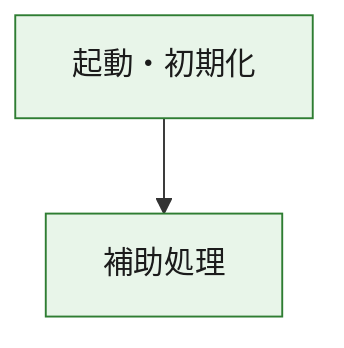
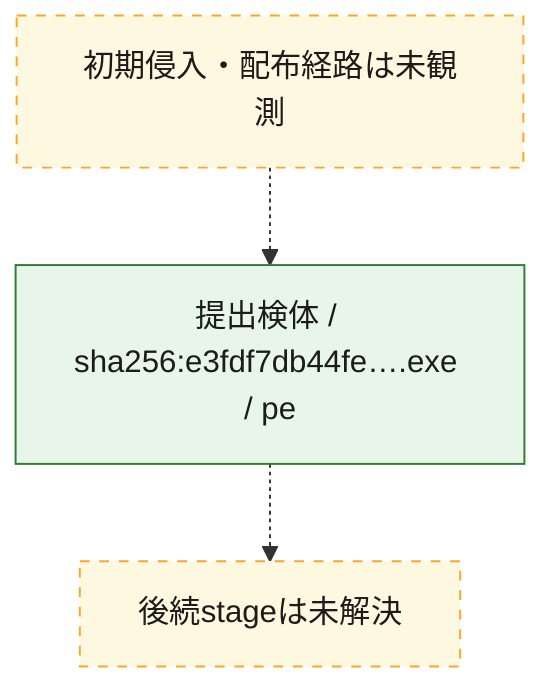
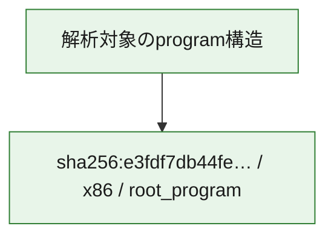

# 全体ロジック：e3fdf7db44fe587994a666aadac6191ea4745648b0c362c51a404e8cb3c82b6b

代表関数の静的証跡から、起動・初期化の処理群を確認しました。

## 読み方

- phaseの掲載順は解析上の整理順です。observed_call_edgesがない段階間の実行順を断定しません。
- 図の実線は静的に観測した関係、点線と黄色のノードは未観測・未解決の関係を示します。
- 図は静的な要約であり、動的実行を再現するものではありません。
- 詳細な関数解説とfingerprintは[STATIC-LOGIC.md](STATIC-LOGIC.md)を参照してください。

## 静的可視化

### 実行フロー

### 感染チェーン

### モジュール関係

## 処理段階

### 1. 起動・初期化

entry pointから初期化と後続処理への移行を確認します。
確度: `confirmed_static_function_evidence`

- `e3fdf7db44fe587994a666aadac6191ea4745648b0c362c51a404e8cb3c82b6b:ghidra:180001010` — 初期化と主要処理への分岐を行う入口関数です。 状態: `succeeded`、選定理由: `entry_point`, `meaningful_symbol_name`, `reviewed_call_centrality:22`, `role:entrypoint`, `small_program_complete_context`

### 2. 補助処理

主要処理を支える一般内部関数またはlibrary処理を確認します。
確度: `confirmed_static_function_evidence`

- `e3fdf7db44fe587994a666aadac6191ea4745648b0c362c51a404e8cb3c82b6b:ghidra:180001240` — 検体内部の一般処理を実装する関数です。 状態: `succeeded`、選定理由: `context_representative`, `reviewed_call_centrality:2`, `small_program_complete_context`
- `e3fdf7db44fe587994a666aadac6191ea4745648b0c362c51a404e8cb3c82b6b:ghidra:180001350` — 検体内部の一般処理を実装する関数です。 状態: `succeeded`、選定理由: `context_representative`, `reviewed_call_centrality:25`, `small_program_complete_context`
- `e3fdf7db44fe587994a666aadac6191ea4745648b0c362c51a404e8cb3c82b6b:ghidra:180003780` — 検体内部の一般処理を実装する関数です。 状態: `succeeded`、選定理由: `context_representative`, `reviewed_call_centrality:2`, `small_program_complete_context`
- `e3fdf7db44fe587994a666aadac6191ea4745648b0c362c51a404e8cb3c82b6b:ghidra:1800038e0` — 検体内部の一般処理を実装する関数です。 状態: `succeeded`、選定理由: `context_representative`, `reviewed_call_centrality:2`, `small_program_complete_context`

## 観測したcall関係

- `e3fdf7db44fe587994a666aadac6191ea4745648b0c362c51a404e8cb3c82b6b:ghidra:180001010` → `e3fdf7db44fe587994a666aadac6191ea4745648b0c362c51a404e8cb3c82b6b:ghidra:180001240` （`startup` → `support`）
- `e3fdf7db44fe587994a666aadac6191ea4745648b0c362c51a404e8cb3c82b6b:ghidra:180001010` → `e3fdf7db44fe587994a666aadac6191ea4745648b0c362c51a404e8cb3c82b6b:ghidra:180001350` （`startup` → `support`）
- `e3fdf7db44fe587994a666aadac6191ea4745648b0c362c51a404e8cb3c82b6b:ghidra:180001350` → `e3fdf7db44fe587994a666aadac6191ea4745648b0c362c51a404e8cb3c82b6b:ghidra:180001240` （`support` → `support`）
- `e3fdf7db44fe587994a666aadac6191ea4745648b0c362c51a404e8cb3c82b6b:ghidra:180001350` → `e3fdf7db44fe587994a666aadac6191ea4745648b0c362c51a404e8cb3c82b6b:ghidra:180003780` （`support` → `support`）
- `e3fdf7db44fe587994a666aadac6191ea4745648b0c362c51a404e8cb3c82b6b:ghidra:180001350` → `e3fdf7db44fe587994a666aadac6191ea4745648b0c362c51a404e8cb3c82b6b:ghidra:1800038e0` （`support` → `support`）
- `e3fdf7db44fe587994a666aadac6191ea4745648b0c362c51a404e8cb3c82b6b:ghidra:180003780` → `e3fdf7db44fe587994a666aadac6191ea4745648b0c362c51a404e8cb3c82b6b:ghidra:1800038e0` （`support` → `support`）
- `ghidra-function:9cd27e98d7a70483f4f36fd3` → `ghidra-function:05a97b5c0810a521aa70b333` （`unclassified` → `unclassified`）
- `ghidra-function:9cd27e98d7a70483f4f36fd3` → `ghidra-function:07e6db800303197e4da10704` （`unclassified` → `unclassified`）
- `ghidra-function:9cd27e98d7a70483f4f36fd3` → `ghidra-function:4380281dcf4b9a0d67974876` （`unclassified` → `unclassified`）
- `ghidra-function:9cd27e98d7a70483f4f36fd3` → `ghidra-function:50ccff140d60229bf2dec19b` （`unclassified` → `unclassified`）
- `ghidra-function:9cd27e98d7a70483f4f36fd3` → `ghidra-function:5690fac95d9013cbaa1417f2` （`unclassified` → `unclassified`）
- `ghidra-function:9cd27e98d7a70483f4f36fd3` → `ghidra-function:646a8c4aaa6ffc7aaa75cf0a` （`unclassified` → `unclassified`）
- `ghidra-function:9cd27e98d7a70483f4f36fd3` → `ghidra-function:6d5a7bcbf4b399aca6eb238d` （`unclassified` → `unclassified`）
- `ghidra-function:9cd27e98d7a70483f4f36fd3` → `ghidra-function:853b33f6ded02eccb00ed2be` （`unclassified` → `unclassified`）
- `ghidra-function:9cd27e98d7a70483f4f36fd3` → `ghidra-function:863071e9ab7d810876c05608` （`unclassified` → `unclassified`）
- `ghidra-function:9cd27e98d7a70483f4f36fd3` → `ghidra-function:a1d02423b51cc055e4668108` （`unclassified` → `unclassified`）
- `ghidra-function:9cd27e98d7a70483f4f36fd3` → `ghidra-function:b641ed482c4567549f17e5cf` （`unclassified` → `unclassified`）
- `ghidra-function:9cd27e98d7a70483f4f36fd3` → `ghidra-function:e56737e2961df2945792867f` （`unclassified` → `unclassified`）
- `ghidra-function:ca3daba1c602dfe758576a28` → `ghidra-function:b36decbca38260f1008add2a` （`unclassified` → `unclassified`）
- `ghidra-function:e56737e2961df2945792867f` → `ghidra-external:0ed48bcb9c60adb270546e4a` （`unclassified` → `unclassified`）
- `ghidra-function:e56737e2961df2945792867f` → `ghidra-external:1e76e020cc7301d0fbfc58c6` （`unclassified` → `unclassified`）
- `ghidra-function:e56737e2961df2945792867f` → `ghidra-external:29d4ae91ac44a2e0e0dd665e` （`unclassified` → `unclassified`）
- `ghidra-function:e56737e2961df2945792867f` → `ghidra-external:34dfd44fe665cd5083a3fef6` （`unclassified` → `unclassified`）
- `ghidra-function:e56737e2961df2945792867f` → `ghidra-external:363a254ec3c0396617f604ba` （`unclassified` → `unclassified`）
- `ghidra-function:e56737e2961df2945792867f` → `ghidra-external:54166ccb45571fb0640d6d98` （`unclassified` → `unclassified`）
- `ghidra-function:e56737e2961df2945792867f` → `ghidra-external:5a2baff9357d041843ff9279` （`unclassified` → `unclassified`）
- `ghidra-function:e56737e2961df2945792867f` → `ghidra-external:5ab35302718bf693088dd809` （`unclassified` → `unclassified`）
- `ghidra-function:e56737e2961df2945792867f` → `ghidra-external:6bc73ce536ab98a51aa99862` （`unclassified` → `unclassified`）
- `ghidra-function:e56737e2961df2945792867f` → `ghidra-external:6dffcdfbfece5ddbe0bbceb6` （`unclassified` → `unclassified`）
- `ghidra-function:e56737e2961df2945792867f` → `ghidra-external:970a0b6c10fc9c8ca43fb5f9` （`unclassified` → `unclassified`）
- `ghidra-function:e56737e2961df2945792867f` → `ghidra-external:afe3b66dac729a4b87c141e7` （`unclassified` → `unclassified`）
- `ghidra-function:e56737e2961df2945792867f` → `ghidra-external:b1bfbf98b79a283950d03c25` （`unclassified` → `unclassified`）
- `ghidra-function:e56737e2961df2945792867f` → `ghidra-external:be4da02f13b51ceceaa771da` （`unclassified` → `unclassified`）
- `ghidra-function:e56737e2961df2945792867f` → `ghidra-external:c2081522051c456a647f0b19` （`unclassified` → `unclassified`）
- `ghidra-function:e56737e2961df2945792867f` → `ghidra-external:c5688c42697ed022060d2c54` （`unclassified` → `unclassified`）
- `ghidra-function:e56737e2961df2945792867f` → `ghidra-external:d0eb916b72b81ff835979a12` （`unclassified` → `unclassified`）
- `ghidra-function:e56737e2961df2945792867f` → `ghidra-external:e17ade56d6c7863361d0b00c` （`unclassified` → `unclassified`）
- `ghidra-function:e56737e2961df2945792867f` → `ghidra-external:e1ca2a8332b1a9edaa53b801` （`unclassified` → `unclassified`）
- `ghidra-function:e56737e2961df2945792867f` → `ghidra-external:e2b45b859bfbaa64ad6e1942` （`unclassified` → `unclassified`）
- `ghidra-function:e56737e2961df2945792867f` → `ghidra-external:f3e5d72b4128cf5000eb46c9` （`unclassified` → `unclassified`）
- `ghidra-function:e56737e2961df2945792867f` → `ghidra-function:50ccff140d60229bf2dec19b` （`unclassified` → `unclassified`）
- `ghidra-function:e56737e2961df2945792867f` → `ghidra-function:b36decbca38260f1008add2a` （`unclassified` → `unclassified`）
- `ghidra-function:e56737e2961df2945792867f` → `ghidra-function:ca3daba1c602dfe758576a28` （`unclassified` → `unclassified`）

## 解析範囲と制約

- 選定外関数は全体inventoryへ残しますが、関数本体の個別解説対象にはしていません。
- indirect call、難読化、packer、VM、壊れたcontrol flowによりcall関係が欠落する場合があります。
- 文書は静的解析に基づき、検体実行や外部通信による動的確認は行っていません。
