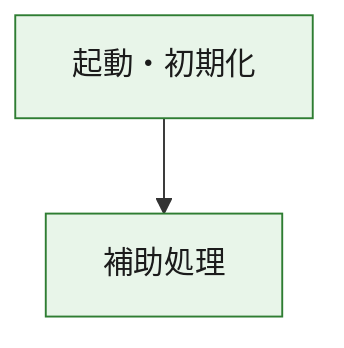
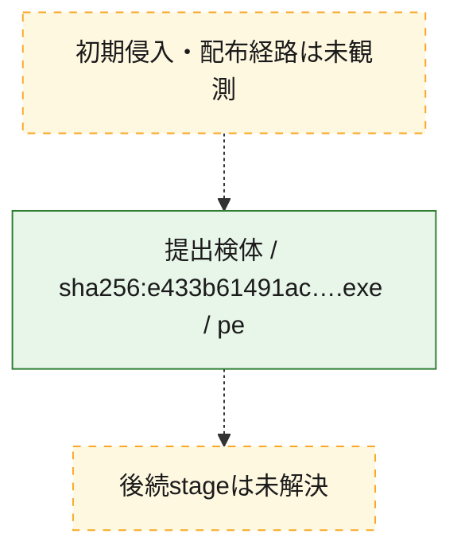
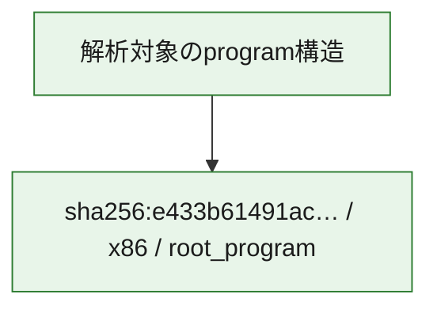

# 全体ロジック：e433b61491ac9db00a0701863ff678bc010d8e380ce09f20034f80df02e301b8

代表関数の静的証跡から、起動・初期化の処理群を確認しました。

## 読み方

- phaseの掲載順は解析上の整理順です。observed_call_edgesがない段階間の実行順を断定しません。
- 図の実線は静的に観測した関係、点線と黄色のノードは未観測・未解決の関係を示します。
- 図は静的な要約であり、動的実行を再現するものではありません。
- 詳細な関数解説とfingerprintは[STATIC-LOGIC.md](STATIC-LOGIC.md)を参照してください。

## 静的可視化

### 実行フロー

### 感染チェーン

### モジュール関係

## 処理段階

### 1. 起動・初期化

entry pointから初期化と後続処理への移行を確認します。
確度: `confirmed_static_function_evidence`

- `e433b61491ac9db00a0701863ff678bc010d8e380ce09f20034f80df02e301b8:ghidra:180001010` — 初期化と主要処理への分岐を行う入口関数です。 状態: `succeeded`、選定理由: `entry_point`, `meaningful_symbol_name`, `reviewed_call_centrality:22`, `role:entrypoint`, `small_program_complete_context`

### 2. 補助処理

主要処理を支える一般内部関数またはlibrary処理を確認します。
確度: `confirmed_static_function_evidence`

- `e433b61491ac9db00a0701863ff678bc010d8e380ce09f20034f80df02e301b8:ghidra:180001240` — 検体内部の一般処理を実装する関数です。 状態: `succeeded`、選定理由: `context_representative`, `reviewed_call_centrality:2`, `small_program_complete_context`
- `e433b61491ac9db00a0701863ff678bc010d8e380ce09f20034f80df02e301b8:ghidra:180001350` — 検体内部の一般処理を実装する関数です。 状態: `succeeded`、選定理由: `context_representative`, `reviewed_call_centrality:25`, `small_program_complete_context`
- `e433b61491ac9db00a0701863ff678bc010d8e380ce09f20034f80df02e301b8:ghidra:180003780` — 検体内部の一般処理を実装する関数です。 状態: `succeeded`、選定理由: `context_representative`, `reviewed_call_centrality:2`, `small_program_complete_context`
- `e433b61491ac9db00a0701863ff678bc010d8e380ce09f20034f80df02e301b8:ghidra:1800038e0` — 検体内部の一般処理を実装する関数です。 状態: `succeeded`、選定理由: `context_representative`, `reviewed_call_centrality:2`, `small_program_complete_context`

## 観測したcall関係

- `e433b61491ac9db00a0701863ff678bc010d8e380ce09f20034f80df02e301b8:ghidra:180001010` → `e433b61491ac9db00a0701863ff678bc010d8e380ce09f20034f80df02e301b8:ghidra:180001240` （`startup` → `support`）
- `e433b61491ac9db00a0701863ff678bc010d8e380ce09f20034f80df02e301b8:ghidra:180001010` → `e433b61491ac9db00a0701863ff678bc010d8e380ce09f20034f80df02e301b8:ghidra:180001350` （`startup` → `support`）
- `e433b61491ac9db00a0701863ff678bc010d8e380ce09f20034f80df02e301b8:ghidra:180001350` → `e433b61491ac9db00a0701863ff678bc010d8e380ce09f20034f80df02e301b8:ghidra:180001240` （`support` → `support`）
- `e433b61491ac9db00a0701863ff678bc010d8e380ce09f20034f80df02e301b8:ghidra:180001350` → `e433b61491ac9db00a0701863ff678bc010d8e380ce09f20034f80df02e301b8:ghidra:180003780` （`support` → `support`）
- `e433b61491ac9db00a0701863ff678bc010d8e380ce09f20034f80df02e301b8:ghidra:180001350` → `e433b61491ac9db00a0701863ff678bc010d8e380ce09f20034f80df02e301b8:ghidra:1800038e0` （`support` → `support`）
- `e433b61491ac9db00a0701863ff678bc010d8e380ce09f20034f80df02e301b8:ghidra:180003780` → `e433b61491ac9db00a0701863ff678bc010d8e380ce09f20034f80df02e301b8:ghidra:1800038e0` （`support` → `support`）
- `ghidra-function:33c0e2bf61c85e0172438336` → `ghidra-function:03e2e391bc55d9d0a6da1b80` （`unclassified` → `unclassified`）
- `ghidra-function:33c0e2bf61c85e0172438336` → `ghidra-function:1c263506773c899b40ebda72` （`unclassified` → `unclassified`）
- `ghidra-function:33c0e2bf61c85e0172438336` → `ghidra-function:21bacd6603506fd5a057aa47` （`unclassified` → `unclassified`）
- `ghidra-function:33c0e2bf61c85e0172438336` → `ghidra-function:2a152370924330212c2c5ad5` （`unclassified` → `unclassified`）
- `ghidra-function:33c0e2bf61c85e0172438336` → `ghidra-function:4c31002bcfd3c0d3f34ce6ac` （`unclassified` → `unclassified`）
- `ghidra-function:33c0e2bf61c85e0172438336` → `ghidra-function:7a34b2a8b02df996c3d51e04` （`unclassified` → `unclassified`）
- `ghidra-function:33c0e2bf61c85e0172438336` → `ghidra-function:86c657cecd700cc85c86f642` （`unclassified` → `unclassified`）
- `ghidra-function:33c0e2bf61c85e0172438336` → `ghidra-function:b12f0990fda72c450dc0f32d` （`unclassified` → `unclassified`）
- `ghidra-function:33c0e2bf61c85e0172438336` → `ghidra-function:b9f6031726a167b603c10276` （`unclassified` → `unclassified`）
- `ghidra-function:33c0e2bf61c85e0172438336` → `ghidra-function:c37eb7241cfe1b3103208400` （`unclassified` → `unclassified`）
- `ghidra-function:33c0e2bf61c85e0172438336` → `ghidra-function:cb6d1729df8ed948e96e761b` （`unclassified` → `unclassified`）
- `ghidra-function:33c0e2bf61c85e0172438336` → `ghidra-function:cd06342abd01791c9250b3fb` （`unclassified` → `unclassified`）
- `ghidra-function:cb6d1729df8ed948e96e761b` → `ghidra-external:058002b696534b4d00a3b9d4` （`unclassified` → `unclassified`）
- `ghidra-function:cb6d1729df8ed948e96e761b` → `ghidra-external:0602f23ad4796eb1d99cde77` （`unclassified` → `unclassified`）
- `ghidra-function:cb6d1729df8ed948e96e761b` → `ghidra-external:0e81f2c1b564bcb271eb0659` （`unclassified` → `unclassified`）
- `ghidra-function:cb6d1729df8ed948e96e761b` → `ghidra-external:0f4dffe7ef4a78a313e49b55` （`unclassified` → `unclassified`）
- `ghidra-function:cb6d1729df8ed948e96e761b` → `ghidra-external:147dffaed7258f9d5e4c436c` （`unclassified` → `unclassified`）
- `ghidra-function:cb6d1729df8ed948e96e761b` → `ghidra-external:1834a4841489d6bdcdcd5e10` （`unclassified` → `unclassified`）
- `ghidra-function:cb6d1729df8ed948e96e761b` → `ghidra-external:19b43b1709972a7edaff56e3` （`unclassified` → `unclassified`）
- `ghidra-function:cb6d1729df8ed948e96e761b` → `ghidra-external:3425941e09058696bf1b66a8` （`unclassified` → `unclassified`）
- `ghidra-function:cb6d1729df8ed948e96e761b` → `ghidra-external:430843689cc3ce5a74f7ef4f` （`unclassified` → `unclassified`）
- `ghidra-function:cb6d1729df8ed948e96e761b` → `ghidra-external:4c9fe79703eba7742bead5af` （`unclassified` → `unclassified`）
- `ghidra-function:cb6d1729df8ed948e96e761b` → `ghidra-external:4cdeb3e6e3cbfea8565c46ff` （`unclassified` → `unclassified`）
- `ghidra-function:cb6d1729df8ed948e96e761b` → `ghidra-external:8cf19cd0c88442997b853ff4` （`unclassified` → `unclassified`）
- `ghidra-function:cb6d1729df8ed948e96e761b` → `ghidra-external:bcf520f8fb769023221a3dbb` （`unclassified` → `unclassified`）
- `ghidra-function:cb6d1729df8ed948e96e761b` → `ghidra-external:bf743300c60072d07e838c73` （`unclassified` → `unclassified`）
- `ghidra-function:cb6d1729df8ed948e96e761b` → `ghidra-external:d7eb7ff0f1781ec3c70fd5e5` （`unclassified` → `unclassified`）
- `ghidra-function:cb6d1729df8ed948e96e761b` → `ghidra-external:ed1d05dd40afb837cab8cea8` （`unclassified` → `unclassified`）
- `ghidra-function:cb6d1729df8ed948e96e761b` → `ghidra-external:ef1e4a809d42d976cd11ce5f` （`unclassified` → `unclassified`）
- `ghidra-function:cb6d1729df8ed948e96e761b` → `ghidra-external:f266512978f33683d1eeb638` （`unclassified` → `unclassified`）
- `ghidra-function:cb6d1729df8ed948e96e761b` → `ghidra-external:f75127818b582e6671312462` （`unclassified` → `unclassified`）
- `ghidra-function:cb6d1729df8ed948e96e761b` → `ghidra-external:fba313cf56b4b31817e98981` （`unclassified` → `unclassified`）
- `ghidra-function:cb6d1729df8ed948e96e761b` → `ghidra-external:fbf6c08a93aaa5b0488c583c` （`unclassified` → `unclassified`）
- `ghidra-function:cb6d1729df8ed948e96e761b` → `ghidra-function:03e2e391bc55d9d0a6da1b80` （`unclassified` → `unclassified`）
- `ghidra-function:cb6d1729df8ed948e96e761b` → `ghidra-function:855e2ea5e0e3b142c7ec5e55` （`unclassified` → `unclassified`）
- `ghidra-function:cb6d1729df8ed948e96e761b` → `ghidra-function:f650e44ecf2ed8ef5812b3dc` （`unclassified` → `unclassified`）
- `ghidra-function:f650e44ecf2ed8ef5812b3dc` → `ghidra-function:855e2ea5e0e3b142c7ec5e55` （`unclassified` → `unclassified`）

## 解析範囲と制約

- 選定外関数は全体inventoryへ残しますが、関数本体の個別解説対象にはしていません。
- indirect call、難読化、packer、VM、壊れたcontrol flowによりcall関係が欠落する場合があります。
- 文書は静的解析に基づき、検体実行や外部通信による動的確認は行っていません。
