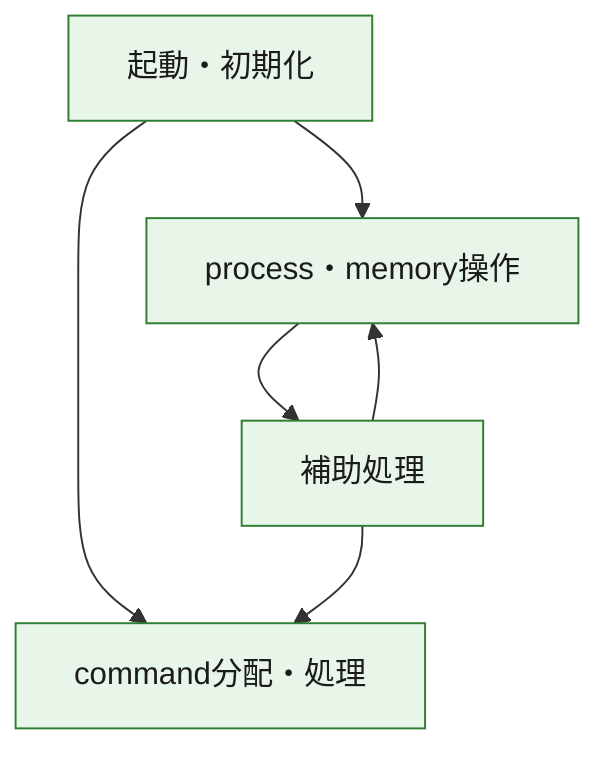
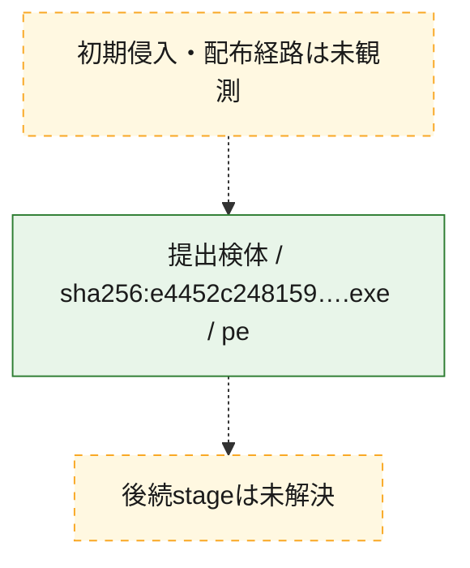
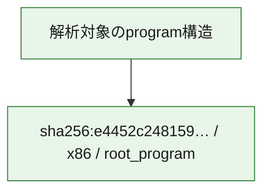

# 全体ロジック：e4452c248159c57608a0cbf75cd795b5c597156725fab13b83bf3a9eaa467ea1

代表関数の静的証跡から、起動・初期化、process・memory操作、command分配・処理の処理群を確認しました。

## 読み方

- phaseの掲載順は解析上の整理順です。observed_call_edgesがない段階間の実行順を断定しません。
- 図の実線は静的に観測した関係、点線と黄色のノードは未観測・未解決の関係を示します。
- 図は静的な要約であり、動的実行を再現するものではありません。
- 詳細な関数解説とfingerprintは[STATIC-LOGIC.md](STATIC-LOGIC.md)を参照してください。

## 静的可視化

### 実行フロー

### 感染チェーン

### モジュール関係

## 処理段階

### 1. 起動・初期化

entry pointから初期化と後続処理への移行を確認します。
確度: `confirmed_static_function_evidence`

- `e4452c248159c57608a0cbf75cd795b5c597156725fab13b83bf3a9eaa467ea1:ghidra:140003940` — 初期化と主要処理への分岐を行う入口関数です。 状態: `succeeded`、選定理由: `entry_point`, `meaningful_symbol_name`, `reviewed_call_centrality:21`, `role:entrypoint`

### 2. process・memory操作

process、thread、module、memory操作と実行移行を確認します。
確度: `confirmed_static_function_evidence`

- `e4452c248159c57608a0cbf75cd795b5c597156725fab13b83bf3a9eaa467ea1:ghidra:140002574` — process、thread、module、またはmemory操作に関係する関数です。 状態: `succeeded`、選定理由: `context_representative`, `reviewed_call_centrality:40`, `role:process_or_memory_operation`

### 3. command分配・処理

受信commandやtaskの解釈、分配、個別handlerへの移行を確認します。
確度: `confirmed_static_function_evidence_with_limits`

- `e4452c248159c57608a0cbf75cd795b5c597156725fab13b83bf3a9eaa467ea1:ghidra:140011cf0` — commandの解釈、分配、または個別処理を担当する関数です。 状態: `limited_bad_instruction_or_flow`、選定理由: `meaningful_symbol_name`, `reviewed_call_centrality:2`, `role:command_dispatch_or_handler`

### 4. 補助処理

主要処理を支える一般内部関数またはlibrary処理を確認します。
確度: `confirmed_static_function_evidence`

- `e4452c248159c57608a0cbf75cd795b5c597156725fab13b83bf3a9eaa467ea1:ghidra:140000380` — 検体内部の一般処理を実装する関数です。 状態: `succeeded`、選定理由: `context_representative`, `reviewed_call_centrality:1`
- `e4452c248159c57608a0cbf75cd795b5c597156725fab13b83bf3a9eaa467ea1:ghidra:1400003d0` — 検体内部の一般処理を実装する関数です。 状態: `succeeded`、選定理由: `context_representative`, `reviewed_call_centrality:2`
- `e4452c248159c57608a0cbf75cd795b5c597156725fab13b83bf3a9eaa467ea1:ghidra:140000460` — 検体内部の一般処理を実装する関数です。 状態: `succeeded`、選定理由: `context_representative`, `reviewed_call_centrality:7`
- `e4452c248159c57608a0cbf75cd795b5c597156725fab13b83bf3a9eaa467ea1:ghidra:140000480` — 検体内部の一般処理を実装する関数です。 状態: `succeeded`、選定理由: `context_representative`, `reviewed_call_centrality:1`
- `e4452c248159c57608a0cbf75cd795b5c597156725fab13b83bf3a9eaa467ea1:ghidra:1400004bc` — 検体内部の一般処理を実装する関数です。 状態: `succeeded`、選定理由: `context_representative`, `reviewed_call_centrality:1`
- `e4452c248159c57608a0cbf75cd795b5c597156725fab13b83bf3a9eaa467ea1:ghidra:140000510` — 検体内部の一般処理を実装する関数です。 状態: `succeeded`、選定理由: `context_representative`, `reviewed_call_centrality:1`
- `e4452c248159c57608a0cbf75cd795b5c597156725fab13b83bf3a9eaa467ea1:ghidra:140001b18` — 検体内部の一般処理を実装する関数です。 状態: `succeeded`、選定理由: `context_representative`, `reviewed_call_centrality:2`
- `e4452c248159c57608a0cbf75cd795b5c597156725fab13b83bf3a9eaa467ea1:ghidra:140001b94` — 検体内部の一般処理を実装する関数です。 状態: `succeeded`、選定理由: `context_representative`, `reviewed_call_centrality:3`
- `e4452c248159c57608a0cbf75cd795b5c597156725fab13b83bf3a9eaa467ea1:ghidra:140001c38` — 検体内部の一般処理を実装する関数です。 状態: `succeeded`、選定理由: `context_representative`, `reviewed_call_centrality:1`
- `e4452c248159c57608a0cbf75cd795b5c597156725fab13b83bf3a9eaa467ea1:ghidra:1400021e8` — 検体内部の一般処理を実装する関数です。 状態: `succeeded`、選定理由: `context_representative`, `reviewed_call_centrality:8`
- `e4452c248159c57608a0cbf75cd795b5c597156725fab13b83bf3a9eaa467ea1:ghidra:1400024f4` — 検体内部の一般処理を実装する関数です。 状態: `succeeded`、選定理由: `context_representative`, `reviewed_call_centrality:3`
- `e4452c248159c57608a0cbf75cd795b5c597156725fab13b83bf3a9eaa467ea1:ghidra:140003038` — 検体内部の一般処理を実装する関数です。 状態: `succeeded`、選定理由: `context_representative`, `reviewed_call_centrality:6`
- `e4452c248159c57608a0cbf75cd795b5c597156725fab13b83bf3a9eaa467ea1:ghidra:140003174` — 検体内部の一般処理を実装する関数です。 状態: `succeeded`、選定理由: `context_representative`, `reviewed_call_centrality:3`
- `e4452c248159c57608a0cbf75cd795b5c597156725fab13b83bf3a9eaa467ea1:ghidra:1400031d8` — 検体内部の一般処理を実装する関数です。 状態: `succeeded`、選定理由: `context_representative`, `reviewed_call_centrality:7`
- `e4452c248159c57608a0cbf75cd795b5c597156725fab13b83bf3a9eaa467ea1:ghidra:14000344c` — 検体内部の一般処理を実装する関数です。 状態: `succeeded`、選定理由: `context_representative`, `reviewed_call_centrality:1`
- `e4452c248159c57608a0cbf75cd795b5c597156725fab13b83bf3a9eaa467ea1:ghidra:14000347c` — 検体内部の一般処理を実装する関数です。 状態: `succeeded`、選定理由: `context_representative`, `reviewed_call_centrality:3`
- `e4452c248159c57608a0cbf75cd795b5c597156725fab13b83bf3a9eaa467ea1:ghidra:1400034e8` — 検体内部の一般処理を実装する関数です。 状態: `succeeded`、選定理由: `context_representative`, `reviewed_call_centrality:4`
- `e4452c248159c57608a0cbf75cd795b5c597156725fab13b83bf3a9eaa467ea1:ghidra:140003530` — 検体内部の一般処理を実装する関数です。 状態: `succeeded`、選定理由: `context_representative`, `reviewed_call_centrality:1`
- `e4452c248159c57608a0cbf75cd795b5c597156725fab13b83bf3a9eaa467ea1:ghidra:140003570` — 検体内部の一般処理を実装する関数です。 状態: `succeeded`、選定理由: `context_representative`, `reviewed_call_centrality:2`
- `e4452c248159c57608a0cbf75cd795b5c597156725fab13b83bf3a9eaa467ea1:ghidra:1400035c0` — 検体内部の一般処理を実装する関数です。 状態: `succeeded`、選定理由: `context_representative`, `reviewed_call_centrality:1`
- `e4452c248159c57608a0cbf75cd795b5c597156725fab13b83bf3a9eaa467ea1:ghidra:140003600` — 検体内部の一般処理を実装する関数です。 状態: `succeeded`、選定理由: `context_representative`, `reviewed_call_centrality:4`
- `e4452c248159c57608a0cbf75cd795b5c597156725fab13b83bf3a9eaa467ea1:ghidra:140003640` — 検体内部の一般処理を実装する関数です。 状態: `succeeded`、選定理由: `context_representative`, `reviewed_call_centrality:8`
- `e4452c248159c57608a0cbf75cd795b5c597156725fab13b83bf3a9eaa467ea1:ghidra:1400036a0` — 検体内部の一般処理を実装する関数です。 状態: `succeeded`、選定理由: `context_representative`, `reviewed_call_centrality:1`
- `e4452c248159c57608a0cbf75cd795b5c597156725fab13b83bf3a9eaa467ea1:ghidra:1400036d0` — 検体内部の一般処理を実装する関数です。 状態: `succeeded`、選定理由: `context_representative`, `reviewed_call_centrality:20`
- `e4452c248159c57608a0cbf75cd795b5c597156725fab13b83bf3a9eaa467ea1:ghidra:140003790` — 検体内部の一般処理を実装する関数です。 状態: `succeeded`、選定理由: `context_representative`, `reviewed_call_centrality:1`
- `e4452c248159c57608a0cbf75cd795b5c597156725fab13b83bf3a9eaa467ea1:ghidra:1400037a0` — 検体内部の一般処理を実装する関数です。 状態: `succeeded`、選定理由: `context_representative`, `reviewed_call_centrality:6`
- `e4452c248159c57608a0cbf75cd795b5c597156725fab13b83bf3a9eaa467ea1:ghidra:1400037c0` — 検体内部の一般処理を実装する関数です。 状態: `succeeded`、選定理由: `context_representative`, `reviewed_call_centrality:20`
- `e4452c248159c57608a0cbf75cd795b5c597156725fab13b83bf3a9eaa467ea1:ghidra:140003970` — 検体内部の一般処理を実装する関数です。 状態: `succeeded`、選定理由: `context_representative`, `reviewed_call_centrality:4`
- `e4452c248159c57608a0cbf75cd795b5c597156725fab13b83bf3a9eaa467ea1:ghidra:140003d10` — 検体内部の一般処理を実装する関数です。 状態: `succeeded`、選定理由: `meaningful_symbol_name`, `reviewed_call_centrality:1`

## 観測したcall関係

- `e4452c248159c57608a0cbf75cd795b5c597156725fab13b83bf3a9eaa467ea1:ghidra:140001b94` → `e4452c248159c57608a0cbf75cd795b5c597156725fab13b83bf3a9eaa467ea1:ghidra:140000510` （`support` → `support`）
- `e4452c248159c57608a0cbf75cd795b5c597156725fab13b83bf3a9eaa467ea1:ghidra:140001b94` → `e4452c248159c57608a0cbf75cd795b5c597156725fab13b83bf3a9eaa467ea1:ghidra:140001b18` （`support` → `support`）
- `e4452c248159c57608a0cbf75cd795b5c597156725fab13b83bf3a9eaa467ea1:ghidra:1400021e8` → `e4452c248159c57608a0cbf75cd795b5c597156725fab13b83bf3a9eaa467ea1:ghidra:140001b18` （`support` → `support`）
- `e4452c248159c57608a0cbf75cd795b5c597156725fab13b83bf3a9eaa467ea1:ghidra:1400021e8` → `e4452c248159c57608a0cbf75cd795b5c597156725fab13b83bf3a9eaa467ea1:ghidra:140001b94` （`support` → `support`）
- `e4452c248159c57608a0cbf75cd795b5c597156725fab13b83bf3a9eaa467ea1:ghidra:1400021e8` → `e4452c248159c57608a0cbf75cd795b5c597156725fab13b83bf3a9eaa467ea1:ghidra:140001c38` （`support` → `support`）
- `e4452c248159c57608a0cbf75cd795b5c597156725fab13b83bf3a9eaa467ea1:ghidra:140002574` → `e4452c248159c57608a0cbf75cd795b5c597156725fab13b83bf3a9eaa467ea1:ghidra:140000460` （`execution` → `support`）
- `e4452c248159c57608a0cbf75cd795b5c597156725fab13b83bf3a9eaa467ea1:ghidra:140002574` → `e4452c248159c57608a0cbf75cd795b5c597156725fab13b83bf3a9eaa467ea1:ghidra:1400021e8` （`execution` → `support`）
- `e4452c248159c57608a0cbf75cd795b5c597156725fab13b83bf3a9eaa467ea1:ghidra:140002574` → `e4452c248159c57608a0cbf75cd795b5c597156725fab13b83bf3a9eaa467ea1:ghidra:1400024f4` （`execution` → `support`）
- `e4452c248159c57608a0cbf75cd795b5c597156725fab13b83bf3a9eaa467ea1:ghidra:140002574` → `e4452c248159c57608a0cbf75cd795b5c597156725fab13b83bf3a9eaa467ea1:ghidra:140003038` （`execution` → `support`）
- `e4452c248159c57608a0cbf75cd795b5c597156725fab13b83bf3a9eaa467ea1:ghidra:140002574` → `e4452c248159c57608a0cbf75cd795b5c597156725fab13b83bf3a9eaa467ea1:ghidra:140003174` （`execution` → `support`）
- `e4452c248159c57608a0cbf75cd795b5c597156725fab13b83bf3a9eaa467ea1:ghidra:140002574` → `e4452c248159c57608a0cbf75cd795b5c597156725fab13b83bf3a9eaa467ea1:ghidra:1400031d8` （`execution` → `support`）
- `e4452c248159c57608a0cbf75cd795b5c597156725fab13b83bf3a9eaa467ea1:ghidra:140002574` → `e4452c248159c57608a0cbf75cd795b5c597156725fab13b83bf3a9eaa467ea1:ghidra:14000347c` （`execution` → `support`）
- `e4452c248159c57608a0cbf75cd795b5c597156725fab13b83bf3a9eaa467ea1:ghidra:140002574` → `e4452c248159c57608a0cbf75cd795b5c597156725fab13b83bf3a9eaa467ea1:ghidra:1400034e8` （`execution` → `support`）
- `e4452c248159c57608a0cbf75cd795b5c597156725fab13b83bf3a9eaa467ea1:ghidra:140002574` → `e4452c248159c57608a0cbf75cd795b5c597156725fab13b83bf3a9eaa467ea1:ghidra:140003640` （`execution` → `support`）
- `e4452c248159c57608a0cbf75cd795b5c597156725fab13b83bf3a9eaa467ea1:ghidra:140003038` → `e4452c248159c57608a0cbf75cd795b5c597156725fab13b83bf3a9eaa467ea1:ghidra:140000460` （`support` → `support`）
- `e4452c248159c57608a0cbf75cd795b5c597156725fab13b83bf3a9eaa467ea1:ghidra:140003038` → `e4452c248159c57608a0cbf75cd795b5c597156725fab13b83bf3a9eaa467ea1:ghidra:140003640` （`support` → `support`）
- `e4452c248159c57608a0cbf75cd795b5c597156725fab13b83bf3a9eaa467ea1:ghidra:1400031d8` → `e4452c248159c57608a0cbf75cd795b5c597156725fab13b83bf3a9eaa467ea1:ghidra:140000460` （`support` → `support`）
- `e4452c248159c57608a0cbf75cd795b5c597156725fab13b83bf3a9eaa467ea1:ghidra:1400031d8` → `e4452c248159c57608a0cbf75cd795b5c597156725fab13b83bf3a9eaa467ea1:ghidra:1400034e8` （`support` → `support`）
- `e4452c248159c57608a0cbf75cd795b5c597156725fab13b83bf3a9eaa467ea1:ghidra:1400031d8` → `e4452c248159c57608a0cbf75cd795b5c597156725fab13b83bf3a9eaa467ea1:ghidra:140003640` （`support` → `support`）
- `e4452c248159c57608a0cbf75cd795b5c597156725fab13b83bf3a9eaa467ea1:ghidra:1400034e8` → `e4452c248159c57608a0cbf75cd795b5c597156725fab13b83bf3a9eaa467ea1:ghidra:140003600` （`support` → `support`）
- `e4452c248159c57608a0cbf75cd795b5c597156725fab13b83bf3a9eaa467ea1:ghidra:140003600` → `e4452c248159c57608a0cbf75cd795b5c597156725fab13b83bf3a9eaa467ea1:ghidra:140003570` （`support` → `support`）
- `e4452c248159c57608a0cbf75cd795b5c597156725fab13b83bf3a9eaa467ea1:ghidra:140003640` → `e4452c248159c57608a0cbf75cd795b5c597156725fab13b83bf3a9eaa467ea1:ghidra:140000460` （`support` → `support`）
- `e4452c248159c57608a0cbf75cd795b5c597156725fab13b83bf3a9eaa467ea1:ghidra:140003640` → `e4452c248159c57608a0cbf75cd795b5c597156725fab13b83bf3a9eaa467ea1:ghidra:140003970` （`support` → `support`）
- `e4452c248159c57608a0cbf75cd795b5c597156725fab13b83bf3a9eaa467ea1:ghidra:1400036d0` → `e4452c248159c57608a0cbf75cd795b5c597156725fab13b83bf3a9eaa467ea1:ghidra:140003d10` （`support` → `support`）
- `e4452c248159c57608a0cbf75cd795b5c597156725fab13b83bf3a9eaa467ea1:ghidra:1400037c0` → `e4452c248159c57608a0cbf75cd795b5c597156725fab13b83bf3a9eaa467ea1:ghidra:140002574` （`support` → `execution`）
- `e4452c248159c57608a0cbf75cd795b5c597156725fab13b83bf3a9eaa467ea1:ghidra:1400037c0` → `e4452c248159c57608a0cbf75cd795b5c597156725fab13b83bf3a9eaa467ea1:ghidra:140011cf0` （`support` → `dispatch`）
- `e4452c248159c57608a0cbf75cd795b5c597156725fab13b83bf3a9eaa467ea1:ghidra:140003940` → `e4452c248159c57608a0cbf75cd795b5c597156725fab13b83bf3a9eaa467ea1:ghidra:140002574` （`startup` → `execution`）
- `e4452c248159c57608a0cbf75cd795b5c597156725fab13b83bf3a9eaa467ea1:ghidra:140003940` → `e4452c248159c57608a0cbf75cd795b5c597156725fab13b83bf3a9eaa467ea1:ghidra:140011cf0` （`startup` → `dispatch`）
- `ghidra-function:02d36b3c5e044e3478eed222` → `ghidra-function:f925e5a5ce29912f6c669713` （`unclassified` → `unclassified`）
- `ghidra-function:060e725862b5b720e8fe5e0d` → `ghidra-external:01c584e197e93190fed3b038` （`unclassified` → `unclassified`）
- `ghidra-function:060e725862b5b720e8fe5e0d` → `ghidra-external:1185f617a402393f65adb3c5` （`unclassified` → `unclassified`）
- `ghidra-function:060e725862b5b720e8fe5e0d` → `ghidra-external:2d6e107c94000aee4711c007` （`unclassified` → `unclassified`）
- `ghidra-function:060e725862b5b720e8fe5e0d` → `ghidra-external:3b74a2ad281c5b538270e24a` （`unclassified` → `unclassified`）
- `ghidra-function:060e725862b5b720e8fe5e0d` → `ghidra-external:67aff912bf651777a15100fc` （`unclassified` → `unclassified`）
- `ghidra-function:060e725862b5b720e8fe5e0d` → `ghidra-external:6e75ca650ff2f56ec349f2ee` （`unclassified` → `unclassified`）
- `ghidra-function:060e725862b5b720e8fe5e0d` → `ghidra-external:7332691adeacdfab7e74cded` （`unclassified` → `unclassified`）
- `ghidra-function:060e725862b5b720e8fe5e0d` → `ghidra-external:9361d7165649e14c6476185a` （`unclassified` → `unclassified`）
- `ghidra-function:060e725862b5b720e8fe5e0d` → `ghidra-external:ab068f22763758d90b575e81` （`unclassified` → `unclassified`）
- `ghidra-function:060e725862b5b720e8fe5e0d` → `ghidra-external:cfe6751227da01ac4f4cfcb6` （`unclassified` → `unclassified`）
- `ghidra-function:060e725862b5b720e8fe5e0d` → `ghidra-external:eaa1261de168f8a6bdfd8fc3` （`unclassified` → `unclassified`）
- `ghidra-function:060e725862b5b720e8fe5e0d` → `ghidra-external:ed082703441d3a7cf28d15c1` （`unclassified` → `unclassified`）
- `ghidra-function:060e725862b5b720e8fe5e0d` → `ghidra-external:f5d9956b5da8a8a9df68462c` （`unclassified` → `unclassified`）
- `ghidra-function:060e725862b5b720e8fe5e0d` → `ghidra-function:1d71c4acba6da4925613d1c9` （`unclassified` → `unclassified`）
- `ghidra-function:060e725862b5b720e8fe5e0d` → `ghidra-function:1ed37ea67e40042108d70e1c` （`unclassified` → `unclassified`）
- `ghidra-function:060e725862b5b720e8fe5e0d` → `ghidra-function:263aa204678ff4c498d8240a` （`unclassified` → `unclassified`）
- `ghidra-function:060e725862b5b720e8fe5e0d` → `ghidra-function:6e66fbf9654de5411343cb69` （`unclassified` → `unclassified`）
- `ghidra-function:060e725862b5b720e8fe5e0d` → `ghidra-function:70d8bdc1e19421817f57b904` （`unclassified` → `unclassified`）
- `ghidra-function:060e725862b5b720e8fe5e0d` → `ghidra-function:83e30c72e3c710d7a99a7ced` （`unclassified` → `unclassified`）
- `ghidra-function:060e725862b5b720e8fe5e0d` → `ghidra-function:eadf2012f4d832ce16009e1e` （`unclassified` → `unclassified`）
- `ghidra-function:0a26eb994f51c227f481b2f8` → `ghidra-external:07862b764b6884d1daf0d3c3` （`unclassified` → `unclassified`）
- `ghidra-function:0a26eb994f51c227f481b2f8` → `ghidra-external:2522157cae69b382cfe489e3` （`unclassified` → `unclassified`）
- `ghidra-function:0a26eb994f51c227f481b2f8` → `ghidra-external:3b74a2ad281c5b538270e24a` （`unclassified` → `unclassified`）
- `ghidra-function:0a26eb994f51c227f481b2f8` → `ghidra-external:490a86280d541906cf2aa108` （`unclassified` → `unclassified`）
- `ghidra-function:0a26eb994f51c227f481b2f8` → `ghidra-external:6089ac4e4dc5697414ec005b` （`unclassified` → `unclassified`）
- `ghidra-function:0a26eb994f51c227f481b2f8` → `ghidra-external:6c2c8ed5853ffddff8e3e2b2` （`unclassified` → `unclassified`）
- `ghidra-function:0a26eb994f51c227f481b2f8` → `ghidra-external:840a7d605b71c62f8585005a` （`unclassified` → `unclassified`）
- `ghidra-function:0a26eb994f51c227f481b2f8` → `ghidra-function:18a882855f9ea2d9601b8e10` （`unclassified` → `unclassified`）
- `ghidra-function:0a26eb994f51c227f481b2f8` → `ghidra-function:3a55d779c773ae76434162f8` （`unclassified` → `unclassified`）
- `ghidra-function:0a26eb994f51c227f481b2f8` → `ghidra-function:4310422ee0b78f317a8cd352` （`unclassified` → `unclassified`）
- `ghidra-function:0a26eb994f51c227f481b2f8` → `ghidra-function:4603dddebb8b42db91eb4c4f` （`unclassified` → `unclassified`）
- `ghidra-function:0a26eb994f51c227f481b2f8` → `ghidra-function:5c4a6b533ceed861601ee660` （`unclassified` → `unclassified`）
- `ghidra-function:0a26eb994f51c227f481b2f8` → `ghidra-function:5fcdbf30e5fec37303a99560` （`unclassified` → `unclassified`）
- `ghidra-function:0a26eb994f51c227f481b2f8` → `ghidra-function:613f2f6dcabb58fc463d25ae` （`unclassified` → `unclassified`）
- `ghidra-function:0a26eb994f51c227f481b2f8` → `ghidra-function:64429a5ee0615c8c1cff6e7a` （`unclassified` → `unclassified`）
- `ghidra-function:0a26eb994f51c227f481b2f8` → `ghidra-function:675838708d94638707006cec` （`unclassified` → `unclassified`）
- `ghidra-function:0a26eb994f51c227f481b2f8` → `ghidra-function:6ea95b07ceff3bfcc3f9e1b6` （`unclassified` → `unclassified`）
- `ghidra-function:0a26eb994f51c227f481b2f8` → `ghidra-function:931c062a14325257775b771c` （`unclassified` → `unclassified`）
- `ghidra-function:0a26eb994f51c227f481b2f8` → `ghidra-function:9e7dc44c2c5dcd4def1be1e8` （`unclassified` → `unclassified`）
- `ghidra-function:0a26eb994f51c227f481b2f8` → `ghidra-function:a01826cdf380e6f3f42d0ebd` （`unclassified` → `unclassified`）
- `ghidra-function:0a26eb994f51c227f481b2f8` → `ghidra-function:a23e17bac443ff10627ad72e` （`unclassified` → `unclassified`）
- `ghidra-function:0a26eb994f51c227f481b2f8` → `ghidra-function:a61229597a7be2a9ec3b1c09` （`unclassified` → `unclassified`）
- `ghidra-function:0a26eb994f51c227f481b2f8` → `ghidra-function:b565159cd5f54664da9fb79b` （`unclassified` → `unclassified`）
- `ghidra-function:0a26eb994f51c227f481b2f8` → `ghidra-function:ba3f10c9a9c5efc10477fb4b` （`unclassified` → `unclassified`）
- `ghidra-function:0a26eb994f51c227f481b2f8` → `ghidra-function:bd510a6c017a69f4391a3c6b` （`unclassified` → `unclassified`）
- `ghidra-function:0a26eb994f51c227f481b2f8` → `ghidra-function:d0128fcc4d43fb97df0581c9` （`unclassified` → `unclassified`）
- `ghidra-function:0a26eb994f51c227f481b2f8` → `ghidra-function:da11b68780bcf7556d30092b` （`unclassified` → `unclassified`）
- `ghidra-function:0a26eb994f51c227f481b2f8` → `ghidra-function:db1325dbef69b58efcc38d50` （`unclassified` → `unclassified`）
- `ghidra-function:1929b7c3e003fdee646f4603` → `ghidra-external:490a86280d541906cf2aa108` （`unclassified` → `unclassified`）
- `ghidra-function:1929b7c3e003fdee646f4603` → `ghidra-function:87500a51ad518f3a8a5e7a86` （`unclassified` → `unclassified`）
- `ghidra-function:24b13b3be99c8b00c36a09ec` → `ghidra-external:3b74a2ad281c5b538270e24a` （`unclassified` → `unclassified`）
- `ghidra-function:24b13b3be99c8b00c36a09ec` → `ghidra-external:ce91311b0dd0f4cc2786fca4` （`unclassified` → `unclassified`）
- `ghidra-function:24b13b3be99c8b00c36a09ec` → `ghidra-function:f0e075161d7ed14d97edef8a` （`unclassified` → `unclassified`）
- `ghidra-function:33d7ccc1bb7aebe7f99bdce5` → `ghidra-function:f925e5a5ce29912f6c669713` （`unclassified` → `unclassified`）
- `ghidra-function:3a55d779c773ae76434162f8` → `ghidra-external:3b74a2ad281c5b538270e24a` （`unclassified` → `unclassified`）
- `ghidra-function:3a55d779c773ae76434162f8` → `ghidra-external:cfe2cd0cf68e7cfb4ddb0fee` （`unclassified` → `unclassified`）
- `ghidra-function:3a55d779c773ae76434162f8` → `ghidra-function:f0e075161d7ed14d97edef8a` （`unclassified` → `unclassified`）
- `ghidra-function:5a84a7a25bcce2958c659363` → `ghidra-function:f925e5a5ce29912f6c669713` （`unclassified` → `unclassified`）
- `ghidra-function:61270cb84ab54d318c18dc3e` → `ghidra-function:f925e5a5ce29912f6c669713` （`unclassified` → `unclassified`）
- `ghidra-function:64429a5ee0615c8c1cff6e7a` → `ghidra-external:527577b83bb668ae39c90ccb` （`unclassified` → `unclassified`）
- `ghidra-function:64429a5ee0615c8c1cff6e7a` → `ghidra-external:9b90897d2a98c82288e2a7fc` （`unclassified` → `unclassified`）
- `ghidra-function:6ea95b07ceff3bfcc3f9e1b6` → `ghidra-external:55869321173968ef313b146b` （`unclassified` → `unclassified`）
- `ghidra-function:6ea95b07ceff3bfcc3f9e1b6` → `ghidra-external:c77e568e003ba6380d473393` （`unclassified` → `unclassified`）
- `ghidra-function:6ea95b07ceff3bfcc3f9e1b6` → `ghidra-external:e0437b411ca8c84614e02505` （`unclassified` → `unclassified`）
- `ghidra-function:6ea95b07ceff3bfcc3f9e1b6` → `ghidra-function:3eb99ce81e2b2f2d60ba6434` （`unclassified` → `unclassified`）
- `ghidra-function:6ea95b07ceff3bfcc3f9e1b6` → `ghidra-function:4e509fe4388c7c9e3b195199` （`unclassified` → `unclassified`）
- `ghidra-function:6ea95b07ceff3bfcc3f9e1b6` → `ghidra-function:675838708d94638707006cec` （`unclassified` → `unclassified`）
- `ghidra-function:6ea95b07ceff3bfcc3f9e1b6` → `ghidra-function:b7fba6323149c3414cf08b7e` （`unclassified` → `unclassified`）
- `ghidra-function:911c71a11584ddbc4f74a568` → `ghidra-function:f925e5a5ce29912f6c669713` （`unclassified` → `unclassified`）
- `ghidra-function:9146ae3b13cac837dbeaa1e6` → `ghidra-function:7f6bb5bd20423b5a6e486c29` （`unclassified` → `unclassified`）
- `ghidra-function:971443e84a8995bcfeea85d1` → `ghidra-function:f925e5a5ce29912f6c669713` （`unclassified` → `unclassified`）
- `ghidra-function:9e7dc44c2c5dcd4def1be1e8` → `ghidra-external:3b74a2ad281c5b538270e24a` （`unclassified` → `unclassified`）
- `ghidra-function:9e7dc44c2c5dcd4def1be1e8` → `ghidra-external:490a86280d541906cf2aa108` （`unclassified` → `unclassified`）
- `ghidra-function:a01826cdf380e6f3f42d0ebd` → `ghidra-external:3b74a2ad281c5b538270e24a` （`unclassified` → `unclassified`）
- `ghidra-function:a01826cdf380e6f3f42d0ebd` → `ghidra-external:490a86280d541906cf2aa108` （`unclassified` → `unclassified`）
- `ghidra-function:a01826cdf380e6f3f42d0ebd` → `ghidra-function:3a55d779c773ae76434162f8` （`unclassified` → `unclassified`）
- `ghidra-function:a01826cdf380e6f3f42d0ebd` → `ghidra-function:675838708d94638707006cec` （`unclassified` → `unclassified`）
- `ghidra-function:a01826cdf380e6f3f42d0ebd` → `ghidra-function:da11b68780bcf7556d30092b` （`unclassified` → `unclassified`）
- `ghidra-function:a1852048ef1b28e1ee7c2e9b` → `ghidra-external:721d2538a2b95eeea67799e0` （`unclassified` → `unclassified`）
- `ghidra-function:a1852048ef1b28e1ee7c2e9b` → `ghidra-external:7332691adeacdfab7e74cded` （`unclassified` → `unclassified`）
- `ghidra-function:a1852048ef1b28e1ee7c2e9b` → `ghidra-external:836cc095ed4d93f21ab9af75` （`unclassified` → `unclassified`）
- `ghidra-function:a1852048ef1b28e1ee7c2e9b` → `ghidra-external:f5b4dc60b850b43cfd3cab6d` （`unclassified` → `unclassified`）
- `ghidra-function:a1852048ef1b28e1ee7c2e9b` → `ghidra-function:0392c8b437cdc48ed19fba4e` （`unclassified` → `unclassified`）
- `ghidra-function:a1852048ef1b28e1ee7c2e9b` → `ghidra-function:f078a18e00d898aacf5b21bd` （`unclassified` → `unclassified`）
- `ghidra-function:a61229597a7be2a9ec3b1c09` → `ghidra-external:3b74a2ad281c5b538270e24a` （`unclassified` → `unclassified`）
- `ghidra-function:a61229597a7be2a9ec3b1c09` → `ghidra-external:490a86280d541906cf2aa108` （`unclassified` → `unclassified`）
- `ghidra-function:a61229597a7be2a9ec3b1c09` → `ghidra-function:3a55d779c773ae76434162f8` （`unclassified` → `unclassified`）
- `ghidra-function:a61229597a7be2a9ec3b1c09` → `ghidra-function:675838708d94638707006cec` （`unclassified` → `unclassified`）
- `ghidra-function:a61229597a7be2a9ec3b1c09` → `ghidra-function:da11b68780bcf7556d30092b` （`unclassified` → `unclassified`）
- `ghidra-function:a61229597a7be2a9ec3b1c09` → `ghidra-function:db1325dbef69b58efcc38d50` （`unclassified` → `unclassified`）
- `ghidra-function:b7fba6323149c3414cf08b7e` → `ghidra-function:4e509fe4388c7c9e3b195199` （`unclassified` → `unclassified`）
- `ghidra-function:b7fba6323149c3414cf08b7e` → `ghidra-function:9dcbee7fb00988f5e4865f71` （`unclassified` → `unclassified`）
- `ghidra-function:b80be5e74837d4123e93f501` → `ghidra-external:3b74a2ad281c5b538270e24a` （`unclassified` → `unclassified`）
- `ghidra-function:b80be5e74837d4123e93f501` → `ghidra-function:33d7ccc1bb7aebe7f99bdce5` （`unclassified` → `unclassified`）
- `ghidra-function:b80be5e74837d4123e93f501` → `ghidra-function:f0e075161d7ed14d97edef8a` （`unclassified` → `unclassified`）
- `ghidra-function:c7b029220223adbf693b7bea` → `ghidra-external:2d6e107c94000aee4711c007` （`unclassified` → `unclassified`）
- `ghidra-function:c7b029220223adbf693b7bea` → `ghidra-external:3b74a2ad281c5b538270e24a` （`unclassified` → `unclassified`）
- `ghidra-function:c7b029220223adbf693b7bea` → `ghidra-external:687e3dc26aca2a57ea726beb` （`unclassified` → `unclassified`）
- `ghidra-function:c7b029220223adbf693b7bea` → `ghidra-external:b16f2719e88cd3bb2659f1ed` （`unclassified` → `unclassified`）
- `ghidra-function:c7b029220223adbf693b7bea` → `ghidra-external:cb49b91ea569459d7e037b31` （`unclassified` → `unclassified`）
- `ghidra-function:c7b029220223adbf693b7bea` → `ghidra-external:d93c789679b4471ea056da31` （`unclassified` → `unclassified`）
- `ghidra-function:c7b029220223adbf693b7bea` → `ghidra-external:f911f1c157e9a0197c2ea7aa` （`unclassified` → `unclassified`）
- `ghidra-function:c7b029220223adbf693b7bea` → `ghidra-function:0a26eb994f51c227f481b2f8` （`unclassified` → `unclassified`）
- `ghidra-function:c7b029220223adbf693b7bea` → `ghidra-function:0fbff75a5dbb0d029167950d` （`unclassified` → `unclassified`）
- `ghidra-function:c7b029220223adbf693b7bea` → `ghidra-function:16379370071700d500674cb5` （`unclassified` → `unclassified`）
- `ghidra-function:c7b029220223adbf693b7bea` → `ghidra-function:46d4f2d39b07b9e78fea1ebf` （`unclassified` → `unclassified`）
- `ghidra-function:c7b029220223adbf693b7bea` → `ghidra-function:6979ae8d6cd08392ff0ecd57` （`unclassified` → `unclassified`）
- `ghidra-function:c7b029220223adbf693b7bea` → `ghidra-function:73b9539b1e27b7551631e912` （`unclassified` → `unclassified`）
- `ghidra-function:c7b029220223adbf693b7bea` → `ghidra-function:75fe2fe028104bae68873e87` （`unclassified` → `unclassified`）
- `ghidra-function:c7b029220223adbf693b7bea` → `ghidra-function:8c010e00e9a62e4d667dcd06` （`unclassified` → `unclassified`）
- `ghidra-function:c7b029220223adbf693b7bea` → `ghidra-function:9e3ce961c36285ddc4552627` （`unclassified` → `unclassified`）
- `ghidra-function:c7b029220223adbf693b7bea` → `ghidra-function:aae97470dbc1ae07b0fdb698` （`unclassified` → `unclassified`）
- `ghidra-function:c7b029220223adbf693b7bea` → `ghidra-function:b7d8dca046263cbde4662156` （`unclassified` → `unclassified`）
- `ghidra-function:c7b029220223adbf693b7bea` → `ghidra-function:d0c122534d29ca227d2a4b1a` （`unclassified` → `unclassified`）
- `ghidra-function:c7b029220223adbf693b7bea` → `ghidra-function:dbcb265eb75905c8eacae670` （`unclassified` → `unclassified`）
- `ghidra-function:c7b029220223adbf693b7bea` → `ghidra-function:f571b6571732f708d4dd7134` （`unclassified` → `unclassified`）
- `ghidra-function:d0128fcc4d43fb97df0581c9` → `ghidra-external:3b74a2ad281c5b538270e24a` （`unclassified` → `unclassified`）
- `ghidra-function:d0128fcc4d43fb97df0581c9` → `ghidra-external:490a86280d541906cf2aa108` （`unclassified` → `unclassified`）
- `ghidra-function:da11b68780bcf7556d30092b` → `ghidra-external:3b74a2ad281c5b538270e24a` （`unclassified` → `unclassified`）
- `ghidra-function:da11b68780bcf7556d30092b` → `ghidra-external:840a7d605b71c62f8585005a` （`unclassified` → `unclassified`）
- `ghidra-function:da11b68780bcf7556d30092b` → `ghidra-function:24b13b3be99c8b00c36a09ec` （`unclassified` → `unclassified`）
- `ghidra-function:da11b68780bcf7556d30092b` → `ghidra-function:3a55d779c773ae76434162f8` （`unclassified` → `unclassified`）
- `ghidra-function:da11b68780bcf7556d30092b` → `ghidra-function:e2170a25a341b9175aac9039` （`unclassified` → `unclassified`）
- `ghidra-function:da39372449e8cfe3e6440b1c` → `ghidra-external:2d6e107c94000aee4711c007` （`unclassified` → `unclassified`）
- `ghidra-function:da39372449e8cfe3e6440b1c` → `ghidra-external:3b74a2ad281c5b538270e24a` （`unclassified` → `unclassified`）
- `ghidra-function:da39372449e8cfe3e6440b1c` → `ghidra-external:687e3dc26aca2a57ea726beb` （`unclassified` → `unclassified`）
- `ghidra-function:da39372449e8cfe3e6440b1c` → `ghidra-external:b16f2719e88cd3bb2659f1ed` （`unclassified` → `unclassified`）
- `ghidra-function:da39372449e8cfe3e6440b1c` → `ghidra-external:cb49b91ea569459d7e037b31` （`unclassified` → `unclassified`）
- `ghidra-function:da39372449e8cfe3e6440b1c` → `ghidra-external:d93c789679b4471ea056da31` （`unclassified` → `unclassified`）
- `ghidra-function:da39372449e8cfe3e6440b1c` → `ghidra-external:f911f1c157e9a0197c2ea7aa` （`unclassified` → `unclassified`）
- `ghidra-function:da39372449e8cfe3e6440b1c` → `ghidra-function:0a26eb994f51c227f481b2f8` （`unclassified` → `unclassified`）
- `ghidra-function:da39372449e8cfe3e6440b1c` → `ghidra-function:0fbff75a5dbb0d029167950d` （`unclassified` → `unclassified`）
- `ghidra-function:da39372449e8cfe3e6440b1c` → `ghidra-function:16379370071700d500674cb5` （`unclassified` → `unclassified`）
- `ghidra-function:da39372449e8cfe3e6440b1c` → `ghidra-function:46d4f2d39b07b9e78fea1ebf` （`unclassified` → `unclassified`）
- `ghidra-function:da39372449e8cfe3e6440b1c` → `ghidra-function:6979ae8d6cd08392ff0ecd57` （`unclassified` → `unclassified`）
- `ghidra-function:da39372449e8cfe3e6440b1c` → `ghidra-function:73b9539b1e27b7551631e912` （`unclassified` → `unclassified`）
- `ghidra-function:da39372449e8cfe3e6440b1c` → `ghidra-function:8c010e00e9a62e4d667dcd06` （`unclassified` → `unclassified`）
- `ghidra-function:da39372449e8cfe3e6440b1c` → `ghidra-function:9e3ce961c36285ddc4552627` （`unclassified` → `unclassified`）
- `ghidra-function:da39372449e8cfe3e6440b1c` → `ghidra-function:aae97470dbc1ae07b0fdb698` （`unclassified` → `unclassified`）
- `ghidra-function:da39372449e8cfe3e6440b1c` → `ghidra-function:b7d8dca046263cbde4662156` （`unclassified` → `unclassified`）
- `ghidra-function:da39372449e8cfe3e6440b1c` → `ghidra-function:d0c122534d29ca227d2a4b1a` （`unclassified` → `unclassified`）
- `ghidra-function:da39372449e8cfe3e6440b1c` → `ghidra-function:dbcb265eb75905c8eacae670` （`unclassified` → `unclassified`）
- `ghidra-function:da39372449e8cfe3e6440b1c` → `ghidra-function:f571b6571732f708d4dd7134` （`unclassified` → `unclassified`）
- `ghidra-function:db1325dbef69b58efcc38d50` → `ghidra-external:3b74a2ad281c5b538270e24a` （`unclassified` → `unclassified`）
- `ghidra-function:db1325dbef69b58efcc38d50` → `ghidra-function:b80be5e74837d4123e93f501` （`unclassified` → `unclassified`）
- `ghidra-function:e4a8ffaeb51585c99eafaad0` → `ghidra-function:675838708d94638707006cec` （`unclassified` → `unclassified`）
- `ghidra-function:f8c5e39f1671337ad63724f7` → `ghidra-external:490a86280d541906cf2aa108` （`unclassified` → `unclassified`）

## 解析範囲と制約

- 選定外関数は全体inventoryへ残しますが、関数本体の個別解説対象にはしていません。
- indirect call、難読化、packer、VM、壊れたcontrol flowによりcall関係が欠落する場合があります。
- 文書は静的解析に基づき、検体実行や外部通信による動的確認は行っていません。
