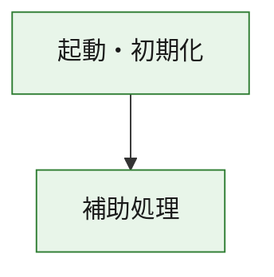
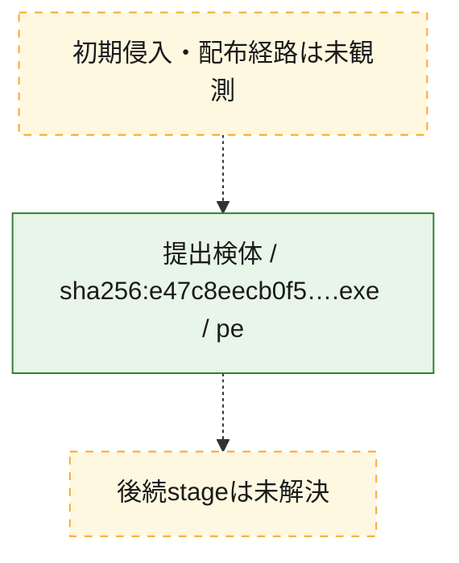
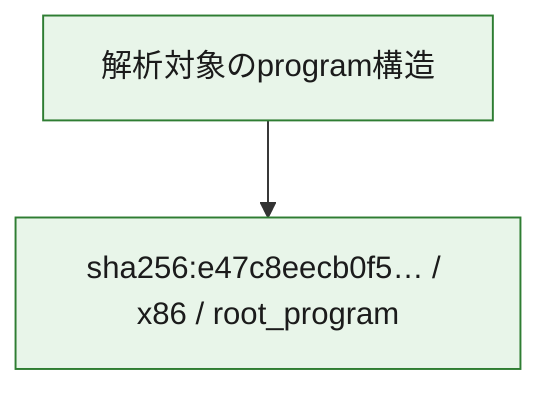

# 全体ロジック：e47c8eecb0f5b1ee6024d9c12f70bb465a555bfedb5ba949dba493c75ff59a01

代表関数の静的証跡から、起動・初期化の処理群を確認しました。

## 読み方

- phaseの掲載順は解析上の整理順です。observed_call_edgesがない段階間の実行順を断定しません。
- 図の実線は静的に観測した関係、点線と黄色のノードは未観測・未解決の関係を示します。
- 図は静的な要約であり、動的実行を再現するものではありません。
- 詳細な関数解説とfingerprintは[STATIC-LOGIC.md](STATIC-LOGIC.md)を参照してください。

## 静的可視化

### 実行フロー

### 感染チェーン

### モジュール関係

## 処理段階

### 1. 起動・初期化

entry pointから初期化と後続処理への移行を確認します。
確度: `confirmed_static_function_evidence`

- `e47c8eecb0f5b1ee6024d9c12f70bb465a555bfedb5ba949dba493c75ff59a01:ghidra:180001010` — 初期化と主要処理への分岐を行う入口関数です。 状態: `succeeded`、選定理由: `entry_point`, `meaningful_symbol_name`, `reviewed_call_centrality:22`, `role:entrypoint`, `small_program_complete_context`

### 2. 補助処理

主要処理を支える一般内部関数またはlibrary処理を確認します。
確度: `confirmed_static_function_evidence`

- `e47c8eecb0f5b1ee6024d9c12f70bb465a555bfedb5ba949dba493c75ff59a01:ghidra:180001240` — 検体内部の一般処理を実装する関数です。 状態: `succeeded`、選定理由: `context_representative`, `reviewed_call_centrality:2`, `small_program_complete_context`
- `e47c8eecb0f5b1ee6024d9c12f70bb465a555bfedb5ba949dba493c75ff59a01:ghidra:180001350` — 検体内部の一般処理を実装する関数です。 状態: `succeeded`、選定理由: `context_representative`, `reviewed_call_centrality:25`, `small_program_complete_context`
- `e47c8eecb0f5b1ee6024d9c12f70bb465a555bfedb5ba949dba493c75ff59a01:ghidra:180003780` — 検体内部の一般処理を実装する関数です。 状態: `succeeded`、選定理由: `context_representative`, `reviewed_call_centrality:2`, `small_program_complete_context`
- `e47c8eecb0f5b1ee6024d9c12f70bb465a555bfedb5ba949dba493c75ff59a01:ghidra:1800038e0` — 検体内部の一般処理を実装する関数です。 状態: `succeeded`、選定理由: `context_representative`, `reviewed_call_centrality:2`, `small_program_complete_context`

## 観測したcall関係

- `e47c8eecb0f5b1ee6024d9c12f70bb465a555bfedb5ba949dba493c75ff59a01:ghidra:180001010` → `e47c8eecb0f5b1ee6024d9c12f70bb465a555bfedb5ba949dba493c75ff59a01:ghidra:180001240` （`startup` → `support`）
- `e47c8eecb0f5b1ee6024d9c12f70bb465a555bfedb5ba949dba493c75ff59a01:ghidra:180001010` → `e47c8eecb0f5b1ee6024d9c12f70bb465a555bfedb5ba949dba493c75ff59a01:ghidra:180001350` （`startup` → `support`）
- `e47c8eecb0f5b1ee6024d9c12f70bb465a555bfedb5ba949dba493c75ff59a01:ghidra:180001350` → `e47c8eecb0f5b1ee6024d9c12f70bb465a555bfedb5ba949dba493c75ff59a01:ghidra:180001240` （`support` → `support`）
- `e47c8eecb0f5b1ee6024d9c12f70bb465a555bfedb5ba949dba493c75ff59a01:ghidra:180001350` → `e47c8eecb0f5b1ee6024d9c12f70bb465a555bfedb5ba949dba493c75ff59a01:ghidra:180003780` （`support` → `support`）
- `e47c8eecb0f5b1ee6024d9c12f70bb465a555bfedb5ba949dba493c75ff59a01:ghidra:180001350` → `e47c8eecb0f5b1ee6024d9c12f70bb465a555bfedb5ba949dba493c75ff59a01:ghidra:1800038e0` （`support` → `support`）
- `e47c8eecb0f5b1ee6024d9c12f70bb465a555bfedb5ba949dba493c75ff59a01:ghidra:180003780` → `e47c8eecb0f5b1ee6024d9c12f70bb465a555bfedb5ba949dba493c75ff59a01:ghidra:1800038e0` （`support` → `support`）
- `ghidra-function:111a091021cec057dc6e9336` → `ghidra-function:8e5acfa23d245ee4bb09773e` （`unclassified` → `unclassified`）
- `ghidra-function:5d264822e75cfa33711cf609` → `ghidra-external:1b82f6d7303e9abba3dcc99f` （`unclassified` → `unclassified`）
- `ghidra-function:5d264822e75cfa33711cf609` → `ghidra-external:2696738332e62e483bc01f56` （`unclassified` → `unclassified`）
- `ghidra-function:5d264822e75cfa33711cf609` → `ghidra-external:31b3228e869174cd62b05deb` （`unclassified` → `unclassified`）
- `ghidra-function:5d264822e75cfa33711cf609` → `ghidra-external:327071e063484da0e59b8a16` （`unclassified` → `unclassified`）
- `ghidra-function:5d264822e75cfa33711cf609` → `ghidra-external:3757edb993981f3a6f88db6d` （`unclassified` → `unclassified`）
- `ghidra-function:5d264822e75cfa33711cf609` → `ghidra-external:39ef278c3884c284ae81525b` （`unclassified` → `unclassified`）
- `ghidra-function:5d264822e75cfa33711cf609` → `ghidra-external:3e00b3fd613cfde5f7108b65` （`unclassified` → `unclassified`）
- `ghidra-function:5d264822e75cfa33711cf609` → `ghidra-external:4a48d6959ee6509f6ebdac2c` （`unclassified` → `unclassified`）
- `ghidra-function:5d264822e75cfa33711cf609` → `ghidra-external:5effc6545594f2c084aec8e1` （`unclassified` → `unclassified`）
- `ghidra-function:5d264822e75cfa33711cf609` → `ghidra-external:7d76a7c9fe5af8954a28c183` （`unclassified` → `unclassified`）
- `ghidra-function:5d264822e75cfa33711cf609` → `ghidra-external:850017c13ca7d90e960ed5f9` （`unclassified` → `unclassified`）
- `ghidra-function:5d264822e75cfa33711cf609` → `ghidra-external:8fc9c6fb6c0fbf07dfd0f933` （`unclassified` → `unclassified`）
- `ghidra-function:5d264822e75cfa33711cf609` → `ghidra-external:a10ca1181728468d57ae0887` （`unclassified` → `unclassified`）
- `ghidra-function:5d264822e75cfa33711cf609` → `ghidra-external:bad8487dd42f86fd46428efa` （`unclassified` → `unclassified`）
- `ghidra-function:5d264822e75cfa33711cf609` → `ghidra-external:c6973bf56c0747138db0223a` （`unclassified` → `unclassified`）
- `ghidra-function:5d264822e75cfa33711cf609` → `ghidra-external:db03a4eecd0616190358fb04` （`unclassified` → `unclassified`）
- `ghidra-function:5d264822e75cfa33711cf609` → `ghidra-external:ddb9bdc7cde99687fd9a5a8f` （`unclassified` → `unclassified`）
- `ghidra-function:5d264822e75cfa33711cf609` → `ghidra-external:df963519dd76ce9ee24530dc` （`unclassified` → `unclassified`）
- `ghidra-function:5d264822e75cfa33711cf609` → `ghidra-external:e3ae040c8dcd69c7fd087872` （`unclassified` → `unclassified`）
- `ghidra-function:5d264822e75cfa33711cf609` → `ghidra-external:e75004386dfc2e62f56e3b6b` （`unclassified` → `unclassified`）
- `ghidra-function:5d264822e75cfa33711cf609` → `ghidra-external:ecdf45149837e56d3c83a220` （`unclassified` → `unclassified`）
- `ghidra-function:5d264822e75cfa33711cf609` → `ghidra-function:111a091021cec057dc6e9336` （`unclassified` → `unclassified`）
- `ghidra-function:5d264822e75cfa33711cf609` → `ghidra-function:8e5acfa23d245ee4bb09773e` （`unclassified` → `unclassified`）
- `ghidra-function:5d264822e75cfa33711cf609` → `ghidra-function:cc056ebb879a87e804cce011` （`unclassified` → `unclassified`）
- `ghidra-function:a11daf05263e4d3e4c8256da` → `ghidra-function:16fd9dee0bab5e05d8b467de` （`unclassified` → `unclassified`）
- `ghidra-function:a11daf05263e4d3e4c8256da` → `ghidra-function:2abb135ec75a28b76c7cc248` （`unclassified` → `unclassified`）
- `ghidra-function:a11daf05263e4d3e4c8256da` → `ghidra-function:3676ae0b3dc2440d8fc90c86` （`unclassified` → `unclassified`）
- `ghidra-function:a11daf05263e4d3e4c8256da` → `ghidra-function:543093d4b2862b1ea16cb309` （`unclassified` → `unclassified`）
- `ghidra-function:a11daf05263e4d3e4c8256da` → `ghidra-function:5d264822e75cfa33711cf609` （`unclassified` → `unclassified`）
- `ghidra-function:a11daf05263e4d3e4c8256da` → `ghidra-function:6f4ab4d48c038d6c48b8db80` （`unclassified` → `unclassified`）
- `ghidra-function:a11daf05263e4d3e4c8256da` → `ghidra-function:77eb1e6fab92a00e7d2b3870` （`unclassified` → `unclassified`）
- `ghidra-function:a11daf05263e4d3e4c8256da` → `ghidra-function:a843c2dd579da01ca2ebe5b2` （`unclassified` → `unclassified`）
- `ghidra-function:a11daf05263e4d3e4c8256da` → `ghidra-function:cc056ebb879a87e804cce011` （`unclassified` → `unclassified`）
- `ghidra-function:a11daf05263e4d3e4c8256da` → `ghidra-function:d4ed960b57e3d625b8025b80` （`unclassified` → `unclassified`）
- `ghidra-function:a11daf05263e4d3e4c8256da` → `ghidra-function:de923dc5f667ac0db622dc14` （`unclassified` → `unclassified`）
- `ghidra-function:a11daf05263e4d3e4c8256da` → `ghidra-function:e658542c1e005e3d1bc5c32b` （`unclassified` → `unclassified`）

## 解析範囲と制約

- 選定外関数は全体inventoryへ残しますが、関数本体の個別解説対象にはしていません。
- indirect call、難読化、packer、VM、壊れたcontrol flowによりcall関係が欠落する場合があります。
- 文書は静的解析に基づき、検体実行や外部通信による動的確認は行っていません。
