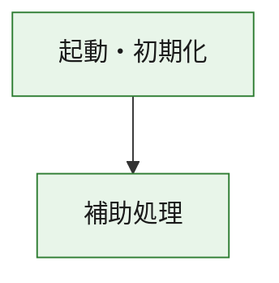
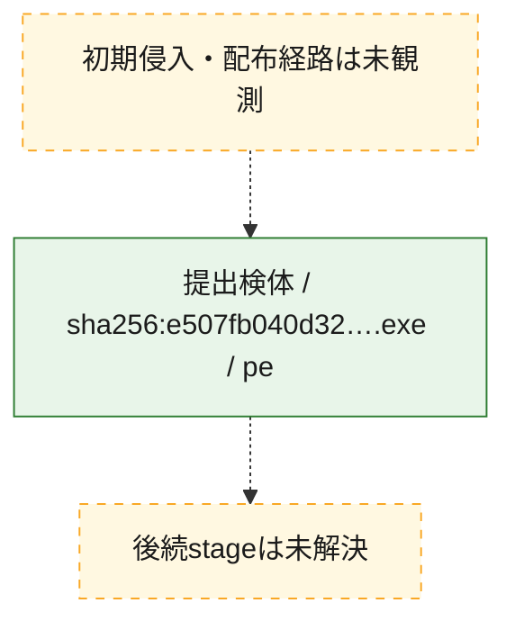
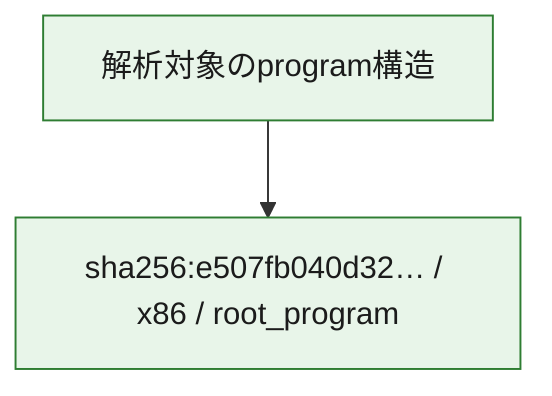

# 全体ロジック：e507fb040d325f4226f44105126f0ff3bb345380d750ac5704d78ce3a7707c94

代表関数の静的証跡から、起動・初期化の処理群を確認しました。

## 読み方

- phaseの掲載順は解析上の整理順です。observed_call_edgesがない段階間の実行順を断定しません。
- 図の実線は静的に観測した関係、点線と黄色のノードは未観測・未解決の関係を示します。
- 図は静的な要約であり、動的実行を再現するものではありません。
- 詳細な関数解説とfingerprintは[STATIC-LOGIC.md](STATIC-LOGIC.md)を参照してください。

## 静的可視化

### 実行フロー

### 感染チェーン

### モジュール関係

## 処理段階

### 1. 起動・初期化

entry pointから初期化と後続処理への移行を確認します。
確度: `confirmed_static_function_evidence`

- `e507fb040d325f4226f44105126f0ff3bb345380d750ac5704d78ce3a7707c94:ghidra:180001010` — 初期化と主要処理への分岐を行う入口関数です。 状態: `succeeded`、選定理由: `entry_point`, `meaningful_symbol_name`, `reviewed_call_centrality:22`, `role:entrypoint`, `small_program_complete_context`

### 2. 補助処理

主要処理を支える一般内部関数またはlibrary処理を確認します。
確度: `confirmed_static_function_evidence`

- `e507fb040d325f4226f44105126f0ff3bb345380d750ac5704d78ce3a7707c94:ghidra:180001240` — 検体内部の一般処理を実装する関数です。 状態: `succeeded`、選定理由: `context_representative`, `reviewed_call_centrality:2`, `small_program_complete_context`
- `e507fb040d325f4226f44105126f0ff3bb345380d750ac5704d78ce3a7707c94:ghidra:180001350` — 検体内部の一般処理を実装する関数です。 状態: `succeeded`、選定理由: `context_representative`, `reviewed_call_centrality:25`, `small_program_complete_context`
- `e507fb040d325f4226f44105126f0ff3bb345380d750ac5704d78ce3a7707c94:ghidra:180003780` — 検体内部の一般処理を実装する関数です。 状態: `succeeded`、選定理由: `context_representative`, `reviewed_call_centrality:2`, `small_program_complete_context`
- `e507fb040d325f4226f44105126f0ff3bb345380d750ac5704d78ce3a7707c94:ghidra:1800038e0` — 検体内部の一般処理を実装する関数です。 状態: `succeeded`、選定理由: `context_representative`, `reviewed_call_centrality:2`, `small_program_complete_context`

## 観測したcall関係

- `e507fb040d325f4226f44105126f0ff3bb345380d750ac5704d78ce3a7707c94:ghidra:180001010` → `e507fb040d325f4226f44105126f0ff3bb345380d750ac5704d78ce3a7707c94:ghidra:180001240` （`startup` → `support`）
- `e507fb040d325f4226f44105126f0ff3bb345380d750ac5704d78ce3a7707c94:ghidra:180001010` → `e507fb040d325f4226f44105126f0ff3bb345380d750ac5704d78ce3a7707c94:ghidra:180001350` （`startup` → `support`）
- `e507fb040d325f4226f44105126f0ff3bb345380d750ac5704d78ce3a7707c94:ghidra:180001350` → `e507fb040d325f4226f44105126f0ff3bb345380d750ac5704d78ce3a7707c94:ghidra:180001240` （`support` → `support`）
- `e507fb040d325f4226f44105126f0ff3bb345380d750ac5704d78ce3a7707c94:ghidra:180001350` → `e507fb040d325f4226f44105126f0ff3bb345380d750ac5704d78ce3a7707c94:ghidra:180003780` （`support` → `support`）
- `e507fb040d325f4226f44105126f0ff3bb345380d750ac5704d78ce3a7707c94:ghidra:180001350` → `e507fb040d325f4226f44105126f0ff3bb345380d750ac5704d78ce3a7707c94:ghidra:1800038e0` （`support` → `support`）
- `e507fb040d325f4226f44105126f0ff3bb345380d750ac5704d78ce3a7707c94:ghidra:180003780` → `e507fb040d325f4226f44105126f0ff3bb345380d750ac5704d78ce3a7707c94:ghidra:1800038e0` （`support` → `support`）
- `ghidra-function:10d740cbd2d6deb219078f9e` → `ghidra-function:062271956bc500ac811efe7a` （`unclassified` → `unclassified`）
- `ghidra-function:10d740cbd2d6deb219078f9e` → `ghidra-function:07651e71ed7305588405f8a5` （`unclassified` → `unclassified`）
- `ghidra-function:10d740cbd2d6deb219078f9e` → `ghidra-function:19ec129a5156b5d44f524bf7` （`unclassified` → `unclassified`）
- `ghidra-function:10d740cbd2d6deb219078f9e` → `ghidra-function:221412c3db2b53f4da51f812` （`unclassified` → `unclassified`）
- `ghidra-function:10d740cbd2d6deb219078f9e` → `ghidra-function:27543bf99f33075f4ee5df0f` （`unclassified` → `unclassified`）
- `ghidra-function:10d740cbd2d6deb219078f9e` → `ghidra-function:42a566da2800f68ee2e800ee` （`unclassified` → `unclassified`）
- `ghidra-function:10d740cbd2d6deb219078f9e` → `ghidra-function:52e270fd32bf4b6aa1da855e` （`unclassified` → `unclassified`）
- `ghidra-function:10d740cbd2d6deb219078f9e` → `ghidra-function:8e3e051407b72926583e6d3e` （`unclassified` → `unclassified`）
- `ghidra-function:10d740cbd2d6deb219078f9e` → `ghidra-function:bb060ae1159d3a2261536d05` （`unclassified` → `unclassified`）
- `ghidra-function:10d740cbd2d6deb219078f9e` → `ghidra-function:bdce7bd5e03a476885176e4b` （`unclassified` → `unclassified`）
- `ghidra-function:10d740cbd2d6deb219078f9e` → `ghidra-function:d8cc66193fe641f90a5a84ed` （`unclassified` → `unclassified`）
- `ghidra-function:10d740cbd2d6deb219078f9e` → `ghidra-function:e26dce1e138302f5d86a7f66` （`unclassified` → `unclassified`）
- `ghidra-function:5163b623b28195ef697e6f67` → `ghidra-function:a41acd525eb126cd3088e1a3` （`unclassified` → `unclassified`）
- `ghidra-function:e26dce1e138302f5d86a7f66` → `ghidra-external:08dd4f047e89cebb5efcc4a8` （`unclassified` → `unclassified`）
- `ghidra-function:e26dce1e138302f5d86a7f66` → `ghidra-external:147838cc4e90d66f1b438318` （`unclassified` → `unclassified`）
- `ghidra-function:e26dce1e138302f5d86a7f66` → `ghidra-external:227f511e54828311a5948033` （`unclassified` → `unclassified`）
- `ghidra-function:e26dce1e138302f5d86a7f66` → `ghidra-external:3445a52fc969c884fae7cda4` （`unclassified` → `unclassified`）
- `ghidra-function:e26dce1e138302f5d86a7f66` → `ghidra-external:3d3e43eb37ec93434708d976` （`unclassified` → `unclassified`）
- `ghidra-function:e26dce1e138302f5d86a7f66` → `ghidra-external:5c93ff57af5921fcfb3c71d1` （`unclassified` → `unclassified`）
- `ghidra-function:e26dce1e138302f5d86a7f66` → `ghidra-external:61086791a70168a8fcb15f34` （`unclassified` → `unclassified`）
- `ghidra-function:e26dce1e138302f5d86a7f66` → `ghidra-external:7d859eb8abf2e00729f7d15f` （`unclassified` → `unclassified`）
- `ghidra-function:e26dce1e138302f5d86a7f66` → `ghidra-external:821d83bc40da964c01314b9f` （`unclassified` → `unclassified`）
- `ghidra-function:e26dce1e138302f5d86a7f66` → `ghidra-external:903ba8478330a6def42f4021` （`unclassified` → `unclassified`）
- `ghidra-function:e26dce1e138302f5d86a7f66` → `ghidra-external:90d9c461d247ceeea0e7c8e0` （`unclassified` → `unclassified`）
- `ghidra-function:e26dce1e138302f5d86a7f66` → `ghidra-external:9522f6b9c7f74628909951a4` （`unclassified` → `unclassified`）
- `ghidra-function:e26dce1e138302f5d86a7f66` → `ghidra-external:b1809124a42812ba053b53c4` （`unclassified` → `unclassified`）
- `ghidra-function:e26dce1e138302f5d86a7f66` → `ghidra-external:b2a6434535b8be13d9a45980` （`unclassified` → `unclassified`）
- `ghidra-function:e26dce1e138302f5d86a7f66` → `ghidra-external:d70b9b2adc849c8e7729bcb7` （`unclassified` → `unclassified`）
- `ghidra-function:e26dce1e138302f5d86a7f66` → `ghidra-external:e95c417ad293bde0d4e4b13c` （`unclassified` → `unclassified`）
- `ghidra-function:e26dce1e138302f5d86a7f66` → `ghidra-external:ebe877a544657239eb52baa2` （`unclassified` → `unclassified`）
- `ghidra-function:e26dce1e138302f5d86a7f66` → `ghidra-external:f10cd12c36381ed9ee6a8b99` （`unclassified` → `unclassified`）
- `ghidra-function:e26dce1e138302f5d86a7f66` → `ghidra-external:f11874511123c35f1103a257` （`unclassified` → `unclassified`）
- `ghidra-function:e26dce1e138302f5d86a7f66` → `ghidra-external:f99d621c08ff539a78825a53` （`unclassified` → `unclassified`）
- `ghidra-function:e26dce1e138302f5d86a7f66` → `ghidra-external:fb2fdc5a278d43092ea57c11` （`unclassified` → `unclassified`）
- `ghidra-function:e26dce1e138302f5d86a7f66` → `ghidra-function:221412c3db2b53f4da51f812` （`unclassified` → `unclassified`）
- `ghidra-function:e26dce1e138302f5d86a7f66` → `ghidra-function:5163b623b28195ef697e6f67` （`unclassified` → `unclassified`）
- `ghidra-function:e26dce1e138302f5d86a7f66` → `ghidra-function:a41acd525eb126cd3088e1a3` （`unclassified` → `unclassified`）

## 解析範囲と制約

- 選定外関数は全体inventoryへ残しますが、関数本体の個別解説対象にはしていません。
- indirect call、難読化、packer、VM、壊れたcontrol flowによりcall関係が欠落する場合があります。
- 文書は静的解析に基づき、検体実行や外部通信による動的確認は行っていません。
