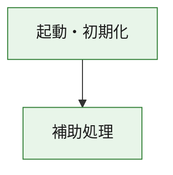
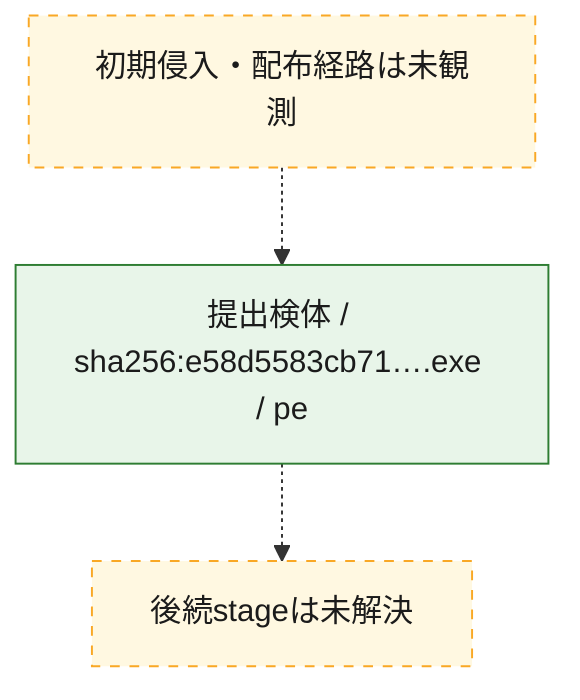
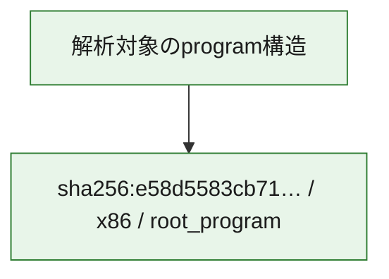

# 全体ロジック：e58d5583cb71b8e3f3a95ef7cc9a0ba4fba76fa4ca03ebd7e8e5a91810f6250d

代表関数の静的証跡から、起動・初期化の処理群を確認しました。

## 読み方

- phaseの掲載順は解析上の整理順です。observed_call_edgesがない段階間の実行順を断定しません。
- 図の実線は静的に観測した関係、点線と黄色のノードは未観測・未解決の関係を示します。
- 図は静的な要約であり、動的実行を再現するものではありません。
- 詳細な関数解説とfingerprintは[STATIC-LOGIC.md](STATIC-LOGIC.md)を参照してください。

## 静的可視化

### 実行フロー

### 感染チェーン

### モジュール関係

## 処理段階

### 1. 起動・初期化

entry pointから初期化と後続処理への移行を確認します。
確度: `confirmed_static_function_evidence`

- `e58d5583cb71b8e3f3a95ef7cc9a0ba4fba76fa4ca03ebd7e8e5a91810f6250d:ghidra:180001010` — 初期化と主要処理への分岐を行う入口関数です。 状態: `succeeded`、選定理由: `entry_point`, `meaningful_symbol_name`, `reviewed_call_centrality:22`, `role:entrypoint`, `small_program_complete_context`

### 2. 補助処理

主要処理を支える一般内部関数またはlibrary処理を確認します。
確度: `confirmed_static_function_evidence`

- `e58d5583cb71b8e3f3a95ef7cc9a0ba4fba76fa4ca03ebd7e8e5a91810f6250d:ghidra:180001240` — 検体内部の一般処理を実装する関数です。 状態: `succeeded`、選定理由: `context_representative`, `reviewed_call_centrality:2`, `small_program_complete_context`
- `e58d5583cb71b8e3f3a95ef7cc9a0ba4fba76fa4ca03ebd7e8e5a91810f6250d:ghidra:180001350` — 検体内部の一般処理を実装する関数です。 状態: `succeeded`、選定理由: `context_representative`, `reviewed_call_centrality:25`, `small_program_complete_context`
- `e58d5583cb71b8e3f3a95ef7cc9a0ba4fba76fa4ca03ebd7e8e5a91810f6250d:ghidra:180003780` — 検体内部の一般処理を実装する関数です。 状態: `succeeded`、選定理由: `context_representative`, `reviewed_call_centrality:2`, `small_program_complete_context`
- `e58d5583cb71b8e3f3a95ef7cc9a0ba4fba76fa4ca03ebd7e8e5a91810f6250d:ghidra:1800038e0` — 検体内部の一般処理を実装する関数です。 状態: `succeeded`、選定理由: `context_representative`, `reviewed_call_centrality:2`, `small_program_complete_context`

## 観測したcall関係

- `e58d5583cb71b8e3f3a95ef7cc9a0ba4fba76fa4ca03ebd7e8e5a91810f6250d:ghidra:180001010` → `e58d5583cb71b8e3f3a95ef7cc9a0ba4fba76fa4ca03ebd7e8e5a91810f6250d:ghidra:180001240` （`startup` → `support`）
- `e58d5583cb71b8e3f3a95ef7cc9a0ba4fba76fa4ca03ebd7e8e5a91810f6250d:ghidra:180001010` → `e58d5583cb71b8e3f3a95ef7cc9a0ba4fba76fa4ca03ebd7e8e5a91810f6250d:ghidra:180001350` （`startup` → `support`）
- `e58d5583cb71b8e3f3a95ef7cc9a0ba4fba76fa4ca03ebd7e8e5a91810f6250d:ghidra:180001350` → `e58d5583cb71b8e3f3a95ef7cc9a0ba4fba76fa4ca03ebd7e8e5a91810f6250d:ghidra:180001240` （`support` → `support`）
- `e58d5583cb71b8e3f3a95ef7cc9a0ba4fba76fa4ca03ebd7e8e5a91810f6250d:ghidra:180001350` → `e58d5583cb71b8e3f3a95ef7cc9a0ba4fba76fa4ca03ebd7e8e5a91810f6250d:ghidra:180003780` （`support` → `support`）
- `e58d5583cb71b8e3f3a95ef7cc9a0ba4fba76fa4ca03ebd7e8e5a91810f6250d:ghidra:180001350` → `e58d5583cb71b8e3f3a95ef7cc9a0ba4fba76fa4ca03ebd7e8e5a91810f6250d:ghidra:1800038e0` （`support` → `support`）
- `e58d5583cb71b8e3f3a95ef7cc9a0ba4fba76fa4ca03ebd7e8e5a91810f6250d:ghidra:180003780` → `e58d5583cb71b8e3f3a95ef7cc9a0ba4fba76fa4ca03ebd7e8e5a91810f6250d:ghidra:1800038e0` （`support` → `support`）
- `ghidra-function:36717fc06a4f1aeef1bd0955` → `ghidra-function:0c30ce9815fcb99ded342b51` （`unclassified` → `unclassified`）
- `ghidra-function:36717fc06a4f1aeef1bd0955` → `ghidra-function:125a4d062fa0ad3af8f44343` （`unclassified` → `unclassified`）
- `ghidra-function:36717fc06a4f1aeef1bd0955` → `ghidra-function:16da12d274ec59a72178b3c7` （`unclassified` → `unclassified`）
- `ghidra-function:36717fc06a4f1aeef1bd0955` → `ghidra-function:1bf3ac0c12936bd7d882e9ef` （`unclassified` → `unclassified`）
- `ghidra-function:36717fc06a4f1aeef1bd0955` → `ghidra-function:2095c76fde0beaf63b021b36` （`unclassified` → `unclassified`）
- `ghidra-function:36717fc06a4f1aeef1bd0955` → `ghidra-function:2e681aae3aa0e11750fbb063` （`unclassified` → `unclassified`）
- `ghidra-function:36717fc06a4f1aeef1bd0955` → `ghidra-function:8025af6862ef38563a2f74d0` （`unclassified` → `unclassified`）
- `ghidra-function:36717fc06a4f1aeef1bd0955` → `ghidra-function:80f0473f55423cc75b3bf17d` （`unclassified` → `unclassified`）
- `ghidra-function:36717fc06a4f1aeef1bd0955` → `ghidra-function:836b880db9cdd8855e8ba79d` （`unclassified` → `unclassified`）
- `ghidra-function:36717fc06a4f1aeef1bd0955` → `ghidra-function:a7a359d0b3a200fcf3c03a5d` （`unclassified` → `unclassified`）
- `ghidra-function:36717fc06a4f1aeef1bd0955` → `ghidra-function:aa33ff523d427f462f86521a` （`unclassified` → `unclassified`）
- `ghidra-function:36717fc06a4f1aeef1bd0955` → `ghidra-function:c28fdbab2c5034fc2d36d3d8` （`unclassified` → `unclassified`）
- `ghidra-function:8025af6862ef38563a2f74d0` → `ghidra-external:0cb3b632159559161508346a` （`unclassified` → `unclassified`）
- `ghidra-function:8025af6862ef38563a2f74d0` → `ghidra-external:0cc61a12bbc429b7a0804e31` （`unclassified` → `unclassified`）
- `ghidra-function:8025af6862ef38563a2f74d0` → `ghidra-external:185bfd57262c74ff8e8bcbd8` （`unclassified` → `unclassified`）
- `ghidra-function:8025af6862ef38563a2f74d0` → `ghidra-external:20d75ccb50e69a345bea51d2` （`unclassified` → `unclassified`）
- `ghidra-function:8025af6862ef38563a2f74d0` → `ghidra-external:384061bf3ed2e7ed440d556c` （`unclassified` → `unclassified`）
- `ghidra-function:8025af6862ef38563a2f74d0` → `ghidra-external:3aa2de9178eb881f182e1bb4` （`unclassified` → `unclassified`）
- `ghidra-function:8025af6862ef38563a2f74d0` → `ghidra-external:47d4e712087bccd3ee67275e` （`unclassified` → `unclassified`）
- `ghidra-function:8025af6862ef38563a2f74d0` → `ghidra-external:4b892aa800a2d1e6c28ce30d` （`unclassified` → `unclassified`）
- `ghidra-function:8025af6862ef38563a2f74d0` → `ghidra-external:5dd7888768b2b023dcaf8a74` （`unclassified` → `unclassified`）
- `ghidra-function:8025af6862ef38563a2f74d0` → `ghidra-external:6a73878f93f821670f7b1416` （`unclassified` → `unclassified`）
- `ghidra-function:8025af6862ef38563a2f74d0` → `ghidra-external:91fdd78e8956f29e1402008b` （`unclassified` → `unclassified`）
- `ghidra-function:8025af6862ef38563a2f74d0` → `ghidra-external:9f3e7ce379bde2832611405a` （`unclassified` → `unclassified`）
- `ghidra-function:8025af6862ef38563a2f74d0` → `ghidra-external:a0cdb58cd0fb3c214c60e902` （`unclassified` → `unclassified`）
- `ghidra-function:8025af6862ef38563a2f74d0` → `ghidra-external:a8a300884a3d4a80fd361af6` （`unclassified` → `unclassified`）
- `ghidra-function:8025af6862ef38563a2f74d0` → `ghidra-external:ab027d12840985e2583f8f51` （`unclassified` → `unclassified`）
- `ghidra-function:8025af6862ef38563a2f74d0` → `ghidra-external:be96a21b234c776e21408000` （`unclassified` → `unclassified`）
- `ghidra-function:8025af6862ef38563a2f74d0` → `ghidra-external:c75c849edc355b2beca49d66` （`unclassified` → `unclassified`）
- `ghidra-function:8025af6862ef38563a2f74d0` → `ghidra-external:dcd88a035ed4ce1f54ad9d24` （`unclassified` → `unclassified`）
- `ghidra-function:8025af6862ef38563a2f74d0` → `ghidra-external:dd7d23643e44979d7eb760ae` （`unclassified` → `unclassified`）
- `ghidra-function:8025af6862ef38563a2f74d0` → `ghidra-external:fa15569309b72acd6f91d9aa` （`unclassified` → `unclassified`）
- `ghidra-function:8025af6862ef38563a2f74d0` → `ghidra-external:feff9159a47f77722d04ef2b` （`unclassified` → `unclassified`）
- `ghidra-function:8025af6862ef38563a2f74d0` → `ghidra-function:06e66f0fa82dee3be2414b59` （`unclassified` → `unclassified`）
- `ghidra-function:8025af6862ef38563a2f74d0` → `ghidra-function:836b880db9cdd8855e8ba79d` （`unclassified` → `unclassified`）
- `ghidra-function:8025af6862ef38563a2f74d0` → `ghidra-function:c6e8c9b9ca570382b2e1b4d4` （`unclassified` → `unclassified`）
- `ghidra-function:c6e8c9b9ca570382b2e1b4d4` → `ghidra-function:06e66f0fa82dee3be2414b59` （`unclassified` → `unclassified`）

## 解析範囲と制約

- 選定外関数は全体inventoryへ残しますが、関数本体の個別解説対象にはしていません。
- indirect call、難読化、packer、VM、壊れたcontrol flowによりcall関係が欠落する場合があります。
- 文書は静的解析に基づき、検体実行や外部通信による動的確認は行っていません。
