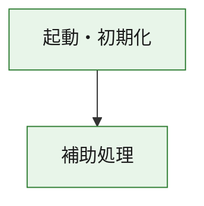
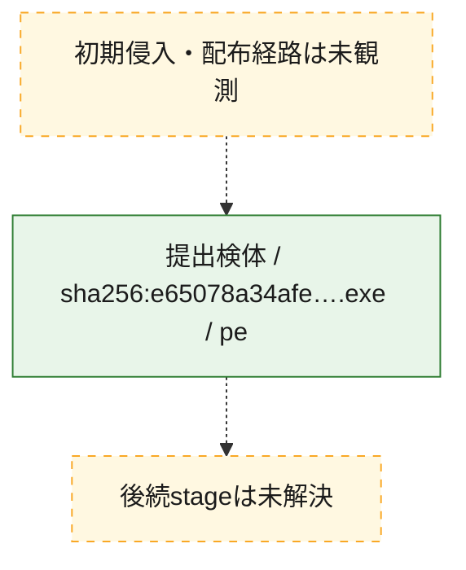
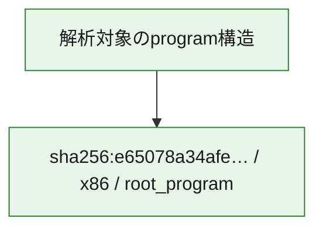

# 全体ロジック：e65078a34afe54022d20c9b00ee0002230db527ca63c0c124b0e9983655e5b1a

代表関数の静的証跡から、起動・初期化の処理群を確認しました。

## 読み方

- phaseの掲載順は解析上の整理順です。observed_call_edgesがない段階間の実行順を断定しません。
- 図の実線は静的に観測した関係、点線と黄色のノードは未観測・未解決の関係を示します。
- 図は静的な要約であり、動的実行を再現するものではありません。
- 詳細な関数解説とfingerprintは[STATIC-LOGIC.md](STATIC-LOGIC.md)を参照してください。

## 静的可視化

### 実行フロー

### 感染チェーン

### モジュール関係

## 処理段階

### 1. 起動・初期化

entry pointから初期化と後続処理への移行を確認します。
確度: `confirmed_static_function_evidence`

- `e65078a34afe54022d20c9b00ee0002230db527ca63c0c124b0e9983655e5b1a:ghidra:180001010` — 初期化と主要処理への分岐を行う入口関数です。 状態: `succeeded`、選定理由: `entry_point`, `meaningful_symbol_name`, `reviewed_call_centrality:22`, `role:entrypoint`, `small_program_complete_context`

### 2. 補助処理

主要処理を支える一般内部関数またはlibrary処理を確認します。
確度: `confirmed_static_function_evidence`

- `e65078a34afe54022d20c9b00ee0002230db527ca63c0c124b0e9983655e5b1a:ghidra:180001240` — 検体内部の一般処理を実装する関数です。 状態: `succeeded`、選定理由: `context_representative`, `reviewed_call_centrality:2`, `small_program_complete_context`
- `e65078a34afe54022d20c9b00ee0002230db527ca63c0c124b0e9983655e5b1a:ghidra:180001350` — 検体内部の一般処理を実装する関数です。 状態: `succeeded`、選定理由: `context_representative`, `reviewed_call_centrality:25`, `small_program_complete_context`
- `e65078a34afe54022d20c9b00ee0002230db527ca63c0c124b0e9983655e5b1a:ghidra:180003780` — 検体内部の一般処理を実装する関数です。 状態: `succeeded`、選定理由: `context_representative`, `reviewed_call_centrality:2`, `small_program_complete_context`
- `e65078a34afe54022d20c9b00ee0002230db527ca63c0c124b0e9983655e5b1a:ghidra:1800038e0` — 検体内部の一般処理を実装する関数です。 状態: `succeeded`、選定理由: `context_representative`, `reviewed_call_centrality:2`, `small_program_complete_context`

## 観測したcall関係

- `e65078a34afe54022d20c9b00ee0002230db527ca63c0c124b0e9983655e5b1a:ghidra:180001010` → `e65078a34afe54022d20c9b00ee0002230db527ca63c0c124b0e9983655e5b1a:ghidra:180001240` （`startup` → `support`）
- `e65078a34afe54022d20c9b00ee0002230db527ca63c0c124b0e9983655e5b1a:ghidra:180001010` → `e65078a34afe54022d20c9b00ee0002230db527ca63c0c124b0e9983655e5b1a:ghidra:180001350` （`startup` → `support`）
- `e65078a34afe54022d20c9b00ee0002230db527ca63c0c124b0e9983655e5b1a:ghidra:180001350` → `e65078a34afe54022d20c9b00ee0002230db527ca63c0c124b0e9983655e5b1a:ghidra:180001240` （`support` → `support`）
- `e65078a34afe54022d20c9b00ee0002230db527ca63c0c124b0e9983655e5b1a:ghidra:180001350` → `e65078a34afe54022d20c9b00ee0002230db527ca63c0c124b0e9983655e5b1a:ghidra:180003780` （`support` → `support`）
- `e65078a34afe54022d20c9b00ee0002230db527ca63c0c124b0e9983655e5b1a:ghidra:180001350` → `e65078a34afe54022d20c9b00ee0002230db527ca63c0c124b0e9983655e5b1a:ghidra:1800038e0` （`support` → `support`）
- `e65078a34afe54022d20c9b00ee0002230db527ca63c0c124b0e9983655e5b1a:ghidra:180003780` → `e65078a34afe54022d20c9b00ee0002230db527ca63c0c124b0e9983655e5b1a:ghidra:1800038e0` （`support` → `support`）
- `ghidra-function:47017e0e3eaad6e4eca5d4b0` → `ghidra-function:352b07ba3a809ba4fb1cacae` （`unclassified` → `unclassified`）
- `ghidra-function:c58a05e729d443ae6827460f` → `ghidra-function:33f3a86482f764c38065edb8` （`unclassified` → `unclassified`）
- `ghidra-function:c58a05e729d443ae6827460f` → `ghidra-function:774bed6ab755bbd38e32c4d8` （`unclassified` → `unclassified`）
- `ghidra-function:c58a05e729d443ae6827460f` → `ghidra-function:a9a0dc319cca7d4d89b5af5b` （`unclassified` → `unclassified`）
- `ghidra-function:c58a05e729d443ae6827460f` → `ghidra-function:adce967789b9aae593438e45` （`unclassified` → `unclassified`）
- `ghidra-function:c58a05e729d443ae6827460f` → `ghidra-function:b7a3086c6ab58fc52e730612` （`unclassified` → `unclassified`）
- `ghidra-function:c58a05e729d443ae6827460f` → `ghidra-function:b8ed0445d58f5d2a40f06199` （`unclassified` → `unclassified`）
- `ghidra-function:c58a05e729d443ae6827460f` → `ghidra-function:b9e3fe7c75ac7057f0f26ff0` （`unclassified` → `unclassified`）
- `ghidra-function:c58a05e729d443ae6827460f` → `ghidra-function:d0c3e2145bff5f19703f0065` （`unclassified` → `unclassified`）
- `ghidra-function:c58a05e729d443ae6827460f` → `ghidra-function:d8e62900dacb2e1b4033c09b` （`unclassified` → `unclassified`）
- `ghidra-function:c58a05e729d443ae6827460f` → `ghidra-function:dac9d39ed356ff3e0940287e` （`unclassified` → `unclassified`）
- `ghidra-function:c58a05e729d443ae6827460f` → `ghidra-function:db1e4946ce8eccd05ff4a1b2` （`unclassified` → `unclassified`）
- `ghidra-function:c58a05e729d443ae6827460f` → `ghidra-function:dc0472aef358493ad049ab13` （`unclassified` → `unclassified`）
- `ghidra-function:d8e62900dacb2e1b4033c09b` → `ghidra-external:07ef298a8b02bd4ab6a864e4` （`unclassified` → `unclassified`）
- `ghidra-function:d8e62900dacb2e1b4033c09b` → `ghidra-external:08d256b8e321bf4bbb45773b` （`unclassified` → `unclassified`）
- `ghidra-function:d8e62900dacb2e1b4033c09b` → `ghidra-external:0d1a75d3157a6a21220199f2` （`unclassified` → `unclassified`）
- `ghidra-function:d8e62900dacb2e1b4033c09b` → `ghidra-external:16aefc2a16ef87a749d551b4` （`unclassified` → `unclassified`）
- `ghidra-function:d8e62900dacb2e1b4033c09b` → `ghidra-external:2198113747e574b9e089a584` （`unclassified` → `unclassified`）
- `ghidra-function:d8e62900dacb2e1b4033c09b` → `ghidra-external:29f6a590678cf0514fc8f6fa` （`unclassified` → `unclassified`）
- `ghidra-function:d8e62900dacb2e1b4033c09b` → `ghidra-external:3f0ae24131f6923333407266` （`unclassified` → `unclassified`）
- `ghidra-function:d8e62900dacb2e1b4033c09b` → `ghidra-external:496ab9051b99825e84ecd8a6` （`unclassified` → `unclassified`）
- `ghidra-function:d8e62900dacb2e1b4033c09b` → `ghidra-external:63e6978de4830a2377f79003` （`unclassified` → `unclassified`）
- `ghidra-function:d8e62900dacb2e1b4033c09b` → `ghidra-external:7e56a896585102dbb9a3dacc` （`unclassified` → `unclassified`）
- `ghidra-function:d8e62900dacb2e1b4033c09b` → `ghidra-external:895ec88c2eee0753a487bccf` （`unclassified` → `unclassified`）
- `ghidra-function:d8e62900dacb2e1b4033c09b` → `ghidra-external:8e01e21bf7bcbd10d592f546` （`unclassified` → `unclassified`）
- `ghidra-function:d8e62900dacb2e1b4033c09b` → `ghidra-external:957c1b8c6f03e216a487b917` （`unclassified` → `unclassified`）
- `ghidra-function:d8e62900dacb2e1b4033c09b` → `ghidra-external:9b243ef706f1ad48c8d32cd8` （`unclassified` → `unclassified`）
- `ghidra-function:d8e62900dacb2e1b4033c09b` → `ghidra-external:c0bc3a22eff02e8c7d6ccd9c` （`unclassified` → `unclassified`）
- `ghidra-function:d8e62900dacb2e1b4033c09b` → `ghidra-external:c15787f30ecd65f960c6aa6c` （`unclassified` → `unclassified`）
- `ghidra-function:d8e62900dacb2e1b4033c09b` → `ghidra-external:d564f4fd6eee90ef51778b06` （`unclassified` → `unclassified`）
- `ghidra-function:d8e62900dacb2e1b4033c09b` → `ghidra-external:dad88acaf4b68eaf4fd75ae2` （`unclassified` → `unclassified`）
- `ghidra-function:d8e62900dacb2e1b4033c09b` → `ghidra-external:f3757e31e56bce31d5c73281` （`unclassified` → `unclassified`）
- `ghidra-function:d8e62900dacb2e1b4033c09b` → `ghidra-external:f3befe7367b33b0cf0b5f8a5` （`unclassified` → `unclassified`）
- `ghidra-function:d8e62900dacb2e1b4033c09b` → `ghidra-external:f8c8210ec96758c079944a5b` （`unclassified` → `unclassified`）
- `ghidra-function:d8e62900dacb2e1b4033c09b` → `ghidra-function:352b07ba3a809ba4fb1cacae` （`unclassified` → `unclassified`）
- `ghidra-function:d8e62900dacb2e1b4033c09b` → `ghidra-function:47017e0e3eaad6e4eca5d4b0` （`unclassified` → `unclassified`）
- `ghidra-function:d8e62900dacb2e1b4033c09b` → `ghidra-function:a9a0dc319cca7d4d89b5af5b` （`unclassified` → `unclassified`）

## 解析範囲と制約

- 選定外関数は全体inventoryへ残しますが、関数本体の個別解説対象にはしていません。
- indirect call、難読化、packer、VM、壊れたcontrol flowによりcall関係が欠落する場合があります。
- 文書は静的解析に基づき、検体実行や外部通信による動的確認は行っていません。
