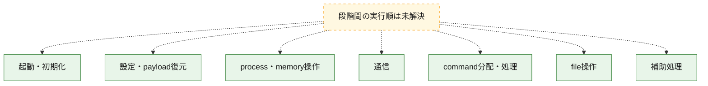
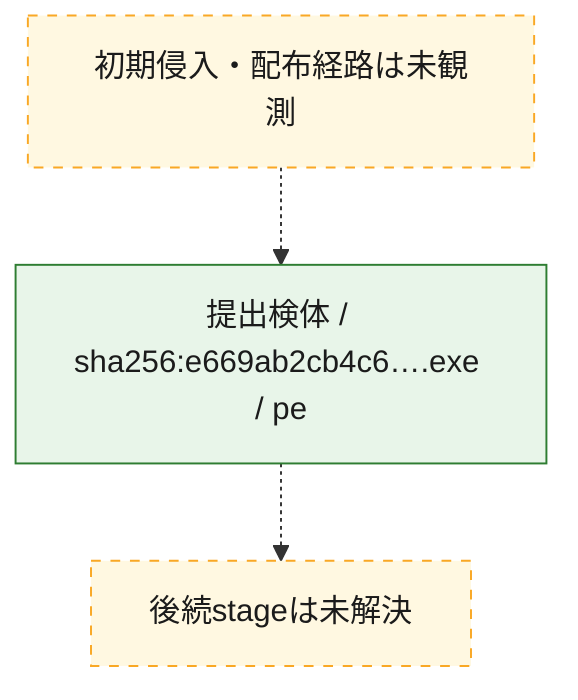
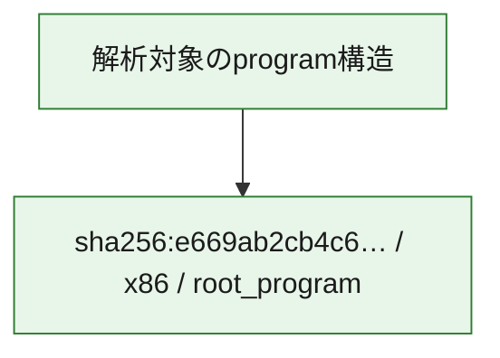

# 全体ロジック：e669ab2cb4c606f757095a36e287cd201b19204fdc9403915a0de673464e5d8a

代表関数の静的証跡から、起動・初期化、設定・payload復元、process・memory操作、通信、command分配・処理、file操作の処理群を確認しました。

## 読み方

- phaseの掲載順は解析上の整理順です。observed_call_edgesがない段階間の実行順を断定しません。
- 図の実線は静的に観測した関係、点線と黄色のノードは未観測・未解決の関係を示します。
- 図は静的な要約であり、動的実行を再現するものではありません。
- 詳細な関数解説とfingerprintは[STATIC-LOGIC.md](STATIC-LOGIC.md)を参照してください。

## 静的可視化

### 実行フロー

### 感染チェーン

### モジュール関係

## 処理段階

### 1. 起動・初期化

entry pointから初期化と後続処理への移行を確認します。
確度: `confirmed_static_function_evidence`

- `e669ab2cb4c606f757095a36e287cd201b19204fdc9403915a0de673464e5d8a:ghidra:0048d160` — 初期化と主要処理への分岐を行う入口関数です。 状態: `succeeded`、選定理由: `entry_point`, `meaningful_symbol_name`, `probable_go_main_user_code`, `reviewed_call_centrality:3`, `role:entrypoint`
- `e669ab2cb4c606f757095a36e287cd201b19204fdc9403915a0de673464e5d8a:ghidra:0048d480` — 初期化と主要処理への分岐を行う入口関数です。 状態: `succeeded`、選定理由: `entry_point`, `meaningful_symbol_name`, `probable_go_main_user_code`, `reviewed_call_centrality:24`, `role:entrypoint`
- `e669ab2cb4c606f757095a36e287cd201b19204fdc9403915a0de673464e5d8a:ghidra:00492da0` — 初期化と主要処理への分岐を行う入口関数です。 状態: `succeeded`、選定理由: `entry_point`, `meaningful_symbol_name`, `probable_go_main_user_code`, `reviewed_call_centrality:20`, `role:entrypoint`
- `e669ab2cb4c606f757095a36e287cd201b19204fdc9403915a0de673464e5d8a:ghidra:00495120` — 初期化と主要処理への分岐を行う入口関数です。 状態: `succeeded`、選定理由: `entry_point`, `meaningful_symbol_name`, `probable_go_main_user_code`, `reviewed_call_centrality:20`, `role:entrypoint`
- `e669ab2cb4c606f757095a36e287cd201b19204fdc9403915a0de673464e5d8a:ghidra:004985e0` — 初期化と主要処理への分岐を行う入口関数です。 状態: `succeeded`、選定理由: `entry_point`, `meaningful_symbol_name`, `probable_go_main_user_code`, `reviewed_call_centrality:21`, `role:entrypoint`
- `e669ab2cb4c606f757095a36e287cd201b19204fdc9403915a0de673464e5d8a:ghidra:0049bb60` — 初期化と主要処理への分岐を行う入口関数です。 状態: `succeeded`、選定理由: `entry_point`, `meaningful_symbol_name`, `probable_go_main_user_code`, `reviewed_call_centrality:20`, `role:entrypoint`
- `e669ab2cb4c606f757095a36e287cd201b19204fdc9403915a0de673464e5d8a:ghidra:004a5da0` — 初期化と主要処理への分岐を行う入口関数です。 状態: `succeeded`、選定理由: `entry_point`, `meaningful_symbol_name`, `probable_go_main_user_code`, `reviewed_call_centrality:29`, `role:entrypoint`
- `e669ab2cb4c606f757095a36e287cd201b19204fdc9403915a0de673464e5d8a:ghidra:004aede0` — 初期化と主要処理への分岐を行う入口関数です。 状態: `succeeded`、選定理由: `entry_point`, `meaningful_symbol_name`, `probable_go_main_user_code`, `reviewed_call_centrality:26`, `role:entrypoint`
- `e669ab2cb4c606f757095a36e287cd201b19204fdc9403915a0de673464e5d8a:ghidra:004b7ca0` — 初期化と主要処理への分岐を行う入口関数です。 状態: `succeeded`、選定理由: `entry_point`, `meaningful_symbol_name`, `probable_go_main_user_code`, `reviewed_call_centrality:20`, `role:entrypoint`
- `e669ab2cb4c606f757095a36e287cd201b19204fdc9403915a0de673464e5d8a:ghidra:004ba000` — 初期化と主要処理への分岐を行う入口関数です。 状態: `succeeded`、選定理由: `entry_point`, `meaningful_symbol_name`, `probable_go_main_user_code`, `reviewed_call_centrality:24`, `role:entrypoint`
- `e669ab2cb4c606f757095a36e287cd201b19204fdc9403915a0de673464e5d8a:ghidra:004c2cc0` — 初期化と主要処理への分岐を行う入口関数です。 状態: `succeeded`、選定理由: `entry_point`, `meaningful_symbol_name`, `probable_go_main_user_code`, `reviewed_call_centrality:28`, `role:entrypoint`
- `e669ab2cb4c606f757095a36e287cd201b19204fdc9403915a0de673464e5d8a:ghidra:004caac0` — 初期化と主要処理への分岐を行う入口関数です。 状態: `succeeded`、選定理由: `entry_point`, `meaningful_symbol_name`, `probable_go_main_user_code`, `reviewed_call_centrality:23`, `role:entrypoint`
- `e669ab2cb4c606f757095a36e287cd201b19204fdc9403915a0de673464e5d8a:ghidra:004cce20` — 初期化と主要処理への分岐を行う入口関数です。 状態: `succeeded`、選定理由: `entry_point`, `meaningful_symbol_name`, `probable_go_main_user_code`, `reviewed_call_centrality:22`, `role:entrypoint`
- `e669ab2cb4c606f757095a36e287cd201b19204fdc9403915a0de673464e5d8a:ghidra:004d2520` — 初期化と主要処理への分岐を行う入口関数です。 状態: `succeeded`、選定理由: `entry_point`, `meaningful_symbol_name`, `probable_go_main_user_code`, `reviewed_call_centrality:21`, `role:entrypoint`
- `e669ab2cb4c606f757095a36e287cd201b19204fdc9403915a0de673464e5d8a:ghidra:004d5960` — 初期化と主要処理への分岐を行う入口関数です。 状態: `succeeded`、選定理由: `entry_point`, `meaningful_symbol_name`, `probable_go_main_user_code`, `reviewed_call_centrality:21`, `role:entrypoint`
- `e669ab2cb4c606f757095a36e287cd201b19204fdc9403915a0de673464e5d8a:ghidra:004da040` — 初期化と主要処理への分岐を行う入口関数です。 状態: `succeeded`、選定理由: `entry_point`, `meaningful_symbol_name`, `probable_go_main_user_code`, `reviewed_call_centrality:26`, `role:entrypoint`
- `e669ab2cb4c606f757095a36e287cd201b19204fdc9403915a0de673464e5d8a:ghidra:004e3060` — 初期化と主要処理への分岐を行う入口関数です。 状態: `succeeded`、選定理由: `entry_point`, `meaningful_symbol_name`, `probable_go_main_user_code`, `reviewed_call_centrality:42`, `role:entrypoint`
- `e669ab2cb4c606f757095a36e287cd201b19204fdc9403915a0de673464e5d8a:ghidra:004ea5a0` — 初期化と主要処理への分岐を行う入口関数です。 状態: `succeeded`、選定理由: `entry_point`, `meaningful_symbol_name`, `probable_go_main_user_code`, `reviewed_call_centrality:24`, `role:entrypoint`
- `e669ab2cb4c606f757095a36e287cd201b19204fdc9403915a0de673464e5d8a:ghidra:004efec0` — 初期化と主要処理への分岐を行う入口関数です。 状態: `succeeded`、選定理由: `entry_point`, `meaningful_symbol_name`, `probable_go_main_user_code`, `reviewed_call_centrality:24`, `role:entrypoint`
- `e669ab2cb4c606f757095a36e287cd201b19204fdc9403915a0de673464e5d8a:ghidra:004f4380` — 初期化と主要処理への分岐を行う入口関数です。 状態: `succeeded`、選定理由: `entry_point`, `meaningful_symbol_name`, `probable_go_main_user_code`, `reviewed_call_centrality:44`, `role:entrypoint`
- `e669ab2cb4c606f757095a36e287cd201b19204fdc9403915a0de673464e5d8a:ghidra:0051cac0` — 初期化と主要処理への分岐を行う入口関数です。 状態: `succeeded`、選定理由: `entry_point`, `meaningful_symbol_name`, `probable_go_main_user_code`, `reviewed_call_centrality:21`, `role:entrypoint`
- `e669ab2cb4c606f757095a36e287cd201b19204fdc9403915a0de673464e5d8a:ghidra:00523380` — 初期化と主要処理への分岐を行う入口関数です。 状態: `succeeded`、選定理由: `entry_point`, `meaningful_symbol_name`, `probable_go_main_user_code`, `reviewed_call_centrality:23`, `role:entrypoint`
- `e669ab2cb4c606f757095a36e287cd201b19204fdc9403915a0de673464e5d8a:ghidra:005267e0` — 初期化と主要処理への分岐を行う入口関数です。 状態: `succeeded`、選定理由: `entry_point`, `meaningful_symbol_name`, `probable_go_main_user_code`, `reviewed_call_centrality:23`, `role:entrypoint`
- `e669ab2cb4c606f757095a36e287cd201b19204fdc9403915a0de673464e5d8a:ghidra:0052d200` — 初期化と主要処理への分岐を行う入口関数です。 状態: `succeeded`、選定理由: `entry_point`, `meaningful_symbol_name`, `probable_go_main_user_code`, `reviewed_call_centrality:20`, `role:entrypoint`
- `e669ab2cb4c606f757095a36e287cd201b19204fdc9403915a0de673464e5d8a:ghidra:00532880` — 初期化と主要処理への分岐を行う入口関数です。 状態: `succeeded`、選定理由: `entry_point`, `meaningful_symbol_name`, `probable_go_main_user_code`, `reviewed_call_centrality:20`, `role:entrypoint`

### 2. 設定・payload復元

設定、resource、payload、暗号化データの復元・変換を確認します。
確度: `confirmed_static_function_evidence`

- `e669ab2cb4c606f757095a36e287cd201b19204fdc9403915a0de673464e5d8a:ghidra:0046aec0` — 設定、resource、payloadなどの解析・変換を行う関数です。 状態: `succeeded`、選定理由: `meaningful_symbol_name`, `reviewed_call_centrality:4`, `role:config_or_data_transform`

### 3. process・memory操作

process、thread、module、memory操作と実行移行を確認します。
確度: `confirmed_static_function_evidence`

- `e669ab2cb4c606f757095a36e287cd201b19204fdc9403915a0de673464e5d8a:ghidra:00467880` — process、thread、module、またはmemory操作に関係する関数です。 状態: `succeeded`、選定理由: `meaningful_symbol_name`, `reviewed_call_centrality:2`, `role:process_or_memory_operation`

### 4. 通信

通信初期化、endpoint処理、送受信の役割を確認します。
確度: `confirmed_static_function_evidence`

- `e669ab2cb4c606f757095a36e287cd201b19204fdc9403915a0de673464e5d8a:ghidra:0047e440` — 通信初期化、送受信、またはendpoint処理に関係する関数です。 状態: `succeeded`、選定理由: `meaningful_symbol_name`, `reviewed_call_centrality:6`, `role:network_communication`

### 5. command分配・処理

受信commandやtaskの解釈、分配、個別handlerへの移行を確認します。
確度: `confirmed_static_function_evidence`

- `e669ab2cb4c606f757095a36e287cd201b19204fdc9403915a0de673464e5d8a:ghidra:0047d600` — commandの解釈、分配、または個別処理を担当する関数です。 状態: `succeeded`、選定理由: `meaningful_symbol_name`, `reviewed_call_centrality:5`, `role:command_dispatch_or_handler`

### 6. file操作

fileやdirectoryの作成、読書き、削除を確認します。
確度: `confirmed_static_function_evidence`

- `e669ab2cb4c606f757095a36e287cd201b19204fdc9403915a0de673464e5d8a:ghidra:0047de60` — fileまたはdirectoryの読書き・管理に関係する関数です。 状態: `succeeded`、選定理由: `meaningful_symbol_name`, `reviewed_call_centrality:6`, `role:file_operation`

### 7. 補助処理

主要処理を支える一般内部関数またはlibrary処理を確認します。
確度: `confirmed_static_function_evidence`

- `e669ab2cb4c606f757095a36e287cd201b19204fdc9403915a0de673464e5d8a:ghidra:00401080` — compiler生成処理または汎用library処理とみられる関数です。 状態: `succeeded`、選定理由: `meaningful_symbol_name`, `reviewed_call_centrality:4`
- `e669ab2cb4c606f757095a36e287cd201b19204fdc9403915a0de673464e5d8a:ghidra:0045d880` — 検体内部の一般処理を実装する関数です。 状態: `succeeded`、選定理由: `meaningful_symbol_name`, `reviewed_call_centrality:4`

## 観測したcall関係

- `ghidra-function:03790aae718f1f06f977a3db` → `ghidra-external:031d1f7d94a3b7a455789966` （`unclassified` → `unclassified`）
- `ghidra-function:03790aae718f1f06f977a3db` → `ghidra-external:4d7c705e379e3ee466e63901` （`unclassified` → `unclassified`）
- `ghidra-function:03790aae718f1f06f977a3db` → `ghidra-external:a710bceb165485366ed2cd9c` （`unclassified` → `unclassified`）
- `ghidra-function:03790aae718f1f06f977a3db` → `ghidra-external:b87262bf79ca5998d74002e1` （`unclassified` → `unclassified`）
- `ghidra-function:03790aae718f1f06f977a3db` → `ghidra-external:c327da7082ded13d1cf8860a` （`unclassified` → `unclassified`）
- `ghidra-function:05466630a5887b7688637d99` → `ghidra-external:1658243f10a0e6476cefaeb8` （`unclassified` → `unclassified`）
- `ghidra-function:05466630a5887b7688637d99` → `ghidra-external:9771d8b2c96efa15b0c196fd` （`unclassified` → `unclassified`）
- `ghidra-function:05466630a5887b7688637d99` → `ghidra-external:a90450eca3a92b2f22e6dc82` （`unclassified` → `unclassified`）
- `ghidra-function:05466630a5887b7688637d99` → `ghidra-external:c002319b69e0828c78343117` （`unclassified` → `unclassified`）
- `ghidra-function:11dea5031124c8501a281180` → `ghidra-external:125e9056508441f2fd07f3b3` （`unclassified` → `unclassified`）
- `ghidra-function:11dea5031124c8501a281180` → `ghidra-external:2cfaf274abf10337d43c40f8` （`unclassified` → `unclassified`）
- `ghidra-function:11dea5031124c8501a281180` → `ghidra-external:2e0c86ef0b3326253d0a64b0` （`unclassified` → `unclassified`）
- `ghidra-function:11dea5031124c8501a281180` → `ghidra-external:2e8eb94d05a68e69703e1290` （`unclassified` → `unclassified`）
- `ghidra-function:11dea5031124c8501a281180` → `ghidra-external:34016ad75c5d945c19fa7764` （`unclassified` → `unclassified`）
- `ghidra-function:11dea5031124c8501a281180` → `ghidra-external:4d7c705e379e3ee466e63901` （`unclassified` → `unclassified`）
- `ghidra-function:11dea5031124c8501a281180` → `ghidra-external:51a3cd1440959f6bb79f473a` （`unclassified` → `unclassified`）
- `ghidra-function:11dea5031124c8501a281180` → `ghidra-external:544734f2ef5e72496455858b` （`unclassified` → `unclassified`）
- `ghidra-function:11dea5031124c8501a281180` → `ghidra-external:55e4d9af0dd7f5fd37bb1974` （`unclassified` → `unclassified`）
- `ghidra-function:11dea5031124c8501a281180` → `ghidra-external:6ae293a1a7ac0786d78f988c` （`unclassified` → `unclassified`）
- `ghidra-function:11dea5031124c8501a281180` → `ghidra-external:7047fc5d35222369334e743d` （`unclassified` → `unclassified`）
- `ghidra-function:11dea5031124c8501a281180` → `ghidra-external:7cc55051cb2892fbf90eea33` （`unclassified` → `unclassified`）
- `ghidra-function:11dea5031124c8501a281180` → `ghidra-external:8911f80a2df5299bab2c364a` （`unclassified` → `unclassified`）
- `ghidra-function:11dea5031124c8501a281180` → `ghidra-external:95948956986126071f5a7d4f` （`unclassified` → `unclassified`）
- `ghidra-function:11dea5031124c8501a281180` → `ghidra-external:9771d8b2c96efa15b0c196fd` （`unclassified` → `unclassified`）
- `ghidra-function:11dea5031124c8501a281180` → `ghidra-external:9e462e336092d7e49bee680e` （`unclassified` → `unclassified`）
- `ghidra-function:11dea5031124c8501a281180` → `ghidra-external:b4932075de84b22971346d37` （`unclassified` → `unclassified`）
- `ghidra-function:11dea5031124c8501a281180` → `ghidra-external:b77d17640b6d623625668287` （`unclassified` → `unclassified`）
- `ghidra-function:11dea5031124c8501a281180` → `ghidra-external:c9d0cf1254552b426ad85f44` （`unclassified` → `unclassified`）
- `ghidra-function:11dea5031124c8501a281180` → `ghidra-external:cc96615f2f0be948206ec365` （`unclassified` → `unclassified`）
- `ghidra-function:11dea5031124c8501a281180` → `ghidra-external:d9747391162d69c07d49ca2f` （`unclassified` → `unclassified`）
- `ghidra-function:11dea5031124c8501a281180` → `ghidra-external:e58990a9405fa5c3b9a0edcb` （`unclassified` → `unclassified`）
- `ghidra-function:11dea5031124c8501a281180` → `ghidra-external:e6e70e3852f351a4524a5ef8` （`unclassified` → `unclassified`）
- `ghidra-function:1bfa623eca86f390b5e3048a` → `ghidra-external:125e9056508441f2fd07f3b3` （`unclassified` → `unclassified`）
- `ghidra-function:1bfa623eca86f390b5e3048a` → `ghidra-external:2cfaf274abf10337d43c40f8` （`unclassified` → `unclassified`）
- `ghidra-function:1bfa623eca86f390b5e3048a` → `ghidra-external:34016ad75c5d945c19fa7764` （`unclassified` → `unclassified`）
- `ghidra-function:1bfa623eca86f390b5e3048a` → `ghidra-external:4d7c705e379e3ee466e63901` （`unclassified` → `unclassified`）
- `ghidra-function:1bfa623eca86f390b5e3048a` → `ghidra-external:51a3cd1440959f6bb79f473a` （`unclassified` → `unclassified`）
- `ghidra-function:1bfa623eca86f390b5e3048a` → `ghidra-external:544734f2ef5e72496455858b` （`unclassified` → `unclassified`）
- `ghidra-function:1bfa623eca86f390b5e3048a` → `ghidra-external:55e4d9af0dd7f5fd37bb1974` （`unclassified` → `unclassified`）
- `ghidra-function:1bfa623eca86f390b5e3048a` → `ghidra-external:7047fc5d35222369334e743d` （`unclassified` → `unclassified`）
- `ghidra-function:1bfa623eca86f390b5e3048a` → `ghidra-external:7cc55051cb2892fbf90eea33` （`unclassified` → `unclassified`）
- `ghidra-function:1bfa623eca86f390b5e3048a` → `ghidra-external:8911f80a2df5299bab2c364a` （`unclassified` → `unclassified`）
- `ghidra-function:1bfa623eca86f390b5e3048a` → `ghidra-external:95948956986126071f5a7d4f` （`unclassified` → `unclassified`）
- `ghidra-function:1bfa623eca86f390b5e3048a` → `ghidra-external:9771d8b2c96efa15b0c196fd` （`unclassified` → `unclassified`）
- `ghidra-function:1bfa623eca86f390b5e3048a` → `ghidra-external:9e462e336092d7e49bee680e` （`unclassified` → `unclassified`）
- `ghidra-function:1bfa623eca86f390b5e3048a` → `ghidra-external:b19a4752c07adae6cfa8d99f` （`unclassified` → `unclassified`）
- `ghidra-function:1bfa623eca86f390b5e3048a` → `ghidra-external:b4932075de84b22971346d37` （`unclassified` → `unclassified`）
- `ghidra-function:1bfa623eca86f390b5e3048a` → `ghidra-external:c002319b69e0828c78343117` （`unclassified` → `unclassified`）
- `ghidra-function:1bfa623eca86f390b5e3048a` → `ghidra-external:c9d0cf1254552b426ad85f44` （`unclassified` → `unclassified`）
- `ghidra-function:1bfa623eca86f390b5e3048a` → `ghidra-external:cc96615f2f0be948206ec365` （`unclassified` → `unclassified`）
- `ghidra-function:1bfa623eca86f390b5e3048a` → `ghidra-external:d9747391162d69c07d49ca2f` （`unclassified` → `unclassified`）
- `ghidra-function:1bfa623eca86f390b5e3048a` → `ghidra-external:e58990a9405fa5c3b9a0edcb` （`unclassified` → `unclassified`）
- `ghidra-function:1bfa623eca86f390b5e3048a` → `ghidra-external:e6e70e3852f351a4524a5ef8` （`unclassified` → `unclassified`）
- `ghidra-function:1d114105eb6f44a0bb2534ba` → `ghidra-external:06bcc949304f9808515b9bac` （`unclassified` → `unclassified`）
- `ghidra-function:1d114105eb6f44a0bb2534ba` → `ghidra-external:0c15c02afcbcc956bd8b9c67` （`unclassified` → `unclassified`）
- `ghidra-function:20419dc944cec78707b1bc0f` → `ghidra-external:1534fd611b1688139f789d9e` （`unclassified` → `unclassified`）
- `ghidra-function:20419dc944cec78707b1bc0f` → `ghidra-external:69707a428b54795e841727aa` （`unclassified` → `unclassified`）
- `ghidra-function:20419dc944cec78707b1bc0f` → `ghidra-external:9873f17eabb0d1cca566f507` （`unclassified` → `unclassified`）
- `ghidra-function:20419dc944cec78707b1bc0f` → `ghidra-external:ba0a7db10d04acb53a1ea939` （`unclassified` → `unclassified`）
- `ghidra-function:2bdda69eaef4990bce312906` → `ghidra-external:031d1f7d94a3b7a455789966` （`unclassified` → `unclassified`）
- `ghidra-function:2bdda69eaef4990bce312906` → `ghidra-external:4d7c705e379e3ee466e63901` （`unclassified` → `unclassified`）
- `ghidra-function:2bdda69eaef4990bce312906` → `ghidra-external:4f1d71a8422c0af72298e5a1` （`unclassified` → `unclassified`）
- `ghidra-function:2bdda69eaef4990bce312906` → `ghidra-external:6b88c3709c7718da5526ca04` （`unclassified` → `unclassified`）
- `ghidra-function:2bdda69eaef4990bce312906` → `ghidra-external:7883d8d8223cbc5adb670dc2` （`unclassified` → `unclassified`）
- `ghidra-function:2bdda69eaef4990bce312906` → `ghidra-external:a710bceb165485366ed2cd9c` （`unclassified` → `unclassified`）
- `ghidra-function:32358cebb61bcdedd8f2b5be` → `ghidra-external:06c3184ea7cc4e9496ae0a9e` （`unclassified` → `unclassified`）
- `ghidra-function:32358cebb61bcdedd8f2b5be` → `ghidra-external:09db5dbd1728110d5655ce5e` （`unclassified` → `unclassified`）
- `ghidra-function:32358cebb61bcdedd8f2b5be` → `ghidra-external:1140cac5592cc2403c5ce685` （`unclassified` → `unclassified`）
- `ghidra-function:32358cebb61bcdedd8f2b5be` → `ghidra-external:125e9056508441f2fd07f3b3` （`unclassified` → `unclassified`）
- `ghidra-function:32358cebb61bcdedd8f2b5be` → `ghidra-external:15ac236d6c9ae8e95a441e86` （`unclassified` → `unclassified`）
- `ghidra-function:32358cebb61bcdedd8f2b5be` → `ghidra-external:16c60a798bfc0db6083cad71` （`unclassified` → `unclassified`）
- `ghidra-function:32358cebb61bcdedd8f2b5be` → `ghidra-external:1d3838e09871cb6efef6ce17` （`unclassified` → `unclassified`）
- `ghidra-function:32358cebb61bcdedd8f2b5be` → `ghidra-external:2cfaf274abf10337d43c40f8` （`unclassified` → `unclassified`）
- `ghidra-function:32358cebb61bcdedd8f2b5be` → `ghidra-external:2e36d46b9f6e1d2a72d20c47` （`unclassified` → `unclassified`）
- `ghidra-function:32358cebb61bcdedd8f2b5be` → `ghidra-external:34016ad75c5d945c19fa7764` （`unclassified` → `unclassified`）
- `ghidra-function:32358cebb61bcdedd8f2b5be` → `ghidra-external:4b1ffbfc56a4969fb661015a` （`unclassified` → `unclassified`）
- `ghidra-function:32358cebb61bcdedd8f2b5be` → `ghidra-external:4d7c705e379e3ee466e63901` （`unclassified` → `unclassified`）
- `ghidra-function:32358cebb61bcdedd8f2b5be` → `ghidra-external:51189685c48c02c27daf2435` （`unclassified` → `unclassified`）
- `ghidra-function:32358cebb61bcdedd8f2b5be` → `ghidra-external:51a3cd1440959f6bb79f473a` （`unclassified` → `unclassified`）
- `ghidra-function:32358cebb61bcdedd8f2b5be` → `ghidra-external:51f36159c0334723e658cd77` （`unclassified` → `unclassified`）
- `ghidra-function:32358cebb61bcdedd8f2b5be` → `ghidra-external:52945194d569c25cf7a45bb7` （`unclassified` → `unclassified`）
- `ghidra-function:32358cebb61bcdedd8f2b5be` → `ghidra-external:544734f2ef5e72496455858b` （`unclassified` → `unclassified`）
- `ghidra-function:32358cebb61bcdedd8f2b5be` → `ghidra-external:55e4d9af0dd7f5fd37bb1974` （`unclassified` → `unclassified`）
- `ghidra-function:32358cebb61bcdedd8f2b5be` → `ghidra-external:5c205e3567fd1bbc144cfd33` （`unclassified` → `unclassified`）
- `ghidra-function:32358cebb61bcdedd8f2b5be` → `ghidra-external:5f23178cdfca50bf4b8332e0` （`unclassified` → `unclassified`）
- `ghidra-function:32358cebb61bcdedd8f2b5be` → `ghidra-external:7047fc5d35222369334e743d` （`unclassified` → `unclassified`）
- `ghidra-function:32358cebb61bcdedd8f2b5be` → `ghidra-external:7cc55051cb2892fbf90eea33` （`unclassified` → `unclassified`）
- `ghidra-function:32358cebb61bcdedd8f2b5be` → `ghidra-external:8911f80a2df5299bab2c364a` （`unclassified` → `unclassified`）
- `ghidra-function:32358cebb61bcdedd8f2b5be` → `ghidra-external:8fcc65361418be0ae39eae1b` （`unclassified` → `unclassified`）
- `ghidra-function:32358cebb61bcdedd8f2b5be` → `ghidra-external:95948956986126071f5a7d4f` （`unclassified` → `unclassified`）
- `ghidra-function:32358cebb61bcdedd8f2b5be` → `ghidra-external:9771d8b2c96efa15b0c196fd` （`unclassified` → `unclassified`）
- `ghidra-function:32358cebb61bcdedd8f2b5be` → `ghidra-external:9e462e336092d7e49bee680e` （`unclassified` → `unclassified`）
- `ghidra-function:32358cebb61bcdedd8f2b5be` → `ghidra-external:a88bdd207d24fd2c49ac53bb` （`unclassified` → `unclassified`）
- `ghidra-function:32358cebb61bcdedd8f2b5be` → `ghidra-external:b4932075de84b22971346d37` （`unclassified` → `unclassified`）
- `ghidra-function:32358cebb61bcdedd8f2b5be` → `ghidra-external:b508aad0e6e4343178cf9b89` （`unclassified` → `unclassified`）
- `ghidra-function:32358cebb61bcdedd8f2b5be` → `ghidra-external:bc5d1b307226453458aa3c3d` （`unclassified` → `unclassified`）
- `ghidra-function:32358cebb61bcdedd8f2b5be` → `ghidra-external:c9d0cf1254552b426ad85f44` （`unclassified` → `unclassified`）
- `ghidra-function:32358cebb61bcdedd8f2b5be` → `ghidra-external:cc96615f2f0be948206ec365` （`unclassified` → `unclassified`）
- `ghidra-function:32358cebb61bcdedd8f2b5be` → `ghidra-external:ce49658fbf6adc69dc5c0ae6` （`unclassified` → `unclassified`）
- `ghidra-function:32358cebb61bcdedd8f2b5be` → `ghidra-external:d523406a7d3ff17252baa3b3` （`unclassified` → `unclassified`）
- `ghidra-function:32358cebb61bcdedd8f2b5be` → `ghidra-external:d5dd443ec75421224a13d5ee` （`unclassified` → `unclassified`）
- `ghidra-function:32358cebb61bcdedd8f2b5be` → `ghidra-external:d806015432292a9fd13b972d` （`unclassified` → `unclassified`）
- `ghidra-function:32358cebb61bcdedd8f2b5be` → `ghidra-external:d9747391162d69c07d49ca2f` （`unclassified` → `unclassified`）
- `ghidra-function:32358cebb61bcdedd8f2b5be` → `ghidra-external:db3c6fea5599791091f02534` （`unclassified` → `unclassified`）
- `ghidra-function:32358cebb61bcdedd8f2b5be` → `ghidra-external:e58990a9405fa5c3b9a0edcb` （`unclassified` → `unclassified`）
- `ghidra-function:32358cebb61bcdedd8f2b5be` → `ghidra-external:e62f0ea6e8f50042a19498df` （`unclassified` → `unclassified`）
- `ghidra-function:32358cebb61bcdedd8f2b5be` → `ghidra-external:e6e70e3852f351a4524a5ef8` （`unclassified` → `unclassified`）
- `ghidra-function:32358cebb61bcdedd8f2b5be` → `ghidra-external:e9a710efbe3e3b3947bd7357` （`unclassified` → `unclassified`）
- `ghidra-function:32358cebb61bcdedd8f2b5be` → `ghidra-external:ee4d3a0bf90723b362913dac` （`unclassified` → `unclassified`）
- `ghidra-function:42b271240a1fd48b9f1205ec` → `ghidra-external:125e9056508441f2fd07f3b3` （`unclassified` → `unclassified`）
- `ghidra-function:42b271240a1fd48b9f1205ec` → `ghidra-external:2cfaf274abf10337d43c40f8` （`unclassified` → `unclassified`）
- `ghidra-function:42b271240a1fd48b9f1205ec` → `ghidra-external:34016ad75c5d945c19fa7764` （`unclassified` → `unclassified`）
- `ghidra-function:42b271240a1fd48b9f1205ec` → `ghidra-external:4d7c705e379e3ee466e63901` （`unclassified` → `unclassified`）
- `ghidra-function:42b271240a1fd48b9f1205ec` → `ghidra-external:4f31e14b77a14d2a8060c8ab` （`unclassified` → `unclassified`）
- `ghidra-function:42b271240a1fd48b9f1205ec` → `ghidra-external:51a3cd1440959f6bb79f473a` （`unclassified` → `unclassified`）
- `ghidra-function:42b271240a1fd48b9f1205ec` → `ghidra-external:544734f2ef5e72496455858b` （`unclassified` → `unclassified`）
- `ghidra-function:42b271240a1fd48b9f1205ec` → `ghidra-external:55e4d9af0dd7f5fd37bb1974` （`unclassified` → `unclassified`）
- `ghidra-function:42b271240a1fd48b9f1205ec` → `ghidra-external:7047fc5d35222369334e743d` （`unclassified` → `unclassified`）
- `ghidra-function:42b271240a1fd48b9f1205ec` → `ghidra-external:7cc55051cb2892fbf90eea33` （`unclassified` → `unclassified`）
- `ghidra-function:42b271240a1fd48b9f1205ec` → `ghidra-external:8911f80a2df5299bab2c364a` （`unclassified` → `unclassified`）
- `ghidra-function:42b271240a1fd48b9f1205ec` → `ghidra-external:95948956986126071f5a7d4f` （`unclassified` → `unclassified`）
- `ghidra-function:42b271240a1fd48b9f1205ec` → `ghidra-external:9771d8b2c96efa15b0c196fd` （`unclassified` → `unclassified`）
- `ghidra-function:42b271240a1fd48b9f1205ec` → `ghidra-external:9e462e336092d7e49bee680e` （`unclassified` → `unclassified`）
- `ghidra-function:42b271240a1fd48b9f1205ec` → `ghidra-external:b4932075de84b22971346d37` （`unclassified` → `unclassified`）
- `ghidra-function:42b271240a1fd48b9f1205ec` → `ghidra-external:c9d0cf1254552b426ad85f44` （`unclassified` → `unclassified`）
- `ghidra-function:42b271240a1fd48b9f1205ec` → `ghidra-external:cc96615f2f0be948206ec365` （`unclassified` → `unclassified`）
- `ghidra-function:42b271240a1fd48b9f1205ec` → `ghidra-external:d9747391162d69c07d49ca2f` （`unclassified` → `unclassified`）
- `ghidra-function:42b271240a1fd48b9f1205ec` → `ghidra-external:e58990a9405fa5c3b9a0edcb` （`unclassified` → `unclassified`）
- `ghidra-function:42b271240a1fd48b9f1205ec` → `ghidra-external:e6e70e3852f351a4524a5ef8` （`unclassified` → `unclassified`）
- `ghidra-function:4ed457333782e2ae8f014f9b` → `ghidra-external:4d7c705e379e3ee466e63901` （`unclassified` → `unclassified`）
- `ghidra-function:4ed457333782e2ae8f014f9b` → `ghidra-external:8e68d7d73c0f8e2a5237d1c0` （`unclassified` → `unclassified`）
- `ghidra-function:4ed457333782e2ae8f014f9b` → `ghidra-external:dad92af33ddb0e2b598c01f9` （`unclassified` → `unclassified`）
- `ghidra-function:52600b97695c4b6ddb5e93e5` → `ghidra-external:125e9056508441f2fd07f3b3` （`unclassified` → `unclassified`）
- `ghidra-function:52600b97695c4b6ddb5e93e5` → `ghidra-external:22d95708b9f6c00a4d2fbbb9` （`unclassified` → `unclassified`）
- `ghidra-function:52600b97695c4b6ddb5e93e5` → `ghidra-external:2cfaf274abf10337d43c40f8` （`unclassified` → `unclassified`）
- `ghidra-function:52600b97695c4b6ddb5e93e5` → `ghidra-external:2e8eb94d05a68e69703e1290` （`unclassified` → `unclassified`）
- `ghidra-function:52600b97695c4b6ddb5e93e5` → `ghidra-external:34016ad75c5d945c19fa7764` （`unclassified` → `unclassified`）
- `ghidra-function:52600b97695c4b6ddb5e93e5` → `ghidra-external:4d7c705e379e3ee466e63901` （`unclassified` → `unclassified`）
- `ghidra-function:52600b97695c4b6ddb5e93e5` → `ghidra-external:51a3cd1440959f6bb79f473a` （`unclassified` → `unclassified`）
- `ghidra-function:52600b97695c4b6ddb5e93e5` → `ghidra-external:544734f2ef5e72496455858b` （`unclassified` → `unclassified`）
- `ghidra-function:52600b97695c4b6ddb5e93e5` → `ghidra-external:55e4d9af0dd7f5fd37bb1974` （`unclassified` → `unclassified`）
- `ghidra-function:52600b97695c4b6ddb5e93e5` → `ghidra-external:7047fc5d35222369334e743d` （`unclassified` → `unclassified`）
- `ghidra-function:52600b97695c4b6ddb5e93e5` → `ghidra-external:7cc55051cb2892fbf90eea33` （`unclassified` → `unclassified`）
- `ghidra-function:52600b97695c4b6ddb5e93e5` → `ghidra-external:7fe669dee2718d72ee3c8bb8` （`unclassified` → `unclassified`）
- `ghidra-function:52600b97695c4b6ddb5e93e5` → `ghidra-external:8911f80a2df5299bab2c364a` （`unclassified` → `unclassified`）
- `ghidra-function:52600b97695c4b6ddb5e93e5` → `ghidra-external:95948956986126071f5a7d4f` （`unclassified` → `unclassified`）
- `ghidra-function:52600b97695c4b6ddb5e93e5` → `ghidra-external:9771d8b2c96efa15b0c196fd` （`unclassified` → `unclassified`）
- `ghidra-function:52600b97695c4b6ddb5e93e5` → `ghidra-external:9e462e336092d7e49bee680e` （`unclassified` → `unclassified`）
- `ghidra-function:52600b97695c4b6ddb5e93e5` → `ghidra-external:b4932075de84b22971346d37` （`unclassified` → `unclassified`）
- `ghidra-function:52600b97695c4b6ddb5e93e5` → `ghidra-external:c9d0cf1254552b426ad85f44` （`unclassified` → `unclassified`）
- `ghidra-function:52600b97695c4b6ddb5e93e5` → `ghidra-external:cc96615f2f0be948206ec365` （`unclassified` → `unclassified`）
- `ghidra-function:52600b97695c4b6ddb5e93e5` → `ghidra-external:d9747391162d69c07d49ca2f` （`unclassified` → `unclassified`）
- `ghidra-function:52600b97695c4b6ddb5e93e5` → `ghidra-external:e58990a9405fa5c3b9a0edcb` （`unclassified` → `unclassified`）
- `ghidra-function:52600b97695c4b6ddb5e93e5` → `ghidra-external:e6e70e3852f351a4524a5ef8` （`unclassified` → `unclassified`）
- `ghidra-function:55241df24847fbe848248d09` → `ghidra-external:125e9056508441f2fd07f3b3` （`unclassified` → `unclassified`）
- `ghidra-function:55241df24847fbe848248d09` → `ghidra-external:2cfaf274abf10337d43c40f8` （`unclassified` → `unclassified`）
- `ghidra-function:55241df24847fbe848248d09` → `ghidra-external:34016ad75c5d945c19fa7764` （`unclassified` → `unclassified`）
- `ghidra-function:55241df24847fbe848248d09` → `ghidra-external:4d7c705e379e3ee466e63901` （`unclassified` → `unclassified`）
- `ghidra-function:55241df24847fbe848248d09` → `ghidra-external:51a3cd1440959f6bb79f473a` （`unclassified` → `unclassified`）
- `ghidra-function:55241df24847fbe848248d09` → `ghidra-external:544734f2ef5e72496455858b` （`unclassified` → `unclassified`）
- `ghidra-function:55241df24847fbe848248d09` → `ghidra-external:55e4d9af0dd7f5fd37bb1974` （`unclassified` → `unclassified`）
- `ghidra-function:55241df24847fbe848248d09` → `ghidra-external:7047fc5d35222369334e743d` （`unclassified` → `unclassified`）
- `ghidra-function:55241df24847fbe848248d09` → `ghidra-external:7cc55051cb2892fbf90eea33` （`unclassified` → `unclassified`）
- `ghidra-function:55241df24847fbe848248d09` → `ghidra-external:8911f80a2df5299bab2c364a` （`unclassified` → `unclassified`）
- `ghidra-function:55241df24847fbe848248d09` → `ghidra-external:95948956986126071f5a7d4f` （`unclassified` → `unclassified`）
- `ghidra-function:55241df24847fbe848248d09` → `ghidra-external:9771d8b2c96efa15b0c196fd` （`unclassified` → `unclassified`）
- `ghidra-function:55241df24847fbe848248d09` → `ghidra-external:9e462e336092d7e49bee680e` （`unclassified` → `unclassified`）
- `ghidra-function:55241df24847fbe848248d09` → `ghidra-external:a9e577598aa6a99c8ca3a0b2` （`unclassified` → `unclassified`）
- `ghidra-function:55241df24847fbe848248d09` → `ghidra-external:b4932075de84b22971346d37` （`unclassified` → `unclassified`）
- `ghidra-function:55241df24847fbe848248d09` → `ghidra-external:c9d0cf1254552b426ad85f44` （`unclassified` → `unclassified`）
- `ghidra-function:55241df24847fbe848248d09` → `ghidra-external:cc96615f2f0be948206ec365` （`unclassified` → `unclassified`）
- `ghidra-function:55241df24847fbe848248d09` → `ghidra-external:d9747391162d69c07d49ca2f` （`unclassified` → `unclassified`）
- `ghidra-function:55241df24847fbe848248d09` → `ghidra-external:e58990a9405fa5c3b9a0edcb` （`unclassified` → `unclassified`）
- `ghidra-function:55241df24847fbe848248d09` → `ghidra-external:e6e70e3852f351a4524a5ef8` （`unclassified` → `unclassified`）
- `ghidra-function:5c955e3a9f99c3df8a9afc29` → `ghidra-external:125e9056508441f2fd07f3b3` （`unclassified` → `unclassified`）
- `ghidra-function:5c955e3a9f99c3df8a9afc29` → `ghidra-external:2cfaf274abf10337d43c40f8` （`unclassified` → `unclassified`）
- `ghidra-function:5c955e3a9f99c3df8a9afc29` → `ghidra-external:34016ad75c5d945c19fa7764` （`unclassified` → `unclassified`）
- `ghidra-function:5c955e3a9f99c3df8a9afc29` → `ghidra-external:4b1ffbfc56a4969fb661015a` （`unclassified` → `unclassified`）
- `ghidra-function:5c955e3a9f99c3df8a9afc29` → `ghidra-external:4d7c705e379e3ee466e63901` （`unclassified` → `unclassified`）
- `ghidra-function:5c955e3a9f99c3df8a9afc29` → `ghidra-external:51a3cd1440959f6bb79f473a` （`unclassified` → `unclassified`）
- `ghidra-function:5c955e3a9f99c3df8a9afc29` → `ghidra-external:544734f2ef5e72496455858b` （`unclassified` → `unclassified`）
- `ghidra-function:5c955e3a9f99c3df8a9afc29` → `ghidra-external:55e4d9af0dd7f5fd37bb1974` （`unclassified` → `unclassified`）
- `ghidra-function:5c955e3a9f99c3df8a9afc29` → `ghidra-external:5f23178cdfca50bf4b8332e0` （`unclassified` → `unclassified`）
- `ghidra-function:5c955e3a9f99c3df8a9afc29` → `ghidra-external:7047fc5d35222369334e743d` （`unclassified` → `unclassified`）
- `ghidra-function:5c955e3a9f99c3df8a9afc29` → `ghidra-external:7cc55051cb2892fbf90eea33` （`unclassified` → `unclassified`）
- `ghidra-function:5c955e3a9f99c3df8a9afc29` → `ghidra-external:8911f80a2df5299bab2c364a` （`unclassified` → `unclassified`）
- `ghidra-function:5c955e3a9f99c3df8a9afc29` → `ghidra-external:95948956986126071f5a7d4f` （`unclassified` → `unclassified`）
- `ghidra-function:5c955e3a9f99c3df8a9afc29` → `ghidra-external:9771d8b2c96efa15b0c196fd` （`unclassified` → `unclassified`）
- `ghidra-function:5c955e3a9f99c3df8a9afc29` → `ghidra-external:9e462e336092d7e49bee680e` （`unclassified` → `unclassified`）
- `ghidra-function:5c955e3a9f99c3df8a9afc29` → `ghidra-external:a2e325ac2fdf2001dc7a552b` （`unclassified` → `unclassified`）
- `ghidra-function:5c955e3a9f99c3df8a9afc29` → `ghidra-external:b2fa4841c6c2f7a6301a4e80` （`unclassified` → `unclassified`）
- `ghidra-function:5c955e3a9f99c3df8a9afc29` → `ghidra-external:b4932075de84b22971346d37` （`unclassified` → `unclassified`）
- `ghidra-function:5c955e3a9f99c3df8a9afc29` → `ghidra-external:c9d0cf1254552b426ad85f44` （`unclassified` → `unclassified`）
- `ghidra-function:5c955e3a9f99c3df8a9afc29` → `ghidra-external:cc96615f2f0be948206ec365` （`unclassified` → `unclassified`）
- `ghidra-function:5c955e3a9f99c3df8a9afc29` → `ghidra-external:d9747391162d69c07d49ca2f` （`unclassified` → `unclassified`）
- `ghidra-function:5c955e3a9f99c3df8a9afc29` → `ghidra-external:e58990a9405fa5c3b9a0edcb` （`unclassified` → `unclassified`）
- `ghidra-function:5c955e3a9f99c3df8a9afc29` → `ghidra-external:e6e70e3852f351a4524a5ef8` （`unclassified` → `unclassified`）
- `ghidra-function:66ddcc91eeef9fa832712115` → `ghidra-external:00b162e009fef7e1b54b964e` （`unclassified` → `unclassified`）
- `ghidra-function:66ddcc91eeef9fa832712115` → `ghidra-external:125e9056508441f2fd07f3b3` （`unclassified` → `unclassified`）
- `ghidra-function:66ddcc91eeef9fa832712115` → `ghidra-external:21c726af07136a7f7c730c95` （`unclassified` → `unclassified`）
- 残り420件は`static-logic.json`に記録しています。

## 解析範囲と制約

- 選定外関数は全体inventoryへ残しますが、関数本体の個別解説対象にはしていません。
- indirect call、難読化、packer、VM、壊れたcontrol flowによりcall関係が欠落する場合があります。
- 文書は静的解析に基づき、検体実行や外部通信による動的確認は行っていません。
