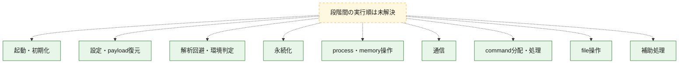
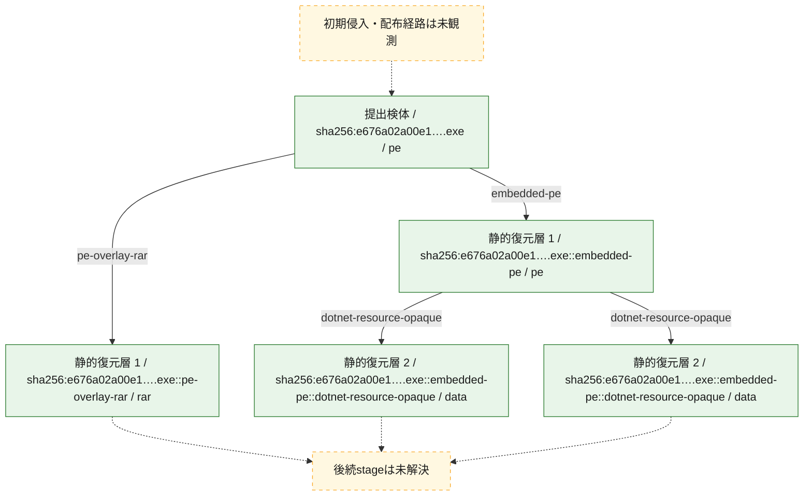
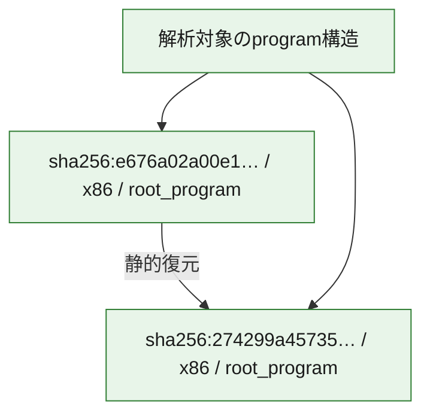

# 全体ロジック：e676a02a00e1ebca5b00aeafafcb397c9afadc39ecb5e9464d3cb9622f851a3f

代表関数の静的証跡から、起動・初期化、設定・payload復元、解析回避・環境判定、永続化、process・memory操作、通信、command分配・処理、file操作の処理群を確認しました。

## 読み方

- phaseの掲載順は解析上の整理順です。observed_call_edgesがない段階間の実行順を断定しません。
- 図の実線は静的に観測した関係、点線と黄色のノードは未観測・未解決の関係を示します。
- 図は静的な要約であり、動的実行を再現するものではありません。
- 詳細な関数解説とfingerprintは[STATIC-LOGIC.md](STATIC-LOGIC.md)を参照してください。

## 静的可視化

### 実行フロー

### 感染チェーン

### モジュール関係

## 処理段階

### 1. 起動・初期化

entry pointから初期化と後続処理への移行を確認します。
確度: `confirmed_static_function_evidence`

- `e676a02a00e1ebca5b00aeafafcb397c9afadc39ecb5e9464d3cb9622f851a3f:ghidra:0041ec40` — 初期化と主要処理への分岐を行う入口関数です。 状態: `succeeded`、選定理由: `entry_point`, `meaningful_symbol_name`, `reviewed_call_centrality:21`, `role:entrypoint`

### 2. 設定・payload復元

設定、resource、payload、暗号化データの復元・変換を確認します。
確度: `confirmed_static_function_evidence_with_limits`

- `274299a4573569f78b72287a2635f3997ee909897e21b87216b868596dbe4a17:cil:0x06000015` — 設定、resource、payloadなどの解析・変換を行う関数です。 状態: `succeeded`、選定理由: `large_function:instructions=504`, `reviewed_call_centrality:48`, `role:config_or_data_transform`
- `274299a4573569f78b72287a2635f3997ee909897e21b87216b868596dbe4a17:cil:0x0600006d` — 設定、resource、payloadなどの解析・変換を行う関数です。 状態: `succeeded`、選定理由: `large_function:instructions=883`, `reviewed_call_centrality:82`, `role:config_or_data_transform`
- `274299a4573569f78b72287a2635f3997ee909897e21b87216b868596dbe4a17:cil:0x0600006e` — 設定、resource、payloadなどの解析・変換を行う関数です。 状態: `succeeded`、選定理由: `large_function:instructions=381`, `reviewed_call_centrality:42`, `role:config_or_data_transform`
- `274299a4573569f78b72287a2635f3997ee909897e21b87216b868596dbe4a17:cil:0x060000d9` — 暗号、hash、encoding、または復号処理に関係する関数です。 状態: `succeeded`、選定理由: `large_function:instructions=298`, `reviewed_call_centrality:66`, `role:cryptographic_transform`
- `274299a4573569f78b72287a2635f3997ee909897e21b87216b868596dbe4a17:cil:0x060000f2` — 暗号、hash、encoding、または復号処理に関係する関数です。 状態: `succeeded`、選定理由: `large_function:instructions=895`, `reviewed_call_centrality:110`, `role:cryptographic_transform`
- `274299a4573569f78b72287a2635f3997ee909897e21b87216b868596dbe4a17:cil:0x060002b7` — 暗号、hash、encoding、または復号処理に関係する関数です。 状態: `succeeded`、選定理由: `large_function:instructions=517`, `reviewed_call_centrality:104`, `role:cryptographic_transform`
- `274299a4573569f78b72287a2635f3997ee909897e21b87216b868596dbe4a17:cil:0x06000892` — 暗号、hash、encoding、または復号処理に関係する関数です。 状態: `succeeded`、選定理由: `large_function:instructions=1301`, `reviewed_call_centrality:76`, `role:cryptographic_transform`
- `274299a4573569f78b72287a2635f3997ee909897e21b87216b868596dbe4a17:cil:0x06000ad7` — 暗号、hash、encoding、または復号処理に関係する関数です。 状態: `succeeded`、選定理由: `large_function:instructions=1002`, `reviewed_call_centrality:214`, `role:cryptographic_transform`
- `274299a4573569f78b72287a2635f3997ee909897e21b87216b868596dbe4a17:cil:0x06000d37` — 暗号、hash、encoding、または復号処理に関係する関数です。 状態: `succeeded`、選定理由: `large_function:instructions=216`, `reviewed_call_centrality:60`, `role:cryptographic_transform`
- `274299a4573569f78b72287a2635f3997ee909897e21b87216b868596dbe4a17:cil:0x0600116d` — 暗号、hash、encoding、または復号処理に関係する関数です。 状態: `succeeded`、選定理由: `large_function:instructions=371`, `reviewed_call_centrality:42`, `role:cryptographic_transform`
- `274299a4573569f78b72287a2635f3997ee909897e21b87216b868596dbe4a17:cil:0x060011c5` — 暗号、hash、encoding、または復号処理に関係する関数です。 状態: `succeeded`、選定理由: `large_function:instructions=3479`, `reviewed_call_centrality:50`, `role:cryptographic_transform`
- `274299a4573569f78b72287a2635f3997ee909897e21b87216b868596dbe4a17:cil:0x0600120f` — 暗号、hash、encoding、または復号処理に関係する関数です。 状態: `succeeded`、選定理由: `large_function:instructions=3214`, `reviewed_call_centrality:30`, `role:cryptographic_transform`
- `e676a02a00e1ebca5b00aeafafcb397c9afadc39ecb5e9464d3cb9622f851a3f:ghidra:0041e1de` — 暗号、hash、encoding、または復号処理に関係する関数です。 状態: `limited_bad_instruction_or_flow`、選定理由: `meaningful_symbol_name`, `reviewed_call_centrality:1`, `role:cryptographic_transform`

### 3. 解析回避・環境判定

debugger、sandbox、仮想環境、時間差などの判定を確認します。
確度: `confirmed_static_function_evidence`

- `274299a4573569f78b72287a2635f3997ee909897e21b87216b868596dbe4a17:cil:0x06000bd1` — debugger、仮想環境、sandbox、または時間差の確認に関係する関数です。 状態: `succeeded`、選定理由: `reviewed_call_centrality:4`, `role:anti_analysis`

### 4. 永続化

自動起動や永続化に関係する設定変更を確認します。
確度: `confirmed_static_function_evidence_with_limits`

- `274299a4573569f78b72287a2635f3997ee909897e21b87216b868596dbe4a17:cil:0x060004e6` — 自動起動または永続化に関係する処理を含む関数です。 状態: `succeeded`、選定理由: `reviewed_call_centrality:4`, `role:persistence`
- `e676a02a00e1ebca5b00aeafafcb397c9afadc39ecb5e9464d3cb9622f851a3f:ghidra:0041dbb9` — 自動起動または永続化に関係する処理を含む関数です。 状態: `limited_bad_instruction_or_flow`、選定理由: `meaningful_symbol_name`, `reviewed_call_centrality:1`, `role:persistence`

### 5. process・memory操作

process、thread、module、memory操作と実行移行を確認します。
確度: `confirmed_static_function_evidence_with_limits`

- `274299a4573569f78b72287a2635f3997ee909897e21b87216b868596dbe4a17:cil:0x06000170` — process、thread、module、またはmemory操作に関係する関数です。 状態: `succeeded`、選定理由: `large_function:instructions=145`, `reviewed_call_centrality:48`, `role:process_or_memory_operation`
- `274299a4573569f78b72287a2635f3997ee909897e21b87216b868596dbe4a17:cil:0x060001d3` — process、thread、module、またはmemory操作に関係する関数です。 状態: `succeeded`、選定理由: `large_function:instructions=157`, `reviewed_call_centrality:40`, `role:process_or_memory_operation`
- `274299a4573569f78b72287a2635f3997ee909897e21b87216b868596dbe4a17:cil:0x06000381` — process、thread、module、またはmemory操作に関係する関数です。 状態: `succeeded`、選定理由: `large_function:instructions=169`, `reviewed_call_centrality:40`, `role:process_or_memory_operation`
- `274299a4573569f78b72287a2635f3997ee909897e21b87216b868596dbe4a17:cil:0x060003b2` — process、thread、module、またはmemory操作に関係する関数です。 状態: `succeeded`、選定理由: `large_function:instructions=191`, `reviewed_call_centrality:52`, `role:process_or_memory_operation`
- `274299a4573569f78b72287a2635f3997ee909897e21b87216b868596dbe4a17:cil:0x0600045e` — process、thread、module、またはmemory操作に関係する関数です。 状態: `succeeded`、選定理由: `large_function:instructions=642`, `reviewed_call_centrality:82`, `role:process_or_memory_operation`
- `274299a4573569f78b72287a2635f3997ee909897e21b87216b868596dbe4a17:cil:0x060006d6` — process、thread、module、またはmemory操作に関係する関数です。 状態: `succeeded`、選定理由: `large_function:instructions=407`, `reviewed_call_centrality:72`, `role:process_or_memory_operation`
- `274299a4573569f78b72287a2635f3997ee909897e21b87216b868596dbe4a17:cil:0x0600116c` — process、thread、module、またはmemory操作に関係する関数です。 状態: `succeeded`、選定理由: `large_function:instructions=282`, `reviewed_call_centrality:36`, `role:process_or_memory_operation`
- `e676a02a00e1ebca5b00aeafafcb397c9afadc39ecb5e9464d3cb9622f851a3f:ghidra:0041d91a` — process、thread、module、またはmemory操作に関係する関数です。 状態: `limited_bad_instruction_or_flow`、選定理由: `meaningful_symbol_name`, `reviewed_call_centrality:1`, `role:process_or_memory_operation`
- `e676a02a00e1ebca5b00aeafafcb397c9afadc39ecb5e9464d3cb9622f851a3f:ghidra:0041db4b` — process、thread、module、またはmemory操作に関係する関数です。 状態: `limited_bad_instruction_or_flow`、選定理由: `meaningful_symbol_name`, `reviewed_call_centrality:1`, `role:process_or_memory_operation`

### 6. 通信

通信初期化、endpoint処理、送受信の役割を確認します。
確度: `confirmed_static_function_evidence_with_limits`

- `274299a4573569f78b72287a2635f3997ee909897e21b87216b868596dbe4a17:cil:0x06000152` — 通信初期化、送受信、またはendpoint処理に関係する関数です。 状態: `succeeded`、選定理由: `large_function:instructions=227`, `reviewed_call_centrality:60`, `role:network_communication`
- `e676a02a00e1ebca5b00aeafafcb397c9afadc39ecb5e9464d3cb9622f851a3f:ghidra:0041d9a6` — 通信初期化、送受信、またはendpoint処理に関係する関数です。 状態: `limited_bad_instruction_or_flow`、選定理由: `meaningful_symbol_name`, `reviewed_call_centrality:1`, `role:network_communication`
- `e676a02a00e1ebca5b00aeafafcb397c9afadc39ecb5e9464d3cb9622f851a3f:ghidra:0041da50` — 通信初期化、送受信、またはendpoint処理に関係する関数です。 状態: `limited_bad_instruction_or_flow`、選定理由: `meaningful_symbol_name`, `reviewed_call_centrality:1`, `role:network_communication`

### 7. command分配・処理

受信commandやtaskの解釈、分配、個別handlerへの移行を確認します。
確度: `confirmed_static_function_evidence_with_limits`

- `274299a4573569f78b72287a2635f3997ee909897e21b87216b868596dbe4a17:cil:0x060003e7` — commandの解釈、分配、または個別処理を担当する関数です。 状態: `succeeded`、選定理由: `large_function:instructions=147`, `reviewed_call_centrality:40`, `role:command_dispatch_or_handler`
- `274299a4573569f78b72287a2635f3997ee909897e21b87216b868596dbe4a17:cil:0x06000529` — commandの解釈、分配、または個別処理を担当する関数です。 状態: `succeeded`、選定理由: `large_function:instructions=148`, `reviewed_call_centrality:40`, `role:command_dispatch_or_handler`
- `274299a4573569f78b72287a2635f3997ee909897e21b87216b868596dbe4a17:cil:0x06000576` — commandの解釈、分配、または個別処理を担当する関数です。 状態: `succeeded`、選定理由: `large_function:instructions=228`, `reviewed_call_centrality:72`, `role:command_dispatch_or_handler`
- `e676a02a00e1ebca5b00aeafafcb397c9afadc39ecb5e9464d3cb9622f851a3f:ghidra:0041da00` — commandの解釈、分配、または個別処理を担当する関数です。 状態: `limited_bad_instruction_or_flow`、選定理由: `meaningful_symbol_name`, `reviewed_call_centrality:1`, `role:command_dispatch_or_handler`
- `e676a02a00e1ebca5b00aeafafcb397c9afadc39ecb5e9464d3cb9622f851a3f:ghidra:0041dbfc` — commandの解釈、分配、または個別処理を担当する関数です。 状態: `limited_bad_instruction_or_flow`、選定理由: `meaningful_symbol_name`, `reviewed_call_centrality:1`, `role:command_dispatch_or_handler`

### 8. file操作

fileやdirectoryの作成、読書き、削除を確認します。
確度: `confirmed_static_function_evidence_with_limits`

- `274299a4573569f78b72287a2635f3997ee909897e21b87216b868596dbe4a17:cil:0x060005ed` — fileまたはdirectoryの読書き・管理に関係する関数です。 状態: `succeeded`、選定理由: `large_function:instructions=143`, `reviewed_call_centrality:40`, `role:file_operation`
- `274299a4573569f78b72287a2635f3997ee909897e21b87216b868596dbe4a17:cil:0x06000768` — fileまたはdirectoryの読書き・管理に関係する関数です。 状態: `succeeded`、選定理由: `large_function:instructions=144`, `reviewed_call_centrality:40`, `role:file_operation`
- `274299a4573569f78b72287a2635f3997ee909897e21b87216b868596dbe4a17:cil:0x060007c8` — fileまたはdirectoryの読書き・管理に関係する関数です。 状態: `succeeded`、選定理由: `large_function:instructions=184`, `reviewed_call_centrality:44`, `role:file_operation`
- `274299a4573569f78b72287a2635f3997ee909897e21b87216b868596dbe4a17:cil:0x06000cd0` — fileまたはdirectoryの読書き・管理に関係する関数です。 状態: `succeeded`、選定理由: `large_function:instructions=801`, `reviewed_call_centrality:60`, `role:file_operation`
- `274299a4573569f78b72287a2635f3997ee909897e21b87216b868596dbe4a17:cil:0x06000d5b` — fileまたはdirectoryの読書き・管理に関係する関数です。 状態: `succeeded`、選定理由: `large_function:instructions=857`, `reviewed_call_centrality:36`, `role:file_operation`
- `274299a4573569f78b72287a2635f3997ee909897e21b87216b868596dbe4a17:cil:0x06000fe6` — fileまたはdirectoryの読書き・管理に関係する関数です。 状態: `succeeded`、選定理由: `large_function:instructions=259`, `reviewed_call_centrality:54`, `role:file_operation`
- `e676a02a00e1ebca5b00aeafafcb397c9afadc39ecb5e9464d3cb9622f851a3f:ghidra:0041db0b` — fileまたはdirectoryの読書き・管理に関係する関数です。 状態: `limited_bad_instruction_or_flow`、選定理由: `meaningful_symbol_name`, `reviewed_call_centrality:1`, `role:file_operation`
- `e676a02a00e1ebca5b00aeafafcb397c9afadc39ecb5e9464d3cb9622f851a3f:ghidra:0041db26` — fileまたはdirectoryの読書き・管理に関係する関数です。 状態: `limited_bad_instruction_or_flow`、選定理由: `meaningful_symbol_name`, `reviewed_call_centrality:1`, `role:file_operation`
- `e676a02a00e1ebca5b00aeafafcb397c9afadc39ecb5e9464d3cb9622f851a3f:ghidra:0041db5f` — fileまたはdirectoryの読書き・管理に関係する関数です。 状態: `limited_bad_instruction_or_flow`、選定理由: `meaningful_symbol_name`, `reviewed_call_centrality:1`, `role:file_operation`
- `e676a02a00e1ebca5b00aeafafcb397c9afadc39ecb5e9464d3cb9622f851a3f:ghidra:0041dbf2` — fileまたはdirectoryの読書き・管理に関係する関数です。 状態: `limited_bad_instruction_or_flow`、選定理由: `meaningful_symbol_name`, `reviewed_call_centrality:1`, `role:file_operation`
- `e676a02a00e1ebca5b00aeafafcb397c9afadc39ecb5e9464d3cb9622f851a3f:ghidra:0041dc06` — fileまたはdirectoryの読書き・管理に関係する関数です。 状態: `limited_bad_instruction_or_flow`、選定理由: `meaningful_symbol_name`, `reviewed_call_centrality:1`, `role:file_operation`
- `e676a02a00e1ebca5b00aeafafcb397c9afadc39ecb5e9464d3cb9622f851a3f:ghidra:0041dc24` — fileまたはdirectoryの読書き・管理に関係する関数です。 状態: `limited_bad_instruction_or_flow`、選定理由: `meaningful_symbol_name`, `reviewed_call_centrality:1`, `role:file_operation`

### 9. 補助処理

主要処理を支える一般内部関数またはlibrary処理を確認します。
確度: `confirmed_static_function_evidence_with_limits`

- `274299a4573569f78b72287a2635f3997ee909897e21b87216b868596dbe4a17:cil:0x06000d68` — 検体内部の一般処理を実装する関数です。 状態: `succeeded`、選定理由: `large_function:instructions=1349`, `reviewed_call_centrality:56`
- `e676a02a00e1ebca5b00aeafafcb397c9afadc39ecb5e9464d3cb9622f851a3f:ghidra:0041d891` — 検体内部の一般処理を実装する関数です。 状態: `limited_bad_instruction_or_flow`、選定理由: `meaningful_symbol_name`, `reviewed_call_centrality:1`
- `e676a02a00e1ebca5b00aeafafcb397c9afadc39ecb5e9464d3cb9622f851a3f:ghidra:0041d8ac` — 検体内部の一般処理を実装する関数です。 状態: `limited_bad_instruction_or_flow`、選定理由: `meaningful_symbol_name`, `reviewed_call_centrality:1`
- `e676a02a00e1ebca5b00aeafafcb397c9afadc39ecb5e9464d3cb9622f851a3f:ghidra:0041d8b6` — 検体内部の一般処理を実装する関数です。 状態: `limited_bad_instruction_or_flow`、選定理由: `meaningful_symbol_name`, `reviewed_call_centrality:1`
- `e676a02a00e1ebca5b00aeafafcb397c9afadc39ecb5e9464d3cb9622f851a3f:ghidra:0041d8c0` — 検体内部の一般処理を実装する関数です。 状態: `limited_bad_instruction_or_flow`、選定理由: `meaningful_symbol_name`, `reviewed_call_centrality:1`
- `e676a02a00e1ebca5b00aeafafcb397c9afadc39ecb5e9464d3cb9622f851a3f:ghidra:0041d8ca` — 検体内部の一般処理を実装する関数です。 状態: `limited_bad_instruction_or_flow`、選定理由: `meaningful_symbol_name`, `reviewed_call_centrality:1`
- `e676a02a00e1ebca5b00aeafafcb397c9afadc39ecb5e9464d3cb9622f851a3f:ghidra:0041d8d4` — 検体内部の一般処理を実装する関数です。 状態: `limited_bad_instruction_or_flow`、選定理由: `meaningful_symbol_name`, `reviewed_call_centrality:1`
- `e676a02a00e1ebca5b00aeafafcb397c9afadc39ecb5e9464d3cb9622f851a3f:ghidra:0041d8de` — 検体内部の一般処理を実装する関数です。 状態: `limited_bad_instruction_or_flow`、選定理由: `meaningful_symbol_name`, `reviewed_call_centrality:1`
- `e676a02a00e1ebca5b00aeafafcb397c9afadc39ecb5e9464d3cb9622f851a3f:ghidra:0041d8e8` — 検体内部の一般処理を実装する関数です。 状態: `limited_bad_instruction_or_flow`、選定理由: `meaningful_symbol_name`, `reviewed_call_centrality:1`
- `e676a02a00e1ebca5b00aeafafcb397c9afadc39ecb5e9464d3cb9622f851a3f:ghidra:0041d8f2` — 検体内部の一般処理を実装する関数です。 状態: `limited_bad_instruction_or_flow`、選定理由: `meaningful_symbol_name`, `reviewed_call_centrality:1`
- `e676a02a00e1ebca5b00aeafafcb397c9afadc39ecb5e9464d3cb9622f851a3f:ghidra:0041d8fc` — 検体内部の一般処理を実装する関数です。 状態: `limited_bad_instruction_or_flow`、選定理由: `meaningful_symbol_name`, `reviewed_call_centrality:1`
- `e676a02a00e1ebca5b00aeafafcb397c9afadc39ecb5e9464d3cb9622f851a3f:ghidra:0041d906` — 検体内部の一般処理を実装する関数です。 状態: `limited_bad_instruction_or_flow`、選定理由: `meaningful_symbol_name`, `reviewed_call_centrality:1`
- `e676a02a00e1ebca5b00aeafafcb397c9afadc39ecb5e9464d3cb9622f851a3f:ghidra:0041d910` — 検体内部の一般処理を実装する関数です。 状態: `limited_bad_instruction_or_flow`、選定理由: `meaningful_symbol_name`, `reviewed_call_centrality:1`
- `e676a02a00e1ebca5b00aeafafcb397c9afadc39ecb5e9464d3cb9622f851a3f:ghidra:0041d924` — 検体内部の一般処理を実装する関数です。 状態: `limited_bad_instruction_or_flow`、選定理由: `meaningful_symbol_name`, `reviewed_call_centrality:1`
- `e676a02a00e1ebca5b00aeafafcb397c9afadc39ecb5e9464d3cb9622f851a3f:ghidra:0041d92e` — 検体内部の一般処理を実装する関数です。 状態: `limited_bad_instruction_or_flow`、選定理由: `meaningful_symbol_name`, `reviewed_call_centrality:1`
- `e676a02a00e1ebca5b00aeafafcb397c9afadc39ecb5e9464d3cb9622f851a3f:ghidra:0041d938` — 検体内部の一般処理を実装する関数です。 状態: `limited_bad_instruction_or_flow`、選定理由: `meaningful_symbol_name`, `reviewed_call_centrality:1`
- `e676a02a00e1ebca5b00aeafafcb397c9afadc39ecb5e9464d3cb9622f851a3f:ghidra:0041d942` — 検体内部の一般処理を実装する関数です。 状態: `limited_bad_instruction_or_flow`、選定理由: `meaningful_symbol_name`, `reviewed_call_centrality:1`
- `e676a02a00e1ebca5b00aeafafcb397c9afadc39ecb5e9464d3cb9622f851a3f:ghidra:0041d94c` — 検体内部の一般処理を実装する関数です。 状態: `limited_bad_instruction_or_flow`、選定理由: `meaningful_symbol_name`, `reviewed_call_centrality:1`

## 観測したcall関係

- 代表関数間で直接解決できた呼出関係はありません。

## 解析範囲と制約

- 選定外関数は全体inventoryへ残しますが、関数本体の個別解説対象にはしていません。
- indirect call、難読化、packer、VM、壊れたcontrol flowによりcall関係が欠落する場合があります。
- 文書は静的解析に基づき、検体実行や外部通信による動的確認は行っていません。
