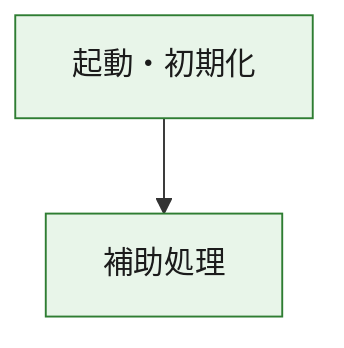
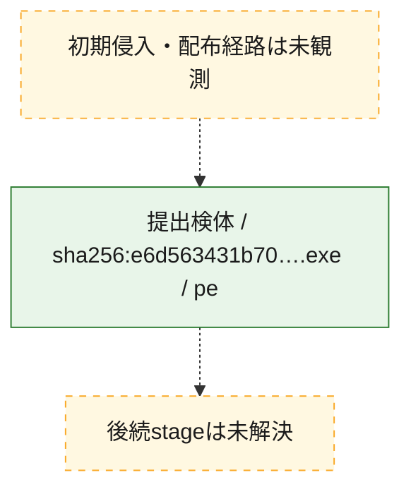
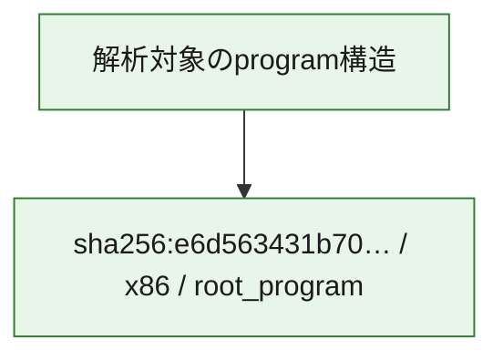

# 全体ロジック：e6d563431b7002b12d808f0af871fac9facc9dfe8e604dfff470298423bedce3

代表関数の静的証跡から、起動・初期化の処理群を確認しました。

## 読み方

- phaseの掲載順は解析上の整理順です。observed_call_edgesがない段階間の実行順を断定しません。
- 図の実線は静的に観測した関係、点線と黄色のノードは未観測・未解決の関係を示します。
- 図は静的な要約であり、動的実行を再現するものではありません。
- 詳細な関数解説とfingerprintは[STATIC-LOGIC.md](STATIC-LOGIC.md)を参照してください。

## 静的可視化

### 実行フロー

### 感染チェーン

### モジュール関係

## 処理段階

### 1. 起動・初期化

entry pointから初期化と後続処理への移行を確認します。
確度: `confirmed_static_function_evidence`

- `e6d563431b7002b12d808f0af871fac9facc9dfe8e604dfff470298423bedce3:ghidra:180001010` — 初期化と主要処理への分岐を行う入口関数です。 状態: `succeeded`、選定理由: `entry_point`, `meaningful_symbol_name`, `reviewed_call_centrality:22`, `role:entrypoint`, `small_program_complete_context`

### 2. 補助処理

主要処理を支える一般内部関数またはlibrary処理を確認します。
確度: `confirmed_static_function_evidence`

- `e6d563431b7002b12d808f0af871fac9facc9dfe8e604dfff470298423bedce3:ghidra:180001240` — 検体内部の一般処理を実装する関数です。 状態: `succeeded`、選定理由: `context_representative`, `reviewed_call_centrality:2`, `small_program_complete_context`
- `e6d563431b7002b12d808f0af871fac9facc9dfe8e604dfff470298423bedce3:ghidra:180001350` — 検体内部の一般処理を実装する関数です。 状態: `succeeded`、選定理由: `context_representative`, `reviewed_call_centrality:25`, `small_program_complete_context`
- `e6d563431b7002b12d808f0af871fac9facc9dfe8e604dfff470298423bedce3:ghidra:180003780` — 検体内部の一般処理を実装する関数です。 状態: `succeeded`、選定理由: `context_representative`, `reviewed_call_centrality:2`, `small_program_complete_context`
- `e6d563431b7002b12d808f0af871fac9facc9dfe8e604dfff470298423bedce3:ghidra:1800038e0` — 検体内部の一般処理を実装する関数です。 状態: `succeeded`、選定理由: `context_representative`, `reviewed_call_centrality:2`, `small_program_complete_context`

## 観測したcall関係

- `e6d563431b7002b12d808f0af871fac9facc9dfe8e604dfff470298423bedce3:ghidra:180001010` → `e6d563431b7002b12d808f0af871fac9facc9dfe8e604dfff470298423bedce3:ghidra:180001240` （`startup` → `support`）
- `e6d563431b7002b12d808f0af871fac9facc9dfe8e604dfff470298423bedce3:ghidra:180001010` → `e6d563431b7002b12d808f0af871fac9facc9dfe8e604dfff470298423bedce3:ghidra:180001350` （`startup` → `support`）
- `e6d563431b7002b12d808f0af871fac9facc9dfe8e604dfff470298423bedce3:ghidra:180001350` → `e6d563431b7002b12d808f0af871fac9facc9dfe8e604dfff470298423bedce3:ghidra:180001240` （`support` → `support`）
- `e6d563431b7002b12d808f0af871fac9facc9dfe8e604dfff470298423bedce3:ghidra:180001350` → `e6d563431b7002b12d808f0af871fac9facc9dfe8e604dfff470298423bedce3:ghidra:180003780` （`support` → `support`）
- `e6d563431b7002b12d808f0af871fac9facc9dfe8e604dfff470298423bedce3:ghidra:180001350` → `e6d563431b7002b12d808f0af871fac9facc9dfe8e604dfff470298423bedce3:ghidra:1800038e0` （`support` → `support`）
- `e6d563431b7002b12d808f0af871fac9facc9dfe8e604dfff470298423bedce3:ghidra:180003780` → `e6d563431b7002b12d808f0af871fac9facc9dfe8e604dfff470298423bedce3:ghidra:1800038e0` （`support` → `support`）
- `ghidra-function:349e5a49ad79a4fb2480a071` → `ghidra-function:20e14ecf5b8c65d4aac0a0b2` （`unclassified` → `unclassified`）
- `ghidra-function:349e5a49ad79a4fb2480a071` → `ghidra-function:21b9f5006c0f0eb15b84b304` （`unclassified` → `unclassified`）
- `ghidra-function:349e5a49ad79a4fb2480a071` → `ghidra-function:47a04a3ec69f447cbc1d6090` （`unclassified` → `unclassified`）
- `ghidra-function:349e5a49ad79a4fb2480a071` → `ghidra-function:4bdf5a568cfc89c10f0945c0` （`unclassified` → `unclassified`）
- `ghidra-function:349e5a49ad79a4fb2480a071` → `ghidra-function:4ea8addc7dc7e4324b740650` （`unclassified` → `unclassified`）
- `ghidra-function:349e5a49ad79a4fb2480a071` → `ghidra-function:511092e4bf700223916ce4e0` （`unclassified` → `unclassified`）
- `ghidra-function:349e5a49ad79a4fb2480a071` → `ghidra-function:5d59e4ea9d5cd0a7ae2d71ab` （`unclassified` → `unclassified`）
- `ghidra-function:349e5a49ad79a4fb2480a071` → `ghidra-function:6247098fef797089024adf8a` （`unclassified` → `unclassified`）
- `ghidra-function:349e5a49ad79a4fb2480a071` → `ghidra-function:8d3ba6760859bc45da201ae3` （`unclassified` → `unclassified`）
- `ghidra-function:349e5a49ad79a4fb2480a071` → `ghidra-function:90341301a51fb5c0d07b7f41` （`unclassified` → `unclassified`）
- `ghidra-function:349e5a49ad79a4fb2480a071` → `ghidra-function:9d2b74115a8dc2f009296304` （`unclassified` → `unclassified`）
- `ghidra-function:349e5a49ad79a4fb2480a071` → `ghidra-function:fde3601d768ad0202e2b82a0` （`unclassified` → `unclassified`）
- `ghidra-function:6247098fef797089024adf8a` → `ghidra-external:0ac7d22dfb9cbc9861b6e1eb` （`unclassified` → `unclassified`）
- `ghidra-function:6247098fef797089024adf8a` → `ghidra-external:17e9700664e13ebd24f994b6` （`unclassified` → `unclassified`）
- `ghidra-function:6247098fef797089024adf8a` → `ghidra-external:1bc88a787040ea71fbc1fc57` （`unclassified` → `unclassified`）
- `ghidra-function:6247098fef797089024adf8a` → `ghidra-external:31a74b0ee3fc76d50198de48` （`unclassified` → `unclassified`）
- `ghidra-function:6247098fef797089024adf8a` → `ghidra-external:35d01c78e0cf3c4c766d0646` （`unclassified` → `unclassified`）
- `ghidra-function:6247098fef797089024adf8a` → `ghidra-external:3c5e5df4b72f0610dc8400ad` （`unclassified` → `unclassified`）
- `ghidra-function:6247098fef797089024adf8a` → `ghidra-external:4f07a4f6b1414130092cebc7` （`unclassified` → `unclassified`）
- `ghidra-function:6247098fef797089024adf8a` → `ghidra-external:56d4c499e2cdfda046789282` （`unclassified` → `unclassified`）
- `ghidra-function:6247098fef797089024adf8a` → `ghidra-external:64b59af67a00e1081349d8fe` （`unclassified` → `unclassified`）
- `ghidra-function:6247098fef797089024adf8a` → `ghidra-external:66031059de5e6cbeda33c513` （`unclassified` → `unclassified`）
- `ghidra-function:6247098fef797089024adf8a` → `ghidra-external:7a3c292caff1d2127ad0ba7e` （`unclassified` → `unclassified`）
- `ghidra-function:6247098fef797089024adf8a` → `ghidra-external:7fba395ab6671f10afbd0edc` （`unclassified` → `unclassified`）
- `ghidra-function:6247098fef797089024adf8a` → `ghidra-external:84f6346e77fe1b902237c748` （`unclassified` → `unclassified`）
- `ghidra-function:6247098fef797089024adf8a` → `ghidra-external:95221e98a0328b8b987434c3` （`unclassified` → `unclassified`）
- `ghidra-function:6247098fef797089024adf8a` → `ghidra-external:9e7a7ffc63a7d0a416aa16bb` （`unclassified` → `unclassified`）
- `ghidra-function:6247098fef797089024adf8a` → `ghidra-external:bc3b7b5f36b526184ff6b6dd` （`unclassified` → `unclassified`）
- `ghidra-function:6247098fef797089024adf8a` → `ghidra-external:c208f90d037bb4636093bf9e` （`unclassified` → `unclassified`）
- `ghidra-function:6247098fef797089024adf8a` → `ghidra-external:c70b779875b5ce1a08b2f2a0` （`unclassified` → `unclassified`）
- `ghidra-function:6247098fef797089024adf8a` → `ghidra-external:d537b3e5d40c0462a1b4df39` （`unclassified` → `unclassified`）
- `ghidra-function:6247098fef797089024adf8a` → `ghidra-external:e46a382721cfd857fe4d1ff5` （`unclassified` → `unclassified`）
- `ghidra-function:6247098fef797089024adf8a` → `ghidra-external:efedcb8ca0bbe6bd25404f0c` （`unclassified` → `unclassified`）
- `ghidra-function:6247098fef797089024adf8a` → `ghidra-function:40746cbf0f21878296a29082` （`unclassified` → `unclassified`）
- `ghidra-function:6247098fef797089024adf8a` → `ghidra-function:8372afb714deedcd12c3dcda` （`unclassified` → `unclassified`）
- `ghidra-function:6247098fef797089024adf8a` → `ghidra-function:90341301a51fb5c0d07b7f41` （`unclassified` → `unclassified`）
- `ghidra-function:8372afb714deedcd12c3dcda` → `ghidra-function:40746cbf0f21878296a29082` （`unclassified` → `unclassified`）

## 解析範囲と制約

- 選定外関数は全体inventoryへ残しますが、関数本体の個別解説対象にはしていません。
- indirect call、難読化、packer、VM、壊れたcontrol flowによりcall関係が欠落する場合があります。
- 文書は静的解析に基づき、検体実行や外部通信による動的確認は行っていません。
