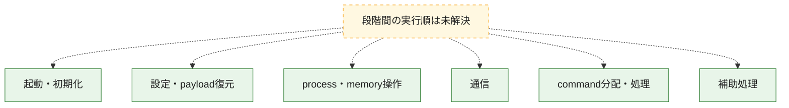
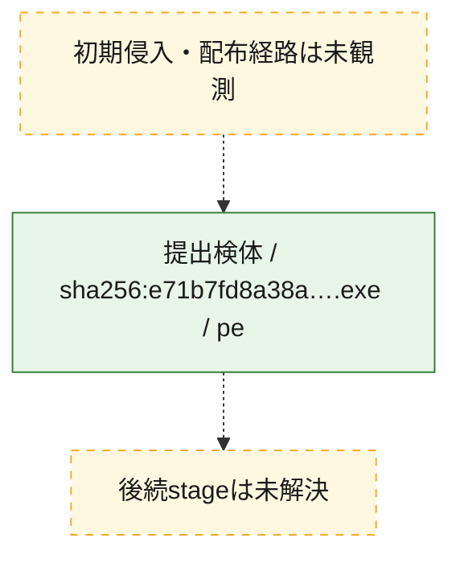
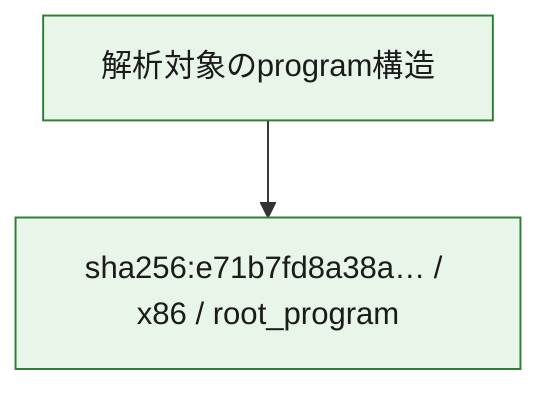

# 全体ロジック：e71b7fd8a38ace53045a576a8498f11a81c2d8f66b93086317c250dff5430429

代表関数の静的証跡から、起動・初期化、設定・payload復元、process・memory操作、通信、command分配・処理の処理群を確認しました。

## 読み方

- phaseの掲載順は解析上の整理順です。observed_call_edgesがない段階間の実行順を断定しません。
- 図の実線は静的に観測した関係、点線と黄色のノードは未観測・未解決の関係を示します。
- 図は静的な要約であり、動的実行を再現するものではありません。
- 詳細な関数解説とfingerprintは[STATIC-LOGIC.md](STATIC-LOGIC.md)を参照してください。

## 静的可視化

### 実行フロー

### 感染チェーン

### モジュール関係

## 処理段階

### 1. 起動・初期化

entry pointから初期化と後続処理への移行を確認します。
確度: `confirmed_static_function_evidence`

- `e71b7fd8a38ace53045a576a8498f11a81c2d8f66b93086317c250dff5430429:ghidra:180002b20` — 初期化と主要処理への分岐を行う入口関数です。 状態: `succeeded`、選定理由: `entry_point`, `meaningful_symbol_name`, `reviewed_call_centrality:5`, `role:entrypoint`

### 2. 設定・payload復元

設定、resource、payload、暗号化データの復元・変換を確認します。
確度: `confirmed_static_function_evidence`

- `e71b7fd8a38ace53045a576a8498f11a81c2d8f66b93086317c250dff5430429:ghidra:180001320` — 設定、resource、payloadなどの解析・変換を行う関数です。 状態: `succeeded`、選定理由: `entry_point`, `meaningful_symbol_name`, `reviewed_call_centrality:1`, `role:config_or_data_transform`
- `e71b7fd8a38ace53045a576a8498f11a81c2d8f66b93086317c250dff5430429:ghidra:1800013a0` — 設定、resource、payloadなどの解析・変換を行う関数です。 状態: `succeeded`、選定理由: `context_representative`, `reviewed_call_centrality:32`, `role:config_or_data_transform`

### 3. process・memory操作

process、thread、module、memory操作と実行移行を確認します。
確度: `confirmed_static_function_evidence`

- `e71b7fd8a38ace53045a576a8498f11a81c2d8f66b93086317c250dff5430429:ghidra:180001f50` — process、thread、module、またはmemory操作に関係する関数です。 状態: `succeeded`、選定理由: `context_representative`, `reviewed_call_centrality:19`, `role:process_or_memory_operation`
- `e71b7fd8a38ace53045a576a8498f11a81c2d8f66b93086317c250dff5430429:ghidra:180002470` — process、thread、module、またはmemory操作に関係する関数です。 状態: `succeeded`、選定理由: `context_representative`, `reviewed_call_centrality:3`, `role:process_or_memory_operation`
- `e71b7fd8a38ace53045a576a8498f11a81c2d8f66b93086317c250dff5430429:ghidra:180002b60` — process、thread、module、またはmemory操作に関係する関数です。 状態: `succeeded`、選定理由: `context_representative`, `reviewed_call_centrality:9`, `role:process_or_memory_operation`

### 4. 通信

通信初期化、endpoint処理、送受信の役割を確認します。
確度: `confirmed_static_function_evidence`

- `e71b7fd8a38ace53045a576a8498f11a81c2d8f66b93086317c250dff5430429:ghidra:180001970` — 通信初期化、送受信、またはendpoint処理に関係する関数です。 状態: `succeeded`、選定理由: `context_representative`, `reviewed_call_centrality:34`, `role:network_communication`

### 5. command分配・処理

受信commandやtaskの解釈、分配、個別handlerへの移行を確認します。
確度: `confirmed_static_function_evidence_with_limits`

- `e71b7fd8a38ace53045a576a8498f11a81c2d8f66b93086317c250dff5430429:ghidra:1800027d0` — commandの解釈、分配、または個別処理を担当する関数です。 状態: `succeeded`、選定理由: `context_representative`, `reviewed_call_centrality:24`, `role:command_dispatch_or_handler`
- `e71b7fd8a38ace53045a576a8498f11a81c2d8f66b93086317c250dff5430429:ghidra:180002830` — commandの解釈、分配、または個別処理を担当する関数です。 状態: `succeeded`、選定理由: `context_representative`, `reviewed_call_centrality:15`, `role:command_dispatch_or_handler`
- `e71b7fd8a38ace53045a576a8498f11a81c2d8f66b93086317c250dff5430429:ghidra:180002dd0` — commandの解釈、分配、または個別処理を担当する関数です。 状態: `limited_bad_instruction_or_flow`、選定理由: `context_representative`, `reviewed_call_centrality:4`, `role:command_dispatch_or_handler`
- `e71b7fd8a38ace53045a576a8498f11a81c2d8f66b93086317c250dff5430429:ghidra:1800033e0` — commandの解釈、分配、または個別処理を担当する関数です。 状態: `limited_bad_instruction_or_flow`、選定理由: `meaningful_symbol_name`, `reviewed_call_centrality:3`, `role:command_dispatch_or_handler`

### 6. 補助処理

主要処理を支える一般内部関数またはlibrary処理を確認します。
確度: `confirmed_static_function_evidence`

- `e71b7fd8a38ace53045a576a8498f11a81c2d8f66b93086317c250dff5430429:ghidra:180001000` — 検体内部の一般処理を実装する関数です。 状態: `succeeded`、選定理由: `context_representative`, `reviewed_call_centrality:14`
- `e71b7fd8a38ace53045a576a8498f11a81c2d8f66b93086317c250dff5430429:ghidra:1800012c0` — 検体内部の一般処理を実装する関数です。 状態: `succeeded`、選定理由: `context_representative`, `reviewed_call_centrality:2`
- `e71b7fd8a38ace53045a576a8498f11a81c2d8f66b93086317c250dff5430429:ghidra:1800012f0` — 検体内部の一般処理を実装する関数です。 状態: `succeeded`、選定理由: `entry_point`, `meaningful_symbol_name`, `reviewed_call_centrality:1`
- `e71b7fd8a38ace53045a576a8498f11a81c2d8f66b93086317c250dff5430429:ghidra:180001350` — 検体内部の一般処理を実装する関数です。 状態: `succeeded`、選定理由: `entry_point`, `meaningful_symbol_name`, `reviewed_call_centrality:1`
- `e71b7fd8a38ace53045a576a8498f11a81c2d8f66b93086317c250dff5430429:ghidra:180001370` — 検体内部の一般処理を実装する関数です。 状態: `succeeded`、選定理由: `entry_point`, `meaningful_symbol_name`, `reviewed_call_centrality:1`
- `e71b7fd8a38ace53045a576a8498f11a81c2d8f66b93086317c250dff5430429:ghidra:180001860` — 検体内部の一般処理を実装する関数です。 状態: `succeeded`、選定理由: `context_representative`, `reviewed_call_centrality:4`
- `e71b7fd8a38ace53045a576a8498f11a81c2d8f66b93086317c250dff5430429:ghidra:1800018b0` — 検体内部の一般処理を実装する関数です。 状態: `succeeded`、選定理由: `context_representative`, `reviewed_call_centrality:6`
- `e71b7fd8a38ace53045a576a8498f11a81c2d8f66b93086317c250dff5430429:ghidra:180001910` — 検体内部の一般処理を実装する関数です。 状態: `succeeded`、選定理由: `context_representative`, `reviewed_call_centrality:4`
- `e71b7fd8a38ace53045a576a8498f11a81c2d8f66b93086317c250dff5430429:ghidra:180002370` — 検体内部の一般処理を実装する関数です。 状態: `succeeded`、選定理由: `context_representative`, `reviewed_call_centrality:5`
- `e71b7fd8a38ace53045a576a8498f11a81c2d8f66b93086317c250dff5430429:ghidra:1800025b0` — 検体内部の一般処理を実装する関数です。 状態: `succeeded`、選定理由: `context_representative`, `reviewed_call_centrality:1`
- `e71b7fd8a38ace53045a576a8498f11a81c2d8f66b93086317c250dff5430429:ghidra:1800025d0` — 検体内部の一般処理を実装する関数です。 状態: `succeeded`、選定理由: `context_representative`, `reviewed_call_centrality:4`
- `e71b7fd8a38ace53045a576a8498f11a81c2d8f66b93086317c250dff5430429:ghidra:1800027b0` — 検体内部の一般処理を実装する関数です。 状態: `succeeded`、選定理由: `context_representative`, `reviewed_call_centrality:5`
- `e71b7fd8a38ace53045a576a8498f11a81c2d8f66b93086317c250dff5430429:ghidra:180002940` — 検体内部の一般処理を実装する関数です。 状態: `succeeded`、選定理由: `context_representative`, `reviewed_call_centrality:11`
- `e71b7fd8a38ace53045a576a8498f11a81c2d8f66b93086317c250dff5430429:ghidra:1800029e0` — 検体内部の一般処理を実装する関数です。 状態: `succeeded`、選定理由: `context_representative`, `reviewed_call_centrality:4`
- `e71b7fd8a38ace53045a576a8498f11a81c2d8f66b93086317c250dff5430429:ghidra:180002c50` — 検体内部の一般処理を実装する関数です。 状態: `succeeded`、選定理由: `context_representative`, `reviewed_call_centrality:4`
- `e71b7fd8a38ace53045a576a8498f11a81c2d8f66b93086317c250dff5430429:ghidra:180002c70` — 検体内部の一般処理を実装する関数です。 状態: `succeeded`、選定理由: `context_representative`, `reviewed_call_centrality:6`
- `e71b7fd8a38ace53045a576a8498f11a81c2d8f66b93086317c250dff5430429:ghidra:180002cc0` — 検体内部の一般処理を実装する関数です。 状態: `succeeded`、選定理由: `context_representative`, `reviewed_call_centrality:7`
- `e71b7fd8a38ace53045a576a8498f11a81c2d8f66b93086317c250dff5430429:ghidra:180002d00` — 検体内部の一般処理を実装する関数です。 状態: `succeeded`、選定理由: `context_representative`, `reviewed_call_centrality:4`
- `e71b7fd8a38ace53045a576a8498f11a81c2d8f66b93086317c250dff5430429:ghidra:180002d80` — 検体内部の一般処理を実装する関数です。 状態: `succeeded`、選定理由: `context_representative`, `reviewed_call_centrality:2`
- `e71b7fd8a38ace53045a576a8498f11a81c2d8f66b93086317c250dff5430429:ghidra:180002db0` — 検体内部の一般処理を実装する関数です。 状態: `succeeded`、選定理由: `context_representative`, `reviewed_call_centrality:2`
- `e71b7fd8a38ace53045a576a8498f11a81c2d8f66b93086317c250dff5430429:ghidra:180003080` — 検体内部の一般処理を実装する関数です。 状態: `succeeded`、選定理由: `meaningful_symbol_name`

## 観測したcall関係

- 代表関数間で直接解決できた呼出関係はありません。

## 解析範囲と制約

- 選定外関数は全体inventoryへ残しますが、関数本体の個別解説対象にはしていません。
- indirect call、難読化、packer、VM、壊れたcontrol flowによりcall関係が欠落する場合があります。
- 文書は静的解析に基づき、検体実行や外部通信による動的確認は行っていません。
