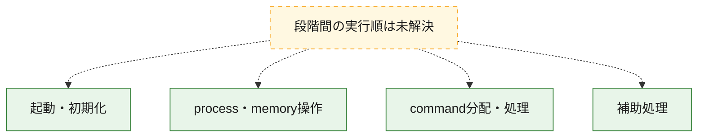
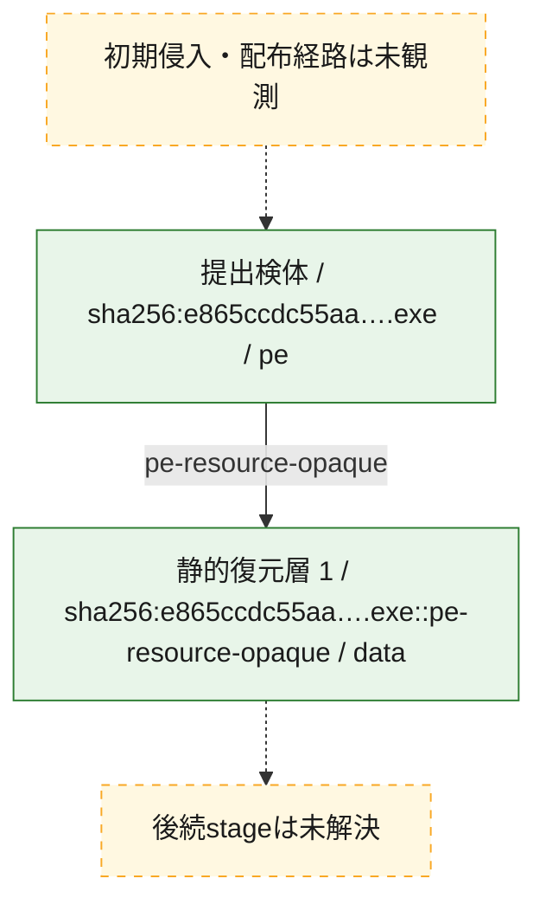
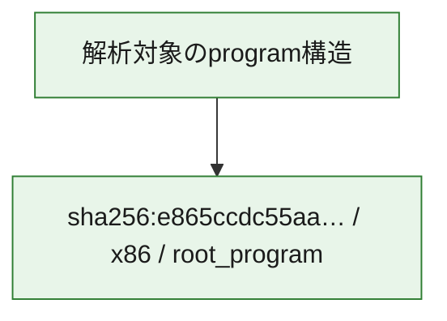

# 全体ロジック：e865ccdc55aad38dbbabad97e930951b379d8a51e31ed4163999876343f218b4

代表関数の静的証跡から、起動・初期化、process・memory操作、command分配・処理の処理群を確認しました。

## 読み方

- phaseの掲載順は解析上の整理順です。observed_call_edgesがない段階間の実行順を断定しません。
- 図の実線は静的に観測した関係、点線と黄色のノードは未観測・未解決の関係を示します。
- 図は静的な要約であり、動的実行を再現するものではありません。
- 詳細な関数解説とfingerprintは[STATIC-LOGIC.md](STATIC-LOGIC.md)を参照してください。

## 静的可視化

### 実行フロー

### 感染チェーン

### モジュール関係

## 処理段階

### 1. 起動・初期化

entry pointから初期化と後続処理への移行を確認します。
確度: `confirmed_static_function_evidence`

- `e865ccdc55aad38dbbabad97e930951b379d8a51e31ed4163999876343f218b4:ghidra:1400075e0` — 初期化と主要処理への分岐を行う入口関数です。 状態: `succeeded`、選定理由: `entry_point`, `meaningful_symbol_name`, `reviewed_call_centrality:12`, `role:entrypoint`

### 2. process・memory操作

process、thread、module、memory操作と実行移行を確認します。
確度: `confirmed_static_function_evidence`

- `e865ccdc55aad38dbbabad97e930951b379d8a51e31ed4163999876343f218b4:ghidra:140001000` — process、thread、module、またはmemory操作に関係する関数です。 状態: `succeeded`、選定理由: `context_representative`, `reviewed_call_centrality:26`, `role:process_or_memory_operation`
- `e865ccdc55aad38dbbabad97e930951b379d8a51e31ed4163999876343f218b4:ghidra:140003fa0` — process、thread、module、またはmemory操作に関係する関数です。 状態: `succeeded`、選定理由: `context_representative`, `reviewed_call_centrality:14`, `role:process_or_memory_operation`

### 3. command分配・処理

受信commandやtaskの解釈、分配、個別handlerへの移行を確認します。
確度: `confirmed_static_function_evidence_with_limits`

- `e865ccdc55aad38dbbabad97e930951b379d8a51e31ed4163999876343f218b4:ghidra:140019e00` — commandの解釈、分配、または個別処理を担当する関数です。 状態: `limited_bad_instruction_or_flow`、選定理由: `meaningful_symbol_name`, `role:command_dispatch_or_handler`

### 4. 補助処理

主要処理を支える一般内部関数またはlibrary処理を確認します。
確度: `confirmed_static_function_evidence_with_limits`

- `e865ccdc55aad38dbbabad97e930951b379d8a51e31ed4163999876343f218b4:ghidra:140001680` — 検体内部の一般処理を実装する関数です。 状態: `succeeded`、選定理由: `context_representative`
- `e865ccdc55aad38dbbabad97e930951b379d8a51e31ed4163999876343f218b4:ghidra:140001ca0` — 検体内部の一般処理を実装する関数です。 状態: `succeeded`、選定理由: `context_representative`, `reviewed_call_centrality:4`
- `e865ccdc55aad38dbbabad97e930951b379d8a51e31ed4163999876343f218b4:ghidra:140001ea0` — 検体内部の一般処理を実装する関数です。 状態: `succeeded`、選定理由: `context_representative`, `reviewed_call_centrality:1`
- `e865ccdc55aad38dbbabad97e930951b379d8a51e31ed4163999876343f218b4:ghidra:140001f90` — 検体内部の一般処理を実装する関数です。 状態: `succeeded`、選定理由: `context_representative`
- `e865ccdc55aad38dbbabad97e930951b379d8a51e31ed4163999876343f218b4:ghidra:140002010` — 検体内部の一般処理を実装する関数です。 状態: `succeeded`、選定理由: `context_representative`
- `e865ccdc55aad38dbbabad97e930951b379d8a51e31ed4163999876343f218b4:ghidra:140002080` — 検体内部の一般処理を実装する関数です。 状態: `succeeded`、選定理由: `context_representative`
- `e865ccdc55aad38dbbabad97e930951b379d8a51e31ed4163999876343f218b4:ghidra:140002160` — 検体内部の一般処理を実装する関数です。 状態: `succeeded`、選定理由: `context_representative`
- `e865ccdc55aad38dbbabad97e930951b379d8a51e31ed4163999876343f218b4:ghidra:140002240` — 検体内部の一般処理を実装する関数です。 状態: `limited_bad_instruction_or_flow`、選定理由: `context_representative`, `reviewed_call_centrality:3`
- `e865ccdc55aad38dbbabad97e930951b379d8a51e31ed4163999876343f218b4:ghidra:1400022d0` — 検体内部の一般処理を実装する関数です。 状態: `limited_bad_instruction_or_flow`、選定理由: `context_representative`, `reviewed_call_centrality:3`
- `e865ccdc55aad38dbbabad97e930951b379d8a51e31ed4163999876343f218b4:ghidra:140002370` — 検体内部の一般処理を実装する関数です。 状態: `limited_bad_instruction_or_flow`、選定理由: `context_representative`, `reviewed_call_centrality:3`
- `e865ccdc55aad38dbbabad97e930951b379d8a51e31ed4163999876343f218b4:ghidra:140002410` — 検体内部の一般処理を実装する関数です。 状態: `limited_bad_instruction_or_flow`、選定理由: `context_representative`, `reviewed_call_centrality:3`
- `e865ccdc55aad38dbbabad97e930951b379d8a51e31ed4163999876343f218b4:ghidra:1400024b0` — 検体内部の一般処理を実装する関数です。 状態: `limited_bad_instruction_or_flow`、選定理由: `context_representative`, `reviewed_call_centrality:1`
- `e865ccdc55aad38dbbabad97e930951b379d8a51e31ed4163999876343f218b4:ghidra:140002640` — 検体内部の一般処理を実装する関数です。 状態: `limited_bad_instruction_or_flow`、選定理由: `context_representative`, `reviewed_call_centrality:1`
- `e865ccdc55aad38dbbabad97e930951b379d8a51e31ed4163999876343f218b4:ghidra:140002860` — 検体内部の一般処理を実装する関数です。 状態: `succeeded`、選定理由: `context_representative`, `reviewed_call_centrality:1`
- `e865ccdc55aad38dbbabad97e930951b379d8a51e31ed4163999876343f218b4:ghidra:1400028f0` — 検体内部の一般処理を実装する関数です。 状態: `limited_bad_instruction_or_flow`、選定理由: `context_representative`, `reviewed_call_centrality:3`
- `e865ccdc55aad38dbbabad97e930951b379d8a51e31ed4163999876343f218b4:ghidra:140002980` — 検体内部の一般処理を実装する関数です。 状態: `limited_bad_instruction_or_flow`、選定理由: `context_representative`, `reviewed_call_centrality:3`
- `e865ccdc55aad38dbbabad97e930951b379d8a51e31ed4163999876343f218b4:ghidra:140002a20` — 検体内部の一般処理を実装する関数です。 状態: `succeeded`、選定理由: `context_representative`
- `e865ccdc55aad38dbbabad97e930951b379d8a51e31ed4163999876343f218b4:ghidra:140002a90` — 検体内部の一般処理を実装する関数です。 状態: `succeeded`、選定理由: `context_representative`
- `e865ccdc55aad38dbbabad97e930951b379d8a51e31ed4163999876343f218b4:ghidra:140002b00` — 検体内部の一般処理を実装する関数です。 状態: `succeeded`、選定理由: `context_representative`, `reviewed_call_centrality:2`
- `e865ccdc55aad38dbbabad97e930951b379d8a51e31ed4163999876343f218b4:ghidra:140002d40` — 検体内部の一般処理を実装する関数です。 状態: `succeeded`、選定理由: `context_representative`, `reviewed_call_centrality:2`
- `e865ccdc55aad38dbbabad97e930951b379d8a51e31ed4163999876343f218b4:ghidra:140002f80` — 検体内部の一般処理を実装する関数です。 状態: `succeeded`、選定理由: `context_representative`, `reviewed_call_centrality:9`
- `e865ccdc55aad38dbbabad97e930951b379d8a51e31ed4163999876343f218b4:ghidra:140004430` — 検体内部の一般処理を実装する関数です。 状態: `succeeded`、選定理由: `context_representative`, `reviewed_call_centrality:3`
- `e865ccdc55aad38dbbabad97e930951b379d8a51e31ed4163999876343f218b4:ghidra:140004550` — 検体内部の一般処理を実装する関数です。 状態: `succeeded`、選定理由: `context_representative`, `reviewed_call_centrality:2`
- `e865ccdc55aad38dbbabad97e930951b379d8a51e31ed4163999876343f218b4:ghidra:140004760` — 検体内部の一般処理を実装する関数です。 状態: `succeeded`、選定理由: `context_representative`, `reviewed_call_centrality:3`
- `e865ccdc55aad38dbbabad97e930951b379d8a51e31ed4163999876343f218b4:ghidra:140004860` — 検体内部の一般処理を実装する関数です。 状態: `succeeded`、選定理由: `context_representative`, `reviewed_call_centrality:6`
- `e865ccdc55aad38dbbabad97e930951b379d8a51e31ed4163999876343f218b4:ghidra:140004b40` — 検体内部の一般処理を実装する関数です。 状態: `succeeded`、選定理由: `context_representative`, `reviewed_call_centrality:6`
- `e865ccdc55aad38dbbabad97e930951b379d8a51e31ed4163999876343f218b4:ghidra:140004e00` — 検体内部の一般処理を実装する関数です。 状態: `succeeded`、選定理由: `context_representative`, `reviewed_call_centrality:8`
- `e865ccdc55aad38dbbabad97e930951b379d8a51e31ed4163999876343f218b4:ghidra:140011ccc` — 検体内部の一般処理を実装する関数です。 状態: `succeeded`、選定理由: `meaningful_symbol_name`

## 観測したcall関係

- 代表関数間で直接解決できた呼出関係はありません。

## 解析範囲と制約

- 選定外関数は全体inventoryへ残しますが、関数本体の個別解説対象にはしていません。
- indirect call、難読化、packer、VM、壊れたcontrol flowによりcall関係が欠落する場合があります。
- 文書は静的解析に基づき、検体実行や外部通信による動的確認は行っていません。
