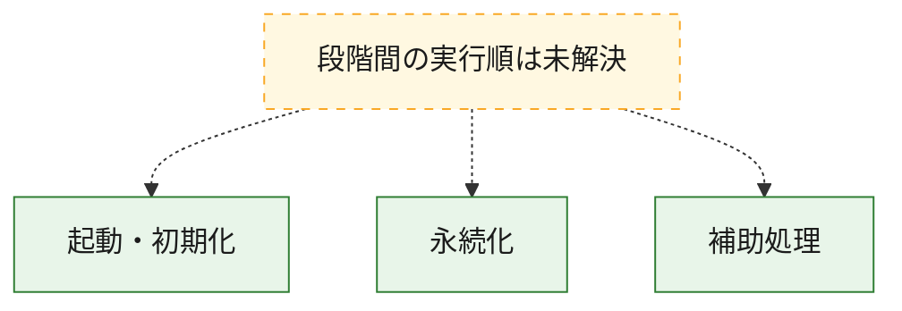
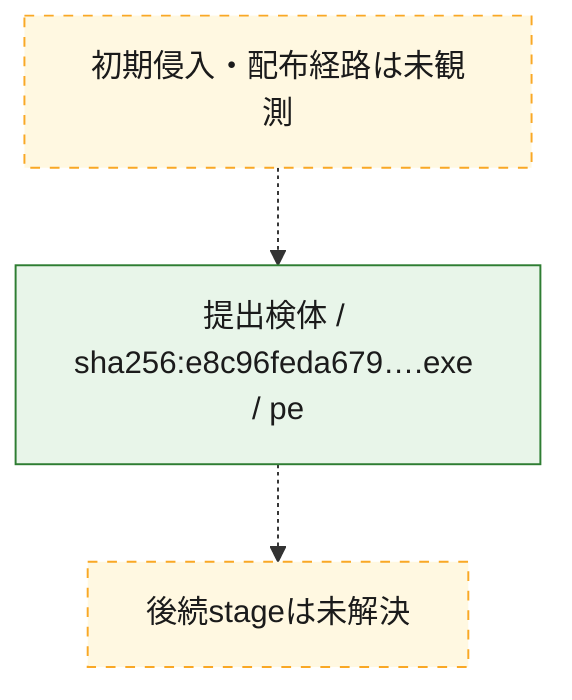
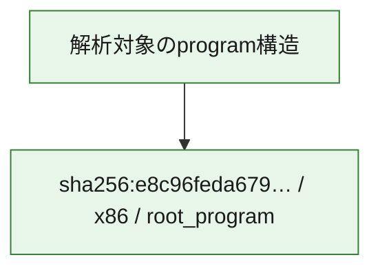

# 全体ロジック：e8c96feda6791f0acdee4c084e0d438f7792a1d33aa31de036fdb6408ca7db97

代表関数の静的証跡から、起動・初期化、永続化の処理群を確認しました。

## 読み方

- phaseの掲載順は解析上の整理順です。observed_call_edgesがない段階間の実行順を断定しません。
- 図の実線は静的に観測した関係、点線と黄色のノードは未観測・未解決の関係を示します。
- 図は静的な要約であり、動的実行を再現するものではありません。
- 詳細な関数解説とfingerprintは[STATIC-LOGIC.md](STATIC-LOGIC.md)を参照してください。

## 静的可視化

### 実行フロー

### 感染チェーン

### モジュール関係

## 処理段階

### 1. 起動・初期化

entry pointから初期化と後続処理への移行を確認します。
確度: `confirmed_static_function_evidence`

- `e8c96feda6791f0acdee4c084e0d438f7792a1d33aa31de036fdb6408ca7db97:ghidra:1400014b0` — 初期化と主要処理への分岐を行う入口関数です。 状態: `succeeded`、選定理由: `entry_point`, `meaningful_symbol_name`, `reviewed_call_centrality:1`, `role:entrypoint`

### 2. 永続化

自動起動や永続化に関係する設定変更を確認します。
確度: `confirmed_static_function_evidence`

- `e8c96feda6791f0acdee4c084e0d438f7792a1d33aa31de036fdb6408ca7db97:ghidra:140001180` — 自動起動または永続化に関係する処理を含む関数です。 状態: `succeeded`、選定理由: `context_representative`, `reviewed_call_centrality:24`, `role:persistence`

### 3. 補助処理

主要処理を支える一般内部関数またはlibrary処理を確認します。
確度: `confirmed_static_function_evidence_with_limits`

- `e8c96feda6791f0acdee4c084e0d438f7792a1d33aa31de036fdb6408ca7db97:ghidra:140001000` — 検体内部の一般処理を実装する関数です。 状態: `succeeded`、選定理由: `context_representative`
- `e8c96feda6791f0acdee4c084e0d438f7792a1d33aa31de036fdb6408ca7db97:ghidra:140001010` — 検体内部の一般処理を実装する関数です。 状態: `succeeded`、選定理由: `context_representative`, `reviewed_call_centrality:6`
- `e8c96feda6791f0acdee4c084e0d438f7792a1d33aa31de036fdb6408ca7db97:ghidra:140001130` — 検体内部の一般処理を実装する関数です。 状態: `succeeded`、選定理由: `context_representative`, `reviewed_call_centrality:1`
- `e8c96feda6791f0acdee4c084e0d438f7792a1d33aa31de036fdb6408ca7db97:ghidra:1400014d0` — 検体内部の一般処理を実装する関数です。 状態: `succeeded`、選定理由: `context_representative`, `reviewed_call_centrality:1`
- `e8c96feda6791f0acdee4c084e0d438f7792a1d33aa31de036fdb6408ca7db97:ghidra:1400014f0` — 検体内部の一般処理を実装する関数です。 状態: `succeeded`、選定理由: `context_representative`, `reviewed_call_centrality:1`
- `e8c96feda6791f0acdee4c084e0d438f7792a1d33aa31de036fdb6408ca7db97:ghidra:140001510` — 検体内部の一般処理を実装する関数です。 状態: `succeeded`、選定理由: `context_representative`, `reviewed_call_centrality:1`
- `e8c96feda6791f0acdee4c084e0d438f7792a1d33aa31de036fdb6408ca7db97:ghidra:140001520` — 検体内部の一般処理を実装する関数です。 状態: `succeeded`、選定理由: `context_representative`
- `e8c96feda6791f0acdee4c084e0d438f7792a1d33aa31de036fdb6408ca7db97:ghidra:14000154d` — 検体内部の一般処理を実装する関数です。 状態: `succeeded`、選定理由: `context_representative`, `reviewed_call_centrality:2`
- `e8c96feda6791f0acdee4c084e0d438f7792a1d33aa31de036fdb6408ca7db97:ghidra:140001625` — 検体内部の一般処理を実装する関数です。 状態: `succeeded`、選定理由: `context_representative`, `reviewed_call_centrality:3`
- `e8c96feda6791f0acdee4c084e0d438f7792a1d33aa31de036fdb6408ca7db97:ghidra:140001655` — 検体内部の一般処理を実装する関数です。 状態: `succeeded`、選定理由: `context_representative`, `reviewed_call_centrality:1`
- `e8c96feda6791f0acdee4c084e0d438f7792a1d33aa31de036fdb6408ca7db97:ghidra:140001687` — 検体内部の一般処理を実装する関数です。 状態: `succeeded`、選定理由: `context_representative`, `reviewed_call_centrality:6`
- `e8c96feda6791f0acdee4c084e0d438f7792a1d33aa31de036fdb6408ca7db97:ghidra:1400016ed` — 検体内部の一般処理を実装する関数です。 状態: `succeeded`、選定理由: `context_representative`, `reviewed_call_centrality:8`
- `e8c96feda6791f0acdee4c084e0d438f7792a1d33aa31de036fdb6408ca7db97:ghidra:1400017ca` — 検体内部の一般処理を実装する関数です。 状態: `succeeded`、選定理由: `context_representative`, `reviewed_call_centrality:6`
- `e8c96feda6791f0acdee4c084e0d438f7792a1d33aa31de036fdb6408ca7db97:ghidra:14000185b` — 検体内部の一般処理を実装する関数です。 状態: `succeeded`、選定理由: `context_representative`, `reviewed_call_centrality:6`
- `e8c96feda6791f0acdee4c084e0d438f7792a1d33aa31de036fdb6408ca7db97:ghidra:140001904` — 検体内部の一般処理を実装する関数です。 状態: `limited_bad_instruction_or_flow`、選定理由: `context_representative`, `reviewed_call_centrality:10`
- `e8c96feda6791f0acdee4c084e0d438f7792a1d33aa31de036fdb6408ca7db97:ghidra:140001996` — 検体内部の一般処理を実装する関数です。 状態: `limited_bad_instruction_or_flow`、選定理由: `context_representative`, `reviewed_call_centrality:13`
- `e8c96feda6791f0acdee4c084e0d438f7792a1d33aa31de036fdb6408ca7db97:ghidra:140001a6a` — 検体内部の一般処理を実装する関数です。 状態: `succeeded`、選定理由: `context_representative`, `reviewed_call_centrality:2`
- `e8c96feda6791f0acdee4c084e0d438f7792a1d33aa31de036fdb6408ca7db97:ghidra:140001aed` — 検体内部の一般処理を実装する関数です。 状態: `succeeded`、選定理由: `context_representative`, `reviewed_call_centrality:1`
- `e8c96feda6791f0acdee4c084e0d438f7792a1d33aa31de036fdb6408ca7db97:ghidra:140001b45` — 検体内部の一般処理を実装する関数です。 状態: `succeeded`、選定理由: `context_representative`, `reviewed_call_centrality:7`
- `e8c96feda6791f0acdee4c084e0d438f7792a1d33aa31de036fdb6408ca7db97:ghidra:140001dfd` — 検体内部の一般処理を実装する関数です。 状態: `succeeded`、選定理由: `context_representative`, `reviewed_call_centrality:7`
- `e8c96feda6791f0acdee4c084e0d438f7792a1d33aa31de036fdb6408ca7db97:ghidra:14000207c` — 検体内部の一般処理を実装する関数です。 状態: `succeeded`、選定理由: `context_representative`, `reviewed_call_centrality:3`
- `e8c96feda6791f0acdee4c084e0d438f7792a1d33aa31de036fdb6408ca7db97:ghidra:1400020a8` — 検体内部の一般処理を実装する関数です。 状態: `succeeded`、選定理由: `context_representative`, `reviewed_call_centrality:4`
- `e8c96feda6791f0acdee4c084e0d438f7792a1d33aa31de036fdb6408ca7db97:ghidra:1400021c8` — 検体内部の一般処理を実装する関数です。 状態: `succeeded`、選定理由: `context_representative`, `reviewed_call_centrality:3`
- `e8c96feda6791f0acdee4c084e0d438f7792a1d33aa31de036fdb6408ca7db97:ghidra:140002221` — 検体内部の一般処理を実装する関数です。 状態: `succeeded`、選定理由: `context_representative`, `reviewed_call_centrality:1`
- `e8c96feda6791f0acdee4c084e0d438f7792a1d33aa31de036fdb6408ca7db97:ghidra:14000224b` — 検体内部の一般処理を実装する関数です。 状態: `succeeded`、選定理由: `context_representative`, `reviewed_call_centrality:3`
- `e8c96feda6791f0acdee4c084e0d438f7792a1d33aa31de036fdb6408ca7db97:ghidra:140002296` — 検体内部の一般処理を実装する関数です。 状態: `succeeded`、選定理由: `context_representative`, `reviewed_call_centrality:1`
- `e8c96feda6791f0acdee4c084e0d438f7792a1d33aa31de036fdb6408ca7db97:ghidra:1400022bb` — 検体内部の一般処理を実装する関数です。 状態: `succeeded`、選定理由: `context_representative`, `reviewed_call_centrality:1`
- `e8c96feda6791f0acdee4c084e0d438f7792a1d33aa31de036fdb6408ca7db97:ghidra:1400022e0` — 検体内部の一般処理を実装する関数です。 状態: `succeeded`、選定理由: `context_representative`, `reviewed_call_centrality:1`
- `e8c96feda6791f0acdee4c084e0d438f7792a1d33aa31de036fdb6408ca7db97:ghidra:14000233a` — 検体内部の一般処理を実装する関数です。 状態: `succeeded`、選定理由: `context_representative`, `reviewed_call_centrality:2`
- `e8c96feda6791f0acdee4c084e0d438f7792a1d33aa31de036fdb6408ca7db97:ghidra:140002415` — 検体内部の一般処理を実装する関数です。 状態: `succeeded`、選定理由: `context_representative`, `reviewed_call_centrality:1`

## 観測したcall関係

- 代表関数間で直接解決できた呼出関係はありません。

## 解析範囲と制約

- 選定外関数は全体inventoryへ残しますが、関数本体の個別解説対象にはしていません。
- indirect call、難読化、packer、VM、壊れたcontrol flowによりcall関係が欠落する場合があります。
- 文書は静的解析に基づき、検体実行や外部通信による動的確認は行っていません。
