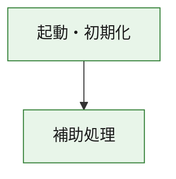
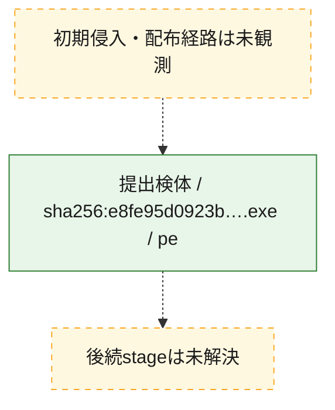
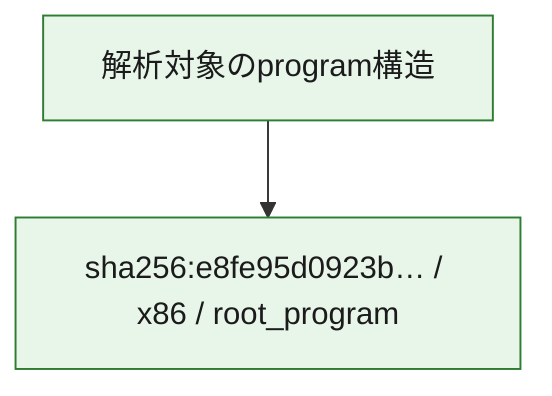

# 全体ロジック：e8fe95d0923b00b67de5d91b78e933d2601767c3732d45a1dcba7785ecf22be9

代表関数の静的証跡から、起動・初期化の処理群を確認しました。

## 読み方

- phaseの掲載順は解析上の整理順です。observed_call_edgesがない段階間の実行順を断定しません。
- 図の実線は静的に観測した関係、点線と黄色のノードは未観測・未解決の関係を示します。
- 図は静的な要約であり、動的実行を再現するものではありません。
- 詳細な関数解説とfingerprintは[STATIC-LOGIC.md](STATIC-LOGIC.md)を参照してください。

## 静的可視化

### 実行フロー

### 感染チェーン

### モジュール関係

## 処理段階

### 1. 起動・初期化

entry pointから初期化と後続処理への移行を確認します。
確度: `confirmed_static_function_evidence`

- `e8fe95d0923b00b67de5d91b78e933d2601767c3732d45a1dcba7785ecf22be9:ghidra:180001010` — 初期化と主要処理への分岐を行う入口関数です。 状態: `succeeded`、選定理由: `entry_point`, `meaningful_symbol_name`, `reviewed_call_centrality:22`, `role:entrypoint`, `small_program_complete_context`

### 2. 補助処理

主要処理を支える一般内部関数またはlibrary処理を確認します。
確度: `confirmed_static_function_evidence`

- `e8fe95d0923b00b67de5d91b78e933d2601767c3732d45a1dcba7785ecf22be9:ghidra:180001240` — 検体内部の一般処理を実装する関数です。 状態: `succeeded`、選定理由: `context_representative`, `reviewed_call_centrality:2`, `small_program_complete_context`
- `e8fe95d0923b00b67de5d91b78e933d2601767c3732d45a1dcba7785ecf22be9:ghidra:180001350` — 検体内部の一般処理を実装する関数です。 状態: `succeeded`、選定理由: `context_representative`, `reviewed_call_centrality:25`, `small_program_complete_context`
- `e8fe95d0923b00b67de5d91b78e933d2601767c3732d45a1dcba7785ecf22be9:ghidra:180003780` — 検体内部の一般処理を実装する関数です。 状態: `succeeded`、選定理由: `context_representative`, `reviewed_call_centrality:2`, `small_program_complete_context`
- `e8fe95d0923b00b67de5d91b78e933d2601767c3732d45a1dcba7785ecf22be9:ghidra:1800038e0` — 検体内部の一般処理を実装する関数です。 状態: `succeeded`、選定理由: `context_representative`, `reviewed_call_centrality:2`, `small_program_complete_context`

## 観測したcall関係

- `e8fe95d0923b00b67de5d91b78e933d2601767c3732d45a1dcba7785ecf22be9:ghidra:180001010` → `e8fe95d0923b00b67de5d91b78e933d2601767c3732d45a1dcba7785ecf22be9:ghidra:180001240` （`startup` → `support`）
- `e8fe95d0923b00b67de5d91b78e933d2601767c3732d45a1dcba7785ecf22be9:ghidra:180001010` → `e8fe95d0923b00b67de5d91b78e933d2601767c3732d45a1dcba7785ecf22be9:ghidra:180001350` （`startup` → `support`）
- `e8fe95d0923b00b67de5d91b78e933d2601767c3732d45a1dcba7785ecf22be9:ghidra:180001350` → `e8fe95d0923b00b67de5d91b78e933d2601767c3732d45a1dcba7785ecf22be9:ghidra:180001240` （`support` → `support`）
- `e8fe95d0923b00b67de5d91b78e933d2601767c3732d45a1dcba7785ecf22be9:ghidra:180001350` → `e8fe95d0923b00b67de5d91b78e933d2601767c3732d45a1dcba7785ecf22be9:ghidra:180003780` （`support` → `support`）
- `e8fe95d0923b00b67de5d91b78e933d2601767c3732d45a1dcba7785ecf22be9:ghidra:180001350` → `e8fe95d0923b00b67de5d91b78e933d2601767c3732d45a1dcba7785ecf22be9:ghidra:1800038e0` （`support` → `support`）
- `e8fe95d0923b00b67de5d91b78e933d2601767c3732d45a1dcba7785ecf22be9:ghidra:180003780` → `e8fe95d0923b00b67de5d91b78e933d2601767c3732d45a1dcba7785ecf22be9:ghidra:1800038e0` （`support` → `support`）
- `ghidra-function:1298c6868407fddc888cb773` → `ghidra-function:46e086b1a9adce26abcedaec` （`unclassified` → `unclassified`）
- `ghidra-function:1298c6868407fddc888cb773` → `ghidra-function:5249f244b9c6276efccbdcff` （`unclassified` → `unclassified`）
- `ghidra-function:1298c6868407fddc888cb773` → `ghidra-function:5d00132e91ff5fff9d4e167f` （`unclassified` → `unclassified`）
- `ghidra-function:1298c6868407fddc888cb773` → `ghidra-function:7185aaf221925a7ed769bf96` （`unclassified` → `unclassified`）
- `ghidra-function:1298c6868407fddc888cb773` → `ghidra-function:786639e94c9c207356435359` （`unclassified` → `unclassified`）
- `ghidra-function:1298c6868407fddc888cb773` → `ghidra-function:7ff5a99bf212b7465d343b2e` （`unclassified` → `unclassified`）
- `ghidra-function:1298c6868407fddc888cb773` → `ghidra-function:916edc7ff69430cfc97ddd9d` （`unclassified` → `unclassified`）
- `ghidra-function:1298c6868407fddc888cb773` → `ghidra-function:a11645b90a89e0c2237c2fc3` （`unclassified` → `unclassified`）
- `ghidra-function:1298c6868407fddc888cb773` → `ghidra-function:b104f78fecb8f03b00f2ec5e` （`unclassified` → `unclassified`）
- `ghidra-function:1298c6868407fddc888cb773` → `ghidra-function:c74e13d1f4a20b001cae6a73` （`unclassified` → `unclassified`）
- `ghidra-function:1298c6868407fddc888cb773` → `ghidra-function:c9c9efa29369875aa6f3de72` （`unclassified` → `unclassified`）
- `ghidra-function:1298c6868407fddc888cb773` → `ghidra-function:d10fc569621934299ba87bed` （`unclassified` → `unclassified`）
- `ghidra-function:98f9c3826a6f21d7ea951ba6` → `ghidra-function:4723750089f7f622576be794` （`unclassified` → `unclassified`）
- `ghidra-function:c74e13d1f4a20b001cae6a73` → `ghidra-external:0433ad3e799dc4cef37199a3` （`unclassified` → `unclassified`）
- `ghidra-function:c74e13d1f4a20b001cae6a73` → `ghidra-external:23500b8edb214fcb03321442` （`unclassified` → `unclassified`）
- `ghidra-function:c74e13d1f4a20b001cae6a73` → `ghidra-external:30576094f1131beecfa61db8` （`unclassified` → `unclassified`）
- `ghidra-function:c74e13d1f4a20b001cae6a73` → `ghidra-external:38310aa3f47bebfdc43c15b8` （`unclassified` → `unclassified`）
- `ghidra-function:c74e13d1f4a20b001cae6a73` → `ghidra-external:4dd09ded677b8a84e8dc09e6` （`unclassified` → `unclassified`）
- `ghidra-function:c74e13d1f4a20b001cae6a73` → `ghidra-external:538a5369815d14c0e888efb0` （`unclassified` → `unclassified`）
- `ghidra-function:c74e13d1f4a20b001cae6a73` → `ghidra-external:6b5ea8c30ec0d7d843153f02` （`unclassified` → `unclassified`）
- `ghidra-function:c74e13d1f4a20b001cae6a73` → `ghidra-external:743a45aee5635e25ac844612` （`unclassified` → `unclassified`）
- `ghidra-function:c74e13d1f4a20b001cae6a73` → `ghidra-external:76399858bfc563b8f3cefda0` （`unclassified` → `unclassified`）
- `ghidra-function:c74e13d1f4a20b001cae6a73` → `ghidra-external:7ad198b74872934277c16f27` （`unclassified` → `unclassified`）
- `ghidra-function:c74e13d1f4a20b001cae6a73` → `ghidra-external:82638d4f5c222bbbb42283db` （`unclassified` → `unclassified`）
- `ghidra-function:c74e13d1f4a20b001cae6a73` → `ghidra-external:8b9e59c4e10d603082f8ccd3` （`unclassified` → `unclassified`）
- `ghidra-function:c74e13d1f4a20b001cae6a73` → `ghidra-external:9f468a57ae928b82e49dd17c` （`unclassified` → `unclassified`）
- `ghidra-function:c74e13d1f4a20b001cae6a73` → `ghidra-external:b552641e82755847be53613e` （`unclassified` → `unclassified`）
- `ghidra-function:c74e13d1f4a20b001cae6a73` → `ghidra-external:b86b2e1f46b8895eb4dfb2cf` （`unclassified` → `unclassified`）
- `ghidra-function:c74e13d1f4a20b001cae6a73` → `ghidra-external:be5459292899f1b76fdc8833` （`unclassified` → `unclassified`）
- `ghidra-function:c74e13d1f4a20b001cae6a73` → `ghidra-external:cae06cf0ba3e7170e7133979` （`unclassified` → `unclassified`）
- `ghidra-function:c74e13d1f4a20b001cae6a73` → `ghidra-external:d2a57e08aba1668bebfe35b5` （`unclassified` → `unclassified`）
- `ghidra-function:c74e13d1f4a20b001cae6a73` → `ghidra-external:d784f90c2c2c9facbf3ce054` （`unclassified` → `unclassified`）
- `ghidra-function:c74e13d1f4a20b001cae6a73` → `ghidra-external:df87087bda9ce79b9c5556ba` （`unclassified` → `unclassified`）
- `ghidra-function:c74e13d1f4a20b001cae6a73` → `ghidra-external:ff641b9f23c891ced087897b` （`unclassified` → `unclassified`）
- `ghidra-function:c74e13d1f4a20b001cae6a73` → `ghidra-function:4723750089f7f622576be794` （`unclassified` → `unclassified`）
- `ghidra-function:c74e13d1f4a20b001cae6a73` → `ghidra-function:7185aaf221925a7ed769bf96` （`unclassified` → `unclassified`）
- `ghidra-function:c74e13d1f4a20b001cae6a73` → `ghidra-function:98f9c3826a6f21d7ea951ba6` （`unclassified` → `unclassified`）

## 解析範囲と制約

- 選定外関数は全体inventoryへ残しますが、関数本体の個別解説対象にはしていません。
- indirect call、難読化、packer、VM、壊れたcontrol flowによりcall関係が欠落する場合があります。
- 文書は静的解析に基づき、検体実行や外部通信による動的確認は行っていません。
