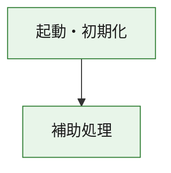
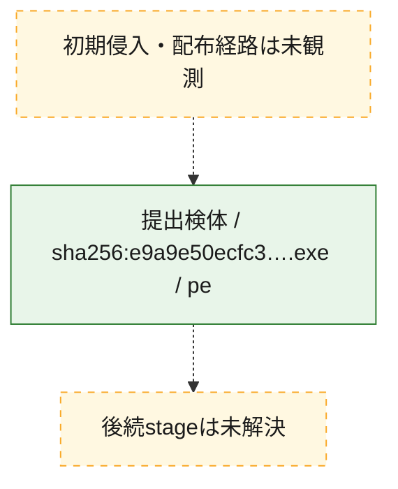
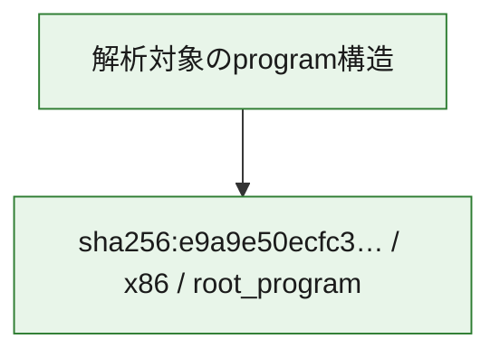

# 全体ロジック：e9a9e50ecfc3bc3d7b11f8c25e112e544f7fea68896f8e7532069a314828d5e7

代表関数の静的証跡から、起動・初期化の処理群を確認しました。

## 読み方

- phaseの掲載順は解析上の整理順です。observed_call_edgesがない段階間の実行順を断定しません。
- 図の実線は静的に観測した関係、点線と黄色のノードは未観測・未解決の関係を示します。
- 図は静的な要約であり、動的実行を再現するものではありません。
- 詳細な関数解説とfingerprintは[STATIC-LOGIC.md](STATIC-LOGIC.md)を参照してください。

## 静的可視化

### 実行フロー

### 感染チェーン

### モジュール関係

## 処理段階

### 1. 起動・初期化

entry pointから初期化と後続処理への移行を確認します。
確度: `confirmed_static_function_evidence`

- `e9a9e50ecfc3bc3d7b11f8c25e112e544f7fea68896f8e7532069a314828d5e7:ghidra:180001010` — 初期化と主要処理への分岐を行う入口関数です。 状態: `succeeded`、選定理由: `entry_point`, `meaningful_symbol_name`, `reviewed_call_centrality:22`, `role:entrypoint`, `small_program_complete_context`

### 2. 補助処理

主要処理を支える一般内部関数またはlibrary処理を確認します。
確度: `confirmed_static_function_evidence`

- `e9a9e50ecfc3bc3d7b11f8c25e112e544f7fea68896f8e7532069a314828d5e7:ghidra:180001240` — 検体内部の一般処理を実装する関数です。 状態: `succeeded`、選定理由: `context_representative`, `reviewed_call_centrality:2`, `small_program_complete_context`
- `e9a9e50ecfc3bc3d7b11f8c25e112e544f7fea68896f8e7532069a314828d5e7:ghidra:180001350` — 検体内部の一般処理を実装する関数です。 状態: `succeeded`、選定理由: `context_representative`, `reviewed_call_centrality:25`, `small_program_complete_context`
- `e9a9e50ecfc3bc3d7b11f8c25e112e544f7fea68896f8e7532069a314828d5e7:ghidra:180003780` — 検体内部の一般処理を実装する関数です。 状態: `succeeded`、選定理由: `context_representative`, `reviewed_call_centrality:2`, `small_program_complete_context`
- `e9a9e50ecfc3bc3d7b11f8c25e112e544f7fea68896f8e7532069a314828d5e7:ghidra:1800038e0` — 検体内部の一般処理を実装する関数です。 状態: `succeeded`、選定理由: `context_representative`, `reviewed_call_centrality:2`, `small_program_complete_context`

## 観測したcall関係

- `e9a9e50ecfc3bc3d7b11f8c25e112e544f7fea68896f8e7532069a314828d5e7:ghidra:180001010` → `e9a9e50ecfc3bc3d7b11f8c25e112e544f7fea68896f8e7532069a314828d5e7:ghidra:180001240` （`startup` → `support`）
- `e9a9e50ecfc3bc3d7b11f8c25e112e544f7fea68896f8e7532069a314828d5e7:ghidra:180001010` → `e9a9e50ecfc3bc3d7b11f8c25e112e544f7fea68896f8e7532069a314828d5e7:ghidra:180001350` （`startup` → `support`）
- `e9a9e50ecfc3bc3d7b11f8c25e112e544f7fea68896f8e7532069a314828d5e7:ghidra:180001350` → `e9a9e50ecfc3bc3d7b11f8c25e112e544f7fea68896f8e7532069a314828d5e7:ghidra:180001240` （`support` → `support`）
- `e9a9e50ecfc3bc3d7b11f8c25e112e544f7fea68896f8e7532069a314828d5e7:ghidra:180001350` → `e9a9e50ecfc3bc3d7b11f8c25e112e544f7fea68896f8e7532069a314828d5e7:ghidra:180003780` （`support` → `support`）
- `e9a9e50ecfc3bc3d7b11f8c25e112e544f7fea68896f8e7532069a314828d5e7:ghidra:180001350` → `e9a9e50ecfc3bc3d7b11f8c25e112e544f7fea68896f8e7532069a314828d5e7:ghidra:1800038e0` （`support` → `support`）
- `e9a9e50ecfc3bc3d7b11f8c25e112e544f7fea68896f8e7532069a314828d5e7:ghidra:180003780` → `e9a9e50ecfc3bc3d7b11f8c25e112e544f7fea68896f8e7532069a314828d5e7:ghidra:1800038e0` （`support` → `support`）
- `ghidra-function:26c1a3ab6f951fafe3c30970` → `ghidra-function:3f4f41e9aef2c0b85072aa68` （`unclassified` → `unclassified`）
- `ghidra-function:5bf52703d525e5a2ab57b656` → `ghidra-function:0784d042382e8a25593749ee` （`unclassified` → `unclassified`）
- `ghidra-function:5bf52703d525e5a2ab57b656` → `ghidra-function:122e36b1689219a4640fa226` （`unclassified` → `unclassified`）
- `ghidra-function:5bf52703d525e5a2ab57b656` → `ghidra-function:456dbef25810d6d2d467b010` （`unclassified` → `unclassified`）
- `ghidra-function:5bf52703d525e5a2ab57b656` → `ghidra-function:655f1eb38662e505a70b981a` （`unclassified` → `unclassified`）
- `ghidra-function:5bf52703d525e5a2ab57b656` → `ghidra-function:6c0af9d75a7ec237966fb075` （`unclassified` → `unclassified`）
- `ghidra-function:5bf52703d525e5a2ab57b656` → `ghidra-function:75b29668a09220f9b2d93d9f` （`unclassified` → `unclassified`）
- `ghidra-function:5bf52703d525e5a2ab57b656` → `ghidra-function:7880f7b149f20edc041b1cc8` （`unclassified` → `unclassified`）
- `ghidra-function:5bf52703d525e5a2ab57b656` → `ghidra-function:79d6ada8d2dbf30c66d22b67` （`unclassified` → `unclassified`）
- `ghidra-function:5bf52703d525e5a2ab57b656` → `ghidra-function:7ab8391e33a4c6257c75e4b2` （`unclassified` → `unclassified`）
- `ghidra-function:5bf52703d525e5a2ab57b656` → `ghidra-function:a52acf9a37d2cca76aadcf04` （`unclassified` → `unclassified`）
- `ghidra-function:5bf52703d525e5a2ab57b656` → `ghidra-function:ba44128ef78f3b9b226e20e2` （`unclassified` → `unclassified`）
- `ghidra-function:5bf52703d525e5a2ab57b656` → `ghidra-function:d2008d7ed60c699b00dd56a5` （`unclassified` → `unclassified`）
- `ghidra-function:7ab8391e33a4c6257c75e4b2` → `ghidra-external:0037db364e52b1cc0a11de60` （`unclassified` → `unclassified`）
- `ghidra-function:7ab8391e33a4c6257c75e4b2` → `ghidra-external:13df7bcf9e9bf6b17aa76214` （`unclassified` → `unclassified`）
- `ghidra-function:7ab8391e33a4c6257c75e4b2` → `ghidra-external:1f871abae547a646390661d5` （`unclassified` → `unclassified`）
- `ghidra-function:7ab8391e33a4c6257c75e4b2` → `ghidra-external:2d9e66054c2a179e07e0a548` （`unclassified` → `unclassified`）
- `ghidra-function:7ab8391e33a4c6257c75e4b2` → `ghidra-external:696e8bedb0086d4321974b12` （`unclassified` → `unclassified`）
- `ghidra-function:7ab8391e33a4c6257c75e4b2` → `ghidra-external:8996ba05b171337bee5802f5` （`unclassified` → `unclassified`）
- `ghidra-function:7ab8391e33a4c6257c75e4b2` → `ghidra-external:8ab20ecfce496a5c6bf44061` （`unclassified` → `unclassified`）
- `ghidra-function:7ab8391e33a4c6257c75e4b2` → `ghidra-external:8c62965dfe721b0dc464ca71` （`unclassified` → `unclassified`）
- `ghidra-function:7ab8391e33a4c6257c75e4b2` → `ghidra-external:9081580eddbdf25d112e35aa` （`unclassified` → `unclassified`）
- `ghidra-function:7ab8391e33a4c6257c75e4b2` → `ghidra-external:9447a436fae88c2e4f617ad7` （`unclassified` → `unclassified`）
- `ghidra-function:7ab8391e33a4c6257c75e4b2` → `ghidra-external:975641563db65a550da19f63` （`unclassified` → `unclassified`）
- `ghidra-function:7ab8391e33a4c6257c75e4b2` → `ghidra-external:a5b2dcd28a882527a3704aca` （`unclassified` → `unclassified`）
- `ghidra-function:7ab8391e33a4c6257c75e4b2` → `ghidra-external:b7a3019f4d61fc0e18a4bed7` （`unclassified` → `unclassified`）
- `ghidra-function:7ab8391e33a4c6257c75e4b2` → `ghidra-external:bf1e7285b5640602d3034647` （`unclassified` → `unclassified`）
- `ghidra-function:7ab8391e33a4c6257c75e4b2` → `ghidra-external:d1edecfda5958b3f5493d9e2` （`unclassified` → `unclassified`）
- `ghidra-function:7ab8391e33a4c6257c75e4b2` → `ghidra-external:d5e1101a825261b2bd44faf6` （`unclassified` → `unclassified`）
- `ghidra-function:7ab8391e33a4c6257c75e4b2` → `ghidra-external:d8214a4fadab344de86c14c1` （`unclassified` → `unclassified`）
- `ghidra-function:7ab8391e33a4c6257c75e4b2` → `ghidra-external:e04631b2007485b69f422015` （`unclassified` → `unclassified`）
- `ghidra-function:7ab8391e33a4c6257c75e4b2` → `ghidra-external:e439c1d853cdb16bbe9b04b1` （`unclassified` → `unclassified`）
- `ghidra-function:7ab8391e33a4c6257c75e4b2` → `ghidra-external:e4b6442d3c0d729f6f86d95f` （`unclassified` → `unclassified`）
- `ghidra-function:7ab8391e33a4c6257c75e4b2` → `ghidra-external:f3e32cdbb2e39b34817bfd4e` （`unclassified` → `unclassified`）
- `ghidra-function:7ab8391e33a4c6257c75e4b2` → `ghidra-function:26c1a3ab6f951fafe3c30970` （`unclassified` → `unclassified`）
- `ghidra-function:7ab8391e33a4c6257c75e4b2` → `ghidra-function:3f4f41e9aef2c0b85072aa68` （`unclassified` → `unclassified`）
- `ghidra-function:7ab8391e33a4c6257c75e4b2` → `ghidra-function:7880f7b149f20edc041b1cc8` （`unclassified` → `unclassified`）

## 解析範囲と制約

- 選定外関数は全体inventoryへ残しますが、関数本体の個別解説対象にはしていません。
- indirect call、難読化、packer、VM、壊れたcontrol flowによりcall関係が欠落する場合があります。
- 文書は静的解析に基づき、検体実行や外部通信による動的確認は行っていません。
