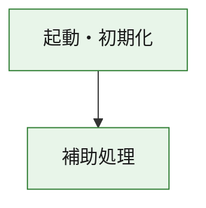
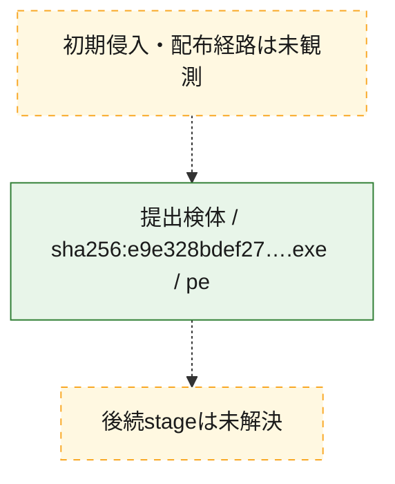
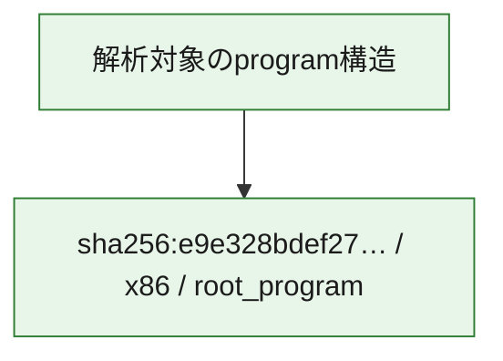

# 全体ロジック：e9e328bdef27c1cfea4939140024f87ca909541222bf0d2ed1f56019295b764b

代表関数の静的証跡から、起動・初期化の処理群を確認しました。

## 読み方

- phaseの掲載順は解析上の整理順です。observed_call_edgesがない段階間の実行順を断定しません。
- 図の実線は静的に観測した関係、点線と黄色のノードは未観測・未解決の関係を示します。
- 図は静的な要約であり、動的実行を再現するものではありません。
- 詳細な関数解説とfingerprintは[STATIC-LOGIC.md](STATIC-LOGIC.md)を参照してください。

## 静的可視化

### 実行フロー

### 感染チェーン

### モジュール関係

## 処理段階

### 1. 起動・初期化

entry pointから初期化と後続処理への移行を確認します。
確度: `confirmed_static_function_evidence`

- `e9e328bdef27c1cfea4939140024f87ca909541222bf0d2ed1f56019295b764b:ghidra:180001010` — 初期化と主要処理への分岐を行う入口関数です。 状態: `succeeded`、選定理由: `entry_point`, `meaningful_symbol_name`, `reviewed_call_centrality:22`, `role:entrypoint`, `small_program_complete_context`

### 2. 補助処理

主要処理を支える一般内部関数またはlibrary処理を確認します。
確度: `confirmed_static_function_evidence`

- `e9e328bdef27c1cfea4939140024f87ca909541222bf0d2ed1f56019295b764b:ghidra:180001240` — 検体内部の一般処理を実装する関数です。 状態: `succeeded`、選定理由: `context_representative`, `reviewed_call_centrality:2`, `small_program_complete_context`
- `e9e328bdef27c1cfea4939140024f87ca909541222bf0d2ed1f56019295b764b:ghidra:180001350` — 検体内部の一般処理を実装する関数です。 状態: `succeeded`、選定理由: `context_representative`, `reviewed_call_centrality:25`, `small_program_complete_context`
- `e9e328bdef27c1cfea4939140024f87ca909541222bf0d2ed1f56019295b764b:ghidra:180003780` — 検体内部の一般処理を実装する関数です。 状態: `succeeded`、選定理由: `context_representative`, `reviewed_call_centrality:2`, `small_program_complete_context`
- `e9e328bdef27c1cfea4939140024f87ca909541222bf0d2ed1f56019295b764b:ghidra:1800038e0` — 検体内部の一般処理を実装する関数です。 状態: `succeeded`、選定理由: `context_representative`, `reviewed_call_centrality:2`, `small_program_complete_context`

## 観測したcall関係

- `e9e328bdef27c1cfea4939140024f87ca909541222bf0d2ed1f56019295b764b:ghidra:180001010` → `e9e328bdef27c1cfea4939140024f87ca909541222bf0d2ed1f56019295b764b:ghidra:180001240` （`startup` → `support`）
- `e9e328bdef27c1cfea4939140024f87ca909541222bf0d2ed1f56019295b764b:ghidra:180001010` → `e9e328bdef27c1cfea4939140024f87ca909541222bf0d2ed1f56019295b764b:ghidra:180001350` （`startup` → `support`）
- `e9e328bdef27c1cfea4939140024f87ca909541222bf0d2ed1f56019295b764b:ghidra:180001350` → `e9e328bdef27c1cfea4939140024f87ca909541222bf0d2ed1f56019295b764b:ghidra:180001240` （`support` → `support`）
- `e9e328bdef27c1cfea4939140024f87ca909541222bf0d2ed1f56019295b764b:ghidra:180001350` → `e9e328bdef27c1cfea4939140024f87ca909541222bf0d2ed1f56019295b764b:ghidra:180003780` （`support` → `support`）
- `e9e328bdef27c1cfea4939140024f87ca909541222bf0d2ed1f56019295b764b:ghidra:180001350` → `e9e328bdef27c1cfea4939140024f87ca909541222bf0d2ed1f56019295b764b:ghidra:1800038e0` （`support` → `support`）
- `e9e328bdef27c1cfea4939140024f87ca909541222bf0d2ed1f56019295b764b:ghidra:180003780` → `e9e328bdef27c1cfea4939140024f87ca909541222bf0d2ed1f56019295b764b:ghidra:1800038e0` （`support` → `support`）
- `ghidra-function:40eee83e374f9fab41769e29` → `ghidra-external:01190684ef05f2e085499002` （`unclassified` → `unclassified`）
- `ghidra-function:40eee83e374f9fab41769e29` → `ghidra-external:0591c5de891c02a6f099b78b` （`unclassified` → `unclassified`）
- `ghidra-function:40eee83e374f9fab41769e29` → `ghidra-external:193f206b66aa48db921502c5` （`unclassified` → `unclassified`）
- `ghidra-function:40eee83e374f9fab41769e29` → `ghidra-external:1a366849d2542b4123bfd11b` （`unclassified` → `unclassified`）
- `ghidra-function:40eee83e374f9fab41769e29` → `ghidra-external:1c382b8ef03167b956aed53d` （`unclassified` → `unclassified`）
- `ghidra-function:40eee83e374f9fab41769e29` → `ghidra-external:1f03e7e86ac1aad288592f2f` （`unclassified` → `unclassified`）
- `ghidra-function:40eee83e374f9fab41769e29` → `ghidra-external:34b4d2b2be1934a8b145b755` （`unclassified` → `unclassified`）
- `ghidra-function:40eee83e374f9fab41769e29` → `ghidra-external:485fa6c4c0c0b1f125f096d5` （`unclassified` → `unclassified`）
- `ghidra-function:40eee83e374f9fab41769e29` → `ghidra-external:48a4d52f0b1701878f6d56c2` （`unclassified` → `unclassified`）
- `ghidra-function:40eee83e374f9fab41769e29` → `ghidra-external:85e66e61211f75c18dd24d47` （`unclassified` → `unclassified`）
- `ghidra-function:40eee83e374f9fab41769e29` → `ghidra-external:8756a058461cbc1f70e4ec5e` （`unclassified` → `unclassified`）
- `ghidra-function:40eee83e374f9fab41769e29` → `ghidra-external:98e37725bfc06633ec346578` （`unclassified` → `unclassified`）
- `ghidra-function:40eee83e374f9fab41769e29` → `ghidra-external:9d974b1d9ff261ffa8ff8c09` （`unclassified` → `unclassified`）
- `ghidra-function:40eee83e374f9fab41769e29` → `ghidra-external:a77af1b604f8709c4439530a` （`unclassified` → `unclassified`）
- `ghidra-function:40eee83e374f9fab41769e29` → `ghidra-external:c5b7ea6febc85aa6dbb74484` （`unclassified` → `unclassified`）
- `ghidra-function:40eee83e374f9fab41769e29` → `ghidra-external:c74045f7811b9f21fc044eb0` （`unclassified` → `unclassified`）
- `ghidra-function:40eee83e374f9fab41769e29` → `ghidra-external:d3a29f6852bfc08889bb626e` （`unclassified` → `unclassified`）
- `ghidra-function:40eee83e374f9fab41769e29` → `ghidra-external:d4c8a70e6cd2db9b81c33ffa` （`unclassified` → `unclassified`）
- `ghidra-function:40eee83e374f9fab41769e29` → `ghidra-external:dc3f6026ab2d17451dfb2d7f` （`unclassified` → `unclassified`）
- `ghidra-function:40eee83e374f9fab41769e29` → `ghidra-external:eb2fd9b9d651b76eabfe61a2` （`unclassified` → `unclassified`）
- `ghidra-function:40eee83e374f9fab41769e29` → `ghidra-external:ebbdc75f48e3956b3995340f` （`unclassified` → `unclassified`）
- `ghidra-function:40eee83e374f9fab41769e29` → `ghidra-function:3238010cb27793fb55ff92f2` （`unclassified` → `unclassified`）
- `ghidra-function:40eee83e374f9fab41769e29` → `ghidra-function:4f03850ce6a6aea0578065bd` （`unclassified` → `unclassified`）
- `ghidra-function:40eee83e374f9fab41769e29` → `ghidra-function:6005f30586641be951711811` （`unclassified` → `unclassified`）
- `ghidra-function:4f03850ce6a6aea0578065bd` → `ghidra-function:6005f30586641be951711811` （`unclassified` → `unclassified`）
- `ghidra-function:85ef8444bfd8805bf0392dce` → `ghidra-function:1d5efca1622e2def7522905e` （`unclassified` → `unclassified`）
- `ghidra-function:85ef8444bfd8805bf0392dce` → `ghidra-function:21dd9a148f209919bb6cf45f` （`unclassified` → `unclassified`）
- `ghidra-function:85ef8444bfd8805bf0392dce` → `ghidra-function:25dd10b5d069e09c2fa5ccd3` （`unclassified` → `unclassified`）
- `ghidra-function:85ef8444bfd8805bf0392dce` → `ghidra-function:3238010cb27793fb55ff92f2` （`unclassified` → `unclassified`）
- `ghidra-function:85ef8444bfd8805bf0392dce` → `ghidra-function:40eee83e374f9fab41769e29` （`unclassified` → `unclassified`）
- `ghidra-function:85ef8444bfd8805bf0392dce` → `ghidra-function:4a063bab3d5c3d1619fd61c3` （`unclassified` → `unclassified`）
- `ghidra-function:85ef8444bfd8805bf0392dce` → `ghidra-function:b50b43a97f566143be4e72f3` （`unclassified` → `unclassified`）
- `ghidra-function:85ef8444bfd8805bf0392dce` → `ghidra-function:b540e0488a9de96f488a7682` （`unclassified` → `unclassified`）
- `ghidra-function:85ef8444bfd8805bf0392dce` → `ghidra-function:bf1ead59bf82f429134e58b7` （`unclassified` → `unclassified`）
- `ghidra-function:85ef8444bfd8805bf0392dce` → `ghidra-function:caaef33cae6c2c063d5747f8` （`unclassified` → `unclassified`）
- `ghidra-function:85ef8444bfd8805bf0392dce` → `ghidra-function:d9847e3b0456e91279df1dfd` （`unclassified` → `unclassified`）
- `ghidra-function:85ef8444bfd8805bf0392dce` → `ghidra-function:dedf1e801411e1f5ebc78bc0` （`unclassified` → `unclassified`）

## 解析範囲と制約

- 選定外関数は全体inventoryへ残しますが、関数本体の個別解説対象にはしていません。
- indirect call、難読化、packer、VM、壊れたcontrol flowによりcall関係が欠落する場合があります。
- 文書は静的解析に基づき、検体実行や外部通信による動的確認は行っていません。
