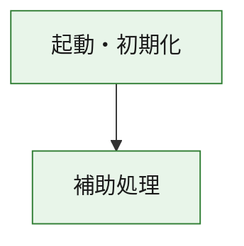
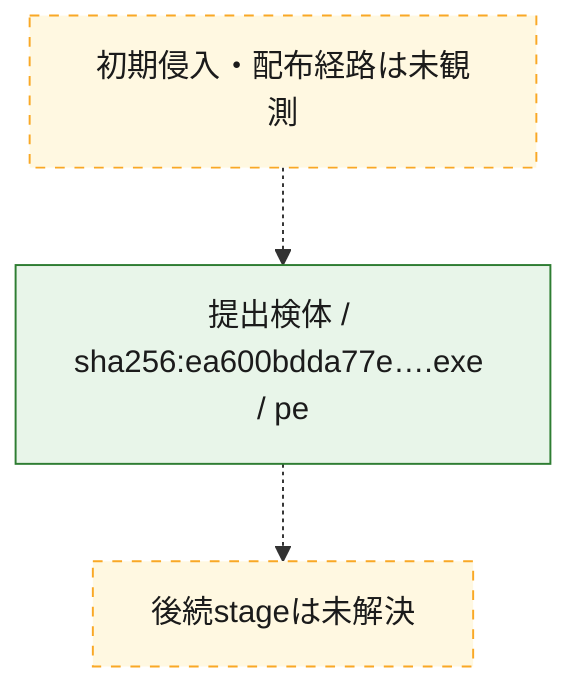
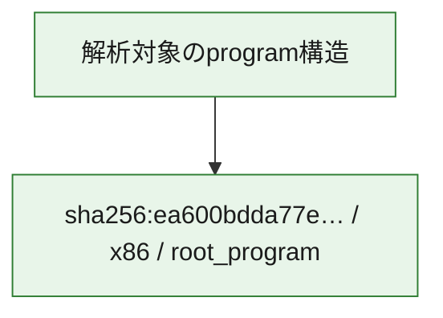

# 全体ロジック：ea600bdda77ebeaa723eeecbe72babb251e3a9968eaa7fbf85d366deb7b50d03

代表関数の静的証跡から、起動・初期化の処理群を確認しました。

## 読み方

- phaseの掲載順は解析上の整理順です。observed_call_edgesがない段階間の実行順を断定しません。
- 図の実線は静的に観測した関係、点線と黄色のノードは未観測・未解決の関係を示します。
- 図は静的な要約であり、動的実行を再現するものではありません。
- 詳細な関数解説とfingerprintは[STATIC-LOGIC.md](STATIC-LOGIC.md)を参照してください。

## 静的可視化

### 実行フロー

### 感染チェーン

### モジュール関係

## 処理段階

### 1. 起動・初期化

entry pointから初期化と後続処理への移行を確認します。
確度: `confirmed_static_function_evidence`

- `ea600bdda77ebeaa723eeecbe72babb251e3a9968eaa7fbf85d366deb7b50d03:ghidra:180001010` — 初期化と主要処理への分岐を行う入口関数です。 状態: `succeeded`、選定理由: `entry_point`, `meaningful_symbol_name`, `reviewed_call_centrality:22`, `role:entrypoint`, `small_program_complete_context`

### 2. 補助処理

主要処理を支える一般内部関数またはlibrary処理を確認します。
確度: `confirmed_static_function_evidence`

- `ea600bdda77ebeaa723eeecbe72babb251e3a9968eaa7fbf85d366deb7b50d03:ghidra:180001240` — 検体内部の一般処理を実装する関数です。 状態: `succeeded`、選定理由: `context_representative`, `reviewed_call_centrality:2`, `small_program_complete_context`
- `ea600bdda77ebeaa723eeecbe72babb251e3a9968eaa7fbf85d366deb7b50d03:ghidra:180001350` — 検体内部の一般処理を実装する関数です。 状態: `succeeded`、選定理由: `context_representative`, `reviewed_call_centrality:25`, `small_program_complete_context`
- `ea600bdda77ebeaa723eeecbe72babb251e3a9968eaa7fbf85d366deb7b50d03:ghidra:180003780` — 検体内部の一般処理を実装する関数です。 状態: `succeeded`、選定理由: `context_representative`, `reviewed_call_centrality:2`, `small_program_complete_context`
- `ea600bdda77ebeaa723eeecbe72babb251e3a9968eaa7fbf85d366deb7b50d03:ghidra:1800038e0` — 検体内部の一般処理を実装する関数です。 状態: `succeeded`、選定理由: `context_representative`, `reviewed_call_centrality:2`, `small_program_complete_context`

## 観測したcall関係

- `ea600bdda77ebeaa723eeecbe72babb251e3a9968eaa7fbf85d366deb7b50d03:ghidra:180001010` → `ea600bdda77ebeaa723eeecbe72babb251e3a9968eaa7fbf85d366deb7b50d03:ghidra:180001240` （`startup` → `support`）
- `ea600bdda77ebeaa723eeecbe72babb251e3a9968eaa7fbf85d366deb7b50d03:ghidra:180001010` → `ea600bdda77ebeaa723eeecbe72babb251e3a9968eaa7fbf85d366deb7b50d03:ghidra:180001350` （`startup` → `support`）
- `ea600bdda77ebeaa723eeecbe72babb251e3a9968eaa7fbf85d366deb7b50d03:ghidra:180001350` → `ea600bdda77ebeaa723eeecbe72babb251e3a9968eaa7fbf85d366deb7b50d03:ghidra:180001240` （`support` → `support`）
- `ea600bdda77ebeaa723eeecbe72babb251e3a9968eaa7fbf85d366deb7b50d03:ghidra:180001350` → `ea600bdda77ebeaa723eeecbe72babb251e3a9968eaa7fbf85d366deb7b50d03:ghidra:180003780` （`support` → `support`）
- `ea600bdda77ebeaa723eeecbe72babb251e3a9968eaa7fbf85d366deb7b50d03:ghidra:180001350` → `ea600bdda77ebeaa723eeecbe72babb251e3a9968eaa7fbf85d366deb7b50d03:ghidra:1800038e0` （`support` → `support`）
- `ea600bdda77ebeaa723eeecbe72babb251e3a9968eaa7fbf85d366deb7b50d03:ghidra:180003780` → `ea600bdda77ebeaa723eeecbe72babb251e3a9968eaa7fbf85d366deb7b50d03:ghidra:1800038e0` （`support` → `support`）
- `ghidra-function:0b940ad9dbc62419edc3c051` → `ghidra-function:76c34f9b35bef0ce8bba0516` （`unclassified` → `unclassified`）
- `ghidra-function:67c5626c3e52a2dd91c47512` → `ghidra-function:02397abaf229c63c7970c83c` （`unclassified` → `unclassified`）
- `ghidra-function:67c5626c3e52a2dd91c47512` → `ghidra-function:076a34f8fbb1b71188a84a38` （`unclassified` → `unclassified`）
- `ghidra-function:67c5626c3e52a2dd91c47512` → `ghidra-function:0e8f865aff0517b313096120` （`unclassified` → `unclassified`）
- `ghidra-function:67c5626c3e52a2dd91c47512` → `ghidra-function:279e51630cc63360a8cc878c` （`unclassified` → `unclassified`）
- `ghidra-function:67c5626c3e52a2dd91c47512` → `ghidra-function:314bc93d71e3657c3fdc8b93` （`unclassified` → `unclassified`）
- `ghidra-function:67c5626c3e52a2dd91c47512` → `ghidra-function:368a7b8c5ba5742ea974db31` （`unclassified` → `unclassified`）
- `ghidra-function:67c5626c3e52a2dd91c47512` → `ghidra-function:8fc0ea52c4867a2591b2828d` （`unclassified` → `unclassified`）
- `ghidra-function:67c5626c3e52a2dd91c47512` → `ghidra-function:dc27647b28a5244db93df998` （`unclassified` → `unclassified`）
- `ghidra-function:67c5626c3e52a2dd91c47512` → `ghidra-function:e5c2d20fa2f0bac33f4eeffc` （`unclassified` → `unclassified`）
- `ghidra-function:67c5626c3e52a2dd91c47512` → `ghidra-function:ee3237451dc2d39740a10df9` （`unclassified` → `unclassified`）
- `ghidra-function:67c5626c3e52a2dd91c47512` → `ghidra-function:f157c790ced514463c0a4c1a` （`unclassified` → `unclassified`）
- `ghidra-function:67c5626c3e52a2dd91c47512` → `ghidra-function:fa70138998039498c20f163a` （`unclassified` → `unclassified`）
- `ghidra-function:f157c790ced514463c0a4c1a` → `ghidra-external:04cd161da44f0f139e1e574d` （`unclassified` → `unclassified`）
- `ghidra-function:f157c790ced514463c0a4c1a` → `ghidra-external:0c3463dcfd41bd82c5aa033e` （`unclassified` → `unclassified`）
- `ghidra-function:f157c790ced514463c0a4c1a` → `ghidra-external:1aedd59a1a22e3c77d191147` （`unclassified` → `unclassified`）
- `ghidra-function:f157c790ced514463c0a4c1a` → `ghidra-external:28e0a925427dde972f491732` （`unclassified` → `unclassified`）
- `ghidra-function:f157c790ced514463c0a4c1a` → `ghidra-external:30cf3177db41834e7b311083` （`unclassified` → `unclassified`）
- `ghidra-function:f157c790ced514463c0a4c1a` → `ghidra-external:3a2c98fce5936f9b2ca21655` （`unclassified` → `unclassified`）
- `ghidra-function:f157c790ced514463c0a4c1a` → `ghidra-external:3ba5b247a33a1a5507f30b96` （`unclassified` → `unclassified`）
- `ghidra-function:f157c790ced514463c0a4c1a` → `ghidra-external:567cdd2e220ea6237b055a5a` （`unclassified` → `unclassified`）
- `ghidra-function:f157c790ced514463c0a4c1a` → `ghidra-external:585b0f6ca47221518e8fc40f` （`unclassified` → `unclassified`）
- `ghidra-function:f157c790ced514463c0a4c1a` → `ghidra-external:65545d5b11694865794777f2` （`unclassified` → `unclassified`）
- `ghidra-function:f157c790ced514463c0a4c1a` → `ghidra-external:80a3999f525ff7e226964795` （`unclassified` → `unclassified`）
- `ghidra-function:f157c790ced514463c0a4c1a` → `ghidra-external:99e2ea8fa147033177f02f67` （`unclassified` → `unclassified`）
- `ghidra-function:f157c790ced514463c0a4c1a` → `ghidra-external:a073ce50f12d753524ce362d` （`unclassified` → `unclassified`）
- `ghidra-function:f157c790ced514463c0a4c1a` → `ghidra-external:a538e8e6238894dbaea4974c` （`unclassified` → `unclassified`）
- `ghidra-function:f157c790ced514463c0a4c1a` → `ghidra-external:ab07c4eddabfe223fd4428b0` （`unclassified` → `unclassified`）
- `ghidra-function:f157c790ced514463c0a4c1a` → `ghidra-external:adc6a58b74414f5bb8deacef` （`unclassified` → `unclassified`）
- `ghidra-function:f157c790ced514463c0a4c1a` → `ghidra-external:c31ed53297f62bc281e3a786` （`unclassified` → `unclassified`）
- `ghidra-function:f157c790ced514463c0a4c1a` → `ghidra-external:ca941ba34871d24d55e4449d` （`unclassified` → `unclassified`）
- `ghidra-function:f157c790ced514463c0a4c1a` → `ghidra-external:d42530ee467345ab7dca26ff` （`unclassified` → `unclassified`）
- `ghidra-function:f157c790ced514463c0a4c1a` → `ghidra-external:da9381be0822ac3d948d686e` （`unclassified` → `unclassified`）
- `ghidra-function:f157c790ced514463c0a4c1a` → `ghidra-external:f20aa859de33f0871ec085f3` （`unclassified` → `unclassified`）
- `ghidra-function:f157c790ced514463c0a4c1a` → `ghidra-function:076a34f8fbb1b71188a84a38` （`unclassified` → `unclassified`）
- `ghidra-function:f157c790ced514463c0a4c1a` → `ghidra-function:0b940ad9dbc62419edc3c051` （`unclassified` → `unclassified`）
- `ghidra-function:f157c790ced514463c0a4c1a` → `ghidra-function:76c34f9b35bef0ce8bba0516` （`unclassified` → `unclassified`）

## 解析範囲と制約

- 選定外関数は全体inventoryへ残しますが、関数本体の個別解説対象にはしていません。
- indirect call、難読化、packer、VM、壊れたcontrol flowによりcall関係が欠落する場合があります。
- 文書は静的解析に基づき、検体実行や外部通信による動的確認は行っていません。
