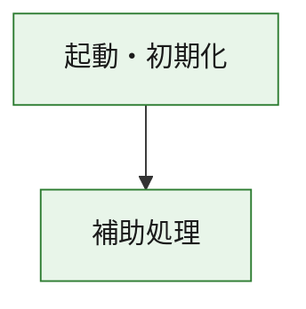
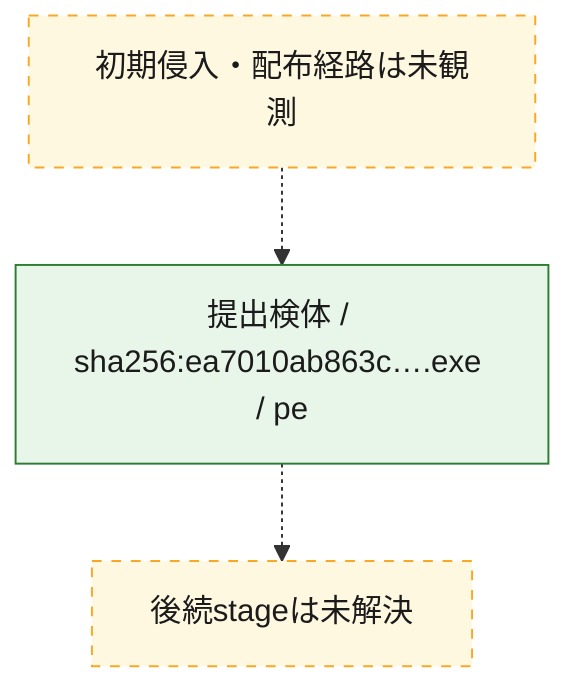
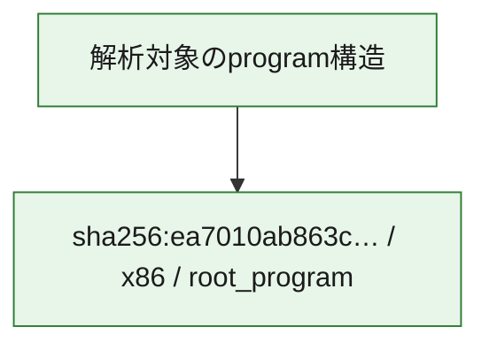

# 全体ロジック：ea7010ab863c15d2690780a5b2c8052b7cd654000d5a714f12c7d5b97440dae0

代表関数の静的証跡から、起動・初期化の処理群を確認しました。

## 読み方

- phaseの掲載順は解析上の整理順です。observed_call_edgesがない段階間の実行順を断定しません。
- 図の実線は静的に観測した関係、点線と黄色のノードは未観測・未解決の関係を示します。
- 図は静的な要約であり、動的実行を再現するものではありません。
- 詳細な関数解説とfingerprintは[STATIC-LOGIC.md](STATIC-LOGIC.md)を参照してください。

## 静的可視化

### 実行フロー

### 感染チェーン

### モジュール関係

## 処理段階

### 1. 起動・初期化

entry pointから初期化と後続処理への移行を確認します。
確度: `confirmed_static_function_evidence`

- `ea7010ab863c15d2690780a5b2c8052b7cd654000d5a714f12c7d5b97440dae0:ghidra:180001010` — 初期化と主要処理への分岐を行う入口関数です。 状態: `succeeded`、選定理由: `entry_point`, `meaningful_symbol_name`, `reviewed_call_centrality:22`, `role:entrypoint`, `small_program_complete_context`

### 2. 補助処理

主要処理を支える一般内部関数またはlibrary処理を確認します。
確度: `confirmed_static_function_evidence`

- `ea7010ab863c15d2690780a5b2c8052b7cd654000d5a714f12c7d5b97440dae0:ghidra:180001240` — 検体内部の一般処理を実装する関数です。 状態: `succeeded`、選定理由: `context_representative`, `reviewed_call_centrality:2`, `small_program_complete_context`
- `ea7010ab863c15d2690780a5b2c8052b7cd654000d5a714f12c7d5b97440dae0:ghidra:180001350` — 検体内部の一般処理を実装する関数です。 状態: `succeeded`、選定理由: `context_representative`, `reviewed_call_centrality:25`, `small_program_complete_context`
- `ea7010ab863c15d2690780a5b2c8052b7cd654000d5a714f12c7d5b97440dae0:ghidra:180003780` — 検体内部の一般処理を実装する関数です。 状態: `succeeded`、選定理由: `context_representative`, `reviewed_call_centrality:2`, `small_program_complete_context`
- `ea7010ab863c15d2690780a5b2c8052b7cd654000d5a714f12c7d5b97440dae0:ghidra:1800038e0` — 検体内部の一般処理を実装する関数です。 状態: `succeeded`、選定理由: `context_representative`, `reviewed_call_centrality:2`, `small_program_complete_context`

## 観測したcall関係

- `ea7010ab863c15d2690780a5b2c8052b7cd654000d5a714f12c7d5b97440dae0:ghidra:180001010` → `ea7010ab863c15d2690780a5b2c8052b7cd654000d5a714f12c7d5b97440dae0:ghidra:180001240` （`startup` → `support`）
- `ea7010ab863c15d2690780a5b2c8052b7cd654000d5a714f12c7d5b97440dae0:ghidra:180001010` → `ea7010ab863c15d2690780a5b2c8052b7cd654000d5a714f12c7d5b97440dae0:ghidra:180001350` （`startup` → `support`）
- `ea7010ab863c15d2690780a5b2c8052b7cd654000d5a714f12c7d5b97440dae0:ghidra:180001350` → `ea7010ab863c15d2690780a5b2c8052b7cd654000d5a714f12c7d5b97440dae0:ghidra:180001240` （`support` → `support`）
- `ea7010ab863c15d2690780a5b2c8052b7cd654000d5a714f12c7d5b97440dae0:ghidra:180001350` → `ea7010ab863c15d2690780a5b2c8052b7cd654000d5a714f12c7d5b97440dae0:ghidra:180003780` （`support` → `support`）
- `ea7010ab863c15d2690780a5b2c8052b7cd654000d5a714f12c7d5b97440dae0:ghidra:180001350` → `ea7010ab863c15d2690780a5b2c8052b7cd654000d5a714f12c7d5b97440dae0:ghidra:1800038e0` （`support` → `support`）
- `ea7010ab863c15d2690780a5b2c8052b7cd654000d5a714f12c7d5b97440dae0:ghidra:180003780` → `ea7010ab863c15d2690780a5b2c8052b7cd654000d5a714f12c7d5b97440dae0:ghidra:1800038e0` （`support` → `support`）
- `ghidra-function:826d3dab29383ed5a47b380e` → `ghidra-function:1b6ea445a901206fb7db7267` （`unclassified` → `unclassified`）
- `ghidra-function:a6f62ffc98da5076616d4c13` → `ghidra-function:0760effe71f8c3a0d721a457` （`unclassified` → `unclassified`）
- `ghidra-function:a6f62ffc98da5076616d4c13` → `ghidra-function:24c7f166b255b49a781d69a5` （`unclassified` → `unclassified`）
- `ghidra-function:a6f62ffc98da5076616d4c13` → `ghidra-function:24f5785bcb8449447ff73048` （`unclassified` → `unclassified`）
- `ghidra-function:a6f62ffc98da5076616d4c13` → `ghidra-function:302500ddcedc470bc1e7010c` （`unclassified` → `unclassified`）
- `ghidra-function:a6f62ffc98da5076616d4c13` → `ghidra-function:3cc669d86a97a4a72bd07978` （`unclassified` → `unclassified`）
- `ghidra-function:a6f62ffc98da5076616d4c13` → `ghidra-function:66f4de38dca49a14fb087460` （`unclassified` → `unclassified`）
- `ghidra-function:a6f62ffc98da5076616d4c13` → `ghidra-function:73bbfce18f35c7aef75a2660` （`unclassified` → `unclassified`）
- `ghidra-function:a6f62ffc98da5076616d4c13` → `ghidra-function:8c55b4323675c57d9b80ff8f` （`unclassified` → `unclassified`）
- `ghidra-function:a6f62ffc98da5076616d4c13` → `ghidra-function:a34bcbe91c0f4d0fdf013550` （`unclassified` → `unclassified`）
- `ghidra-function:a6f62ffc98da5076616d4c13` → `ghidra-function:d6c597f26168e5332de877cc` （`unclassified` → `unclassified`）
- `ghidra-function:a6f62ffc98da5076616d4c13` → `ghidra-function:ed0c5c80d21e52b01d3c6730` （`unclassified` → `unclassified`）
- `ghidra-function:a6f62ffc98da5076616d4c13` → `ghidra-function:ee8f1f9d787c138280e3c79c` （`unclassified` → `unclassified`）
- `ghidra-function:ed0c5c80d21e52b01d3c6730` → `ghidra-external:0edf4ee2898a7f142f0adbec` （`unclassified` → `unclassified`）
- `ghidra-function:ed0c5c80d21e52b01d3c6730` → `ghidra-external:17197aec47d6285c699f0913` （`unclassified` → `unclassified`）
- `ghidra-function:ed0c5c80d21e52b01d3c6730` → `ghidra-external:179723d339bea0452096a2a0` （`unclassified` → `unclassified`）
- `ghidra-function:ed0c5c80d21e52b01d3c6730` → `ghidra-external:3e62739380f3fecad1994042` （`unclassified` → `unclassified`）
- `ghidra-function:ed0c5c80d21e52b01d3c6730` → `ghidra-external:450f37e565c0e95f2d34ced3` （`unclassified` → `unclassified`）
- `ghidra-function:ed0c5c80d21e52b01d3c6730` → `ghidra-external:68e2f81de5071119777c8d7d` （`unclassified` → `unclassified`）
- `ghidra-function:ed0c5c80d21e52b01d3c6730` → `ghidra-external:69ca27ffd7b9ebf146b847f1` （`unclassified` → `unclassified`）
- `ghidra-function:ed0c5c80d21e52b01d3c6730` → `ghidra-external:9181e25edcabd96043a0ce05` （`unclassified` → `unclassified`）
- `ghidra-function:ed0c5c80d21e52b01d3c6730` → `ghidra-external:9330e4e718b4bb37b883d4d2` （`unclassified` → `unclassified`）
- `ghidra-function:ed0c5c80d21e52b01d3c6730` → `ghidra-external:a2113da5320b0d2d2da4e87d` （`unclassified` → `unclassified`）
- `ghidra-function:ed0c5c80d21e52b01d3c6730` → `ghidra-external:a736ea4ffd65d7145dd404a7` （`unclassified` → `unclassified`）
- `ghidra-function:ed0c5c80d21e52b01d3c6730` → `ghidra-external:b0daff9e90bd5d542e26a843` （`unclassified` → `unclassified`）
- `ghidra-function:ed0c5c80d21e52b01d3c6730` → `ghidra-external:be650aefb2e038dd3773697b` （`unclassified` → `unclassified`）
- `ghidra-function:ed0c5c80d21e52b01d3c6730` → `ghidra-external:c190f016119285e405981cc2` （`unclassified` → `unclassified`）
- `ghidra-function:ed0c5c80d21e52b01d3c6730` → `ghidra-external:c95cdd667d2937bc70bd883c` （`unclassified` → `unclassified`）
- `ghidra-function:ed0c5c80d21e52b01d3c6730` → `ghidra-external:cd21e37ae456fc5432793abf` （`unclassified` → `unclassified`）
- `ghidra-function:ed0c5c80d21e52b01d3c6730` → `ghidra-external:dbd0193347bc7ef598287e89` （`unclassified` → `unclassified`）
- `ghidra-function:ed0c5c80d21e52b01d3c6730` → `ghidra-external:e210acecdd5e378717a5cf76` （`unclassified` → `unclassified`）
- `ghidra-function:ed0c5c80d21e52b01d3c6730` → `ghidra-external:e3af647170e737f5aa14a5cd` （`unclassified` → `unclassified`）
- `ghidra-function:ed0c5c80d21e52b01d3c6730` → `ghidra-external:e936d24250948b041303f92a` （`unclassified` → `unclassified`）
- `ghidra-function:ed0c5c80d21e52b01d3c6730` → `ghidra-external:fd941f745b5975ec9da16f19` （`unclassified` → `unclassified`）
- `ghidra-function:ed0c5c80d21e52b01d3c6730` → `ghidra-function:1b6ea445a901206fb7db7267` （`unclassified` → `unclassified`）
- `ghidra-function:ed0c5c80d21e52b01d3c6730` → `ghidra-function:302500ddcedc470bc1e7010c` （`unclassified` → `unclassified`）
- `ghidra-function:ed0c5c80d21e52b01d3c6730` → `ghidra-function:826d3dab29383ed5a47b380e` （`unclassified` → `unclassified`）

## 解析範囲と制約

- 選定外関数は全体inventoryへ残しますが、関数本体の個別解説対象にはしていません。
- indirect call、難読化、packer、VM、壊れたcontrol flowによりcall関係が欠落する場合があります。
- 文書は静的解析に基づき、検体実行や外部通信による動的確認は行っていません。
