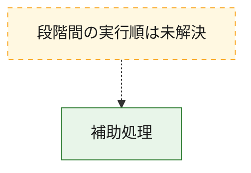
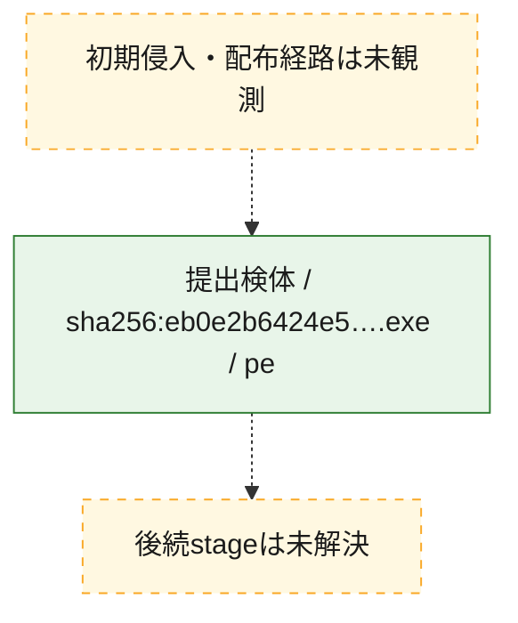
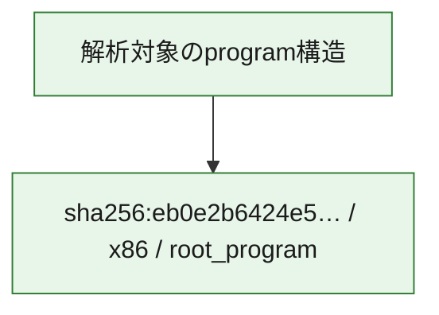

# 全体ロジック：eb0e2b6424e5ec1eb95d183a0f7022ab8044bf610972105289b8113ece084826

代表関数から主要なmalware処理段階を自動分類できませんでした。

## 読み方

- phaseの掲載順は解析上の整理順です。observed_call_edgesがない段階間の実行順を断定しません。
- 図の実線は静的に観測した関係、点線と黄色のノードは未観測・未解決の関係を示します。
- 図は静的な要約であり、動的実行を再現するものではありません。
- 詳細な関数解説とfingerprintは[STATIC-LOGIC.md](STATIC-LOGIC.md)を参照してください。

## 静的可視化

### 実行フロー

### 感染チェーン

### モジュール関係

## 処理段階

### 1. 補助処理

主要処理を支える一般内部関数またはlibrary処理を確認します。
確度: `confirmed_static_function_evidence`

- `eb0e2b6424e5ec1eb95d183a0f7022ab8044bf610972105289b8113ece084826:ghidra:140001080` — 検体内部の一般処理を実装する関数です。 状態: `succeeded`、選定理由: `context_representative`, `reviewed_call_centrality:4`
- `eb0e2b6424e5ec1eb95d183a0f7022ab8044bf610972105289b8113ece084826:ghidra:140001180` — 検体内部の一般処理を実装する関数です。 状態: `succeeded`、選定理由: `context_representative`, `reviewed_call_centrality:2`
- `eb0e2b6424e5ec1eb95d183a0f7022ab8044bf610972105289b8113ece084826:ghidra:1400012e0` — 検体内部の一般処理を実装する関数です。 状態: `succeeded`、選定理由: `context_representative`, `reviewed_call_centrality:2`
- `eb0e2b6424e5ec1eb95d183a0f7022ab8044bf610972105289b8113ece084826:ghidra:140001320` — 検体内部の一般処理を実装する関数です。 状態: `succeeded`、選定理由: `context_representative`, `reviewed_call_centrality:4`
- `eb0e2b6424e5ec1eb95d183a0f7022ab8044bf610972105289b8113ece084826:ghidra:1400013a0` — 検体内部の一般処理を実装する関数です。 状態: `succeeded`、選定理由: `context_representative`, `reviewed_call_centrality:4`
- `eb0e2b6424e5ec1eb95d183a0f7022ab8044bf610972105289b8113ece084826:ghidra:140001440` — 検体内部の一般処理を実装する関数です。 状態: `succeeded`、選定理由: `context_representative`, `reviewed_call_centrality:4`
- `eb0e2b6424e5ec1eb95d183a0f7022ab8044bf610972105289b8113ece084826:ghidra:140001540` — 検体内部の一般処理を実装する関数です。 状態: `succeeded`、選定理由: `context_representative`, `reviewed_call_centrality:7`
- `eb0e2b6424e5ec1eb95d183a0f7022ab8044bf610972105289b8113ece084826:ghidra:1400019a0` — 検体内部の一般処理を実装する関数です。 状態: `succeeded`、選定理由: `context_representative`, `reviewed_call_centrality:3`
- `eb0e2b6424e5ec1eb95d183a0f7022ab8044bf610972105289b8113ece084826:ghidra:140001b00` — 検体内部の一般処理を実装する関数です。 状態: `succeeded`、選定理由: `context_representative`, `reviewed_call_centrality:2`
- `eb0e2b6424e5ec1eb95d183a0f7022ab8044bf610972105289b8113ece084826:ghidra:140001b80` — 検体内部の一般処理を実装する関数です。 状態: `succeeded`、選定理由: `context_representative`, `reviewed_call_centrality:3`
- `eb0e2b6424e5ec1eb95d183a0f7022ab8044bf610972105289b8113ece084826:ghidra:140001be0` — 検体内部の一般処理を実装する関数です。 状態: `succeeded`、選定理由: `context_representative`, `reviewed_call_centrality:8`
- `eb0e2b6424e5ec1eb95d183a0f7022ab8044bf610972105289b8113ece084826:ghidra:1400020e0` — 検体内部の一般処理を実装する関数です。 状態: `succeeded`、選定理由: `context_representative`, `reviewed_call_centrality:11`
- `eb0e2b6424e5ec1eb95d183a0f7022ab8044bf610972105289b8113ece084826:ghidra:140002c60` — 検体内部の一般処理を実装する関数です。 状態: `succeeded`、選定理由: `context_representative`, `reviewed_call_centrality:2`
- `eb0e2b6424e5ec1eb95d183a0f7022ab8044bf610972105289b8113ece084826:ghidra:140002ce0` — 検体内部の一般処理を実装する関数です。 状態: `succeeded`、選定理由: `context_representative`, `reviewed_call_centrality:2`
- `eb0e2b6424e5ec1eb95d183a0f7022ab8044bf610972105289b8113ece084826:ghidra:140003d00` — 検体内部の一般処理を実装する関数です。 状態: `succeeded`、選定理由: `context_representative`, `reviewed_call_centrality:1`
- `eb0e2b6424e5ec1eb95d183a0f7022ab8044bf610972105289b8113ece084826:ghidra:140003d40` — 検体内部の一般処理を実装する関数です。 状態: `succeeded`、選定理由: `context_representative`, `reviewed_call_centrality:1`
- `eb0e2b6424e5ec1eb95d183a0f7022ab8044bf610972105289b8113ece084826:ghidra:140003d80` — 検体内部の一般処理を実装する関数です。 状態: `succeeded`、選定理由: `context_representative`, `reviewed_call_centrality:5`
- `eb0e2b6424e5ec1eb95d183a0f7022ab8044bf610972105289b8113ece084826:ghidra:140003f60` — 検体内部の一般処理を実装する関数です。 状態: `succeeded`、選定理由: `context_representative`, `reviewed_call_centrality:10`
- `eb0e2b6424e5ec1eb95d183a0f7022ab8044bf610972105289b8113ece084826:ghidra:1400041a0` — 検体内部の一般処理を実装する関数です。 状態: `succeeded`、選定理由: `context_representative`, `reviewed_call_centrality:5`
- `eb0e2b6424e5ec1eb95d183a0f7022ab8044bf610972105289b8113ece084826:ghidra:140004420` — 検体内部の一般処理を実装する関数です。 状態: `succeeded`、選定理由: `context_representative`, `reviewed_call_centrality:4`
- `eb0e2b6424e5ec1eb95d183a0f7022ab8044bf610972105289b8113ece084826:ghidra:140004540` — 検体内部の一般処理を実装する関数です。 状態: `succeeded`、選定理由: `context_representative`, `reviewed_call_centrality:7`
- `eb0e2b6424e5ec1eb95d183a0f7022ab8044bf610972105289b8113ece084826:ghidra:1400046a0` — 検体内部の一般処理を実装する関数です。 状態: `succeeded`、選定理由: `context_representative`, `reviewed_call_centrality:9`
- `eb0e2b6424e5ec1eb95d183a0f7022ab8044bf610972105289b8113ece084826:ghidra:140004980` — 検体内部の一般処理を実装する関数です。 状態: `succeeded`、選定理由: `context_representative`, `reviewed_call_centrality:3`
- `eb0e2b6424e5ec1eb95d183a0f7022ab8044bf610972105289b8113ece084826:ghidra:140004a00` — 検体内部の一般処理を実装する関数です。 状態: `succeeded`、選定理由: `context_representative`, `reviewed_call_centrality:5`
- `eb0e2b6424e5ec1eb95d183a0f7022ab8044bf610972105289b8113ece084826:ghidra:140004ba0` — 検体内部の一般処理を実装する関数です。 状態: `succeeded`、選定理由: `context_representative`, `reviewed_call_centrality:8`
- `eb0e2b6424e5ec1eb95d183a0f7022ab8044bf610972105289b8113ece084826:ghidra:140004d40` — 検体内部の一般処理を実装する関数です。 状態: `succeeded`、選定理由: `context_representative`, `reviewed_call_centrality:8`
- `eb0e2b6424e5ec1eb95d183a0f7022ab8044bf610972105289b8113ece084826:ghidra:140004f20` — 検体内部の一般処理を実装する関数です。 状態: `succeeded`、選定理由: `context_representative`, `reviewed_call_centrality:14`
- `eb0e2b6424e5ec1eb95d183a0f7022ab8044bf610972105289b8113ece084826:ghidra:1400051c0` — 検体内部の一般処理を実装する関数です。 状態: `succeeded`、選定理由: `context_representative`, `reviewed_call_centrality:3`
- `eb0e2b6424e5ec1eb95d183a0f7022ab8044bf610972105289b8113ece084826:ghidra:1400053c0` — 検体内部の一般処理を実装する関数です。 状態: `succeeded`、選定理由: `context_representative`, `reviewed_call_centrality:3`
- `eb0e2b6424e5ec1eb95d183a0f7022ab8044bf610972105289b8113ece084826:ghidra:140005420` — 検体内部の一般処理を実装する関数です。 状態: `succeeded`、選定理由: `context_representative`, `reviewed_call_centrality:6`
- `eb0e2b6424e5ec1eb95d183a0f7022ab8044bf610972105289b8113ece084826:ghidra:140005580` — 検体内部の一般処理を実装する関数です。 状態: `succeeded`、選定理由: `context_representative`, `reviewed_call_centrality:6`
- `eb0e2b6424e5ec1eb95d183a0f7022ab8044bf610972105289b8113ece084826:ghidra:1400056e0` — 検体内部の一般処理を実装する関数です。 状態: `succeeded`、選定理由: `context_representative`, `reviewed_call_centrality:7`

## 観測したcall関係

- `eb0e2b6424e5ec1eb95d183a0f7022ab8044bf610972105289b8113ece084826:ghidra:140001b80` → `eb0e2b6424e5ec1eb95d183a0f7022ab8044bf610972105289b8113ece084826:ghidra:140001be0` （`support` → `support`）
- `eb0e2b6424e5ec1eb95d183a0f7022ab8044bf610972105289b8113ece084826:ghidra:140001b80` → `eb0e2b6424e5ec1eb95d183a0f7022ab8044bf610972105289b8113ece084826:ghidra:1400020e0` （`support` → `support`）
- `eb0e2b6424e5ec1eb95d183a0f7022ab8044bf610972105289b8113ece084826:ghidra:140004420` → `eb0e2b6424e5ec1eb95d183a0f7022ab8044bf610972105289b8113ece084826:ghidra:140004540` （`support` → `support`）
- `eb0e2b6424e5ec1eb95d183a0f7022ab8044bf610972105289b8113ece084826:ghidra:140004ba0` → `eb0e2b6424e5ec1eb95d183a0f7022ab8044bf610972105289b8113ece084826:ghidra:140004d40` （`support` → `support`）
- `eb0e2b6424e5ec1eb95d183a0f7022ab8044bf610972105289b8113ece084826:ghidra:140004ba0` → `eb0e2b6424e5ec1eb95d183a0f7022ab8044bf610972105289b8113ece084826:ghidra:1400051c0` （`support` → `support`）
- `eb0e2b6424e5ec1eb95d183a0f7022ab8044bf610972105289b8113ece084826:ghidra:140004f20` → `eb0e2b6424e5ec1eb95d183a0f7022ab8044bf610972105289b8113ece084826:ghidra:140003d80` （`support` → `support`）
- `eb0e2b6424e5ec1eb95d183a0f7022ab8044bf610972105289b8113ece084826:ghidra:1400051c0` → `eb0e2b6424e5ec1eb95d183a0f7022ab8044bf610972105289b8113ece084826:ghidra:140001320` （`support` → `support`）
- `ghidra-function:083d9b2d01b8932f1f339659` → `ghidra-external:dd3c8a6c3552988defbe0a00` （`unclassified` → `unclassified`）
- `ghidra-function:083d9b2d01b8932f1f339659` → `ghidra-function:58cb234026f62c869fab11f6` （`unclassified` → `unclassified`）
- `ghidra-function:083d9b2d01b8932f1f339659` → `ghidra-function:cc9141ab499a4123b1254456` （`unclassified` → `unclassified`）
- `ghidra-function:083d9b2d01b8932f1f339659` → `ghidra-function:e026eeec13985e34a0135f1d` （`unclassified` → `unclassified`）
- `ghidra-function:18e06ac9345f7b5b74744ea0` → `ghidra-external:dd3c8a6c3552988defbe0a00` （`unclassified` → `unclassified`）
- `ghidra-function:18e06ac9345f7b5b74744ea0` → `ghidra-function:5d6f5e4cd6a71fa4dd33e205` （`unclassified` → `unclassified`）
- `ghidra-function:18e06ac9345f7b5b74744ea0` → `ghidra-function:ca3a4c2c61d182c96fbcc342` （`unclassified` → `unclassified`）
- `ghidra-function:19ff5cab17ed8d34eb564066` → `ghidra-external:6ac89b05fc2efee0f3f4f4cd` （`unclassified` → `unclassified`）
- `ghidra-function:19ff5cab17ed8d34eb564066` → `ghidra-external:dd3c8a6c3552988defbe0a00` （`unclassified` → `unclassified`）
- `ghidra-function:19ff5cab17ed8d34eb564066` → `ghidra-function:2bbffe8263143562c4ea780e` （`unclassified` → `unclassified`）
- `ghidra-function:19ff5cab17ed8d34eb564066` → `ghidra-function:eb7acc0129f1aad6d051ccb6` （`unclassified` → `unclassified`）
- `ghidra-function:22070c83f9452f709fb17bc1` → `ghidra-external:aedd7e0e808693c2fa562973` （`unclassified` → `unclassified`）
- `ghidra-function:22070c83f9452f709fb17bc1` → `ghidra-external:dd3c8a6c3552988defbe0a00` （`unclassified` → `unclassified`）
- `ghidra-function:22070c83f9452f709fb17bc1` → `ghidra-function:1da0faf4ce5208dd54b7bfcd` （`unclassified` → `unclassified`）
- `ghidra-function:22070c83f9452f709fb17bc1` → `ghidra-function:5b929395028e1d4a77211fc8` （`unclassified` → `unclassified`）
- `ghidra-function:22070c83f9452f709fb17bc1` → `ghidra-function:6daf86148ae7fef3a246dfcf` （`unclassified` → `unclassified`）
- `ghidra-function:22070c83f9452f709fb17bc1` → `ghidra-function:7a96f321ba10c16bb2fc6448` （`unclassified` → `unclassified`）
- `ghidra-function:22070c83f9452f709fb17bc1` → `ghidra-function:a450ac28431d7e2c9820e93c` （`unclassified` → `unclassified`）
- `ghidra-function:29227ed24e18d78285ca2893` → `ghidra-external:6ac89b05fc2efee0f3f4f4cd` （`unclassified` → `unclassified`）
- `ghidra-function:29227ed24e18d78285ca2893` → `ghidra-external:dd3c8a6c3552988defbe0a00` （`unclassified` → `unclassified`）
- `ghidra-function:29227ed24e18d78285ca2893` → `ghidra-function:276a3de8dabcb5080620abe0` （`unclassified` → `unclassified`）
- `ghidra-function:29227ed24e18d78285ca2893` → `ghidra-function:6daf86148ae7fef3a246dfcf` （`unclassified` → `unclassified`）
- `ghidra-function:29227ed24e18d78285ca2893` → `ghidra-function:afbdf9fc433edcd49ed31431` （`unclassified` → `unclassified`）
- `ghidra-function:29227ed24e18d78285ca2893` → `ghidra-function:cc9141ab499a4123b1254456` （`unclassified` → `unclassified`）
- `ghidra-function:29227ed24e18d78285ca2893` → `ghidra-function:cde47e958b6ca2fdec9c2424` （`unclassified` → `unclassified`）
- `ghidra-function:29227ed24e18d78285ca2893` → `ghidra-function:e40dbfaf644781277bf6448f` （`unclassified` → `unclassified`）
- `ghidra-function:2ac3897f1eb64c29da558e81` → `ghidra-external:6ac89b05fc2efee0f3f4f4cd` （`unclassified` → `unclassified`）
- `ghidra-function:2ac3897f1eb64c29da558e81` → `ghidra-external:dd3c8a6c3552988defbe0a00` （`unclassified` → `unclassified`）
- `ghidra-function:2ac3897f1eb64c29da558e81` → `ghidra-function:2bbffe8263143562c4ea780e` （`unclassified` → `unclassified`）
- `ghidra-function:2ac3897f1eb64c29da558e81` → `ghidra-function:eb7acc0129f1aad6d051ccb6` （`unclassified` → `unclassified`）
- `ghidra-function:37d6fa05248951dc2e3cd8f6` → `ghidra-external:1b95fb440ee79a78c7ad8f77` （`unclassified` → `unclassified`）
- `ghidra-function:37d6fa05248951dc2e3cd8f6` → `ghidra-external:dd3c8a6c3552988defbe0a00` （`unclassified` → `unclassified`）
- `ghidra-function:445debbba6115d9b01d3cb77` → `ghidra-external:ea2c71f2eb09dc24157641ca` （`unclassified` → `unclassified`）
- `ghidra-function:54c202de9f3f1d988e9e73a9` → `ghidra-external:75990ed5ae3026f075451f6f` （`unclassified` → `unclassified`）
- `ghidra-function:54c202de9f3f1d988e9e73a9` → `ghidra-external:a1a012c35a2610644dc2a00f` （`unclassified` → `unclassified`）
- `ghidra-function:54c202de9f3f1d988e9e73a9` → `ghidra-external:babbe00783ac1760d3e58eff` （`unclassified` → `unclassified`）
- `ghidra-function:54c202de9f3f1d988e9e73a9` → `ghidra-external:dd3c8a6c3552988defbe0a00` （`unclassified` → `unclassified`）
- `ghidra-function:54c202de9f3f1d988e9e73a9` → `ghidra-external:fcf43967396dfa52f1dbdac5` （`unclassified` → `unclassified`）
- `ghidra-function:54c202de9f3f1d988e9e73a9` → `ghidra-function:cc9141ab499a4123b1254456` （`unclassified` → `unclassified`）
- `ghidra-function:58cb234026f62c869fab11f6` → `ghidra-external:6ac89b05fc2efee0f3f4f4cd` （`unclassified` → `unclassified`）
- `ghidra-function:58cb234026f62c869fab11f6` → `ghidra-external:75990ed5ae3026f075451f6f` （`unclassified` → `unclassified`）
- `ghidra-function:58cb234026f62c869fab11f6` → `ghidra-external:a1a012c35a2610644dc2a00f` （`unclassified` → `unclassified`）
- `ghidra-function:58cb234026f62c869fab11f6` → `ghidra-external:bb65092c6f3d6fcad202996e` （`unclassified` → `unclassified`）
- `ghidra-function:58cb234026f62c869fab11f6` → `ghidra-external:dd3c8a6c3552988defbe0a00` （`unclassified` → `unclassified`）
- `ghidra-function:58cb234026f62c869fab11f6` → `ghidra-external:fcf43967396dfa52f1dbdac5` （`unclassified` → `unclassified`）
- `ghidra-function:5d6f5e4cd6a71fa4dd33e205` → `ghidra-external:15e6a77ec5960ecc2ca3480c` （`unclassified` → `unclassified`）
- `ghidra-function:5d6f5e4cd6a71fa4dd33e205` → `ghidra-external:1b95fb440ee79a78c7ad8f77` （`unclassified` → `unclassified`）
- `ghidra-function:5d6f5e4cd6a71fa4dd33e205` → `ghidra-external:dd3c8a6c3552988defbe0a00` （`unclassified` → `unclassified`）
- `ghidra-function:5d6f5e4cd6a71fa4dd33e205` → `ghidra-function:0b8bf138896f60cfc9a1afa1` （`unclassified` → `unclassified`）
- `ghidra-function:5d6f5e4cd6a71fa4dd33e205` → `ghidra-function:3cad46af1231dca7728d6540` （`unclassified` → `unclassified`）
- `ghidra-function:5d6f5e4cd6a71fa4dd33e205` → `ghidra-function:80607414134c4f6b1c79e42b` （`unclassified` → `unclassified`）
- `ghidra-function:5d6f5e4cd6a71fa4dd33e205` → `ghidra-function:a450ac28431d7e2c9820e93c` （`unclassified` → `unclassified`）
- `ghidra-function:6802b781b2f84ff816a0f534` → `ghidra-external:33439e8074402b997016bd6d` （`unclassified` → `unclassified`）
- `ghidra-function:6802b781b2f84ff816a0f534` → `ghidra-external:6ac89b05fc2efee0f3f4f4cd` （`unclassified` → `unclassified`）
- `ghidra-function:6802b781b2f84ff816a0f534` → `ghidra-external:b8de98d571f5512e8c8a46db` （`unclassified` → `unclassified`）
- `ghidra-function:6802b781b2f84ff816a0f534` → `ghidra-external:dd3c8a6c3552988defbe0a00` （`unclassified` → `unclassified`）
- `ghidra-function:6802b781b2f84ff816a0f534` → `ghidra-external:f0df5866647d6956969a07d1` （`unclassified` → `unclassified`）
- `ghidra-function:6802b781b2f84ff816a0f534` → `ghidra-function:276a3de8dabcb5080620abe0` （`unclassified` → `unclassified`）
- `ghidra-function:6802b781b2f84ff816a0f534` → `ghidra-function:7a96f321ba10c16bb2fc6448` （`unclassified` → `unclassified`）
- `ghidra-function:6802b781b2f84ff816a0f534` → `ghidra-function:a450ac28431d7e2c9820e93c` （`unclassified` → `unclassified`）
- `ghidra-function:6802b781b2f84ff816a0f534` → `ghidra-function:a95748b43f7247128a0f4bf4` （`unclassified` → `unclassified`）
- `ghidra-function:6802b781b2f84ff816a0f534` → `ghidra-function:ec66e5f61b1a9fb97c986fbf` （`unclassified` → `unclassified`）
- `ghidra-function:6b6665973c10e4d117768ea8` → `ghidra-external:d2ae8dd2a663d4a5d83ba1d4` （`unclassified` → `unclassified`）
- `ghidra-function:6b6665973c10e4d117768ea8` → `ghidra-function:a450ac28431d7e2c9820e93c` （`unclassified` → `unclassified`）
- `ghidra-function:7ae45ed0c096b382fc466ac8` → `ghidra-external:75990ed5ae3026f075451f6f` （`unclassified` → `unclassified`）
- `ghidra-function:7ae45ed0c096b382fc466ac8` → `ghidra-external:a1a012c35a2610644dc2a00f` （`unclassified` → `unclassified`）
- `ghidra-function:7ae45ed0c096b382fc466ac8` → `ghidra-external:babbe00783ac1760d3e58eff` （`unclassified` → `unclassified`）
- `ghidra-function:7ae45ed0c096b382fc466ac8` → `ghidra-external:dd3c8a6c3552988defbe0a00` （`unclassified` → `unclassified`）
- `ghidra-function:7ae45ed0c096b382fc466ac8` → `ghidra-external:fcf43967396dfa52f1dbdac5` （`unclassified` → `unclassified`）
- `ghidra-function:7ae45ed0c096b382fc466ac8` → `ghidra-function:cc9141ab499a4123b1254456` （`unclassified` → `unclassified`）
- `ghidra-function:889a2bdf0b09fbd2f01d94a0` → `ghidra-external:b8de98d571f5512e8c8a46db` （`unclassified` → `unclassified`）
- `ghidra-function:889a2bdf0b09fbd2f01d94a0` → `ghidra-external:dd3c8a6c3552988defbe0a00` （`unclassified` → `unclassified`）
- `ghidra-function:889a2bdf0b09fbd2f01d94a0` → `ghidra-function:f88872e2b267c37c4ac5367c` （`unclassified` → `unclassified`）
- `ghidra-function:8ea9f078420cc0d161e9f8e9` → `ghidra-external:c6a128691796fee2bd0770be` （`unclassified` → `unclassified`）
- `ghidra-function:8ea9f078420cc0d161e9f8e9` → `ghidra-external:d2ae8dd2a663d4a5d83ba1d4` （`unclassified` → `unclassified`）
- `ghidra-function:8ea9f078420cc0d161e9f8e9` → `ghidra-function:2bbffe8263143562c4ea780e` （`unclassified` → `unclassified`）
- `ghidra-function:98bc45f36b5f7efb75f32dd7` → `ghidra-external:3ce1ca64388c192d69a825d1` （`unclassified` → `unclassified`）
- `ghidra-function:98bc45f36b5f7efb75f32dd7` → `ghidra-external:dd3c8a6c3552988defbe0a00` （`unclassified` → `unclassified`）
- `ghidra-function:af9d1fc4c4003c2edf3e2b1a` → `ghidra-external:a7602c82022be94159f5dc39` （`unclassified` → `unclassified`）
- `ghidra-function:af9d1fc4c4003c2edf3e2b1a` → `ghidra-external:dd3c8a6c3552988defbe0a00` （`unclassified` → `unclassified`）
- `ghidra-function:af9d1fc4c4003c2edf3e2b1a` → `ghidra-external:f0df5866647d6956969a07d1` （`unclassified` → `unclassified`）
- `ghidra-function:af9d1fc4c4003c2edf3e2b1a` → `ghidra-function:6daf86148ae7fef3a246dfcf` （`unclassified` → `unclassified`）
- `ghidra-function:afbdf9fc433edcd49ed31431` → `ghidra-external:75990ed5ae3026f075451f6f` （`unclassified` → `unclassified`）
- `ghidra-function:afbdf9fc433edcd49ed31431` → `ghidra-external:a1a012c35a2610644dc2a00f` （`unclassified` → `unclassified`）
- `ghidra-function:afbdf9fc433edcd49ed31431` → `ghidra-external:bb65092c6f3d6fcad202996e` （`unclassified` → `unclassified`）
- `ghidra-function:afbdf9fc433edcd49ed31431` → `ghidra-external:c2ff580ec11ccd281022f445` （`unclassified` → `unclassified`）
- `ghidra-function:afbdf9fc433edcd49ed31431` → `ghidra-external:dd3c8a6c3552988defbe0a00` （`unclassified` → `unclassified`）
- `ghidra-function:afbdf9fc433edcd49ed31431` → `ghidra-external:fcf43967396dfa52f1dbdac5` （`unclassified` → `unclassified`）
- `ghidra-function:afbdf9fc433edcd49ed31431` → `ghidra-function:461996f6def8630730c36084` （`unclassified` → `unclassified`）
- `ghidra-function:b9869f9dbb5739e9338f112d` → `ghidra-external:d2ae8dd2a663d4a5d83ba1d4` （`unclassified` → `unclassified`）
- `ghidra-function:b9869f9dbb5739e9338f112d` → `ghidra-function:a450ac28431d7e2c9820e93c` （`unclassified` → `unclassified`）
- `ghidra-function:b9869f9dbb5739e9338f112d` → `ghidra-function:e8a33da8e2ebb0c50f59c4bc` （`unclassified` → `unclassified`）
- `ghidra-function:c61562350eaf1e434478c6c8` → `ghidra-external:b8de98d571f5512e8c8a46db` （`unclassified` → `unclassified`）
- `ghidra-function:c61562350eaf1e434478c6c8` → `ghidra-external:dd3c8a6c3552988defbe0a00` （`unclassified` → `unclassified`）
- `ghidra-function:c61562350eaf1e434478c6c8` → `ghidra-function:611786879c43a980daa622dc` （`unclassified` → `unclassified`）
- `ghidra-function:c61562350eaf1e434478c6c8` → `ghidra-function:6f0b21190ebd9a42c8047578` （`unclassified` → `unclassified`）
- `ghidra-function:ca3a4c2c61d182c96fbcc342` → `ghidra-external:2602e87c578e9e8581826db0` （`unclassified` → `unclassified`）
- `ghidra-function:ca3a4c2c61d182c96fbcc342` → `ghidra-external:79d1bd1620f3d89a4e2a7ad2` （`unclassified` → `unclassified`）
- `ghidra-function:ca3a4c2c61d182c96fbcc342` → `ghidra-external:907a3f47a4db420ff59af1fd` （`unclassified` → `unclassified`）
- `ghidra-function:ca3a4c2c61d182c96fbcc342` → `ghidra-external:b8de98d571f5512e8c8a46db` （`unclassified` → `unclassified`）
- `ghidra-function:ca3a4c2c61d182c96fbcc342` → `ghidra-external:c2ff580ec11ccd281022f445` （`unclassified` → `unclassified`）
- `ghidra-function:ca3a4c2c61d182c96fbcc342` → `ghidra-external:ce34ad3264b7abfd37aa66aa` （`unclassified` → `unclassified`）
- `ghidra-function:ca3a4c2c61d182c96fbcc342` → `ghidra-external:dd3c8a6c3552988defbe0a00` （`unclassified` → `unclassified`）
- `ghidra-function:ca3a4c2c61d182c96fbcc342` → `ghidra-external:ea71042771a911f98737ef1c` （`unclassified` → `unclassified`）
- `ghidra-function:ca3a4c2c61d182c96fbcc342` → `ghidra-function:a95748b43f7247128a0f4bf4` （`unclassified` → `unclassified`）
- `ghidra-function:ca3a4c2c61d182c96fbcc342` → `ghidra-function:ee16154e89b7b5e92a3404e2` （`unclassified` → `unclassified`）
- `ghidra-function:cacdd14207bd03829a4ce9f3` → `ghidra-external:75990ed5ae3026f075451f6f` （`unclassified` → `unclassified`）
- `ghidra-function:cacdd14207bd03829a4ce9f3` → `ghidra-external:a1a012c35a2610644dc2a00f` （`unclassified` → `unclassified`）
- `ghidra-function:cacdd14207bd03829a4ce9f3` → `ghidra-external:b8de98d571f5512e8c8a46db` （`unclassified` → `unclassified`）
- `ghidra-function:cacdd14207bd03829a4ce9f3` → `ghidra-external:babbe00783ac1760d3e58eff` （`unclassified` → `unclassified`）
- `ghidra-function:cacdd14207bd03829a4ce9f3` → `ghidra-external:dd3c8a6c3552988defbe0a00` （`unclassified` → `unclassified`）
- `ghidra-function:cacdd14207bd03829a4ce9f3` → `ghidra-external:fcf43967396dfa52f1dbdac5` （`unclassified` → `unclassified`）
- `ghidra-function:cacdd14207bd03829a4ce9f3` → `ghidra-function:611786879c43a980daa622dc` （`unclassified` → `unclassified`）
- `ghidra-function:cacdd14207bd03829a4ce9f3` → `ghidra-function:6f0b21190ebd9a42c8047578` （`unclassified` → `unclassified`）
- `ghidra-function:cacdd14207bd03829a4ce9f3` → `ghidra-function:cc9141ab499a4123b1254456` （`unclassified` → `unclassified`）
- `ghidra-function:cc239fa139588f8ce4642cb6` → `ghidra-external:dd3c8a6c3552988defbe0a00` （`unclassified` → `unclassified`）
- `ghidra-function:cc239fa139588f8ce4642cb6` → `ghidra-function:7bdbd624a6763871ed1a95ca` （`unclassified` → `unclassified`）
- `ghidra-function:cc239fa139588f8ce4642cb6` → `ghidra-function:c2fd799d516cba8879017ff0` （`unclassified` → `unclassified`）
- `ghidra-function:d004a5a2334c39e7965ae883` → `ghidra-external:1b95fb440ee79a78c7ad8f77` （`unclassified` → `unclassified`）
- `ghidra-function:d004a5a2334c39e7965ae883` → `ghidra-external:dd3c8a6c3552988defbe0a00` （`unclassified` → `unclassified`）
- `ghidra-function:d57661cd234b8e0e0011c684` → `ghidra-external:4741a3b27db84fd8bab571de` （`unclassified` → `unclassified`）
- `ghidra-function:d57d7c2d9b25205f9f800aa9` → `ghidra-external:15e6a77ec5960ecc2ca3480c` （`unclassified` → `unclassified`）
- `ghidra-function:d57d7c2d9b25205f9f800aa9` → `ghidra-external:b8de98d571f5512e8c8a46db` （`unclassified` → `unclassified`）
- `ghidra-function:d57d7c2d9b25205f9f800aa9` → `ghidra-external:dd3c8a6c3552988defbe0a00` （`unclassified` → `unclassified`）
- `ghidra-function:d57d7c2d9b25205f9f800aa9` → `ghidra-function:7a96f321ba10c16bb2fc6448` （`unclassified` → `unclassified`）
- `ghidra-function:d57d7c2d9b25205f9f800aa9` → `ghidra-function:a450ac28431d7e2c9820e93c` （`unclassified` → `unclassified`）
- `ghidra-function:e40dbfaf644781277bf6448f` → `ghidra-external:dd3c8a6c3552988defbe0a00` （`unclassified` → `unclassified`）
- `ghidra-function:e40dbfaf644781277bf6448f` → `ghidra-function:8ea9f078420cc0d161e9f8e9` （`unclassified` → `unclassified`）
- `ghidra-function:e5c700ef8f7c7585b2431d2d` → `ghidra-external:15e6a77ec5960ecc2ca3480c` （`unclassified` → `unclassified`）
- `ghidra-function:e5c700ef8f7c7585b2431d2d` → `ghidra-external:6ac89b05fc2efee0f3f4f4cd` （`unclassified` → `unclassified`）
- `ghidra-function:e5c700ef8f7c7585b2431d2d` → `ghidra-external:b8de98d571f5512e8c8a46db` （`unclassified` → `unclassified`）
- `ghidra-function:e5c700ef8f7c7585b2431d2d` → `ghidra-external:dd3c8a6c3552988defbe0a00` （`unclassified` → `unclassified`）
- `ghidra-function:e5c700ef8f7c7585b2431d2d` → `ghidra-external:f0df5866647d6956969a07d1` （`unclassified` → `unclassified`）
- `ghidra-function:e5c700ef8f7c7585b2431d2d` → `ghidra-function:7a96f321ba10c16bb2fc6448` （`unclassified` → `unclassified`）
- `ghidra-function:e5c700ef8f7c7585b2431d2d` → `ghidra-function:a450ac28431d7e2c9820e93c` （`unclassified` → `unclassified`）
- `ghidra-function:e5c700ef8f7c7585b2431d2d` → `ghidra-function:a95748b43f7247128a0f4bf4` （`unclassified` → `unclassified`）
- `ghidra-function:e5c700ef8f7c7585b2431d2d` → `ghidra-function:aa558f674f173c1fb57790e3` （`unclassified` → `unclassified`）
- `ghidra-function:e5c700ef8f7c7585b2431d2d` → `ghidra-function:c61562350eaf1e434478c6c8` （`unclassified` → `unclassified`）
- `ghidra-function:e5c700ef8f7c7585b2431d2d` → `ghidra-function:cb0c6b521f11f2308c525fa8` （`unclassified` → `unclassified`）
- `ghidra-function:e5c700ef8f7c7585b2431d2d` → `ghidra-function:cc9141ab499a4123b1254456` （`unclassified` → `unclassified`）
- `ghidra-function:e5c700ef8f7c7585b2431d2d` → `ghidra-function:eb8cb6e06528b4c691cb6f62` （`unclassified` → `unclassified`）
- `ghidra-function:e5c700ef8f7c7585b2431d2d` → `ghidra-function:f88872e2b267c37c4ac5367c` （`unclassified` → `unclassified`）
- `ghidra-function:e723698f2c4982c63412f1ff` → `ghidra-external:1b95fb440ee79a78c7ad8f77` （`unclassified` → `unclassified`）
- `ghidra-function:e723698f2c4982c63412f1ff` → `ghidra-external:dd3c8a6c3552988defbe0a00` （`unclassified` → `unclassified`）
- `ghidra-function:e986f99ca3da6edfbc96f71a` → `ghidra-external:75990ed5ae3026f075451f6f` （`unclassified` → `unclassified`）
- `ghidra-function:e986f99ca3da6edfbc96f71a` → `ghidra-external:a1a012c35a2610644dc2a00f` （`unclassified` → `unclassified`）
- `ghidra-function:e986f99ca3da6edfbc96f71a` → `ghidra-external:b8de98d571f5512e8c8a46db` （`unclassified` → `unclassified`）
- `ghidra-function:e986f99ca3da6edfbc96f71a` → `ghidra-external:babbe00783ac1760d3e58eff` （`unclassified` → `unclassified`）
- `ghidra-function:e986f99ca3da6edfbc96f71a` → `ghidra-external:dd3c8a6c3552988defbe0a00` （`unclassified` → `unclassified`）
- `ghidra-function:e986f99ca3da6edfbc96f71a` → `ghidra-external:fcf43967396dfa52f1dbdac5` （`unclassified` → `unclassified`）
- `ghidra-function:e986f99ca3da6edfbc96f71a` → `ghidra-function:cc9141ab499a4123b1254456` （`unclassified` → `unclassified`）
- `ghidra-function:eb056c0569811011fa17eb0a` → `ghidra-external:1739eeccac1285194c548a64` （`unclassified` → `unclassified`）
- `ghidra-function:eb056c0569811011fa17eb0a` → `ghidra-external:dd3c8a6c3552988defbe0a00` （`unclassified` → `unclassified`）
- `ghidra-function:eb056c0569811011fa17eb0a` → `ghidra-function:7a96f321ba10c16bb2fc6448` （`unclassified` → `unclassified`）
- `ghidra-function:eb056c0569811011fa17eb0a` → `ghidra-function:91c70ac753cd53053c458550` （`unclassified` → `unclassified`）
- `ghidra-function:eb056c0569811011fa17eb0a` → `ghidra-function:ec66e5f61b1a9fb97c986fbf` （`unclassified` → `unclassified`）

## 解析範囲と制約

- 選定外関数は全体inventoryへ残しますが、関数本体の個別解説対象にはしていません。
- indirect call、難読化、packer、VM、壊れたcontrol flowによりcall関係が欠落する場合があります。
- 文書は静的解析に基づき、検体実行や外部通信による動的確認は行っていません。
