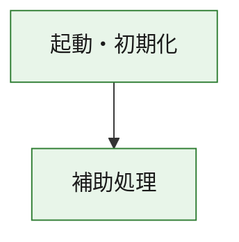
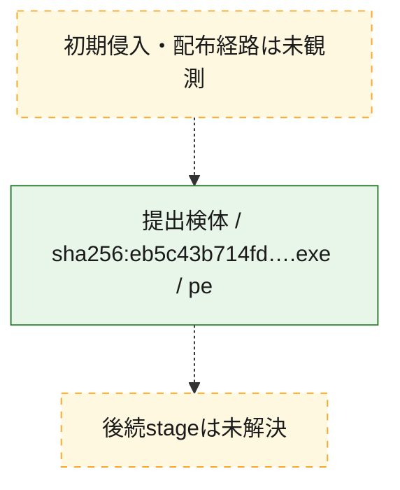
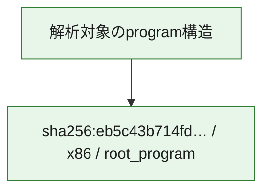

# 全体ロジック：eb5c43b714fdf4596d41fcfe225165271de249ad0615f2a2421331cacb0b79be

代表関数の静的証跡から、起動・初期化の処理群を確認しました。

## 読み方

- phaseの掲載順は解析上の整理順です。observed_call_edgesがない段階間の実行順を断定しません。
- 図の実線は静的に観測した関係、点線と黄色のノードは未観測・未解決の関係を示します。
- 図は静的な要約であり、動的実行を再現するものではありません。
- 詳細な関数解説とfingerprintは[STATIC-LOGIC.md](STATIC-LOGIC.md)を参照してください。

## 静的可視化

### 実行フロー

### 感染チェーン

### モジュール関係

## 処理段階

### 1. 起動・初期化

entry pointから初期化と後続処理への移行を確認します。
確度: `confirmed_static_function_evidence`

- `eb5c43b714fdf4596d41fcfe225165271de249ad0615f2a2421331cacb0b79be:ghidra:180001010` — 初期化と主要処理への分岐を行う入口関数です。 状態: `succeeded`、選定理由: `entry_point`, `meaningful_symbol_name`, `reviewed_call_centrality:22`, `role:entrypoint`, `small_program_complete_context`

### 2. 補助処理

主要処理を支える一般内部関数またはlibrary処理を確認します。
確度: `confirmed_static_function_evidence`

- `eb5c43b714fdf4596d41fcfe225165271de249ad0615f2a2421331cacb0b79be:ghidra:180001240` — 検体内部の一般処理を実装する関数です。 状態: `succeeded`、選定理由: `context_representative`, `reviewed_call_centrality:2`, `small_program_complete_context`
- `eb5c43b714fdf4596d41fcfe225165271de249ad0615f2a2421331cacb0b79be:ghidra:180001350` — 検体内部の一般処理を実装する関数です。 状態: `succeeded`、選定理由: `context_representative`, `reviewed_call_centrality:25`, `small_program_complete_context`
- `eb5c43b714fdf4596d41fcfe225165271de249ad0615f2a2421331cacb0b79be:ghidra:180003780` — 検体内部の一般処理を実装する関数です。 状態: `succeeded`、選定理由: `context_representative`, `reviewed_call_centrality:2`, `small_program_complete_context`
- `eb5c43b714fdf4596d41fcfe225165271de249ad0615f2a2421331cacb0b79be:ghidra:1800038e0` — 検体内部の一般処理を実装する関数です。 状態: `succeeded`、選定理由: `context_representative`, `reviewed_call_centrality:2`, `small_program_complete_context`

## 観測したcall関係

- `eb5c43b714fdf4596d41fcfe225165271de249ad0615f2a2421331cacb0b79be:ghidra:180001010` → `eb5c43b714fdf4596d41fcfe225165271de249ad0615f2a2421331cacb0b79be:ghidra:180001240` （`startup` → `support`）
- `eb5c43b714fdf4596d41fcfe225165271de249ad0615f2a2421331cacb0b79be:ghidra:180001010` → `eb5c43b714fdf4596d41fcfe225165271de249ad0615f2a2421331cacb0b79be:ghidra:180001350` （`startup` → `support`）
- `eb5c43b714fdf4596d41fcfe225165271de249ad0615f2a2421331cacb0b79be:ghidra:180001350` → `eb5c43b714fdf4596d41fcfe225165271de249ad0615f2a2421331cacb0b79be:ghidra:180001240` （`support` → `support`）
- `eb5c43b714fdf4596d41fcfe225165271de249ad0615f2a2421331cacb0b79be:ghidra:180001350` → `eb5c43b714fdf4596d41fcfe225165271de249ad0615f2a2421331cacb0b79be:ghidra:180003780` （`support` → `support`）
- `eb5c43b714fdf4596d41fcfe225165271de249ad0615f2a2421331cacb0b79be:ghidra:180001350` → `eb5c43b714fdf4596d41fcfe225165271de249ad0615f2a2421331cacb0b79be:ghidra:1800038e0` （`support` → `support`）
- `eb5c43b714fdf4596d41fcfe225165271de249ad0615f2a2421331cacb0b79be:ghidra:180003780` → `eb5c43b714fdf4596d41fcfe225165271de249ad0615f2a2421331cacb0b79be:ghidra:1800038e0` （`support` → `support`）
- `ghidra-function:641d35179166b7e73d074e9e` → `ghidra-external:0ef6f4641ea667cd19187b0e` （`unclassified` → `unclassified`）
- `ghidra-function:641d35179166b7e73d074e9e` → `ghidra-external:1a8e2994aec14d08ec0de63c` （`unclassified` → `unclassified`）
- `ghidra-function:641d35179166b7e73d074e9e` → `ghidra-external:1b01e071ec34327dc1cb7755` （`unclassified` → `unclassified`）
- `ghidra-function:641d35179166b7e73d074e9e` → `ghidra-external:2708443bbdc91bc07dca5e52` （`unclassified` → `unclassified`）
- `ghidra-function:641d35179166b7e73d074e9e` → `ghidra-external:45a9655cc06403acbbd43c55` （`unclassified` → `unclassified`）
- `ghidra-function:641d35179166b7e73d074e9e` → `ghidra-external:4a6628cef074d99e5c16e947` （`unclassified` → `unclassified`）
- `ghidra-function:641d35179166b7e73d074e9e` → `ghidra-external:5bd305a75e93ce382576a8e7` （`unclassified` → `unclassified`）
- `ghidra-function:641d35179166b7e73d074e9e` → `ghidra-external:6cd37b39027e04744b9daab9` （`unclassified` → `unclassified`）
- `ghidra-function:641d35179166b7e73d074e9e` → `ghidra-external:70df78a4134667466fee3233` （`unclassified` → `unclassified`）
- `ghidra-function:641d35179166b7e73d074e9e` → `ghidra-external:786e9ebc607fee1c7de79390` （`unclassified` → `unclassified`）
- `ghidra-function:641d35179166b7e73d074e9e` → `ghidra-external:84922ad3ab272184e5963199` （`unclassified` → `unclassified`）
- `ghidra-function:641d35179166b7e73d074e9e` → `ghidra-external:8bcdb5a97218cc1473368eb3` （`unclassified` → `unclassified`）
- `ghidra-function:641d35179166b7e73d074e9e` → `ghidra-external:98a77c99b8ba75338cf9889b` （`unclassified` → `unclassified`）
- `ghidra-function:641d35179166b7e73d074e9e` → `ghidra-external:aaca5c5632cdff72f65b5426` （`unclassified` → `unclassified`）
- `ghidra-function:641d35179166b7e73d074e9e` → `ghidra-external:b2490a2564fd1c23e0ff3fae` （`unclassified` → `unclassified`）
- `ghidra-function:641d35179166b7e73d074e9e` → `ghidra-external:b6d0e0fc76fe4d2009776311` （`unclassified` → `unclassified`）
- `ghidra-function:641d35179166b7e73d074e9e` → `ghidra-external:b846e7754402f322e6a5ddab` （`unclassified` → `unclassified`）
- `ghidra-function:641d35179166b7e73d074e9e` → `ghidra-external:c1374454e2bcbf7084afd01b` （`unclassified` → `unclassified`）
- `ghidra-function:641d35179166b7e73d074e9e` → `ghidra-external:cc332526816a9bd1cdd3dd25` （`unclassified` → `unclassified`）
- `ghidra-function:641d35179166b7e73d074e9e` → `ghidra-external:ee19e8e49e1eaed8cd5e1ace` （`unclassified` → `unclassified`）
- `ghidra-function:641d35179166b7e73d074e9e` → `ghidra-external:f5a07dcf176c78061dde7fcd` （`unclassified` → `unclassified`）
- `ghidra-function:641d35179166b7e73d074e9e` → `ghidra-function:47143cade9a1b10f76b816c0` （`unclassified` → `unclassified`）
- `ghidra-function:641d35179166b7e73d074e9e` → `ghidra-function:5689e35924a5ed3f6d0f13b1` （`unclassified` → `unclassified`）
- `ghidra-function:641d35179166b7e73d074e9e` → `ghidra-function:f9cbae3ad69d1c92e8a5e55d` （`unclassified` → `unclassified`）
- `ghidra-function:f03ccf368ef5f7b376bc61e3` → `ghidra-function:01c8813a56f438f75f8ae13b` （`unclassified` → `unclassified`）
- `ghidra-function:f03ccf368ef5f7b376bc61e3` → `ghidra-function:0d99a8c902007263eaa83f71` （`unclassified` → `unclassified`）
- `ghidra-function:f03ccf368ef5f7b376bc61e3` → `ghidra-function:26c67eb6f3e9c6450cab93be` （`unclassified` → `unclassified`）
- `ghidra-function:f03ccf368ef5f7b376bc61e3` → `ghidra-function:2c54387822929daaa8687985` （`unclassified` → `unclassified`）
- `ghidra-function:f03ccf368ef5f7b376bc61e3` → `ghidra-function:33a1cbfd6fbff310d646979f` （`unclassified` → `unclassified`）
- `ghidra-function:f03ccf368ef5f7b376bc61e3` → `ghidra-function:47143cade9a1b10f76b816c0` （`unclassified` → `unclassified`）
- `ghidra-function:f03ccf368ef5f7b376bc61e3` → `ghidra-function:641d35179166b7e73d074e9e` （`unclassified` → `unclassified`）
- `ghidra-function:f03ccf368ef5f7b376bc61e3` → `ghidra-function:778b6e72ae82877ad6f74617` （`unclassified` → `unclassified`）
- `ghidra-function:f03ccf368ef5f7b376bc61e3` → `ghidra-function:82f6fefa170b611edb4f78ad` （`unclassified` → `unclassified`）
- `ghidra-function:f03ccf368ef5f7b376bc61e3` → `ghidra-function:9d83fa81efc5851f4c44bc60` （`unclassified` → `unclassified`）
- `ghidra-function:f03ccf368ef5f7b376bc61e3` → `ghidra-function:b7138eae9d1c8209770fe2bc` （`unclassified` → `unclassified`）
- `ghidra-function:f03ccf368ef5f7b376bc61e3` → `ghidra-function:fe892f8649fd8ca86f844b21` （`unclassified` → `unclassified`）
- `ghidra-function:f9cbae3ad69d1c92e8a5e55d` → `ghidra-function:5689e35924a5ed3f6d0f13b1` （`unclassified` → `unclassified`）

## 解析範囲と制約

- 選定外関数は全体inventoryへ残しますが、関数本体の個別解説対象にはしていません。
- indirect call、難読化、packer、VM、壊れたcontrol flowによりcall関係が欠落する場合があります。
- 文書は静的解析に基づき、検体実行や外部通信による動的確認は行っていません。
