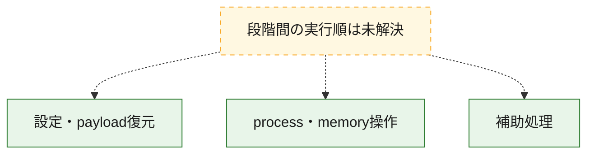
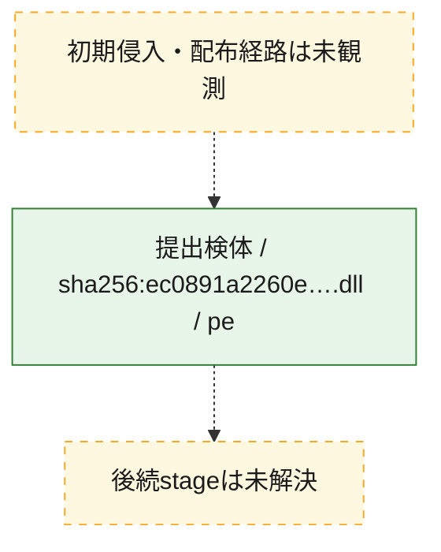
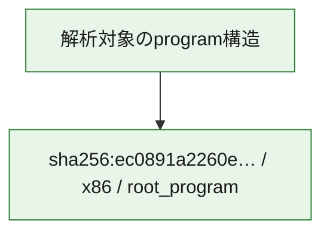

# 全体ロジック：ec0891a2260e38475d2948692f4243430a88c1b849a4c4c8c69220b49ce9c5b3

代表関数の静的証跡から、設定・payload復元、process・memory操作の処理群を確認しました。

## 読み方

- phaseの掲載順は解析上の整理順です。observed_call_edgesがない段階間の実行順を断定しません。
- 図の実線は静的に観測した関係、点線と黄色のノードは未観測・未解決の関係を示します。
- 図は静的な要約であり、動的実行を再現するものではありません。
- 詳細な関数解説とfingerprintは[STATIC-LOGIC.md](STATIC-LOGIC.md)を参照してください。

## 静的可視化

### 実行フロー

### 感染チェーン

### モジュール関係

## 処理段階

### 1. 設定・payload復元

設定、resource、payload、暗号化データの復元・変換を確認します。
確度: `confirmed_static_function_evidence`

- `ec0891a2260e38475d2948692f4243430a88c1b849a4c4c8c69220b49ce9c5b3:ghidra:06fba050` — 設定、resource、payloadなどの解析・変換を行う関数です。 状態: `succeeded`、選定理由: `meaningful_symbol_name`, `reviewed_call_centrality:3`, `role:config_or_data_transform`, `small_program_complete_context`

### 2. process・memory操作

process、thread、module、memory操作と実行移行を確認します。
確度: `confirmed_static_function_evidence`

- `ec0891a2260e38475d2948692f4243430a88c1b849a4c4c8c69220b49ce9c5b3:ghidra:06e653f4` — process、thread、module、またはmemory操作に関係する関数です。 状態: `succeeded`、選定理由: `meaningful_symbol_name`, `reviewed_call_centrality:3`, `role:process_or_memory_operation`, `small_program_complete_context`

### 3. 補助処理

主要処理を支える一般内部関数またはlibrary処理を確認します。
確度: `confirmed_static_function_evidence`

- `ec0891a2260e38475d2948692f4243430a88c1b849a4c4c8c69220b49ce9c5b3:ghidra:06e6536c` — 検体内部の一般処理を実装する関数です。 状態: `succeeded`、選定理由: `meaningful_symbol_name`, `reviewed_call_centrality:3`, `small_program_complete_context`
- `ec0891a2260e38475d2948692f4243430a88c1b849a4c4c8c69220b49ce9c5b3:ghidra:06e73490` — 検体内部の一般処理を実装する関数です。 状態: `succeeded`、選定理由: `meaningful_symbol_name`, `reviewed_call_centrality:3`, `small_program_complete_context`
- `ec0891a2260e38475d2948692f4243430a88c1b849a4c4c8c69220b49ce9c5b3:ghidra:06e736e0` — 検体内部の一般処理を実装する関数です。 状態: `succeeded`、選定理由: `meaningful_symbol_name`, `reviewed_call_centrality:3`, `small_program_complete_context`
- `ec0891a2260e38475d2948692f4243430a88c1b849a4c4c8c69220b49ce9c5b3:ghidra:06e736f8` — 検体内部の一般処理を実装する関数です。 状態: `succeeded`、選定理由: `meaningful_symbol_name`, `reviewed_call_centrality:3`, `small_program_complete_context`
- `ec0891a2260e38475d2948692f4243430a88c1b849a4c4c8c69220b49ce9c5b3:ghidra:06e73750` — 検体内部の一般処理を実装する関数です。 状態: `succeeded`、選定理由: `meaningful_symbol_name`, `reviewed_call_centrality:3`, `small_program_complete_context`
- `ec0891a2260e38475d2948692f4243430a88c1b849a4c4c8c69220b49ce9c5b3:ghidra:06e73768` — 検体内部の一般処理を実装する関数です。 状態: `succeeded`、選定理由: `meaningful_symbol_name`, `reviewed_call_centrality:3`, `small_program_complete_context`
- `ec0891a2260e38475d2948692f4243430a88c1b849a4c4c8c69220b49ce9c5b3:ghidra:06fb9f60` — 検体内部の一般処理を実装する関数です。 状態: `succeeded`、選定理由: `meaningful_symbol_name`, `reviewed_call_centrality:3`, `small_program_complete_context`
- `ec0891a2260e38475d2948692f4243430a88c1b849a4c4c8c69220b49ce9c5b3:ghidra:06fb9f78` — 検体内部の一般処理を実装する関数です。 状態: `succeeded`、選定理由: `meaningful_symbol_name`, `reviewed_call_centrality:3`, `small_program_complete_context`
- `ec0891a2260e38475d2948692f4243430a88c1b849a4c4c8c69220b49ce9c5b3:ghidra:06fb9f90` — 検体内部の一般処理を実装する関数です。 状態: `succeeded`、選定理由: `meaningful_symbol_name`, `reviewed_call_centrality:3`, `small_program_complete_context`
- `ec0891a2260e38475d2948692f4243430a88c1b849a4c4c8c69220b49ce9c5b3:ghidra:06fb9fa8` — 検体内部の一般処理を実装する関数です。 状態: `succeeded`、選定理由: `meaningful_symbol_name`, `reviewed_call_centrality:3`, `small_program_complete_context`
- `ec0891a2260e38475d2948692f4243430a88c1b849a4c4c8c69220b49ce9c5b3:ghidra:06fb9fc0` — 検体内部の一般処理を実装する関数です。 状態: `succeeded`、選定理由: `meaningful_symbol_name`, `reviewed_call_centrality:3`, `small_program_complete_context`
- `ec0891a2260e38475d2948692f4243430a88c1b849a4c4c8c69220b49ce9c5b3:ghidra:06fb9fd8` — 検体内部の一般処理を実装する関数です。 状態: `succeeded`、選定理由: `meaningful_symbol_name`, `reviewed_call_centrality:3`, `small_program_complete_context`
- `ec0891a2260e38475d2948692f4243430a88c1b849a4c4c8c69220b49ce9c5b3:ghidra:06fb9ff0` — 検体内部の一般処理を実装する関数です。 状態: `succeeded`、選定理由: `meaningful_symbol_name`, `reviewed_call_centrality:3`, `small_program_complete_context`
- `ec0891a2260e38475d2948692f4243430a88c1b849a4c4c8c69220b49ce9c5b3:ghidra:06fba008` — 検体内部の一般処理を実装する関数です。 状態: `succeeded`、選定理由: `meaningful_symbol_name`, `reviewed_call_centrality:3`, `small_program_complete_context`
- `ec0891a2260e38475d2948692f4243430a88c1b849a4c4c8c69220b49ce9c5b3:ghidra:06fba020` — 検体内部の一般処理を実装する関数です。 状態: `succeeded`、選定理由: `meaningful_symbol_name`, `reviewed_call_centrality:3`, `small_program_complete_context`
- `ec0891a2260e38475d2948692f4243430a88c1b849a4c4c8c69220b49ce9c5b3:ghidra:06fba038` — 検体内部の一般処理を実装する関数です。 状態: `succeeded`、選定理由: `meaningful_symbol_name`, `reviewed_call_centrality:3`, `small_program_complete_context`

## 観測したcall関係

- 代表関数間で直接解決できた呼出関係はありません。

## 解析範囲と制約

- 選定外関数は全体inventoryへ残しますが、関数本体の個別解説対象にはしていません。
- indirect call、難読化、packer、VM、壊れたcontrol flowによりcall関係が欠落する場合があります。
- 文書は静的解析に基づき、検体実行や外部通信による動的確認は行っていません。
