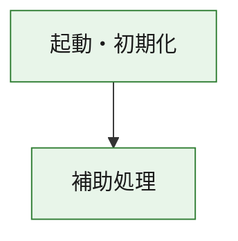
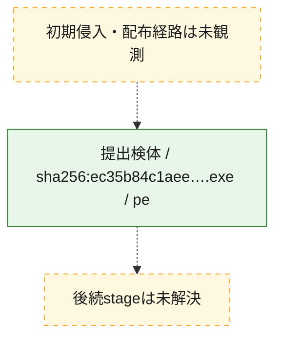
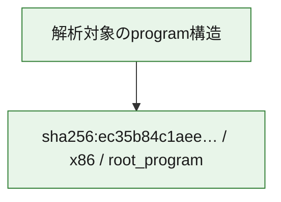

# 全体ロジック：ec35b84c1aeef5f93fa69dfad976117a53a3108a232a8f2223bf061d739526ef

代表関数の静的証跡から、起動・初期化の処理群を確認しました。

## 読み方

- phaseの掲載順は解析上の整理順です。observed_call_edgesがない段階間の実行順を断定しません。
- 図の実線は静的に観測した関係、点線と黄色のノードは未観測・未解決の関係を示します。
- 図は静的な要約であり、動的実行を再現するものではありません。
- 詳細な関数解説とfingerprintは[STATIC-LOGIC.md](STATIC-LOGIC.md)を参照してください。

## 静的可視化

### 実行フロー

### 感染チェーン

### モジュール関係

## 処理段階

### 1. 起動・初期化

entry pointから初期化と後続処理への移行を確認します。
確度: `confirmed_static_function_evidence`

- `ec35b84c1aeef5f93fa69dfad976117a53a3108a232a8f2223bf061d739526ef:ghidra:180001010` — 初期化と主要処理への分岐を行う入口関数です。 状態: `succeeded`、選定理由: `entry_point`, `meaningful_symbol_name`, `reviewed_call_centrality:22`, `role:entrypoint`, `small_program_complete_context`

### 2. 補助処理

主要処理を支える一般内部関数またはlibrary処理を確認します。
確度: `confirmed_static_function_evidence`

- `ec35b84c1aeef5f93fa69dfad976117a53a3108a232a8f2223bf061d739526ef:ghidra:180001240` — 検体内部の一般処理を実装する関数です。 状態: `succeeded`、選定理由: `context_representative`, `reviewed_call_centrality:2`, `small_program_complete_context`
- `ec35b84c1aeef5f93fa69dfad976117a53a3108a232a8f2223bf061d739526ef:ghidra:180001350` — 検体内部の一般処理を実装する関数です。 状態: `succeeded`、選定理由: `context_representative`, `reviewed_call_centrality:25`, `small_program_complete_context`
- `ec35b84c1aeef5f93fa69dfad976117a53a3108a232a8f2223bf061d739526ef:ghidra:180003780` — 検体内部の一般処理を実装する関数です。 状態: `succeeded`、選定理由: `context_representative`, `reviewed_call_centrality:2`, `small_program_complete_context`
- `ec35b84c1aeef5f93fa69dfad976117a53a3108a232a8f2223bf061d739526ef:ghidra:1800038e0` — 検体内部の一般処理を実装する関数です。 状態: `succeeded`、選定理由: `context_representative`, `reviewed_call_centrality:2`, `small_program_complete_context`

## 観測したcall関係

- `ec35b84c1aeef5f93fa69dfad976117a53a3108a232a8f2223bf061d739526ef:ghidra:180001010` → `ec35b84c1aeef5f93fa69dfad976117a53a3108a232a8f2223bf061d739526ef:ghidra:180001240` （`startup` → `support`）
- `ec35b84c1aeef5f93fa69dfad976117a53a3108a232a8f2223bf061d739526ef:ghidra:180001010` → `ec35b84c1aeef5f93fa69dfad976117a53a3108a232a8f2223bf061d739526ef:ghidra:180001350` （`startup` → `support`）
- `ec35b84c1aeef5f93fa69dfad976117a53a3108a232a8f2223bf061d739526ef:ghidra:180001350` → `ec35b84c1aeef5f93fa69dfad976117a53a3108a232a8f2223bf061d739526ef:ghidra:180001240` （`support` → `support`）
- `ec35b84c1aeef5f93fa69dfad976117a53a3108a232a8f2223bf061d739526ef:ghidra:180001350` → `ec35b84c1aeef5f93fa69dfad976117a53a3108a232a8f2223bf061d739526ef:ghidra:180003780` （`support` → `support`）
- `ec35b84c1aeef5f93fa69dfad976117a53a3108a232a8f2223bf061d739526ef:ghidra:180001350` → `ec35b84c1aeef5f93fa69dfad976117a53a3108a232a8f2223bf061d739526ef:ghidra:1800038e0` （`support` → `support`）
- `ec35b84c1aeef5f93fa69dfad976117a53a3108a232a8f2223bf061d739526ef:ghidra:180003780` → `ec35b84c1aeef5f93fa69dfad976117a53a3108a232a8f2223bf061d739526ef:ghidra:1800038e0` （`support` → `support`）
- `ghidra-function:30cd919a34d05ea1b04b7c69` → `ghidra-function:57736f51563c178a7776d1e2` （`unclassified` → `unclassified`）
- `ghidra-function:94c79f4daaeb613358d40d61` → `ghidra-external:03718a28003c64426686b275` （`unclassified` → `unclassified`）
- `ghidra-function:94c79f4daaeb613358d40d61` → `ghidra-external:284b0c4c4fa29010e84376e3` （`unclassified` → `unclassified`）
- `ghidra-function:94c79f4daaeb613358d40d61` → `ghidra-external:2ee1a245a99ccb744f1ed1fd` （`unclassified` → `unclassified`）
- `ghidra-function:94c79f4daaeb613358d40d61` → `ghidra-external:3926a9eb710c0e6df3b379fb` （`unclassified` → `unclassified`）
- `ghidra-function:94c79f4daaeb613358d40d61` → `ghidra-external:41f63aa85d0544d9929fc588` （`unclassified` → `unclassified`）
- `ghidra-function:94c79f4daaeb613358d40d61` → `ghidra-external:5b694a1e63d4779ec1c5f675` （`unclassified` → `unclassified`）
- `ghidra-function:94c79f4daaeb613358d40d61` → `ghidra-external:72f2f694d579f01b68927913` （`unclassified` → `unclassified`）
- `ghidra-function:94c79f4daaeb613358d40d61` → `ghidra-external:74ff7f999e6c89f965e94342` （`unclassified` → `unclassified`）
- `ghidra-function:94c79f4daaeb613358d40d61` → `ghidra-external:79d67e4c5b69a49f7180613f` （`unclassified` → `unclassified`）
- `ghidra-function:94c79f4daaeb613358d40d61` → `ghidra-external:8ed5db7242abcd6fb7a21b26` （`unclassified` → `unclassified`）
- `ghidra-function:94c79f4daaeb613358d40d61` → `ghidra-external:95ff6a80554cc017ea4f5b4b` （`unclassified` → `unclassified`）
- `ghidra-function:94c79f4daaeb613358d40d61` → `ghidra-external:ab76a14f99757873352cd88c` （`unclassified` → `unclassified`）
- `ghidra-function:94c79f4daaeb613358d40d61` → `ghidra-external:af5c36dbf437567b05a39ccb` （`unclassified` → `unclassified`）
- `ghidra-function:94c79f4daaeb613358d40d61` → `ghidra-external:c14df5b0e86dd28d54396860` （`unclassified` → `unclassified`）
- `ghidra-function:94c79f4daaeb613358d40d61` → `ghidra-external:c83d9aa6ae9ca0313889ccaa` （`unclassified` → `unclassified`）
- `ghidra-function:94c79f4daaeb613358d40d61` → `ghidra-external:d9bdce4c716d188821c1f27b` （`unclassified` → `unclassified`）
- `ghidra-function:94c79f4daaeb613358d40d61` → `ghidra-external:e14c9b530e12ec9dfb9687dd` （`unclassified` → `unclassified`）
- `ghidra-function:94c79f4daaeb613358d40d61` → `ghidra-external:efa58f15d024dd5664355b8e` （`unclassified` → `unclassified`）
- `ghidra-function:94c79f4daaeb613358d40d61` → `ghidra-external:f0ad736eb23eb941c89b3901` （`unclassified` → `unclassified`）
- `ghidra-function:94c79f4daaeb613358d40d61` → `ghidra-external:f624797871990e1adea8ae8c` （`unclassified` → `unclassified`）
- `ghidra-function:94c79f4daaeb613358d40d61` → `ghidra-external:fbc83d97fbd8517794c4bffb` （`unclassified` → `unclassified`）
- `ghidra-function:94c79f4daaeb613358d40d61` → `ghidra-function:30cd919a34d05ea1b04b7c69` （`unclassified` → `unclassified`）
- `ghidra-function:94c79f4daaeb613358d40d61` → `ghidra-function:57736f51563c178a7776d1e2` （`unclassified` → `unclassified`）
- `ghidra-function:94c79f4daaeb613358d40d61` → `ghidra-function:9c8d3267ec9489edbed97eb9` （`unclassified` → `unclassified`）
- `ghidra-function:c551184480087624c425df87` → `ghidra-function:17947c1afac13b06a58d427a` （`unclassified` → `unclassified`）
- `ghidra-function:c551184480087624c425df87` → `ghidra-function:17db81d77b29b5bf0d6ab4b0` （`unclassified` → `unclassified`）
- `ghidra-function:c551184480087624c425df87` → `ghidra-function:22502a23d316331a823260a9` （`unclassified` → `unclassified`）
- `ghidra-function:c551184480087624c425df87` → `ghidra-function:7dad0b1e05f58a82264d4bde` （`unclassified` → `unclassified`）
- `ghidra-function:c551184480087624c425df87` → `ghidra-function:94c79f4daaeb613358d40d61` （`unclassified` → `unclassified`）
- `ghidra-function:c551184480087624c425df87` → `ghidra-function:9bfb027cb099142e03cab9d3` （`unclassified` → `unclassified`）
- `ghidra-function:c551184480087624c425df87` → `ghidra-function:9c8d3267ec9489edbed97eb9` （`unclassified` → `unclassified`）
- `ghidra-function:c551184480087624c425df87` → `ghidra-function:b0c08e06664865c66ef66815` （`unclassified` → `unclassified`）
- `ghidra-function:c551184480087624c425df87` → `ghidra-function:ce0585f8d3f12e6b3f99d7e0` （`unclassified` → `unclassified`）
- `ghidra-function:c551184480087624c425df87` → `ghidra-function:d647064be0d1f424942ddd34` （`unclassified` → `unclassified`）
- `ghidra-function:c551184480087624c425df87` → `ghidra-function:f410158f956e958f2a1983b1` （`unclassified` → `unclassified`）
- `ghidra-function:c551184480087624c425df87` → `ghidra-function:f7a84e3adf656f84e6f84897` （`unclassified` → `unclassified`）

## 解析範囲と制約

- 選定外関数は全体inventoryへ残しますが、関数本体の個別解説対象にはしていません。
- indirect call、難読化、packer、VM、壊れたcontrol flowによりcall関係が欠落する場合があります。
- 文書は静的解析に基づき、検体実行や外部通信による動的確認は行っていません。
