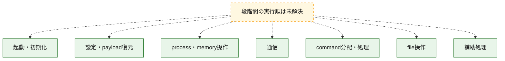
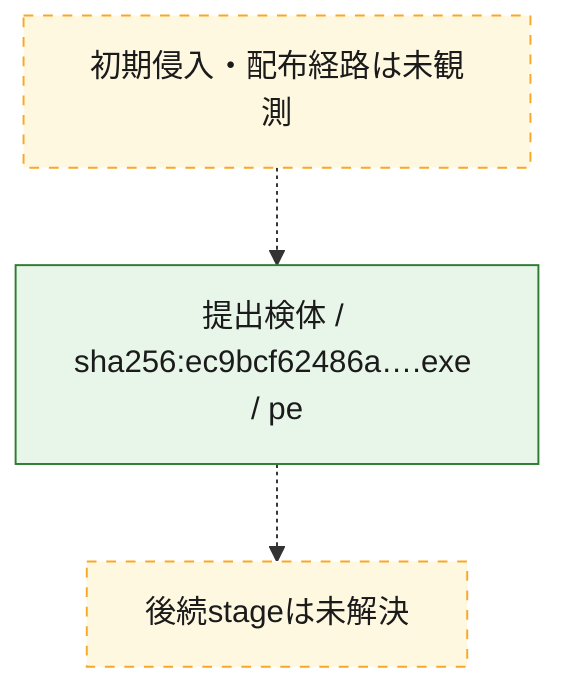
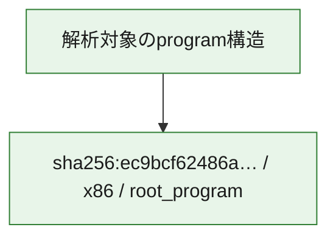

# 全体ロジック：ec9bcf62486a932d1249134543381d21814366e133bb9f0993f9f40e97e3141a

代表関数の静的証跡から、起動・初期化、設定・payload復元、process・memory操作、通信、command分配・処理、file操作の処理群を確認しました。

## 読み方

- phaseの掲載順は解析上の整理順です。observed_call_edgesがない段階間の実行順を断定しません。
- 図の実線は静的に観測した関係、点線と黄色のノードは未観測・未解決の関係を示します。
- 図は静的な要約であり、動的実行を再現するものではありません。
- 詳細な関数解説とfingerprintは[STATIC-LOGIC.md](STATIC-LOGIC.md)を参照してください。

## 静的可視化

### 実行フロー

### 感染チェーン

### モジュール関係

## 処理段階

### 1. 起動・初期化

entry pointから初期化と後続処理への移行を確認します。
確度: `confirmed_static_function_evidence_with_limits`

- `ec9bcf62486a932d1249134543381d21814366e133bb9f0993f9f40e97e3141a:ghidra:1400adc40` — 初期化と主要処理への分岐を行う入口関数です。 状態: `succeeded`、選定理由: `entry_point`, `meaningful_symbol_name`, `probable_go_main_user_code`, `reviewed_call_centrality:5`, `role:entrypoint`
- `ec9bcf62486a932d1249134543381d21814366e133bb9f0993f9f40e97e3141a:ghidra:1400ade00` — 初期化と主要処理への分岐を行う入口関数です。 状態: `failed`、選定理由: `entry_point`, `meaningful_symbol_name`, `probable_go_main_user_code`, `role:entrypoint`
- `ec9bcf62486a932d1249134543381d21814366e133bb9f0993f9f40e97e3141a:ghidra:1400be520` — 初期化と主要処理への分岐を行う入口関数です。 状態: `succeeded`、選定理由: `entry_point`, `meaningful_symbol_name`, `probable_go_main_user_code`, `reviewed_call_centrality:14`, `role:entrypoint`
- `ec9bcf62486a932d1249134543381d21814366e133bb9f0993f9f40e97e3141a:ghidra:1400c0400` — 初期化と主要処理への分岐を行う入口関数です。 状態: `succeeded`、選定理由: `entry_point`, `meaningful_symbol_name`, `probable_go_main_user_code`, `reviewed_call_centrality:9`, `role:entrypoint`
- `ec9bcf62486a932d1249134543381d21814366e133bb9f0993f9f40e97e3141a:ghidra:1400c20a0` — 初期化と主要処理への分岐を行う入口関数です。 状態: `succeeded`、選定理由: `entry_point`, `meaningful_symbol_name`, `probable_go_main_user_code`, `reviewed_call_centrality:9`, `role:entrypoint`
- `ec9bcf62486a932d1249134543381d21814366e133bb9f0993f9f40e97e3141a:ghidra:1400c5120` — 初期化と主要処理への分岐を行う入口関数です。 状態: `succeeded`、選定理由: `entry_point`, `meaningful_symbol_name`, `probable_go_main_user_code`, `reviewed_call_centrality:11`, `role:entrypoint`
- `ec9bcf62486a932d1249134543381d21814366e133bb9f0993f9f40e97e3141a:ghidra:1400c65e0` — 初期化と主要処理への分岐を行う入口関数です。 状態: `succeeded`、選定理由: `entry_point`, `meaningful_symbol_name`, `probable_go_main_user_code`, `reviewed_call_centrality:10`, `role:entrypoint`
- `ec9bcf62486a932d1249134543381d21814366e133bb9f0993f9f40e97e3141a:ghidra:1400c9760` — 初期化と主要処理への分岐を行う入口関数です。 状態: `succeeded`、選定理由: `entry_point`, `meaningful_symbol_name`, `probable_go_main_user_code`, `reviewed_call_centrality:12`, `role:entrypoint`
- `ec9bcf62486a932d1249134543381d21814366e133bb9f0993f9f40e97e3141a:ghidra:1400cb180` — 初期化と主要処理への分岐を行う入口関数です。 状態: `succeeded`、選定理由: `entry_point`, `meaningful_symbol_name`, `probable_go_main_user_code`, `reviewed_call_centrality:11`, `role:entrypoint`
- `ec9bcf62486a932d1249134543381d21814366e133bb9f0993f9f40e97e3141a:ghidra:1400ccb00` — 初期化と主要処理への分岐を行う入口関数です。 状態: `succeeded`、選定理由: `entry_point`, `meaningful_symbol_name`, `probable_go_main_user_code`, `reviewed_call_centrality:13`, `role:entrypoint`
- `ec9bcf62486a932d1249134543381d21814366e133bb9f0993f9f40e97e3141a:ghidra:1400cec80` — 初期化と主要処理への分岐を行う入口関数です。 状態: `succeeded`、選定理由: `entry_point`, `meaningful_symbol_name`, `probable_go_main_user_code`, `reviewed_call_centrality:9`, `role:entrypoint`
- `ec9bcf62486a932d1249134543381d21814366e133bb9f0993f9f40e97e3141a:ghidra:1400d08e0` — 初期化と主要処理への分岐を行う入口関数です。 状態: `succeeded`、選定理由: `entry_point`, `meaningful_symbol_name`, `probable_go_main_user_code`, `reviewed_call_centrality:13`, `role:entrypoint`
- `ec9bcf62486a932d1249134543381d21814366e133bb9f0993f9f40e97e3141a:ghidra:1400d1a40` — 初期化と主要処理への分岐を行う入口関数です。 状態: `succeeded`、選定理由: `entry_point`, `meaningful_symbol_name`, `probable_go_main_user_code`, `reviewed_call_centrality:11`, `role:entrypoint`
- `ec9bcf62486a932d1249134543381d21814366e133bb9f0993f9f40e97e3141a:ghidra:1400d3bc0` — 初期化と主要処理への分岐を行う入口関数です。 状態: `succeeded`、選定理由: `entry_point`, `meaningful_symbol_name`, `probable_go_main_user_code`, `reviewed_call_centrality:8`, `role:entrypoint`
- `ec9bcf62486a932d1249134543381d21814366e133bb9f0993f9f40e97e3141a:ghidra:1400d4be0` — 初期化と主要処理への分岐を行う入口関数です。 状態: `failed`、選定理由: `entry_point`, `meaningful_symbol_name`, `probable_go_main_user_code`, `role:entrypoint`
- `ec9bcf62486a932d1249134543381d21814366e133bb9f0993f9f40e97e3141a:ghidra:1400ddc00` — 初期化と主要処理への分岐を行う入口関数です。 状態: `succeeded`、選定理由: `entry_point`, `meaningful_symbol_name`, `probable_go_main_user_code`, `reviewed_call_centrality:13`, `role:entrypoint`
- `ec9bcf62486a932d1249134543381d21814366e133bb9f0993f9f40e97e3141a:ghidra:1400e0ec0` — 初期化と主要処理への分岐を行う入口関数です。 状態: `succeeded`、選定理由: `entry_point`, `meaningful_symbol_name`, `probable_go_main_user_code`, `reviewed_call_centrality:12`, `role:entrypoint`
- `ec9bcf62486a932d1249134543381d21814366e133bb9f0993f9f40e97e3141a:ghidra:1400e4220` — 初期化と主要処理への分岐を行う入口関数です。 状態: `succeeded`、選定理由: `entry_point`, `meaningful_symbol_name`, `probable_go_main_user_code`, `reviewed_call_centrality:10`, `role:entrypoint`
- `ec9bcf62486a932d1249134543381d21814366e133bb9f0993f9f40e97e3141a:ghidra:1400e7140` — 初期化と主要処理への分岐を行う入口関数です。 状態: `succeeded`、選定理由: `entry_point`, `meaningful_symbol_name`, `probable_go_main_user_code`, `reviewed_call_centrality:10`, `role:entrypoint`
- `ec9bcf62486a932d1249134543381d21814366e133bb9f0993f9f40e97e3141a:ghidra:1400e8e80` — 初期化と主要処理への分岐を行う入口関数です。 状態: `succeeded`、選定理由: `entry_point`, `meaningful_symbol_name`, `probable_go_main_user_code`, `reviewed_call_centrality:11`, `role:entrypoint`
- `ec9bcf62486a932d1249134543381d21814366e133bb9f0993f9f40e97e3141a:ghidra:1400ea320` — 初期化と主要処理への分岐を行う入口関数です。 状態: `succeeded`、選定理由: `entry_point`, `meaningful_symbol_name`, `probable_go_main_user_code`, `reviewed_call_centrality:19`, `role:entrypoint`
- `ec9bcf62486a932d1249134543381d21814366e133bb9f0993f9f40e97e3141a:ghidra:1400eda60` — 初期化と主要処理への分岐を行う入口関数です。 状態: `succeeded`、選定理由: `entry_point`, `meaningful_symbol_name`, `probable_go_main_user_code`, `reviewed_call_centrality:10`, `role:entrypoint`
- `ec9bcf62486a932d1249134543381d21814366e133bb9f0993f9f40e97e3141a:ghidra:1400ef300` — 初期化と主要処理への分岐を行う入口関数です。 状態: `succeeded`、選定理由: `entry_point`, `meaningful_symbol_name`, `probable_go_main_user_code`, `reviewed_call_centrality:9`, `role:entrypoint`
- `ec9bcf62486a932d1249134543381d21814366e133bb9f0993f9f40e97e3141a:ghidra:1400f0780` — 初期化と主要処理への分岐を行う入口関数です。 状態: `succeeded`、選定理由: `entry_point`, `meaningful_symbol_name`, `probable_go_main_user_code`, `reviewed_call_centrality:10`, `role:entrypoint`
- `ec9bcf62486a932d1249134543381d21814366e133bb9f0993f9f40e97e3141a:ghidra:1400f1bc0` — 初期化と主要処理への分岐を行う入口関数です。 状態: `succeeded`、選定理由: `entry_point`, `meaningful_symbol_name`, `probable_go_main_user_code`, `reviewed_call_centrality:11`, `role:entrypoint`

### 2. 設定・payload復元

設定、resource、payload、暗号化データの復元・変換を確認します。
確度: `confirmed_static_function_evidence`

- `ec9bcf62486a932d1249134543381d21814366e133bb9f0993f9f40e97e3141a:ghidra:140087920` — 設定、resource、payloadなどの解析・変換を行う関数です。 状態: `succeeded`、選定理由: `meaningful_symbol_name`, `reviewed_call_centrality:4`, `role:config_or_data_transform`

### 3. process・memory操作

process、thread、module、memory操作と実行移行を確認します。
確度: `confirmed_static_function_evidence`

- `ec9bcf62486a932d1249134543381d21814366e133bb9f0993f9f40e97e3141a:ghidra:140098200` — process、thread、module、またはmemory操作に関係する関数です。 状態: `succeeded`、選定理由: `meaningful_symbol_name`, `reviewed_call_centrality:6`, `role:process_or_memory_operation`

### 4. 通信

通信初期化、endpoint処理、送受信の役割を確認します。
確度: `confirmed_static_function_evidence`

- `ec9bcf62486a932d1249134543381d21814366e133bb9f0993f9f40e97e3141a:ghidra:140098ae0` — 通信初期化、送受信、またはendpoint処理に関係する関数です。 状態: `succeeded`、選定理由: `meaningful_symbol_name`, `reviewed_call_centrality:6`, `role:network_communication`

### 5. command分配・処理

受信commandやtaskの解釈、分配、個別handlerへの移行を確認します。
確度: `confirmed_static_function_evidence`

- `ec9bcf62486a932d1249134543381d21814366e133bb9f0993f9f40e97e3141a:ghidra:140097d40` — commandの解釈、分配、または個別処理を担当する関数です。 状態: `succeeded`、選定理由: `meaningful_symbol_name`, `reviewed_call_centrality:5`, `role:command_dispatch_or_handler`

### 6. file操作

fileやdirectoryの作成、読書き、削除を確認します。
確度: `confirmed_static_function_evidence`

- `ec9bcf62486a932d1249134543381d21814366e133bb9f0993f9f40e97e3141a:ghidra:1400986c0` — fileまたはdirectoryの読書き・管理に関係する関数です。 状態: `succeeded`、選定理由: `meaningful_symbol_name`, `reviewed_call_centrality:6`, `role:file_operation`

### 7. 補助処理

主要処理を支える一般内部関数またはlibrary処理を確認します。
確度: `confirmed_static_function_evidence`

- `ec9bcf62486a932d1249134543381d21814366e133bb9f0993f9f40e97e3141a:ghidra:140001080` — compiler生成処理または汎用library処理とみられる関数です。 状態: `succeeded`、選定理由: `meaningful_symbol_name`, `reviewed_call_centrality:5`
- `ec9bcf62486a932d1249134543381d21814366e133bb9f0993f9f40e97e3141a:ghidra:140070f00` — 検体内部の一般処理を実装する関数です。 状態: `succeeded`、選定理由: `meaningful_symbol_name`, `reviewed_call_centrality:3`

## 観測したcall関係

- `ghidra-function:0305bab88e2b9ff0d66447df` → `ghidra-external:158b3c70b633519e1d647bb5` （`unclassified` → `unclassified`）
- `ghidra-function:0305bab88e2b9ff0d66447df` → `ghidra-external:8cf46fd2e704c60b7214467b` （`unclassified` → `unclassified`）
- `ghidra-function:0305bab88e2b9ff0d66447df` → `ghidra-external:dea65610a247a748dd333f59` （`unclassified` → `unclassified`）
- `ghidra-function:0305bab88e2b9ff0d66447df` → `ghidra-external:e5530b54ca7fa56ba2917667` （`unclassified` → `unclassified`）
- `ghidra-function:08120addd2c44a80e90c08fd` → `ghidra-external:1e5e1489364c9998932c8120` （`unclassified` → `unclassified`）
- `ghidra-function:08120addd2c44a80e90c08fd` → `ghidra-external:1f4a358d5e337ce09725d067` （`unclassified` → `unclassified`）
- `ghidra-function:08120addd2c44a80e90c08fd` → `ghidra-external:247e83026c24aeee916d1e8e` （`unclassified` → `unclassified`）
- `ghidra-function:08120addd2c44a80e90c08fd` → `ghidra-external:5a2ae624a85cbd0de86d9739` （`unclassified` → `unclassified`）
- `ghidra-function:08120addd2c44a80e90c08fd` → `ghidra-external:94d5b3684f52fdd04ae88e79` （`unclassified` → `unclassified`）
- `ghidra-function:08120addd2c44a80e90c08fd` → `ghidra-external:b5a4e1b4c1325c6224b9ef65` （`unclassified` → `unclassified`）
- `ghidra-function:08120addd2c44a80e90c08fd` → `ghidra-external:c69962ed156b13f245fca5c5` （`unclassified` → `unclassified`）
- `ghidra-function:08120addd2c44a80e90c08fd` → `ghidra-external:cb161931be1f6eae7df1bfc1` （`unclassified` → `unclassified`）
- `ghidra-function:08120addd2c44a80e90c08fd` → `ghidra-external:dea65610a247a748dd333f59` （`unclassified` → `unclassified`）
- `ghidra-function:08120addd2c44a80e90c08fd` → `ghidra-external:e5f9bd19ee2d92b024c43083` （`unclassified` → `unclassified`）
- `ghidra-function:15f51d3dddfd9e600fbf5aad` → `ghidra-external:158b3c70b633519e1d647bb5` （`unclassified` → `unclassified`）
- `ghidra-function:15f51d3dddfd9e600fbf5aad` → `ghidra-external:1e5e1489364c9998932c8120` （`unclassified` → `unclassified`）
- `ghidra-function:15f51d3dddfd9e600fbf5aad` → `ghidra-external:1f4a358d5e337ce09725d067` （`unclassified` → `unclassified`）
- `ghidra-function:15f51d3dddfd9e600fbf5aad` → `ghidra-external:247e83026c24aeee916d1e8e` （`unclassified` → `unclassified`）
- `ghidra-function:15f51d3dddfd9e600fbf5aad` → `ghidra-external:5a2ae624a85cbd0de86d9739` （`unclassified` → `unclassified`）
- `ghidra-function:15f51d3dddfd9e600fbf5aad` → `ghidra-external:94d5b3684f52fdd04ae88e79` （`unclassified` → `unclassified`）
- `ghidra-function:15f51d3dddfd9e600fbf5aad` → `ghidra-external:c69962ed156b13f245fca5c5` （`unclassified` → `unclassified`）
- `ghidra-function:15f51d3dddfd9e600fbf5aad` → `ghidra-external:e5f9bd19ee2d92b024c43083` （`unclassified` → `unclassified`）
- `ghidra-function:15f51d3dddfd9e600fbf5aad` → `ghidra-external:ed7c7dbe32cdbc69557f6086` （`unclassified` → `unclassified`）
- `ghidra-function:1936502e02c9c33d177b7038` → `ghidra-external:1e5e1489364c9998932c8120` （`unclassified` → `unclassified`）
- `ghidra-function:1936502e02c9c33d177b7038` → `ghidra-external:1f4a358d5e337ce09725d067` （`unclassified` → `unclassified`）
- `ghidra-function:1936502e02c9c33d177b7038` → `ghidra-external:247e83026c24aeee916d1e8e` （`unclassified` → `unclassified`）
- `ghidra-function:1936502e02c9c33d177b7038` → `ghidra-external:42c51c5bae0e97ba2fc5bc48` （`unclassified` → `unclassified`）
- `ghidra-function:1936502e02c9c33d177b7038` → `ghidra-external:5a2ae624a85cbd0de86d9739` （`unclassified` → `unclassified`）
- `ghidra-function:1936502e02c9c33d177b7038` → `ghidra-external:9420113ddbc444bca29ab9f3` （`unclassified` → `unclassified`）
- `ghidra-function:1936502e02c9c33d177b7038` → `ghidra-external:94d5b3684f52fdd04ae88e79` （`unclassified` → `unclassified`）
- `ghidra-function:1936502e02c9c33d177b7038` → `ghidra-external:c69962ed156b13f245fca5c5` （`unclassified` → `unclassified`）
- `ghidra-function:1936502e02c9c33d177b7038` → `ghidra-external:e5f9bd19ee2d92b024c43083` （`unclassified` → `unclassified`）
- `ghidra-function:1936502e02c9c33d177b7038` → `ghidra-external:f88a18d22da23b1642327ce5` （`unclassified` → `unclassified`）
- `ghidra-function:1b73a285d58ef5d415034280` → `ghidra-external:1e5e1489364c9998932c8120` （`unclassified` → `unclassified`）
- `ghidra-function:1b73a285d58ef5d415034280` → `ghidra-external:1f4a358d5e337ce09725d067` （`unclassified` → `unclassified`）
- `ghidra-function:1b73a285d58ef5d415034280` → `ghidra-external:247e83026c24aeee916d1e8e` （`unclassified` → `unclassified`）
- `ghidra-function:1b73a285d58ef5d415034280` → `ghidra-external:5a2ae624a85cbd0de86d9739` （`unclassified` → `unclassified`）
- `ghidra-function:1b73a285d58ef5d415034280` → `ghidra-external:5b74838fa866b2fb2cea7a26` （`unclassified` → `unclassified`）
- `ghidra-function:1b73a285d58ef5d415034280` → `ghidra-external:5f7abb59d08a18d347aa5136` （`unclassified` → `unclassified`）
- `ghidra-function:1b73a285d58ef5d415034280` → `ghidra-external:68b1f3b29cd759bb06e71c09` （`unclassified` → `unclassified`）
- `ghidra-function:1b73a285d58ef5d415034280` → `ghidra-external:94d5b3684f52fdd04ae88e79` （`unclassified` → `unclassified`）
- `ghidra-function:1b73a285d58ef5d415034280` → `ghidra-external:b9f73e18a846d05964b60d07` （`unclassified` → `unclassified`）
- `ghidra-function:1b73a285d58ef5d415034280` → `ghidra-external:c69962ed156b13f245fca5c5` （`unclassified` → `unclassified`）
- `ghidra-function:1b73a285d58ef5d415034280` → `ghidra-external:e5f9bd19ee2d92b024c43083` （`unclassified` → `unclassified`）
- `ghidra-function:22a97ac79d116958ca8cf86c` → `ghidra-external:1e5e1489364c9998932c8120` （`unclassified` → `unclassified`）
- `ghidra-function:22a97ac79d116958ca8cf86c` → `ghidra-external:1f4a358d5e337ce09725d067` （`unclassified` → `unclassified`）
- `ghidra-function:22a97ac79d116958ca8cf86c` → `ghidra-external:247e83026c24aeee916d1e8e` （`unclassified` → `unclassified`）
- `ghidra-function:22a97ac79d116958ca8cf86c` → `ghidra-external:5a2ae624a85cbd0de86d9739` （`unclassified` → `unclassified`）
- `ghidra-function:22a97ac79d116958ca8cf86c` → `ghidra-external:64ea414efe8acaf1848f8d8e` （`unclassified` → `unclassified`）
- `ghidra-function:22a97ac79d116958ca8cf86c` → `ghidra-external:895c6612072c11b0d2955979` （`unclassified` → `unclassified`）
- `ghidra-function:22a97ac79d116958ca8cf86c` → `ghidra-external:94d5b3684f52fdd04ae88e79` （`unclassified` → `unclassified`）
- `ghidra-function:22a97ac79d116958ca8cf86c` → `ghidra-external:a58c16436b99ab8df4a1d06e` （`unclassified` → `unclassified`）
- `ghidra-function:22a97ac79d116958ca8cf86c` → `ghidra-external:c291d15992daeb34cbf9b21c` （`unclassified` → `unclassified`）
- `ghidra-function:22a97ac79d116958ca8cf86c` → `ghidra-external:c69962ed156b13f245fca5c5` （`unclassified` → `unclassified`）
- `ghidra-function:22a97ac79d116958ca8cf86c` → `ghidra-external:cdc1eb19b0a338282fd84e58` （`unclassified` → `unclassified`）
- `ghidra-function:22a97ac79d116958ca8cf86c` → `ghidra-external:e5f9bd19ee2d92b024c43083` （`unclassified` → `unclassified`）
- `ghidra-function:22a97ac79d116958ca8cf86c` → `ghidra-external:e88c63aa1af878a2253b8260` （`unclassified` → `unclassified`）
- `ghidra-function:2fb4856e49ea2dc090812fee` → `ghidra-external:01bdc7fa80c29714fa0aeaef` （`unclassified` → `unclassified`）
- `ghidra-function:2fb4856e49ea2dc090812fee` → `ghidra-external:1e5e1489364c9998932c8120` （`unclassified` → `unclassified`）
- `ghidra-function:2fb4856e49ea2dc090812fee` → `ghidra-external:1f4a358d5e337ce09725d067` （`unclassified` → `unclassified`）
- `ghidra-function:2fb4856e49ea2dc090812fee` → `ghidra-external:247e83026c24aeee916d1e8e` （`unclassified` → `unclassified`）
- `ghidra-function:2fb4856e49ea2dc090812fee` → `ghidra-external:2b73bc3337845a64e3ed7509` （`unclassified` → `unclassified`）
- `ghidra-function:2fb4856e49ea2dc090812fee` → `ghidra-external:3395eff12ff4436c147ae5a1` （`unclassified` → `unclassified`）
- `ghidra-function:2fb4856e49ea2dc090812fee` → `ghidra-external:5a2ae624a85cbd0de86d9739` （`unclassified` → `unclassified`）
- `ghidra-function:2fb4856e49ea2dc090812fee` → `ghidra-external:94d5b3684f52fdd04ae88e79` （`unclassified` → `unclassified`）
- `ghidra-function:2fb4856e49ea2dc090812fee` → `ghidra-external:c69962ed156b13f245fca5c5` （`unclassified` → `unclassified`）
- `ghidra-function:2fb4856e49ea2dc090812fee` → `ghidra-external:c86a0aaac712962c6d531ae4` （`unclassified` → `unclassified`）
- `ghidra-function:2fb4856e49ea2dc090812fee` → `ghidra-external:e5f9bd19ee2d92b024c43083` （`unclassified` → `unclassified`）
- `ghidra-function:4215e4b321b1e0e7d5c60742` → `ghidra-external:56ef4e57bbfe02100db30943` （`unclassified` → `unclassified`）
- `ghidra-function:4215e4b321b1e0e7d5c60742` → `ghidra-external:5a2ae624a85cbd0de86d9739` （`unclassified` → `unclassified`）
- `ghidra-function:4215e4b321b1e0e7d5c60742` → `ghidra-external:60cedd03602daf8fe389e27c` （`unclassified` → `unclassified`）
- `ghidra-function:4215e4b321b1e0e7d5c60742` → `ghidra-external:b554606540fa61af997dc6a8` （`unclassified` → `unclassified`）
- `ghidra-function:4215e4b321b1e0e7d5c60742` → `ghidra-external:ba77d1af6ad8e496177d7a6c` （`unclassified` → `unclassified`）
- `ghidra-function:47da09760668820b952ba72f` → `ghidra-external:1e5e1489364c9998932c8120` （`unclassified` → `unclassified`）
- `ghidra-function:47da09760668820b952ba72f` → `ghidra-external:1f4a358d5e337ce09725d067` （`unclassified` → `unclassified`）
- `ghidra-function:47da09760668820b952ba72f` → `ghidra-external:247e83026c24aeee916d1e8e` （`unclassified` → `unclassified`）
- `ghidra-function:47da09760668820b952ba72f` → `ghidra-external:31c5d18efee7a3af8c52a47c` （`unclassified` → `unclassified`）
- `ghidra-function:47da09760668820b952ba72f` → `ghidra-external:5a2ae624a85cbd0de86d9739` （`unclassified` → `unclassified`）
- `ghidra-function:47da09760668820b952ba72f` → `ghidra-external:94d5b3684f52fdd04ae88e79` （`unclassified` → `unclassified`）
- `ghidra-function:47da09760668820b952ba72f` → `ghidra-external:c69962ed156b13f245fca5c5` （`unclassified` → `unclassified`）
- `ghidra-function:47da09760668820b952ba72f` → `ghidra-external:ca7184a88a605fa75edc10d2` （`unclassified` → `unclassified`）
- `ghidra-function:47da09760668820b952ba72f` → `ghidra-external:d90084fa0ee4aad360b4761f` （`unclassified` → `unclassified`）
- `ghidra-function:47da09760668820b952ba72f` → `ghidra-external:e5f9bd19ee2d92b024c43083` （`unclassified` → `unclassified`）
- `ghidra-function:5b876fb94aa1eed03a50d93a` → `ghidra-external:1dafa201ff9fe9752f1a7b33` （`unclassified` → `unclassified`）
- `ghidra-function:5b876fb94aa1eed03a50d93a` → `ghidra-external:1e5e1489364c9998932c8120` （`unclassified` → `unclassified`）
- `ghidra-function:5b876fb94aa1eed03a50d93a` → `ghidra-external:1f4a358d5e337ce09725d067` （`unclassified` → `unclassified`）
- `ghidra-function:5b876fb94aa1eed03a50d93a` → `ghidra-external:247e83026c24aeee916d1e8e` （`unclassified` → `unclassified`）
- `ghidra-function:5b876fb94aa1eed03a50d93a` → `ghidra-external:2cc03177d28cbc5fa654a729` （`unclassified` → `unclassified`）
- `ghidra-function:5b876fb94aa1eed03a50d93a` → `ghidra-external:4a0ea8338a00fbf0c556de81` （`unclassified` → `unclassified`）
- `ghidra-function:5b876fb94aa1eed03a50d93a` → `ghidra-external:5a2ae624a85cbd0de86d9739` （`unclassified` → `unclassified`）
- `ghidra-function:5b876fb94aa1eed03a50d93a` → `ghidra-external:94d5b3684f52fdd04ae88e79` （`unclassified` → `unclassified`）
- `ghidra-function:5b876fb94aa1eed03a50d93a` → `ghidra-external:c69962ed156b13f245fca5c5` （`unclassified` → `unclassified`）
- `ghidra-function:5b876fb94aa1eed03a50d93a` → `ghidra-external:ca7184a88a605fa75edc10d2` （`unclassified` → `unclassified`）
- `ghidra-function:5b876fb94aa1eed03a50d93a` → `ghidra-external:e5f9bd19ee2d92b024c43083` （`unclassified` → `unclassified`）
- `ghidra-function:67961f462d591bdb7bfa316f` → `ghidra-external:1e5e1489364c9998932c8120` （`unclassified` → `unclassified`）
- `ghidra-function:67961f462d591bdb7bfa316f` → `ghidra-external:1f4a358d5e337ce09725d067` （`unclassified` → `unclassified`）
- `ghidra-function:67961f462d591bdb7bfa316f` → `ghidra-external:247e83026c24aeee916d1e8e` （`unclassified` → `unclassified`）
- `ghidra-function:67961f462d591bdb7bfa316f` → `ghidra-external:2c4ac4af900b85d90f871ace` （`unclassified` → `unclassified`）
- `ghidra-function:67961f462d591bdb7bfa316f` → `ghidra-external:313ff53507da5b6e37274223` （`unclassified` → `unclassified`）
- `ghidra-function:67961f462d591bdb7bfa316f` → `ghidra-external:5a2ae624a85cbd0de86d9739` （`unclassified` → `unclassified`）
- `ghidra-function:67961f462d591bdb7bfa316f` → `ghidra-external:94d5b3684f52fdd04ae88e79` （`unclassified` → `unclassified`）
- `ghidra-function:67961f462d591bdb7bfa316f` → `ghidra-external:b05f1bfb94ee594e33b5c89c` （`unclassified` → `unclassified`）
- `ghidra-function:67961f462d591bdb7bfa316f` → `ghidra-external:c69962ed156b13f245fca5c5` （`unclassified` → `unclassified`）
- `ghidra-function:67961f462d591bdb7bfa316f` → `ghidra-external:e5f9bd19ee2d92b024c43083` （`unclassified` → `unclassified`）
- `ghidra-function:67961f462d591bdb7bfa316f` → `ghidra-external:f88a18d22da23b1642327ce5` （`unclassified` → `unclassified`）
- `ghidra-function:72105b504fa7b4770125a79c` → `ghidra-external:1e5e1489364c9998932c8120` （`unclassified` → `unclassified`）
- `ghidra-function:72105b504fa7b4770125a79c` → `ghidra-external:1f4a358d5e337ce09725d067` （`unclassified` → `unclassified`）
- `ghidra-function:72105b504fa7b4770125a79c` → `ghidra-external:247e83026c24aeee916d1e8e` （`unclassified` → `unclassified`）
- `ghidra-function:72105b504fa7b4770125a79c` → `ghidra-external:5a2ae624a85cbd0de86d9739` （`unclassified` → `unclassified`）
- `ghidra-function:72105b504fa7b4770125a79c` → `ghidra-external:5b74838fa866b2fb2cea7a26` （`unclassified` → `unclassified`）
- `ghidra-function:72105b504fa7b4770125a79c` → `ghidra-external:8cdd37494b26faa355bc761c` （`unclassified` → `unclassified`）
- `ghidra-function:72105b504fa7b4770125a79c` → `ghidra-external:94d5b3684f52fdd04ae88e79` （`unclassified` → `unclassified`）
- `ghidra-function:72105b504fa7b4770125a79c` → `ghidra-external:b9f73e18a846d05964b60d07` （`unclassified` → `unclassified`）
- `ghidra-function:72105b504fa7b4770125a79c` → `ghidra-external:c69962ed156b13f245fca5c5` （`unclassified` → `unclassified`）
- `ghidra-function:72105b504fa7b4770125a79c` → `ghidra-external:e5f9bd19ee2d92b024c43083` （`unclassified` → `unclassified`）
- `ghidra-function:74052a6868f38a22763b5ff4` → `ghidra-external:1e5e1489364c9998932c8120` （`unclassified` → `unclassified`）
- `ghidra-function:74052a6868f38a22763b5ff4` → `ghidra-external:1f4a358d5e337ce09725d067` （`unclassified` → `unclassified`）
- `ghidra-function:74052a6868f38a22763b5ff4` → `ghidra-external:247e83026c24aeee916d1e8e` （`unclassified` → `unclassified`）
- `ghidra-function:74052a6868f38a22763b5ff4` → `ghidra-external:40ea37dab2a6cc576f64db6c` （`unclassified` → `unclassified`）
- `ghidra-function:74052a6868f38a22763b5ff4` → `ghidra-external:5a2ae624a85cbd0de86d9739` （`unclassified` → `unclassified`）
- `ghidra-function:74052a6868f38a22763b5ff4` → `ghidra-external:94d5b3684f52fdd04ae88e79` （`unclassified` → `unclassified`）
- `ghidra-function:74052a6868f38a22763b5ff4` → `ghidra-external:b554606540fa61af997dc6a8` （`unclassified` → `unclassified`）
- `ghidra-function:74052a6868f38a22763b5ff4` → `ghidra-external:b5a4e1b4c1325c6224b9ef65` （`unclassified` → `unclassified`）
- `ghidra-function:74052a6868f38a22763b5ff4` → `ghidra-external:ba77d1af6ad8e496177d7a6c` （`unclassified` → `unclassified`）
- `ghidra-function:74052a6868f38a22763b5ff4` → `ghidra-external:c69962ed156b13f245fca5c5` （`unclassified` → `unclassified`）
- `ghidra-function:74052a6868f38a22763b5ff4` → `ghidra-external:e5f9bd19ee2d92b024c43083` （`unclassified` → `unclassified`）
- `ghidra-function:74052a6868f38a22763b5ff4` → `ghidra-external:ea560c0c9785bf2be5c7c8ba` （`unclassified` → `unclassified`）
- `ghidra-function:85868874fafb27a69211e018` → `ghidra-external:4e390838194f260a101febfc` （`unclassified` → `unclassified`）
- `ghidra-function:85868874fafb27a69211e018` → `ghidra-external:56ef4e57bbfe02100db30943` （`unclassified` → `unclassified`）
- `ghidra-function:85868874fafb27a69211e018` → `ghidra-external:5a2ae624a85cbd0de86d9739` （`unclassified` → `unclassified`）
- `ghidra-function:85868874fafb27a69211e018` → `ghidra-external:699fa809d511165618743c5e` （`unclassified` → `unclassified`）
- `ghidra-function:85868874fafb27a69211e018` → `ghidra-external:87a502e1534e87e6e1e88451` （`unclassified` → `unclassified`）
- `ghidra-function:881fa28e3e01e49704b15d5e` → `ghidra-external:1e5e1489364c9998932c8120` （`unclassified` → `unclassified`）
- `ghidra-function:881fa28e3e01e49704b15d5e` → `ghidra-external:1f4a358d5e337ce09725d067` （`unclassified` → `unclassified`）
- `ghidra-function:881fa28e3e01e49704b15d5e` → `ghidra-external:247e83026c24aeee916d1e8e` （`unclassified` → `unclassified`）
- `ghidra-function:881fa28e3e01e49704b15d5e` → `ghidra-external:5a2ae624a85cbd0de86d9739` （`unclassified` → `unclassified`）
- `ghidra-function:881fa28e3e01e49704b15d5e` → `ghidra-external:6e533c6101c6c5cc9cc179af` （`unclassified` → `unclassified`）
- `ghidra-function:881fa28e3e01e49704b15d5e` → `ghidra-external:94d5b3684f52fdd04ae88e79` （`unclassified` → `unclassified`）
- `ghidra-function:881fa28e3e01e49704b15d5e` → `ghidra-external:c69962ed156b13f245fca5c5` （`unclassified` → `unclassified`）
- `ghidra-function:881fa28e3e01e49704b15d5e` → `ghidra-external:dea65610a247a748dd333f59` （`unclassified` → `unclassified`）
- `ghidra-function:881fa28e3e01e49704b15d5e` → `ghidra-external:e5f9bd19ee2d92b024c43083` （`unclassified` → `unclassified`）
- `ghidra-function:9a40d97968bf97cec246d53b` → `ghidra-external:1e5e1489364c9998932c8120` （`unclassified` → `unclassified`）
- `ghidra-function:9a40d97968bf97cec246d53b` → `ghidra-external:1f4a358d5e337ce09725d067` （`unclassified` → `unclassified`）
- `ghidra-function:9a40d97968bf97cec246d53b` → `ghidra-external:247e83026c24aeee916d1e8e` （`unclassified` → `unclassified`）
- `ghidra-function:9a40d97968bf97cec246d53b` → `ghidra-external:2d915aa638405fb5aa52e622` （`unclassified` → `unclassified`）
- `ghidra-function:9a40d97968bf97cec246d53b` → `ghidra-external:313ff53507da5b6e37274223` （`unclassified` → `unclassified`）
- `ghidra-function:9a40d97968bf97cec246d53b` → `ghidra-external:36774b6cc8a5ed5da377e3c9` （`unclassified` → `unclassified`）
- `ghidra-function:9a40d97968bf97cec246d53b` → `ghidra-external:5a2ae624a85cbd0de86d9739` （`unclassified` → `unclassified`）
- `ghidra-function:9a40d97968bf97cec246d53b` → `ghidra-external:5b74838fa866b2fb2cea7a26` （`unclassified` → `unclassified`）
- `ghidra-function:9a40d97968bf97cec246d53b` → `ghidra-external:84c8b9d50e4a27cc1518582d` （`unclassified` → `unclassified`）
- `ghidra-function:9a40d97968bf97cec246d53b` → `ghidra-external:8cdd37494b26faa355bc761c` （`unclassified` → `unclassified`）
- `ghidra-function:9a40d97968bf97cec246d53b` → `ghidra-external:94d5b3684f52fdd04ae88e79` （`unclassified` → `unclassified`）
- `ghidra-function:9a40d97968bf97cec246d53b` → `ghidra-external:aab3dad2b0a1f56e4dc5a3a4` （`unclassified` → `unclassified`）
- `ghidra-function:9a40d97968bf97cec246d53b` → `ghidra-external:b5a4e1b4c1325c6224b9ef65` （`unclassified` → `unclassified`）
- `ghidra-function:9a40d97968bf97cec246d53b` → `ghidra-external:b9f73e18a846d05964b60d07` （`unclassified` → `unclassified`）
- `ghidra-function:9a40d97968bf97cec246d53b` → `ghidra-external:c69962ed156b13f245fca5c5` （`unclassified` → `unclassified`）
- `ghidra-function:9a40d97968bf97cec246d53b` → `ghidra-external:c7d21191211ec45d7a597e3e` （`unclassified` → `unclassified`）
- `ghidra-function:9a40d97968bf97cec246d53b` → `ghidra-external:dea65610a247a748dd333f59` （`unclassified` → `unclassified`）
- `ghidra-function:9a40d97968bf97cec246d53b` → `ghidra-external:e5f9bd19ee2d92b024c43083` （`unclassified` → `unclassified`）
- `ghidra-function:9a40d97968bf97cec246d53b` → `ghidra-external:ee8384dfb6ef0fab31793857` （`unclassified` → `unclassified`）
- `ghidra-function:a4ffc754adec602c91597147` → `ghidra-external:1e5e1489364c9998932c8120` （`unclassified` → `unclassified`）
- `ghidra-function:a4ffc754adec602c91597147` → `ghidra-external:1f4a358d5e337ce09725d067` （`unclassified` → `unclassified`）
- `ghidra-function:a4ffc754adec602c91597147` → `ghidra-external:247e83026c24aeee916d1e8e` （`unclassified` → `unclassified`）
- `ghidra-function:a4ffc754adec602c91597147` → `ghidra-external:40ea37dab2a6cc576f64db6c` （`unclassified` → `unclassified`）
- `ghidra-function:a4ffc754adec602c91597147` → `ghidra-external:5a2ae624a85cbd0de86d9739` （`unclassified` → `unclassified`）
- `ghidra-function:a4ffc754adec602c91597147` → `ghidra-external:80a5cceeb532a4c800438c5e` （`unclassified` → `unclassified`）
- `ghidra-function:a4ffc754adec602c91597147` → `ghidra-external:94d5b3684f52fdd04ae88e79` （`unclassified` → `unclassified`）
- `ghidra-function:a4ffc754adec602c91597147` → `ghidra-external:c69962ed156b13f245fca5c5` （`unclassified` → `unclassified`）
- `ghidra-function:a4ffc754adec602c91597147` → `ghidra-external:c86a0aaac712962c6d531ae4` （`unclassified` → `unclassified`）
- `ghidra-function:a4ffc754adec602c91597147` → `ghidra-external:d9f714ea900bd46d02a2316f` （`unclassified` → `unclassified`）
- `ghidra-function:a4ffc754adec602c91597147` → `ghidra-external:e5f9bd19ee2d92b024c43083` （`unclassified` → `unclassified`）
- `ghidra-function:a4ffc754adec602c91597147` → `ghidra-external:f88a18d22da23b1642327ce5` （`unclassified` → `unclassified`）
- `ghidra-function:a5f1191dbb4dad30cec32a89` → `ghidra-external:42c51c5bae0e97ba2fc5bc48` （`unclassified` → `unclassified`）
- `ghidra-function:a5f1191dbb4dad30cec32a89` → `ghidra-external:5a2ae624a85cbd0de86d9739` （`unclassified` → `unclassified`）
- `ghidra-function:a5f1191dbb4dad30cec32a89` → `ghidra-external:8df5a4966c29fd7f7ccc4cc0` （`unclassified` → `unclassified`）
- `ghidra-function:a5f1191dbb4dad30cec32a89` → `ghidra-external:d721b7d41a440c5b786b4b1d` （`unclassified` → `unclassified`）
- `ghidra-function:a5f1191dbb4dad30cec32a89` → `ghidra-external:fefbd2e1a800cec80caee379` （`unclassified` → `unclassified`）
- `ghidra-function:add07e585073d8a6976304a9` → `ghidra-external:1b88d1af8281af425a7a51fd` （`unclassified` → `unclassified`）
- `ghidra-function:add07e585073d8a6976304a9` → `ghidra-external:cfe5bd21be4f5167ce3e5fa4` （`unclassified` → `unclassified`）
- `ghidra-function:add07e585073d8a6976304a9` → `ghidra-external:ffb856d0650f00a6de1fe26b` （`unclassified` → `unclassified`）
- `ghidra-function:b051e4ecf6eb765f67d4b3ae` → `ghidra-external:0a6e7793e4fc4fa47843b7ca` （`unclassified` → `unclassified`）
- `ghidra-function:b051e4ecf6eb765f67d4b3ae` → `ghidra-external:1e5e1489364c9998932c8120` （`unclassified` → `unclassified`）
- `ghidra-function:b051e4ecf6eb765f67d4b3ae` → `ghidra-external:1f4a358d5e337ce09725d067` （`unclassified` → `unclassified`）
- `ghidra-function:b051e4ecf6eb765f67d4b3ae` → `ghidra-external:247e83026c24aeee916d1e8e` （`unclassified` → `unclassified`）
- `ghidra-function:b051e4ecf6eb765f67d4b3ae` → `ghidra-external:2b73bc3337845a64e3ed7509` （`unclassified` → `unclassified`）
- `ghidra-function:b051e4ecf6eb765f67d4b3ae` → `ghidra-external:40ea37dab2a6cc576f64db6c` （`unclassified` → `unclassified`）
- `ghidra-function:b051e4ecf6eb765f67d4b3ae` → `ghidra-external:5a2ae624a85cbd0de86d9739` （`unclassified` → `unclassified`）
- `ghidra-function:b051e4ecf6eb765f67d4b3ae` → `ghidra-external:5b74838fa866b2fb2cea7a26` （`unclassified` → `unclassified`）
- `ghidra-function:b051e4ecf6eb765f67d4b3ae` → `ghidra-external:80a5cceeb532a4c800438c5e` （`unclassified` → `unclassified`）
- `ghidra-function:b051e4ecf6eb765f67d4b3ae` → `ghidra-external:94d5b3684f52fdd04ae88e79` （`unclassified` → `unclassified`）
- `ghidra-function:b051e4ecf6eb765f67d4b3ae` → `ghidra-external:b9f73e18a846d05964b60d07` （`unclassified` → `unclassified`）
- `ghidra-function:b051e4ecf6eb765f67d4b3ae` → `ghidra-external:c69962ed156b13f245fca5c5` （`unclassified` → `unclassified`）
- `ghidra-function:b051e4ecf6eb765f67d4b3ae` → `ghidra-external:e5f9bd19ee2d92b024c43083` （`unclassified` → `unclassified`）
- `ghidra-function:b051e4ecf6eb765f67d4b3ae` → `ghidra-external:f54c55f72d65245bcea7ca77` （`unclassified` → `unclassified`）
- `ghidra-function:b1bae6e291348a42674bf777` → `ghidra-external:1e5e1489364c9998932c8120` （`unclassified` → `unclassified`）
- `ghidra-function:b1bae6e291348a42674bf777` → `ghidra-external:1f4a358d5e337ce09725d067` （`unclassified` → `unclassified`）
- `ghidra-function:b1bae6e291348a42674bf777` → `ghidra-external:247e83026c24aeee916d1e8e` （`unclassified` → `unclassified`）
- `ghidra-function:b1bae6e291348a42674bf777` → `ghidra-external:40ea37dab2a6cc576f64db6c` （`unclassified` → `unclassified`）
- `ghidra-function:b1bae6e291348a42674bf777` → `ghidra-external:5a2ae624a85cbd0de86d9739` （`unclassified` → `unclassified`）
- `ghidra-function:b1bae6e291348a42674bf777` → `ghidra-external:94d5b3684f52fdd04ae88e79` （`unclassified` → `unclassified`）
- 残り85件は`static-logic.json`に記録しています。

## 解析範囲と制約

- 選定外関数は全体inventoryへ残しますが、関数本体の個別解説対象にはしていません。
- indirect call、難読化、packer、VM、壊れたcontrol flowによりcall関係が欠落する場合があります。
- 文書は静的解析に基づき、検体実行や外部通信による動的確認は行っていません。
