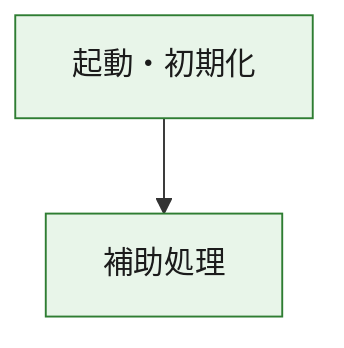
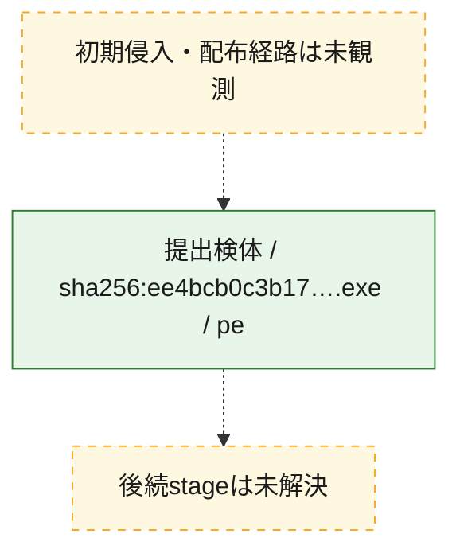
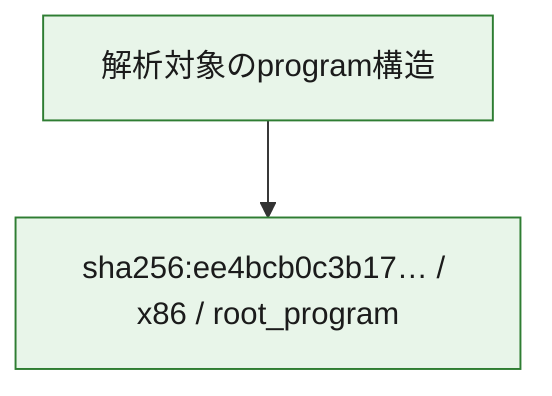

# 全体ロジック：ee4bcb0c3b1787b0da543803f75c30877fbb588fdf5e47a6ea6f04d0ed2d39ed

代表関数の静的証跡から、起動・初期化の処理群を確認しました。

## 読み方

- phaseの掲載順は解析上の整理順です。observed_call_edgesがない段階間の実行順を断定しません。
- 図の実線は静的に観測した関係、点線と黄色のノードは未観測・未解決の関係を示します。
- 図は静的な要約であり、動的実行を再現するものではありません。
- 詳細な関数解説とfingerprintは[STATIC-LOGIC.md](STATIC-LOGIC.md)を参照してください。

## 静的可視化

### 実行フロー

### 感染チェーン

### モジュール関係

## 処理段階

### 1. 起動・初期化

entry pointから初期化と後続処理への移行を確認します。
確度: `confirmed_static_function_evidence`

- `ee4bcb0c3b1787b0da543803f75c30877fbb588fdf5e47a6ea6f04d0ed2d39ed:ghidra:180001010` — 初期化と主要処理への分岐を行う入口関数です。 状態: `succeeded`、選定理由: `entry_point`, `meaningful_symbol_name`, `reviewed_call_centrality:22`, `role:entrypoint`, `small_program_complete_context`

### 2. 補助処理

主要処理を支える一般内部関数またはlibrary処理を確認します。
確度: `confirmed_static_function_evidence`

- `ee4bcb0c3b1787b0da543803f75c30877fbb588fdf5e47a6ea6f04d0ed2d39ed:ghidra:180001240` — 検体内部の一般処理を実装する関数です。 状態: `succeeded`、選定理由: `context_representative`, `reviewed_call_centrality:2`, `small_program_complete_context`
- `ee4bcb0c3b1787b0da543803f75c30877fbb588fdf5e47a6ea6f04d0ed2d39ed:ghidra:180001350` — 検体内部の一般処理を実装する関数です。 状態: `succeeded`、選定理由: `context_representative`, `reviewed_call_centrality:25`, `small_program_complete_context`
- `ee4bcb0c3b1787b0da543803f75c30877fbb588fdf5e47a6ea6f04d0ed2d39ed:ghidra:180003780` — 検体内部の一般処理を実装する関数です。 状態: `succeeded`、選定理由: `context_representative`, `reviewed_call_centrality:2`, `small_program_complete_context`
- `ee4bcb0c3b1787b0da543803f75c30877fbb588fdf5e47a6ea6f04d0ed2d39ed:ghidra:1800038e0` — 検体内部の一般処理を実装する関数です。 状態: `succeeded`、選定理由: `context_representative`, `reviewed_call_centrality:2`, `small_program_complete_context`

## 観測したcall関係

- `ee4bcb0c3b1787b0da543803f75c30877fbb588fdf5e47a6ea6f04d0ed2d39ed:ghidra:180001010` → `ee4bcb0c3b1787b0da543803f75c30877fbb588fdf5e47a6ea6f04d0ed2d39ed:ghidra:180001240` （`startup` → `support`）
- `ee4bcb0c3b1787b0da543803f75c30877fbb588fdf5e47a6ea6f04d0ed2d39ed:ghidra:180001010` → `ee4bcb0c3b1787b0da543803f75c30877fbb588fdf5e47a6ea6f04d0ed2d39ed:ghidra:180001350` （`startup` → `support`）
- `ee4bcb0c3b1787b0da543803f75c30877fbb588fdf5e47a6ea6f04d0ed2d39ed:ghidra:180001350` → `ee4bcb0c3b1787b0da543803f75c30877fbb588fdf5e47a6ea6f04d0ed2d39ed:ghidra:180001240` （`support` → `support`）
- `ee4bcb0c3b1787b0da543803f75c30877fbb588fdf5e47a6ea6f04d0ed2d39ed:ghidra:180001350` → `ee4bcb0c3b1787b0da543803f75c30877fbb588fdf5e47a6ea6f04d0ed2d39ed:ghidra:180003780` （`support` → `support`）
- `ee4bcb0c3b1787b0da543803f75c30877fbb588fdf5e47a6ea6f04d0ed2d39ed:ghidra:180001350` → `ee4bcb0c3b1787b0da543803f75c30877fbb588fdf5e47a6ea6f04d0ed2d39ed:ghidra:1800038e0` （`support` → `support`）
- `ee4bcb0c3b1787b0da543803f75c30877fbb588fdf5e47a6ea6f04d0ed2d39ed:ghidra:180003780` → `ee4bcb0c3b1787b0da543803f75c30877fbb588fdf5e47a6ea6f04d0ed2d39ed:ghidra:1800038e0` （`support` → `support`）
- `ghidra-function:135f770fed6c279bdf3a60b0` → `ghidra-function:12b06dc2217ec2e248fa02de` （`unclassified` → `unclassified`）
- `ghidra-function:135f770fed6c279bdf3a60b0` → `ghidra-function:1400f3f79f691a3e30c82bf8` （`unclassified` → `unclassified`）
- `ghidra-function:135f770fed6c279bdf3a60b0` → `ghidra-function:393b8dfc967eef5bef98d1a2` （`unclassified` → `unclassified`）
- `ghidra-function:135f770fed6c279bdf3a60b0` → `ghidra-function:74d0b775c01da5eafd79c3a8` （`unclassified` → `unclassified`）
- `ghidra-function:135f770fed6c279bdf3a60b0` → `ghidra-function:8450bb37f085104cedcf7b97` （`unclassified` → `unclassified`）
- `ghidra-function:135f770fed6c279bdf3a60b0` → `ghidra-function:846fc4d56734d5c50af2db57` （`unclassified` → `unclassified`）
- `ghidra-function:135f770fed6c279bdf3a60b0` → `ghidra-function:aa8cda2d356c26de31aa6db3` （`unclassified` → `unclassified`）
- `ghidra-function:135f770fed6c279bdf3a60b0` → `ghidra-function:c4257a846207f8533c2df037` （`unclassified` → `unclassified`）
- `ghidra-function:135f770fed6c279bdf3a60b0` → `ghidra-function:ec75e6de9784555572dd82f1` （`unclassified` → `unclassified`）
- `ghidra-function:135f770fed6c279bdf3a60b0` → `ghidra-function:f050026c605651f1dfba3cc0` （`unclassified` → `unclassified`）
- `ghidra-function:135f770fed6c279bdf3a60b0` → `ghidra-function:f2416dad8cdfd840ae4e7aaf` （`unclassified` → `unclassified`）
- `ghidra-function:135f770fed6c279bdf3a60b0` → `ghidra-function:ff327872b1d7fe81cff2013b` （`unclassified` → `unclassified`）
- `ghidra-function:49a26b1b8abcc63e327f7490` → `ghidra-function:24d06c56501575357e0d4901` （`unclassified` → `unclassified`）
- `ghidra-function:aa8cda2d356c26de31aa6db3` → `ghidra-external:069318719cf89d85f2e0084b` （`unclassified` → `unclassified`）
- `ghidra-function:aa8cda2d356c26de31aa6db3` → `ghidra-external:159c28f0dcacc66b53473a46` （`unclassified` → `unclassified`）
- `ghidra-function:aa8cda2d356c26de31aa6db3` → `ghidra-external:1a7672d732a544f6f7d25cd0` （`unclassified` → `unclassified`）
- `ghidra-function:aa8cda2d356c26de31aa6db3` → `ghidra-external:267a86ea70a2e55faeade8af` （`unclassified` → `unclassified`）
- `ghidra-function:aa8cda2d356c26de31aa6db3` → `ghidra-external:283b5100c2fe0f45cf85c6d1` （`unclassified` → `unclassified`）
- `ghidra-function:aa8cda2d356c26de31aa6db3` → `ghidra-external:29eef7b57787ae9667bfe58a` （`unclassified` → `unclassified`）
- `ghidra-function:aa8cda2d356c26de31aa6db3` → `ghidra-external:367f818d45f5908967cdf2f8` （`unclassified` → `unclassified`）
- `ghidra-function:aa8cda2d356c26de31aa6db3` → `ghidra-external:3f998481eebcbdd3e25b8fb6` （`unclassified` → `unclassified`）
- `ghidra-function:aa8cda2d356c26de31aa6db3` → `ghidra-external:489d2ab01ec3f9fd1d885700` （`unclassified` → `unclassified`）
- `ghidra-function:aa8cda2d356c26de31aa6db3` → `ghidra-external:60a85feaad010c0550f50d18` （`unclassified` → `unclassified`）
- `ghidra-function:aa8cda2d356c26de31aa6db3` → `ghidra-external:6b99b9b11f9f3cd01756be35` （`unclassified` → `unclassified`）
- `ghidra-function:aa8cda2d356c26de31aa6db3` → `ghidra-external:6c9169b2e46103aeae6e7d15` （`unclassified` → `unclassified`）
- `ghidra-function:aa8cda2d356c26de31aa6db3` → `ghidra-external:6cb5dc17d7f4b951cdfc669e` （`unclassified` → `unclassified`）
- `ghidra-function:aa8cda2d356c26de31aa6db3` → `ghidra-external:a0e836e58d78eba3105da916` （`unclassified` → `unclassified`）
- `ghidra-function:aa8cda2d356c26de31aa6db3` → `ghidra-external:bb38afaf2d34e53f7b16c88b` （`unclassified` → `unclassified`）
- `ghidra-function:aa8cda2d356c26de31aa6db3` → `ghidra-external:c8f475408ec94029192c14aa` （`unclassified` → `unclassified`）
- `ghidra-function:aa8cda2d356c26de31aa6db3` → `ghidra-external:d1da13431140c1e5d50117dc` （`unclassified` → `unclassified`）
- `ghidra-function:aa8cda2d356c26de31aa6db3` → `ghidra-external:e851c2140f9ff225f391ac90` （`unclassified` → `unclassified`）
- `ghidra-function:aa8cda2d356c26de31aa6db3` → `ghidra-external:f05a21788ed25c3f1e23c385` （`unclassified` → `unclassified`）
- `ghidra-function:aa8cda2d356c26de31aa6db3` → `ghidra-external:f409f56f25dfd1bce4af31ad` （`unclassified` → `unclassified`）
- `ghidra-function:aa8cda2d356c26de31aa6db3` → `ghidra-external:f7da15ed347d85999c9efe11` （`unclassified` → `unclassified`）
- `ghidra-function:aa8cda2d356c26de31aa6db3` → `ghidra-function:24d06c56501575357e0d4901` （`unclassified` → `unclassified`）
- `ghidra-function:aa8cda2d356c26de31aa6db3` → `ghidra-function:49a26b1b8abcc63e327f7490` （`unclassified` → `unclassified`）
- `ghidra-function:aa8cda2d356c26de31aa6db3` → `ghidra-function:846fc4d56734d5c50af2db57` （`unclassified` → `unclassified`）

## 解析範囲と制約

- 選定外関数は全体inventoryへ残しますが、関数本体の個別解説対象にはしていません。
- indirect call、難読化、packer、VM、壊れたcontrol flowによりcall関係が欠落する場合があります。
- 文書は静的解析に基づき、検体実行や外部通信による動的確認は行っていません。
