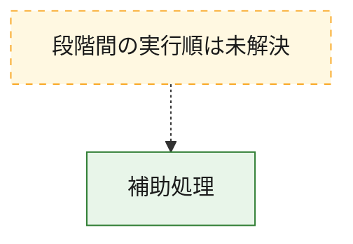
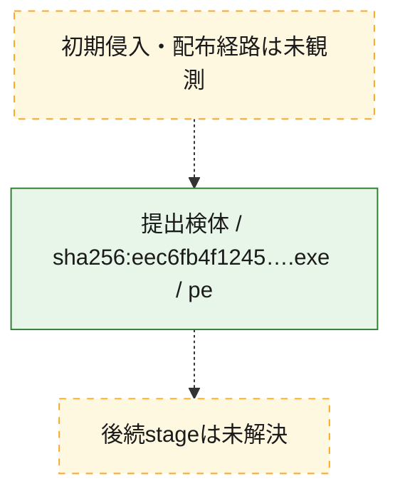
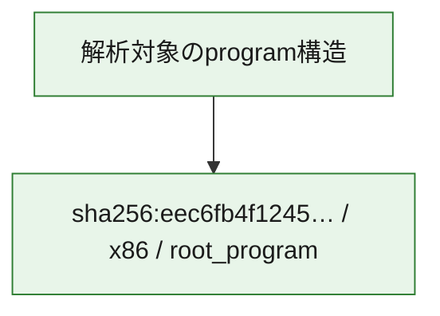

# 全体ロジック：eec6fb4f124564fea83670faf7b61140347020a3ca3eef052d4dc6bad4097893

代表関数から主要なmalware処理段階を自動分類できませんでした。

## 読み方

- phaseの掲載順は解析上の整理順です。observed_call_edgesがない段階間の実行順を断定しません。
- 図の実線は静的に観測した関係、点線と黄色のノードは未観測・未解決の関係を示します。
- 図は静的な要約であり、動的実行を再現するものではありません。
- 詳細な関数解説とfingerprintは[STATIC-LOGIC.md](STATIC-LOGIC.md)を参照してください。

## 静的可視化

### 実行フロー

### 感染チェーン

### モジュール関係

## 処理段階

### 1. 補助処理

主要処理を支える一般内部関数またはlibrary処理を確認します。
確度: `confirmed_static_function_evidence`

- `eec6fb4f124564fea83670faf7b61140347020a3ca3eef052d4dc6bad4097893:ghidra:1400168f0` — 検体内部の一般処理を実装する関数です。 状態: `succeeded`、選定理由: `context_representative`, `small_program_complete_context`
- `eec6fb4f124564fea83670faf7b61140347020a3ca3eef052d4dc6bad4097893:ghidra:1400169b0` — 検体内部の一般処理を実装する関数です。 状態: `succeeded`、選定理由: `context_representative`, `reviewed_call_centrality:2`, `small_program_complete_context`
- `eec6fb4f124564fea83670faf7b61140347020a3ca3eef052d4dc6bad4097893:ghidra:1400169e0` — 検体内部の一般処理を実装する関数です。 状態: `succeeded`、選定理由: `context_representative`, `reviewed_call_centrality:2`, `small_program_complete_context`
- `eec6fb4f124564fea83670faf7b61140347020a3ca3eef052d4dc6bad4097893:ghidra:140016a80` — 検体内部の一般処理を実装する関数です。 状態: `succeeded`、選定理由: `context_representative`, `reviewed_call_centrality:2`, `small_program_complete_context`
- `eec6fb4f124564fea83670faf7b61140347020a3ca3eef052d4dc6bad4097893:ghidra:140016b00` — 検体内部の一般処理を実装する関数です。 状態: `succeeded`、選定理由: `context_representative`, `reviewed_call_centrality:2`, `small_program_complete_context`
- `eec6fb4f124564fea83670faf7b61140347020a3ca3eef052d4dc6bad4097893:ghidra:140016b40` — 検体内部の一般処理を実装する関数です。 状態: `succeeded`、選定理由: `context_representative`, `reviewed_call_centrality:2`, `small_program_complete_context`
- `eec6fb4f124564fea83670faf7b61140347020a3ca3eef052d4dc6bad4097893:ghidra:140016cf0` — 検体内部の一般処理を実装する関数です。 状態: `succeeded`、選定理由: `context_representative`, `reviewed_call_centrality:2`, `small_program_complete_context`
- `eec6fb4f124564fea83670faf7b61140347020a3ca3eef052d4dc6bad4097893:ghidra:140016d40` — 検体内部の一般処理を実装する関数です。 状態: `succeeded`、選定理由: `context_representative`, `reviewed_call_centrality:2`, `small_program_complete_context`
- `eec6fb4f124564fea83670faf7b61140347020a3ca3eef052d4dc6bad4097893:ghidra:140016f20` — 検体内部の一般処理を実装する関数です。 状態: `succeeded`、選定理由: `context_representative`, `reviewed_call_centrality:2`, `small_program_complete_context`
- `eec6fb4f124564fea83670faf7b61140347020a3ca3eef052d4dc6bad4097893:ghidra:1400170e0` — 検体内部の一般処理を実装する関数です。 状態: `succeeded`、選定理由: `context_representative`, `reviewed_call_centrality:2`, `small_program_complete_context`
- `eec6fb4f124564fea83670faf7b61140347020a3ca3eef052d4dc6bad4097893:ghidra:140017120` — 検体内部の一般処理を実装する関数です。 状態: `succeeded`、選定理由: `context_representative`, `reviewed_call_centrality:1`, `small_program_complete_context`
- `eec6fb4f124564fea83670faf7b61140347020a3ca3eef052d4dc6bad4097893:ghidra:140017360` — 検体内部の一般処理を実装する関数です。 状態: `succeeded`、選定理由: `context_representative`, `reviewed_call_centrality:1`, `small_program_complete_context`
- `eec6fb4f124564fea83670faf7b61140347020a3ca3eef052d4dc6bad4097893:ghidra:1400173d0` — 検体内部の一般処理を実装する関数です。 状態: `succeeded`、選定理由: `context_representative`, `reviewed_call_centrality:1`, `small_program_complete_context`
- `eec6fb4f124564fea83670faf7b61140347020a3ca3eef052d4dc6bad4097893:ghidra:1400174b0` — 検体内部の一般処理を実装する関数です。 状態: `succeeded`、選定理由: `context_representative`, `reviewed_call_centrality:2`, `small_program_complete_context`
- `eec6fb4f124564fea83670faf7b61140347020a3ca3eef052d4dc6bad4097893:ghidra:1400176d0` — 検体内部の一般処理を実装する関数です。 状態: `succeeded`、選定理由: `context_representative`, `reviewed_call_centrality:2`, `small_program_complete_context`
- `eec6fb4f124564fea83670faf7b61140347020a3ca3eef052d4dc6bad4097893:ghidra:140017720` — 検体内部の一般処理を実装する関数です。 状態: `succeeded`、選定理由: `context_representative`, `reviewed_call_centrality:1`, `small_program_complete_context`
- `eec6fb4f124564fea83670faf7b61140347020a3ca3eef052d4dc6bad4097893:ghidra:140017820` — 検体内部の一般処理を実装する関数です。 状態: `succeeded`、選定理由: `context_representative`, `reviewed_call_centrality:2`, `small_program_complete_context`
- `eec6fb4f124564fea83670faf7b61140347020a3ca3eef052d4dc6bad4097893:ghidra:140017a40` — 検体内部の一般処理を実装する関数です。 状態: `succeeded`、選定理由: `context_representative`, `reviewed_call_centrality:1`, `small_program_complete_context`
- `eec6fb4f124564fea83670faf7b61140347020a3ca3eef052d4dc6bad4097893:ghidra:140017aa0` — 検体内部の一般処理を実装する関数です。 状態: `succeeded`、選定理由: `context_representative`, `reviewed_call_centrality:1`, `small_program_complete_context`
- `eec6fb4f124564fea83670faf7b61140347020a3ca3eef052d4dc6bad4097893:ghidra:140017b10` — 検体内部の一般処理を実装する関数です。 状態: `succeeded`、選定理由: `context_representative`, `reviewed_call_centrality:3`, `small_program_complete_context`
- `eec6fb4f124564fea83670faf7b61140347020a3ca3eef052d4dc6bad4097893:ghidra:140017bf0` — 検体内部の一般処理を実装する関数です。 状態: `succeeded`、選定理由: `context_representative`, `reviewed_call_centrality:1`, `small_program_complete_context`
- `eec6fb4f124564fea83670faf7b61140347020a3ca3eef052d4dc6bad4097893:ghidra:140017cd0` — 検体内部の一般処理を実装する関数です。 状態: `succeeded`、選定理由: `context_representative`, `reviewed_call_centrality:1`, `small_program_complete_context`
- `eec6fb4f124564fea83670faf7b61140347020a3ca3eef052d4dc6bad4097893:ghidra:140017d20` — 検体内部の一般処理を実装する関数です。 状態: `succeeded`、選定理由: `context_representative`, `reviewed_call_centrality:2`, `small_program_complete_context`
- `eec6fb4f124564fea83670faf7b61140347020a3ca3eef052d4dc6bad4097893:ghidra:140017d50` — 検体内部の一般処理を実装する関数です。 状態: `succeeded`、選定理由: `context_representative`, `reviewed_call_centrality:50`, `small_program_complete_context`
- `eec6fb4f124564fea83670faf7b61140347020a3ca3eef052d4dc6bad4097893:ghidra:1400185d0` — 検体内部の一般処理を実装する関数です。 状態: `succeeded`、選定理由: `context_representative`, `small_program_complete_context`
- `eec6fb4f124564fea83670faf7b61140347020a3ca3eef052d4dc6bad4097893:ghidra:140018640` — 検体内部の一般処理を実装する関数です。 状態: `succeeded`、選定理由: `context_representative`, `small_program_complete_context`
- `eec6fb4f124564fea83670faf7b61140347020a3ca3eef052d4dc6bad4097893:ghidra:140018700` — 検体内部の一般処理を実装する関数です。 状態: `succeeded`、選定理由: `context_representative`, `reviewed_call_centrality:1`, `small_program_complete_context`
- `eec6fb4f124564fea83670faf7b61140347020a3ca3eef052d4dc6bad4097893:ghidra:1400187a0` — 検体内部の一般処理を実装する関数です。 状態: `succeeded`、選定理由: `context_representative`, `reviewed_call_centrality:1`, `small_program_complete_context`
- `eec6fb4f124564fea83670faf7b61140347020a3ca3eef052d4dc6bad4097893:ghidra:140018870` — 検体内部の一般処理を実装する関数です。 状態: `succeeded`、選定理由: `context_representative`, `small_program_complete_context`

## 観測したcall関係

- `eec6fb4f124564fea83670faf7b61140347020a3ca3eef052d4dc6bad4097893:ghidra:140016b40` → `eec6fb4f124564fea83670faf7b61140347020a3ca3eef052d4dc6bad4097893:ghidra:140017b10` （`support` → `support`）
- `eec6fb4f124564fea83670faf7b61140347020a3ca3eef052d4dc6bad4097893:ghidra:140016f20` → `eec6fb4f124564fea83670faf7b61140347020a3ca3eef052d4dc6bad4097893:ghidra:140016cf0` （`support` → `support`）
- `eec6fb4f124564fea83670faf7b61140347020a3ca3eef052d4dc6bad4097893:ghidra:140017820` → `eec6fb4f124564fea83670faf7b61140347020a3ca3eef052d4dc6bad4097893:ghidra:1400174b0` （`support` → `support`）
- `eec6fb4f124564fea83670faf7b61140347020a3ca3eef052d4dc6bad4097893:ghidra:140017b10` → `eec6fb4f124564fea83670faf7b61140347020a3ca3eef052d4dc6bad4097893:ghidra:140016a80` （`support` → `support`）
- `eec6fb4f124564fea83670faf7b61140347020a3ca3eef052d4dc6bad4097893:ghidra:140017d20` → `eec6fb4f124564fea83670faf7b61140347020a3ca3eef052d4dc6bad4097893:ghidra:1400176d0` （`support` → `support`）
- `eec6fb4f124564fea83670faf7b61140347020a3ca3eef052d4dc6bad4097893:ghidra:140017d50` → `eec6fb4f124564fea83670faf7b61140347020a3ca3eef052d4dc6bad4097893:ghidra:1400169b0` （`support` → `support`）
- `eec6fb4f124564fea83670faf7b61140347020a3ca3eef052d4dc6bad4097893:ghidra:140017d50` → `eec6fb4f124564fea83670faf7b61140347020a3ca3eef052d4dc6bad4097893:ghidra:1400169e0` （`support` → `support`）
- `eec6fb4f124564fea83670faf7b61140347020a3ca3eef052d4dc6bad4097893:ghidra:140017d50` → `eec6fb4f124564fea83670faf7b61140347020a3ca3eef052d4dc6bad4097893:ghidra:140016a80` （`support` → `support`）
- `eec6fb4f124564fea83670faf7b61140347020a3ca3eef052d4dc6bad4097893:ghidra:140017d50` → `eec6fb4f124564fea83670faf7b61140347020a3ca3eef052d4dc6bad4097893:ghidra:140016b00` （`support` → `support`）
- `eec6fb4f124564fea83670faf7b61140347020a3ca3eef052d4dc6bad4097893:ghidra:140017d50` → `eec6fb4f124564fea83670faf7b61140347020a3ca3eef052d4dc6bad4097893:ghidra:140016b40` （`support` → `support`）
- `eec6fb4f124564fea83670faf7b61140347020a3ca3eef052d4dc6bad4097893:ghidra:140017d50` → `eec6fb4f124564fea83670faf7b61140347020a3ca3eef052d4dc6bad4097893:ghidra:140016cf0` （`support` → `support`）
- `eec6fb4f124564fea83670faf7b61140347020a3ca3eef052d4dc6bad4097893:ghidra:140017d50` → `eec6fb4f124564fea83670faf7b61140347020a3ca3eef052d4dc6bad4097893:ghidra:140016d40` （`support` → `support`）
- `eec6fb4f124564fea83670faf7b61140347020a3ca3eef052d4dc6bad4097893:ghidra:140017d50` → `eec6fb4f124564fea83670faf7b61140347020a3ca3eef052d4dc6bad4097893:ghidra:140016f20` （`support` → `support`）
- `eec6fb4f124564fea83670faf7b61140347020a3ca3eef052d4dc6bad4097893:ghidra:140017d50` → `eec6fb4f124564fea83670faf7b61140347020a3ca3eef052d4dc6bad4097893:ghidra:1400170e0` （`support` → `support`）
- `eec6fb4f124564fea83670faf7b61140347020a3ca3eef052d4dc6bad4097893:ghidra:140017d50` → `eec6fb4f124564fea83670faf7b61140347020a3ca3eef052d4dc6bad4097893:ghidra:140017120` （`support` → `support`）
- `eec6fb4f124564fea83670faf7b61140347020a3ca3eef052d4dc6bad4097893:ghidra:140017d50` → `eec6fb4f124564fea83670faf7b61140347020a3ca3eef052d4dc6bad4097893:ghidra:140017360` （`support` → `support`）
- `eec6fb4f124564fea83670faf7b61140347020a3ca3eef052d4dc6bad4097893:ghidra:140017d50` → `eec6fb4f124564fea83670faf7b61140347020a3ca3eef052d4dc6bad4097893:ghidra:1400173d0` （`support` → `support`）
- `eec6fb4f124564fea83670faf7b61140347020a3ca3eef052d4dc6bad4097893:ghidra:140017d50` → `eec6fb4f124564fea83670faf7b61140347020a3ca3eef052d4dc6bad4097893:ghidra:1400174b0` （`support` → `support`）
- `eec6fb4f124564fea83670faf7b61140347020a3ca3eef052d4dc6bad4097893:ghidra:140017d50` → `eec6fb4f124564fea83670faf7b61140347020a3ca3eef052d4dc6bad4097893:ghidra:1400176d0` （`support` → `support`）
- `eec6fb4f124564fea83670faf7b61140347020a3ca3eef052d4dc6bad4097893:ghidra:140017d50` → `eec6fb4f124564fea83670faf7b61140347020a3ca3eef052d4dc6bad4097893:ghidra:140017720` （`support` → `support`）
- `eec6fb4f124564fea83670faf7b61140347020a3ca3eef052d4dc6bad4097893:ghidra:140017d50` → `eec6fb4f124564fea83670faf7b61140347020a3ca3eef052d4dc6bad4097893:ghidra:140017820` （`support` → `support`）
- `eec6fb4f124564fea83670faf7b61140347020a3ca3eef052d4dc6bad4097893:ghidra:140017d50` → `eec6fb4f124564fea83670faf7b61140347020a3ca3eef052d4dc6bad4097893:ghidra:140017a40` （`support` → `support`）
- `eec6fb4f124564fea83670faf7b61140347020a3ca3eef052d4dc6bad4097893:ghidra:140017d50` → `eec6fb4f124564fea83670faf7b61140347020a3ca3eef052d4dc6bad4097893:ghidra:140017aa0` （`support` → `support`）
- `eec6fb4f124564fea83670faf7b61140347020a3ca3eef052d4dc6bad4097893:ghidra:140017d50` → `eec6fb4f124564fea83670faf7b61140347020a3ca3eef052d4dc6bad4097893:ghidra:140017b10` （`support` → `support`）
- `eec6fb4f124564fea83670faf7b61140347020a3ca3eef052d4dc6bad4097893:ghidra:140017d50` → `eec6fb4f124564fea83670faf7b61140347020a3ca3eef052d4dc6bad4097893:ghidra:140017bf0` （`support` → `support`）
- `eec6fb4f124564fea83670faf7b61140347020a3ca3eef052d4dc6bad4097893:ghidra:140017d50` → `eec6fb4f124564fea83670faf7b61140347020a3ca3eef052d4dc6bad4097893:ghidra:140017cd0` （`support` → `support`）
- `eec6fb4f124564fea83670faf7b61140347020a3ca3eef052d4dc6bad4097893:ghidra:140017d50` → `eec6fb4f124564fea83670faf7b61140347020a3ca3eef052d4dc6bad4097893:ghidra:140017d20` （`support` → `support`）
- `ghidra-function:0af6f6c768f2da9be8489595` → `ghidra-function:70cc096f78dcb888cee24a66` （`unclassified` → `unclassified`）
- `ghidra-function:374e938abb3f0a5365a9fdc4` → `ghidra-external:6b3afe6d9d2eb7b10ebce0f2` （`unclassified` → `unclassified`）
- `ghidra-function:44f6ec4ec4126fd8847b97d1` → `ghidra-function:9a1f23ec4126aaba3acdadaa` （`unclassified` → `unclassified`）
- `ghidra-function:59ed679ff60432342c33e032` → `ghidra-external:9750b1cde5988ae922cca57c` （`unclassified` → `unclassified`）
- `ghidra-function:6629daf03f15c4d9fbb927ea` → `ghidra-function:2a2b2604963a2064e5698b7f` （`unclassified` → `unclassified`）
- `ghidra-function:699cb2942b8830909baa46a5` → `ghidra-external:9750b1cde5988ae922cca57c` （`unclassified` → `unclassified`）
- `ghidra-function:99740ab2032c96969b5e149c` → `ghidra-external:6c7ca0ec2d9de5e91f594199` （`unclassified` → `unclassified`）
- `ghidra-function:a20a8833c8980db54115cd7c` → `ghidra-external:054197c748ac99171ef61ae6` （`unclassified` → `unclassified`）
- `ghidra-function:a20a8833c8980db54115cd7c` → `ghidra-external:2dbca3bcb4e09423735b3b7c` （`unclassified` → `unclassified`）
- `ghidra-function:a20a8833c8980db54115cd7c` → `ghidra-external:2f6ed79e72273d8bf0359c1e` （`unclassified` → `unclassified`）
- `ghidra-function:a20a8833c8980db54115cd7c` → `ghidra-external:49892e747547223e7ab803b4` （`unclassified` → `unclassified`）
- `ghidra-function:a20a8833c8980db54115cd7c` → `ghidra-external:6b3afe6d9d2eb7b10ebce0f2` （`unclassified` → `unclassified`）
- `ghidra-function:a20a8833c8980db54115cd7c` → `ghidra-external:6c7ca0ec2d9de5e91f594199` （`unclassified` → `unclassified`）
- `ghidra-function:a20a8833c8980db54115cd7c` → `ghidra-external:7be522937e2221c032c2437a` （`unclassified` → `unclassified`）
- `ghidra-function:a20a8833c8980db54115cd7c` → `ghidra-external:7cf7a02c0d65a446ca2aec47` （`unclassified` → `unclassified`）
- `ghidra-function:a20a8833c8980db54115cd7c` → `ghidra-external:7ea04725ead400a25b0d5e78` （`unclassified` → `unclassified`）
- `ghidra-function:a20a8833c8980db54115cd7c` → `ghidra-external:9228ace7f6fde2fb82322f86` （`unclassified` → `unclassified`）
- `ghidra-function:a20a8833c8980db54115cd7c` → `ghidra-external:936d93031892ee13fa657ee0` （`unclassified` → `unclassified`）
- `ghidra-function:a20a8833c8980db54115cd7c` → `ghidra-external:a30649237337257e2a5a8e59` （`unclassified` → `unclassified`）
- `ghidra-function:a20a8833c8980db54115cd7c` → `ghidra-external:a4178dc31246a5e530d65b1c` （`unclassified` → `unclassified`）
- `ghidra-function:a20a8833c8980db54115cd7c` → `ghidra-external:a6e3ac2b53a39462af6b31d0` （`unclassified` → `unclassified`）
- `ghidra-function:a20a8833c8980db54115cd7c` → `ghidra-external:b0a7803ac666f11adcf0c282` （`unclassified` → `unclassified`）
- `ghidra-function:a20a8833c8980db54115cd7c` → `ghidra-external:c6e89ae2f7080ffd366d415e` （`unclassified` → `unclassified`）
- `ghidra-function:a20a8833c8980db54115cd7c` → `ghidra-external:cd015f6b45d0db544e124264` （`unclassified` → `unclassified`）
- `ghidra-function:a20a8833c8980db54115cd7c` → `ghidra-external:d136212cf5007ee40431e6ef` （`unclassified` → `unclassified`）
- `ghidra-function:a20a8833c8980db54115cd7c` → `ghidra-external:d7c123168a622e9ff5589794` （`unclassified` → `unclassified`）
- `ghidra-function:a20a8833c8980db54115cd7c` → `ghidra-external:d8125d36f8b27471a84829af` （`unclassified` → `unclassified`）
- `ghidra-function:a20a8833c8980db54115cd7c` → `ghidra-external:db30745bcb48b83e1b40504c` （`unclassified` → `unclassified`）
- `ghidra-function:a20a8833c8980db54115cd7c` → `ghidra-external:e6eb345e65b902278ab2a327` （`unclassified` → `unclassified`）
- `ghidra-function:a20a8833c8980db54115cd7c` → `ghidra-external:e7a674302f8154e6e36fe786` （`unclassified` → `unclassified`）
- `ghidra-function:a20a8833c8980db54115cd7c` → `ghidra-external:e80b06a9a80f3abbdc059a48` （`unclassified` → `unclassified`）
- `ghidra-function:a20a8833c8980db54115cd7c` → `ghidra-external:eb20443de78853493009d04d` （`unclassified` → `unclassified`）
- `ghidra-function:a20a8833c8980db54115cd7c` → `ghidra-external:ee927a6b3e106f750401bec2` （`unclassified` → `unclassified`）
- `ghidra-function:a20a8833c8980db54115cd7c` → `ghidra-external:f175c4593a2815484adc0b86` （`unclassified` → `unclassified`）
- `ghidra-function:a20a8833c8980db54115cd7c` → `ghidra-external:f61170aad0cc286830e97237` （`unclassified` → `unclassified`）
- `ghidra-function:a20a8833c8980db54115cd7c` → `ghidra-function:0af6f6c768f2da9be8489595` （`unclassified` → `unclassified`）
- `ghidra-function:a20a8833c8980db54115cd7c` → `ghidra-function:2a2b2604963a2064e5698b7f` （`unclassified` → `unclassified`）
- `ghidra-function:a20a8833c8980db54115cd7c` → `ghidra-function:374e938abb3f0a5365a9fdc4` （`unclassified` → `unclassified`）
- `ghidra-function:a20a8833c8980db54115cd7c` → `ghidra-function:44b0c0afd2b8b6d5c3dd5fa1` （`unclassified` → `unclassified`）
- `ghidra-function:a20a8833c8980db54115cd7c` → `ghidra-function:44f6ec4ec4126fd8847b97d1` （`unclassified` → `unclassified`）
- `ghidra-function:a20a8833c8980db54115cd7c` → `ghidra-function:48a1da801860189fe476a61b` （`unclassified` → `unclassified`）
- `ghidra-function:a20a8833c8980db54115cd7c` → `ghidra-function:6629daf03f15c4d9fbb927ea` （`unclassified` → `unclassified`）
- `ghidra-function:a20a8833c8980db54115cd7c` → `ghidra-function:67bbade3d7b66c304277f88d` （`unclassified` → `unclassified`）
- `ghidra-function:a20a8833c8980db54115cd7c` → `ghidra-function:6c6779a7c4f0fc2df32f8a8c` （`unclassified` → `unclassified`）
- `ghidra-function:a20a8833c8980db54115cd7c` → `ghidra-function:70cc096f78dcb888cee24a66` （`unclassified` → `unclassified`）
- `ghidra-function:a20a8833c8980db54115cd7c` → `ghidra-function:8d60aaa54143c70057142835` （`unclassified` → `unclassified`）
- `ghidra-function:a20a8833c8980db54115cd7c` → `ghidra-function:99740ab2032c96969b5e149c` （`unclassified` → `unclassified`）
- `ghidra-function:a20a8833c8980db54115cd7c` → `ghidra-function:9a1f23ec4126aaba3acdadaa` （`unclassified` → `unclassified`）
- `ghidra-function:a20a8833c8980db54115cd7c` → `ghidra-function:a732ceabecd14afe50c5c3ec` （`unclassified` → `unclassified`）
- `ghidra-function:a20a8833c8980db54115cd7c` → `ghidra-function:b27b8e32edfa879d6de23cdd` （`unclassified` → `unclassified`）
- `ghidra-function:a20a8833c8980db54115cd7c` → `ghidra-function:ba4f1602c5ca6f10f0c1fbd7` （`unclassified` → `unclassified`）
- `ghidra-function:a20a8833c8980db54115cd7c` → `ghidra-function:d1fff07855ddc91d23d18b2f` （`unclassified` → `unclassified`）
- `ghidra-function:a20a8833c8980db54115cd7c` → `ghidra-function:ecece48860f00724e4dec517` （`unclassified` → `unclassified`）
- `ghidra-function:a20a8833c8980db54115cd7c` → `ghidra-function:ef02980454b94320d89d5c9a` （`unclassified` → `unclassified`）
- `ghidra-function:a20a8833c8980db54115cd7c` → `ghidra-function:f13872d46f70449c0cea6b4a` （`unclassified` → `unclassified`）
- `ghidra-function:a20a8833c8980db54115cd7c` → `ghidra-function:f5f61341d1fcd66ff33e722f` （`unclassified` → `unclassified`）
- `ghidra-function:a20a8833c8980db54115cd7c` → `ghidra-function:fe66a21f3c5e8a8e19f3ad62` （`unclassified` → `unclassified`）
- `ghidra-function:b27b8e32edfa879d6de23cdd` → `ghidra-external:26b6c7a81ebe787cd4c00c43` （`unclassified` → `unclassified`）
- `ghidra-function:ba4f1602c5ca6f10f0c1fbd7` → `ghidra-function:ef02980454b94320d89d5c9a` （`unclassified` → `unclassified`）
- `ghidra-function:ef02980454b94320d89d5c9a` → `ghidra-function:ecece48860f00724e4dec517` （`unclassified` → `unclassified`）
- `ghidra-function:f13872d46f70449c0cea6b4a` → `ghidra-external:693bdb798f7c1579ecd465fe` （`unclassified` → `unclassified`）
- `ghidra-function:f5f61341d1fcd66ff33e722f` → `ghidra-external:62e0cdb2d8540ec2adf6b417` （`unclassified` → `unclassified`）

## 解析範囲と制約

- 選定外関数は全体inventoryへ残しますが、関数本体の個別解説対象にはしていません。
- indirect call、難読化、packer、VM、壊れたcontrol flowによりcall関係が欠落する場合があります。
- 文書は静的解析に基づき、検体実行や外部通信による動的確認は行っていません。
