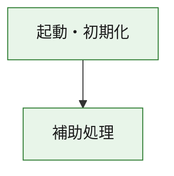
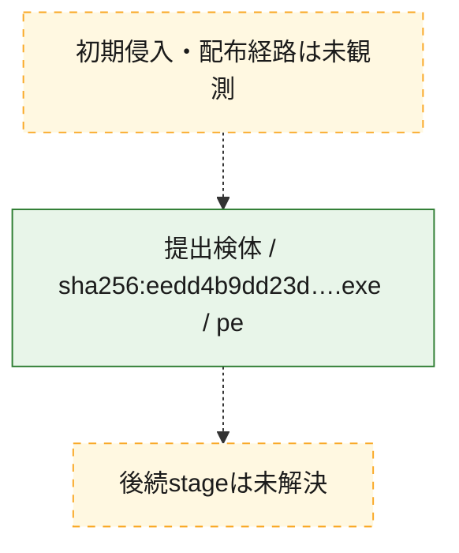
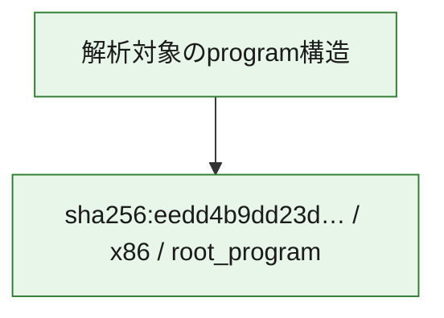

# 全体ロジック：eedd4b9dd23dd17b365f418881762810b2edfc702b615d38164e5de9c080a359

代表関数の静的証跡から、起動・初期化の処理群を確認しました。

## 読み方

- phaseの掲載順は解析上の整理順です。observed_call_edgesがない段階間の実行順を断定しません。
- 図の実線は静的に観測した関係、点線と黄色のノードは未観測・未解決の関係を示します。
- 図は静的な要約であり、動的実行を再現するものではありません。
- 詳細な関数解説とfingerprintは[STATIC-LOGIC.md](STATIC-LOGIC.md)を参照してください。

## 静的可視化

### 実行フロー

### 感染チェーン

### モジュール関係

## 処理段階

### 1. 起動・初期化

entry pointから初期化と後続処理への移行を確認します。
確度: `confirmed_static_function_evidence`

- `eedd4b9dd23dd17b365f418881762810b2edfc702b615d38164e5de9c080a359:ghidra:180001010` — 初期化と主要処理への分岐を行う入口関数です。 状態: `succeeded`、選定理由: `entry_point`, `meaningful_symbol_name`, `reviewed_call_centrality:22`, `role:entrypoint`, `small_program_complete_context`

### 2. 補助処理

主要処理を支える一般内部関数またはlibrary処理を確認します。
確度: `confirmed_static_function_evidence`

- `eedd4b9dd23dd17b365f418881762810b2edfc702b615d38164e5de9c080a359:ghidra:180001240` — 検体内部の一般処理を実装する関数です。 状態: `succeeded`、選定理由: `context_representative`, `reviewed_call_centrality:2`, `small_program_complete_context`
- `eedd4b9dd23dd17b365f418881762810b2edfc702b615d38164e5de9c080a359:ghidra:180001350` — 検体内部の一般処理を実装する関数です。 状態: `succeeded`、選定理由: `context_representative`, `reviewed_call_centrality:25`, `small_program_complete_context`
- `eedd4b9dd23dd17b365f418881762810b2edfc702b615d38164e5de9c080a359:ghidra:180003780` — 検体内部の一般処理を実装する関数です。 状態: `succeeded`、選定理由: `context_representative`, `reviewed_call_centrality:2`, `small_program_complete_context`
- `eedd4b9dd23dd17b365f418881762810b2edfc702b615d38164e5de9c080a359:ghidra:1800038e0` — 検体内部の一般処理を実装する関数です。 状態: `succeeded`、選定理由: `context_representative`, `reviewed_call_centrality:2`, `small_program_complete_context`

## 観測したcall関係

- `eedd4b9dd23dd17b365f418881762810b2edfc702b615d38164e5de9c080a359:ghidra:180001010` → `eedd4b9dd23dd17b365f418881762810b2edfc702b615d38164e5de9c080a359:ghidra:180001240` （`startup` → `support`）
- `eedd4b9dd23dd17b365f418881762810b2edfc702b615d38164e5de9c080a359:ghidra:180001010` → `eedd4b9dd23dd17b365f418881762810b2edfc702b615d38164e5de9c080a359:ghidra:180001350` （`startup` → `support`）
- `eedd4b9dd23dd17b365f418881762810b2edfc702b615d38164e5de9c080a359:ghidra:180001350` → `eedd4b9dd23dd17b365f418881762810b2edfc702b615d38164e5de9c080a359:ghidra:180001240` （`support` → `support`）
- `eedd4b9dd23dd17b365f418881762810b2edfc702b615d38164e5de9c080a359:ghidra:180001350` → `eedd4b9dd23dd17b365f418881762810b2edfc702b615d38164e5de9c080a359:ghidra:180003780` （`support` → `support`）
- `eedd4b9dd23dd17b365f418881762810b2edfc702b615d38164e5de9c080a359:ghidra:180001350` → `eedd4b9dd23dd17b365f418881762810b2edfc702b615d38164e5de9c080a359:ghidra:1800038e0` （`support` → `support`）
- `eedd4b9dd23dd17b365f418881762810b2edfc702b615d38164e5de9c080a359:ghidra:180003780` → `eedd4b9dd23dd17b365f418881762810b2edfc702b615d38164e5de9c080a359:ghidra:1800038e0` （`support` → `support`）
- `ghidra-function:67db6addba85a72dc460a401` → `ghidra-function:092540c78f5e9b9a4cfbbb52` （`unclassified` → `unclassified`）
- `ghidra-function:67db6addba85a72dc460a401` → `ghidra-function:56e9bce4334399161ae14e87` （`unclassified` → `unclassified`）
- `ghidra-function:67db6addba85a72dc460a401` → `ghidra-function:6301d3284bc2ec49fec5efe8` （`unclassified` → `unclassified`）
- `ghidra-function:67db6addba85a72dc460a401` → `ghidra-function:9c1629d47a8dd19ebc065187` （`unclassified` → `unclassified`）
- `ghidra-function:67db6addba85a72dc460a401` → `ghidra-function:9da778c27cbb5a3da6531878` （`unclassified` → `unclassified`）
- `ghidra-function:67db6addba85a72dc460a401` → `ghidra-function:acea6e8296d9d36d76d95684` （`unclassified` → `unclassified`）
- `ghidra-function:67db6addba85a72dc460a401` → `ghidra-function:b8583fdfa30f4d033e8220c7` （`unclassified` → `unclassified`）
- `ghidra-function:67db6addba85a72dc460a401` → `ghidra-function:c66262bdd5c2c02179744647` （`unclassified` → `unclassified`）
- `ghidra-function:67db6addba85a72dc460a401` → `ghidra-function:c7df5b8b6c69fb67ce2c3628` （`unclassified` → `unclassified`）
- `ghidra-function:67db6addba85a72dc460a401` → `ghidra-function:d4600dba9c66cddfad072469` （`unclassified` → `unclassified`）
- `ghidra-function:67db6addba85a72dc460a401` → `ghidra-function:e71860023f6ec1d6030f1c0d` （`unclassified` → `unclassified`）
- `ghidra-function:67db6addba85a72dc460a401` → `ghidra-function:e8953f5ca7f0a7a22a51ab89` （`unclassified` → `unclassified`）
- `ghidra-function:84d1f3ea5ec6ea31b3e5687b` → `ghidra-function:99a7ada8f37cbb2a3c287100` （`unclassified` → `unclassified`）
- `ghidra-function:d4600dba9c66cddfad072469` → `ghidra-external:1b7c6f4561a28ed1209d4c94` （`unclassified` → `unclassified`）
- `ghidra-function:d4600dba9c66cddfad072469` → `ghidra-external:268b54e9e1684c106edb6fa9` （`unclassified` → `unclassified`）
- `ghidra-function:d4600dba9c66cddfad072469` → `ghidra-external:2901fe758103b3be138b77e8` （`unclassified` → `unclassified`）
- `ghidra-function:d4600dba9c66cddfad072469` → `ghidra-external:2d37384f041f8162564db6b8` （`unclassified` → `unclassified`）
- `ghidra-function:d4600dba9c66cddfad072469` → `ghidra-external:358adace39dfdd41ac507b1d` （`unclassified` → `unclassified`）
- `ghidra-function:d4600dba9c66cddfad072469` → `ghidra-external:3c05804109c3ab3379be8b95` （`unclassified` → `unclassified`）
- `ghidra-function:d4600dba9c66cddfad072469` → `ghidra-external:473896fd4fe1c5779830a869` （`unclassified` → `unclassified`）
- `ghidra-function:d4600dba9c66cddfad072469` → `ghidra-external:475a371bdd952d592f713b76` （`unclassified` → `unclassified`）
- `ghidra-function:d4600dba9c66cddfad072469` → `ghidra-external:60f2f70bcbe1a9ec8fe36991` （`unclassified` → `unclassified`）
- `ghidra-function:d4600dba9c66cddfad072469` → `ghidra-external:64154e54a53964d504e2d221` （`unclassified` → `unclassified`）
- `ghidra-function:d4600dba9c66cddfad072469` → `ghidra-external:71fd26de99be5147240f864c` （`unclassified` → `unclassified`）
- `ghidra-function:d4600dba9c66cddfad072469` → `ghidra-external:7246abbd9983ba1b8f413731` （`unclassified` → `unclassified`）
- `ghidra-function:d4600dba9c66cddfad072469` → `ghidra-external:77ad4fae555320f2babd63ad` （`unclassified` → `unclassified`）
- `ghidra-function:d4600dba9c66cddfad072469` → `ghidra-external:85e1feb4b32909c99529b936` （`unclassified` → `unclassified`）
- `ghidra-function:d4600dba9c66cddfad072469` → `ghidra-external:860aae264d90ca13a0d80707` （`unclassified` → `unclassified`）
- `ghidra-function:d4600dba9c66cddfad072469` → `ghidra-external:ae14a1349f5a81b638954d49` （`unclassified` → `unclassified`）
- `ghidra-function:d4600dba9c66cddfad072469` → `ghidra-external:b51eb437027ce7cc394db6a0` （`unclassified` → `unclassified`）
- `ghidra-function:d4600dba9c66cddfad072469` → `ghidra-external:bf1d8de8f0f3ef1675c04939` （`unclassified` → `unclassified`）
- `ghidra-function:d4600dba9c66cddfad072469` → `ghidra-external:ca7cb348144ee895b65ab80e` （`unclassified` → `unclassified`）
- `ghidra-function:d4600dba9c66cddfad072469` → `ghidra-external:e34a9514e66a012d0cd5190c` （`unclassified` → `unclassified`）
- `ghidra-function:d4600dba9c66cddfad072469` → `ghidra-external:f854d2b4697757572975034e` （`unclassified` → `unclassified`）
- `ghidra-function:d4600dba9c66cddfad072469` → `ghidra-function:6301d3284bc2ec49fec5efe8` （`unclassified` → `unclassified`）
- `ghidra-function:d4600dba9c66cddfad072469` → `ghidra-function:84d1f3ea5ec6ea31b3e5687b` （`unclassified` → `unclassified`）
- `ghidra-function:d4600dba9c66cddfad072469` → `ghidra-function:99a7ada8f37cbb2a3c287100` （`unclassified` → `unclassified`）

## 解析範囲と制約

- 選定外関数は全体inventoryへ残しますが、関数本体の個別解説対象にはしていません。
- indirect call、難読化、packer、VM、壊れたcontrol flowによりcall関係が欠落する場合があります。
- 文書は静的解析に基づき、検体実行や外部通信による動的確認は行っていません。
