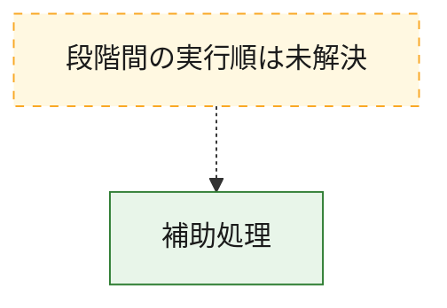
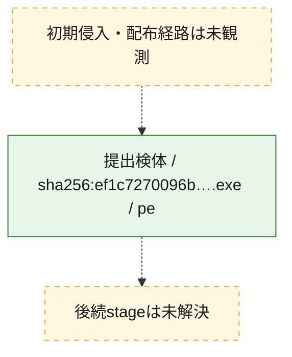
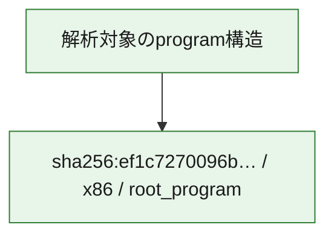

# 全体ロジック：ef1c7270096b4d0dffb394d09416320d12aa24b9d9b70f89998d90e42ac63098

代表関数から主要なmalware処理段階を自動分類できませんでした。

## 読み方

- phaseの掲載順は解析上の整理順です。observed_call_edgesがない段階間の実行順を断定しません。
- 図の実線は静的に観測した関係、点線と黄色のノードは未観測・未解決の関係を示します。
- 図は静的な要約であり、動的実行を再現するものではありません。
- 詳細な関数解説とfingerprintは[STATIC-LOGIC.md](STATIC-LOGIC.md)を参照してください。

## 静的可視化

### 実行フロー

### 感染チェーン

### モジュール関係

## 処理段階

### 1. 補助処理

主要処理を支える一般内部関数またはlibrary処理を確認します。
確度: `confirmed_static_function_evidence`

- `ef1c7270096b4d0dffb394d09416320d12aa24b9d9b70f89998d90e42ac63098:ghidra:140001080` — 検体内部の一般処理を実装する関数です。 状態: `succeeded`、選定理由: `context_representative`, `reviewed_call_centrality:4`
- `ef1c7270096b4d0dffb394d09416320d12aa24b9d9b70f89998d90e42ac63098:ghidra:140001180` — 検体内部の一般処理を実装する関数です。 状態: `succeeded`、選定理由: `context_representative`, `reviewed_call_centrality:2`
- `ef1c7270096b4d0dffb394d09416320d12aa24b9d9b70f89998d90e42ac63098:ghidra:140001300` — 検体内部の一般処理を実装する関数です。 状態: `succeeded`、選定理由: `context_representative`, `reviewed_call_centrality:2`
- `ef1c7270096b4d0dffb394d09416320d12aa24b9d9b70f89998d90e42ac63098:ghidra:140001340` — 検体内部の一般処理を実装する関数です。 状態: `succeeded`、選定理由: `context_representative`, `reviewed_call_centrality:4`
- `ef1c7270096b4d0dffb394d09416320d12aa24b9d9b70f89998d90e42ac63098:ghidra:1400013c0` — 検体内部の一般処理を実装する関数です。 状態: `succeeded`、選定理由: `context_representative`, `reviewed_call_centrality:4`
- `ef1c7270096b4d0dffb394d09416320d12aa24b9d9b70f89998d90e42ac63098:ghidra:140001460` — 検体内部の一般処理を実装する関数です。 状態: `succeeded`、選定理由: `context_representative`, `reviewed_call_centrality:4`
- `ef1c7270096b4d0dffb394d09416320d12aa24b9d9b70f89998d90e42ac63098:ghidra:140001560` — 検体内部の一般処理を実装する関数です。 状態: `succeeded`、選定理由: `context_representative`, `reviewed_call_centrality:7`
- `ef1c7270096b4d0dffb394d09416320d12aa24b9d9b70f89998d90e42ac63098:ghidra:1400019c0` — 検体内部の一般処理を実装する関数です。 状態: `succeeded`、選定理由: `context_representative`, `reviewed_call_centrality:3`
- `ef1c7270096b4d0dffb394d09416320d12aa24b9d9b70f89998d90e42ac63098:ghidra:140001b60` — 検体内部の一般処理を実装する関数です。 状態: `succeeded`、選定理由: `context_representative`, `reviewed_call_centrality:2`
- `ef1c7270096b4d0dffb394d09416320d12aa24b9d9b70f89998d90e42ac63098:ghidra:140001be0` — 検体内部の一般処理を実装する関数です。 状態: `succeeded`、選定理由: `context_representative`, `reviewed_call_centrality:3`
- `ef1c7270096b4d0dffb394d09416320d12aa24b9d9b70f89998d90e42ac63098:ghidra:140001c40` — 検体内部の一般処理を実装する関数です。 状態: `succeeded`、選定理由: `context_representative`, `reviewed_call_centrality:8`
- `ef1c7270096b4d0dffb394d09416320d12aa24b9d9b70f89998d90e42ac63098:ghidra:140002140` — 検体内部の一般処理を実装する関数です。 状態: `succeeded`、選定理由: `context_representative`, `reviewed_call_centrality:11`
- `ef1c7270096b4d0dffb394d09416320d12aa24b9d9b70f89998d90e42ac63098:ghidra:140002cc0` — 検体内部の一般処理を実装する関数です。 状態: `succeeded`、選定理由: `context_representative`, `reviewed_call_centrality:2`
- `ef1c7270096b4d0dffb394d09416320d12aa24b9d9b70f89998d90e42ac63098:ghidra:140002d40` — 検体内部の一般処理を実装する関数です。 状態: `succeeded`、選定理由: `context_representative`, `reviewed_call_centrality:2`
- `ef1c7270096b4d0dffb394d09416320d12aa24b9d9b70f89998d90e42ac63098:ghidra:140003d60` — 検体内部の一般処理を実装する関数です。 状態: `succeeded`、選定理由: `context_representative`, `reviewed_call_centrality:1`
- `ef1c7270096b4d0dffb394d09416320d12aa24b9d9b70f89998d90e42ac63098:ghidra:140003da0` — 検体内部の一般処理を実装する関数です。 状態: `succeeded`、選定理由: `context_representative`, `reviewed_call_centrality:1`
- `ef1c7270096b4d0dffb394d09416320d12aa24b9d9b70f89998d90e42ac63098:ghidra:140003de0` — 検体内部の一般処理を実装する関数です。 状態: `succeeded`、選定理由: `context_representative`, `reviewed_call_centrality:5`
- `ef1c7270096b4d0dffb394d09416320d12aa24b9d9b70f89998d90e42ac63098:ghidra:140003fc0` — 検体内部の一般処理を実装する関数です。 状態: `succeeded`、選定理由: `context_representative`, `reviewed_call_centrality:10`
- `ef1c7270096b4d0dffb394d09416320d12aa24b9d9b70f89998d90e42ac63098:ghidra:140004200` — 検体内部の一般処理を実装する関数です。 状態: `succeeded`、選定理由: `context_representative`, `reviewed_call_centrality:5`
- `ef1c7270096b4d0dffb394d09416320d12aa24b9d9b70f89998d90e42ac63098:ghidra:140004480` — 検体内部の一般処理を実装する関数です。 状態: `succeeded`、選定理由: `context_representative`, `reviewed_call_centrality:4`
- `ef1c7270096b4d0dffb394d09416320d12aa24b9d9b70f89998d90e42ac63098:ghidra:1400045a0` — 検体内部の一般処理を実装する関数です。 状態: `succeeded`、選定理由: `context_representative`, `reviewed_call_centrality:7`
- `ef1c7270096b4d0dffb394d09416320d12aa24b9d9b70f89998d90e42ac63098:ghidra:140004700` — 検体内部の一般処理を実装する関数です。 状態: `succeeded`、選定理由: `context_representative`, `reviewed_call_centrality:9`
- `ef1c7270096b4d0dffb394d09416320d12aa24b9d9b70f89998d90e42ac63098:ghidra:1400049e0` — 検体内部の一般処理を実装する関数です。 状態: `succeeded`、選定理由: `context_representative`, `reviewed_call_centrality:3`
- `ef1c7270096b4d0dffb394d09416320d12aa24b9d9b70f89998d90e42ac63098:ghidra:140004a60` — 検体内部の一般処理を実装する関数です。 状態: `succeeded`、選定理由: `context_representative`, `reviewed_call_centrality:5`
- `ef1c7270096b4d0dffb394d09416320d12aa24b9d9b70f89998d90e42ac63098:ghidra:140004c00` — 検体内部の一般処理を実装する関数です。 状態: `succeeded`、選定理由: `context_representative`, `reviewed_call_centrality:8`
- `ef1c7270096b4d0dffb394d09416320d12aa24b9d9b70f89998d90e42ac63098:ghidra:140004da0` — 検体内部の一般処理を実装する関数です。 状態: `succeeded`、選定理由: `context_representative`, `reviewed_call_centrality:8`
- `ef1c7270096b4d0dffb394d09416320d12aa24b9d9b70f89998d90e42ac63098:ghidra:140004f80` — 検体内部の一般処理を実装する関数です。 状態: `succeeded`、選定理由: `context_representative`, `reviewed_call_centrality:14`
- `ef1c7270096b4d0dffb394d09416320d12aa24b9d9b70f89998d90e42ac63098:ghidra:140005220` — 検体内部の一般処理を実装する関数です。 状態: `succeeded`、選定理由: `context_representative`, `reviewed_call_centrality:3`
- `ef1c7270096b4d0dffb394d09416320d12aa24b9d9b70f89998d90e42ac63098:ghidra:140005420` — 検体内部の一般処理を実装する関数です。 状態: `succeeded`、選定理由: `context_representative`, `reviewed_call_centrality:3`
- `ef1c7270096b4d0dffb394d09416320d12aa24b9d9b70f89998d90e42ac63098:ghidra:140005480` — 検体内部の一般処理を実装する関数です。 状態: `succeeded`、選定理由: `context_representative`, `reviewed_call_centrality:6`
- `ef1c7270096b4d0dffb394d09416320d12aa24b9d9b70f89998d90e42ac63098:ghidra:1400055e0` — 検体内部の一般処理を実装する関数です。 状態: `succeeded`、選定理由: `context_representative`, `reviewed_call_centrality:6`
- `ef1c7270096b4d0dffb394d09416320d12aa24b9d9b70f89998d90e42ac63098:ghidra:140005740` — 検体内部の一般処理を実装する関数です。 状態: `succeeded`、選定理由: `context_representative`, `reviewed_call_centrality:7`

## 観測したcall関係

- `ef1c7270096b4d0dffb394d09416320d12aa24b9d9b70f89998d90e42ac63098:ghidra:140001be0` → `ef1c7270096b4d0dffb394d09416320d12aa24b9d9b70f89998d90e42ac63098:ghidra:140001c40` （`support` → `support`）
- `ef1c7270096b4d0dffb394d09416320d12aa24b9d9b70f89998d90e42ac63098:ghidra:140001be0` → `ef1c7270096b4d0dffb394d09416320d12aa24b9d9b70f89998d90e42ac63098:ghidra:140002140` （`support` → `support`）
- `ef1c7270096b4d0dffb394d09416320d12aa24b9d9b70f89998d90e42ac63098:ghidra:140004480` → `ef1c7270096b4d0dffb394d09416320d12aa24b9d9b70f89998d90e42ac63098:ghidra:1400045a0` （`support` → `support`）
- `ef1c7270096b4d0dffb394d09416320d12aa24b9d9b70f89998d90e42ac63098:ghidra:140004c00` → `ef1c7270096b4d0dffb394d09416320d12aa24b9d9b70f89998d90e42ac63098:ghidra:140004da0` （`support` → `support`）
- `ef1c7270096b4d0dffb394d09416320d12aa24b9d9b70f89998d90e42ac63098:ghidra:140004c00` → `ef1c7270096b4d0dffb394d09416320d12aa24b9d9b70f89998d90e42ac63098:ghidra:140005220` （`support` → `support`）
- `ef1c7270096b4d0dffb394d09416320d12aa24b9d9b70f89998d90e42ac63098:ghidra:140004f80` → `ef1c7270096b4d0dffb394d09416320d12aa24b9d9b70f89998d90e42ac63098:ghidra:140003de0` （`support` → `support`）
- `ef1c7270096b4d0dffb394d09416320d12aa24b9d9b70f89998d90e42ac63098:ghidra:140005220` → `ef1c7270096b4d0dffb394d09416320d12aa24b9d9b70f89998d90e42ac63098:ghidra:140001340` （`support` → `support`）
- `ghidra-function:02c10c3cc7c63e314ae2e812` → `ghidra-external:4ffbc2d828b428174445de70` （`unclassified` → `unclassified`）
- `ghidra-function:02c10c3cc7c63e314ae2e812` → `ghidra-function:6ede22cdcf512c2402f177f4` （`unclassified` → `unclassified`）
- `ghidra-function:02c10c3cc7c63e314ae2e812` → `ghidra-function:bda5b68d5653db73a5831809` （`unclassified` → `unclassified`）
- `ghidra-function:0622d7c1783c241f1706eac5` → `ghidra-external:6dd1e6d09c336a9b340b1ab1` （`unclassified` → `unclassified`）
- `ghidra-function:0622d7c1783c241f1706eac5` → `ghidra-function:4bf0f1ef40fadf00fb16c73c` （`unclassified` → `unclassified`）
- `ghidra-function:081e66d23c5633a88edb3121` → `ghidra-external:51aed094693c4238dc5b3669` （`unclassified` → `unclassified`）
- `ghidra-function:081e66d23c5633a88edb3121` → `ghidra-external:6dd1e6d09c336a9b340b1ab1` （`unclassified` → `unclassified`）
- `ghidra-function:081e66d23c5633a88edb3121` → `ghidra-external:ab970bd8f761a7b88d1c2736` （`unclassified` → `unclassified`）
- `ghidra-function:081e66d23c5633a88edb3121` → `ghidra-external:e3b40205d95af822f3aeb93f` （`unclassified` → `unclassified`）
- `ghidra-function:081e66d23c5633a88edb3121` → `ghidra-external:fd1ec686357169878d134e09` （`unclassified` → `unclassified`）
- `ghidra-function:081e66d23c5633a88edb3121` → `ghidra-external:ffa3c61e39cc279867c2b558` （`unclassified` → `unclassified`）
- `ghidra-function:081e66d23c5633a88edb3121` → `ghidra-function:6fd0b53b43a674b93463b430` （`unclassified` → `unclassified`）
- `ghidra-function:091acb0c638ffd8a7f5d3e81` → `ghidra-external:1c060a4b7d1599124fd610e3` （`unclassified` → `unclassified`）
- `ghidra-function:091acb0c638ffd8a7f5d3e81` → `ghidra-external:6dd1e6d09c336a9b340b1ab1` （`unclassified` → `unclassified`）
- `ghidra-function:091acb0c638ffd8a7f5d3e81` → `ghidra-external:818dcf76800d6e5e2447a3b9` （`unclassified` → `unclassified`）
- `ghidra-function:091acb0c638ffd8a7f5d3e81` → `ghidra-function:6ede22cdcf512c2402f177f4` （`unclassified` → `unclassified`）
- `ghidra-function:091acb0c638ffd8a7f5d3e81` → `ghidra-function:daed035e1c1528601bf09ff9` （`unclassified` → `unclassified`）
- `ghidra-function:09e7f250749c78c45a4b9a59` → `ghidra-external:194c9033fdfbbb88c634d688` （`unclassified` → `unclassified`）
- `ghidra-function:09e7f250749c78c45a4b9a59` → `ghidra-external:1c060a4b7d1599124fd610e3` （`unclassified` → `unclassified`）
- `ghidra-function:09e7f250749c78c45a4b9a59` → `ghidra-external:6dd1e6d09c336a9b340b1ab1` （`unclassified` → `unclassified`）
- `ghidra-function:09e7f250749c78c45a4b9a59` → `ghidra-external:818dcf76800d6e5e2447a3b9` （`unclassified` → `unclassified`）
- `ghidra-function:09e7f250749c78c45a4b9a59` → `ghidra-external:b320d2cbd75999e26c7728a9` （`unclassified` → `unclassified`）
- `ghidra-function:09e7f250749c78c45a4b9a59` → `ghidra-function:0cdb7d88b5f31f4dd77cfd9c` （`unclassified` → `unclassified`）
- `ghidra-function:09e7f250749c78c45a4b9a59` → `ghidra-function:46360e4f348cd89799e0a8c6` （`unclassified` → `unclassified`）
- `ghidra-function:09e7f250749c78c45a4b9a59` → `ghidra-function:5e003bb107575d8307a3afda` （`unclassified` → `unclassified`）
- `ghidra-function:09e7f250749c78c45a4b9a59` → `ghidra-function:6030e0034ec074b384ed0d8e` （`unclassified` → `unclassified`）
- `ghidra-function:09e7f250749c78c45a4b9a59` → `ghidra-function:6ede22cdcf512c2402f177f4` （`unclassified` → `unclassified`）
- `ghidra-function:09e7f250749c78c45a4b9a59` → `ghidra-function:a3f00f9e63bf6e0f489b18a3` （`unclassified` → `unclassified`）
- `ghidra-function:09e7f250749c78c45a4b9a59` → `ghidra-function:a566df1b8596817fa0f97925` （`unclassified` → `unclassified`）
- `ghidra-function:09e7f250749c78c45a4b9a59` → `ghidra-function:daed035e1c1528601bf09ff9` （`unclassified` → `unclassified`）
- `ghidra-function:09e7f250749c78c45a4b9a59` → `ghidra-function:f91b78e01f82421132754207` （`unclassified` → `unclassified`）
- `ghidra-function:0a3b007a7f6fdbf58a1f38fb` → `ghidra-external:47cbb29bded061fd95f57711` （`unclassified` → `unclassified`）
- `ghidra-function:0a3b007a7f6fdbf58a1f38fb` → `ghidra-external:6dd1e6d09c336a9b340b1ab1` （`unclassified` → `unclassified`）
- `ghidra-function:0fc3d757910ddbfe44fce933` → `ghidra-external:2dbbbbf1b02bdada843acee5` （`unclassified` → `unclassified`）
- `ghidra-function:0fc3d757910ddbfe44fce933` → `ghidra-external:51aed094693c4238dc5b3669` （`unclassified` → `unclassified`）
- `ghidra-function:0fc3d757910ddbfe44fce933` → `ghidra-external:6dd1e6d09c336a9b340b1ab1` （`unclassified` → `unclassified`）
- `ghidra-function:0fc3d757910ddbfe44fce933` → `ghidra-external:ab970bd8f761a7b88d1c2736` （`unclassified` → `unclassified`）
- `ghidra-function:0fc3d757910ddbfe44fce933` → `ghidra-external:ffa3c61e39cc279867c2b558` （`unclassified` → `unclassified`）
- `ghidra-function:0fc3d757910ddbfe44fce933` → `ghidra-function:a3f00f9e63bf6e0f489b18a3` （`unclassified` → `unclassified`）
- `ghidra-function:1060e08e43fdfb72b377d085` → `ghidra-external:6dd1e6d09c336a9b340b1ab1` （`unclassified` → `unclassified`）
- `ghidra-function:1060e08e43fdfb72b377d085` → `ghidra-external:b320d2cbd75999e26c7728a9` （`unclassified` → `unclassified`）
- `ghidra-function:1060e08e43fdfb72b377d085` → `ghidra-function:0622d7c1783c241f1706eac5` （`unclassified` → `unclassified`）
- `ghidra-function:1060e08e43fdfb72b377d085` → `ghidra-function:081e66d23c5633a88edb3121` （`unclassified` → `unclassified`）
- `ghidra-function:1060e08e43fdfb72b377d085` → `ghidra-function:16fc262c3a42bab900c1885c` （`unclassified` → `unclassified`）
- `ghidra-function:1060e08e43fdfb72b377d085` → `ghidra-function:6590c63251b5959c92a9fe0d` （`unclassified` → `unclassified`）
- `ghidra-function:1060e08e43fdfb72b377d085` → `ghidra-function:8a2a20f249ac82fbfc5dcf8a` （`unclassified` → `unclassified`）
- `ghidra-function:1060e08e43fdfb72b377d085` → `ghidra-function:a3f00f9e63bf6e0f489b18a3` （`unclassified` → `unclassified`）
- `ghidra-function:14a387974105dd340c220825` → `ghidra-external:6dd1e6d09c336a9b340b1ab1` （`unclassified` → `unclassified`）
- `ghidra-function:14a387974105dd340c220825` → `ghidra-function:8516624e5ad14c111cfa07c2` （`unclassified` → `unclassified`）
- `ghidra-function:14a387974105dd340c220825` → `ghidra-function:c2d6f1f0b329cabd09993a05` （`unclassified` → `unclassified`）
- `ghidra-function:23521fe011c939ed219c0b0e` → `ghidra-external:2dbbbbf1b02bdada843acee5` （`unclassified` → `unclassified`）
- `ghidra-function:23521fe011c939ed219c0b0e` → `ghidra-external:51aed094693c4238dc5b3669` （`unclassified` → `unclassified`）
- `ghidra-function:23521fe011c939ed219c0b0e` → `ghidra-external:6dd1e6d09c336a9b340b1ab1` （`unclassified` → `unclassified`）
- `ghidra-function:23521fe011c939ed219c0b0e` → `ghidra-external:818dcf76800d6e5e2447a3b9` （`unclassified` → `unclassified`）
- `ghidra-function:23521fe011c939ed219c0b0e` → `ghidra-external:ab970bd8f761a7b88d1c2736` （`unclassified` → `unclassified`）
- `ghidra-function:23521fe011c939ed219c0b0e` → `ghidra-external:ffa3c61e39cc279867c2b558` （`unclassified` → `unclassified`）
- `ghidra-function:23521fe011c939ed219c0b0e` → `ghidra-function:a3858c46a142a2b8a034782b` （`unclassified` → `unclassified`）
- `ghidra-function:23521fe011c939ed219c0b0e` → `ghidra-function:a3f00f9e63bf6e0f489b18a3` （`unclassified` → `unclassified`）
- `ghidra-function:23521fe011c939ed219c0b0e` → `ghidra-function:c739219777ffb7d8ccf6d1e2` （`unclassified` → `unclassified`）
- `ghidra-function:25090be6e8ff7372bfab2fcf` → `ghidra-external:47cbb29bded061fd95f57711` （`unclassified` → `unclassified`）
- `ghidra-function:25090be6e8ff7372bfab2fcf` → `ghidra-external:6dd1e6d09c336a9b340b1ab1` （`unclassified` → `unclassified`）
- `ghidra-function:26237b6d8f9d2f50f150f543` → `ghidra-external:6dd1e6d09c336a9b340b1ab1` （`unclassified` → `unclassified`）
- `ghidra-function:26237b6d8f9d2f50f150f543` → `ghidra-external:d2208ab952160aac77f9ab4e` （`unclassified` → `unclassified`）
- `ghidra-function:26237b6d8f9d2f50f150f543` → `ghidra-function:05401c801c074777ad19b165` （`unclassified` → `unclassified`）
- `ghidra-function:26237b6d8f9d2f50f150f543` → `ghidra-function:3293b13a202524bc399a494f` （`unclassified` → `unclassified`）
- `ghidra-function:26237b6d8f9d2f50f150f543` → `ghidra-function:6ede22cdcf512c2402f177f4` （`unclassified` → `unclassified`）
- `ghidra-function:26237b6d8f9d2f50f150f543` → `ghidra-function:8a2a20f249ac82fbfc5dcf8a` （`unclassified` → `unclassified`）
- `ghidra-function:26237b6d8f9d2f50f150f543` → `ghidra-function:daed035e1c1528601bf09ff9` （`unclassified` → `unclassified`）
- `ghidra-function:28da49c4ff7cee18d898ca62` → `ghidra-external:2dbbbbf1b02bdada843acee5` （`unclassified` → `unclassified`）
- `ghidra-function:28da49c4ff7cee18d898ca62` → `ghidra-external:51aed094693c4238dc5b3669` （`unclassified` → `unclassified`）
- `ghidra-function:28da49c4ff7cee18d898ca62` → `ghidra-external:6dd1e6d09c336a9b340b1ab1` （`unclassified` → `unclassified`）
- `ghidra-function:28da49c4ff7cee18d898ca62` → `ghidra-external:ab970bd8f761a7b88d1c2736` （`unclassified` → `unclassified`）
- `ghidra-function:28da49c4ff7cee18d898ca62` → `ghidra-external:ffa3c61e39cc279867c2b558` （`unclassified` → `unclassified`）
- `ghidra-function:28da49c4ff7cee18d898ca62` → `ghidra-function:a3f00f9e63bf6e0f489b18a3` （`unclassified` → `unclassified`）
- `ghidra-function:3d5b16e62c3e6d2691684e22` → `ghidra-external:6dd1e6d09c336a9b340b1ab1` （`unclassified` → `unclassified`）
- `ghidra-function:3d5b16e62c3e6d2691684e22` → `ghidra-function:cef867f38565b935172f9b9f` （`unclassified` → `unclassified`）
- `ghidra-function:3d5b16e62c3e6d2691684e22` → `ghidra-function:f16662ffb6c3f619f36c1102` （`unclassified` → `unclassified`）
- `ghidra-function:4bf0f1ef40fadf00fb16c73c` → `ghidra-external:4ffbc2d828b428174445de70` （`unclassified` → `unclassified`）
- `ghidra-function:4bf0f1ef40fadf00fb16c73c` → `ghidra-external:a5a3f31bfca5bbbbda6d15ab` （`unclassified` → `unclassified`）
- `ghidra-function:4bf0f1ef40fadf00fb16c73c` → `ghidra-function:9cc4a5542a4a7529e0f5e41c` （`unclassified` → `unclassified`）
- `ghidra-function:5e003bb107575d8307a3afda` → `ghidra-external:6dd1e6d09c336a9b340b1ab1` （`unclassified` → `unclassified`）
- `ghidra-function:5e003bb107575d8307a3afda` → `ghidra-external:818dcf76800d6e5e2447a3b9` （`unclassified` → `unclassified`）
- `ghidra-function:5e003bb107575d8307a3afda` → `ghidra-function:a3858c46a142a2b8a034782b` （`unclassified` → `unclassified`）
- `ghidra-function:5e003bb107575d8307a3afda` → `ghidra-function:c739219777ffb7d8ccf6d1e2` （`unclassified` → `unclassified`）
- `ghidra-function:61ad21948ec663677af5a1a3` → `ghidra-external:78c4b3954b13e96fbf32807d` （`unclassified` → `unclassified`）
- `ghidra-function:627d4cff7697fe009a582615` → `ghidra-external:6dd1e6d09c336a9b340b1ab1` （`unclassified` → `unclassified`）
- `ghidra-function:627d4cff7697fe009a582615` → `ghidra-external:b320d2cbd75999e26c7728a9` （`unclassified` → `unclassified`）
- `ghidra-function:627d4cff7697fe009a582615` → `ghidra-function:9cc4a5542a4a7529e0f5e41c` （`unclassified` → `unclassified`）
- `ghidra-function:627d4cff7697fe009a582615` → `ghidra-function:aca350db852500a9ec74fecc` （`unclassified` → `unclassified`）
- `ghidra-function:831bcb8cff284a0a5759aa65` → `ghidra-external:194c9033fdfbbb88c634d688` （`unclassified` → `unclassified`）
- `ghidra-function:831bcb8cff284a0a5759aa65` → `ghidra-external:6dd1e6d09c336a9b340b1ab1` （`unclassified` → `unclassified`）
- `ghidra-function:831bcb8cff284a0a5759aa65` → `ghidra-external:e3a9241563e0238929bdb5fb` （`unclassified` → `unclassified`）
- `ghidra-function:831bcb8cff284a0a5759aa65` → `ghidra-function:8a2a20f249ac82fbfc5dcf8a` （`unclassified` → `unclassified`）
- `ghidra-function:8516624e5ad14c111cfa07c2` → `ghidra-external:1c060a4b7d1599124fd610e3` （`unclassified` → `unclassified`）
- `ghidra-function:8516624e5ad14c111cfa07c2` → `ghidra-external:47cbb29bded061fd95f57711` （`unclassified` → `unclassified`）
- `ghidra-function:8516624e5ad14c111cfa07c2` → `ghidra-external:6dd1e6d09c336a9b340b1ab1` （`unclassified` → `unclassified`）
- `ghidra-function:8516624e5ad14c111cfa07c2` → `ghidra-function:1cf672fdfe4e2a32873b6596` （`unclassified` → `unclassified`）
- `ghidra-function:8516624e5ad14c111cfa07c2` → `ghidra-function:6ede22cdcf512c2402f177f4` （`unclassified` → `unclassified`）
- `ghidra-function:8516624e5ad14c111cfa07c2` → `ghidra-function:b8da002664620ad5f3a1da1e` （`unclassified` → `unclassified`）
- `ghidra-function:8516624e5ad14c111cfa07c2` → `ghidra-function:e360dd5d596e69355c27246f` （`unclassified` → `unclassified`）
- `ghidra-function:8887b01a35b2e7a502e53f78` → `ghidra-external:6dd1e6d09c336a9b340b1ab1` （`unclassified` → `unclassified`）
- `ghidra-function:8887b01a35b2e7a502e53f78` → `ghidra-external:818dcf76800d6e5e2447a3b9` （`unclassified` → `unclassified`）
- `ghidra-function:8887b01a35b2e7a502e53f78` → `ghidra-function:0cdb7d88b5f31f4dd77cfd9c` （`unclassified` → `unclassified`）
- `ghidra-function:8fec4abcc270d1411fe6c02a` → `ghidra-external:4613ffdebfdd71eb74c99093` （`unclassified` → `unclassified`）
- `ghidra-function:8fec4abcc270d1411fe6c02a` → `ghidra-external:6dd1e6d09c336a9b340b1ab1` （`unclassified` → `unclassified`）
- `ghidra-function:91695bbcfe64c7ededf69c30` → `ghidra-external:029405222d1de9c153c5ce65` （`unclassified` → `unclassified`）
- `ghidra-function:91695bbcfe64c7ededf69c30` → `ghidra-external:194c9033fdfbbb88c634d688` （`unclassified` → `unclassified`）
- `ghidra-function:91695bbcfe64c7ededf69c30` → `ghidra-external:6dd1e6d09c336a9b340b1ab1` （`unclassified` → `unclassified`）
- `ghidra-function:91695bbcfe64c7ededf69c30` → `ghidra-external:818dcf76800d6e5e2447a3b9` （`unclassified` → `unclassified`）
- `ghidra-function:91695bbcfe64c7ededf69c30` → `ghidra-external:b320d2cbd75999e26c7728a9` （`unclassified` → `unclassified`）
- `ghidra-function:91695bbcfe64c7ededf69c30` → `ghidra-function:6590c63251b5959c92a9fe0d` （`unclassified` → `unclassified`）
- `ghidra-function:91695bbcfe64c7ededf69c30` → `ghidra-function:6ede22cdcf512c2402f177f4` （`unclassified` → `unclassified`）
- `ghidra-function:91695bbcfe64c7ededf69c30` → `ghidra-function:daed035e1c1528601bf09ff9` （`unclassified` → `unclassified`）
- `ghidra-function:91695bbcfe64c7ededf69c30` → `ghidra-function:f7cc141f2d1ea9b8610b7742` （`unclassified` → `unclassified`）
- `ghidra-function:91695bbcfe64c7ededf69c30` → `ghidra-function:f91b78e01f82421132754207` （`unclassified` → `unclassified`）
- `ghidra-function:a222f4b0215702ddfe9dfad4` → `ghidra-external:92123e1596f8e886140a3974` （`unclassified` → `unclassified`）
- `ghidra-function:ad2061eb9af4ac93409af661` → `ghidra-external:4ffbc2d828b428174445de70` （`unclassified` → `unclassified`）
- `ghidra-function:ad2061eb9af4ac93409af661` → `ghidra-function:6ede22cdcf512c2402f177f4` （`unclassified` → `unclassified`）
- `ghidra-function:c2d6f1f0b329cabd09993a05` → `ghidra-external:0a6bad8720b9afcfec045890` （`unclassified` → `unclassified`）
- `ghidra-function:c2d6f1f0b329cabd09993a05` → `ghidra-external:6dd1e6d09c336a9b340b1ab1` （`unclassified` → `unclassified`）
- `ghidra-function:c2d6f1f0b329cabd09993a05` → `ghidra-external:818dcf76800d6e5e2447a3b9` （`unclassified` → `unclassified`）
- `ghidra-function:c2d6f1f0b329cabd09993a05` → `ghidra-external:8313cd07d963f39be9538941` （`unclassified` → `unclassified`）
- `ghidra-function:c2d6f1f0b329cabd09993a05` → `ghidra-external:8517ec371d3847c1ee4ca903` （`unclassified` → `unclassified`）
- `ghidra-function:c2d6f1f0b329cabd09993a05` → `ghidra-external:a91302afccc960cb580bce57` （`unclassified` → `unclassified`）
- `ghidra-function:c2d6f1f0b329cabd09993a05` → `ghidra-external:d060881622e346260dcedfc2` （`unclassified` → `unclassified`）
- `ghidra-function:c2d6f1f0b329cabd09993a05` → `ghidra-external:e3b40205d95af822f3aeb93f` （`unclassified` → `unclassified`）
- `ghidra-function:c2d6f1f0b329cabd09993a05` → `ghidra-function:ae7f8d00d7d6b0fff95f467e` （`unclassified` → `unclassified`）
- `ghidra-function:c2d6f1f0b329cabd09993a05` → `ghidra-function:f91b78e01f82421132754207` （`unclassified` → `unclassified`）
- `ghidra-function:c3aac556bf62aa66016abc65` → `ghidra-external:47cbb29bded061fd95f57711` （`unclassified` → `unclassified`）
- `ghidra-function:c3aac556bf62aa66016abc65` → `ghidra-external:6dd1e6d09c336a9b340b1ab1` （`unclassified` → `unclassified`）
- `ghidra-function:dcbe201ba05d875460d3b9d8` → `ghidra-external:6dd1e6d09c336a9b340b1ab1` （`unclassified` → `unclassified`）
- `ghidra-function:dcbe201ba05d875460d3b9d8` → `ghidra-external:f190cdd991fe48e0bdd21e5a` （`unclassified` → `unclassified`）
- `ghidra-function:dcbe201ba05d875460d3b9d8` → `ghidra-function:af102e895fe756ce03580095` （`unclassified` → `unclassified`）
- `ghidra-function:dcbe201ba05d875460d3b9d8` → `ghidra-function:daed035e1c1528601bf09ff9` （`unclassified` → `unclassified`）
- `ghidra-function:dcbe201ba05d875460d3b9d8` → `ghidra-function:f7cc141f2d1ea9b8610b7742` （`unclassified` → `unclassified`）
- `ghidra-function:f268d23f05cbaa4acd991ca9` → `ghidra-external:51aed094693c4238dc5b3669` （`unclassified` → `unclassified`）
- `ghidra-function:f268d23f05cbaa4acd991ca9` → `ghidra-external:6dd1e6d09c336a9b340b1ab1` （`unclassified` → `unclassified`）
- `ghidra-function:f268d23f05cbaa4acd991ca9` → `ghidra-external:ab970bd8f761a7b88d1c2736` （`unclassified` → `unclassified`）
- `ghidra-function:f268d23f05cbaa4acd991ca9` → `ghidra-external:b320d2cbd75999e26c7728a9` （`unclassified` → `unclassified`）
- `ghidra-function:f268d23f05cbaa4acd991ca9` → `ghidra-external:fd1ec686357169878d134e09` （`unclassified` → `unclassified`）
- `ghidra-function:f268d23f05cbaa4acd991ca9` → `ghidra-external:ffa3c61e39cc279867c2b558` （`unclassified` → `unclassified`）
- `ghidra-function:f55fc33fd45f4371ade38530` → `ghidra-external:6dd1e6d09c336a9b340b1ab1` （`unclassified` → `unclassified`）
- `ghidra-function:f55fc33fd45f4371ade38530` → `ghidra-external:b320d2cbd75999e26c7728a9` （`unclassified` → `unclassified`）
- `ghidra-function:f55fc33fd45f4371ade38530` → `ghidra-function:9cc4a5542a4a7529e0f5e41c` （`unclassified` → `unclassified`）
- `ghidra-function:f55fc33fd45f4371ade38530` → `ghidra-function:aca350db852500a9ec74fecc` （`unclassified` → `unclassified`）
- `ghidra-function:fc529f7c517a1f8b48a09765` → `ghidra-external:6dd1e6d09c336a9b340b1ab1` （`unclassified` → `unclassified`）
- `ghidra-function:fc529f7c517a1f8b48a09765` → `ghidra-function:a3f00f9e63bf6e0f489b18a3` （`unclassified` → `unclassified`）
- `ghidra-function:fc529f7c517a1f8b48a09765` → `ghidra-function:aa0f0af2209223c4a7bc69f8` （`unclassified` → `unclassified`）
- `ghidra-function:fc529f7c517a1f8b48a09765` → `ghidra-function:f268d23f05cbaa4acd991ca9` （`unclassified` → `unclassified`）
- `ghidra-function:fcf7646fb5928c634f4fb482` → `ghidra-external:2dbbbbf1b02bdada843acee5` （`unclassified` → `unclassified`）
- `ghidra-function:fcf7646fb5928c634f4fb482` → `ghidra-external:51aed094693c4238dc5b3669` （`unclassified` → `unclassified`）
- `ghidra-function:fcf7646fb5928c634f4fb482` → `ghidra-external:6dd1e6d09c336a9b340b1ab1` （`unclassified` → `unclassified`）
- `ghidra-function:fcf7646fb5928c634f4fb482` → `ghidra-external:818dcf76800d6e5e2447a3b9` （`unclassified` → `unclassified`）
- `ghidra-function:fcf7646fb5928c634f4fb482` → `ghidra-external:ab970bd8f761a7b88d1c2736` （`unclassified` → `unclassified`）
- `ghidra-function:fcf7646fb5928c634f4fb482` → `ghidra-external:ffa3c61e39cc279867c2b558` （`unclassified` → `unclassified`）
- `ghidra-function:fcf7646fb5928c634f4fb482` → `ghidra-function:a3f00f9e63bf6e0f489b18a3` （`unclassified` → `unclassified`）

## 解析範囲と制約

- 選定外関数は全体inventoryへ残しますが、関数本体の個別解説対象にはしていません。
- indirect call、難読化、packer、VM、壊れたcontrol flowによりcall関係が欠落する場合があります。
- 文書は静的解析に基づき、検体実行や外部通信による動的確認は行っていません。
