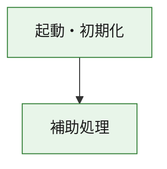
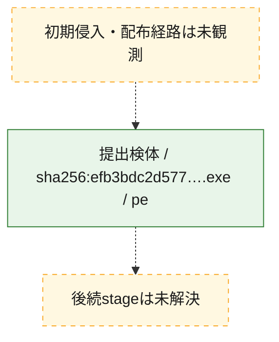
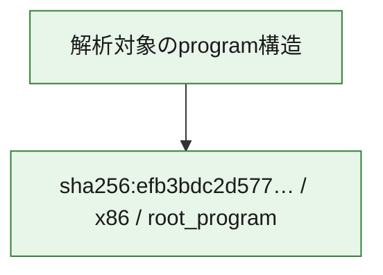

# 全体ロジック：efb3bdc2d57721b0e9f93a2c03fd6c8849ed861e610e39d67dc8884e58958dc8

代表関数の静的証跡から、起動・初期化の処理群を確認しました。

## 読み方

- phaseの掲載順は解析上の整理順です。observed_call_edgesがない段階間の実行順を断定しません。
- 図の実線は静的に観測した関係、点線と黄色のノードは未観測・未解決の関係を示します。
- 図は静的な要約であり、動的実行を再現するものではありません。
- 詳細な関数解説とfingerprintは[STATIC-LOGIC.md](STATIC-LOGIC.md)を参照してください。

## 静的可視化

### 実行フロー

### 感染チェーン

### モジュール関係

## 処理段階

### 1. 起動・初期化

entry pointから初期化と後続処理への移行を確認します。
確度: `confirmed_static_function_evidence`

- `efb3bdc2d57721b0e9f93a2c03fd6c8849ed861e610e39d67dc8884e58958dc8:ghidra:180001010` — 初期化と主要処理への分岐を行う入口関数です。 状態: `succeeded`、選定理由: `entry_point`, `meaningful_symbol_name`, `reviewed_call_centrality:22`, `role:entrypoint`, `small_program_complete_context`

### 2. 補助処理

主要処理を支える一般内部関数またはlibrary処理を確認します。
確度: `confirmed_static_function_evidence`

- `efb3bdc2d57721b0e9f93a2c03fd6c8849ed861e610e39d67dc8884e58958dc8:ghidra:180001240` — 検体内部の一般処理を実装する関数です。 状態: `succeeded`、選定理由: `context_representative`, `reviewed_call_centrality:2`, `small_program_complete_context`
- `efb3bdc2d57721b0e9f93a2c03fd6c8849ed861e610e39d67dc8884e58958dc8:ghidra:180001350` — 検体内部の一般処理を実装する関数です。 状態: `succeeded`、選定理由: `context_representative`, `reviewed_call_centrality:25`, `small_program_complete_context`
- `efb3bdc2d57721b0e9f93a2c03fd6c8849ed861e610e39d67dc8884e58958dc8:ghidra:180003780` — 検体内部の一般処理を実装する関数です。 状態: `succeeded`、選定理由: `context_representative`, `reviewed_call_centrality:2`, `small_program_complete_context`
- `efb3bdc2d57721b0e9f93a2c03fd6c8849ed861e610e39d67dc8884e58958dc8:ghidra:1800038e0` — 検体内部の一般処理を実装する関数です。 状態: `succeeded`、選定理由: `context_representative`, `reviewed_call_centrality:2`, `small_program_complete_context`

## 観測したcall関係

- `efb3bdc2d57721b0e9f93a2c03fd6c8849ed861e610e39d67dc8884e58958dc8:ghidra:180001010` → `efb3bdc2d57721b0e9f93a2c03fd6c8849ed861e610e39d67dc8884e58958dc8:ghidra:180001240` （`startup` → `support`）
- `efb3bdc2d57721b0e9f93a2c03fd6c8849ed861e610e39d67dc8884e58958dc8:ghidra:180001010` → `efb3bdc2d57721b0e9f93a2c03fd6c8849ed861e610e39d67dc8884e58958dc8:ghidra:180001350` （`startup` → `support`）
- `efb3bdc2d57721b0e9f93a2c03fd6c8849ed861e610e39d67dc8884e58958dc8:ghidra:180001350` → `efb3bdc2d57721b0e9f93a2c03fd6c8849ed861e610e39d67dc8884e58958dc8:ghidra:180001240` （`support` → `support`）
- `efb3bdc2d57721b0e9f93a2c03fd6c8849ed861e610e39d67dc8884e58958dc8:ghidra:180001350` → `efb3bdc2d57721b0e9f93a2c03fd6c8849ed861e610e39d67dc8884e58958dc8:ghidra:180003780` （`support` → `support`）
- `efb3bdc2d57721b0e9f93a2c03fd6c8849ed861e610e39d67dc8884e58958dc8:ghidra:180001350` → `efb3bdc2d57721b0e9f93a2c03fd6c8849ed861e610e39d67dc8884e58958dc8:ghidra:1800038e0` （`support` → `support`）
- `efb3bdc2d57721b0e9f93a2c03fd6c8849ed861e610e39d67dc8884e58958dc8:ghidra:180003780` → `efb3bdc2d57721b0e9f93a2c03fd6c8849ed861e610e39d67dc8884e58958dc8:ghidra:1800038e0` （`support` → `support`）
- `ghidra-function:15cf244f2bd0baed31c6dfb4` → `ghidra-function:a1006fa91ae7129677fd87be` （`unclassified` → `unclassified`）
- `ghidra-function:abdd9ce55ac73df6115a7c81` → `ghidra-function:160d73787bd2957c987d7576` （`unclassified` → `unclassified`）
- `ghidra-function:abdd9ce55ac73df6115a7c81` → `ghidra-function:234c2f95532a4da8ad911c36` （`unclassified` → `unclassified`）
- `ghidra-function:abdd9ce55ac73df6115a7c81` → `ghidra-function:4cefd69531ae31a36c14636f` （`unclassified` → `unclassified`）
- `ghidra-function:abdd9ce55ac73df6115a7c81` → `ghidra-function:93b2d7d460c874f4cec7d704` （`unclassified` → `unclassified`）
- `ghidra-function:abdd9ce55ac73df6115a7c81` → `ghidra-function:9cdd8a6026f89c35da5d4375` （`unclassified` → `unclassified`）
- `ghidra-function:abdd9ce55ac73df6115a7c81` → `ghidra-function:aa08247c4941f34e374e086a` （`unclassified` → `unclassified`）
- `ghidra-function:abdd9ce55ac73df6115a7c81` → `ghidra-function:b4edbe8e337f05159777886f` （`unclassified` → `unclassified`）
- `ghidra-function:abdd9ce55ac73df6115a7c81` → `ghidra-function:c865d9bb8bc1ff861ac8a662` （`unclassified` → `unclassified`）
- `ghidra-function:abdd9ce55ac73df6115a7c81` → `ghidra-function:e21cf6466b205c36f1b2ddc9` （`unclassified` → `unclassified`）
- `ghidra-function:abdd9ce55ac73df6115a7c81` → `ghidra-function:ec46cd4ce058510a9703c2c1` （`unclassified` → `unclassified`）
- `ghidra-function:abdd9ce55ac73df6115a7c81` → `ghidra-function:eecea152f135d5a7b88f1b94` （`unclassified` → `unclassified`）
- `ghidra-function:abdd9ce55ac73df6115a7c81` → `ghidra-function:f7ff7e46151b86219cf8db5c` （`unclassified` → `unclassified`）
- `ghidra-function:f7ff7e46151b86219cf8db5c` → `ghidra-external:0c3212046aa2566a69a2c994` （`unclassified` → `unclassified`）
- `ghidra-function:f7ff7e46151b86219cf8db5c` → `ghidra-external:0ca455ccf2d433475c4541fb` （`unclassified` → `unclassified`）
- `ghidra-function:f7ff7e46151b86219cf8db5c` → `ghidra-external:0ff8c018f268da36a4d81b11` （`unclassified` → `unclassified`）
- `ghidra-function:f7ff7e46151b86219cf8db5c` → `ghidra-external:16405a5259c9131a2610eb55` （`unclassified` → `unclassified`）
- `ghidra-function:f7ff7e46151b86219cf8db5c` → `ghidra-external:2da9620493185280e558a88f` （`unclassified` → `unclassified`）
- `ghidra-function:f7ff7e46151b86219cf8db5c` → `ghidra-external:3c2ddf8a5d145e57483cf1f6` （`unclassified` → `unclassified`）
- `ghidra-function:f7ff7e46151b86219cf8db5c` → `ghidra-external:48f053d7b6a346f286dc6f7c` （`unclassified` → `unclassified`）
- `ghidra-function:f7ff7e46151b86219cf8db5c` → `ghidra-external:564a49877956cc08c5de3558` （`unclassified` → `unclassified`）
- `ghidra-function:f7ff7e46151b86219cf8db5c` → `ghidra-external:58c92e6d3816401b3875a36e` （`unclassified` → `unclassified`）
- `ghidra-function:f7ff7e46151b86219cf8db5c` → `ghidra-external:5d56b1778b2e4bb9ff347118` （`unclassified` → `unclassified`）
- `ghidra-function:f7ff7e46151b86219cf8db5c` → `ghidra-external:6a5219852a3558be9d53f179` （`unclassified` → `unclassified`）
- `ghidra-function:f7ff7e46151b86219cf8db5c` → `ghidra-external:6fb7b2beaf75e2658801654b` （`unclassified` → `unclassified`）
- `ghidra-function:f7ff7e46151b86219cf8db5c` → `ghidra-external:721220cf6acbabf05082e68d` （`unclassified` → `unclassified`）
- `ghidra-function:f7ff7e46151b86219cf8db5c` → `ghidra-external:733d74a92bd4fe358a4359f6` （`unclassified` → `unclassified`）
- `ghidra-function:f7ff7e46151b86219cf8db5c` → `ghidra-external:847c4afff539ceb925773854` （`unclassified` → `unclassified`）
- `ghidra-function:f7ff7e46151b86219cf8db5c` → `ghidra-external:87c7a285f0cc63ba5f6d8e76` （`unclassified` → `unclassified`）
- `ghidra-function:f7ff7e46151b86219cf8db5c` → `ghidra-external:9393b474cb557ebecba18f69` （`unclassified` → `unclassified`）
- `ghidra-function:f7ff7e46151b86219cf8db5c` → `ghidra-external:9c808b6c16e6c714b37005f2` （`unclassified` → `unclassified`）
- `ghidra-function:f7ff7e46151b86219cf8db5c` → `ghidra-external:b6fd65785ce861590180983a` （`unclassified` → `unclassified`）
- `ghidra-function:f7ff7e46151b86219cf8db5c` → `ghidra-external:bc0eedd6ea742a82722779d1` （`unclassified` → `unclassified`）
- `ghidra-function:f7ff7e46151b86219cf8db5c` → `ghidra-external:c5cece28fc41d730616b8a99` （`unclassified` → `unclassified`）
- `ghidra-function:f7ff7e46151b86219cf8db5c` → `ghidra-function:15cf244f2bd0baed31c6dfb4` （`unclassified` → `unclassified`）
- `ghidra-function:f7ff7e46151b86219cf8db5c` → `ghidra-function:a1006fa91ae7129677fd87be` （`unclassified` → `unclassified`）
- `ghidra-function:f7ff7e46151b86219cf8db5c` → `ghidra-function:c865d9bb8bc1ff861ac8a662` （`unclassified` → `unclassified`）

## 解析範囲と制約

- 選定外関数は全体inventoryへ残しますが、関数本体の個別解説対象にはしていません。
- indirect call、難読化、packer、VM、壊れたcontrol flowによりcall関係が欠落する場合があります。
- 文書は静的解析に基づき、検体実行や外部通信による動的確認は行っていません。
