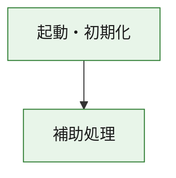
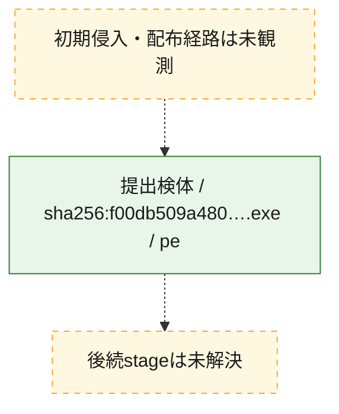
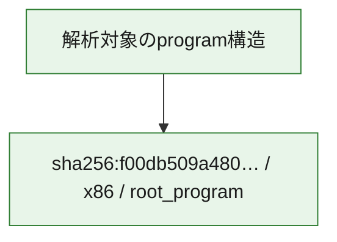

# 全体ロジック：f00db509a480285607ec821febe305c40a46087ba20fe9ee079878fac33de9bb

代表関数の静的証跡から、起動・初期化の処理群を確認しました。

## 読み方

- phaseの掲載順は解析上の整理順です。observed_call_edgesがない段階間の実行順を断定しません。
- 図の実線は静的に観測した関係、点線と黄色のノードは未観測・未解決の関係を示します。
- 図は静的な要約であり、動的実行を再現するものではありません。
- 詳細な関数解説とfingerprintは[STATIC-LOGIC.md](STATIC-LOGIC.md)を参照してください。

## 静的可視化

### 実行フロー

### 感染チェーン

### モジュール関係

## 処理段階

### 1. 起動・初期化

entry pointから初期化と後続処理への移行を確認します。
確度: `confirmed_static_function_evidence`

- `f00db509a480285607ec821febe305c40a46087ba20fe9ee079878fac33de9bb:ghidra:180001010` — 初期化と主要処理への分岐を行う入口関数です。 状態: `succeeded`、選定理由: `entry_point`, `meaningful_symbol_name`, `reviewed_call_centrality:22`, `role:entrypoint`, `small_program_complete_context`

### 2. 補助処理

主要処理を支える一般内部関数またはlibrary処理を確認します。
確度: `confirmed_static_function_evidence`

- `f00db509a480285607ec821febe305c40a46087ba20fe9ee079878fac33de9bb:ghidra:180001240` — 検体内部の一般処理を実装する関数です。 状態: `succeeded`、選定理由: `context_representative`, `reviewed_call_centrality:2`, `small_program_complete_context`
- `f00db509a480285607ec821febe305c40a46087ba20fe9ee079878fac33de9bb:ghidra:180001350` — 検体内部の一般処理を実装する関数です。 状態: `succeeded`、選定理由: `context_representative`, `reviewed_call_centrality:25`, `small_program_complete_context`
- `f00db509a480285607ec821febe305c40a46087ba20fe9ee079878fac33de9bb:ghidra:180003780` — 検体内部の一般処理を実装する関数です。 状態: `succeeded`、選定理由: `context_representative`, `reviewed_call_centrality:2`, `small_program_complete_context`
- `f00db509a480285607ec821febe305c40a46087ba20fe9ee079878fac33de9bb:ghidra:1800038e0` — 検体内部の一般処理を実装する関数です。 状態: `succeeded`、選定理由: `context_representative`, `reviewed_call_centrality:2`, `small_program_complete_context`

## 観測したcall関係

- `f00db509a480285607ec821febe305c40a46087ba20fe9ee079878fac33de9bb:ghidra:180001010` → `f00db509a480285607ec821febe305c40a46087ba20fe9ee079878fac33de9bb:ghidra:180001240` （`startup` → `support`）
- `f00db509a480285607ec821febe305c40a46087ba20fe9ee079878fac33de9bb:ghidra:180001010` → `f00db509a480285607ec821febe305c40a46087ba20fe9ee079878fac33de9bb:ghidra:180001350` （`startup` → `support`）
- `f00db509a480285607ec821febe305c40a46087ba20fe9ee079878fac33de9bb:ghidra:180001350` → `f00db509a480285607ec821febe305c40a46087ba20fe9ee079878fac33de9bb:ghidra:180001240` （`support` → `support`）
- `f00db509a480285607ec821febe305c40a46087ba20fe9ee079878fac33de9bb:ghidra:180001350` → `f00db509a480285607ec821febe305c40a46087ba20fe9ee079878fac33de9bb:ghidra:180003780` （`support` → `support`）
- `f00db509a480285607ec821febe305c40a46087ba20fe9ee079878fac33de9bb:ghidra:180001350` → `f00db509a480285607ec821febe305c40a46087ba20fe9ee079878fac33de9bb:ghidra:1800038e0` （`support` → `support`）
- `f00db509a480285607ec821febe305c40a46087ba20fe9ee079878fac33de9bb:ghidra:180003780` → `f00db509a480285607ec821febe305c40a46087ba20fe9ee079878fac33de9bb:ghidra:1800038e0` （`support` → `support`）
- `ghidra-function:188b7d0a3bca38825f84fa83` → `ghidra-function:193a61be5ba5f48ca329865b` （`unclassified` → `unclassified`）
- `ghidra-function:188b7d0a3bca38825f84fa83` → `ghidra-function:4955fa4916dc63a188f894bb` （`unclassified` → `unclassified`）
- `ghidra-function:188b7d0a3bca38825f84fa83` → `ghidra-function:6ba8604ee1249c272a2de246` （`unclassified` → `unclassified`）
- `ghidra-function:188b7d0a3bca38825f84fa83` → `ghidra-function:78a257f621ccbfef0350d431` （`unclassified` → `unclassified`）
- `ghidra-function:188b7d0a3bca38825f84fa83` → `ghidra-function:80f4071f7dc6f351101ad1d7` （`unclassified` → `unclassified`）
- `ghidra-function:188b7d0a3bca38825f84fa83` → `ghidra-function:824a2d04ef53008cb3b8d470` （`unclassified` → `unclassified`）
- `ghidra-function:188b7d0a3bca38825f84fa83` → `ghidra-function:86aed63cf24268fbed710a3b` （`unclassified` → `unclassified`）
- `ghidra-function:188b7d0a3bca38825f84fa83` → `ghidra-function:a0b9fbb1dd461587936e22ff` （`unclassified` → `unclassified`）
- `ghidra-function:188b7d0a3bca38825f84fa83` → `ghidra-function:a7767aa08bb766fd04f896d7` （`unclassified` → `unclassified`）
- `ghidra-function:188b7d0a3bca38825f84fa83` → `ghidra-function:bb55771edbebdf5709792da0` （`unclassified` → `unclassified`）
- `ghidra-function:188b7d0a3bca38825f84fa83` → `ghidra-function:c991f9e30c1200bc41cdc8e9` （`unclassified` → `unclassified`）
- `ghidra-function:188b7d0a3bca38825f84fa83` → `ghidra-function:f1287e9748f1f56203dd8b4e` （`unclassified` → `unclassified`）
- `ghidra-function:a0b9fbb1dd461587936e22ff` → `ghidra-external:00106ab4d488b9073da0566a` （`unclassified` → `unclassified`）
- `ghidra-function:a0b9fbb1dd461587936e22ff` → `ghidra-external:08ba9e4e986196819aa82cb9` （`unclassified` → `unclassified`）
- `ghidra-function:a0b9fbb1dd461587936e22ff` → `ghidra-external:0f13fdde83d887bd1310c870` （`unclassified` → `unclassified`）
- `ghidra-function:a0b9fbb1dd461587936e22ff` → `ghidra-external:149a2aaf4b7ac905fa06d619` （`unclassified` → `unclassified`）
- `ghidra-function:a0b9fbb1dd461587936e22ff` → `ghidra-external:2d7fab6da1cddaa2856904b4` （`unclassified` → `unclassified`）
- `ghidra-function:a0b9fbb1dd461587936e22ff` → `ghidra-external:445f30272c1ee08d5f518a8e` （`unclassified` → `unclassified`）
- `ghidra-function:a0b9fbb1dd461587936e22ff` → `ghidra-external:4bb5e2dfc464098c91b6d0ca` （`unclassified` → `unclassified`）
- `ghidra-function:a0b9fbb1dd461587936e22ff` → `ghidra-external:5d9fe568f2e2dbba9f42451d` （`unclassified` → `unclassified`）
- `ghidra-function:a0b9fbb1dd461587936e22ff` → `ghidra-external:65bad2ae97b79c89cbf4c667` （`unclassified` → `unclassified`）
- `ghidra-function:a0b9fbb1dd461587936e22ff` → `ghidra-external:6edd88a7f40d3da1228e868d` （`unclassified` → `unclassified`）
- `ghidra-function:a0b9fbb1dd461587936e22ff` → `ghidra-external:7cd19265a4e40ee94b58c8f6` （`unclassified` → `unclassified`）
- `ghidra-function:a0b9fbb1dd461587936e22ff` → `ghidra-external:9b48e7ae5ff6eddc6c849ead` （`unclassified` → `unclassified`）
- `ghidra-function:a0b9fbb1dd461587936e22ff` → `ghidra-external:9b708ad51a41ff495969a6e9` （`unclassified` → `unclassified`）
- `ghidra-function:a0b9fbb1dd461587936e22ff` → `ghidra-external:9fa078612ce2e5b2bee05d4f` （`unclassified` → `unclassified`）
- `ghidra-function:a0b9fbb1dd461587936e22ff` → `ghidra-external:b6a6814057c99c51c8447f2e` （`unclassified` → `unclassified`）
- `ghidra-function:a0b9fbb1dd461587936e22ff` → `ghidra-external:b84c07eb85c6f156cf997669` （`unclassified` → `unclassified`）
- `ghidra-function:a0b9fbb1dd461587936e22ff` → `ghidra-external:b8d0eec44a78c4f30c6b59f8` （`unclassified` → `unclassified`）
- `ghidra-function:a0b9fbb1dd461587936e22ff` → `ghidra-external:c8de2b2e424678a5c2461a79` （`unclassified` → `unclassified`）
- `ghidra-function:a0b9fbb1dd461587936e22ff` → `ghidra-external:e11171e114e86180baeb51f6` （`unclassified` → `unclassified`）
- `ghidra-function:a0b9fbb1dd461587936e22ff` → `ghidra-external:e24cf7c111709c2fa1fa2373` （`unclassified` → `unclassified`）
- `ghidra-function:a0b9fbb1dd461587936e22ff` → `ghidra-external:f5799d847c03fb289c541099` （`unclassified` → `unclassified`）
- `ghidra-function:a0b9fbb1dd461587936e22ff` → `ghidra-function:2330efbb3445bb47367f062b` （`unclassified` → `unclassified`）
- `ghidra-function:a0b9fbb1dd461587936e22ff` → `ghidra-function:824a2d04ef53008cb3b8d470` （`unclassified` → `unclassified`）
- `ghidra-function:a0b9fbb1dd461587936e22ff` → `ghidra-function:c9f432bfc1db9536850fefbe` （`unclassified` → `unclassified`）
- `ghidra-function:c9f432bfc1db9536850fefbe` → `ghidra-function:2330efbb3445bb47367f062b` （`unclassified` → `unclassified`）

## 解析範囲と制約

- 選定外関数は全体inventoryへ残しますが、関数本体の個別解説対象にはしていません。
- indirect call、難読化、packer、VM、壊れたcontrol flowによりcall関係が欠落する場合があります。
- 文書は静的解析に基づき、検体実行や外部通信による動的確認は行っていません。
