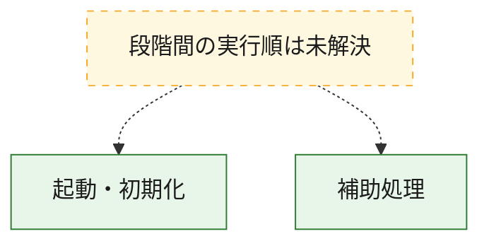
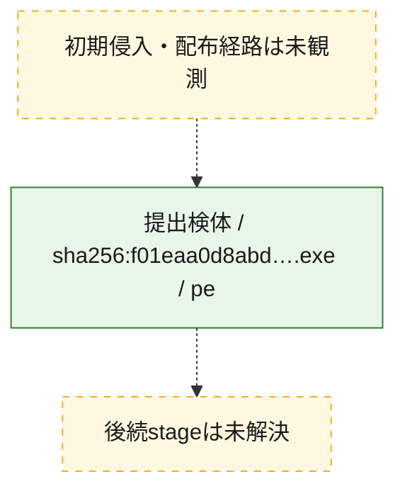
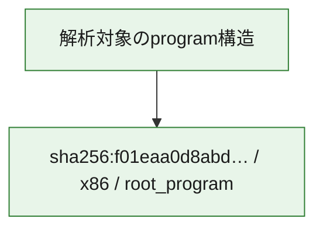

# 全体ロジック：f01eaa0d8abd8932d6ffbaf997c9db7dda27dbdc51bb8868f354527cb2bec978

代表関数の静的証跡から、起動・初期化の処理群を確認しました。

## 読み方

- phaseの掲載順は解析上の整理順です。observed_call_edgesがない段階間の実行順を断定しません。
- 図の実線は静的に観測した関係、点線と黄色のノードは未観測・未解決の関係を示します。
- 図は静的な要約であり、動的実行を再現するものではありません。
- 詳細な関数解説とfingerprintは[STATIC-LOGIC.md](STATIC-LOGIC.md)を参照してください。

## 静的可視化

### 実行フロー

### 感染チェーン

### モジュール関係

## 処理段階

### 1. 起動・初期化

entry pointから初期化と後続処理への移行を確認します。
確度: `confirmed_static_function_evidence`

- `f01eaa0d8abd8932d6ffbaf997c9db7dda27dbdc51bb8868f354527cb2bec978:ghidra:1402482d0` — 初期化と主要処理への分岐を行う入口関数です。 状態: `succeeded`、選定理由: `entry_point`, `meaningful_symbol_name`, `reviewed_call_centrality:22`, `role:entrypoint`

### 2. 補助処理

主要処理を支える一般内部関数またはlibrary処理を確認します。
確度: `confirmed_static_function_evidence`

- `f01eaa0d8abd8932d6ffbaf997c9db7dda27dbdc51bb8868f354527cb2bec978:ghidra:140001000` — 検体内部の一般処理を実装する関数です。 状態: `succeeded`、選定理由: `context_representative`, `reviewed_call_centrality:3`
- `f01eaa0d8abd8932d6ffbaf997c9db7dda27dbdc51bb8868f354527cb2bec978:ghidra:140001030` — 検体内部の一般処理を実装する関数です。 状態: `succeeded`、選定理由: `context_representative`, `reviewed_call_centrality:3`
- `f01eaa0d8abd8932d6ffbaf997c9db7dda27dbdc51bb8868f354527cb2bec978:ghidra:140001060` — 検体内部の一般処理を実装する関数です。 状態: `succeeded`、選定理由: `context_representative`, `reviewed_call_centrality:2`
- `f01eaa0d8abd8932d6ffbaf997c9db7dda27dbdc51bb8868f354527cb2bec978:ghidra:140001090` — 検体内部の一般処理を実装する関数です。 状態: `succeeded`、選定理由: `context_representative`, `reviewed_call_centrality:3`
- `f01eaa0d8abd8932d6ffbaf997c9db7dda27dbdc51bb8868f354527cb2bec978:ghidra:1400011f0` — 検体内部の一般処理を実装する関数です。 状態: `succeeded`、選定理由: `context_representative`, `reviewed_call_centrality:2`
- `f01eaa0d8abd8932d6ffbaf997c9db7dda27dbdc51bb8868f354527cb2bec978:ghidra:140001220` — 検体内部の一般処理を実装する関数です。 状態: `succeeded`、選定理由: `context_representative`, `reviewed_call_centrality:3`
- `f01eaa0d8abd8932d6ffbaf997c9db7dda27dbdc51bb8868f354527cb2bec978:ghidra:1400012d0` — 検体内部の一般処理を実装する関数です。 状態: `succeeded`、選定理由: `context_representative`, `reviewed_call_centrality:4`
- `f01eaa0d8abd8932d6ffbaf997c9db7dda27dbdc51bb8868f354527cb2bec978:ghidra:1400013b0` — 検体内部の一般処理を実装する関数です。 状態: `succeeded`、選定理由: `context_representative`, `reviewed_call_centrality:2`
- `f01eaa0d8abd8932d6ffbaf997c9db7dda27dbdc51bb8868f354527cb2bec978:ghidra:1400013e0` — 検体内部の一般処理を実装する関数です。 状態: `succeeded`、選定理由: `context_representative`, `reviewed_call_centrality:2`
- `f01eaa0d8abd8932d6ffbaf997c9db7dda27dbdc51bb8868f354527cb2bec978:ghidra:140001410` — 検体内部の一般処理を実装する関数です。 状態: `succeeded`、選定理由: `context_representative`, `reviewed_call_centrality:2`
- `f01eaa0d8abd8932d6ffbaf997c9db7dda27dbdc51bb8868f354527cb2bec978:ghidra:140001440` — 検体内部の一般処理を実装する関数です。 状態: `succeeded`、選定理由: `context_representative`, `reviewed_call_centrality:2`
- `f01eaa0d8abd8932d6ffbaf997c9db7dda27dbdc51bb8868f354527cb2bec978:ghidra:140001470` — 検体内部の一般処理を実装する関数です。 状態: `succeeded`、選定理由: `context_representative`, `reviewed_call_centrality:3`
- `f01eaa0d8abd8932d6ffbaf997c9db7dda27dbdc51bb8868f354527cb2bec978:ghidra:1400014b0` — 検体内部の一般処理を実装する関数です。 状態: `succeeded`、選定理由: `context_representative`, `reviewed_call_centrality:3`
- `f01eaa0d8abd8932d6ffbaf997c9db7dda27dbdc51bb8868f354527cb2bec978:ghidra:1400014f0` — 検体内部の一般処理を実装する関数です。 状態: `succeeded`、選定理由: `context_representative`, `reviewed_call_centrality:2`
- `f01eaa0d8abd8932d6ffbaf997c9db7dda27dbdc51bb8868f354527cb2bec978:ghidra:140001520` — 検体内部の一般処理を実装する関数です。 状態: `succeeded`、選定理由: `context_representative`, `reviewed_call_centrality:2`
- `f01eaa0d8abd8932d6ffbaf997c9db7dda27dbdc51bb8868f354527cb2bec978:ghidra:140001550` — 検体内部の一般処理を実装する関数です。 状態: `succeeded`、選定理由: `context_representative`, `reviewed_call_centrality:2`
- `f01eaa0d8abd8932d6ffbaf997c9db7dda27dbdc51bb8868f354527cb2bec978:ghidra:140001580` — 検体内部の一般処理を実装する関数です。 状態: `succeeded`、選定理由: `context_representative`, `reviewed_call_centrality:2`
- `f01eaa0d8abd8932d6ffbaf997c9db7dda27dbdc51bb8868f354527cb2bec978:ghidra:1400015b0` — 検体内部の一般処理を実装する関数です。 状態: `succeeded`、選定理由: `context_representative`, `reviewed_call_centrality:2`
- `f01eaa0d8abd8932d6ffbaf997c9db7dda27dbdc51bb8868f354527cb2bec978:ghidra:140001600` — 検体内部の一般処理を実装する関数です。 状態: `succeeded`、選定理由: `context_representative`, `reviewed_call_centrality:5`
- `f01eaa0d8abd8932d6ffbaf997c9db7dda27dbdc51bb8868f354527cb2bec978:ghidra:140001670` — 検体内部の一般処理を実装する関数です。 状態: `succeeded`、選定理由: `context_representative`, `reviewed_call_centrality:3`
- `f01eaa0d8abd8932d6ffbaf997c9db7dda27dbdc51bb8868f354527cb2bec978:ghidra:1400016b0` — 検体内部の一般処理を実装する関数です。 状態: `succeeded`、選定理由: `context_representative`, `reviewed_call_centrality:6`
- `f01eaa0d8abd8932d6ffbaf997c9db7dda27dbdc51bb8868f354527cb2bec978:ghidra:1400018c0` — 検体内部の一般処理を実装する関数です。 状態: `succeeded`、選定理由: `context_representative`, `reviewed_call_centrality:3`
- `f01eaa0d8abd8932d6ffbaf997c9db7dda27dbdc51bb8868f354527cb2bec978:ghidra:1400018f0` — 検体内部の一般処理を実装する関数です。 状態: `succeeded`、選定理由: `context_representative`, `reviewed_call_centrality:3`
- `f01eaa0d8abd8932d6ffbaf997c9db7dda27dbdc51bb8868f354527cb2bec978:ghidra:140001910` — 検体内部の一般処理を実装する関数です。 状態: `succeeded`、選定理由: `context_representative`, `reviewed_call_centrality:1`
- `f01eaa0d8abd8932d6ffbaf997c9db7dda27dbdc51bb8868f354527cb2bec978:ghidra:140001a10` — 検体内部の一般処理を実装する関数です。 状態: `succeeded`、選定理由: `context_representative`, `reviewed_call_centrality:1`
- `f01eaa0d8abd8932d6ffbaf997c9db7dda27dbdc51bb8868f354527cb2bec978:ghidra:140001a80` — 検体内部の一般処理を実装する関数です。 状態: `succeeded`、選定理由: `context_representative`, `reviewed_call_centrality:1`
- `f01eaa0d8abd8932d6ffbaf997c9db7dda27dbdc51bb8868f354527cb2bec978:ghidra:140001ae0` — 検体内部の一般処理を実装する関数です。 状態: `succeeded`、選定理由: `context_representative`, `reviewed_call_centrality:1`
- `f01eaa0d8abd8932d6ffbaf997c9db7dda27dbdc51bb8868f354527cb2bec978:ghidra:140001b30` — 検体内部の一般処理を実装する関数です。 状態: `succeeded`、選定理由: `context_representative`, `reviewed_call_centrality:1`
- `f01eaa0d8abd8932d6ffbaf997c9db7dda27dbdc51bb8868f354527cb2bec978:ghidra:140001c30` — 検体内部の一般処理を実装する関数です。 状態: `succeeded`、選定理由: `context_representative`, `reviewed_call_centrality:1`
- `f01eaa0d8abd8932d6ffbaf997c9db7dda27dbdc51bb8868f354527cb2bec978:ghidra:140001ca0` — 検体内部の一般処理を実装する関数です。 状態: `succeeded`、選定理由: `context_representative`, `reviewed_call_centrality:1`
- `f01eaa0d8abd8932d6ffbaf997c9db7dda27dbdc51bb8868f354527cb2bec978:ghidra:140001d00` — 検体内部の一般処理を実装する関数です。 状態: `succeeded`、選定理由: `context_representative`, `reviewed_call_centrality:1`

## 観測したcall関係

- `ghidra-function:069697ea8bcb32a86a45b006` → `ghidra-external:09309a38b02f39363857639c` （`unclassified` → `unclassified`）
- `ghidra-function:069697ea8bcb32a86a45b006` → `ghidra-function:ddf49c26039bd729b6b2bef9` （`unclassified` → `unclassified`）
- `ghidra-function:0c07101da4eee06090a3d413` → `ghidra-external:09309a38b02f39363857639c` （`unclassified` → `unclassified`）
- `ghidra-function:0c07101da4eee06090a3d413` → `ghidra-function:ddf49c26039bd729b6b2bef9` （`unclassified` → `unclassified`）
- `ghidra-function:1341b7639bd80940e93d2174` → `ghidra-external:d7d8e5590d4042e11bc2ad54` （`unclassified` → `unclassified`）
- `ghidra-function:1341b7639bd80940e93d2174` → `ghidra-function:a9b8c9522372df7e5344dc10` （`unclassified` → `unclassified`）
- `ghidra-function:1341b7639bd80940e93d2174` → `ghidra-function:b75f62b2fe6b2c92944642c6` （`unclassified` → `unclassified`）
- `ghidra-function:1e966166abd3f52a406e9ace` → `ghidra-external:d7d8e5590d4042e11bc2ad54` （`unclassified` → `unclassified`）
- `ghidra-function:1e966166abd3f52a406e9ace` → `ghidra-function:b75f62b2fe6b2c92944642c6` （`unclassified` → `unclassified`）
- `ghidra-function:1e966166abd3f52a406e9ace` → `ghidra-function:b95d10a3f2b9f4eead14b24c` （`unclassified` → `unclassified`）
- `ghidra-function:24e3cc900449cb773a10d649` → `ghidra-external:d7d8e5590d4042e11bc2ad54` （`unclassified` → `unclassified`）
- `ghidra-function:24e3cc900449cb773a10d649` → `ghidra-function:b75f62b2fe6b2c92944642c6` （`unclassified` → `unclassified`）
- `ghidra-function:24e3cc900449cb773a10d649` → `ghidra-function:d67ddbbba67b0d3162291350` （`unclassified` → `unclassified`）
- `ghidra-function:2692f656519623f2c0fdebc5` → `ghidra-external:09309a38b02f39363857639c` （`unclassified` → `unclassified`）
- `ghidra-function:2692f656519623f2c0fdebc5` → `ghidra-function:ddf49c26039bd729b6b2bef9` （`unclassified` → `unclassified`）
- `ghidra-function:37d19a16ec67156ff8fcbd5c` → `ghidra-external:d7d8e5590d4042e11bc2ad54` （`unclassified` → `unclassified`）
- `ghidra-function:37d19a16ec67156ff8fcbd5c` → `ghidra-function:b75f62b2fe6b2c92944642c6` （`unclassified` → `unclassified`）
- `ghidra-function:37d19a16ec67156ff8fcbd5c` → `ghidra-function:c6301c137a63fc0d78cbfe24` （`unclassified` → `unclassified`）
- `ghidra-function:40b655e1d26f38bc50a2603a` → `ghidra-function:1c70a9250475412796bfc96b` （`unclassified` → `unclassified`）
- `ghidra-function:547cbff422469fd52d9aca76` → `ghidra-function:1c70a9250475412796bfc96b` （`unclassified` → `unclassified`）
- `ghidra-function:5ca971e0850e31ab3fe64a7a` → `ghidra-external:09309a38b02f39363857639c` （`unclassified` → `unclassified`）
- `ghidra-function:5ca971e0850e31ab3fe64a7a` → `ghidra-function:ddf49c26039bd729b6b2bef9` （`unclassified` → `unclassified`）
- `ghidra-function:634ba04cb743b017fbb22766` → `ghidra-function:1c70a9250475412796bfc96b` （`unclassified` → `unclassified`）
- `ghidra-function:6e292786ec316cf0f27ed6e1` → `ghidra-external:09309a38b02f39363857639c` （`unclassified` → `unclassified`）
- `ghidra-function:6e292786ec316cf0f27ed6e1` → `ghidra-function:ddf49c26039bd729b6b2bef9` （`unclassified` → `unclassified`）
- `ghidra-function:75da455e8b328f70487c42b5` → `ghidra-external:10919a7ebe0f575ae47e9fbe` （`unclassified` → `unclassified`）
- `ghidra-function:75da455e8b328f70487c42b5` → `ghidra-function:b95d10a3f2b9f4eead14b24c` （`unclassified` → `unclassified`）
- `ghidra-function:75da455e8b328f70487c42b5` → `ghidra-function:ddf49c26039bd729b6b2bef9` （`unclassified` → `unclassified`）
- `ghidra-function:75da455e8b328f70487c42b5` → `ghidra-function:ec73a54109617d83ada9bcbd` （`unclassified` → `unclassified`）
- `ghidra-function:7701a5caf82530fd9afe1cfa` → `ghidra-external:d7d8e5590d4042e11bc2ad54` （`unclassified` → `unclassified`）
- `ghidra-function:7701a5caf82530fd9afe1cfa` → `ghidra-function:b75f62b2fe6b2c92944642c6` （`unclassified` → `unclassified`）
- `ghidra-function:7701a5caf82530fd9afe1cfa` → `ghidra-function:eb0d55710640849d94de7a3b` （`unclassified` → `unclassified`）
- `ghidra-function:78038c94f08418f8b3b10776` → `ghidra-external:d7d8e5590d4042e11bc2ad54` （`unclassified` → `unclassified`）
- `ghidra-function:78038c94f08418f8b3b10776` → `ghidra-function:953659aa6587612f7cf9063f` （`unclassified` → `unclassified`）
- `ghidra-function:78038c94f08418f8b3b10776` → `ghidra-function:b75f62b2fe6b2c92944642c6` （`unclassified` → `unclassified`）
- `ghidra-function:7b3a5c3c14fed6404046408f` → `ghidra-function:1c70a9250475412796bfc96b` （`unclassified` → `unclassified`）
- `ghidra-function:879dece90e1eed738281a704` → `ghidra-external:d7d8e5590d4042e11bc2ad54` （`unclassified` → `unclassified`）
- `ghidra-function:879dece90e1eed738281a704` → `ghidra-function:b75f62b2fe6b2c92944642c6` （`unclassified` → `unclassified`）
- `ghidra-function:879dece90e1eed738281a704` → `ghidra-function:eb0d55710640849d94de7a3b` （`unclassified` → `unclassified`）
- `ghidra-function:9c99a2f49b01fdac30fa0f41` → `ghidra-function:1c70a9250475412796bfc96b` （`unclassified` → `unclassified`）
- `ghidra-function:9ead8f9e62feaad97f078519` → `ghidra-external:09309a38b02f39363857639c` （`unclassified` → `unclassified`）
- `ghidra-function:9ead8f9e62feaad97f078519` → `ghidra-function:ddf49c26039bd729b6b2bef9` （`unclassified` → `unclassified`）
- `ghidra-function:a5524f0813c6a96d643f393e` → `ghidra-external:09309a38b02f39363857639c` （`unclassified` → `unclassified`）
- `ghidra-function:a5524f0813c6a96d643f393e` → `ghidra-function:ddf49c26039bd729b6b2bef9` （`unclassified` → `unclassified`）
- `ghidra-function:a5f67f3667b3d5905eefd3fa` → `ghidra-external:09309a38b02f39363857639c` （`unclassified` → `unclassified`）
- `ghidra-function:a5f67f3667b3d5905eefd3fa` → `ghidra-function:ddf49c26039bd729b6b2bef9` （`unclassified` → `unclassified`）
- `ghidra-function:aa69ac366dfc6fbf1838ad79` → `ghidra-external:00d581a762c08e62cc148677` （`unclassified` → `unclassified`）
- `ghidra-function:aa69ac366dfc6fbf1838ad79` → `ghidra-external:19b1a087bf16c07808b406e5` （`unclassified` → `unclassified`）
- `ghidra-function:aa69ac366dfc6fbf1838ad79` → `ghidra-external:1fa17db6554daeaa05370c3e` （`unclassified` → `unclassified`）
- `ghidra-function:aa69ac366dfc6fbf1838ad79` → `ghidra-external:35d40be62e07dd5a7de11c72` （`unclassified` → `unclassified`）
- `ghidra-function:aa69ac366dfc6fbf1838ad79` → `ghidra-external:36711e2e20a57d2250670e92` （`unclassified` → `unclassified`）
- `ghidra-function:aa69ac366dfc6fbf1838ad79` → `ghidra-external:4f6f65454af593c4d1487bd3` （`unclassified` → `unclassified`）
- `ghidra-function:aa69ac366dfc6fbf1838ad79` → `ghidra-external:5b1fbdb19a883d237e41e737` （`unclassified` → `unclassified`）
- `ghidra-function:aa69ac366dfc6fbf1838ad79` → `ghidra-external:8093157842a87f28e4bb5c9c` （`unclassified` → `unclassified`）
- `ghidra-function:aa69ac366dfc6fbf1838ad79` → `ghidra-external:f4fdcd94c8620dcb3475b699` （`unclassified` → `unclassified`）
- `ghidra-function:aa69ac366dfc6fbf1838ad79` → `ghidra-function:0282e6437f391cca25b1cfa9` （`unclassified` → `unclassified`）
- `ghidra-function:aa69ac366dfc6fbf1838ad79` → `ghidra-function:0cb1a9acff55523e7e726c0c` （`unclassified` → `unclassified`）
- `ghidra-function:aa69ac366dfc6fbf1838ad79` → `ghidra-function:0ec7a56b452c2cd01f3dd792` （`unclassified` → `unclassified`）
- `ghidra-function:aa69ac366dfc6fbf1838ad79` → `ghidra-function:2d7d0c9e53c217f6cadddd4e` （`unclassified` → `unclassified`）
- `ghidra-function:aa69ac366dfc6fbf1838ad79` → `ghidra-function:48b19947b9339b4d6b9fe5ca` （`unclassified` → `unclassified`）
- `ghidra-function:aa69ac366dfc6fbf1838ad79` → `ghidra-function:7b345634167f7a50f6f97a4b` （`unclassified` → `unclassified`）
- `ghidra-function:aa69ac366dfc6fbf1838ad79` → `ghidra-function:854a12770e53077bffd4e212` （`unclassified` → `unclassified`）
- `ghidra-function:aa69ac366dfc6fbf1838ad79` → `ghidra-function:892b6b5627ca9af2e1615293` （`unclassified` → `unclassified`）
- `ghidra-function:aa69ac366dfc6fbf1838ad79` → `ghidra-function:9c778545b30e069749a0452e` （`unclassified` → `unclassified`）
- `ghidra-function:aa69ac366dfc6fbf1838ad79` → `ghidra-function:abdb5b00ecfc5bee7f2a035b` （`unclassified` → `unclassified`）
- `ghidra-function:aa69ac366dfc6fbf1838ad79` → `ghidra-function:c5003ac7e6dde48a92413cd7` （`unclassified` → `unclassified`）
- `ghidra-function:aa69ac366dfc6fbf1838ad79` → `ghidra-function:d418bf992a2de384b2b0d4cb` （`unclassified` → `unclassified`）
- `ghidra-function:aa69ac366dfc6fbf1838ad79` → `ghidra-function:e3863d718ac5e1fca24bc47a` （`unclassified` → `unclassified`）
- `ghidra-function:ad47ff7c4ea18713021aa77f` → `ghidra-function:1c70a9250475412796bfc96b` （`unclassified` → `unclassified`）
- `ghidra-function:b851548b34eae97bdef7c808` → `ghidra-function:1c70a9250475412796bfc96b` （`unclassified` → `unclassified`）
- `ghidra-function:bc7f12bf979d7176fb2d18cc` → `ghidra-external:3c02ef7e15fa90f885168a7a` （`unclassified` → `unclassified`）
- `ghidra-function:bc7f12bf979d7176fb2d18cc` → `ghidra-external:cea27d4b1aab657be493eca0` （`unclassified` → `unclassified`）
- `ghidra-function:bc7f12bf979d7176fb2d18cc` → `ghidra-external:d24807e119f8f8727736adf5` （`unclassified` → `unclassified`）
- `ghidra-function:bc7f12bf979d7176fb2d18cc` → `ghidra-external:d7d8e5590d4042e11bc2ad54` （`unclassified` → `unclassified`）
- `ghidra-function:bc7f12bf979d7176fb2d18cc` → `ghidra-function:b75f62b2fe6b2c92944642c6` （`unclassified` → `unclassified`）
- `ghidra-function:c7aec1a0921f0329d11be930` → `ghidra-external:d7d8e5590d4042e11bc2ad54` （`unclassified` → `unclassified`）
- `ghidra-function:c7aec1a0921f0329d11be930` → `ghidra-function:b75f62b2fe6b2c92944642c6` （`unclassified` → `unclassified`）
- `ghidra-function:c7aec1a0921f0329d11be930` → `ghidra-function:b95d10a3f2b9f4eead14b24c` （`unclassified` → `unclassified`）
- `ghidra-function:c7debfe58f5704344c5b488d` → `ghidra-function:b95d10a3f2b9f4eead14b24c` （`unclassified` → `unclassified`）
- `ghidra-function:c7debfe58f5704344c5b488d` → `ghidra-function:ddf49c26039bd729b6b2bef9` （`unclassified` → `unclassified`）
- `ghidra-function:c7debfe58f5704344c5b488d` → `ghidra-function:ec73a54109617d83ada9bcbd` （`unclassified` → `unclassified`）
- `ghidra-function:cdc1168d3eb46a2605abe468` → `ghidra-function:1c70a9250475412796bfc96b` （`unclassified` → `unclassified`）
- `ghidra-function:d0005223fbddedbbba669aee` → `ghidra-external:09309a38b02f39363857639c` （`unclassified` → `unclassified`）
- `ghidra-function:d0005223fbddedbbba669aee` → `ghidra-function:ddf49c26039bd729b6b2bef9` （`unclassified` → `unclassified`）
- `ghidra-function:d0d3d685a1e4a2b46a60d83f` → `ghidra-external:09309a38b02f39363857639c` （`unclassified` → `unclassified`）
- `ghidra-function:d0d3d685a1e4a2b46a60d83f` → `ghidra-function:ddf49c26039bd729b6b2bef9` （`unclassified` → `unclassified`）
- `ghidra-function:f0a1a69c71822c83ec906bc6` → `ghidra-external:309f66706566f327d7418ad3` （`unclassified` → `unclassified`）
- `ghidra-function:f0a1a69c71822c83ec906bc6` → `ghidra-external:d7d8e5590d4042e11bc2ad54` （`unclassified` → `unclassified`）
- `ghidra-function:f0a1a69c71822c83ec906bc6` → `ghidra-function:19212dc8369133cb893ec8be` （`unclassified` → `unclassified`）
- `ghidra-function:f0a1a69c71822c83ec906bc6` → `ghidra-function:627b773c48aafee74c9d32d0` （`unclassified` → `unclassified`）
- `ghidra-function:f0a1a69c71822c83ec906bc6` → `ghidra-function:b75f62b2fe6b2c92944642c6` （`unclassified` → `unclassified`）
- `ghidra-function:f0a1a69c71822c83ec906bc6` → `ghidra-function:b95d10a3f2b9f4eead14b24c` （`unclassified` → `unclassified`）
- `ghidra-function:faba1c2415372ab21d0f8348` → `ghidra-external:09309a38b02f39363857639c` （`unclassified` → `unclassified`）
- `ghidra-function:faba1c2415372ab21d0f8348` → `ghidra-function:ddf49c26039bd729b6b2bef9` （`unclassified` → `unclassified`）

## 解析範囲と制約

- 選定外関数は全体inventoryへ残しますが、関数本体の個別解説対象にはしていません。
- indirect call、難読化、packer、VM、壊れたcontrol flowによりcall関係が欠落する場合があります。
- 文書は静的解析に基づき、検体実行や外部通信による動的確認は行っていません。
