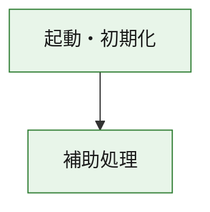
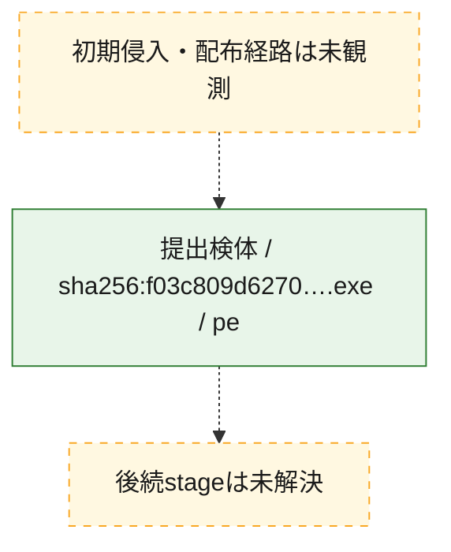
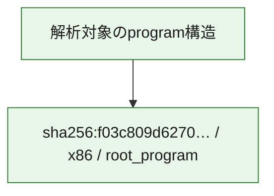

# 全体ロジック：f03c809d627059bb46b0a5cb0de6ab85393cead3809b8e07febc3dce191146b1

代表関数の静的証跡から、起動・初期化の処理群を確認しました。

## 読み方

- phaseの掲載順は解析上の整理順です。observed_call_edgesがない段階間の実行順を断定しません。
- 図の実線は静的に観測した関係、点線と黄色のノードは未観測・未解決の関係を示します。
- 図は静的な要約であり、動的実行を再現するものではありません。
- 詳細な関数解説とfingerprintは[STATIC-LOGIC.md](STATIC-LOGIC.md)を参照してください。

## 静的可視化

### 実行フロー

### 感染チェーン

### モジュール関係

## 処理段階

### 1. 起動・初期化

entry pointから初期化と後続処理への移行を確認します。
確度: `confirmed_static_function_evidence`

- `f03c809d627059bb46b0a5cb0de6ab85393cead3809b8e07febc3dce191146b1:ghidra:180001010` — 初期化と主要処理への分岐を行う入口関数です。 状態: `succeeded`、選定理由: `entry_point`, `meaningful_symbol_name`, `reviewed_call_centrality:22`, `role:entrypoint`, `small_program_complete_context`

### 2. 補助処理

主要処理を支える一般内部関数またはlibrary処理を確認します。
確度: `confirmed_static_function_evidence`

- `f03c809d627059bb46b0a5cb0de6ab85393cead3809b8e07febc3dce191146b1:ghidra:180001240` — 検体内部の一般処理を実装する関数です。 状態: `succeeded`、選定理由: `context_representative`, `reviewed_call_centrality:2`, `small_program_complete_context`
- `f03c809d627059bb46b0a5cb0de6ab85393cead3809b8e07febc3dce191146b1:ghidra:180001350` — 検体内部の一般処理を実装する関数です。 状態: `succeeded`、選定理由: `context_representative`, `reviewed_call_centrality:25`, `small_program_complete_context`
- `f03c809d627059bb46b0a5cb0de6ab85393cead3809b8e07febc3dce191146b1:ghidra:180003780` — 検体内部の一般処理を実装する関数です。 状態: `succeeded`、選定理由: `context_representative`, `reviewed_call_centrality:2`, `small_program_complete_context`
- `f03c809d627059bb46b0a5cb0de6ab85393cead3809b8e07febc3dce191146b1:ghidra:1800038e0` — 検体内部の一般処理を実装する関数です。 状態: `succeeded`、選定理由: `context_representative`, `reviewed_call_centrality:2`, `small_program_complete_context`

## 観測したcall関係

- `f03c809d627059bb46b0a5cb0de6ab85393cead3809b8e07febc3dce191146b1:ghidra:180001010` → `f03c809d627059bb46b0a5cb0de6ab85393cead3809b8e07febc3dce191146b1:ghidra:180001240` （`startup` → `support`）
- `f03c809d627059bb46b0a5cb0de6ab85393cead3809b8e07febc3dce191146b1:ghidra:180001010` → `f03c809d627059bb46b0a5cb0de6ab85393cead3809b8e07febc3dce191146b1:ghidra:180001350` （`startup` → `support`）
- `f03c809d627059bb46b0a5cb0de6ab85393cead3809b8e07febc3dce191146b1:ghidra:180001350` → `f03c809d627059bb46b0a5cb0de6ab85393cead3809b8e07febc3dce191146b1:ghidra:180001240` （`support` → `support`）
- `f03c809d627059bb46b0a5cb0de6ab85393cead3809b8e07febc3dce191146b1:ghidra:180001350` → `f03c809d627059bb46b0a5cb0de6ab85393cead3809b8e07febc3dce191146b1:ghidra:180003780` （`support` → `support`）
- `f03c809d627059bb46b0a5cb0de6ab85393cead3809b8e07febc3dce191146b1:ghidra:180001350` → `f03c809d627059bb46b0a5cb0de6ab85393cead3809b8e07febc3dce191146b1:ghidra:1800038e0` （`support` → `support`）
- `f03c809d627059bb46b0a5cb0de6ab85393cead3809b8e07febc3dce191146b1:ghidra:180003780` → `f03c809d627059bb46b0a5cb0de6ab85393cead3809b8e07febc3dce191146b1:ghidra:1800038e0` （`support` → `support`）
- `ghidra-function:0efbdf5b6cc4cf5bf65f708c` → `ghidra-external:04750464a85be6ec7b897e59` （`unclassified` → `unclassified`）
- `ghidra-function:0efbdf5b6cc4cf5bf65f708c` → `ghidra-external:130d42449edae69cf8f7ad6b` （`unclassified` → `unclassified`）
- `ghidra-function:0efbdf5b6cc4cf5bf65f708c` → `ghidra-external:1b350b667247f3d218f873da` （`unclassified` → `unclassified`）
- `ghidra-function:0efbdf5b6cc4cf5bf65f708c` → `ghidra-external:3fb1479674e47cf5e74ac7b8` （`unclassified` → `unclassified`）
- `ghidra-function:0efbdf5b6cc4cf5bf65f708c` → `ghidra-external:47a5dd8eba05274f6fb242bb` （`unclassified` → `unclassified`）
- `ghidra-function:0efbdf5b6cc4cf5bf65f708c` → `ghidra-external:49badceb8699bf36a524939a` （`unclassified` → `unclassified`）
- `ghidra-function:0efbdf5b6cc4cf5bf65f708c` → `ghidra-external:4dad421e1b060a04f405491f` （`unclassified` → `unclassified`）
- `ghidra-function:0efbdf5b6cc4cf5bf65f708c` → `ghidra-external:55d5839c27d5888a5476e36a` （`unclassified` → `unclassified`）
- `ghidra-function:0efbdf5b6cc4cf5bf65f708c` → `ghidra-external:59137e67acee5eddf07c7cfe` （`unclassified` → `unclassified`）
- `ghidra-function:0efbdf5b6cc4cf5bf65f708c` → `ghidra-external:675da7768a1383357b32e061` （`unclassified` → `unclassified`）
- `ghidra-function:0efbdf5b6cc4cf5bf65f708c` → `ghidra-external:6c18e2bc695ffd30ec632210` （`unclassified` → `unclassified`）
- `ghidra-function:0efbdf5b6cc4cf5bf65f708c` → `ghidra-external:72c5d92721de6462e41eb74b` （`unclassified` → `unclassified`）
- `ghidra-function:0efbdf5b6cc4cf5bf65f708c` → `ghidra-external:75b42069159c26387da2683b` （`unclassified` → `unclassified`）
- `ghidra-function:0efbdf5b6cc4cf5bf65f708c` → `ghidra-external:7a899576d7e74dfe3f15662e` （`unclassified` → `unclassified`）
- `ghidra-function:0efbdf5b6cc4cf5bf65f708c` → `ghidra-external:7d58741819089f9b860ca519` （`unclassified` → `unclassified`）
- `ghidra-function:0efbdf5b6cc4cf5bf65f708c` → `ghidra-external:811d924acce14d46af84c955` （`unclassified` → `unclassified`）
- `ghidra-function:0efbdf5b6cc4cf5bf65f708c` → `ghidra-external:9bf95fec0141f927aa660be6` （`unclassified` → `unclassified`）
- `ghidra-function:0efbdf5b6cc4cf5bf65f708c` → `ghidra-external:9c84fd4c7f648d0b92c3965f` （`unclassified` → `unclassified`）
- `ghidra-function:0efbdf5b6cc4cf5bf65f708c` → `ghidra-external:9e872aa40347f79b4c97b64b` （`unclassified` → `unclassified`）
- `ghidra-function:0efbdf5b6cc4cf5bf65f708c` → `ghidra-external:cc151e41363af8dc1848c618` （`unclassified` → `unclassified`）
- `ghidra-function:0efbdf5b6cc4cf5bf65f708c` → `ghidra-external:dac6d0128f348e496aac7b43` （`unclassified` → `unclassified`）
- `ghidra-function:0efbdf5b6cc4cf5bf65f708c` → `ghidra-function:5fa01f1684c747903588c8e1` （`unclassified` → `unclassified`）
- `ghidra-function:0efbdf5b6cc4cf5bf65f708c` → `ghidra-function:6ba65c081293298039cbfce8` （`unclassified` → `unclassified`）
- `ghidra-function:0efbdf5b6cc4cf5bf65f708c` → `ghidra-function:8ae6a34dea226c116ed774a1` （`unclassified` → `unclassified`）
- `ghidra-function:5f4a118576e71549e29abd5f` → `ghidra-function:0591aa6adde6beb1619864ec` （`unclassified` → `unclassified`）
- `ghidra-function:5f4a118576e71549e29abd5f` → `ghidra-function:0efbdf5b6cc4cf5bf65f708c` （`unclassified` → `unclassified`）
- `ghidra-function:5f4a118576e71549e29abd5f` → `ghidra-function:1b467edc3abf4bf7a18b62be` （`unclassified` → `unclassified`）
- `ghidra-function:5f4a118576e71549e29abd5f` → `ghidra-function:5fa01f1684c747903588c8e1` （`unclassified` → `unclassified`）
- `ghidra-function:5f4a118576e71549e29abd5f` → `ghidra-function:76d37db4d9d919f7a9c0607e` （`unclassified` → `unclassified`）
- `ghidra-function:5f4a118576e71549e29abd5f` → `ghidra-function:8206787b2dae9f9a766110e7` （`unclassified` → `unclassified`）
- `ghidra-function:5f4a118576e71549e29abd5f` → `ghidra-function:951af7ab966e25a8ad4db3e9` （`unclassified` → `unclassified`）
- `ghidra-function:5f4a118576e71549e29abd5f` → `ghidra-function:b57bd6b60a941ac277cf5dfa` （`unclassified` → `unclassified`）
- `ghidra-function:5f4a118576e71549e29abd5f` → `ghidra-function:b7741d26682fd59d7ff070ca` （`unclassified` → `unclassified`）
- `ghidra-function:5f4a118576e71549e29abd5f` → `ghidra-function:b88d4266c3f4433ecf6efefd` （`unclassified` → `unclassified`）
- `ghidra-function:5f4a118576e71549e29abd5f` → `ghidra-function:d041b2f342ddead82c306a3f` （`unclassified` → `unclassified`）
- `ghidra-function:5f4a118576e71549e29abd5f` → `ghidra-function:e804813e85df41b12195f8da` （`unclassified` → `unclassified`）
- `ghidra-function:6ba65c081293298039cbfce8` → `ghidra-function:8ae6a34dea226c116ed774a1` （`unclassified` → `unclassified`）

## 解析範囲と制約

- 選定外関数は全体inventoryへ残しますが、関数本体の個別解説対象にはしていません。
- indirect call、難読化、packer、VM、壊れたcontrol flowによりcall関係が欠落する場合があります。
- 文書は静的解析に基づき、検体実行や外部通信による動的確認は行っていません。
