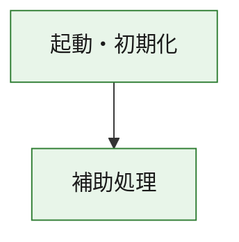
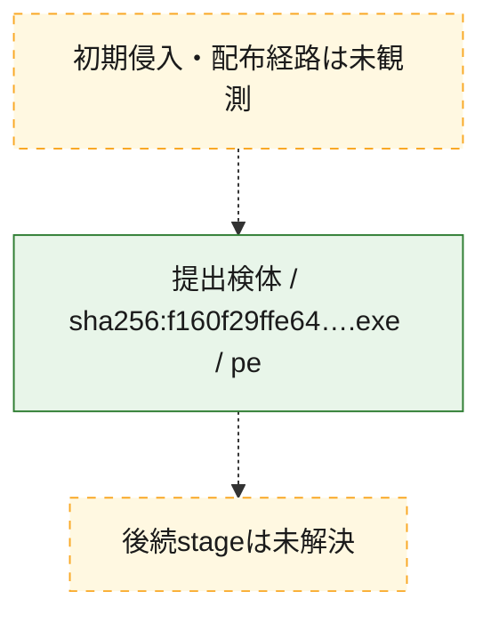
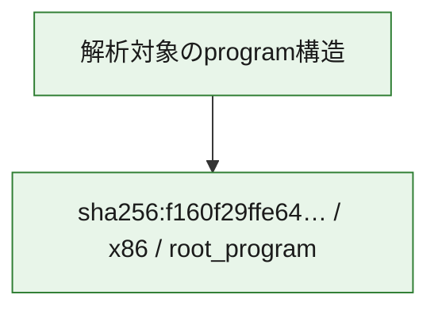

# 全体ロジック：f160f29ffe64663daeaa7f669eb6a2f67624d7c1308069aa57c2219a714dbf16

代表関数の静的証跡から、起動・初期化の処理群を確認しました。

## 読み方

- phaseの掲載順は解析上の整理順です。observed_call_edgesがない段階間の実行順を断定しません。
- 図の実線は静的に観測した関係、点線と黄色のノードは未観測・未解決の関係を示します。
- 図は静的な要約であり、動的実行を再現するものではありません。
- 詳細な関数解説とfingerprintは[STATIC-LOGIC.md](STATIC-LOGIC.md)を参照してください。

## 静的可視化

### 実行フロー

### 感染チェーン

### モジュール関係

## 処理段階

### 1. 起動・初期化

entry pointから初期化と後続処理への移行を確認します。
確度: `confirmed_static_function_evidence`

- `f160f29ffe64663daeaa7f669eb6a2f67624d7c1308069aa57c2219a714dbf16:ghidra:180001010` — 初期化と主要処理への分岐を行う入口関数です。 状態: `succeeded`、選定理由: `entry_point`, `meaningful_symbol_name`, `reviewed_call_centrality:22`, `role:entrypoint`, `small_program_complete_context`

### 2. 補助処理

主要処理を支える一般内部関数またはlibrary処理を確認します。
確度: `confirmed_static_function_evidence`

- `f160f29ffe64663daeaa7f669eb6a2f67624d7c1308069aa57c2219a714dbf16:ghidra:180001240` — 検体内部の一般処理を実装する関数です。 状態: `succeeded`、選定理由: `context_representative`, `reviewed_call_centrality:2`, `small_program_complete_context`
- `f160f29ffe64663daeaa7f669eb6a2f67624d7c1308069aa57c2219a714dbf16:ghidra:180001350` — 検体内部の一般処理を実装する関数です。 状態: `succeeded`、選定理由: `context_representative`, `reviewed_call_centrality:25`, `small_program_complete_context`
- `f160f29ffe64663daeaa7f669eb6a2f67624d7c1308069aa57c2219a714dbf16:ghidra:180003780` — 検体内部の一般処理を実装する関数です。 状態: `succeeded`、選定理由: `context_representative`, `reviewed_call_centrality:2`, `small_program_complete_context`
- `f160f29ffe64663daeaa7f669eb6a2f67624d7c1308069aa57c2219a714dbf16:ghidra:1800038e0` — 検体内部の一般処理を実装する関数です。 状態: `succeeded`、選定理由: `context_representative`, `reviewed_call_centrality:2`, `small_program_complete_context`

## 観測したcall関係

- `f160f29ffe64663daeaa7f669eb6a2f67624d7c1308069aa57c2219a714dbf16:ghidra:180001010` → `f160f29ffe64663daeaa7f669eb6a2f67624d7c1308069aa57c2219a714dbf16:ghidra:180001240` （`startup` → `support`）
- `f160f29ffe64663daeaa7f669eb6a2f67624d7c1308069aa57c2219a714dbf16:ghidra:180001010` → `f160f29ffe64663daeaa7f669eb6a2f67624d7c1308069aa57c2219a714dbf16:ghidra:180001350` （`startup` → `support`）
- `f160f29ffe64663daeaa7f669eb6a2f67624d7c1308069aa57c2219a714dbf16:ghidra:180001350` → `f160f29ffe64663daeaa7f669eb6a2f67624d7c1308069aa57c2219a714dbf16:ghidra:180001240` （`support` → `support`）
- `f160f29ffe64663daeaa7f669eb6a2f67624d7c1308069aa57c2219a714dbf16:ghidra:180001350` → `f160f29ffe64663daeaa7f669eb6a2f67624d7c1308069aa57c2219a714dbf16:ghidra:180003780` （`support` → `support`）
- `f160f29ffe64663daeaa7f669eb6a2f67624d7c1308069aa57c2219a714dbf16:ghidra:180001350` → `f160f29ffe64663daeaa7f669eb6a2f67624d7c1308069aa57c2219a714dbf16:ghidra:1800038e0` （`support` → `support`）
- `f160f29ffe64663daeaa7f669eb6a2f67624d7c1308069aa57c2219a714dbf16:ghidra:180003780` → `f160f29ffe64663daeaa7f669eb6a2f67624d7c1308069aa57c2219a714dbf16:ghidra:1800038e0` （`support` → `support`）
- `ghidra-function:42c6f624c44623a8626126d7` → `ghidra-function:6da9105908401dff0e4d0f3e` （`unclassified` → `unclassified`）
- `ghidra-function:eeaf0ed117825b767fe4a743` → `ghidra-external:0839672773781ef5d072f352` （`unclassified` → `unclassified`）
- `ghidra-function:eeaf0ed117825b767fe4a743` → `ghidra-external:17d51acb6dbb2a6127c34018` （`unclassified` → `unclassified`）
- `ghidra-function:eeaf0ed117825b767fe4a743` → `ghidra-external:3922715ceff5d2bef415d206` （`unclassified` → `unclassified`）
- `ghidra-function:eeaf0ed117825b767fe4a743` → `ghidra-external:4edd9fa6e28a9361f1c6fdac` （`unclassified` → `unclassified`）
- `ghidra-function:eeaf0ed117825b767fe4a743` → `ghidra-external:5302168cbba12218adade893` （`unclassified` → `unclassified`）
- `ghidra-function:eeaf0ed117825b767fe4a743` → `ghidra-external:5c81c516f6b811e5bd748ed8` （`unclassified` → `unclassified`）
- `ghidra-function:eeaf0ed117825b767fe4a743` → `ghidra-external:632a96353e032428ad02b07a` （`unclassified` → `unclassified`）
- `ghidra-function:eeaf0ed117825b767fe4a743` → `ghidra-external:8a0b2db1275cbd023f919db0` （`unclassified` → `unclassified`）
- `ghidra-function:eeaf0ed117825b767fe4a743` → `ghidra-external:8a8b98463a8adedf1bf3c4a7` （`unclassified` → `unclassified`）
- `ghidra-function:eeaf0ed117825b767fe4a743` → `ghidra-external:9d61f119c98a6ef918dfc601` （`unclassified` → `unclassified`）
- `ghidra-function:eeaf0ed117825b767fe4a743` → `ghidra-external:a06442a853f48ab14ea76772` （`unclassified` → `unclassified`）
- `ghidra-function:eeaf0ed117825b767fe4a743` → `ghidra-external:abe63ed0333085e293d4a381` （`unclassified` → `unclassified`）
- `ghidra-function:eeaf0ed117825b767fe4a743` → `ghidra-external:b5f6b4e68492c1e243eea340` （`unclassified` → `unclassified`）
- `ghidra-function:eeaf0ed117825b767fe4a743` → `ghidra-external:b87281a76d3fa60b4098f711` （`unclassified` → `unclassified`）
- `ghidra-function:eeaf0ed117825b767fe4a743` → `ghidra-external:c3dd5050464178ca6b38d0f2` （`unclassified` → `unclassified`）
- `ghidra-function:eeaf0ed117825b767fe4a743` → `ghidra-external:c42d66bb7c769b8474ffccd7` （`unclassified` → `unclassified`）
- `ghidra-function:eeaf0ed117825b767fe4a743` → `ghidra-external:c5384d1c22486be4e784d77d` （`unclassified` → `unclassified`）
- `ghidra-function:eeaf0ed117825b767fe4a743` → `ghidra-external:cb908367026ecabd9e32827f` （`unclassified` → `unclassified`）
- `ghidra-function:eeaf0ed117825b767fe4a743` → `ghidra-external:d393e2811edf9dec770ccc42` （`unclassified` → `unclassified`）
- `ghidra-function:eeaf0ed117825b767fe4a743` → `ghidra-external:fa00134ba85824b35f31da15` （`unclassified` → `unclassified`）
- `ghidra-function:eeaf0ed117825b767fe4a743` → `ghidra-external:fcd8c1c79d6747318f7dee72` （`unclassified` → `unclassified`）
- `ghidra-function:eeaf0ed117825b767fe4a743` → `ghidra-function:42c6f624c44623a8626126d7` （`unclassified` → `unclassified`）
- `ghidra-function:eeaf0ed117825b767fe4a743` → `ghidra-function:57320b3278df34c9712e53e2` （`unclassified` → `unclassified`）
- `ghidra-function:eeaf0ed117825b767fe4a743` → `ghidra-function:6da9105908401dff0e4d0f3e` （`unclassified` → `unclassified`）
- `ghidra-function:f72b544870283d03fefbc429` → `ghidra-function:11919b65bf99465d573a9d71` （`unclassified` → `unclassified`）
- `ghidra-function:f72b544870283d03fefbc429` → `ghidra-function:17eb3d23ec08972e3c125f9e` （`unclassified` → `unclassified`）
- `ghidra-function:f72b544870283d03fefbc429` → `ghidra-function:2cf5eeb9897636aadb0c39f3` （`unclassified` → `unclassified`）
- `ghidra-function:f72b544870283d03fefbc429` → `ghidra-function:306c6c0acd4f0addaf4880c4` （`unclassified` → `unclassified`）
- `ghidra-function:f72b544870283d03fefbc429` → `ghidra-function:441d273926666588ef236a65` （`unclassified` → `unclassified`）
- `ghidra-function:f72b544870283d03fefbc429` → `ghidra-function:5167af4ec90776decf0952c4` （`unclassified` → `unclassified`）
- `ghidra-function:f72b544870283d03fefbc429` → `ghidra-function:57320b3278df34c9712e53e2` （`unclassified` → `unclassified`）
- `ghidra-function:f72b544870283d03fefbc429` → `ghidra-function:76996d15b4703552f788d868` （`unclassified` → `unclassified`）
- `ghidra-function:f72b544870283d03fefbc429` → `ghidra-function:b335f0a0255703162be3e1c0` （`unclassified` → `unclassified`）
- `ghidra-function:f72b544870283d03fefbc429` → `ghidra-function:c4e8748045192b9a5a615e69` （`unclassified` → `unclassified`）
- `ghidra-function:f72b544870283d03fefbc429` → `ghidra-function:eeaf0ed117825b767fe4a743` （`unclassified` → `unclassified`）
- `ghidra-function:f72b544870283d03fefbc429` → `ghidra-function:f322d10df3b9db90e337956f` （`unclassified` → `unclassified`）

## 解析範囲と制約

- 選定外関数は全体inventoryへ残しますが、関数本体の個別解説対象にはしていません。
- indirect call、難読化、packer、VM、壊れたcontrol flowによりcall関係が欠落する場合があります。
- 文書は静的解析に基づき、検体実行や外部通信による動的確認は行っていません。
