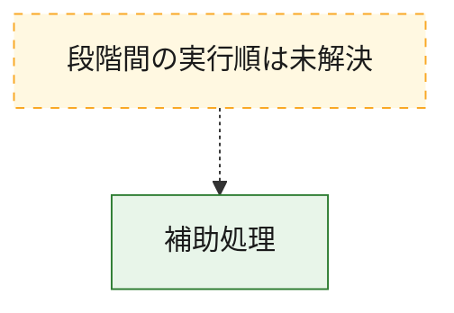
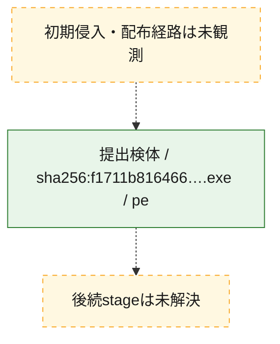
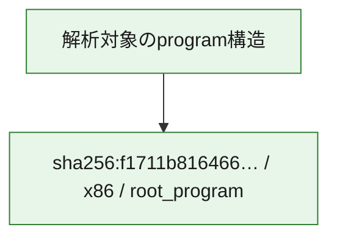

# 全体ロジック：f1711b816466428b20ece9ebaa81ca377fd758771a33c959f46be582b1f4404d

代表関数から主要なmalware処理段階を自動分類できませんでした。

## 読み方

- phaseの掲載順は解析上の整理順です。observed_call_edgesがない段階間の実行順を断定しません。
- 図の実線は静的に観測した関係、点線と黄色のノードは未観測・未解決の関係を示します。
- 図は静的な要約であり、動的実行を再現するものではありません。
- 詳細な関数解説とfingerprintは[STATIC-LOGIC.md](STATIC-LOGIC.md)を参照してください。

## 静的可視化

### 実行フロー

### 感染チェーン

### モジュール関係

## 処理段階

### 1. 補助処理

主要処理を支える一般内部関数またはlibrary処理を確認します。
確度: `confirmed_static_function_evidence`

- `f1711b816466428b20ece9ebaa81ca377fd758771a33c959f46be582b1f4404d:ghidra:140001000` — 検体内部の一般処理を実装する関数です。 状態: `succeeded`、選定理由: `context_representative`, `reviewed_call_centrality:8`
- `f1711b816466428b20ece9ebaa81ca377fd758771a33c959f46be582b1f4404d:ghidra:1400012a0` — 検体内部の一般処理を実装する関数です。 状態: `succeeded`、選定理由: `context_representative`, `reviewed_call_centrality:3`
- `f1711b816466428b20ece9ebaa81ca377fd758771a33c959f46be582b1f4404d:ghidra:140001320` — 検体内部の一般処理を実装する関数です。 状態: `succeeded`、選定理由: `context_representative`, `reviewed_call_centrality:3`
- `f1711b816466428b20ece9ebaa81ca377fd758771a33c959f46be582b1f4404d:ghidra:140001380` — 検体内部の一般処理を実装する関数です。 状態: `succeeded`、選定理由: `context_representative`, `reviewed_call_centrality:2`
- `f1711b816466428b20ece9ebaa81ca377fd758771a33c959f46be582b1f4404d:ghidra:1400013c0` — 検体内部の一般処理を実装する関数です。 状態: `succeeded`、選定理由: `context_representative`, `reviewed_call_centrality:4`
- `f1711b816466428b20ece9ebaa81ca377fd758771a33c959f46be582b1f4404d:ghidra:140001540` — 検体内部の一般処理を実装する関数です。 状態: `succeeded`、選定理由: `context_representative`, `reviewed_call_centrality:2`
- `f1711b816466428b20ece9ebaa81ca377fd758771a33c959f46be582b1f4404d:ghidra:140001620` — 検体内部の一般処理を実装する関数です。 状態: `succeeded`、選定理由: `context_representative`, `reviewed_call_centrality:5`
- `f1711b816466428b20ece9ebaa81ca377fd758771a33c959f46be582b1f4404d:ghidra:1400019e0` — 検体内部の一般処理を実装する関数です。 状態: `succeeded`、選定理由: `context_representative`, `reviewed_call_centrality:2`
- `f1711b816466428b20ece9ebaa81ca377fd758771a33c959f46be582b1f4404d:ghidra:140001a60` — 検体内部の一般処理を実装する関数です。 状態: `succeeded`、選定理由: `context_representative`, `reviewed_call_centrality:1`
- `f1711b816466428b20ece9ebaa81ca377fd758771a33c959f46be582b1f4404d:ghidra:140001ae0` — 検体内部の一般処理を実装する関数です。 状態: `succeeded`、選定理由: `context_representative`, `reviewed_call_centrality:2`
- `f1711b816466428b20ece9ebaa81ca377fd758771a33c959f46be582b1f4404d:ghidra:140001ba0` — 検体内部の一般処理を実装する関数です。 状態: `succeeded`、選定理由: `context_representative`, `reviewed_call_centrality:2`
- `f1711b816466428b20ece9ebaa81ca377fd758771a33c959f46be582b1f4404d:ghidra:140001d00` — 検体内部の一般処理を実装する関数です。 状態: `succeeded`、選定理由: `context_representative`, `reviewed_call_centrality:2`
- `f1711b816466428b20ece9ebaa81ca377fd758771a33c959f46be582b1f4404d:ghidra:140001d60` — 検体内部の一般処理を実装する関数です。 状態: `succeeded`、選定理由: `context_representative`, `reviewed_call_centrality:4`
- `f1711b816466428b20ece9ebaa81ca377fd758771a33c959f46be582b1f4404d:ghidra:140001de0` — 検体内部の一般処理を実装する関数です。 状態: `succeeded`、選定理由: `context_representative`, `reviewed_call_centrality:5`
- `f1711b816466428b20ece9ebaa81ca377fd758771a33c959f46be582b1f4404d:ghidra:140001e80` — 検体内部の一般処理を実装する関数です。 状態: `succeeded`、選定理由: `context_representative`, `reviewed_call_centrality:5`
- `f1711b816466428b20ece9ebaa81ca377fd758771a33c959f46be582b1f4404d:ghidra:140001f80` — 検体内部の一般処理を実装する関数です。 状態: `succeeded`、選定理由: `context_representative`, `reviewed_call_centrality:7`
- `f1711b816466428b20ece9ebaa81ca377fd758771a33c959f46be582b1f4404d:ghidra:1400023e0` — 検体内部の一般処理を実装する関数です。 状態: `succeeded`、選定理由: `context_representative`, `reviewed_call_centrality:3`
- `f1711b816466428b20ece9ebaa81ca377fd758771a33c959f46be582b1f4404d:ghidra:140002440` — 検体内部の一般処理を実装する関数です。 状態: `succeeded`、選定理由: `context_representative`, `reviewed_call_centrality:2`
- `f1711b816466428b20ece9ebaa81ca377fd758771a33c959f46be582b1f4404d:ghidra:140002460` — 検体内部の一般処理を実装する関数です。 状態: `succeeded`、選定理由: `context_representative`, `reviewed_call_centrality:2`
- `f1711b816466428b20ece9ebaa81ca377fd758771a33c959f46be582b1f4404d:ghidra:140002480` — 検体内部の一般処理を実装する関数です。 状態: `succeeded`、選定理由: `context_representative`, `reviewed_call_centrality:2`
- `f1711b816466428b20ece9ebaa81ca377fd758771a33c959f46be582b1f4404d:ghidra:1400024a0` — 検体内部の一般処理を実装する関数です。 状態: `succeeded`、選定理由: `context_representative`, `reviewed_call_centrality:3`
- `f1711b816466428b20ece9ebaa81ca377fd758771a33c959f46be582b1f4404d:ghidra:1400024e0` — 検体内部の一般処理を実装する関数です。 状態: `succeeded`、選定理由: `context_representative`, `reviewed_call_centrality:2`
- `f1711b816466428b20ece9ebaa81ca377fd758771a33c959f46be582b1f4404d:ghidra:140002500` — 検体内部の一般処理を実装する関数です。 状態: `succeeded`、選定理由: `context_representative`, `reviewed_call_centrality:2`
- `f1711b816466428b20ece9ebaa81ca377fd758771a33c959f46be582b1f4404d:ghidra:140002520` — 検体内部の一般処理を実装する関数です。 状態: `succeeded`、選定理由: `context_representative`, `reviewed_call_centrality:3`
- `f1711b816466428b20ece9ebaa81ca377fd758771a33c959f46be582b1f4404d:ghidra:140002560` — 検体内部の一般処理を実装する関数です。 状態: `succeeded`、選定理由: `context_representative`, `reviewed_call_centrality:3`
- `f1711b816466428b20ece9ebaa81ca377fd758771a33c959f46be582b1f4404d:ghidra:1400025e0` — 検体内部の一般処理を実装する関数です。 状態: `succeeded`、選定理由: `context_representative`, `reviewed_call_centrality:3`
- `f1711b816466428b20ece9ebaa81ca377fd758771a33c959f46be582b1f4404d:ghidra:140002760` — 検体内部の一般処理を実装する関数です。 状態: `succeeded`、選定理由: `context_representative`, `reviewed_call_centrality:5`
- `f1711b816466428b20ece9ebaa81ca377fd758771a33c959f46be582b1f4404d:ghidra:140002ae0` — 検体内部の一般処理を実装する関数です。 状態: `succeeded`、選定理由: `context_representative`, `reviewed_call_centrality:5`
- `f1711b816466428b20ece9ebaa81ca377fd758771a33c959f46be582b1f4404d:ghidra:140002e40` — 検体内部の一般処理を実装する関数です。 状態: `succeeded`、選定理由: `context_representative`, `reviewed_call_centrality:5`
- `f1711b816466428b20ece9ebaa81ca377fd758771a33c959f46be582b1f4404d:ghidra:140003200` — 検体内部の一般処理を実装する関数です。 状態: `succeeded`、選定理由: `context_representative`, `reviewed_call_centrality:5`
- `f1711b816466428b20ece9ebaa81ca377fd758771a33c959f46be582b1f4404d:ghidra:1400035e0` — 検体内部の一般処理を実装する関数です。 状態: `succeeded`、選定理由: `context_representative`, `reviewed_call_centrality:5`
- `f1711b816466428b20ece9ebaa81ca377fd758771a33c959f46be582b1f4404d:ghidra:140003940` — 検体内部の一般処理を実装する関数です。 状態: `succeeded`、選定理由: `context_representative`, `reviewed_call_centrality:5`

## 観測したcall関係

- `f1711b816466428b20ece9ebaa81ca377fd758771a33c959f46be582b1f4404d:ghidra:1400024a0` → `f1711b816466428b20ece9ebaa81ca377fd758771a33c959f46be582b1f4404d:ghidra:140001d60` （`support` → `support`）
- `f1711b816466428b20ece9ebaa81ca377fd758771a33c959f46be582b1f4404d:ghidra:140002520` → `f1711b816466428b20ece9ebaa81ca377fd758771a33c959f46be582b1f4404d:ghidra:140001de0` （`support` → `support`）
- `f1711b816466428b20ece9ebaa81ca377fd758771a33c959f46be582b1f4404d:ghidra:1400025e0` → `f1711b816466428b20ece9ebaa81ca377fd758771a33c959f46be582b1f4404d:ghidra:140001e80` （`support` → `support`）
- `ghidra-function:0457522d56221d2f5362714b` → `ghidra-external:39bf5e266e6222542b34dabb` （`unclassified` → `unclassified`）
- `ghidra-function:0457522d56221d2f5362714b` → `ghidra-function:12ab7b5d31aaa787c42d4304` （`unclassified` → `unclassified`）
- `ghidra-function:0457522d56221d2f5362714b` → `ghidra-function:a12daf0859d37376ea3e1f67` （`unclassified` → `unclassified`）
- `ghidra-function:12ab7b5d31aaa787c42d4304` → `ghidra-external:39bf5e266e6222542b34dabb` （`unclassified` → `unclassified`）
- `ghidra-function:12ab7b5d31aaa787c42d4304` → `ghidra-external:ef9cfda58cf16dcee717aa5f` （`unclassified` → `unclassified`）
- `ghidra-function:12ab7b5d31aaa787c42d4304` → `ghidra-function:6efe1200c3ebb9481ba1b41e` （`unclassified` → `unclassified`）
- `ghidra-function:12ab7b5d31aaa787c42d4304` → `ghidra-function:fab5d97a64b87b9e6281fcc2` （`unclassified` → `unclassified`）
- `ghidra-function:22068e108e111727cabe84d1` → `ghidra-external:39bf5e266e6222542b34dabb` （`unclassified` → `unclassified`）
- `ghidra-function:22068e108e111727cabe84d1` → `ghidra-function:126aeb4582fe49be34e2c3cf` （`unclassified` → `unclassified`）
- `ghidra-function:22068e108e111727cabe84d1` → `ghidra-function:1e33a4075301ec7f5f7761f9` （`unclassified` → `unclassified`）
- `ghidra-function:22068e108e111727cabe84d1` → `ghidra-function:45f121cfaffd2f2148077499` （`unclassified` → `unclassified`）
- `ghidra-function:22068e108e111727cabe84d1` → `ghidra-function:a4b17d3638adc9dd9303bb56` （`unclassified` → `unclassified`）
- `ghidra-function:22068e108e111727cabe84d1` → `ghidra-function:aee6db45e5ca8f934865b750` （`unclassified` → `unclassified`）
- `ghidra-function:22068e108e111727cabe84d1` → `ghidra-function:c1689cbb5c5f8e621c597ab6` （`unclassified` → `unclassified`）
- `ghidra-function:22068e108e111727cabe84d1` → `ghidra-function:dcbb8fed42844b542ce9a63a` （`unclassified` → `unclassified`）
- `ghidra-function:39e51cedcef6929726fc70f1` → `ghidra-external:c6a43ea26a885a3d5452b805` （`unclassified` → `unclassified`）
- `ghidra-function:39e51cedcef6929726fc70f1` → `ghidra-function:3751fc9f45da73ad16791f22` （`unclassified` → `unclassified`）
- `ghidra-function:39e51cedcef6929726fc70f1` → `ghidra-function:fab5d97a64b87b9e6281fcc2` （`unclassified` → `unclassified`）
- `ghidra-function:3ae0a68afdfb44d0f57d3f7e` → `ghidra-external:39bf5e266e6222542b34dabb` （`unclassified` → `unclassified`）
- `ghidra-function:3ae0a68afdfb44d0f57d3f7e` → `ghidra-function:3751fc9f45da73ad16791f22` （`unclassified` → `unclassified`）
- `ghidra-function:3ae0a68afdfb44d0f57d3f7e` → `ghidra-function:848df6bc309504466ef9d06b` （`unclassified` → `unclassified`）
- `ghidra-function:3ae0a68afdfb44d0f57d3f7e` → `ghidra-function:bb76300d1f11ee6e4f39e79b` （`unclassified` → `unclassified`）
- `ghidra-function:3ae0a68afdfb44d0f57d3f7e` → `ghidra-function:f039c82c52ccb344084a26d3` （`unclassified` → `unclassified`）
- `ghidra-function:48677ccba12f017542432c1f` → `ghidra-external:39bf5e266e6222542b34dabb` （`unclassified` → `unclassified`）
- `ghidra-function:48677ccba12f017542432c1f` → `ghidra-function:67713c7b785f2474ca456c75` （`unclassified` → `unclassified`）
- `ghidra-function:48677ccba12f017542432c1f` → `ghidra-function:a12daf0859d37376ea3e1f67` （`unclassified` → `unclassified`）
- `ghidra-function:48acd9da2db1ab6b643c599b` → `ghidra-external:c6a43ea26a885a3d5452b805` （`unclassified` → `unclassified`）
- `ghidra-function:48acd9da2db1ab6b643c599b` → `ghidra-function:fab5d97a64b87b9e6281fcc2` （`unclassified` → `unclassified`）
- `ghidra-function:5db155500be17aa4d14ff9ef` → `ghidra-external:c6a43ea26a885a3d5452b805` （`unclassified` → `unclassified`）
- `ghidra-function:5db155500be17aa4d14ff9ef` → `ghidra-function:a12daf0859d37376ea3e1f67` （`unclassified` → `unclassified`）
- `ghidra-function:5f8114816756fd55989bf52b` → `ghidra-external:39bf5e266e6222542b34dabb` （`unclassified` → `unclassified`）
- `ghidra-function:5f8114816756fd55989bf52b` → `ghidra-function:3751fc9f45da73ad16791f22` （`unclassified` → `unclassified`）
- `ghidra-function:5f8114816756fd55989bf52b` → `ghidra-function:848df6bc309504466ef9d06b` （`unclassified` → `unclassified`）
- `ghidra-function:5f8114816756fd55989bf52b` → `ghidra-function:bb76300d1f11ee6e4f39e79b` （`unclassified` → `unclassified`）
- `ghidra-function:5f8114816756fd55989bf52b` → `ghidra-function:f039c82c52ccb344084a26d3` （`unclassified` → `unclassified`）
- `ghidra-function:67713c7b785f2474ca456c75` → `ghidra-external:48e51c573f2301da3deacc4b` （`unclassified` → `unclassified`）
- `ghidra-function:67713c7b785f2474ca456c75` → `ghidra-external:c6a43ea26a885a3d5452b805` （`unclassified` → `unclassified`）
- `ghidra-function:67713c7b785f2474ca456c75` → `ghidra-function:fab5d97a64b87b9e6281fcc2` （`unclassified` → `unclassified`）
- `ghidra-function:6ee3531fa23a9a0682a4fd73` → `ghidra-external:c6a43ea26a885a3d5452b805` （`unclassified` → `unclassified`）
- `ghidra-function:6ee3531fa23a9a0682a4fd73` → `ghidra-function:a12daf0859d37376ea3e1f67` （`unclassified` → `unclassified`）
- `ghidra-function:6f570b054a3cfe599a9ec821` → `ghidra-external:39bf5e266e6222542b34dabb` （`unclassified` → `unclassified`）
- `ghidra-function:6f570b054a3cfe599a9ec821` → `ghidra-function:a12daf0859d37376ea3e1f67` （`unclassified` → `unclassified`）
- `ghidra-function:6f570b054a3cfe599a9ec821` → `ghidra-function:e4c2eb6d11c2ac0aa0215111` （`unclassified` → `unclassified`）
- `ghidra-function:6f79b2d86feae2c4c32e982f` → `ghidra-external:39bf5e266e6222542b34dabb` （`unclassified` → `unclassified`）
- `ghidra-function:6f79b2d86feae2c4c32e982f` → `ghidra-external:3c394aae60ac46309876a007` （`unclassified` → `unclassified`）
- `ghidra-function:737f06d15f55befff337101e` → `ghidra-external:c6a43ea26a885a3d5452b805` （`unclassified` → `unclassified`）
- `ghidra-function:737f06d15f55befff337101e` → `ghidra-function:3751fc9f45da73ad16791f22` （`unclassified` → `unclassified`）
- `ghidra-function:7cb69a4a0bd7a673992a8aa6` → `ghidra-external:39bf5e266e6222542b34dabb` （`unclassified` → `unclassified`）
- `ghidra-function:7cb69a4a0bd7a673992a8aa6` → `ghidra-function:3751fc9f45da73ad16791f22` （`unclassified` → `unclassified`）
- `ghidra-function:7cb69a4a0bd7a673992a8aa6` → `ghidra-function:f039c82c52ccb344084a26d3` （`unclassified` → `unclassified`）
- `ghidra-function:824f881196962b4b6ce8a47e` → `ghidra-external:29b80a6f6812d9bfd6aa6397` （`unclassified` → `unclassified`）
- `ghidra-function:824f881196962b4b6ce8a47e` → `ghidra-external:39bf5e266e6222542b34dabb` （`unclassified` → `unclassified`）
- `ghidra-function:824f881196962b4b6ce8a47e` → `ghidra-external:b0b3cfb4188318a0b5f67c0b` （`unclassified` → `unclassified`）
- `ghidra-function:824f881196962b4b6ce8a47e` → `ghidra-function:f039c82c52ccb344084a26d3` （`unclassified` → `unclassified`）
- `ghidra-function:8d00c6011ad94d916c44c3f9` → `ghidra-external:39bf5e266e6222542b34dabb` （`unclassified` → `unclassified`）
- `ghidra-function:8d00c6011ad94d916c44c3f9` → `ghidra-function:3751fc9f45da73ad16791f22` （`unclassified` → `unclassified`）
- `ghidra-function:8d00c6011ad94d916c44c3f9` → `ghidra-function:848df6bc309504466ef9d06b` （`unclassified` → `unclassified`）
- `ghidra-function:8d00c6011ad94d916c44c3f9` → `ghidra-function:bb76300d1f11ee6e4f39e79b` （`unclassified` → `unclassified`）
- `ghidra-function:8d00c6011ad94d916c44c3f9` → `ghidra-function:f039c82c52ccb344084a26d3` （`unclassified` → `unclassified`）
- `ghidra-function:a0634567f61cd44704b71efb` → `ghidra-external:39bf5e266e6222542b34dabb` （`unclassified` → `unclassified`）
- `ghidra-function:a0634567f61cd44704b71efb` → `ghidra-function:3751fc9f45da73ad16791f22` （`unclassified` → `unclassified`）
- `ghidra-function:a0634567f61cd44704b71efb` → `ghidra-function:848df6bc309504466ef9d06b` （`unclassified` → `unclassified`）
- `ghidra-function:a0634567f61cd44704b71efb` → `ghidra-function:bb76300d1f11ee6e4f39e79b` （`unclassified` → `unclassified`）
- `ghidra-function:a0634567f61cd44704b71efb` → `ghidra-function:f039c82c52ccb344084a26d3` （`unclassified` → `unclassified`）
- `ghidra-function:adc705bcfb3a1d3abf976423` → `ghidra-external:39bf5e266e6222542b34dabb` （`unclassified` → `unclassified`）
- `ghidra-function:adc705bcfb3a1d3abf976423` → `ghidra-external:f234384171178f959a543d37` （`unclassified` → `unclassified`）
- `ghidra-function:adc705bcfb3a1d3abf976423` → `ghidra-function:0adbd587ada6fd44f18b6a40` （`unclassified` → `unclassified`）
- `ghidra-function:adc705bcfb3a1d3abf976423` → `ghidra-function:3751fc9f45da73ad16791f22` （`unclassified` → `unclassified`）
- `ghidra-function:adc705bcfb3a1d3abf976423` → `ghidra-function:4692ec381410c6f11ddedb9a` （`unclassified` → `unclassified`）
- `ghidra-function:adc705bcfb3a1d3abf976423` → `ghidra-function:5960b35b310336c8d3912a58` （`unclassified` → `unclassified`）
- `ghidra-function:adc705bcfb3a1d3abf976423` → `ghidra-function:f039c82c52ccb344084a26d3` （`unclassified` → `unclassified`）
- `ghidra-function:b2ee84b0ab5b80aa0fc3fd5c` → `ghidra-external:c6a43ea26a885a3d5452b805` （`unclassified` → `unclassified`）
- `ghidra-function:b2ee84b0ab5b80aa0fc3fd5c` → `ghidra-function:fab5d97a64b87b9e6281fcc2` （`unclassified` → `unclassified`）
- `ghidra-function:b876d5f7d7c8e01a99cbe9f9` → `ghidra-external:39bf5e266e6222542b34dabb` （`unclassified` → `unclassified`）
- `ghidra-function:b876d5f7d7c8e01a99cbe9f9` → `ghidra-function:3751fc9f45da73ad16791f22` （`unclassified` → `unclassified`）
- `ghidra-function:b876d5f7d7c8e01a99cbe9f9` → `ghidra-function:848df6bc309504466ef9d06b` （`unclassified` → `unclassified`）
- `ghidra-function:b876d5f7d7c8e01a99cbe9f9` → `ghidra-function:bb76300d1f11ee6e4f39e79b` （`unclassified` → `unclassified`）
- `ghidra-function:b876d5f7d7c8e01a99cbe9f9` → `ghidra-function:f039c82c52ccb344084a26d3` （`unclassified` → `unclassified`）
- `ghidra-function:bfb71c187676b8304d20f59b` → `ghidra-external:c6a43ea26a885a3d5452b805` （`unclassified` → `unclassified`）
- `ghidra-function:bfb71c187676b8304d20f59b` → `ghidra-function:3751fc9f45da73ad16791f22` （`unclassified` → `unclassified`）
- `ghidra-function:c0f158896ad24007c9544d9d` → `ghidra-external:c6a43ea26a885a3d5452b805` （`unclassified` → `unclassified`）
- `ghidra-function:c0f158896ad24007c9544d9d` → `ghidra-function:3751fc9f45da73ad16791f22` （`unclassified` → `unclassified`）
- `ghidra-function:d74b17903834a14a29df6642` → `ghidra-external:c6a43ea26a885a3d5452b805` （`unclassified` → `unclassified`）
- `ghidra-function:d74b17903834a14a29df6642` → `ghidra-function:a12daf0859d37376ea3e1f67` （`unclassified` → `unclassified`）
- `ghidra-function:db35474cc6adb68c1c54c0ff` → `ghidra-external:c6a43ea26a885a3d5452b805` （`unclassified` → `unclassified`）
- `ghidra-function:db35474cc6adb68c1c54c0ff` → `ghidra-function:3751fc9f45da73ad16791f22` （`unclassified` → `unclassified`）
- `ghidra-function:db35474cc6adb68c1c54c0ff` → `ghidra-function:a12daf0859d37376ea3e1f67` （`unclassified` → `unclassified`）
- `ghidra-function:dd09ffa5f929256d1c707a9f` → `ghidra-external:39bf5e266e6222542b34dabb` （`unclassified` → `unclassified`）
- `ghidra-function:dd09ffa5f929256d1c707a9f` → `ghidra-function:3751fc9f45da73ad16791f22` （`unclassified` → `unclassified`）
- `ghidra-function:dd09ffa5f929256d1c707a9f` → `ghidra-function:848df6bc309504466ef9d06b` （`unclassified` → `unclassified`）
- `ghidra-function:dd09ffa5f929256d1c707a9f` → `ghidra-function:bb76300d1f11ee6e4f39e79b` （`unclassified` → `unclassified`）
- `ghidra-function:dd09ffa5f929256d1c707a9f` → `ghidra-function:f039c82c52ccb344084a26d3` （`unclassified` → `unclassified`）
- `ghidra-function:e1b559629845e2d9654955c5` → `ghidra-external:c6a43ea26a885a3d5452b805` （`unclassified` → `unclassified`）
- `ghidra-function:e1b559629845e2d9654955c5` → `ghidra-function:a12daf0859d37376ea3e1f67` （`unclassified` → `unclassified`）
- `ghidra-function:e231f1fd75e1014bae5db36b` → `ghidra-external:c6a43ea26a885a3d5452b805` （`unclassified` → `unclassified`）
- `ghidra-function:e231f1fd75e1014bae5db36b` → `ghidra-function:a12daf0859d37376ea3e1f67` （`unclassified` → `unclassified`）
- `ghidra-function:e231f1fd75e1014bae5db36b` → `ghidra-function:fab5d97a64b87b9e6281fcc2` （`unclassified` → `unclassified`）
- `ghidra-function:e4c2eb6d11c2ac0aa0215111` → `ghidra-external:39bf5e266e6222542b34dabb` （`unclassified` → `unclassified`）
- `ghidra-function:e4c2eb6d11c2ac0aa0215111` → `ghidra-external:ef9cfda58cf16dcee717aa5f` （`unclassified` → `unclassified`）
- `ghidra-function:e4c2eb6d11c2ac0aa0215111` → `ghidra-function:6efe1200c3ebb9481ba1b41e` （`unclassified` → `unclassified`）
- `ghidra-function:e4c2eb6d11c2ac0aa0215111` → `ghidra-function:fab5d97a64b87b9e6281fcc2` （`unclassified` → `unclassified`）
- `ghidra-function:e9bed58c43343a19fe997ed7` → `ghidra-function:3751fc9f45da73ad16791f22` （`unclassified` → `unclassified`）
- `ghidra-function:ee2821a3b2974cae054d3207` → `ghidra-external:39bf5e266e6222542b34dabb` （`unclassified` → `unclassified`）
- `ghidra-function:ee2821a3b2974cae054d3207` → `ghidra-function:3751fc9f45da73ad16791f22` （`unclassified` → `unclassified`）
- `ghidra-function:ee2821a3b2974cae054d3207` → `ghidra-function:848df6bc309504466ef9d06b` （`unclassified` → `unclassified`）
- `ghidra-function:ee2821a3b2974cae054d3207` → `ghidra-function:bb76300d1f11ee6e4f39e79b` （`unclassified` → `unclassified`）
- `ghidra-function:ee2821a3b2974cae054d3207` → `ghidra-function:f039c82c52ccb344084a26d3` （`unclassified` → `unclassified`）
- `ghidra-function:fe178b846167a9da09313533` → `ghidra-external:c6a43ea26a885a3d5452b805` （`unclassified` → `unclassified`）
- `ghidra-function:fe178b846167a9da09313533` → `ghidra-function:a12daf0859d37376ea3e1f67` （`unclassified` → `unclassified`）

## 解析範囲と制約

- 選定外関数は全体inventoryへ残しますが、関数本体の個別解説対象にはしていません。
- indirect call、難読化、packer、VM、壊れたcontrol flowによりcall関係が欠落する場合があります。
- 文書は静的解析に基づき、検体実行や外部通信による動的確認は行っていません。
