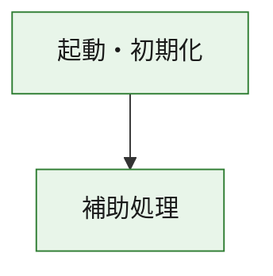
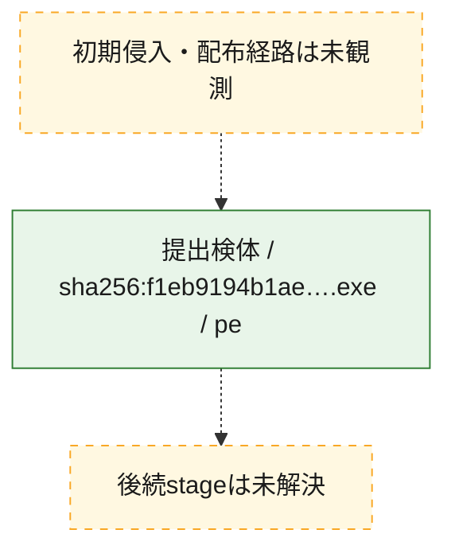
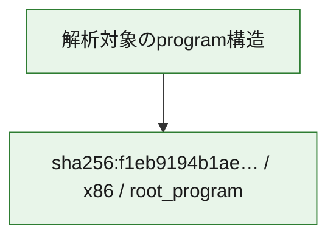

# 全体ロジック：f1eb9194b1ae67191fef40eec80b73a19019ac1b90b0eae2cf5362b4beff7941

代表関数の静的証跡から、起動・初期化の処理群を確認しました。

## 読み方

- phaseの掲載順は解析上の整理順です。observed_call_edgesがない段階間の実行順を断定しません。
- 図の実線は静的に観測した関係、点線と黄色のノードは未観測・未解決の関係を示します。
- 図は静的な要約であり、動的実行を再現するものではありません。
- 詳細な関数解説とfingerprintは[STATIC-LOGIC.md](STATIC-LOGIC.md)を参照してください。

## 静的可視化

### 実行フロー

### 感染チェーン

### モジュール関係

## 処理段階

### 1. 起動・初期化

entry pointから初期化と後続処理への移行を確認します。
確度: `confirmed_static_function_evidence`

- `f1eb9194b1ae67191fef40eec80b73a19019ac1b90b0eae2cf5362b4beff7941:ghidra:180001010` — 初期化と主要処理への分岐を行う入口関数です。 状態: `succeeded`、選定理由: `entry_point`, `meaningful_symbol_name`, `reviewed_call_centrality:22`, `role:entrypoint`, `small_program_complete_context`

### 2. 補助処理

主要処理を支える一般内部関数またはlibrary処理を確認します。
確度: `confirmed_static_function_evidence`

- `f1eb9194b1ae67191fef40eec80b73a19019ac1b90b0eae2cf5362b4beff7941:ghidra:180001240` — 検体内部の一般処理を実装する関数です。 状態: `succeeded`、選定理由: `context_representative`, `reviewed_call_centrality:2`, `small_program_complete_context`
- `f1eb9194b1ae67191fef40eec80b73a19019ac1b90b0eae2cf5362b4beff7941:ghidra:180001350` — 検体内部の一般処理を実装する関数です。 状態: `succeeded`、選定理由: `context_representative`, `reviewed_call_centrality:25`, `small_program_complete_context`
- `f1eb9194b1ae67191fef40eec80b73a19019ac1b90b0eae2cf5362b4beff7941:ghidra:180003780` — 検体内部の一般処理を実装する関数です。 状態: `succeeded`、選定理由: `context_representative`, `reviewed_call_centrality:2`, `small_program_complete_context`
- `f1eb9194b1ae67191fef40eec80b73a19019ac1b90b0eae2cf5362b4beff7941:ghidra:1800038e0` — 検体内部の一般処理を実装する関数です。 状態: `succeeded`、選定理由: `context_representative`, `reviewed_call_centrality:2`, `small_program_complete_context`

## 観測したcall関係

- `f1eb9194b1ae67191fef40eec80b73a19019ac1b90b0eae2cf5362b4beff7941:ghidra:180001010` → `f1eb9194b1ae67191fef40eec80b73a19019ac1b90b0eae2cf5362b4beff7941:ghidra:180001240` （`startup` → `support`）
- `f1eb9194b1ae67191fef40eec80b73a19019ac1b90b0eae2cf5362b4beff7941:ghidra:180001010` → `f1eb9194b1ae67191fef40eec80b73a19019ac1b90b0eae2cf5362b4beff7941:ghidra:180001350` （`startup` → `support`）
- `f1eb9194b1ae67191fef40eec80b73a19019ac1b90b0eae2cf5362b4beff7941:ghidra:180001350` → `f1eb9194b1ae67191fef40eec80b73a19019ac1b90b0eae2cf5362b4beff7941:ghidra:180001240` （`support` → `support`）
- `f1eb9194b1ae67191fef40eec80b73a19019ac1b90b0eae2cf5362b4beff7941:ghidra:180001350` → `f1eb9194b1ae67191fef40eec80b73a19019ac1b90b0eae2cf5362b4beff7941:ghidra:180003780` （`support` → `support`）
- `f1eb9194b1ae67191fef40eec80b73a19019ac1b90b0eae2cf5362b4beff7941:ghidra:180001350` → `f1eb9194b1ae67191fef40eec80b73a19019ac1b90b0eae2cf5362b4beff7941:ghidra:1800038e0` （`support` → `support`）
- `f1eb9194b1ae67191fef40eec80b73a19019ac1b90b0eae2cf5362b4beff7941:ghidra:180003780` → `f1eb9194b1ae67191fef40eec80b73a19019ac1b90b0eae2cf5362b4beff7941:ghidra:1800038e0` （`support` → `support`）
- `ghidra-function:4f72fc31cd797e3a587756d1` → `ghidra-function:073dd905f343b83bd9d080c6` （`unclassified` → `unclassified`）
- `ghidra-function:4f72fc31cd797e3a587756d1` → `ghidra-function:0ef8ea746e673c4da7febbc5` （`unclassified` → `unclassified`）
- `ghidra-function:4f72fc31cd797e3a587756d1` → `ghidra-function:38e3a9e224828a7c38e2e78d` （`unclassified` → `unclassified`）
- `ghidra-function:4f72fc31cd797e3a587756d1` → `ghidra-function:640f630e84523e47fd18091c` （`unclassified` → `unclassified`）
- `ghidra-function:4f72fc31cd797e3a587756d1` → `ghidra-function:82bb252cda984c13f75c1fc8` （`unclassified` → `unclassified`）
- `ghidra-function:4f72fc31cd797e3a587756d1` → `ghidra-function:9252f1983d494200d2c2b472` （`unclassified` → `unclassified`）
- `ghidra-function:4f72fc31cd797e3a587756d1` → `ghidra-function:a281a98c0f82b963a6b9b7e3` （`unclassified` → `unclassified`）
- `ghidra-function:4f72fc31cd797e3a587756d1` → `ghidra-function:a3ade509e0e486010bc00ad5` （`unclassified` → `unclassified`）
- `ghidra-function:4f72fc31cd797e3a587756d1` → `ghidra-function:d6f3b6d512c25476240db789` （`unclassified` → `unclassified`）
- `ghidra-function:4f72fc31cd797e3a587756d1` → `ghidra-function:f0e3a1a17f73ba6c9f33d143` （`unclassified` → `unclassified`）
- `ghidra-function:4f72fc31cd797e3a587756d1` → `ghidra-function:f0ebaf29f6283767d21b8f40` （`unclassified` → `unclassified`）
- `ghidra-function:4f72fc31cd797e3a587756d1` → `ghidra-function:f704a5e1b9414ffecf7d6ae9` （`unclassified` → `unclassified`）
- `ghidra-function:8675d4e705dc3e04bf78aa60` → `ghidra-function:54800be9007ffb9f9370242b` （`unclassified` → `unclassified`）
- `ghidra-function:f0e3a1a17f73ba6c9f33d143` → `ghidra-external:2ad17a3007ada6bcb1fab9a6` （`unclassified` → `unclassified`）
- `ghidra-function:f0e3a1a17f73ba6c9f33d143` → `ghidra-external:40fb18842fdecac94cb8b6dd` （`unclassified` → `unclassified`）
- `ghidra-function:f0e3a1a17f73ba6c9f33d143` → `ghidra-external:49d5784d9c6650b138e5a7a6` （`unclassified` → `unclassified`）
- `ghidra-function:f0e3a1a17f73ba6c9f33d143` → `ghidra-external:50ff2c686be59491021be49a` （`unclassified` → `unclassified`）
- `ghidra-function:f0e3a1a17f73ba6c9f33d143` → `ghidra-external:58df40a69590bf8aaf5d2ad0` （`unclassified` → `unclassified`）
- `ghidra-function:f0e3a1a17f73ba6c9f33d143` → `ghidra-external:5cb01325e1737f6ca50b6a8f` （`unclassified` → `unclassified`）
- `ghidra-function:f0e3a1a17f73ba6c9f33d143` → `ghidra-external:6858f9a23910d39a4f3ab7b6` （`unclassified` → `unclassified`）
- `ghidra-function:f0e3a1a17f73ba6c9f33d143` → `ghidra-external:68c0fa4906bb193968182510` （`unclassified` → `unclassified`）
- `ghidra-function:f0e3a1a17f73ba6c9f33d143` → `ghidra-external:71c17e8774d46df2c0ee11bb` （`unclassified` → `unclassified`）
- `ghidra-function:f0e3a1a17f73ba6c9f33d143` → `ghidra-external:728265a1d9b0fca3ebab6431` （`unclassified` → `unclassified`）
- `ghidra-function:f0e3a1a17f73ba6c9f33d143` → `ghidra-external:76728197c176a10ec50ef900` （`unclassified` → `unclassified`）
- `ghidra-function:f0e3a1a17f73ba6c9f33d143` → `ghidra-external:8e88e26496e0d80ff20fd0b0` （`unclassified` → `unclassified`）
- `ghidra-function:f0e3a1a17f73ba6c9f33d143` → `ghidra-external:91f45b6f378a13ba183335dc` （`unclassified` → `unclassified`）
- `ghidra-function:f0e3a1a17f73ba6c9f33d143` → `ghidra-external:93be65c42b05006e0481b77a` （`unclassified` → `unclassified`）
- `ghidra-function:f0e3a1a17f73ba6c9f33d143` → `ghidra-external:957c3b901dc6e06e6a358a8a` （`unclassified` → `unclassified`）
- `ghidra-function:f0e3a1a17f73ba6c9f33d143` → `ghidra-external:b2ed2c651fbadd3516e90cca` （`unclassified` → `unclassified`）
- `ghidra-function:f0e3a1a17f73ba6c9f33d143` → `ghidra-external:c3632b8f84a090aa8a11083c` （`unclassified` → `unclassified`）
- `ghidra-function:f0e3a1a17f73ba6c9f33d143` → `ghidra-external:c7a785e32fe9e2d463b29b0f` （`unclassified` → `unclassified`）
- `ghidra-function:f0e3a1a17f73ba6c9f33d143` → `ghidra-external:cdc691ce06d787db75f8ec87` （`unclassified` → `unclassified`）
- `ghidra-function:f0e3a1a17f73ba6c9f33d143` → `ghidra-external:db645d1388d6f4c9f118a284` （`unclassified` → `unclassified`）
- `ghidra-function:f0e3a1a17f73ba6c9f33d143` → `ghidra-external:ef54cc0760699fa9c87593d9` （`unclassified` → `unclassified`）
- `ghidra-function:f0e3a1a17f73ba6c9f33d143` → `ghidra-function:54800be9007ffb9f9370242b` （`unclassified` → `unclassified`）
- `ghidra-function:f0e3a1a17f73ba6c9f33d143` → `ghidra-function:640f630e84523e47fd18091c` （`unclassified` → `unclassified`）
- `ghidra-function:f0e3a1a17f73ba6c9f33d143` → `ghidra-function:8675d4e705dc3e04bf78aa60` （`unclassified` → `unclassified`）

## 解析範囲と制約

- 選定外関数は全体inventoryへ残しますが、関数本体の個別解説対象にはしていません。
- indirect call、難読化、packer、VM、壊れたcontrol flowによりcall関係が欠落する場合があります。
- 文書は静的解析に基づき、検体実行や外部通信による動的確認は行っていません。
