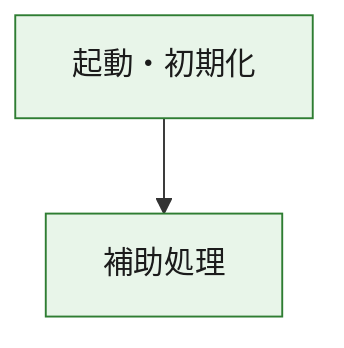
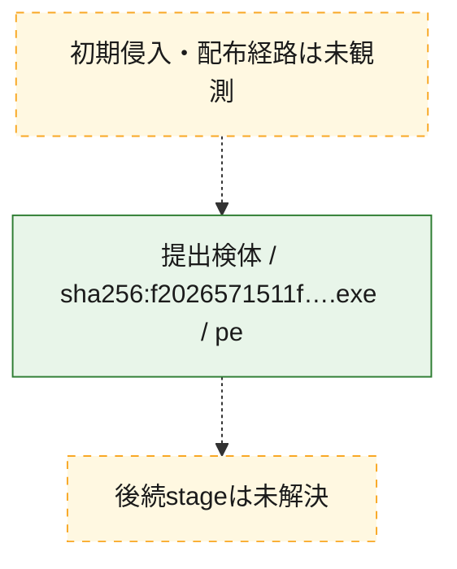
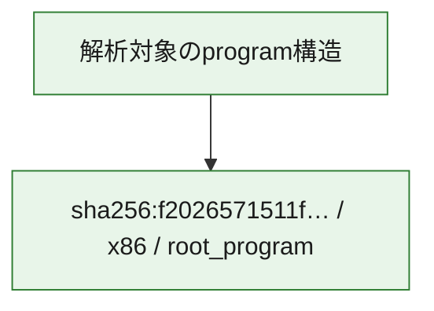

# 全体ロジック：f2026571511ffb052a9a31673889e5cbd57dfdc09f8f83c477a6edecb265c8ca

代表関数の静的証跡から、起動・初期化の処理群を確認しました。

## 読み方

- phaseの掲載順は解析上の整理順です。observed_call_edgesがない段階間の実行順を断定しません。
- 図の実線は静的に観測した関係、点線と黄色のノードは未観測・未解決の関係を示します。
- 図は静的な要約であり、動的実行を再現するものではありません。
- 詳細な関数解説とfingerprintは[STATIC-LOGIC.md](STATIC-LOGIC.md)を参照してください。

## 静的可視化

### 実行フロー

### 感染チェーン

### モジュール関係

## 処理段階

### 1. 起動・初期化

entry pointから初期化と後続処理への移行を確認します。
確度: `confirmed_static_function_evidence`

- `f2026571511ffb052a9a31673889e5cbd57dfdc09f8f83c477a6edecb265c8ca:ghidra:180001010` — 初期化と主要処理への分岐を行う入口関数です。 状態: `succeeded`、選定理由: `entry_point`, `meaningful_symbol_name`, `reviewed_call_centrality:22`, `role:entrypoint`, `small_program_complete_context`

### 2. 補助処理

主要処理を支える一般内部関数またはlibrary処理を確認します。
確度: `confirmed_static_function_evidence`

- `f2026571511ffb052a9a31673889e5cbd57dfdc09f8f83c477a6edecb265c8ca:ghidra:180001240` — 検体内部の一般処理を実装する関数です。 状態: `succeeded`、選定理由: `context_representative`, `reviewed_call_centrality:2`, `small_program_complete_context`
- `f2026571511ffb052a9a31673889e5cbd57dfdc09f8f83c477a6edecb265c8ca:ghidra:180001350` — 検体内部の一般処理を実装する関数です。 状態: `succeeded`、選定理由: `context_representative`, `reviewed_call_centrality:25`, `small_program_complete_context`
- `f2026571511ffb052a9a31673889e5cbd57dfdc09f8f83c477a6edecb265c8ca:ghidra:180003780` — 検体内部の一般処理を実装する関数です。 状態: `succeeded`、選定理由: `context_representative`, `reviewed_call_centrality:2`, `small_program_complete_context`
- `f2026571511ffb052a9a31673889e5cbd57dfdc09f8f83c477a6edecb265c8ca:ghidra:1800038e0` — 検体内部の一般処理を実装する関数です。 状態: `succeeded`、選定理由: `context_representative`, `reviewed_call_centrality:2`, `small_program_complete_context`

## 観測したcall関係

- `f2026571511ffb052a9a31673889e5cbd57dfdc09f8f83c477a6edecb265c8ca:ghidra:180001010` → `f2026571511ffb052a9a31673889e5cbd57dfdc09f8f83c477a6edecb265c8ca:ghidra:180001240` （`startup` → `support`）
- `f2026571511ffb052a9a31673889e5cbd57dfdc09f8f83c477a6edecb265c8ca:ghidra:180001010` → `f2026571511ffb052a9a31673889e5cbd57dfdc09f8f83c477a6edecb265c8ca:ghidra:180001350` （`startup` → `support`）
- `f2026571511ffb052a9a31673889e5cbd57dfdc09f8f83c477a6edecb265c8ca:ghidra:180001350` → `f2026571511ffb052a9a31673889e5cbd57dfdc09f8f83c477a6edecb265c8ca:ghidra:180001240` （`support` → `support`）
- `f2026571511ffb052a9a31673889e5cbd57dfdc09f8f83c477a6edecb265c8ca:ghidra:180001350` → `f2026571511ffb052a9a31673889e5cbd57dfdc09f8f83c477a6edecb265c8ca:ghidra:180003780` （`support` → `support`）
- `f2026571511ffb052a9a31673889e5cbd57dfdc09f8f83c477a6edecb265c8ca:ghidra:180001350` → `f2026571511ffb052a9a31673889e5cbd57dfdc09f8f83c477a6edecb265c8ca:ghidra:1800038e0` （`support` → `support`）
- `f2026571511ffb052a9a31673889e5cbd57dfdc09f8f83c477a6edecb265c8ca:ghidra:180003780` → `f2026571511ffb052a9a31673889e5cbd57dfdc09f8f83c477a6edecb265c8ca:ghidra:1800038e0` （`support` → `support`）
- `ghidra-function:4b73e25337dde97afb78043c` → `ghidra-function:7fa2a3ca300003c35ebfe11e` （`unclassified` → `unclassified`）
- `ghidra-function:6005296d4fc8535f136ab2ac` → `ghidra-external:000d20aae51f4f6d5e3fd2eb` （`unclassified` → `unclassified`）
- `ghidra-function:6005296d4fc8535f136ab2ac` → `ghidra-external:15334d58d3e3eadcfddb197e` （`unclassified` → `unclassified`）
- `ghidra-function:6005296d4fc8535f136ab2ac` → `ghidra-external:2db874d06e1196f4a3aa607a` （`unclassified` → `unclassified`）
- `ghidra-function:6005296d4fc8535f136ab2ac` → `ghidra-external:2ea2fb43a012123f155e8ed0` （`unclassified` → `unclassified`）
- `ghidra-function:6005296d4fc8535f136ab2ac` → `ghidra-external:5e29d6fd95c0933bec7bedd3` （`unclassified` → `unclassified`）
- `ghidra-function:6005296d4fc8535f136ab2ac` → `ghidra-external:6965d8adc04af7358dee07f7` （`unclassified` → `unclassified`）
- `ghidra-function:6005296d4fc8535f136ab2ac` → `ghidra-external:6ceb649ebd4361a0ff907f24` （`unclassified` → `unclassified`）
- `ghidra-function:6005296d4fc8535f136ab2ac` → `ghidra-external:7dcbadad852e93ab1e56e514` （`unclassified` → `unclassified`）
- `ghidra-function:6005296d4fc8535f136ab2ac` → `ghidra-external:8354e45713d58518cd4c56cf` （`unclassified` → `unclassified`）
- `ghidra-function:6005296d4fc8535f136ab2ac` → `ghidra-external:842178f80c6ccf1deac13a18` （`unclassified` → `unclassified`）
- `ghidra-function:6005296d4fc8535f136ab2ac` → `ghidra-external:94e4e75991aef9eb69e61c6b` （`unclassified` → `unclassified`）
- `ghidra-function:6005296d4fc8535f136ab2ac` → `ghidra-external:b8a1461280af054b50e61412` （`unclassified` → `unclassified`）
- `ghidra-function:6005296d4fc8535f136ab2ac` → `ghidra-external:bdae9b0e483511427777c0f4` （`unclassified` → `unclassified`）
- `ghidra-function:6005296d4fc8535f136ab2ac` → `ghidra-external:ce8372f7ab7c2ec4a5988212` （`unclassified` → `unclassified`）
- `ghidra-function:6005296d4fc8535f136ab2ac` → `ghidra-external:d35272b82689d1cdd8b24087` （`unclassified` → `unclassified`）
- `ghidra-function:6005296d4fc8535f136ab2ac` → `ghidra-external:da55bc30d3a9c2f6d8c9640f` （`unclassified` → `unclassified`）
- `ghidra-function:6005296d4fc8535f136ab2ac` → `ghidra-external:edccc9969a821170a5b66554` （`unclassified` → `unclassified`）
- `ghidra-function:6005296d4fc8535f136ab2ac` → `ghidra-external:f106e38f2aadee6858abf907` （`unclassified` → `unclassified`）
- `ghidra-function:6005296d4fc8535f136ab2ac` → `ghidra-external:f2bbf10d709d8b6f61a3f977` （`unclassified` → `unclassified`）
- `ghidra-function:6005296d4fc8535f136ab2ac` → `ghidra-external:f4b3bdf369216bb55a304286` （`unclassified` → `unclassified`）
- `ghidra-function:6005296d4fc8535f136ab2ac` → `ghidra-external:fcbd984ebed680de1ad83a7a` （`unclassified` → `unclassified`）
- `ghidra-function:6005296d4fc8535f136ab2ac` → `ghidra-function:4b73e25337dde97afb78043c` （`unclassified` → `unclassified`）
- `ghidra-function:6005296d4fc8535f136ab2ac` → `ghidra-function:6bcd1e58455593692d4a30ec` （`unclassified` → `unclassified`）
- `ghidra-function:6005296d4fc8535f136ab2ac` → `ghidra-function:7fa2a3ca300003c35ebfe11e` （`unclassified` → `unclassified`）
- `ghidra-function:d32a713e062621050685b016` → `ghidra-function:0e28989cc0a0aa2ac0a10fc2` （`unclassified` → `unclassified`）
- `ghidra-function:d32a713e062621050685b016` → `ghidra-function:179f0a25bbc6579da5588be0` （`unclassified` → `unclassified`）
- `ghidra-function:d32a713e062621050685b016` → `ghidra-function:4b619d0091223e0d8fbfc8df` （`unclassified` → `unclassified`）
- `ghidra-function:d32a713e062621050685b016` → `ghidra-function:516d21f49a787d5a61fe42f9` （`unclassified` → `unclassified`）
- `ghidra-function:d32a713e062621050685b016` → `ghidra-function:6005296d4fc8535f136ab2ac` （`unclassified` → `unclassified`）
- `ghidra-function:d32a713e062621050685b016` → `ghidra-function:6b586663b0610b9a763b4f05` （`unclassified` → `unclassified`）
- `ghidra-function:d32a713e062621050685b016` → `ghidra-function:6bcd1e58455593692d4a30ec` （`unclassified` → `unclassified`）
- `ghidra-function:d32a713e062621050685b016` → `ghidra-function:a71988245ed16d928494de36` （`unclassified` → `unclassified`）
- `ghidra-function:d32a713e062621050685b016` → `ghidra-function:a894d51b23ac7f8f95f74586` （`unclassified` → `unclassified`）
- `ghidra-function:d32a713e062621050685b016` → `ghidra-function:bda1c6dd017397f8624a1271` （`unclassified` → `unclassified`）
- `ghidra-function:d32a713e062621050685b016` → `ghidra-function:dc5fcfbcfb40f4491b1ea935` （`unclassified` → `unclassified`）
- `ghidra-function:d32a713e062621050685b016` → `ghidra-function:fc0f64e68484f135d4db4b3c` （`unclassified` → `unclassified`）

## 解析範囲と制約

- 選定外関数は全体inventoryへ残しますが、関数本体の個別解説対象にはしていません。
- indirect call、難読化、packer、VM、壊れたcontrol flowによりcall関係が欠落する場合があります。
- 文書は静的解析に基づき、検体実行や外部通信による動的確認は行っていません。
